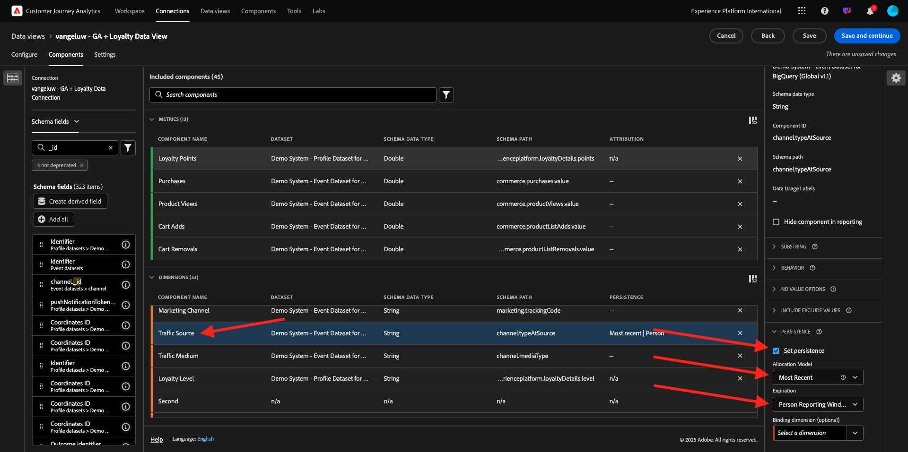
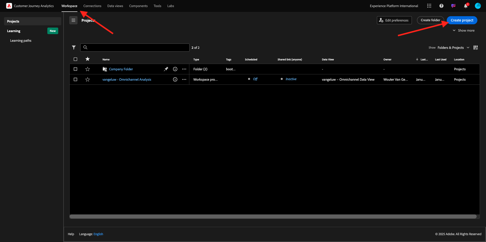
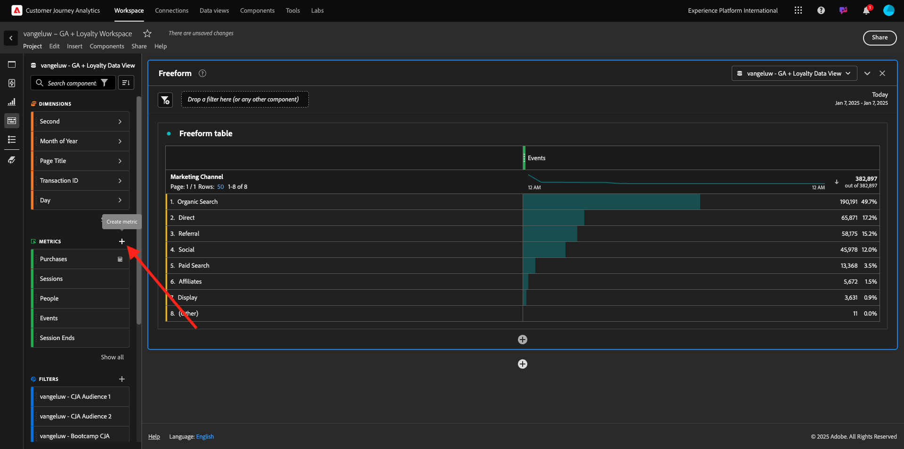
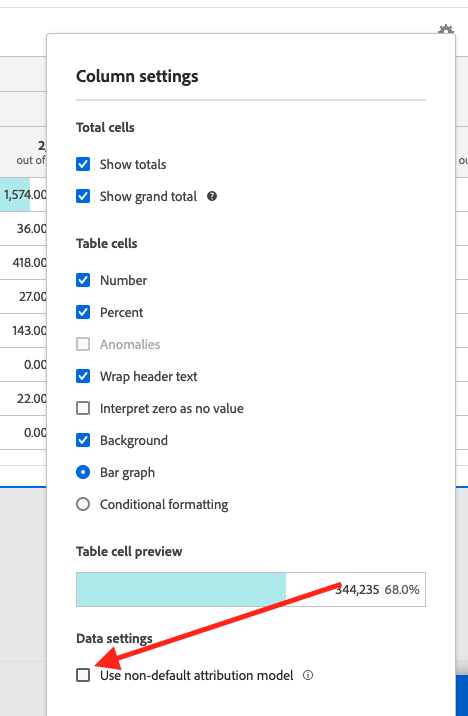

# 1.2.5 Analizzare i dati Google Analytics tramite Customer Journey Analytics

## Obiettivi

- Connettere il set di dati BigQuery a Customer Journey Analytics (CJA)
- Connetti e unisciti a Google Analytics con Dati fedeltà.
- Acquisire familiarità con l’interfaccia utente di CJA

## 1.2.5.1 Creare una connessione

Vai a [analytics.adobe.com](https://analytics.adobe.com) per accedere a Customer Journey Analytics.

Nella home page di Customer Journey Analytics, vai a **Connessioni**.

Qui puoi vedere tutte le diverse connessioni effettuate tra CJA e Platform. Queste connessioni hanno lo stesso obiettivo delle suite di rapporti in Adobe Analytics. Tuttavia, la raccolta dei dati è totalmente diversa. Tutti i dati provengono dai set di dati di Adobe Experience Platform.

Fare clic su **Crea nuova connessione**.

Verrà visualizzata l&#39;interfaccia utente **Crea connessione**.

Per il nome, utilizzare: `--aepUserLdap-- - GA + Loyalty Data Connection`.

Devi selezionare la sandbox corretta da utilizzare. Nel menu sandbox, seleziona la sandbox, che dovrebbe essere `--aepSandboxName--`. In questo esempio, la sandbox da utilizzare è **Tech Insiders**.

Impostare il **numero medio di eventi giornalieri** su **meno di 1 milione**.

Nel menu del set di dati, ora puoi iniziare ad aggiungere set di dati. Fare clic su **Aggiungi set di dati**.

I set di dati da aggiungere sono:
- `Demo System - Profile Dataset for CRM (Global v1.1)`
- `Demo System - Event Dataset for BigQuery (Global v1.1)`

Cerca entrambi i set di dati, seleziona la relativa casella di controllo e fai clic su **Avanti**.

A questo punto viene visualizzato quanto segue:

Per il set di dati `Demo System - Event Dataset for BigQuery (Global v1.1)`, modificare **ID persona** in **ID fedeltà** e impostare il **tipo origine dati** in **Dati Web**. Abilita entrambe le opzioni per **Importa tutti i nuovi dati** e **Recupera tutti i dati esistenti**.

Per il set di dati `Demo System - Event Dataset for BigQuery (Global v1.1)`, verificare che l&#39;**ID persona** sia impostato su **crmId** e impostare il **tipo di origine dati** su **Dati Web**. Abilita entrambe le opzioni per **Importa tutti i nuovi dati** e **Recupera tutti i dati esistenti**. Fare clic su **Aggiungi set di dati**.

Allora sarai qui. Fai clic su **Salva**.

Dopo aver creato la **connessione**, potrebbero essere necessarie alcune ore prima che i dati siano disponibili in CJA.

La connessione verrà quindi visualizzata nell&#39;elenco delle connessioni disponibili.

## 1.2.5.2 Creare una visualizzazione dati

Una volta stabilita la connessione, ora puoi passare a influenzare la visualizzazione. Una differenza tra Adobe Analytics e CJA è che CJA necessita di una visualizzazione dati per pulire e preparare i dati prima della visualizzazione.

Una visualizzazione dati è simile al concetto di suite di rapporti virtuali in Adobe Analytics, in cui puoi definire le definizioni delle visite in base al contesto, filtrare e anche chiamare i componenti.

È necessaria almeno una visualizzazione dati per connessione. Tuttavia, per alcuni casi d’uso, è utile disporre di più visualizzazioni dati per la stessa connessione, con l’obiettivo di fornire informazioni diverse a team diversi.

Se desideri che la tua azienda diventi basata sui dati, devi adattare il modo in cui i dati vengono visualizzati in ogni team. Alcuni esempi:

- Metriche UX solo per il team di progettazione UX
- Per KPI e metriche per Google Analytics utilizza gli stessi nomi utilizzati per Customer Journey Analytics, in modo che il team di analisi digitale possa parlare una sola lingua.
- visualizzazione dati filtrata per mostrare, ad esempio, i dati per 1 solo mercato, 1 marchio o solo per dispositivi mobili.

Nella schermata **Connessioni**, seleziona la casella di controllo davanti alla connessione appena creata. Fare clic su **Crea visualizzazione dati**.

Verrai reindirizzato al flusso di lavoro **Crea visualizzazione dati**.

Ora puoi configurare le definizioni di base per la visualizzazione dati. Cose come Fuso orario, Timeout sessione o il filtro della visualizzazione dati (la parte di segmentazione simile alle suite di rapporti virtuali in Adobe Analytics).

La **connessione** creata nell&#39;esercizio precedente è già selezionata. La connessione si chiama `--aepUserLdap-- - GA + Loyalty Data Connection`.

Assegnare quindi un nome alla visualizzazione dati seguendo questa convenzione di denominazione: `--aepUserLdap-- - GA + Loyalty Data View`.

Immettere lo stesso valore per la descrizione: `--aepUserLdap-- - GA + Loyalty Data View`.

Prima di eseguire un’analisi o una visualizzazione è necessario creare una visualizzazione dati con tutti i campi, le dimensioni e le metriche e le relative impostazioni di attribuzione.

| Campo | Convenzione di denominazione |
| ----------------- |-------------|  
| Nome connessione | `--aepUserLdap-- - GA + Loyalty Data View` | vangeluw - GA + Visualizzazione dati fedeltà |
| Descrizione | `--aepUserLdap-- - GA + Loyalty Data View` |
| ID esterno | `--aepUserLdap--GA` |

Fai clic su **Salva e continua**.

Fai clic su **Salva**.

Ora puoi aggiungere componenti alla visualizzazione dati. Come puoi vedere, alcune metriche e dimensioni vengono aggiunte automaticamente.

Aggiungi i seguenti componenti alla visualizzazione dati. Assicurati anche di aggiornare i nomi dei campi con nomi descrittivi. A questo scopo, seleziona la metrica o la dimensione e aggiorna il campo **Nome componente** nel menu a destra.

| Tipo di componente | Nome originale componente | Nome visualizzato | Percorso componente |
| -----------------| -----------------|-----------------|-----------------|
| Metrica | commerce.checkouts.value | Pagamenti | `commerce.checkouts.value` |
| Metrica | commerce.productListRemovals.value | Rimozioni carrello | `commerce.productListRemovals.value` |
| Metrica | commerce.productListAdds | Aggiunte al carrello | `commerce.productListAdds` |
| Metrica | commerce.productViews.value | Visualizzazioni prodotto | `commerce.productViews.value` |
| Metrica | commerce.purchases.value | Acquisti | `commerce.purchases.value` |
| Metrica | web.webPageDetails.pageViews | Page Views | `web.webPageDetails.pageViews` |
| Metrica | punti | Punti fedeltà | `_experienceplatform.loyaltyDetails.points` |
| Dimensione | livello | Livello di fedeltà | `_experienceplatform.loyaltyDetails.level` |
| Dimensione | channel.mediaType | Medium traffico | `channel.mediaType` |
| Dimensione | channel.typeAtSource | Traffic Source | `channel.typeAtSource` |
| Dimensione | Codice di tracking | Canale di marketing | `marketing.trackingCode` |
| Dimensione | gaid | ID GOOGLE ANALYTICS | `_experienceplatform.identification.core.gaid` |
| Dimensione | web.webPageDetails.name | Titolo pagina | `web.webPageDetails.name` |
| Dimensione | Fornitore | Browser | `environment.browserDetails.vendor` |
| Dimensione | Tipo | Device Type | `device.type` |
| Dimensione | loyaltyId | ID fedeltà | `_experienceplatform.identification.core.loyaltyId` |
| Dimensione | commerce.order.payments.transactionID | ID transazione | `commerce.order.payments.transactionID` |
| Dimensione | eventType | Tipo evento | `eventType` |
| Dimensione | timestamp | Timestamp | `timestamp` |
| Dimensione | `_id` | Identificatore | `_id` |

Avrai quindi qualcosa di simile a questo:

È quindi necessario apportare alcune modifiche al contesto Persona e Sessione per alcuni di questi componenti modificando le **Impostazioni di attribuzione o persistenza**.

Modifica le **impostazioni di attribuzione** per i seguenti componenti:

| Componente |
| -----------------|
| Traffic Source |
| Canale di marketing |
| Browser |
| Medium traffico |
| Device Type |
| ID GOOGLE ANALYTICS |

A tale scopo, selezionare il componente, fare clic su **Usa modello di attribuzione personalizzato** e impostare **Modello** su **Più recente** e **Scadenza** su **Finestra di reporting persona**. Ripetere l&#39;operazione per tutti i componenti sopra indicati.

Dopo aver apportato le modifiche nelle impostazioni di attribuzione per tutti i componenti sopra menzionati, dovresti disporre di questa visualizzazione. Fai clic su **Salva e continua**.

Nella schermata **Impostazioni** non sono richieste modifiche. Fai clic su **Salva e termina**.

Ora puoi analizzare i dati di Google Analytics all’interno di Adobe Analytics Analysis Workspace. Passiamo all&#39;esercizio successivo.

## 1.2.5.3 Creare il progetto

In Customer Journey Analytics, vai a **Workspace**. Fai clic su **Crea progetto**

Seleziona **Progetto Workspace vuoto** e fai clic su **Crea**.

Ora disponi di un progetto vuoto:

Innanzitutto, salva il progetto e assegna un nome. Per salvare, puoi utilizzare il seguente comando:

| Sistema operativo | Scelta rapida |
| ----------------- |-------------| 
| Windows | Ctrl+S |
| Mac | Comando+S |

Vedrete questo pop-up. Utilizza questa convenzione per i nomi:

| Nome | Descrizione |
| ----------------- |-------------| 
| `--aepUserLdap-- – GA + Loyalty Workspace` | `--aepUserLdap-- – GA + Loyalty Workspace` |

Fare clic su **Salva**.

Quindi, assicurati di selezionare la visualizzazione dati corretta nell’angolo superiore destro dello schermo. Questa è la visualizzazione dati creata nell&#39;esercizio precedente, con la convenzione di denominazione `--aepUserLdap-- - GA + Loyalty Data View`.

### 1.2.5.3.1 Tabelle a forma libera

Le tabelle a forma libera funzionano più o meno come tabelle pivot all’interno di Excel. Prendi un elemento dalla barra a sinistra, lo trascini nella figura a mano libera e otterrai un rapporto di tabella.

Le tabelle a forma libera sono quasi illimitate. Puoi fare (quasi) qualsiasi cosa, e questo offre così tanto valore se paragonato a Google Analytics (poiché questo strumento ha alcune limitazioni di analisi). Questo è uno dei motivi per cui puoi caricare i dati di Google Analytics in un altro strumento di analisi.

Vediamo due esempi in cui è necessario utilizzare SQL, BigQuery e un po’ di tempo per rispondere a semplici domande che non è possibile fare nell’interfaccia utente di Google Analytics o Google Data Studio:

- Quante persone arrivano al pagamento dal browser Safari suddiviso per canale di marketing? La metrica di pagamento è filtrata dal browser Safari. Abbiamo appena trascinato e rilasciato la variabile Browser = Safari sopra la colonna di checkout.

- Come analista, vedo che il canale di social marketing ha basse conversioni. Per impostazione predefinita utilizzo l’attribuzione Ultimo contatto, ma cosa succede con Primo contatto? Passando il puntatore del mouse su una metrica, vengono visualizzate le impostazioni della metrica. Lì posso selezionare il modello di attribuzione desiderato. Puoi eseguire l’attribuzione in GA (non in data studio) come attività autonoma, ma non puoi avere altre metriche o dimensioni non correlate all’analisi dell’attribuzione all’interno della stessa tabella.

Rispondiamo a questa domanda e ad altre con Analysis Workspace in CJA.

Selezionare innanzitutto l&#39;intervallo di date corretto (**Oggi**) sul lato destro del pannello. Clic **Applica**.

>[!NOTE]
>
>Se hai appena creato la **connessione dati** e la **visualizzazione dati**, potresti dover attendere un paio d&#39;ore. CJA richiede un po’ di tempo per recuperare i dati storici in presenza di una grande quantità di record di dati.

Trasciniamo alcune dimensioni e metriche per analizzare i canali di marketing. Utilizza innanzitutto la dimensione **Canale di marketing** e trascinala nell&#39;area di lavoro della **tabella a forma libera**. (Fai clic su **Mostra tutto** nel caso in cui la metrica non venga visualizzata immediatamente nel menu Metriche)

A questo punto viene visualizzato quanto segue:

Successivamente, devi aggiungere le metriche alla tabella a forma libera. È necessario aggiungere le metriche seguenti: **Persone**, **Sessioni**, **Visualizzazioni prodotto**, **Pagamenti**, **Acquisti**, **Tasso di conversione** (metrica calcolata).

Prima di eseguire questa operazione, è necessario creare la metrica calcolata **Tasso di conversione**. A tale scopo, fare clic sull&#39;icona **+** accanto a Metriche:

Come nome per la metrica calcolata, utilizzare **Tasso di conversione** e **tasso di conversione** per **ID esterno**. Trascina quindi le metriche **purchase** e **Sessions** nell&#39;area di lavoro. Imposta **Formato** su **Percentuale** e **Cifre decimali** su **2**. Infine, fare clic su **Salva**.

Fai clic su **Salva**.

Quindi, per utilizzare tutte queste metriche nella **Tabella a forma libera**, trascinale una alla volta nella **Tabella a forma libera**. Vedi l’esempio seguente.

Finirai con un tavolo come questo:

Come accennato in precedenza, le **tabelle a forma libera** ti offrono la libertà necessaria per eseguire analisi approfondite. Ad esempio, puoi scegliere qualsiasi altro Dimension per suddividere una specifica metrica all’interno della tabella.

Ad esempio, vai a dimensioni e cerca e seleziona la variabile **Browser**.

Viene quindi visualizzata una panoramica dei valori disponibili per questo Dimension.

Scegli il Dimension **Safari** e trascinalo sopra una metrica, ad esempio **Pagamenti**. A questo punto viene visualizzato quanto segue:

In questo modo, hai risposto ad una potenziale domanda: quante persone arrivano alla pagina di pagamento utilizzando Safari, suddivise per canale di marketing?

Rispondiamo ora alla domanda sull’attribuzione.

Trova la metrica **Acquisto** nella tabella.

Passa il puntatore del mouse sulla metrica e viene visualizzata l&#39;icona **Impostazioni**. Fai clic su di esso.

Viene visualizzato un menu contestuale. Selezionare la casella di controllo per **modello di attribuzione non predefinito**.

Nella finestra a comparsa visualizzata, puoi modificare facilmente i modelli di attribuzione e l’intervallo di lookback (che è piuttosto complesso da ottenere con SQL).

Seleziona **Primo contatto** come modello di attribuzione.

Scegliere **Persona** per l&#39;intervallo di lookback.

Fare clic su **Applica**.

Ora puoi vedere che il modello di attribuzione per quella particolare metrica è ora Primo contatto.

Puoi eseguire tutte le suddivisioni che desideri, senza limiti per tipi di variabili, segmenti, dimensioni o intervalli di date.

Un aspetto ancora più speciale è la possibilità di unire qualsiasi set di dati da Adobe Experience Platform per arricchire i dati comportamentali digitali da Google Analytics. Ad esempio, dati offline, call center, fedeltà o gestione delle relazioni con i clienti.

Per illustrare tale funzionalità, configuriamo il primo raggruppamento che combina dati offline con dati online. Scegli la dimensione **Livello di fedeltà** e trascinala su un **Canale di marketing**, ad esempio **Ricerca organica**:

Analizziamo quindi quale tipo di dispositivo **Tipo di dispositivo** è utilizzato dai clienti che sono arrivati al sito utilizzando **Ricerca organica** con un **Livello di fedeltà** pari a **Bronzo**. Prendi il tipo di dispositivo **Dimension** e trascinalo su **Bronzo**. A questo punto viene visualizzato quanto segue:

Come puoi notare, per il primo raggruppamento viene utilizzato il Livello di fedeltà. Questa dimensione proviene da un set di dati e da uno schema diversi rispetto a quelli utilizzati per il connettore BigQuery. L&#39;ID persona **loyaltyID** (Sistema demo - Schema evento per BigQuery (Global v1.1)) e l&#39;ID **loyaltyID** (Sistema demo - Schema profilo per la fedeltà (Global v1.1)) si associano. Pertanto, puoi combinare gli eventi esperienza di Google Analytics con i dati profilo dello schema Fedeltà.

Possiamo continuare a suddividere le righe con segmenti o intervalli di date specifici (forse per riflettere particolari campagne TV) per porre domande a Customer Journey Analytics e ottenere le risposte in movimento.

Ottenere lo stesso risultato finale con SQL e quindi con uno strumento di visualizzazione di terze parti è piuttosto difficile. Soprattutto quando si fanno domande e si cerca di ottenere risposte rapide. Customer Journey Analytics non ha questo problema e consente agli analisti di dati di eseguire query sui dati in modo flessibile e in tempo reale.

## 1.2.5.3.2 Analisi del funnel o dell’abbandono

I funnel sono un ottimo meccanismo per comprendere i passaggi principali di un percorso di clienti. Questi passaggi possono provenire anche da interazioni offline (ad esempio, dal call center) e possono essere combinati con punti di contatto digitali nello stesso funnel.

Customer Journey Analytics ti consente di farlo e molto altro. Se ricordi il Modulo 13, sapevamo dove fare clic con il pulsante destro del mouse e fare cose come:

- Analizzare la destinazione degli utenti dopo un passaggio di abbandono
- Creare un segmento da qualsiasi punto del funnel
- Visualizzare la tendenza in qualsiasi fase di una visualizzazione con grafico a linee

Vediamo un’altra cosa che puoi fare: come va il mio funnel di Percorso del cliente questo mese rispetto al mese precedente? E per quanto riguarda i dispositivi mobili e desktop?

Di seguito sono riportati due pannelli:

- Analisi funnel (gennaio)
- Analisi funnel (febbraio)

Vedrai che stiamo confrontando un funnel in diversi periodi di tempo (gennaio e febbraio) suddivisi per tipo di dispositivo.

Questo tipo di analisi non è possibile nell’interfaccia utente di Google Analytics oppure è molto limitato. Pertanto, CJA ancora una volta aggiunge molto valore ai dati acquisiti da Google Analytics.

Creare la prima visualizzazione dell’abbandono. Chiudi il pannello corrente per iniziare da con uno nuovo.

Osserva il lato destro del pannello e fai clic sulla freccia per chiuderlo.

Fare clic su **+** per creare un nuovo pannello.

Ora seleziona la visualizzazione **Abbandono**.

In qualità di analista, immagina di voler capire cosa sta succedendo con il funnel di e-commerce principale: Home > Ricerca interna > Dettagli prodotto > Pagamento > Acquisto.

Iniziamo aggiungendo alcuni nuovi passaggi al funnel. Per eseguire questa operazione, aprire la dimensione **Nome pagina**.

Vengono quindi visualizzate tutte le pagine disponibili che sono state visitate.

Trascina e rilascia **Home** al primo passaggio.

Come secondo passaggio, utilizza **Archivia risultati ricerca**

Ora devi aggiungere alcune azioni di e-commerce. Nelle dimensioni, cercare la dimensione Dimension **Tipo evento**. Fate clic su per aprire la quota.

Seleziona **Product_Detail_Views** e trascinalo nel passaggio successivo.

Seleziona **Product_Checkouts** e trascinalo nel passaggio successivo.

Ridimensiona la visualizzazione Abbandono.

La visualizzazione Abbandono è ora pronta.

Per iniziare ad analizzare e documentare le informazioni, è sempre consigliabile utilizzare una visualizzazione **Testo**. Per aggiungere una visualizzazione **Testo**, fai clic sull&#39;icona **Grafico** nel menu a sinistra per visualizzare tutte le visualizzazioni disponibili. Trascina quindi la visualizzazione **Testo** nell&#39;area di lavoro. Ridimensionarla e spostarla in modo che sia simile all&#39;immagine riportata di seguito.

E ancora, ridimensionalo per adattarlo al dashboard:

Le visualizzazioni di abbandono consentono anche i raggruppamenti. Utilizza la dimensione **Tipo di dispositivo** aprendola e trascinando alcuni dei valori uno per uno nella visualizzazione:

Ti ritroverai con una visualizzazione più avanzata:

Customer Journey Analytics ti consente di farlo e molto altro. Facendo clic con il pulsante destro del mouse in un punto qualsiasi dell’abbandono, puoi...

- Analizzare il percorso degli utenti da un passaggio di abbandono
- Creare un segmento da qualsiasi punto del funnel
- Tendenza di qualsiasi passaggio in una visualizzazione Linee
- Confronta qualsiasi funnel con diversi periodi di tempo in modo visivo.

Ad esempio, fai clic con il pulsante destro del mouse in un passaggio dell’abbandono per visualizzare alcune di queste opzioni di analisi.

## 1.2.5.3.3 Analisi di flusso e visualizzazione

Se desideri eseguire analisi di flusso avanzate utilizzando Google Analytics, devi utilizzare SQL per estrarre i dati e quindi utilizzare una soluzione di terze parti per la parte di visualizzazione. Customer Journey Analytics ti aiuterà.

In questo passaggio, configurerai un’analisi di flusso per rispondere a questa domanda: quali sono i canali principali che contribuiscono prima di una pagina di destinazione specifica.  Con due trascinamenti e un clic, in qualità di analista, puoi scoprire il flusso dell’utente verso la pagina di destinazione con gli ultimi due tocchi dei canali di marketing.

Altre domande che Customer Journey Analytics può aiutarti a rispondere:

- Qual è la combinazione principale di canali prima di una pagina di destinazione specifica?
- Cosa fa uscire un utente dalla sessione quando arriva al Product_Checkout? Dove sono i passaggi precedenti?

Iniziamo di nuovo con un pannello vuoto per rispondere a queste domande. Chiudere il pannello corrente e fare clic su **+**.

Ora seleziona la visualizzazione **Flusso**.

Ora impostiamo un’analisi del flusso del canale di marketing su più percorsi. Trascina la dimensione **Canale di marketing** nell&#39;area **Dimensioni di ingresso**.

Ora puoi visualizzare i primi percorsi di ingresso:

Fare clic sul primo percorso per eseguire il drilling verso il basso.

Ora puoi vedere il percorso successivo (Canale di marketing).

Facciamo un terzo drill-down. Fai clic sulla prima opzione nel nuovo percorso, **Riferimento**.

Ora dovresti vedere la visualizzazione in questo modo:

Complichiamo le cose. Vuoi analizzare come si presentava la pagina di destinazione dopo due percorsi di marketing? A questo scopo, puoi utilizzare una dimensione secondaria per modificare l’ultimo percorso. Trova la dimensione **Nome pagina** e trascinala in questo modo:

Ora visualizzerai questo:

Facciamo un&#39;altra analisi di flusso. Questa volta analizzerai ciò che è successo dopo un punto di uscita specifico. Altre soluzioni di Analytics richiedono l’utilizzo di SQL/ETL e, di nuovo, di uno strumento di visualizzazione di terze parti per ottenere lo stesso risultato.

Porta una nuova **Visualizzazione flusso** nel pannello.

A questo punto si otterrà:

Trova il tipo di evento **Dimension** e trascinalo nell&#39;area **Esci dalla dimensione**.

Ora puoi vedere quali percorsi del **Tipo evento** hanno portato i clienti all&#39;uscita.

Indaghiamo su cosa è successo prima dell&#39;uscita dall&#39;azione di pagamento. Fai clic sul percorso **Product_Checkouts**:

Verrà visualizzato un nuovo percorso di azione con alcuni dati non approfonditi.

Analizziamo ulteriormente. Cerca in Dimension **Nome pagina** e trascinalo sul nuovo percorso generato.

Ora disponi di un’analisi di flusso avanzata eseguita in pochi minuti. Puoi fare clic sui diversi percorsi per vedere come si connettono dall’uscita ai passaggi precedenti.

Ora disponi di un potente kit per analizzare i funnel ed esplorare i percorsi del comportamento dei clienti attraverso punti di contatto digitali ma anche offline.

Non dimenticare di salvare le modifiche.

## 1.2.5.4 Condividere il progetto

>[!IMPORTANT]
>
>Il seguente contenuto è destinato ad essere utile. **NOT** deve condividere il progetto con altri.

Nota: puoi condividere questo progetto con i colleghi per collaborare o analizzare insieme le domande di business.

## Passaggi successivi

Vai a [Riepilogo e vantaggi](./summary.md){target="_blank"}

Torna a [Acquisire e analizzare i dati Google Analytics in Adobe Experience Platform con il connettore Source BigQuery](./customer-journey-analytics-bigquery-gcp.md){target="_blank"}

Torna a [Tutti i moduli](./../../../../overview.md){target="_blank"}
