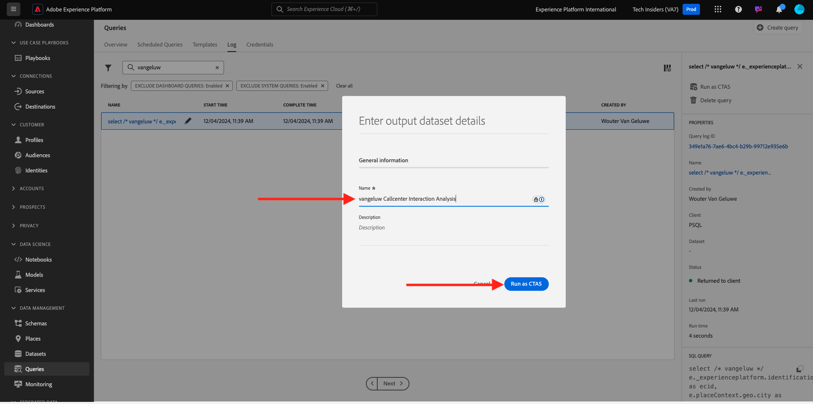

# 2.1.5 Generare un set di dati da una query

## Finalità

Scopri come generare set di dati dai risultati delle query
Connettere Microsoft Power BI Desktop/Tableau direttamente a Query Service
Creazione di un report in Microsoft Power BI Desktop/Tableau Desktop

## Contesto

L&#39;interfaccia della riga di comando per l&#39;esecuzione di query sui dati è molto interessante, ma non è disponibile. In questa lezione, ti guideremo attraverso un flusso di lavoro consigliato per scoprire come utilizzare Microsoft Power BI Desktop/Tableau direttamente da Query Service per creare report visivi per le parti interessate.

## Creare un set di dati da una query SQL

La complessità della query influirà sul tempo necessario affinché il servizio query restituisca i risultati. E quando si esegue una query direttamente dalla riga di comando o da altre soluzioni come Microsoft Power BI/Tableau, Query Service è configurato con un timeout di 5 minuti (600 secondi). E in alcuni casi queste soluzioni saranno configurate con timeout più brevi. Per eseguire query più grandi e caricare in anteprima il tempo necessario per restituire i risultati, è disponibile una funzione che consente di generare un set di dati dai risultati della query. Questa funzione utilizza la funzione SQL standard nota come Create Table As Select (CTAS). È disponibile nell’interfaccia utente di Platform dall’elenco delle query e può essere eseguito direttamente dalla riga di comando con PSQL.

In precedenza hai sostituito **immetti il tuo nome** con il tuo ldap prima di eseguirlo in PSQL.

```sql
select /* enter your name */
       e.--aepTenantId--.identification.core.ecid as ecid,
       e.placeContext.geo.city as city,
       e.placeContext.geo._schema.latitude latitude,
       e.placeContext.geo._schema.longitude longitude,
       e.placeContext.geo.countryCode as countrycode,
       c.--aepTenantId--.interactionDetails.core.callCenterAgent.callFeeling as callFeeling,
       c.--aepTenantId--.interactionDetails.core.callCenterAgent.callTopic as callTopic,
       c.--aepTenantId--.interactionDetails.core.callCenterAgent.callContractCancelled as contractCancelled,
       l.--aepTenantId--.loyaltyDetails.level as loyaltystatus,
       l.--aepTenantId--.loyaltyDetails.points as loyaltypoints,
       l.--aepTenantId--.identification.core.crmId as crmid
from   demo_system_event_dataset_for_website_global_v1_1 e
      ,demo_system_event_dataset_for_call_center_global_v1_1 c
      ,demo_system_profile_dataset_for_crm_global_v1_1 l
where  e.--aepTenantId--.demoEnvironment.brandName IN ('Citi Signal')
and    e.web.webPageDetails.name in ('Cancel Service', 'Call Start')
and    e.--aepTenantId--.identification.core.ecid = c.--aepTenantId--.identification.core.ecid
and    l.--aepTenantId--.identification.core.ecid = e.--aepTenantId--.identification.core.ecid;
```

Passa all&#39;interfaccia utente di Adobe Experience Platform - [https://experience.adobe.com/platform](https://experience.adobe.com/platform)

Per cercare l’istruzione eseguita nell’interfaccia utente di Adobe Experience Platform Query, immetti il ldap nel campo di ricerca:

Seleziona **Query**, passa a **Registro** e immetti il tuo ldap nel campo di ricerca.


Seleziona la query e fai clic su **Esegui come CTAS**.


Immetti `--aepUserLdap-- Callcenter Interaction Analysis` come nome e descrizione per il set di dati e fai clic su **Esegui come CTAS**.



Verrà quindi visualizzata una nuova query con stato **Inviata**.


Al termine, verrà visualizzata una nuova voce per **Set di dati creato** (potrebbe essere necessario aggiornare la pagina).


Non appena viene creato il set di dati (operazione che può richiedere 5-10 minuti), puoi continuare l’esercizio.

## Passaggi successivi

Vai all&#39;opzione A: [2.1.6 Query Service e Power BI](./ex6.md){target="_blank"}

Vai all&#39;opzione B: [2.1.7 Query Service e Tableau](./ex7.md){target="_blank"}

Torna a [Servizio query](./query-service.md){target="_blank"}

Torna a [Tutti i moduli](./../../../../overview.md){target="_blank"}
