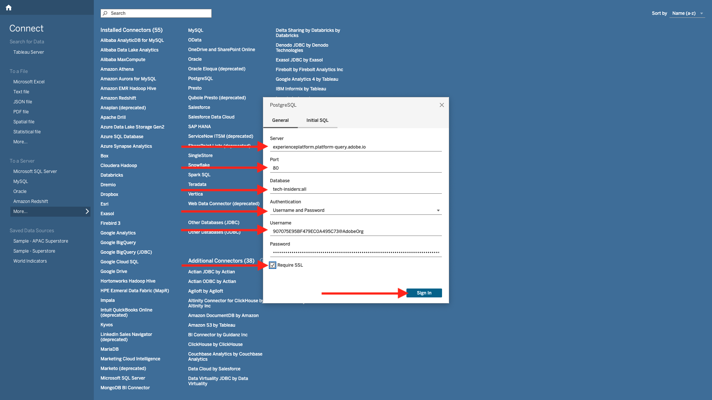
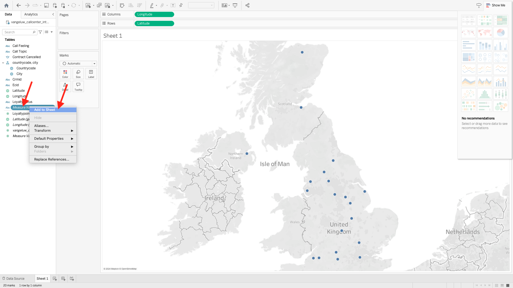

# 2.1.7 Query Service e Tableau

Apri Tableau.

In **Connetti a un server**, fare clic su **Altro** e quindi su **PostgreSQL**.

Se non hai ancora utilizzato PostgeSQL con Tableau, potresti vedere questo. Fare clic su **Scarica driver**.

Seguire le istruzioni per scaricare e installare il driver PostgreSQL.

Al termine dell&#39;installazione del driver, uscire e riavviare Tableau Desktop. Dopo il riavvio, passare di nuovo a **Connetti a un server**, fare clic su **Altro** e quindi di nuovo su **PostgreSQL**.

Poi vedrai questo.

Vai a Adobe Experience Platform, **Query** e **Credenziali**.

Dalla pagina **Credenziali** in Adobe Experience Platform, copia **Host** e incollalo nel campo **Server**, copia il **Database** e incollalo nel campo **Database** in Tableau, copia la **Porta** e incollala nel campo **Porta** in Tableau, esegui le stesse operazioni per **Nome utente** e **Password**. Fare clic su **Accedi**.

Nell&#39;elenco delle tabelle disponibili individuare la tabella creata nell&#39;esercizio precedente, denominata `--aepUserLdap--_callcenter_interaction_analysis`. Trascinalo nell’area di lavoro.

Poi vedrai questo. Fai clic su **Aggiorna**.

Vedrai poi i dati da AEP che diventano disponibili in Tableau. Fare clic su **Foglio 1** per iniziare a utilizzare i dati.

Per visualizzare i dati sulla mappa è necessario convertire longitudine e latitudine in dimensioni. In **Misure**, fare clic con il pulsante destro del mouse su **Latitudine**, selezionare **Converti in Dimension** nel menu. Ripetere l&#39;operazione per la misura **Longitudine**.

Trascina la misura **Longitudine** nelle **Colonne** e la misura **Latitudine** nelle **Righe**. Automaticamente la mappa di **Belgio** verrà visualizzata con piccoli punti che rappresentano le città nel set di dati.

Seleziona **Nomi misure**, fai clic su **Aggiungi al foglio**.

Ora avrai una mappa, con punti di varie dimensioni. La dimensione indica il numero di interazioni del call center per quella città specifica. Per variare le dimensioni dei punti, passa al pannello di destra e apri **Valori di misura** (utilizzando l&#39;icona a discesa). Dall&#39;elenco a discesa selezionare **Modifica dimensioni**. Gioca con dimensioni diverse.

Per visualizzare ulteriormente i dati per **Argomento chiamata**, trascina la dimensione **Argomento chiamata** in **Pagine**. Naviga tra i diversi **argomenti di chiamata** utilizzando **Argomento di chiamata** sul lato destro della schermata:

Hai terminato questo esercizio.

## Passaggi successivi

Vai a [2.1.8 API servizio query](./ex8.md){target="_blank"}

Torna a [Servizio query](./query-service.md){target="_blank"}

Torna a [Tutti i moduli](./../../../../overview.md){target="_blank"}
