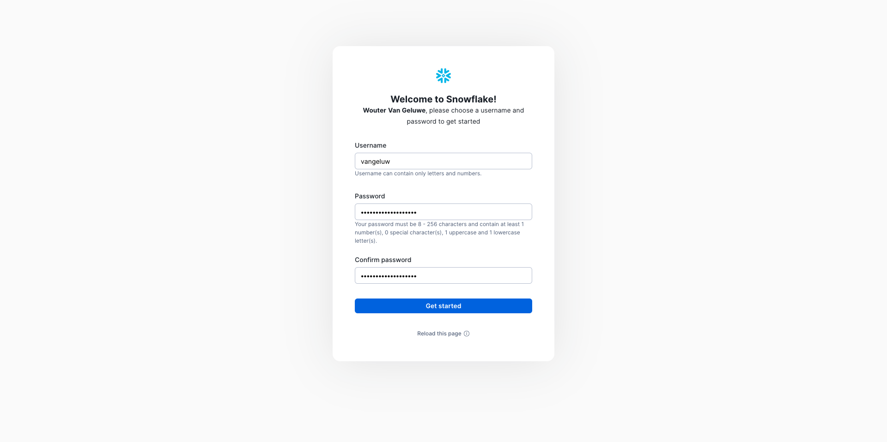
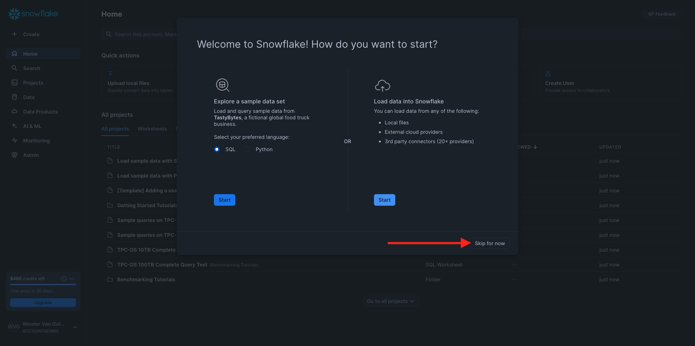
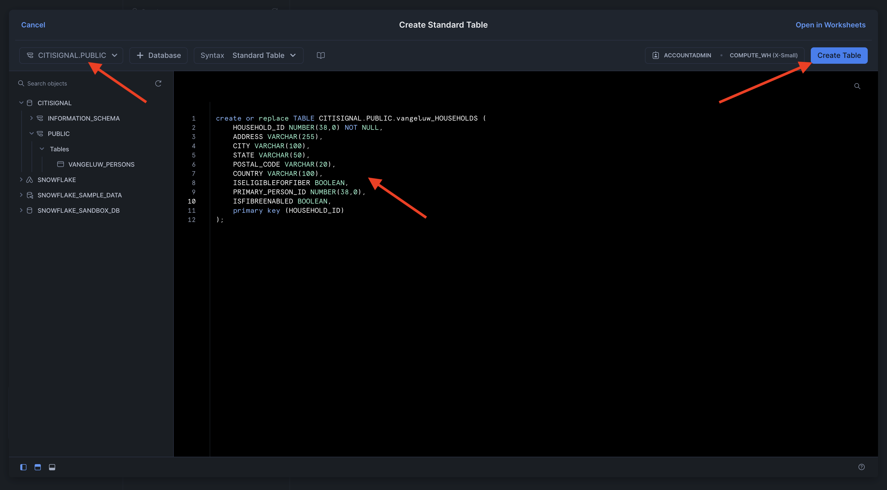
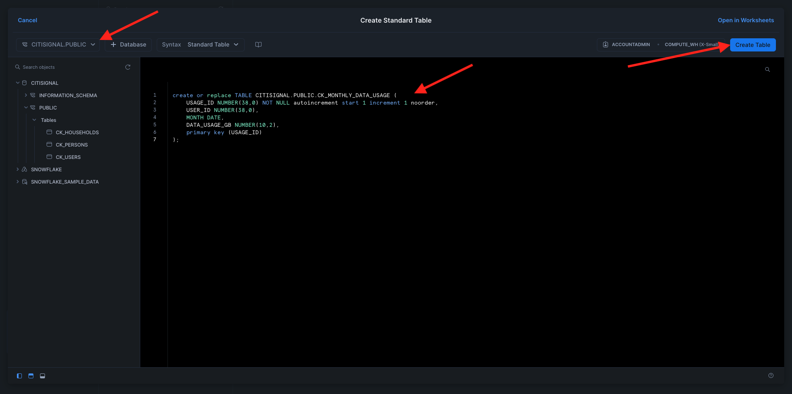
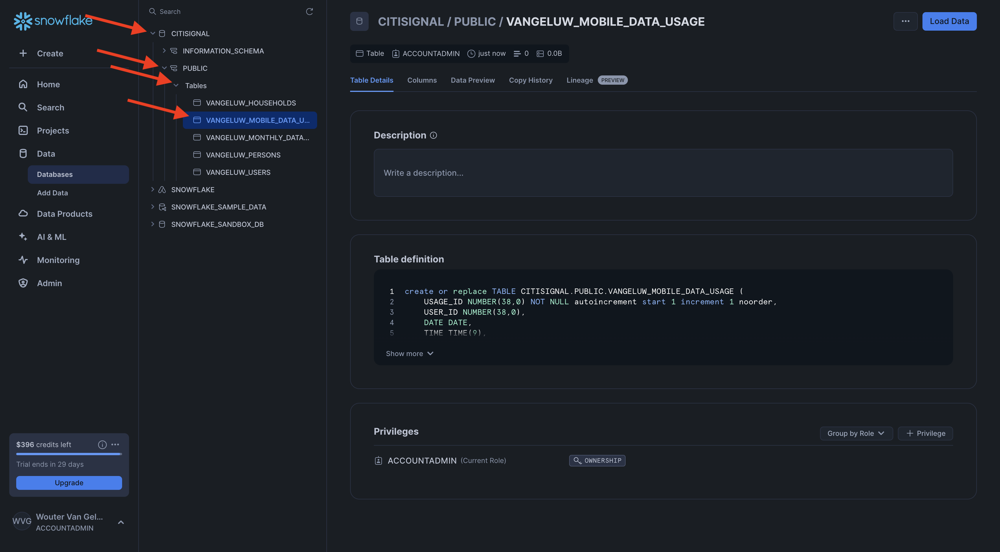

# 3.1.1 Configurare l’ambiente del Snowflake

## 3.1.1.1 Creare l’account

Vai a [https://snowflake.com](https://snowflake.com). Fai clic su **INIZIA GRATUITAMENTE**.


Immetti i tuoi dettagli e fai clic su **Continua**.


Immetti i tuoi dettagli, scegli il provider di cloud e fai clic su **Inizia**.


Inserisci i tuoi dettagli o fai clic su **Ignora** (x2).


Poi vedrai questo. Controlla l’e-mail e fai clic sull’e-mail di conferma che ti è stata inviata.


Fai clic sul collegamento nell’e-mail di conferma per attivare l’account, definire il nome utente e la password. Fai clic su **Inizia**. Nel prossimo esercizio dovrai usare questo nome utente e questa password.



In seguito potrai accedere al Snowflake. Fai clic su **Ignora per il momento**.



## 3.1.1.2 Creare il database

Vai a **Dati > Database**. Fare clic su **+ Database**.


Utilizza il nome **CITISIGNAL** per il database. Fare clic su **CREA**.


## 3.1.1.3 Creare le tabelle

È ora possibile iniziare a creare le tabelle in Snowflake. Di seguito sono riportati gli script da eseguire per creare le tabelle.

### Tabella CK_PERSONS

Fare clic su **+ Crea**, quindi su **Tabella** e infine su **Standard**.


Poi vedrai questo. Copia la query seguente e incollala nel Snowflake. Prima di creare la tabella, assicurati di selezionare il database **CITISIGNAL** nell&#39;angolo in alto a sinistra dello schermo.

```sql
create or replace TABLE CITISIGNAL.PUBLIC.CK_PERSONS (
	PERSON_ID NUMBER(38,0) NOT NULL,
	NAME VARCHAR(255),
	AGE NUMBER(38,0),
	EMAIL VARCHAR(255),
	PHONE_NUMBER VARCHAR(20),
	GENDER VARCHAR(10),
	OCCUPATION VARCHAR(100),
	ISATTMOBILESUB BOOLEAN,
	primary key (PERSON_ID)
);
```

Fare clic su **Crea tabella**.


Una volta eseguito lo script, è possibile trovare la tabella in **Database > CITISIGNAL > PUBLIC**.


### Tabella CK_HOUSEHOLDS

Fare clic su **+ Crea**, quindi su **Tabella** e infine su **Standard**.


Poi vedrai questo. Copia la query seguente e incollala nel Snowflake. Prima di creare la tabella, assicurati di selezionare il database **CITISIGNAL** nell&#39;angolo in alto a sinistra dello schermo.

```sql
create or replace TABLE CITISIGNAL.PUBLIC.CK_HOUSEHOLDS (
	HOUSEHOLD_ID NUMBER(38,0) NOT NULL,
	ADDRESS VARCHAR(255),
	CITY VARCHAR(100),
	STATE VARCHAR(50),
	POSTAL_CODE VARCHAR(20),
	COUNTRY VARCHAR(100),
	ISELIGIBLEFORFIBER BOOLEAN,
	PRIMARY_PERSON_ID NUMBER(38,0),
	ISFIBREENABLED BOOLEAN,
	primary key (HOUSEHOLD_ID)
);
```

Fare clic su **Crea tabella**.



Una volta eseguito lo script, è possibile trovare la tabella in **Database > CITISIGNAL > PUBLIC**.


### Tabella CK_USERS

Fare clic su **+ Crea**, quindi su **Tabella** e infine su **Standard**.


Poi vedrai questo. Copia la query seguente e incollala nel Snowflake. Prima di creare la tabella, assicurati di selezionare il database **CITISIGNAL** nell&#39;angolo in alto a sinistra dello schermo.

```sql
create or replace TABLE CITISIGNAL.PUBLIC.CK_USERS (
	USER_ID NUMBER(38,0) NOT NULL,
	PERSON_ID NUMBER(38,0),
	HOUSEHOLD_ID NUMBER(38,0),
	primary key (USER_ID),
	foreign key (PERSON_ID) references CITISIGNAL.PUBLIC.CK_PERSONS(PERSON_ID),
	foreign key (HOUSEHOLD_ID) references CITISIGNAL.PUBLIC.CK_HOUSEHOLDS(HOUSEHOLD_ID)
);
```

Fare clic su **Crea tabella**.


Una volta eseguito lo script, è possibile trovare la tabella in **Database > CITISIGNAL > PUBLIC**.


### Tabella CK_MONTHLY_DATA_USAGE

Fare clic su **+ Crea**, quindi su **Tabella** e infine su **Standard**.


Poi vedrai questo. Copia la query seguente e incollala nel Snowflake. Prima di creare la tabella, assicurati di selezionare il database **CITISIGNAL** nell&#39;angolo in alto a sinistra dello schermo.

```sql
create or replace TABLE CITISIGNAL.PUBLIC.CK_MONTHLY_DATA_USAGE (
	USAGE_ID NUMBER(38,0) NOT NULL autoincrement start 1 increment 1 noorder,
	USER_ID NUMBER(38,0),
	MONTH DATE,
	DATA_USAGE_GB NUMBER(10,2),
	primary key (USAGE_ID)
);
```

Fare clic su **Crea tabella**.



Una volta eseguito lo script, è possibile trovare la tabella in **Database > CITISIGNAL > PUBLIC**.


### Tabella CK_MOBILE_DATA_USAGE

Fare clic su **+ Crea**, quindi su **Tabella** e infine su **Standard**.


Poi vedrai questo. Copia la query seguente e incollala nel Snowflake. Prima di creare la tabella, assicurati di selezionare il database **CITISIGNAL** nell&#39;angolo in alto a sinistra dello schermo.


```sql
create or replace TABLE CITISIGNAL.PUBLIC.CK_MOBILE_DATA_USAGE (
	USAGE_ID NUMBER(38,0) NOT NULL autoincrement start 1 increment 1 noorder,
	USER_ID NUMBER(38,0),
	DATE DATE,
	TIME TIME(9),
	APP_NAME VARCHAR(255),
	DATA_USAGE_MB NUMBER(10,2),
	NETWORK_TYPE VARCHAR(50),
	DEVICE_TYPE VARCHAR(50),
	COUNTRY_CODE VARCHAR(10),
	primary key (USAGE_ID)
);
```

Fare clic su **Crea tabella**.


Una volta eseguito lo script, è possibile trovare la tabella in **Database > CITISIGNAL > PUBLIC**.



Tutte le tabelle sono state create.


## 3.1.1.4 Inserire i dati del campione

Ora puoi iniziare a caricare dati di esempio nel database.

...

La configurazione è stata completata in Snowflake.


Passaggio successivo: [3.1.2 Creare schemi, modelli dati e collegamenti](./ex2.md)

[Torna al modulo 3.1](./fac.md)

[Torna a tutti i moduli](../../../overview.md)
