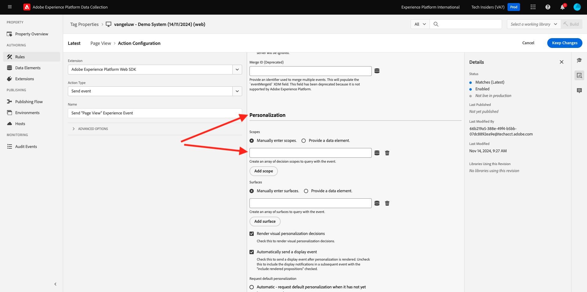

# 3.3.3 Prepara la proprietà del client di raccolta dati di Adobe Experience Platform e la configurazione del SDK web, ad Offer decisioning

## 3.3.3.1 Aggiornare lo stream di dati

In [Guida introduttiva](./../../../modules/getting-started/gettingstarted/ex2.md), hai creato il tuo **Datastream**. È stato quindi utilizzato il nome `--aepUserLdap-- - Demo System Datastream`.

In questo esercizio, devi configurare **Datastream** in modo che funzioni con **Offer Decisioning**.

Per eseguire questa operazione, vai a [https://experience.adobe.com/#/data-collection/](https://experience.adobe.com/it#/data-collection/). Poi vedrai questo. Fare clic su **Datastream**.

Nell&#39;angolo in alto a destra dello schermo, seleziona il nome della sandbox, che dovrebbe essere `--aepSandboxName--`.


Cerca il **flusso di dati**, denominato `--aepUserLdap-- - Demo System Datastream`. Fai clic sul **Datastream** per aprirlo.


Poi vedrai questo. Fare clic su **...** accanto a **Adobe Experience Platform** e quindi su **Modifica**.


Per abilitare **Offer Decisioning**, selezionare la casella per **Offer Decisioning**. Fai clic su **Salva**.


Il **Datastream** è ora pronto per funzionare con **Offer Decisioning**.


## 3.3.3.2 Configura la proprietà Client di raccolta dati di Adobe Experience Platform per richiedere offerte personalizzate

Vai a [https://experience.adobe.com/#/data-collection/](https://experience.adobe.com/it#/data-collection/), a **Tag**. Cercare le proprietà della raccolta dati, denominate `--aepUserLdap-- - Demo System (DD/MM/YYYY)`. Apri la proprietà del client Data Collection per il Web.


Nella tua proprietà, vai a **Regole** e apri la regola **Visualizzazione pagina**.


Fai clic per aprire l&#39;azione **Invia evento esperienza &quot;Visualizzazione pagina&quot;**.


Poi vedrai questo. In **Personalization**, noterai l&#39;opzione per **Ambiti**.



Per ogni richiesta inviata al server Edge e a Adobe Experience Platform, è possibile fornire uno o più **ambiti decisionali**. Un ambito **Decisione** è una combinazione di due elementi:

- ID decisione
- ID posizionamento

Diamo prima un&#39;occhiata dove puoi trovare questi due elementi.

### 3.3.3.2.1 Recuperare l’ID posizionamento

L’ID posizionamento identifica la posizione e il tipo di risorsa necessari. Ad esempio, l’immagine protagonista nella home page del sito web di CitiSignal corrisponde all’ID posizionamento per Web - Immagine.

>[!NOTE]
>
>Come parte dell’esercizio 2.3.5, hai già configurato un’attività Targeting esperienza in Adobe Target che modificherà l’immagine della posizione principale sulla home page, come puoi vedere nella schermata. Per questo esercizio, ora farai apparire le tue offerte sull&#39;immagine sotto l&#39;immagine protagonista come indicato nella schermata.


Per trovare l&#39;ID posizionamento per il Web - Immagine vai a Adobe Journey Optimizer da [Adobe Experience Cloud](https://experience.adobe.com). Fare clic su **Journey Optimizer**.

Verrai reindirizzato alla visualizzazione **Home** in Journey Optimizer. Innanzitutto, assicurati di utilizzare la sandbox corretta. La sandbox da utilizzare si chiama `--aepSandboxName--`. Ti troverai quindi nella **Home** della tua sandbox `--aepSandboxName--`.

Quindi, vai a Componenti e poi a Posizionamenti. Fai clic sul posizionamento **Web - Immagine** per visualizzarne i dettagli.


Come è possibile vedere nell&#39;immagine precedente, in questo esempio l&#39;ID posizionamento è `dps:offer-placement:1a08a14ccfe533b6`. Scrivi l’ID posizionamento per il posizionamento per Web - Immagine, in quanto sarà necessario nel prossimo esercizio.

### 3.3.3.2.2 Recuperare l’ID decisione dell’offerta

L&#39;**ID decisione offerta** identifica la combinazione di offerte personalizzate e offerte di fallback che si desidera utilizzare. Nell&#39;esercizio precedente, hai creato la tua decisione e l&#39;hai denominata `--aepUserLdap-- - CitiSignal Decision`.

Per trovare l&#39;ID decisione di offerta per `--aepUserLdap-- - CitiSignal Decision`, passa a Offerte e quindi a Decisioni. Fare clic per selezionare la decisione, denominata `--aepUserLdap-- - CitiSignal Decision`.


Come illustrato nell&#39;immagine precedente, in questo esempio l&#39;ID decisione è `dps:offer-activity:1a08ba4b529b2fb2`. Annotare l&#39;ID decisione offerta per la decisione `--aepUserLdap-- - CitiSignal Decision` in quanto sarà necessario nel prossimo esercizio.

Dopo aver recuperato i due elementi necessari per creare **ambiti decisionali**, puoi continuare con il passaggio successivo, che comporta la codifica dell&#39;ambito decisionale.

### 3.3.3.2.3 Codifica BASE64

**Ambito decisione** da immettere è una stringa con codifica BASE64. Questa stringa con codifica BASE64 è una combinazione dell’ID posizionamento e dell’ID decisione, come illustrato di seguito:

```json
{
  "xdm:activityId": "dps:offer-activity:1a08ba4b529b2fb2",
  "xdm:placementId": "dps:offer-placement:1a08a14ccfe533b6"
}
```

È possibile recuperare la stringa con codifica BASE64 da Adobe Experience Platform. Passare a Decisioni e fare clic per aprire la decisione, denominata `--aepUserLdap-- - CitiSignal Decision`.


Dopo aver aperto `--aepUserLdap-- - CitiSignal Decision`, verrà visualizzato questo messaggio. Individua il posizionamento Web - Immagine e fai clic sul pulsante **Copia**. Fare clic su **Ambito di decisione codificato**. L&#39;**Ambito decisione** è ora copiato negli Appunti.


Quindi, torna a Launch, alla tua azione **AEP Web SDK - Invia evento**.


Incolla l’ambito di decisione codificato nel campo di input. Salva le modifiche nell&#39;azione **AEP Web SDK - Invia evento** facendo clic su **[!UICONTROL Mantieni modifiche]**.


Fare clic su **[!UICONTROL Salva]**.


In Raccolta dati Adobe Experience Platform, vai a **[!UICONTROL Flusso di pubblicazione]** e apri la **[!UICONTROL Libreria di sviluppo]** denominata **[!UICONTROL Principale]**. Fare clic su **[!UICONTROL + Aggiungi tutte le risorse modificate]** e quindi su **[!UICONTROL Salva e genera per sviluppo]**. Le modifiche verranno ora pubblicate sul sito web della demo.


Ogni volta che carichi una **pagina generale**, come ad esempio la home page del sito Web demo, l&#39;Offer decisioning valuterà l&#39;offerta applicabile e restituirà una risposta al sito Web con i dettagli dell&#39;offerta da mostrare. La visualizzazione dell’offerta sul sito web richiede una configurazione aggiuntiva, che verrà eseguita nel passaggio successivo.

## 3.3.3.3 Configura la proprietà Client di raccolta dati di Adobe Experience Platform per ricevere e applicare offerte personalizzate

Vai a [https://experience.adobe.com/#/data-collection/](https://experience.adobe.com/it#/data-collection/), a **[!UICONTROL Proprietà]**. Cercare le proprietà della raccolta dati, denominate `--aepUserLdap-- - Demo System (DD/MM/YYYY)`. Apri la proprietà Data Collection per il Web.


Nella tua proprietà, passa a **Regole**. Cerca e apri la regola **Visualizza offerta (Offer decisioning)**.


Poi vedrai questo. Apri l&#39;azione **Visualizza l&#39;offerta nella pagina**.


Fai clic su **[!UICONTROL Apri editor]**


Sovrascrivi il codice incollando il codice seguente nell’editor.

```javascript
if (!Array.isArray(event.decisions)) {
  console.log("No personalization decisions");
  return;
}

console.log("Received response from Offer Decisioning", event.decisions);

event.decisions.forEach(function (payload) {
  payload.items.forEach(function (item) {
    console.log("Offer", item.data.deliveryURL);

    if (!item.data || item.data?.deliveryURL==null) {
      return;
    }
    console.log("item.data.deliveryURL", item.data.deliveryURL)
    //document.querySelector(".TopRibbon").innerHTML = item.data.content;
    document.querySelector("#SpectrumProvider > div.App > div > div.Page.home > main > div:nth-child(2)").innerHTML = "";
    document.querySelector("#SpectrumProvider > div.App > div > div.Page.home > main > div:nth-child(2) > img").style.backgroundRepeat="no-repeat";
    document.querySelector("#SpectrumProvider > div.App > div > div.Page.home > main > div:nth-child(2) > img").style.backgroundPosition="center center";
    document.querySelector("#SpectrumProvider > div.App > div > div.Page.home > main > div:nth-child(2) > img").style.backgroundSize = "contain";
  });
});
```

La riga 17 applica l&#39;immagine restituita dall&#39;Offer decisioning al sito Web. Fai clic su **[!UICONTROL Salva]**.


Fai clic su **[!UICONTROL Mantieni modifiche]**.


Fare clic su **[!UICONTROL Salva]**.


In Raccolta dati Adobe Experience Platform, vai a **[!UICONTROL Flusso di pubblicazione]** e apri la **[!UICONTROL Libreria di sviluppo]** denominata **[!UICONTROL Principale]**. Fare clic su **[!UICONTROL + Aggiungi tutte le risorse modificate]** e quindi su **[!UICONTROL Salva e genera per sviluppo]**. Le modifiche verranno ora pubblicate sul sito web della demo.


Con questa modifica, questa regola nella raccolta dati di Adobe Experience Platform ascolterà la risposta di Offer Decisioning che fa parte della risposta di Web SDK e, quando la risposta viene ricevuta, l’immagine dell’offerta verrà visualizzata nella home page.

Osservando il sito web della demo, vedrai che questa immagine verrà sostituita ora. Invece delle immagini predefinite del sito web di CitSignal, ora vedrai un’offerta come questa. In questo caso, viene visualizzata l’offerta di fallback.


Hai configurato 2 tipi di personalizzazione:

- 1 Attività Targeting esperienza con Adobe Target nell’esercizio 2.3.5
- 1 Offer decisioning di implementazione tramite la proprietà Data Collection

Nel prossimo esercizio vedrai come combinare le offerte e le decisioni che sono state create in Adobe Journey Optimizer con un’attività Targeting esperienza di Adobe Target.

Passaggio successivo: [3.3.4 Combina Adobe Target e Offer Decisioning](./ex4.md)

[Torna al modulo 3.3](./offer-decisioning.md)

[Torna a tutti i moduli](./../../../overview.md)
