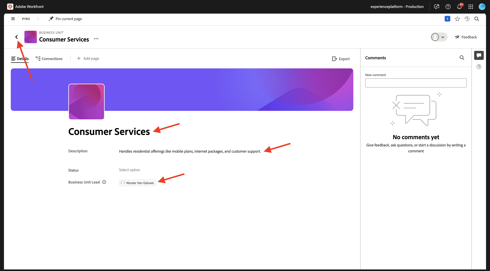
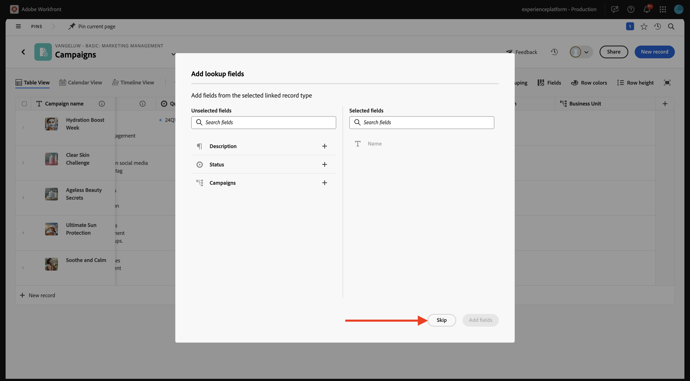
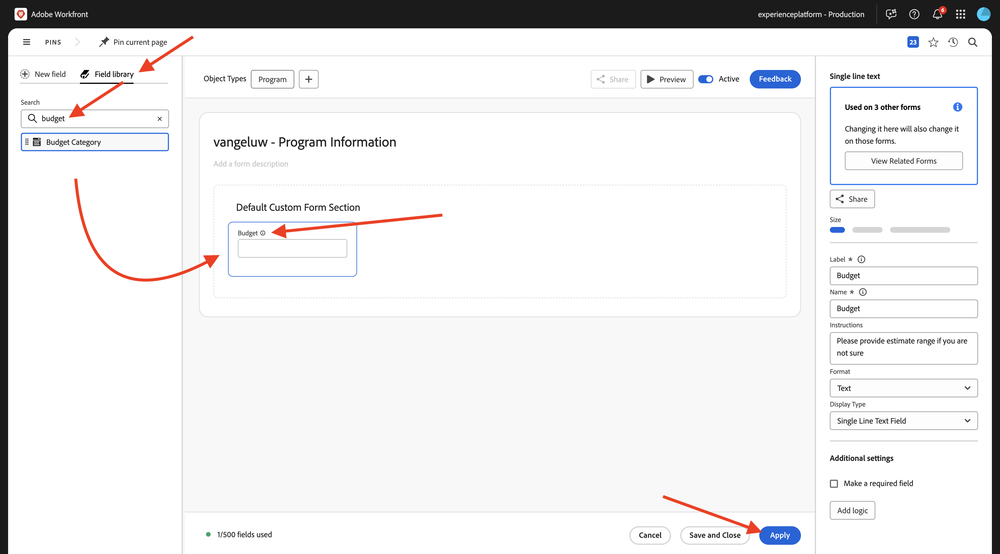
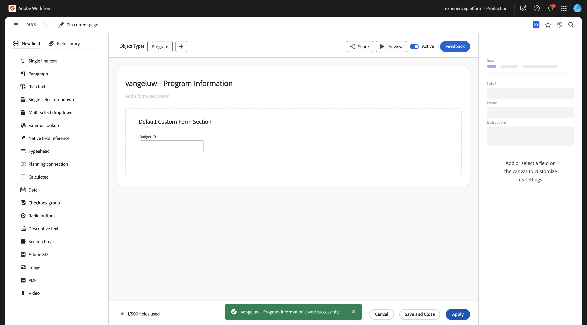
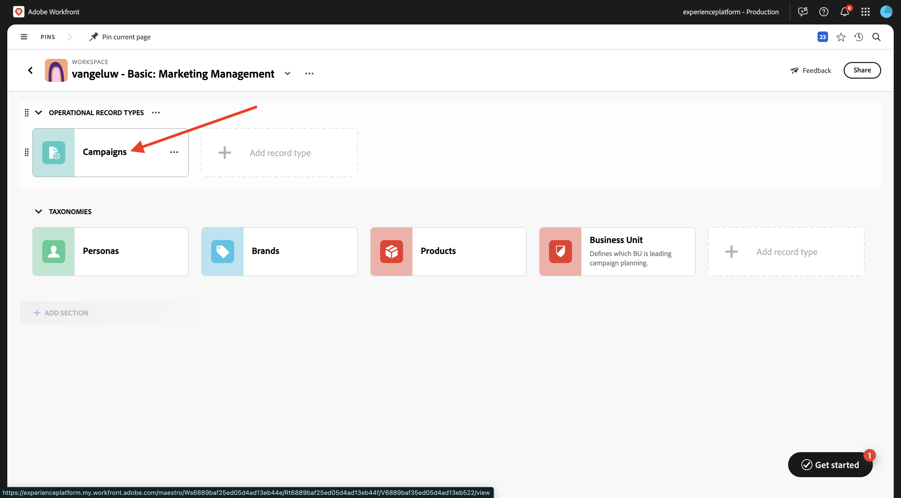
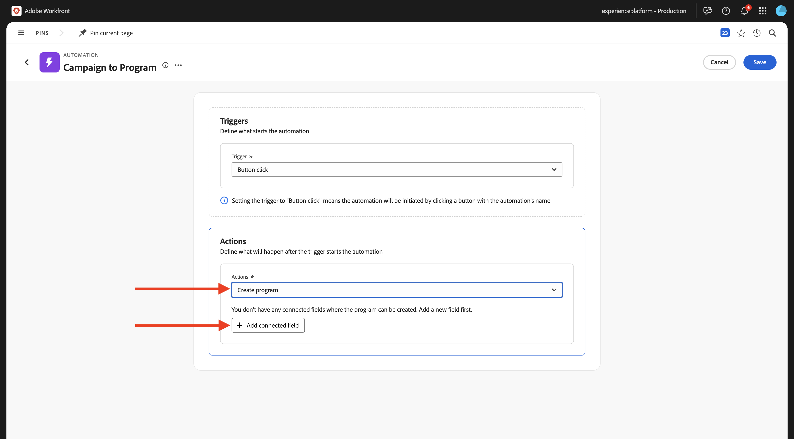
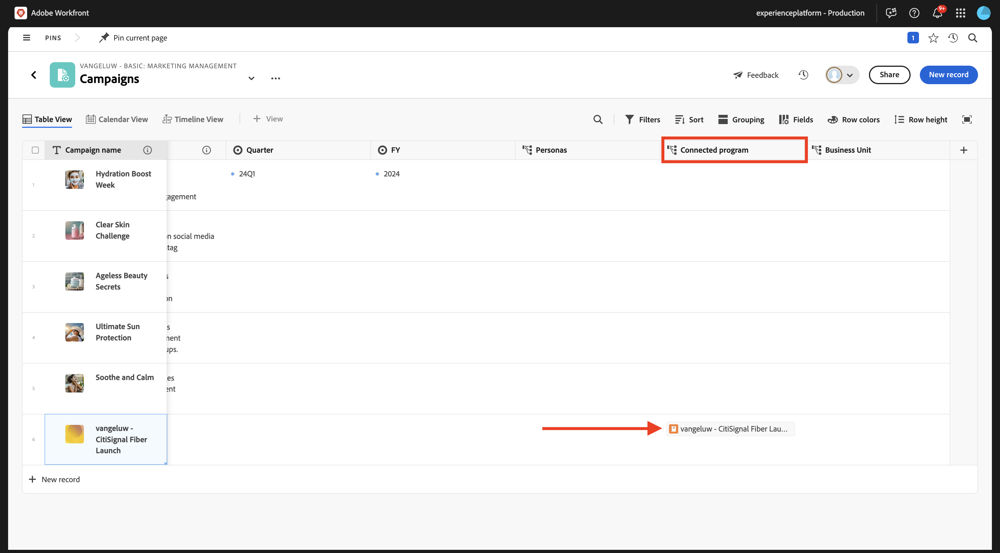

# 1.1.1 Guida introduttiva a Workfront Planning

## 1.1.1.1 resoconto della campagna CitiSignal

Per comprendere il contesto di CitiSignal e i risultati che si sta cercando di ottenere, scarica e leggi il resoconto della campagna di CitiSignal qui: [CitiSignal-Fiber-Launch-Winter-2026.pdf](./../../../assets/brief/CitiSignal-Fiber-Launch-Winter-2026.pdf).

## Terminologia di Workfront Planning 1.1.1.2

Di seguito sono riportati gli oggetti e i concetti principali di Workfront Planning:

| Termine | Spiegazione |
| --- | ---|
| **Workspace** | Una raccolta di tipi di record che definiscono il ciclo di vita operativo di una determinata organizzazione. Un’area di lavoro è l’area di lavoro di un’unità organizzativa. |
| **Tipo di record** | Il nome dei tipi di oggetto in Workfront Planning. I tipi di record popolano le aree di lavoro. A differenza di Workfront Workflow, in cui i tipi di oggetto sono predefiniti, in Workfront Planning è possibile creare tipi di oggetto personalizzati. |
| **Record** | Istanza di un tipo di record. |
| **Modello Workspace** | È possibile creare un&#39;area di lavoro utilizzando modelli predefiniti. È possibile utilizzare i tipi di record e i campi predefiniti inclusi in un modello oppure aggiungere record personalizzati. |
| **Campi** | I campi sono attributi che è possibile aggiungere ai tipi di record. I campi contengono informazioni sul tipo di record. |

>[!NOTE]
>
>Il numero di oggetti di Workfront Planning che è possibile creare è limitato. Per ulteriori informazioni, vedere Cenni preliminari sulle limitazioni degli oggetti di Adobe Workfront Planning.

Ora è possibile iniziare a creare personalmente alcuni di questi oggetti.

## 1.1.1.3 Workspace, tipo di record, campi

Vai a [https://experience.adobe.com/](https://experience.adobe.com/){target="_blank"}. Fare clic per aprire **Workfront**.


In Workfront, fare clic per aprire il menu, quindi selezionare **Planning**.


Dovresti vedere questo. Fare clic su **Crea Workspace**.


Fare clic su **Usa modello** per il modello **Gestione marketing di base**.


Viene creata una nuova area di lavoro. Prima di continuare, è necessario modificare il nome dell&#39;area di lavoro. Fai clic sui tre punti **...**, quindi seleziona **Modifica**.


Cambia il nome in `--aepUserLdap-- - Basic: Marketing Management`. Fai clic su **Salva**.


Dovresti avere questo.


## 1.1.1.4 tassonomie: tipo di record e campi

In **Tassonomie**, fare clic su **+ Aggiungi tipo di record**, quindi selezionare **Aggiungi manualmente**.


Dovresti quindi visualizzare il popup **Aggiungi tipo di record**.


Aggiorna le seguenti informazioni nella scheda **Aspetto**:

- Sostituisci **Tipo di record senza titolo** con `Business Unit`.
- Descrizione: `Defines which BU is leading campaign planning.`.
- Selezionare un colore e una forma per l&#39;icona desiderata

Fai clic su **Salva**.


Fare clic per aprire il tipo di record **Business Unit** appena creato.


Verrà visualizzata una visualizzazione tabella vuota, poiché nel nuovo tipo di record creato non è ancora stato definito alcun record di Business Unit.


Fai clic sul pulsante a discesa nel campo **Data inizio**, quindi seleziona **Elimina**.


Seleziona **Elimina**.


Fai clic sul pulsante a discesa nel campo **Data di fine**, quindi seleziona **Elimina**.


Seleziona **Elimina**.


Fare quindi clic sull&#39;icona **+** per aggiungere un nuovo campo. Scorri verso il basso nell&#39;elenco dei tipi di campo disponibili e seleziona **Persone**.


Imposta **Name** del campo su `Business Unit Lead` e imposta la descrizione del campo su `Business Unit Lead responsible for budget and resources (VP, Head).`

Fai clic su **Salva**.


Fai clic sui tre punti **...** del primo record e seleziona **Visualizza**.


Imposta **Name** su `Consumer Services`.

Imposta **Descrizione** su `Handles residential offerings like mobile plans, internet packages, and customer support.`.

Imposta il **Business Unit Lead** su se stesso.

Al termine, fare clic sulla freccia per tornare alla schermata precedente.



Fare clic sui tre punti **...** del secondo record e selezionare **Visualizza**.


Imposta **Name** su `Enterprise & Business Solutions`

Imposta **Descrizione** su `Provides connectivity, cloud, and managed services to corporate clients and government entities.`

Imposta il **Business Unit Lead** su se stesso.

Al termine, fare clic sulla freccia per tornare alla schermata precedente.


Fare clic sui tre punti **...** del terzo record e selezionare **Visualizza**.


Imposta **Name** su `Sales & Marketing`

Imposta **Descrizione** su `Drives customer acquisition, brand strategy, advertising, and market segmentation.`

Imposta il **Business Unit Lead** su se stesso.

Al termine, fare clic sulla freccia per tornare alla schermata precedente.


Dopo aver creato un nuovo tipo di record, sono stati eliminati e creati campi e sono state create 3 Business Unit. Torna alla schermata di panoramica di Workspace facendo clic sulla freccia nell’angolo in alto a sinistra.


Dovresti vedere questo.


## 1.1.1.5 tipi di record operativi: Campi

Fare clic per aprire **Campagne**.


Fai clic sull&#39;icona **+** per creare un nuovo campo. Selezionare **Nuova connessione**, quindi selezionare **Business Unit**.


Lascia immutate le impostazioni predefinite. Fai clic su **Crea**.


Seleziona **Ignora**.



Il nuovo campo viene quindi visualizzato nella vista a tabella.


## 1.1.1.6 Crea un modulo di richiesta

Nella schermata di panoramica delle campagne, fai clic sui tre punti **...**, quindi seleziona **Crea modulo di richiesta**.


Cambia il nome in `Campaign Request Form`. Fai clic su **Crea**.


Al momento non è necessario apportare alcuna modifica al modulo. La utilizzerai senza modifiche. Fare clic su **Salva** e quindi su **Pubblica**.


Fai clic sulla freccia nell’angolo in alto a sinistra per tornare alla schermata Panoramica di Request Forms.


Fai clic sulla freccia nell’angolo in alto a sinistra per tornare alla schermata Panoramica campagne.


## 1.1.1.7 Inviare un nuovo record utilizzando il modulo di richiesta

Nella schermata di panoramica delle campagne, fare clic su **+ Nuovo record**.


Seleziona **Invia una richiesta** e fai clic su **Continua**.


Imposta **Subject** su `--aepUserLdap-- - New Campaign Creation Request`.

Imposta **Nome campagna** su `--aepUserLdap-- - CitiSignal Fiber Launch`.

Imposta **Riepilogo campagna** su:

```
The CitiSignal Fiber Launch campaign introduces CitiSignal’s flagship fiber internet service—CitiSignal Fiber Max—to key residential markets. This campaign is designed to build awareness, drive sign-ups, and establish CitiSignal as the go-to provider for ultra-fast, reliable, and future-ready internet. The campaign will highlight the product’s benefits for remote professionals, online gamers, and smart home families, using persona-driven messaging across digital and physical channels.
```

Compila gli altri campi come preferisci.

Fai clic su **Invia richiesta**.


Fai clic su **X** per chiudere la finestra a comparsa.


Dovresti quindi visualizzare la campagna appena creata nella panoramica.


## 1.1.1.8 Crea Portfolio e modulo personalizzato

Nel passaggio successivo verrà creata un&#39;automazione che utilizzerà le informazioni della campagna create in Workfront Planning e che utilizzerà tali informazioni in Workfront per creare un programma. Prima di poter creare l’automazione, in Workfront è necessario configurare due elementi: un portfolio e un modulo personalizzato.

Per creare il portfolio, apri il menu e fai clic su **Portfolio**.


Fare clic su **+ Nuovo Portfolio**.


Impostare il nome del portfolio su `--aepUserLdap-- - Marketing`.


Aprire quindi il menu e fare clic su **Configurazione** per creare il modulo personalizzato.


Nel menu a sinistra, vai a **Forms personalizzato**, a **Forms** e quindi fai clic su **+ Nuovo modulo personalizzato**.


Seleziona **Programma** e fai clic su **Continua**.


Modificare il nome del modulo in `--aepUserLdap-- - Program Information`.


Quindi, vai a **Libreria campi** e cerca `budget`. Trascina e rilascia il campo esistente **Budget** nel modulo.

Fare clic su **Applica**.



La configurazione del modulo personalizzato è stata salvata.



## 1.1.1.8 Crea un&#39;automazione

Con la creazione del portfolio e del modulo personalizzato, ora puoi creare l’automazione.

Fare clic per aprire il menu, quindi selezionare **Planning**.


Fare clic per aprire l&#39;area di lavoro creata in precedenza, denominata `--aepUserLdap-- - Basic: Marketing Management`.


Fare clic per aprire **Campagne**.



Nella schermata Panoramica campagne, fai clic sui tre punti **...**, quindi seleziona **Gestisci automazioni**.


Fare clic su **Nuova automazione**.


Impostare il nome dell&#39;automazione su `Campaign to Program`.

Imposta la descrizione su `This automation will convert a Planning Campaign record to a Workfront Program.`

Fai clic su **Salva**.


Imposta **Azione** su **Crea programma**. Fare clic su **+ Aggiungi campo connesso**.



Selezionare il **portfolio programmi**: `--aepUserLdap-- - Marketing`.

Seleziona questo **modulo personalizzato**: `--aepUserLdap-- Program information`.

Fai clic su **Salva**.


Dovresti vedere questo. Fai clic sulla freccia per tornare alla schermata Panoramica campagne.


Seleziona la casella di controllo davanti alla campagna creata in precedenza. Quindi fare clic sull&#39;automazione **Campaign to Program**.


Dopo un paio di secondi, dovresti vedere una conferma del corretto completamento dell’automazione. Ciò significa che, in base all’oggetto Campaign in Workfront Planning, è stato creato un programma in Workfront.


Per controllare il programma in Workfront, scorrere verso destra e fare clic sul programma nella colonna **Programma connesso**.



Dovresti quindi visualizzare il programma appena creato dall’automazione configurata.


Passaggio successivo: [Riepilogo e vantaggi](./summary.md){target="_blank"}

Torna a [Introduzione a Workfront Planning](./wfplanning.md){target="_blank"}

[Torna a tutti i moduli](./../../../overview.md){target="_blank"}
