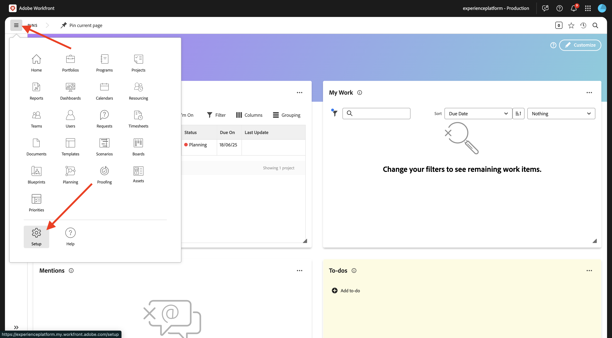
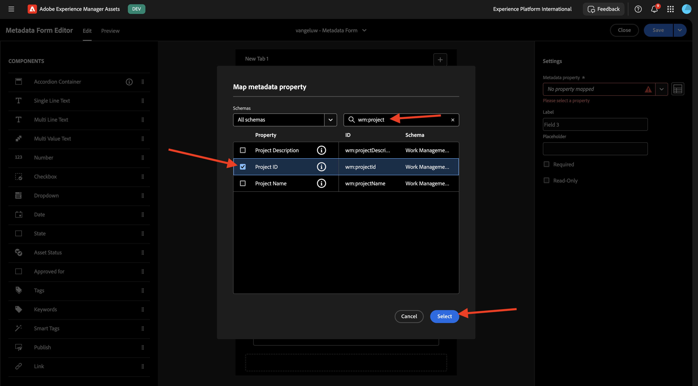
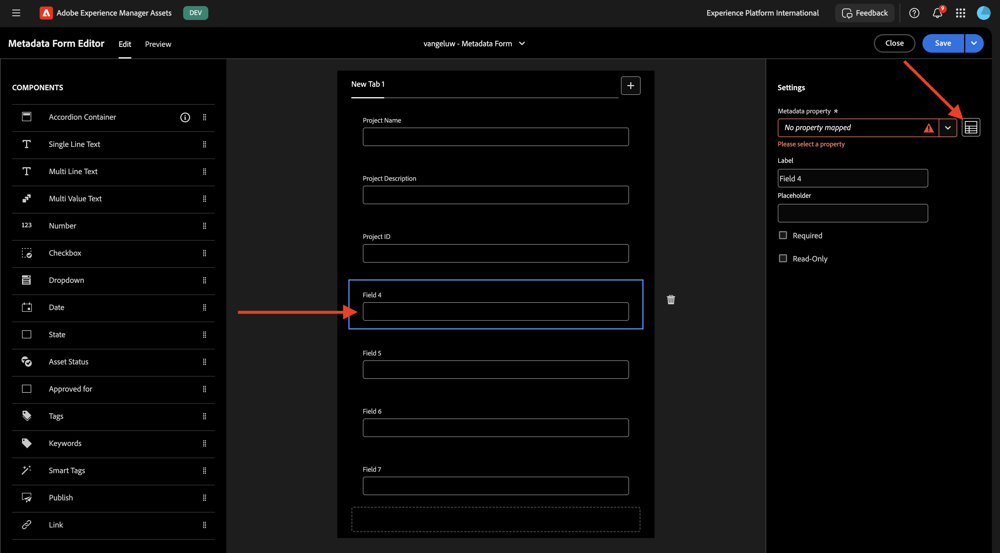
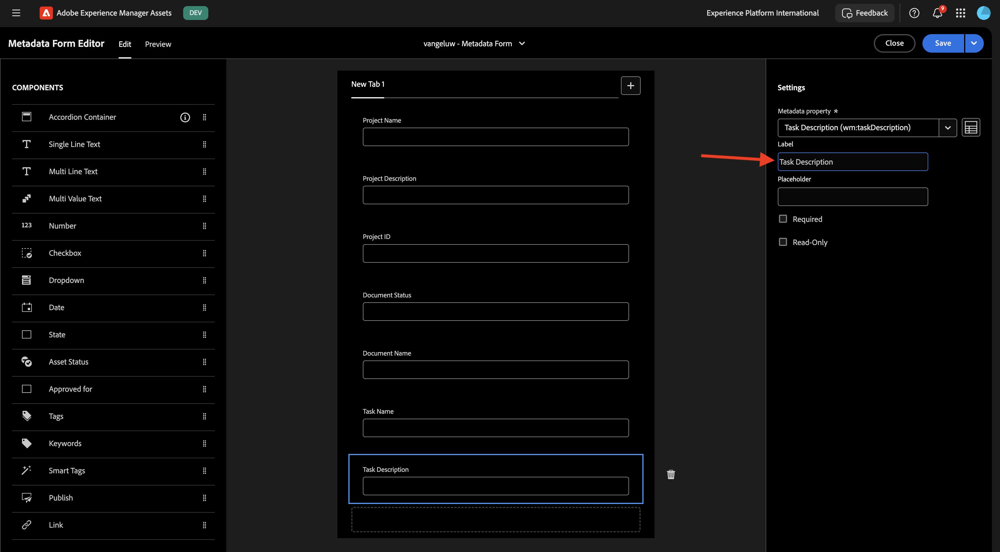

# 1.2.1 Integrazione dei metadati Workfront + AEM Assets CS

>[!IMPORTANT]
>
>Per completare questo esercizio, è necessario avere accesso a un ambiente AEM Assets CS Author funzionante.
>
>Ci sono 2 opzioni da considerare:
>
>- Se stai partecipando al workshop di abilitazione tecnica di GenStudio for CSC, i tuoi istruttori hanno creato un ambiente AEM Assets CS Author per te. Verifica con loro il nome e come procedere.
>
>- Se stai seguendo il percorso completo dell&#39;esercitazione di One Adobe, vai all&#39;esercizio [Adobe Experience Manager Cloud Service &amp; Edge Delivery Services](./../../../modules/asset-mgmt/module2.1/aemcs.md){target="_blank"}. Segui le istruzioni e potrai accedere a tale ambiente.

>[!IMPORTANT]
>
>Se in precedenza hai configurato un programma AEM CS con un ambiente AEM Assets CS, è possibile che la sandbox AEM CS sia stata sospesa. Dato che la disattivazione di una sandbox di questo tipo richiede 10-15 minuti, sarebbe opportuno avviare subito il processo di disattivazione in modo da non doverlo attendere in un secondo momento.

## Terminologia del flusso di lavoro di Workfront 1.2.1.1

Di seguito sono riportati gli oggetti e i concetti principali di Workfront:

| Nome | Ultimo aggiornamento |
| ---------------------- | ------------ | 
| Portfolio | Una raccolta di progetti che hanno caratteristiche unificanti. Questi progetti in genere competono per le stesse risorse, budget o fasce orarie. |
| Programma | Un sottogruppo all’interno di un portfolio, in cui progetti simili possono essere raggruppati per ottenere un beneficio ben definito. |
| Progetto | Una grande quantità di lavoro che deve essere completata in un arco temporale specifico e deve utilizzare un budget specifico e un numero specifico di risorse. Per renderlo gestibile, il progetto viene suddiviso in una serie di attività. Il completamento di tutte le attività comporta il completamento del progetto. |
| Modello di progetto | È possibile utilizzare i modelli di progetto per acquisire la maggior parte dei processi, delle informazioni e delle impostazioni ripetibili associati ai progetti dell&#39;organizzazione. Dopo aver creato i modelli, puoi allegarli ai progetti esistenti o utilizzarli per creare nuovi progetti. |
| Attività | Un’attività che deve essere eseguita come un passaggio verso il raggiungimento di un obiettivo finale (completamento del progetto). Le attività non possono mai esistere indipendentemente. Fanno sempre parte di un progetto. |
| Assegnazione | Un utente, una mansione o un team assegnato a un problema o a un’attività. I progetti, i portfolio o i programmi non possono avere assegnazioni. |
| Documento/Versione | Qualsiasi file allegato a un oggetto in Workfront. Ogni volta che lo stesso documento viene caricato nello stesso oggetto, gli viene assegnato un numero di versione. Gli utenti possono visualizzare e modificare diverse opzioni per una versione precedente di un documento. |
| Approvazione | Per un determinato elemento di lavoro, ad esempio un&#39;attività, un documento o una scheda orario, può essere necessario che un supervisore o un altro utente approvi l&#39;elemento di lavoro. Questo processo di approvazione è denominato approvazione. |

Vai a [https://experience.adobe.com/](https://experience.adobe.com/){target="_blank"}. Fare clic per aprire **Workfront**.

Poi vedrai questo.

## 1.2.1.1 Configurare l&#39;integrazione AEM Assets

Fai clic sull&#39;icona **menu**, quindi seleziona **Configurazione**.

Nel menu a sinistra, scorri verso il basso fino a **Documenti** e quindi fai clic su **Experience Manager Assets**. Fare clic su **+ Aggiungi integrazione Experience Manager**.

Per il nome dell&#39;integrazione, utilizzare `--aepUserLdap-- - CitiSignal AEM`.

Apri il menu a discesa **Archivio Experience Manager** e seleziona la tua istanza di AEM CS, che deve essere denominata `--aepUserLdap-- - CitiSignal`.

In **Metadati**, configura la seguente mappatura:

| Campo Workfront | Campo Experience Manager Assets |
| --------------- | ------------------------------ | 
| **Documento** > **Nome** | **wm:documentName** |
| **Progetto** > **Nome** | **wm:projectName** |
| **Progetto** > **Descrizione** | **wm:projectDescription** |
| **Richiesta documento** > **Stato** | **wm:wm:documentStatus** |
| **Attività** > **Nome** | **wm:taskName** |
| **Attività** > **Descrizione** | **wm:taskDescription** |
| **Progetto** > **ID** | **wm:projectId** |

Abilitare il parametro per **sincronizzare i metadati dell&#39;oggetto**.

Fai clic su **Salva**.

L’integrazione da Workfront ad AEM Assets CS è ora configurata.

## 1.2.1.2 Configurare l&#39;integrazione dei metadati con AEM Assets

Successivamente, devi configurare AEM Assets CS in modo che i campi di metadati della risorsa in Workfront vengano condivisi con AEM Assets CS.

Per eseguire questa operazione, vai a [https://experience.adobe.com/](https://experience.adobe.com/). Fare clic su **Experience Manager Assets**.

Fai clic per selezionare l&#39;ambiente AEM Assets, che deve essere denominato `--aepUserLdap-- - CitiSignal dev`.

Dovresti vedere questo. Nel menu a sinistra, vai a **Assets**.

Fare clic su **Crea cartella**.

Assegna un nome alla cartella `--aepUserLdap-- - CitiSignal Fiber Launch Assets` e fai clic su **Crea**.

Quindi, vai a **Forms metadati** nel menu a sinistra e quindi fai clic su **Crea**.

Utilizza il nome `--aepUserLdap-- - Metadata Form` e fai clic su **Crea**.

Aggiungi al modulo 7 nuovi campi **Testo a riga singola** e seleziona il primo campo. Quindi, fai clic sull&#39;icona **Schema** accanto al campo **Proprietà metadati** per il primo campo.

Poi vedrai questo popup. Nel campo di ricerca, immettere `wm:project` e selezionare il campo **Nome progetto**. Fai clic su **Seleziona**.

Cambia l&#39;etichetta del campo in `Project Name`. Fai clic su **Salva**.

Vai al secondo campo e fai clic sull&#39;icona **Schema** accanto al campo **Proprietà metadati**.

Nel campo di ricerca, immettere `wm:project` e selezionare il campo **Descrizione progetto**. Fai clic su **Seleziona**.

Cambia l&#39;etichetta del campo in `Project Description`.

Quindi, seleziona il terzo campo e fai di nuovo clic sull&#39;icona **Schema** accanto al campo **Proprietà metadati**.

Poi vedrai di nuovo questo popup. Nel campo di ricerca, immettere `wm:project` e selezionare il campo **ID progetto**. Fai clic su **Seleziona**.

Cambia l&#39;etichetta del campo in `Project ID`.

Quindi, seleziona il quarto campo e fai di nuovo clic sull&#39;icona **Schema** accanto al campo **Proprietà metadati**.

Poi vedrai di nuovo questo popup. Nel campo di ricerca, immettere `wm:document` e selezionare il campo **ID progetto**. Fai clic su **Seleziona**.

Cambia l&#39;etichetta del campo in `Document Status`.

Quindi, seleziona il quinto campo e fai di nuovo clic sull&#39;icona **Schema** accanto al campo **Proprietà metadati**.

Poi vedrai di nuovo questo popup. Nel campo di ricerca, immettere `wm:document` e selezionare il campo **ID progetto**. Fai clic su **Seleziona**.

Cambia l&#39;etichetta del campo in `Document Name`.

Quindi, seleziona il sesto campo e fai di nuovo clic sull&#39;icona **Schema** accanto al campo **Proprietà metadati**.

Poi vedrai di nuovo questo popup. Nel campo di ricerca, immettere `wm:task` e selezionare il campo **Nome attività**. Fai clic su **Seleziona**.

Cambia l&#39;etichetta del campo in `Task Name`.

Quindi, seleziona il settimo campo e fai di nuovo clic sull&#39;icona **Schema** accanto al campo **Proprietà metadati**.

Poi vedrai di nuovo questo popup. Nel campo di ricerca, immettere `wm:task` e selezionare il campo **Descrizione attività**. Fai clic su **Seleziona**.

Cambia l&#39;etichetta del campo in `Task Description`.

Cambia il **nome scheda** nel modulo in `--aepUserLdap-- - Workfront Metadata`.

Fai clic su **Salva** e **Chiudi**.

Il **modulo metadati** è ora configurato.

Successivamente, devi assegnare il modulo metadati alla cartella creata in precedenza. Seleziona la casella di controllo per il modulo metadati e fai clic su **Assegna a cartelle**.

Selezionare la cartella, che deve essere denominata `--aepUserLdap-- - CitiSignal Fiber Launch Assets`. Fai clic su **Assegna**.

Il modulo metadati è ora assegnato alla cartella correttamente.

Passaggio successivo: [1.2.2 Verifica con Workfront](./ex2.md){target="_blank"}

Torna a [Gestione dei flussi di lavoro con Adobe Workfront](./workfront.md){target="_blank"}

[Torna a tutti i moduli](./../../../overview.md){target="_blank"}
