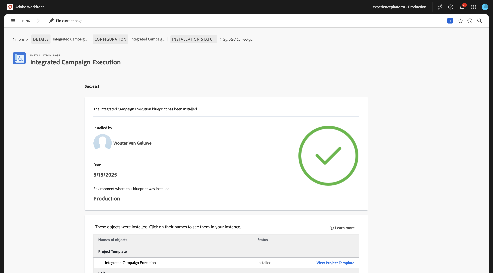
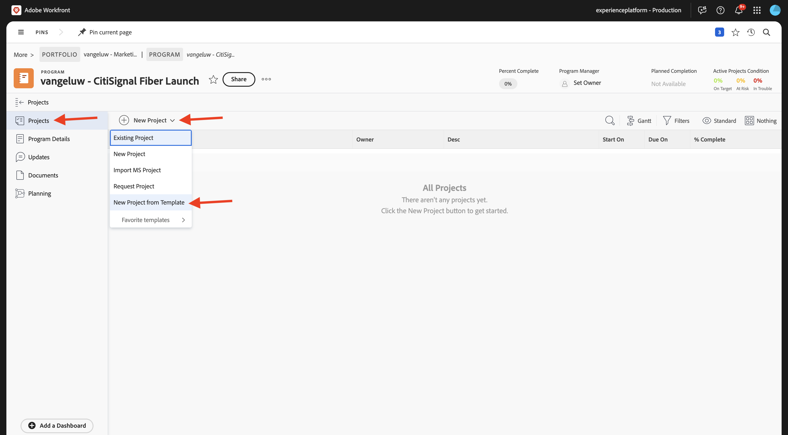
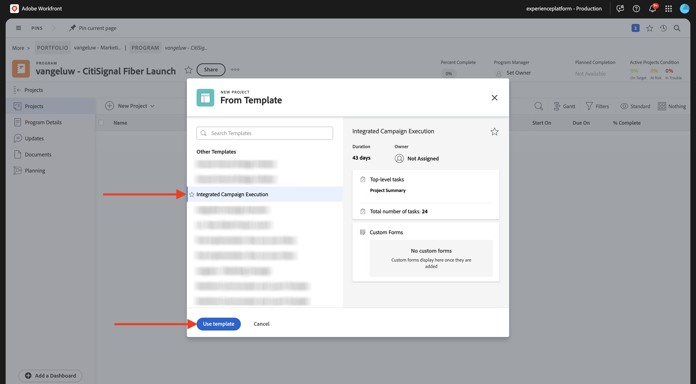
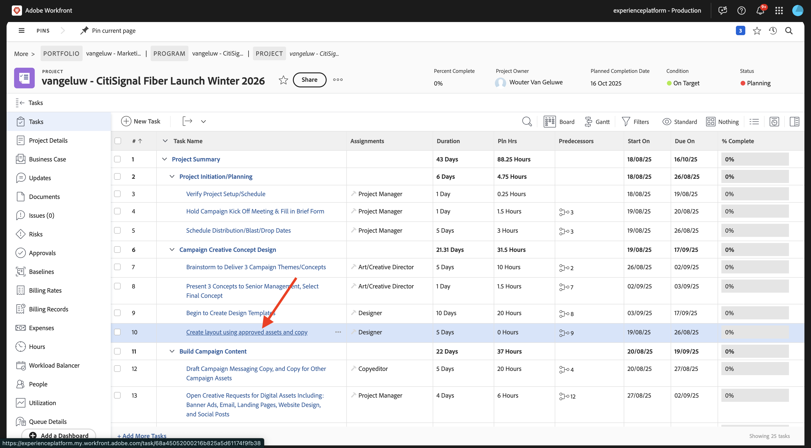
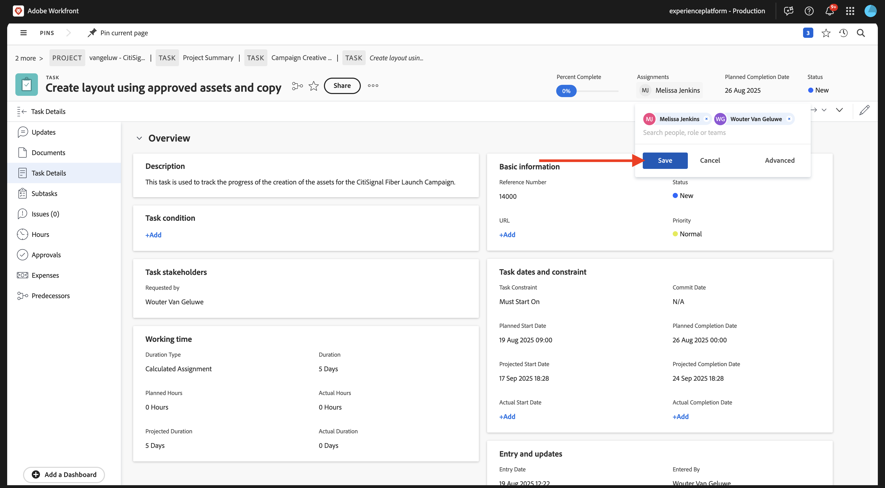
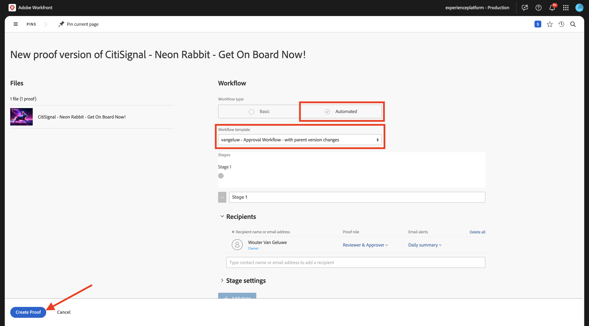

# 1.2.2 Strumenti di correzione con Workfront

>[!IMPORTANT]
>
>Se in precedenza hai configurato un programma AEM CS con un ambiente AEM Assets CS, è possibile che la sandbox AEM CS sia stata sospesa. Dato che la disattivazione di una sandbox di questo tipo richiede 10-15 minuti, sarebbe opportuno avviare subito il processo di disattivazione in modo da non doverlo attendere in un secondo momento.

## 1.2.2.1 Crea un nuovo flusso di approvazione

Torna a **Adobe Workfront**. Fai clic sull&#39;icona **menu** e seleziona **Strumenti di correzione**.

Vai a **Flussi di lavoro**, fai clic su **+ Nuovo**, quindi seleziona **Nuovo modello**.

Imposta **Nome modello** su `--aepUserLdap-- - Approval Workflow` e imposta il **Proprietario modello** su se stesso.

Scorri verso il basso e, in **Fasi** > **Fase 1**, modifica il ruolo **Autore bozza** in **Revisore e approvatore**. Puoi anche aggiungere altri utenti, ad esempio se sei un utente e vuoi impostare il **Ruolo** di **Revisore e Approvatore**.

Fai clic su **Crea**.

Il flusso di lavoro di approvazione di base è ora pronto per essere utilizzato.

## 1.2.2.2 Abilita blueprint Workfront

Nel passaggio successivo, creerai un nuovo progetto utilizzando un modello. Adobe Workfront fornisce una serie di blueprint disponibili che richiedono solo l’attivazione.

Per il caso d&#39;uso di CitiSignal, devi utilizzare la blueprint **Integrated Campaign Execution**.

Per installare il blueprint, apri il menu e seleziona **Blueprint**.

Seleziona il filtro **Marketing**, quindi scorri verso il basso per trovare il blueprint **Integrated Campaign Execution**. Fare clic su **Installa**.

Fai clic su **Continua**.

Fare clic su **Installa come è...**.

Dovresti vedere questo. L&#39;installazione potrebbe richiedere alcuni minuti.

Dopo un paio di minuti, il blueprint verrà installato.

## 1.2.2.3 Crea un nuovo progetto

Apri il **menu** e passa a **Programmi**.

Fare clic sul programma creato in precedenza, denominato `--aepUserLdap-- CitiSignal Fiber Launch`.

>[!NOTE]
>
>Hai creato un programma nell&#39;ambito dell&#39;esercizio su [Workfront Planning](./../module1.1/ex1.md) con l&#39;automazione creata ed eseguita. Se non l&#39;avete ancora fatto, potete trovare le istruzioni.

Nel tuo programma, vai a **Progetti**. Fare clic su **+ Nuovo progetto** e quindi selezionare **Nuovo progetto dal modello**.

Seleziona il modello **Esecuzione campagna integrata** e fai clic su **Usa modello**.

Dovresti vedere questo. Cambia il nome in `--aepUserLdap-- - CitiSignal Fiber Launch Winter 2026` e fai clic su **Crea progetto**.

Il progetto è stato creato. Vai a **Dettagli progetto**.

Vai a **Dettagli progetto**. Fare clic per selezionare il testo corrente in **Descrizione**.

Imposta la descrizione su `The CitiSignal Fiber Launch project is used to plan the upcoming launch of CitiSignal Fiber.`

Fai clic su **Salva modifiche**.

Il progetto è ora pronto per essere utilizzato.

Le attività e le dipendenze nel progetto sono state create in base al modello scelto e impostate come. proprietario del progetto. Lo stato del progetto è stato impostato su **Pianificazione**. È possibile modificare lo stato del progetto selezionando un altro valore nell&#39;elenco.

## 1.2.2.4 Crea una nuova attività

Passa il puntatore del mouse sull&#39;attività **Inizia a creare modelli struttura** e fai clic sui tre punti **...**.

Selezionare l&#39;opzione **Inserisci attività sotto**.

Immettere questo nome per l&#39;attività: `Create layout using approved assets and copy`.

Imposta il campo **Assegnazioni** sul ruolo **Designer**.
Imposta il campo **Durata** su **5 giorni**.
Imposta il campo predecessore su **9**.
Immetti una data per i campi **Inizio il** e **Scadenza il**.

Fai clic in un altro punto della schermata per salvare la nuova attività.

Dovresti vedere questo. Fare clic sull&#39;attività per aprirla.

Vai a **dettagli attività** e imposta il campo **Descrizione** su: `This task is used to track the progress of the creation of the assets for the CitiSignal Fiber Launch Campaign.`

Fai clic su **Salva modifiche**.

Dovresti vedere questo. Fai clic sul campo **Progetto** per tornare al progetto.

Nella visualizzazione **Progetto**, passa a **Bilanciatore dei carichi di lavoro**.

Fai clic su **Assegnazioni in blocco**.

Seleziona l&#39;**Assegnazione ruolo** di **Designer**, quindi fai clic nel campo **Utente per assegnare**. Verranno visualizzati tutti gli utenti con un ruolo **Designer** nell&#39;istanza di Workfront. In questo caso, seleziona l&#39;utente fittizio **Melissa Jenkins**.

Fai clic su **Assegna**. L&#39;utente selezionato verrà ora assegnato alle attività del progetto collegate al ruolo **Designer**.

Le attività sono ora assegnate. Fai clic su **Attività** per tornare alla pagina della panoramica delle **Attività**.

Fare clic sull&#39;attività creata, denominata
**Crea layout utilizzando risorse approvate e copia**.

Inizierai a lavorare su questa attività come parte di questo esercizio. Puoi vedere che Melissa Jenkins è attualmente assegnata a questa attività. Per modificare l&#39;impostazione, fare clic sul campo **Assegnazioni** e selezionare **Assegna a me**.

Fai clic su **Salva**.

Fai clic su **Lavoraci**.

Dovresti vedere questo.

Come parte di questa attività, devi creare una nuova immagine e quindi caricarla come documento in Workfront. Ora creerai la risorsa da solo utilizzando Adobe Express.

## 1.2.2.5 Aggiungi un nuovo documento al progetto e avvia il flusso di approvazione

Per questo esercizio, devi scaricare e utilizzare questa risorsa: [timetravelnow.png](./images/timetravelnow.png)

Vai a **Documenti** per la tua attività. Fare clic su **+ Aggiungi nuovo** e quindi selezionare **Documento**.

Fare clic per selezionare il file `timetravelnow.png`. Fai clic su **Apri**.

Dovresti avere questo.

Passa il cursore del mouse sul documento caricato. Fai clic su **Crea bozza** e scegli **Advanced Proof**.

Nella finestra **nuova bozza**, selezionare **Automatizzata**, quindi selezionare il modello di workflow creato in precedenza, che deve essere denominato `--aepUserLdap-- - Approval Workflow`. Fare clic su **Crea bozza**.

Fai clic su **Apri bozza**

È ora possibile rivedere la bozza. Selezionare **Aggiungi commento** per aggiungere un commento che richiede la modifica del documento.

Inserisci il commento e fai clic su **Post**. Fare clic su **Prendi una decisione**.

Seleziona **Modifiche richieste** e fai clic su **prendi decisione**.

Torna alla **Attività** e al **Documento**. Qui verrà visualizzato anche il testo **Modifiche richieste**.

Ora devi apportare modifiche alla progettazione e caricare una nuova versione dell’immagine.

## 1.2.2.6 Aggiungere una nuova versione del documento all&#39;attività

Per questo esercizio, devi scaricare e utilizzare questa risorsa: [getonboard.png](./images/getonboard.png)

Nella vista Attività in Adobe Workfront, seleziona il file immagine precedente che non è stato approvato. Quindi fare clic su **+ Aggiungi nuovo**, selezionare **Versione** e quindi scegliere **Documento**.

Fare clic per selezionare il file `getonboardnow.png`. Fai clic su **Apri**.

Dovresti avere questo. Fai clic su **Crea bozza**, quindi seleziona di nuovo **Advanced Proof**.

Poi vedrai questo. Il modello di **flusso di lavoro** è ora preselezionato in quanto Workfront presuppone che il flusso di lavoro di approvazione precedente sia ancora valido. Fare clic su **Crea bozza**.

Seleziona **Apri bozza**.

Ora puoi vedere due versioni del file una accanto all’altra. Fare clic sul pulsante **Confronta bozze**.

Dovresti quindi vedere entrambe le versioni dell’immagine una accanto all’altra. Fai clic su **Prendi una decisione**.

Seleziona **Approvato** e fai di nuovo clic su **Prendi decisione**.

Chiudere la visualizzazione **Confronta bozze** chiudendo la versione a sinistra dell&#39;immagine. Fai clic su **Nome attività** per tornare alla panoramica attività.

Tornerai quindi nella vista Attività, con una risorsa approvata. Questa risorsa ora deve essere condivisa con AEM Assets.

Selezionare il documento approvato. Fai clic sull&#39;icona **Condividi freccia** e seleziona l&#39;integrazione AEM Assets, che deve essere denominata `--aepUserLdap-- - CitiSignal AEM+ACCS`.

Fare doppio clic sulla cartella creata in precedenza, che deve essere denominata `--aepUserLdap-- - CitiSignal Fiber Campaign`.

Fare clic su **Seleziona cartella**.

Dopo 1-2 minuti, il documento verrà pubblicato in AEM Assets. Accanto al nome del documento verrà visualizzata l&#39;icona AEM.

Fai clic su **Contrassegna come completato** per completare l&#39;attività.

Dovresti vedere questo.

## 1.2.2.7 Visualizza il file in AEM Assets

Vai alla cartella in AEM Assets CS, denominata `--aepUserLdap-- - CitiSignal Fiber Campaign`.

Selezionare l&#39;immagine, quindi scegliere **Dettagli**.

Viene quindi visualizzato il Modulo metadati creato in precedenza, con i valori che sono stati compilati automaticamente dall’integrazione tra Workfront e AEM Assets.

Torna a [Gestione dei flussi di lavoro con Adobe Workfront](./workfront.md){target="_blank"}

[Torna a tutti i moduli](./../../../overview.md){target="_blank"}
