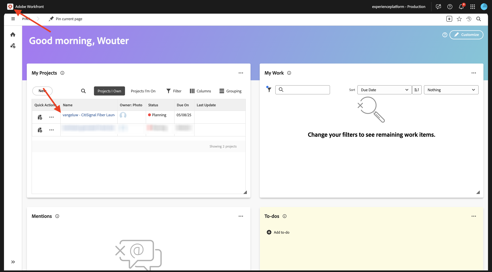
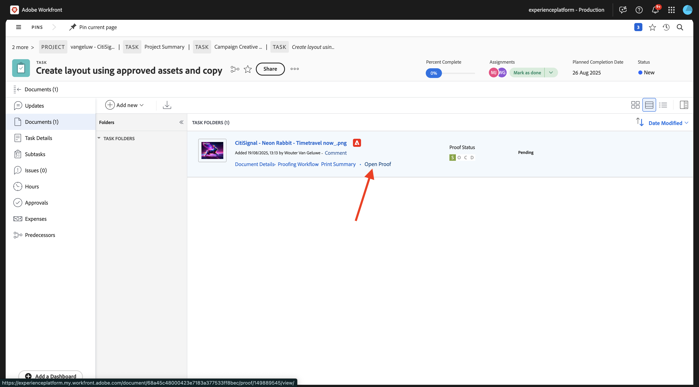
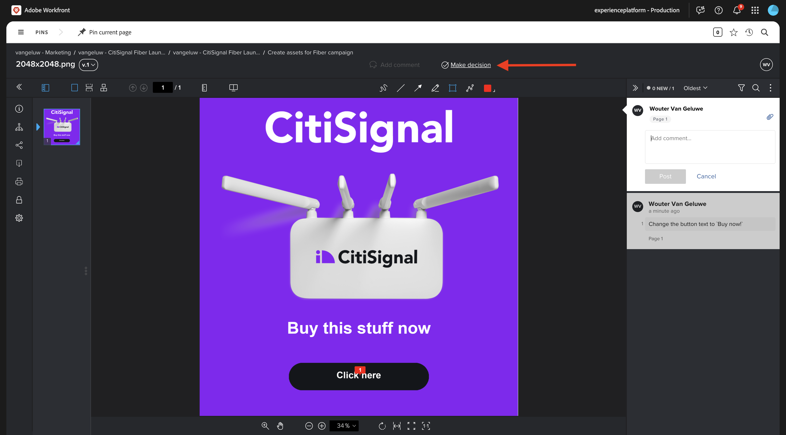

# 1.2.2 Strumenti di correzione con Workfront

>[!IMPORTANT]
>
>Se in precedenza hai configurato un programma AEM CS con un ambiente AEM Assets CS, è possibile che la sandbox AEM CS sia stata sospesa. Dato che la disattivazione di una sandbox di questo tipo richiede 10-15 minuti, sarebbe opportuno avviare subito il processo di disattivazione in modo da non doverlo attendere in un secondo momento.

## 1.2.2.1 Crea un nuovo flusso di approvazione

Torna a **Adobe Workfront**. Fai clic sull&#39;icona **menu** e seleziona **Strumenti di correzione**.

Vai a **Flussi di lavoro**, fai clic su **+ Nuovo**, quindi seleziona **Nuovo modello**.

Imposta **Nome modello** su `--aepUserLdap-- - Approval Workflow` e imposta il **Proprietario modello** su se stesso.

Scorri verso il basso e, in **Fasi** > **Fase 1**, aggiungiti con il **Ruolo** di **Revisore e Approvatore**.

Fai clic su **Crea**.

Il flusso di lavoro di approvazione di base è ora pronto per essere utilizzato.

## 1.2.2.2 Crea un nuovo progetto

Apri il **menu** e passa a **Programmi**.

Fare clic sul programma creato in precedenza, denominato `--aepUserLdap-- CitiSignal Fiber Launch`.

>[!NOTE]
>
>Hai creato un programma nell&#39;ambito dell&#39;esercizio su [Workfront Planning](./../module1.1/ex1.md) con l&#39;automazione creata ed eseguita. Se non l&#39;avete ancora fatto, potete trovare le istruzioni.

Nel tuo programma, vai a **Progetti**. Fare clic su **+ Nuovo progetto** e quindi selezionare **Nuovo progetto**.

Dovresti vedere questo. Cambia il nome in `--aepUserLdap-- - CitiSignal Fiber Launch`.

Vai a **Dettagli progetto**. Fai clic su **+Aggiungi** in **Descrizione**.

Imposta la descrizione su `The CitiSignal Fiber Launch project is used to plan the upcoming launch of CitiSignal Fiber.`

Fai clic su **Salva modifiche**.

Il progetto è stato creato.

## 1.2.2.3 Crea una nuova attività

Vai a **Attività** e fai clic su **+ Nuova attività**.

Immettere questo nome per l&#39;attività: `Create assets for Fiber campaign`.

Imposta il campo **Descrizione** su: `This task is used to track the progress of the creation of the assets for the CitiSignal Fiber Launch Campaign.`

Fai clic su **Crea attività**.

Dovresti vedere questo.

Nella colonna **Assegnazione**, aggiungi il tuo nome.

L&#39;attività verrà quindi assegnata all&#39;utente.

## 1.2.2.4 Aggiungere un nuovo documento all&#39;attività Passare attraverso il flusso di approvazione

Fai clic sul logo **Workfront** per tornare alla pagina della panoramica. Nella panoramica dovrebbe quindi essere visualizzato il progetto appena creato. Fai clic sul progetto per aprirlo.

In **Attività**, fare clic per aprire l&#39;attività.

Vai a **Documenti**. Fare clic su **+ Aggiungi nuovo** e quindi selezionare **Documento**.

Scarica [questo file](./images/2048x2048.png) sul desktop.

{width="50px" align="left"}

Seleziona il file **2048x2048.png** e fai clic su **Apri**.

Dovresti avere questo. Passa il cursore del mouse sul documento caricato. Fai clic su **Crea bozza** e scegli **Advanced Proof**.

Nella finestra **nuova bozza**, selezionare **Automatizzata**, quindi selezionare il modello di workflow creato in precedenza, che deve essere denominato `--aepUserLdap-- - Approval Workflow`. Fare clic su **Crea bozza**.

Fai clic su **Lavoraci**.

Fai clic su **Apri bozza**

È ora possibile rivedere la bozza. Selezionare **Aggiungi commento** per aggiungere un commento che richiede la modifica del documento.

Inserisci il commento e fai clic su **Post**. Fai clic su **Chiudi**.

Successivamente, devi cambiare il tuo ruolo da **Revisore** a **Revisore e Approvatore**. Per eseguire questa operazione, torna all&#39;attività e fai clic su **Flusso di lavoro di verifica**.

Cambia il tuo ruolo da **Revisore** a **Revisore e Approvatore**.

Torna all’Attività e apri nuovamente la bozza. Viene visualizzato un nuovo pulsante, **Decidi**. Fai clic su di esso.

Seleziona **Modifiche richieste** e fai clic su **prendi decisione**.

Torna alla **Attività** e al **Documento**. Ora devi caricare una seconda immagine che tenga conto dei commenti forniti.

Scarica [questo file](./images/2048x2048_buynow.png) sul desktop.

{width="50px" align="left"}

Nella visualizzazione Attività, selezionare il file di immagine precedente che non è stato approvato. Quindi fare clic su **+ Aggiungi nuovo**, selezionare **Versione** e quindi selezionare **Documento**.

Seleziona il file **2048x2048_buynow.png** e fai clic su **Apri**.

Dovresti avere questo. Fai clic su **Crea bozza**, quindi seleziona di nuovo **Advanced Proof**.

Poi vedrai questo. Il modello di **flusso di lavoro** è ora preselezionato in quanto Workfront presuppone che il flusso di lavoro di approvazione precedente sia ancora valido. Fare clic su **Crea bozza**.

Seleziona **Apri bozza**.

Ora puoi vedere due versioni del file una accanto all’altra.

Fai clic su **Prendi una decisione**, seleziona **Approvato**, quindi fai di nuovo clic su **Prendi una decisione**.

Fai clic su **Nome attività** per tornare alla panoramica attività.

Tornerai quindi nella vista Attività, con una risorsa approvata. Questa risorsa ora deve essere condivisa con AEM Assets.

Selezionare il documento approvato. Fai clic sull&#39;icona **Condividi freccia** e seleziona l&#39;integrazione AEM Assets, che deve essere denominata `--aepUserLdap-- - CitiSignal AEM`.

Fare doppio clic sulla cartella creata in precedenza, che deve essere denominata `--aepUserLdap-- - CitiSignal Fiber Launch Assets`.

Fare clic su **Seleziona cartella**.

Dopo 1-2 minuti, il documento verrà pubblicato in AEM Assets. Accanto al nome del documento verrà visualizzata l&#39;icona AEM.

Fai clic su **Contrassegna come completato** per completare l&#39;attività.

Dovresti vedere questo.

## 1.2.2.5 Visualizza il file in AEM Assets

Vai alla cartella in AEM Assets CS, denominata `--aepUserLdap-- - CitiSignal Fiber Launch Assets`.

Selezionare l&#39;immagine, quindi scegliere **Dettagli**.

Viene quindi visualizzato il Modulo metadati creato in precedenza, con i valori che sono stati compilati automaticamente dall’integrazione tra Workfront e AEM Assets.

Torna a [Gestione dei flussi di lavoro con Adobe Workfront](./workfront.md){target="_blank"}

[Torna a tutti i moduli](./../../../overview.md){target="_blank"}
