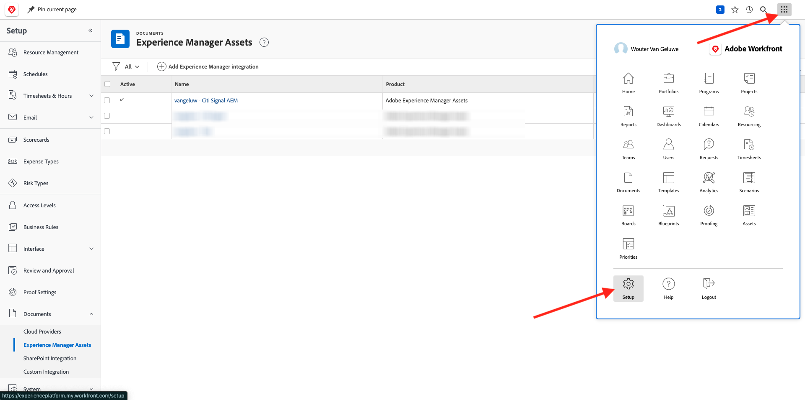
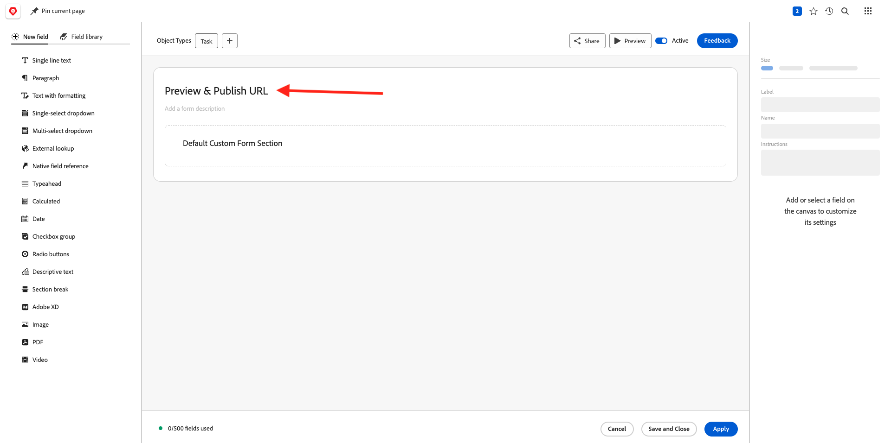
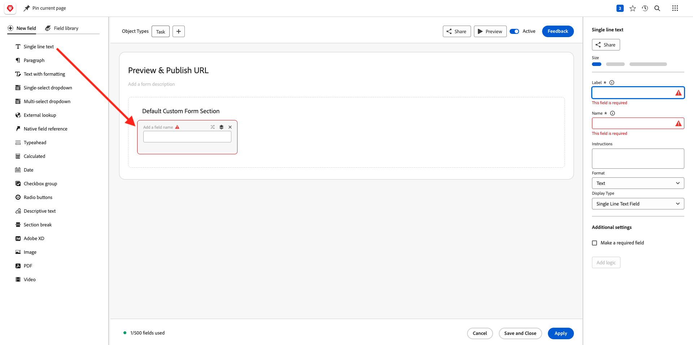

# 1.2.4 Workfront + AEM Sites

Accedi ad Adobe Workfront da [https://experienceplatform.my.workfront.com/](https://experienceplatform.my.workfront.com/){target="_blank"}.

Poi vedete questo.

## 1.2.4.1 Configurare l&#39;integrazione AEM Sites

>[!NOTE]
>
>Questo plug-in è attualmente in modalità **Accesso anticipato** e non è ancora disponibile a livello generale.
>
>Questo plug-in potrebbe essere già installato nell’istanza di Workfront utilizzata. Se è già installato, puoi consultare le istruzioni riportate di seguito, ma non è necessario apportare alcuna modifica alla configurazione.

Vai a [https://experience.adobe.com/#/@experienceplatform/aem/extension-manager/universal-editor](https://experience.adobe.com/#/@experienceplatform/aem/extension-manager/universal-editor){target="_blank"}.

Verificare che l&#39;opzione **Attiva** per questo plug-in sia impostata su **Attiva**. Quindi, fai clic sull&#39;icona **ingranaggio**.

Verrà visualizzata una finestra a comparsa **Configurazione estensione**. Configura i campi seguenti per utilizzare questo plug-in.

| Chiave | Valore |
| --------------- | ------------------------------ | 
| **`IMS_ENV`** | **PROD** |
| **`WORKFRONT_INSTANCE_URL`** | **https://experienceplatform.my.workfront.com** |
| **`SHOW_CUSTOM_FORMS`** | **&#39;{&quot;previewUrl&quot;: true, &quot;publishUrl&quot;: true}&#39;** |

Fai clic su **Salva**.

Torna all&#39;interfaccia utente di Workfront e fai clic sull&#39;icona dei 9 puntini **hamburger**. Selezionare **Configurazione**.

Nel menu a sinistra, vai a **Forms personalizzato** e seleziona **Modulo**. Fare clic su **+ Nuovo modulo personalizzato**.

Seleziona **Attività** e fai clic su **Continua**.

Verrà quindi visualizzato un modulo personalizzato vuoto. Immettere il nome del modulo `Content Fragment & Integration ID`.

Trascina un nuovo campo **Testo su riga singola** nell&#39;area di lavoro.

Configura il nuovo campo come segue:

- **Etichetta**: **Frammento di contenuto**
- **Nome**: **`aem_workfront_integration_content_fragment`**

Aggiungi un nuovo campo **Testo a riga singola** nell&#39;area di lavoro e configura il nuovo campo come segue:

- **Etichetta**: **ID integrazione**
- **Nome**: **`aem_workfront_integration_id`**

Fare clic su **Applica**.

Ora devi configurare un secondo modulo personalizzato. Fare clic su **+ Nuovo modulo personalizzato**.

Seleziona **Attività** e fai clic su **Continua**.

Verrà quindi visualizzato un modulo personalizzato vuoto. Immettere il nome del modulo `Preview & Publish URL`.

Trascina un nuovo campo **Testo su riga singola** nell&#39;area di lavoro.

Configura il nuovo campo come segue:

- **Etichetta**: **URL anteprima**
- **Nome**: **`aem_workfront_integration_preview_url`**

Aggiungi un nuovo campo **Testo a riga singola** nell&#39;area di lavoro e configura il nuovo campo come segue:

- **Etichetta**: **URL pubblicazione**
- **Nome**: **`aem_workfront_integration_publish_url`**

Fare clic su **Applica**.

Dovresti quindi avere a disposizione 2 moduli personalizzati.

Passaggio successivo: [1.2.2 Verifica con Workfront](./ex2.md){target="_blank"}

Torna a [Gestione dei flussi di lavoro con Adobe Workfront](./workfront.md){target="_blank"}

[Torna a tutti i moduli](./../../../overview.md){target="_blank"}
