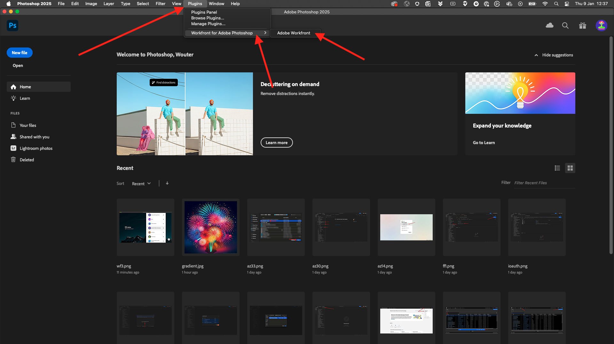
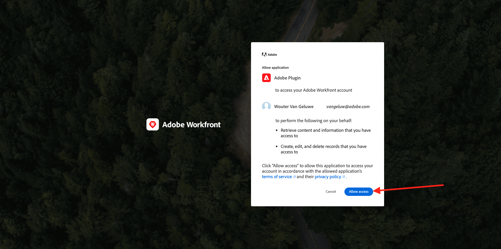

# 1.2.5 Configurazione del plug-in Photoshop + Workfront

## 1.2.5.1 Installare il plug-in Workfront for Photoshop

Per configurare l&#39;integrazione tra Workfront e Photoshop, installare l&#39;applicazione Creative Cloud nel computer. Accedi con il tuo Adobe ID.

Seleziona **Account aziendale o scolastico** e autentica.

Seleziona un profilo per accedere.

Allora sarai qui. Vai a **Stock e Marketplace**.

Fare clic su **Plug-in** e quindi su **Gestisci plug-in**. Fai clic su **Installa** nella scheda **Adobe Workfront per Photoshop**.

Fai clic su **OK**.

Poi vedrai questo.

## 1.2.5.2 Configurare il plug-in in Photoshop

Apri Photoshop. Nella barra delle attività, vai a **Plug-in** > **Workfront per Adobe Photoshop** > fai clic su **Adobe Workfront**.

Poi vedrai questo.

Immetti il dominio dell’istanza Adobe Workfront. Fai clic su **Accesso**.

Fare clic su **Consenti**.

Accedi con **Adobe ID**.

Seleziona **Account aziendale o scolastico**.

Fare clic su **Consenti accesso**.

A questo punto verrà visualizzata questa conferma.

Torna a Photoshop e vedrai che il plug-in è pronto per essere utilizzato e mostra le attività attive.

Torna a [Gestione dei flussi di lavoro con Adobe Workfront](./workfront.md){target="_blank"}

[Torna a tutti i moduli](./../../../overview.md){target="_blank"}
