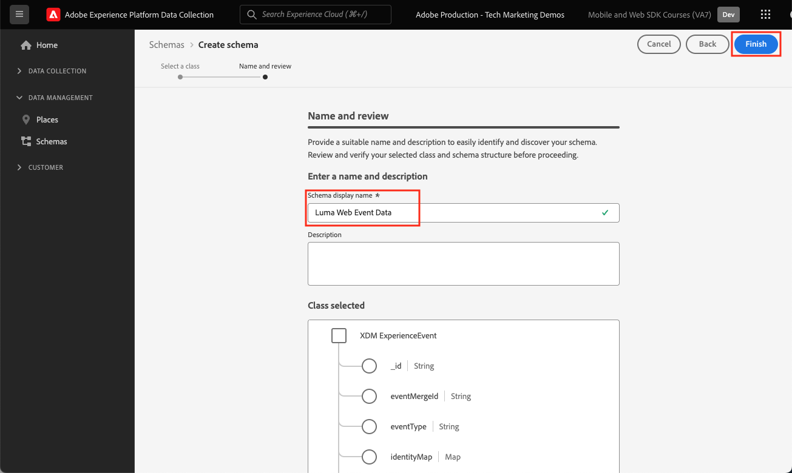

# Creare uno schema XDM per i dati web

Scopri come creare uno schema XDM per i dati web nell’interfaccia di Data Collection.

Gli schemi Experience Data Model (XDM) sono gli elementi costitutivi, i principi e le best practice per la raccolta di dati in Adobe Experience Platform.

Platform Web SDK utilizza lo schema per standardizzare i dati dell’evento web, inviarli alla rete Edge di Platform e infine inoltrarli a qualsiasi applicazione Experience Cloud configurata nello stream di dati. Questo passaggio è fondamentale in quanto definisce un modello dati standard necessario per acquisire i dati sulla customer experience in Experienci Platform e abilita servizi e applicazioni a valle basati su questi standard.

## Perché modellare i dati?

Le aziende hanno un proprio linguaggio per comunicare sul proprio dominio. I concessionari di automobili si occupano di marche, modelli e cilindri. Le compagnie aeree si occupano di numeri di volo, classe di servizio e assegnazione di posti. Alcuni di questi termini sono specifici per un&#39;azienda specifica, altri sono condivisi tra un settore verticale e altri sono condivisi da quasi tutte le aziende. Per i termini condivisi in un settore verticale o anche più ampio, puoi iniziare a fare cose potenti con i tuoi dati quando denomini e strutturi questi termini in modo comune.

Ad esempio, molte aziende gestiscono gli ordini. E se, collettivamente, queste aziende decidessero di modellare un ordine in modo simile? Ad esempio, cosa succede se il modello dati è costituito da un oggetto con un `priceTotal` proprietà che rappresentava il prezzo totale dell’ordine? Cosa succede se l’oggetto aveva anche proprietà denominate `currencyCode` e `purchaseOrderNumber`? È possibile che l&#39;oggetto order contenga una proprietà denominata `payments` si tratta di una matrice di oggetti di pagamento. Ogni oggetto rappresenta un pagamento per l&#39;ordine. Ad esempio, un cliente ha pagato parte dell’ordine con una gift card e il resto con una carta di credito. Puoi iniziare a costruire un modello simile al seguente:

```json
{
  "order": {
    "priceTotal": 89.50,
    "currencyCode": "EUR",
    "purchaseOrderNumber": "JWN20192388410012",
    "payments": [
      {
        "paymentType": "gift_card",
        "paymentAmount": 50
      },
      {
        "paymentType": "credit_card",
        "paymentAmount": 39.50
      }
    ]
  }
}
```

Se tutte le aziende che gestiscono gli ordini decidessero di modellare i propri dati in modo coerente per i termini comuni nel settore, potrebbero iniziare a verificarsi eventi magici. Lo scambio di informazioni all’interno e all’esterno dell’organizzazione può essere più fluido, invece di continuare a interpretare e tradurre i dati (prop ed evar, qualcuno?). L’apprendimento automatico potrebbe capire più facilmente quali sono i tuoi dati _significa_ e fornire informazioni fruibili. Le interfacce utente per la visualizzazione di dati rilevanti potrebbero diventare più intuitive. I dati possono essere integrati direttamente con partner e fornitori che seguono lo stesso modello.

Questo è l&#39;obiettivo di Adobe [Experience Data Model](https://business.adobe.com/products/experience-platform/experience-data-model.html). XDM fornisce una modellazione prescrittiva per i dati comune nel settore, consentendo al contempo di estendere il modello in base alle tue esigenze specifiche. Adobe Experience Platform è basato su XDM e, come tale, i dati inviati ad Experienci Platform devono essere in XDM. Invece di pensare a dove e come trasformare i modelli di dati correnti in XDM prima di inviare i dati ad Experienci Platform, considera l’adozione più diffusa di XDM all’interno dell’organizzazione, in modo che la traduzione abbia raramente bisogno di essere eseguita.


>[!NOTE]
>
> A scopo dimostrativo, gli esercizi di questa lezione creano uno schema di esempio per acquisire i contenuti visualizzati e i prodotti acquistati dai clienti in [Sito dimostrativo Luma](https://luma.enablementadobe.com/content/luma/us/en.html). Anche se puoi utilizzare questi passaggi per creare uno schema diverso per le tue finalità, ti consigliamo di seguire prima la creazione dello schema di esempio per scoprire le funzionalità dell’editor schema.

Per ulteriori informazioni sugli schemi XDM, segui il corso [Modellare i dati sull’esperienza del cliente con XDM](https://experienceleague.adobe.com/?recommended=ExperiencePlatform-D-1-2021.1.xdm&amp;lang=it) oppure visualizzare [Panoramica del sistema XDM](https://experienceleague.adobe.com/docs/experience-platform/xdm/home.html?lang=it).

## Obiettivi di apprendimento

Alla fine di questa lezione, potrai:

* Creare uno schema XDM dall’interfaccia di Data Collection
* Aggiungere gruppi di campi allo schema XDM
* Creare schemi XDM per i dati degli eventi web utilizzando le best practice

## Prerequisiti

Adobe Experience Platform Sono descritti in [panoramica](overview.md) pagina.

## Creare uno schema XDM

Gli schemi XDM sono il modo standard per descrivere i dati in Experienci Platform, consentendo a tutti i dati conformi agli schemi di essere riutilizzati in un’organizzazione senza conflitti, o anche condivisi tra più organizzazioni. Per ulteriori informazioni, consulta [Nozioni di base sulla composizione dello schema](https://experienceleague.adobe.com/docs/experience-platform/xdm/schema/composition.html?lang=it).

In questo esercizio creerai uno schema XDM utilizzando i gruppi di campi della linea di base consigliati per l’acquisizione dei dati dell’evento web sulla [Sito dimostrativo Luma](https://luma.enablementadobe.com/content/luma/us/en.html){target="_blank"}:

1. Apri [Interfaccia di Data Collection](https://launch.adobe.com/){target="_blank"}
1. Assicurati di trovarti nella sandbox corretta. Individua la sandbox nell’angolo superiore destro

   >[!NOTE]
   >
   >Se sei il cliente di un’applicazione basata su Platform come Real-Time CDP o Journey Optimizer, per questa esercitazione ti consigliamo di utilizzare una sandbox di sviluppo. In caso contrario, utilizza **[!UICONTROL Prod]** sandbox.

1. Vai a **[!UICONTROL Schemi]** nel menu di navigazione a sinistra
1. Seleziona la **[!UICONTROL Crea schema]** pulsante in alto a destra

   
1. Seleziona **[!UICONTROL Evento esperienza]** nella seguente schermata
1. Seleziona **[!UICONTROL Successivo]**

   

1. Immetti il nome dello schema in **[!UICONTROL Nome visualizzato schema]** in questo caso `Luma Web Event Data`

   >[!TIP]
   >
   >Una convenzione di denominazione comune per gli schemi XDM consiste nel denominare lo schema dopo l’origine dei dati.


1. Seleziona fine

   

## Aggiungi gruppi di campi

Come indicato in precedenza, XDM è il framework principale che standardizza i dati sull’esperienza del cliente fornendo strutture e definizioni comuni da utilizzare nei servizi Adobe Experience Platform a valle. Aderendo agli standard XDM, _tutti i dati sulla customer experience_ può essere incorporata in una rappresentazione comune. Questo approccio consente di ottenere informazioni preziose dalle azioni dei clienti, definire i tipi di pubblico dei clienti attraverso i segmenti ed esprimere gli attributi dei clienti a scopo di personalizzazione utilizzando dati provenienti da più origini. Consulta [Best practice per la modellazione dei dati](https://experienceleague.adobe.com/docs/experience-platform/xdm/schema/best-practices.html?lang=en) per ulteriori informazioni.

Quando possibile, si consiglia di utilizzare i gruppi di campi esistenti e di aderire a un modello indipendente dal prodotto e alle convenzioni di denominazione. Per i dati specifici dell’organizzazione che non rientrano nei gruppi di campi predefiniti qui sopra, puoi creare un gruppo di campi personalizzato. Consulta [Creazione di uno schema tramite l’Editor di schema](https://experienceleague.adobe.com/docs/experience-platform/xdm/tutorials/create-schema-ui.html?lang=en#create) per i passaggi più dettagliati sugli schemi personalizzati.

>[!TIP]
> 
>In questo esercizio aggiungerai i gruppi di campi predefiniti consigliati per la raccolta di dati web: _**[!UICONTROL ExperienceEvent di AEP Web SDK]**_ e _**[!UICONTROL Evento esperienza del consumatore]**_.
>
>
> Se implementi solo **Adobe Analytics** con Web SDK e non inviare dati a **Experience Platform**, utilizza [!UICONTROL Modello Adobe Analytics ExperienceEvent] per definire lo schema XDM. Questo verrà utilizzato nel [Configurazione analisi](setup-analytics.md) lezione.

1. In **[!UICONTROL Gruppi di campi]** sezione, seleziona **[!UICONTROL Aggiungi]**

   

1. Cerca [!UICONTROL `AEP Web SDK ExperienceEvent`]
1. Seleziona la casella
1. Cerca [!UICONTROL `Consumer Experience Event`]
1. Seleziona la casella
1. Seleziona **[!UICONTROL Aggiungi gruppi di campi]**

   

Con entrambi i gruppi di campi, puoi accedere alle coppie chiave-valore più comunemente utilizzate, necessarie per la raccolta di dati sul web. Il [!UICONTROL nome visualizzato] di ciascun campo viene visualizzato dagli addetti al marketing nell’interfaccia di segment builder delle applicazioni basate su Platform e puoi modificare il nome visualizzato dei campi standard in base alle tue esigenze. È inoltre possibile rimuovere i campi non desiderati. Quando fai clic sul nome di uno dei gruppi di campi, l’interfaccia evidenzia quali gruppi di coppie chiave-valore appartengono ad esso. Nell’esempio seguente, puoi vedere a quali gruppi appartengono **[!UICONTROL Evento esperienza del consumatore]**.


Questa lezione è solo un punto di partenza. Quando crei uno schema di eventi web personalizzato, devi esplorare e documentare i requisiti aziendali. Questo processo è simile alla creazione di un’ [Documento sui requisiti aziendali](https://experienceleague.adobe.com/docs/analytics-learn/tutorials/implementation/implementation-basics/creating-a-business-requirements-document.html?lang=it) e [Guida di riferimento per la progettazione della soluzione](https://experienceleague.adobe.com/docs/analytics-learn/tutorials/implementation/implementation-basics/creating-and-maintaining-an-sdr.html) per un’implementazione di Adobe Analytics, ma devono includere i requisiti per _tutti i destinatari di dati a valle_ ad esempio Platform, Target e le destinazioni di inoltro degli eventi.


### Oggetto identityMap

Esiste un campo speciale utilizzato per identificare gli utenti web chiamato `[!UICONTROL identityMap]`.


Si tratta di un oggetto obbligatorio per qualsiasi raccolta di dati relativi al web, in quanto ospita l’ID Experience Cloud richiesto per identificare gli utenti sul web. È anche la chiave per impostare gli ID cliente interni per gli utenti autenticati. `[!UICONTROL identityMap]` viene discusso ulteriormente in [Configurare le identità](configure-identities.md) lezione. Viene incluso automaticamente in tutti gli schemi utilizzando **[!UICONTROL XDM ExperienceEvent]** classe.


>[!IMPORTANT]
>
> È possibile abilitare **[!UICONTROL Profilo]** per uno schema prima di salvarlo. **Do not** attivala a questo punto. Una volta che uno schema è abilitato per il profilo, non può essere disabilitato o eliminato. A questo punto non è possibile rimuovere i campi dagli schemi, anche se è possibile [Campi obsoleti nell’interfaccia utente](https://experienceleague.adobe.com/docs/experience-platform/xdm/tutorials/field-deprecation-ui.html?lang=en#deprecate). Queste implicazioni sono importanti da tenere presenti in un secondo momento quando si lavora con i propri dati nell’ambiente di produzione.
>
>
>Questa impostazione viene discussa ulteriormente durante il [Experience Platform di configurazione](setup-experience-platform.md) lezione.
>

Per completare questa lezione, seleziona **[!UICONTROL Salva]** in alto a destra.


Ora puoi fare riferimento a questo schema quando aggiungi l’estensione Web SDK alla proprietà tag.


[Successivo: ](configure-identities.md)

>[!NOTE]
>
>Grazie per aver dedicato il tuo tempo all’apprendimento di Adobe Experience Platform Web SDK. Se hai domande, vuoi condividere commenti generali o suggerimenti su contenuti futuri, condividili su questo [Experience League post di discussione community](https://experienceleaguecommunities.adobe.com/t5/adobe-experience-platform-launch/tutorial-discussion-implement-adobe-experience-cloud-with-web/td-p/444996)
