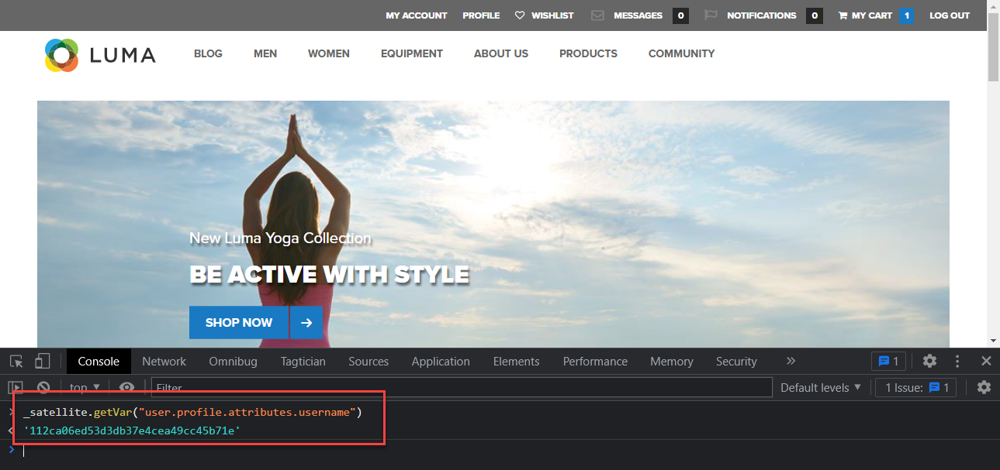

# Creare identità

Scopri come acquisire le identità con Experienci Platform Web SDK. Acquisire dati di identità autenticati e non autenticati sul [Sito di dimostrazione Luma](https://luma.enablementadobe.com/content/luma/us/en.html). Scopri come utilizzare gli elementi dati creati in precedenza per la raccolta di dati autenticati con un tipo di elemento dati Platform Web SDK denominato Mappa identità.

Esistono quattro nuovi tipi di elementi dati introdotti dall’estensione tag di Platform Web SDK:

1. ID unione evento
1. Mappa identità
1. Variable
1. Oggetto XDM

Questa lezione si concentra sull’elemento dati Identity map. Mappa su XDM gli elementi dati contenenti un ID utente autenticato e lo stato di autenticazione.

## Obiettivi di apprendimento

Alla fine di questa lezione, sarai in grado di:

* Comprendere la differenza tra l’ID Experience Cloud (ECID) e l’ID dispositivo di prime parti
* Differenza tra ID non autenticati e ID autenticati
* Creare un elemento dati della mappa di identità

## Prerequisiti

Conoscere cos’è un livello dati, acquisire familiarità con [Sito di dimostrazione Luma](https://luma.enablementadobe.com/content/luma/us/en.html){target="_blank"} e sapere come fare riferimento agli elementi dati nei tag. Devi aver completato i seguenti passaggi precedenti nell&#39;esercitazione:

* [Configurare uno schema XDM](configure-schemas.md)
* [Configurare uno spazio dei nomi delle identità](configure-identities.md)
* [Configurare uno stream di dati](configure-datastream.md)
* [Estensione Web SDK installata nella proprietà tag](install-web-sdk.md)
* [Creare elementi dati](create-data-elements.md)

>[!IMPORTANT]
>
>Il [Estensione del servizio ID Experience Cloud](https://exchange.adobe.com/experiencecloud.details.100160.adobe-experience-cloud-id-launch-extension.html) non è necessario quando si implementa Adobe Experience Platform Web SDK, in quanto la funzionalità del servizio ID è integrata in Platform Web SDK.

## Experience Cloud ID

Il [ID Experience Cloud (ECID)](https://experienceleague.adobe.com/docs/experience-platform/identity/ecid.html?lang=en) è uno spazio dei nomi di identità condiviso utilizzato nelle applicazioni Adobe Experience Platform e Adobe Experience Cloud. ECID fornisce la base per l’identità del cliente ed è l’identità predefinita per le proprietà digitali. Questo rende ECID l’identificatore ideale per il tracciamento del comportamento degli utenti non autenticati, perché è sempre presente.


<!-- FYI I commented this out because it was breaking the build - Jack
>[!TIP]
>
> When you use the Experience Platform Web SDK to set up Adobe applications on your digital properties, the ECID is generated at the Adobe Edge server level. As such, ECID is not viewable on the client-side network request payload. You can view the ECID by seeing the Preview tab of the network request, or by using the [Adobe Experience Platform Debugger Edge Trace](set-up-analytics.md#experience-cloud-id-validation).
>
-->

Ulteriori informazioni su come [Gli ECID vengono tracciati utilizzando Platform Web SDK](https://experienceleague.adobe.com/docs/experience-platform/edge/identity/overview.html?lang=en).

Gli ECID vengono impostati utilizzando una combinazione di cookie di prime parti e Platform Edge Network. Per impostazione predefinita, i cookie di prime parti sono impostati dall’SDK per web. Per tenere conto delle restrizioni del browser sulla durata dei cookie, puoi scegliere di impostare e gestire i cookie di prime parti. Questi sono denominati ID dispositivo di prime parti (FPID, first party device ID).

## ID dispositivo di prime parti (FPID)

Gli FPID sono cookie di prime parti _si imposta utilizzando i propri server web_ L’Adobe utilizza quindi per impostare l’ECID, invece di utilizzare il cookie di prime parti impostato dall’SDK per web. I cookie di prime parti sono più efficaci quando vengono impostati utilizzando un server che sfrutta un record A DNS (per IPv4) o AAAA (per IPv6), anziché un codice CNAME o JavaScript DNS.

Una volta impostato un cookie FPID, il relativo valore può essere recuperato e inviato all’Adobe durante la raccolta dei dati dell’evento. Gli FPID raccolti vengono utilizzati come seed per generare ECID su Platform Edge Network, che continuano a essere gli identificatori predefiniti nelle applicazioni Adobe Experience Cloud.

Ulteriori informazioni su [ID dispositivo di prime parti nell’SDK per web di Platform](https://experienceleague.adobe.com/docs/experience-platform/edge/identity/first-party-device-ids.html?lang=it)

>[!CAUTION]
>
> L’FPID è un modo alternativo di generare l’ECID utilizzando un cookie impostato dai server web. Non viene utilizzato per identificare gli utenti autenticati.

## ID autenticato

Come indicato in precedenza, a tutti i visitatori delle proprietà digitali viene assegnato un ECID a titolo di Adobe quando si utilizza Platform Web SDK. Questo rende ECID l’identità predefinita per il tracciamento del comportamento digitale non autenticato.

Puoi anche inviare un ID utente autenticato in modo che Platform possa creare [Grafici delle identità](https://experienceleague.adobe.com/docs/platform-learn/tutorials/identities/understanding-identity-and-identity-graphs.html?lang=it), Target può impostare la sua terza parte . Questa operazione viene eseguita utilizzando [!UICONTROL Mappa identità] tipo di elemento dati.

Per creare [!UICONTROL Mappa identità] data element:

1. Vai a **[!UICONTROL Elementi dati]** e seleziona **[!UICONTROL Aggiungi elemento dati]**

1. **[!UICONTROL Nome]** l’elemento dati `identityMap.loginID`

1. Come **[!UICONTROL Estensione]**, seleziona `Adobe Experience Platform Web SDK`

1. Come **[!UICONTROL Tipo di elemento dati]**, seleziona `Identity map`

1. In questo modo viene visualizzata un&#39;area dello schermo a destra all&#39;interno del **[!UICONTROL Interfaccia di Data Collection]** per configurare l’identità:

   

1. Come  **[!UICONTROL Namespace]**, seleziona la `lumaCrmId` spazio dei nomi creato in precedenza nel [Configurare le identità](configure-identities.md) lezione.

   >[!NOTE]
   >
   >    Se non vedi il tuo `lumaCrmId` spazio dei nomi, verifica di averlo creato anche nella sandbox di produzione predefinita. Solo gli spazi dei nomi creati nella sandbox di produzione predefinita vengono attualmente visualizzati nel menu a discesa dello spazio dei nomi.

1. Dopo il **[!UICONTROL Namespace]** deve essere impostato un ID. Seleziona la `user.profile.attributes.username` elemento dati creato in precedenza in [Creare elementi dati](create-data-elements.md#create-data-elements-to-capture-the-data-layer) lezione, che acquisisce un ID quando gli utenti vengono connessi al sito Luma.

   <!--  >[!TIP]
    >
    >You can verify the **[!UICONTROL Luma CRM ID]** is collected in a data element on the web property by going to the [Luma Demo site](https://luma.enablementadobe.com/content/luma/us/en.html), logging in, [switching the tag environment](validate-with-debugger.md#use-the-experience-platform-debugger-to-map-to-your-tag-property) to your own, and typing `_satellite.getVar("user.profile.attributes.username")` in the web browser developer console.
    >
    >   
    -->

1. Come **[!UICONTROL Stato autenticato]**, seleziona **[!UICONTROL Autenticato]**
1. Seleziona **[!UICONTROL Principale]**

1. Seleziona **[!UICONTROL Salva]**

   

>[!TIP]
>
> L’Adobe consiglia di inviare identità che rappresentano una persona, come `Luma CRM Id`, come [!UICONTROL primario] identità.
>
> Se la mappa di identità contiene l’identificatore della persona (ad es. `Luma CRM Id`), l&#39;identificatore della persona diventa [!UICONTROL primario] identità. Altrimenti, `ECID` diventa [!UICONTROL primario] identità.


<!--
1. Once the data element is configured in **[!UICONTROL Data Collection interface]**, it can be tested on the Luma web property like any other Data Element. Enter the following script in the browser developer console
   
   
   ```
   _satellite.getVar('identityMap.loginID')
   ```  

   
   
   >[!NOTE]
   >
   >ECID identifier will NOT populate in the Data Element, as this is configured already with Platform Web SDK.   
-->

Al termine di questi passaggi, dovresti aver creato i seguenti elementi di dati:

| Elementi dati dell&#39;estensione CORE | Elementi dati di Platform Web SDK |
-----------------------------|-------------------------------
| `cart.orderId` | `identityMap.loginID` |
| `page.pageInfo.hierarchie1` | `xdm.variable.content` |
| `page.pageInfo.pageName` | |
| `page.pageInfo.server` | |
| `user.profile.attributes.loggedIn` | |
| `user.profile.attributes.username` | |

Una volta impostati questi elementi dati, puoi iniziare a inviare dati a Platform Edge Network tramite l’oggetto XDM creando una regola nei tag.

[Successivo: ](create-tag-rule.md)

>[!NOTE]
>
>Grazie per aver dedicato il tuo tempo all’apprendimento di Adobe Experience Platform Web SDK. Se hai domande, vuoi condividere commenti generali o suggerimenti su contenuti futuri, condividili su questo [Experience League post di discussione community](https://experienceleaguecommunities.adobe.com/t5/adobe-experience-platform-launch/tutorial-discussion-implement-adobe-experience-cloud-with-web/td-p/444996)
