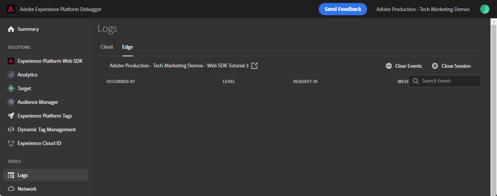

# Configurare Adobe Analytics con Platform Web SDK

Scopri come configurare Adobe Analytics utilizzando [Experienci Platform Web SDK](https://experienceleague.adobe.com/docs/platform-learn/data-collection/web-sdk/overview.html), crea regole di tag per inviare dati ad Adobe Analytics e verifica che Analytics stia acquisendo i dati come previsto.

[Adobe Analytics](https://experienceleague.adobe.com/docs/analytics.html?lang=it) è un&#39;applicazione leader di settore che ti consente di comprendere i tuoi clienti come persone e gestire la tua attività grazie alle informazioni sul cliente.

## Obiettivi di apprendimento

Alla fine di questa lezione, potrai:

* Configurare uno schema XDM per Adobe Analytics
* Comprendere la differenza tra le variabili XDM mappate automaticamente e manualmente per Analytics
* Configurare uno stream di dati per abilitare Adobe Analytics
* Sostituire uno stream di dati per inviare dati a un’altra suite di rapporti di Adobe Analytics
* Mappare singoli o interi elementi di dati array all’oggetto XDM
* Utilizza il tipo di azione Aggiorna regola variabile per impilare più regole in un unico evento XDM
* Acquisire le visualizzazioni di pagina in Adobe Analytics con l’oggetto XDM
* Acquisire dati di e-commerce con l’oggetto XDM per la stringa di prodotto Adobe Analytics
* Impostare un eVar di merchandising con sintassi prodotto utilizzando XDM
* Convalidare le variabili Adobe Analytics impostate con l’oggetto XDM utilizzando Experienci Platform Debugger
* Utilizzare le regole di elaborazione di Adobe Analytics per impostare variabili personalizzate
* Convalidare i dati acquisiti da Adobe Analytics tramite Adobe Experience Platform Assurance
* Convalidare i dati acquisiti da Adobe Analytics utilizzando i rapporti in tempo reale

## Prerequisiti

Per completare questa lezione, devi prima:

* Acquisisci familiarità con Adobe Analytics e accedi ad esso.

* Avere almeno un ID suite per report test/dev. Se non hai una suite per report test/dev che puoi usare per questa esercitazione, [creane uno](https://experienceleague.adobe.com/docs/analytics/admin/manage-report-suites/new-report-suite/t-create-a-report-suite.html).

* Completa le lezioni precedenti nelle sezioni Configurazione iniziale e Configurazione tag di questa esercitazione.

## Configurare lo stream di dati

Platform Web SDK invia i dati dal sito web a Platform Edge Network. Lo stream di dati comunica quindi a Platform Edge Network le suite di rapporti di Adobe Analytics a cui i dati devono essere inoltrati.

1. Vai a [Raccolta dati](https://experience.adobe.com/#/data-collection){target="blank"} Interfaccia
1. Nel menu di navigazione a sinistra, seleziona **[!UICONTROL Flussi di dati]**
1. Seleziona il creato in precedenza `Luma Web SDK: Development Environment` flusso di dati

   

1. Seleziona **[!UICONTROL Aggiungi servizio]**
   
1. Seleziona **[!UICONTROL Adobe Analytics]** come **[!UICONTROL Servizio]**
1. Inserisci il  **[!UICONTROL ID suite di rapporti]** della suite di rapporti per lo sviluppo
1. Seleziona **[!UICONTROL Salva]**

   

   >[!TIP]
   >
   >Aggiunta di più suite di rapporti selezionando **[!UICONTROL Aggiungi suite di rapporti]** equivale all’assegnazione tag per più suite.

>[!WARNING]
>
>In questa esercitazione, puoi configurare solo la suite di rapporti di Adobe Analytics per il tuo ambiente di sviluppo. Quando crei flussi di dati per il tuo sito web, puoi creare flussi di dati e suite di rapporti aggiuntivi per gli ambienti di staging e produzione.

## Schemi XDM e variabili Analytics

Congratulazioni! Hai già configurato uno schema compatibile con Adobe Analytics in [Configurare uno schema](configure-schemas.md) lezione!

Ma vi starete chiedendo, come posso impostare tutte le mie proprietà, eVar ed eventi?

Esistono diversi approcci che possono essere utilizzati simultaneamente:

1. Imposta i campi XDM standard; alcuni verranno mappati automaticamente sulle variabili di Analytics.
1. Mappa ulteriori campi XDM sulle variabili Analytics nelle regole di elaborazione Analytics.
1. Mappa sulle variabili di Analytics direttamente nello schema XDM.

<!-- Implementing Platform Web SDK should be as product-agnostic as possible. For Adobe Analytics, mapping eVars, props, and events doesn't occur during schema creation, nor during the tag rules configuration as it has been done traditionally. Instead, every XDM key-value pair becomes a Context Data Variable that maps to an Analytics variable in one of two ways: 

1. Automatically mapped variables using reserved XDM fields
1. Manually mapped variables using Analytics Processing Rules

To understand what XDM variables are auto-mapped to Adobe Analytics, please see [Variables automatically mapped in Analytics](https://experienceleague.adobe.com/docs/experience-platform/edge/data-collection/adobe-analytics/automatically-mapped-vars.html?lang=en). Any variable that is not auto-mapped must be manually mapped. 

 1. **Product-agnostic XDM**: maintain a semantic key-value pair XDM schema and use [Adobe Analytics Processing Rules](https://experienceleague.adobe.com/docs/analytics/admin/admin-tools/manage-report-suites/edit-report-suite/report-suite-general/c-processing-rules/processing-rules.html) to map the XDM fields to eVars, props, and so on. By a semantic XDM schema, we mean that the field names themselves have meaning. For example, the field name `web.webPageDetails.pageName` has more meaning than say `prop1` or `evar3`.

 1. **Analytics-specific XDM**: Use a purpose-built Adobe Analytics field group in the XDM schema called `Adobe Analytics ExperienceEvent Template`
 
The approach Adobe has seen customers prefer is the **Analytics-specific XDM**, because it skips the mapping step in the Adobe Analytics Processing Rules interface. The steps in this lesson use the **Analytics-specific XDM** approach.
-->

### Campi mappati automaticamente

Molti campi XDM vengono mappati automaticamente alle variabili di Analytics.

Lo schema creato in [Configurare uno schema](configure-schemas.md) La lezione contiene alcune variabili mappate automaticamente su Analytics, come descritto in questa tabella:

| Variabili mappate automaticamente da XDM ad Analytics | Variabile Adobe Analytics |
|-------|---------|
| `identitymap.ecid.[0].id` | mid |
| `web.webPageDetails.name` | s.pageName |
| `web.webPageDetails.server` | s.server |
| `web.webPageDetails.siteSection` | s.channel |
| `commerce.productViews.value` | prodView |
| `commerce.productListViews.value` | scView |
| `commerce.checkouts.value` | scCheckout |
| `commerce.purchases.value` | acquisto |
| `commerce.order.currencyCode` | s.currencyCode |
| `commerce.order.purchaseID` | s.purchaseID |
| `productListItems[].SKU` | s.products=;product name;;;; (primario - vedi nota sotto) |
| `productListItems[].name` | s.products=;product name;;;; (fallback - vedi la nota seguente) |
| `productListItems[].quantity` | s.products=;;quantità prodotto;;; |
| `productListItems[].priceTotal` | s.product=;;;;prezzo del prodotto;; |

Le singole sezioni della stringa di prodotto Analytics sono impostate tramite diverse variabili XDM sotto `productListItems` oggetto.
>Dal 18 agosto 2022, `productListItems[].SKU` ha priorità nella mappatura al nome del prodotto nella variabile s.products.
>Il valore impostato su `productListItems[].name` è mappato al nome del prodotto solo se `productListItems[].SKU` non esiste. In caso contrario, non è mappato ed è disponibile nei dati contestuali.
>Non impostare una stringa vuota o null su  `productListItems[].SKU`. Questo ha l’effetto indesiderato di mappare al nome del prodotto nella variabile s.products.

Per un elenco aggiornato delle mappature, consulta [Mappatura delle variabili di Analytics in Adobe Experience Edge](https://experienceleague.adobe.com/docs/experience-platform/edge/data-collection/adobe-analytics/automatically-mapped-vars.html?lang=it).

### Mappatura con le regole di elaborazione di Analytics

Tutti i campi nello schema XDM diventano disponibili per Adobe Analytics come variabili di dati contestuali con il seguente prefisso `a.x.`. Ad esempio, `a.x.web.webinteraction.region`

In questo esercizio mapperai una variabile XDM su una proprietà. Segui questi stessi passaggi per qualsiasi mappatura personalizzata da eseguire per qualsiasi `eVar`, `prop`, `event`, o variabile accessibile tramite Regole di elaborazione.

1. Passa all’interfaccia di Analytics
1. Vai a [!UICONTROL Amministratore] > [!UICONTROL Strumenti di amministrazione] > [!UICONTROL Suite di rapporti]
1. Seleziona la suite di rapporti per sviluppo/test che utilizzi per l’esercitazione > [!UICONTROL Modifica impostazioni] > [!UICONTROL Generale] > [!UICONTROL Regole di elaborazione]

   

1. Crea una regola per **[!UICONTROL Sovrascrivi valore di]** `[!UICONTROL Product SKU (prop1)]` a `a.x.productlistitems.0.sku`. Ricorda di aggiungere una nota sul motivo per cui stai creando la regola e assegna un nome al titolo della regola. Seleziona **[!UICONTROL Salva]**

   

   >[!IMPORTANT]
   >
   >La prima volta che esegui il mapping a una regola di elaborazione, l’interfaccia utente non mostra le variabili di dati di contesto dall’oggetto XDM. Per risolvere il problema, seleziona un valore qualsiasi, Salva e torna per modificarlo. Verranno visualizzate tutte le variabili XDM.

### Mappa sulle variabili Analytics nello schema XDM

In alternativa alle regole di elaborazione, è possibile eseguire il mapping alle variabili di Analytics nello schema XDM utilizzando `Adobe Analytics ExperienceEvent Template` gruppo di campi. Questo approccio ha guadagnato popolarità perché molti utenti lo trovano più semplice rispetto alla configurazione delle regole di elaborazione, tuttavia, aumentando la dimensione del payload XDM potrebbe a sua volta aumentare la dimensione del profilo in altre applicazioni come Real-Time CDP.

Per aggiungere `Adobe Analytics ExperienceEvent Template` gruppo di campi allo schema:

1. Apri [Raccolta dati](https://experience.adobe.com/#/data-collection){target="blank"} Interfaccia
1. Seleziona **[!UICONTROL Schemi]** dal menu di navigazione a sinistra
1. Assicurati di trovarti nella sandbox che utilizzi dall’esercitazione
1. Apri il `Luma Web Event Data` schema
1. In **[!UICONTROL Gruppi di campi]** sezione, seleziona **[!UICONTROL Aggiungi]**
1. Trova il `Adobe Analytics ExperienceEvent Template` e aggiungerlo allo schema

Ora imposta un eVar di merchandising nella stringa di prodotto. Con il `Adobe Analytics ExperienceEvent Template` gruppo di campi, puoi mappare le variabili a eVar o eventi di merchandising all’interno della stringa di prodotto. Questa operazione è nota anche come impostazione **Merchandising con sintassi prodotto**.

1. Torna alla proprietà tag

1. Apri la regola `ecommerce - library loaded - set product details variables - 20`

1. Apri **[!UICONTROL Imposta variabile]** azione

1. Seleziona per aprire `_experience > analytics > customDimensions > eVars > eVar1`

1. Imposta il **[!UICONTROL Valore]** a `%product.productInfo.title%`

1. Seleziona **[!UICONTROL Mantieni modifiche]**

   

1. Seleziona **[!UICONTROL Salva]** per salvare la regola

Come hai appena visto, fondamentalmente tutte le variabili di Analytics possono essere impostate nel `Adobe Analytics ExperienceEvent Template` gruppo di campi.

>[!NOTE]
>
> Osserva `_experience` oggetto in `productListItems` > `Item 1`. Impostazione di qualsiasi variabile in questo [!UICONTROL oggetto] imposta le eVar o gli eventi di sintassi prodotto.

### Inviare dati a una suite di rapporti diversa

Puoi modificare i dati della suite di rapporti di Adobe Analytics a cui vengono inviati i visitatori quando si trovano su determinate pagine. Questo richiede una configurazione sia nello stream di dati che in una regola.

#### Configurare una sostituzione della suite di rapporti per lo stream di dati

Per configurare un’impostazione di sostituzione della suite di rapporti di Adobe Analytics nello stream di dati:

1. Apri lo stream di dati
1. Modifica il **[!UICONTROL Adobe Analytics]** mediante l&#39;apertura della  menu e selezione **[!UICONTROL Modifica]**

   

1. Seleziona la **[!UICONTROL Opzioni avanzate]** per aprire **[!UICONTROL Sostituzioni suite di rapporti]**

1. Seleziona le suite di rapporti da ignorare. In questo caso, `Web SDK Course Dev` e `Web SDK Course Stg`

1. Seleziona Salva

   

#### Inviare una visualizzazione di pagina a una suite di rapporti diversa con la sostituzione dello stream di dati

Creiamo una regola per inviare una chiamata aggiuntiva di visualizzazione della pagina a una suite di rapporti diversa. Utilizza la funzione di sostituzione dello stream di dati per modificare la suite di rapporti per una pagina utilizzando **[!UICONTROL Invia evento]** Azione.

1. Crea una nuova regola, denominala `homepage - library loaded - AA report suite override - 51`

1. Seleziona il segno più sotto **[!UICONTROL Evento]** per aggiungere un nuovo trigger

1. Sotto **[!UICONTROL Estensione]**, seleziona **[!UICONTROL Core]**

1. Sotto **[!UICONTROL Tipo di evento]**, seleziona **[!UICONTROL libreria caricata]**

1. Seleziona per aprire **[!UICONTROL Opzioni avanzate]**, digitare `51`. In questo modo la regola viene eseguita dopo il `all pages - library loaded - send event - 50` che imposta l&#39;XDM della linea di base con **[!UICONTROL Aggiorna variabile]** tipo di azione.

   

1. Sotto **[!UICONTROL Condizioni]**, seleziona per **[!UICONTROL Aggiungi]**

1. Esci **[!UICONTROL Tipo di logica]** as **[!UICONTROL Normale]**

1. Esci **[!UICONTROL Estensioni]** as **[!UICONTROL Core]**

1. Seleziona **[!UICONTROL Tipo di condizione]** as **[!UICONTROL Percorso senza stringa di query]**

1. A destra, lascia il **[!UICONTROL Regex]** interruttore disabilitato

1. Sotto **[!UICONTROL path è uguale a]** set `/content/luma/us/en.html`. Per il sito di dimostrazione Luma, garantisce che la regola venga attivata solo sulla home page

1. Seleziona **[!UICONTROL Mantieni modifiche]**

   

1. Sotto **[!UICONTROL Azioni]** seleziona **[!UICONTROL Aggiungi]**

1. Come **[!UICONTROL Estensione]**, seleziona **[!UICONTROL Adobe Experience Platform Web SDK]**

1. Come **[!UICONTROL Tipo di azione]**, seleziona **[!UICONTROL Invia evento]**

1. Come **[!UICONTROL Tipo]**, seleziona `web.webpagedetails.pageViews`

1. Come **[!UICONTROL Dati XDM]**, seleziona la `xdm.variable.content` creato in [Creare elementi dati](create-data-elements.md) lezione

   

1. Scorri verso il basso fino a **[!UICONTROL Override delle configurazioni dello stream di dati]** sezione

1. Lascia **[!UICONTROL Sviluppo]** scheda selezionata.

   >[!TIP]
   >
   >    Questa scheda determina in quale ambiente di tag si verifica l’esclusione. Per questo estratto, specifichi solo l’ambiente di sviluppo, ma quando lo distribuisci in produzione ricorda di farlo anche nel **[!UICONTROL Produzione]** ambiente.

1. Seleziona la **[!UICONTROL Datastream]**, in questo caso `Luma Web SDK: Development Environment`

1. Sotto **[!UICONTROL Suite di rapporti]**, seleziona il sito di report che desideri utilizzare per la sostituzione. In questo caso, `tmd-websdk-course-stg`.

1. Seleziona **[!UICONTROL Mantieni modifiche]**

1. E **[!UICONTROL Salva]** regola

   

## Creare l’ambiente di sviluppo

Aggiungi nuovi elementi dati e regole al tuo `Luma Web SDK Tutorial` libreria di tag e ricreare l’ambiente di sviluppo.

Congratulazioni! Il passaggio successivo consiste nel convalidare l’implementazione di Adobe Analytics tramite Experienci Platform Web SDK.

## Convalidare Adobe Analytics per Platform Web SDK

In [Debugger](validate-with-debugger.md) lezione, hai imparato a verificare la richiesta XDM lato client con Platform Debugger e la console per sviluppatori del browser, in modo simile a come si esegue il debug di un’ `AppMeasurement.js` Implementazione di Analytics. Hai anche imparato a convalidare le richieste lato server di Platform Edge Network inviate ad applicazioni Adobe e a visualizzare un payload completamente elaborato utilizzando Assurance.

Per verificare che Analytics acquisisca correttamente i dati tramite Experienci Platform Web SDK, devi effettuare due passaggi ulteriori:

1. Convalida il modo in cui i dati vengono elaborati dall’oggetto XDM sulla rete Edge di Platform, utilizzando la funzione Edge Trace di Experienci Platform Debugger
1. Convalidare il modo in cui i dati vengono elaborati da Analytics utilizzando le Regole di elaborazione e i rapporti in tempo reale
1. Convalidare il modo in cui i dati vengono completamente elaborati da Analytics utilizzando Adobe Experience Platform Assurance

### Usa traccia spigoli

Scopri come verificare che Adobe Analytics acquisisca ECID, visualizzazioni di pagina, la stringa di prodotto e gli eventi di e-commerce con la funzione Edge Trace di Experienci Platform Debugger.

### Convalida dell’ID Experience Cloud

1. Vai a [Sito di dimostrazione Luma](https://luma.enablementadobe.com/content/luma/us/en.html){target="_blank"}
1. Seleziona il pulsante di accesso in alto a destra e utilizza le credenziali u: test@adobe.com p: test per autenticare
1. Apri Experienci Platform Debugger e [modifica la proprietà tag sul sito con la tua proprietà di sviluppo](validate-with-debugger.md#use-the-experience-platform-debugger-to-map-to-your-tags-property)

1. Per abilitare Edge Trace, passa a Debugger di Experienci Platform e, nel menu di navigazione a sinistra, seleziona **[!UICONTROL Registri]**, quindi seleziona la **[!UICONTROL Bordo]** e seleziona **[!UICONTROL Connetti]**

   

1. Per ora sarà vuoto

   

1. Aggiorna la pagina Luma e controlla di nuovo Debugger Experience Platform: dovresti vedere i dati arrivare. La riga che inizia con **[!UICONTROL Mappatura automatica di Analytics]** è il beacon di Adobe Analytics
1. Seleziona per aprire entrambi `[!UICONTROL mappedQueryParams]` e il secondo a discesa per visualizzare le variabili di Analytics

   

   >[!TIP]
   >
   >Il secondo elenco a discesa corrisponde all’ID suite di rapporti di Analytics a cui stai inviando i dati. Deve corrispondere alla tua suite di rapporti, non a quella nella schermata.

1. Scorri verso il basso per trovare `[!UICONTROL c.a.x.identitymap.ecid.[0].id]`. È una variabile di dati contestuali che acquisisce ECID
1. Continua a scorrere verso il basso fino a visualizzare il pannello Analytics `[!UICONTROL mid]` variabile. Entrambi gli ID corrispondono all’ID Experience Cloud del dispositivo.
1. Sul sito Luma,

   

   >[!NOTE]
   >
   >Dopo l&#39;accesso, attendere alcuni istanti per convalidare l&#39;ID autenticato `112ca06ed53d3db37e4cea49cc45b71e` per l’utente **`test@adobe.com`** viene acquisito anche in `[!UICONTROL c.a.x.identitymap.lumacrmid.[0].id]`

### Sostituzioni suite di rapporti

Sopra hai configurato una sostituzione dello stream di dati per [Home page Luma](https://luma.enablementadobe.com/content/luma/us/en.html).  Per convalidare questa configurazione

1. Cerca una riga con **[!UICONTROL Configurazione dello stream di dati dopo l’applicazione della sostituzione]**. Qui puoi trovare la suite di rapporti principale e le suite di rapporti aggiuntive configurate per le sostituzioni della suite di rapporti.

   

1. Scorri verso il basso fino alla riga che inizia con **[!UICONTROL Mappatura automatica di Analytics]**  e verifica che `[!UICONTROL reportSuiteIds]` mostra la suite di rapporti specificata nelle configurazioni di sostituzione

   

### Visualizzazioni della pagina del contenuto

Vai a una pagina di prodotto come [Pagina prodotto Didi Sport Watch](https://luma.enablementadobe.com/content/luma/us/en/products/gear/watches/didi-sport-watch.html#24-WG02).  Verifica che le visualizzazioni della pagina di contenuto siano acquisite da Analytics.

1. Cerca `[!UICONTROL c.a.x.web.webpagedetails.pageviews.value]=1`.
1. Scorri verso il basso per visualizzare `[!UICONTROL gn]` variabile. È la sintassi dinamica di Analytics per `[!UICONTROL s.pageName]` variabile. Acquisisce il nome della pagina dal livello dati.

   

### Stringa di prodotto ed eventi di e-commerce

Poiché ti trovi già in una pagina di prodotto, questo esercizio continua a utilizzare la stessa traccia Edge per convalidare i dati del prodotto acquisiti da Analytics. Sia la stringa di prodotto che gli eventi di e-commerce vengono mappati automaticamente le variabili XDM su Analytics. Se hai mappato al corretto `productListItem` Variabile XDM durante [configurazione di uno schema XDM per Adobe Analytics](setup-analytics.md#configure-an-xdm-schema-for-adobe-analytics), Platform Edge Network si occupa della mappatura dei dati sulle variabili di analisi appropriate.

**Verifica innanzitutto che il `Product String` è impostato**

1. Cerca `[!UICONTROL c.a.x.productlistitems.][0].[!UICONTROL sku]`. La variabile acquisisce il valore dell&#39;elemento dati mappato al `productListItems.item1.sku` all&#39;inizio di questa lezione
1. Cerca anche `[!UICONTROL c.a.x.productlistitems.][0].[!UICONTROL _experience.analytics.customdimensions.evars.evar1]`. La variabile acquisisce il valore dell’elemento dati su cui hai eseguito il mapping `productListItems.item1._experience.analytics.customdimensions.evars.evar1`
1. Scorri verso il basso per visualizzare `[!UICONTROL pl]` variabile. È la sintassi dinamica della variabile della stringa di prodotto Analytics
1. Il nome del prodotto dal livello dati è mappato sia al `[!UICONTROL c.a.x.productlistitems.][0].[!UICONTROL sku]` e `[!UICONTROL product]` parametro della stringa prodotti.  Inoltre, il titolo del prodotto dal livello dati viene mappato su evar1 merchandising nella stringa prodotti.

   

   La traccia Edge tratta `commerce` eventi leggermente diversi rispetto a `productList` dimensioni. Non viene visualizzata una variabile di dati contestuali mappata nello stesso modo in cui viene visualizzato il nome del prodotto mappato a `[!UICONTROL c.a.x.productlistitem.[0].name]` sopra. La traccia Edge mostra invece la mappatura automatica finale dell’evento in Analytics `event` variabile. Platform Edge Network lo mappa di conseguenza, purché mappato sul modello XDM corretto `commerce` variabile durante [configurazione dello schema per Adobe Analytics](setup-analytics.md#configure-an-xdm-schema-for-adobe-analytics); in questo caso il `commerce.productViews.value=1`.

1. Nella finestra di Experienci Platform Debugger, scorri verso il basso fino a `[!UICONTROL events]` variabile, è impostato su `[!UICONTROL prodView]`

1. Nota anche `[!UICONTROL c.a.x.eventType]` è impostato su `commerce.productViews` da quando ti trovi su una pagina di prodotto.

   >[!TIP]
   >
   > Il `ecommerce - pdp library loaded - AA (order 20)` la regola sta sovrascrivendo il valore di `eventType` impostato da `all pages global content variables - library loaded - AA (order 1)` regola impostata per essere attivata successivamente nella sequenza

   

**Convalida che gli altri eventi di e-commerce e le stringhe di prodotto siano impostati per Analytics**

1. Aggiungi [Orologio Didi Sport](https://luma.enablementadobe.com/content/luma/us/en/products/gear/watches/didi-sport-watch.html#24-WG02) al carrello
1. Vai a [Pagina carrello](https://luma.enablementadobe.com/content/luma/us/en/user/cart.html), verifica traccia spigolo per

   * `eventType` imposta su `commerce.productListViews`
   * `[!UICONTROL events: "scView"]`, e
   * la stringa di prodotto è impostata

   

1. Procedi con il pagamento, controlla Edge Trace per

   * `eventType` imposta su `commerce.checkouts`
   * `[!UICONTROL events: "scCheckout"]`, e
   * la stringa di prodotto è impostata

   

1. Compila solo il **Nome** e **Cognome** campi nel modulo di spedizione e selezionare **Continua**. Nella pagina successiva, seleziona **Inserisci ordine**
1. Nella pagina di conferma, seleziona Edge Trace per

   * `eventType` imposta su `commerce.purchases`
   * Evento di acquisto in fase di impostazione `[!UICONTROL events: "purchase"]`
   * Variabile codice valuta impostata `[!UICONTROL cc: "USD"]`
   * ID acquisto impostato in `[!UICONTROL pi]`
   * Stringa di prodotto `[!UICONTROL pl]` impostazione del nome, della quantità e del prezzo del prodotto

   

## Convalidare Adobe Analytics utilizzando Adobe Experience Platform Assurance

Adobe Experience Platform Assurance è un prodotto di Adobe Experience Cloud che consente di verificare, verificare, simulare e convalidare le modalità di raccolta dei dati o di gestione delle esperienze con il sito web e l’app mobile.

In precedenza hai convalidato la cattura da parte di Adobe Analytics dell’ECID, delle visualizzazioni di pagina, della stringa di prodotto e degli eventi di e-commerce con la funzione Edge Trace di Experienci Platform Debugger.  Hai anche convalidato la mappatura di prop1 utilizzando le Regole di elaborazione e i rapporti in tempo reale.  Successivamente, convalidare gli stessi eventi utilizzando Adobe Experience Platform Assurance.

>[!NOTE]
>
>Per convalidare i dati di Adobe Analytics con Adobe Experience Platform Assurance è necessario [Abilitare l’accesso degli utenti a Adobe Experience Platform Assurance](https://experienceleague.adobe.com/docs/experience-platform/assurance/user-access.html)

### Accedere a Adobe Experience Platform Assurance

Esistono diversi modi per accedere ad Assurance:

1. Tramite interfaccia Adobe Experience Platform
1. Tramite l’interfaccia di Adobe Experience Platform Data Collection
1. Attraverso i registri all’interno dell’Adobe Experience Platform Debugger (consigliato)

Per accedere ad Assurance tramite Adobe Experience Platform, scorri verso il basso e seleziona **[!UICONTROL Assurance]** nella barra di navigazione a sinistra sotto **[!UICONTROL RACCOLTA DATI]**.  Seleziona la **[!UICONTROL &quot;Esercitazione Web SDK 3&quot;]** per accedere agli eventi generati nella sezione precedente.

Per accedere a Assurance tramite Raccolta dati di Adobe Experience Platform, seleziona **[!UICONTROL Assurance]** nella barra di navigazione a sinistra sotto **[!UICONTROL RACCOLTA DATI]**.  Seleziona la **[!UICONTROL &quot;Esercitazione Web SDK 3&quot;]** per accedere agli eventi generati nella sezione precedente.\

Per accedere ad Assurance tramite Adobi Experience Platform Debugger, passa ad Experienci Platform Debugger e, nel menu di navigazione a sinistra, seleziona **[!UICONTROL Registri]**, quindi seleziona la **[!UICONTROL Bordo]** e seleziona **[!UICONTROL Connetti]**.  Una volta stabilita la connessione a Edge Network, seleziona l’icona del collegamento esterno. È consigliabile accedere ad Assurance tramite il debugger, in quanto al momento le sessioni web devono essere avviate dal debugger.

All&#39;interno del **[!UICONTROL &quot;Esercitazione Web SDK 3&quot;]** Invio sessione di garanzia **[!UICONTROL &quot;hitdebugger&quot;]** nella barra di ricerca degli eventi per filtrare i risultati in base ai dati post-elaborati di Adobe Analytics.

### Convalida dell’ID Experience Cloud con Assurance

Per verificare che Adobe Analytics acquisisca l’ECID, seleziona un beacon e apri il Payload.  Il fornitore per questo beacon deve essere **[!UICONTROL com.adobe.analytics.hitdebugger]**

Quindi scorri verso il basso fino a **[!UICONTROL mcvisId]** per verificare che l’ECID sia stato acquisito correttamente

### Convalida delle visualizzazioni della pagina del contenuto con Assurance

Utilizzando lo stesso beacon, verifica che le visualizzazioni della pagina di contenuto siano mappate sulla variabile Adobe Analytics corretta.
Scorri verso il basso fino a **[!UICONTROL pageName]** per verificare che `Page Name` viene acquisito correttamente

### Convalida della stringa di prodotto e degli eventi di e-commerce con Assurance

Seguendo gli stessi casi di utilizzo di convalida utilizzati per la convalida con Experienci Platform Debugger, continua a utilizzare lo stesso beacon per convalidare `Ecommerce Events` e `Product String`.

1. Cerca payload in cui **[!UICONTROL Eventi]** contain `prodView`
   
1. Scorri verso il basso fino a **[!UICONTROL product-string]** per convalidare `Product String`.
   * Osserva `Product SKU` e `Merchandizing eVar1`.
1. Scorri verso il basso e verifica che `prop1`, configurato utilizzando le regole di elaborazione nella sezione precedente, contiene `Product SKU`\
   

Continua a convalidare la tua implementazione rivedendo il carrello, gli eventi di pagamento e gli eventi di acquisto.

1. Cerca payload in cui **[!UICONTROL Eventi]** contain `scView` e convalida la stringa di prodotto.
   
1. Cerca payload in cui **[!UICONTROL Eventi]** contain `scCheckout` e convalida la stringa di prodotto.
   
1. Cerca payload in cui **[!UICONTROL Eventi]** contain `purchase`
   
1. Durante la convalida del `purchase` evento, tieni presente che `Product String` deve contenere `Product SKU`, `Product Quantity` , e `Product Total Price`.
1. Inoltre, per `purchase` verificare che `purchase-id` e/o `purchaseId` sono impostati

Congratulazioni! Ce l&#39;hai fatta! Questa è la fine della lezione e ora sei pronto a implementare Adobe Analytics con Platform Web SDK per il tuo sito Web.

[Successivo: ](setup-audience-manager.md)

>[!NOTE]
>
>Grazie per aver dedicato il tuo tempo all’apprendimento di Adobe Experience Platform Web SDK. Se hai domande, vuoi condividere commenti generali o suggerimenti su contenuti futuri, condividili su questo [Experience League post di discussione community](https://experienceleaguecommunities.adobe.com/t5/adobe-experience-platform-launch/tutorial-discussion-implement-adobe-experience-cloud-with-web/td-p/444996)
