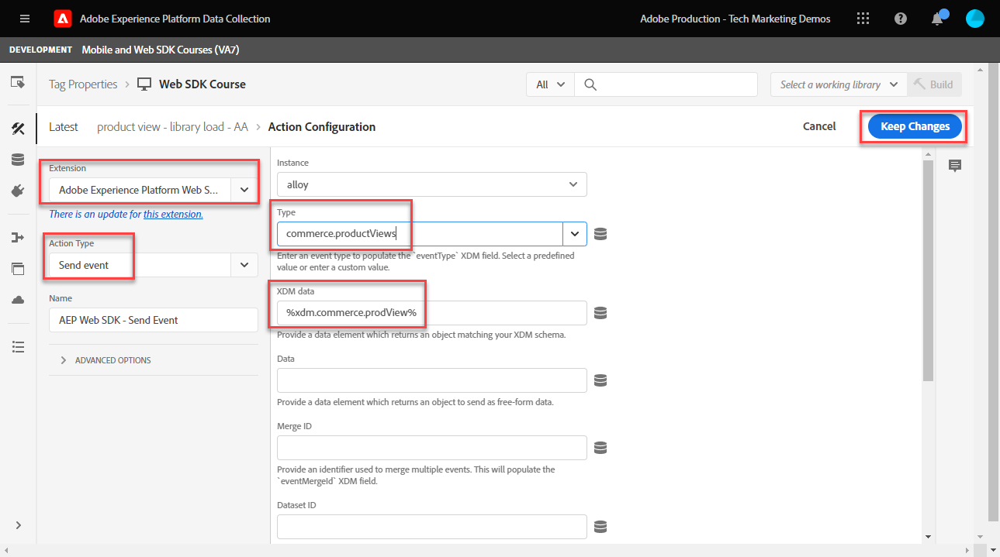

# Configurare Adobe Analytics con Platform Web SDK

Scopri come configurare Adobe Analytics utilizzando [Experienci Platform Web SDK](https://experienceleague.adobe.com/docs/platform-learn/data-collection/web-sdk/overview.html), crea regole di tag per inviare dati ad Adobe Analytics e verifica che Analytics stia acquisendo i dati come previsto.

[Adobe Analytics](https://experienceleague.adobe.com/docs/analytics.html?lang=it) è un&#39;applicazione leader di settore che ti consente di comprendere i tuoi clienti come persone e gestire la tua attività grazie alle informazioni sul cliente.


## Obiettivi di apprendimento

Alla fine di questa lezione, potrai:

* Configurare uno schema XDM per Adobe Analytics
* Comprendere la differenza tra le variabili XDM mappate automaticamente e manualmente per Analytics
* Configurare uno stream di dati per abilitare Adobe Analytics
* Sostituire uno stream di dati per inviare dati a un’altra suite di rapporti di Adobe Analytics
* Mappare singoli o interi elementi di dati array all’oggetto XDM
* Utilizza il tipo di azione Aggiorna regola variabile per impilare più regole in un unico evento XDM
* Acquisire le visualizzazioni di pagina in Adobe Analytics con l’oggetto XDM
* Acquisire dati di e-commerce con l’oggetto XDM per la stringa di prodotto Adobe Analytics
* Impostare un eVar di merchandising con sintassi prodotto utilizzando XDM
* Convalidare le variabili Adobe Analytics impostate con l’oggetto XDM utilizzando Experienci Platform Debugger
* Utilizzare le regole di elaborazione di Adobe Analytics per impostare variabili personalizzate
* Convalidare i dati acquisiti da Adobe Analytics tramite Adobe Experience Platform Assurance
* Convalidare i dati acquisiti da Adobe Analytics utilizzando i rapporti in tempo reale

## Prerequisiti

Conosci tag, Adobe Analytics e [Sito di dimostrazione Luma](https://luma.enablementadobe.com/content/luma/us/en.html){target="_blank"} funzionalità di login e shopping.

È necessario almeno un ID suite per report test/dev. Se non hai una suite per report test/dev che puoi usare per questa esercitazione, [creane uno](https://experienceleague.adobe.com/docs/analytics/admin/manage-report-suites/new-report-suite/t-create-a-report-suite.html).

Devi aver completato tutti i passaggi delle sezioni precedenti nell’esercitazione:

* Configurazione iniziale
   * [Configurare uno schema XDM](configure-schemas.md)
   * [Configurare uno spazio dei nomi delle identità](configure-identities.md)
   * [Configurare uno stream di dati](configure-datastream.md)
* Configurazione tag
   * [Installare l’estensione Web SDK](install-web-sdk.md)
   * [Creare elementi dati](create-data-elements.md)
   * [Creare identità](create-identities.md)
   * [Creare una regola di tag](create-tag-rule.md)
   * [Convalida con Adobe Experience Platform Debugger](validate-with-debugger.md)

È inoltre necessario [Abilitare l’accesso degli utenti a Adobe Experience Platform Assurance](https://experienceleague.adobe.com/docs/experience-platform/assurance/user-access.html) in modo da poter convalidare i dati di Adobe Analytics con Adobe Experience Platform Assurance. Se disponi di schemi di accesso, spazi dei nomi delle identità e flussi di dati, potrai già accedere ad Assurance.

## Schemi XDM e variabili Analytics

Congratulazioni! Hai già configurato uno schema compatibile con Adobe Analytics in [Configurare uno schema](configure-schemas.md) lezione! Tuttavia, per Adobe Analytics esistono due approcci generali per definire XDM per Adobe Analytics.

<!-- Implementing Platform Web SDK should be as product-agnostic as possible. For Adobe Analytics, mapping eVars, props, and events doesn't occur during schema creation, nor during the tag rules configuration as it has been done traditionally. Instead, every XDM key-value pair becomes a Context Data Variable that maps to an Analytics variable in one of two ways: 

1. Automatically mapped variables using reserved XDM fields
1. Manually mapped variables using Analytics Processing Rules

To understand what XDM variables are auto-mapped to Adobe Analytics, please see [Variables automatically mapped in Analytics](https://experienceleague.adobe.com/docs/experience-platform/edge/data-collection/adobe-analytics/automatically-mapped-vars.html?lang=en). Any variable that is not auto-mapped must be manually mapped. -->

1. **XDM indipendente dal prodotto**: gestisci uno schema XDM di coppia chiave-valore semantico e utilizza [Regole di elaborazione di Adobe Analytics](https://experienceleague.adobe.com/docs/analytics/admin/admin-tools/manage-report-suites/edit-report-suite/report-suite-general/c-processing-rules/processing-rules.html) mappare i campi XDM su eVar, prop e così via. Con uno schema XDM semantico, intendiamo che i nomi dei campi stessi hanno un significato. Ad esempio, il nome del campo `web.webPageDetails.pageName` ha più significato di dire `prop1` o `evar3`.

   >[!IMPORTANT]
   >
   > Tutti i campi nello schema XDM diventano disponibili per Adobe Analytics come variabili di dati contestuali con il seguente prefisso `a.x.`. Ad esempio, `a.x.web.webinteraction.region`

1. **XDM specifico per Analytics**: utilizza un gruppo di campi Adobe Analytics specifico nello schema XDM denominato `Adobe Analytics ExperienceEvent Template`

L&#39;Adobe di approccio ha visto i clienti preferire è **XDM specifico per Analytics**, perché ignora il passaggio di mappatura nell’interfaccia delle Regole di elaborazione di Adobe Analytics. I passaggi descritti in questa lezione utilizzano **XDM specifico per Analytics** approccio.

## Mappatura di XDM su Adobe Analytics

Molti campi XDM vengono mappati automaticamente alle variabili di Analytics.

Lo schema creato in [Configurare uno schema](configure-schemas.md) La lezione contiene alcune variabili mappate automaticamente su Analytics, come descritto in questa tabella:

| Variabili mappate automaticamente da XDM ad Analytics | Variabile Adobe Analytics |
|-------|---------|
| `identitymap.ecid.[0].id` | mid |
| `web.webPageDetails.name` | s.pageName |
| `web.webPageDetails.server` | s.server |
| `web.webPageDetails.siteSection` | s.channel |
| `commerce.productViews.value` | prodView |
| `commerce.productListViews.value` | scView |
| `commerce.checkouts.value` | scCheckout |
| `commerce.purchases.value` | acquisto |
| `commerce.order.currencyCode` | s.currencyCode |
| `commerce.order.purchaseID` | s.purchaseID |
| `productListItems[].SKU` | s.products=;product name;;;; (primario - vedi nota sotto) |
| `productListItems[].name` | s.products=;product name;;;; (fallback - vedi la nota seguente) |
| `productListItems[].quantity` | s.products=;;quantità prodotto;;; |
| `productListItems[].priceTotal` | s.product=;;;;prezzo del prodotto;; |

>[!NOTE]
>
>Le singole sezioni della stringa di prodotto Analytics sono impostate tramite diverse variabili XDM sotto `productListItems` oggetto.
>Dal 18 agosto 2022, `productListItems[].SKU` ha priorità nella mappatura al nome del prodotto nella variabile s.products.
>Il valore impostato su `productListItems[].name` è mappato al nome del prodotto solo se `productListItems[].SKU` non esiste. In caso contrario, non è mappato ed è disponibile nei dati contestuali.
>Non impostare una stringa vuota o null su  `productListItems[].SKU`. Questo ha l’effetto indesiderato di mappare al nome del prodotto nella variabile s.products.

Per un elenco aggiornato delle mappature, consulta [Mappatura delle variabili di Analytics in Adobe Experience Edge](https://experienceleague.adobe.com/docs/experience-platform/edge/data-collection/adobe-analytics/automatically-mapped-vars.html?lang=it).

Per le variabili XDM che non vengono mappate automaticamente, utilizza `Adobe Analytics ExperienceEvent Template` come descritto nella sezione successiva.


## Configurare lo stream di dati

Platform Web SDK invia i dati dal sito web a Platform Edge Network. Lo stream di dati comunica quindi a Platform Edge Network a quale delle suite di rapporti di Adobe Analytics inoltrare tali dati.

1. Vai a [Raccolta dati](https://experience.adobe.com/#/data-collection){target="blank"} Interfaccia
1. Nel menu di navigazione a sinistra, seleziona **[!UICONTROL Flussi di dati]**
1. Seleziona il creato in precedenza `Luma Web SDK: Development Environment` flusso di dati

   

1. Seleziona **[!UICONTROL Aggiungi servizio]**
   
1. Seleziona **[!UICONTROL Adobe Analytics]** come **[!UICONTROL Servizio]**
1. Inserisci il  **[!UICONTROL ID suite di rapporti]** della suite di rapporti per lo sviluppo
1. Seleziona **[!UICONTROL Salva]**

   

   >[!TIP]
   >
   >Aggiunta di più suite di rapporti selezionando **[!UICONTROL Aggiungi suite di rapporti]** equivale all’assegnazione tag per più suite.

>[!WARNING]
>
>In questa esercitazione, puoi configurare solo la suite di rapporti di Adobe Analytics per il tuo ambiente di sviluppo. Quando crei flussi di dati per il tuo sito web, puoi creare flussi di dati e suite di rapporti aggiuntivi per gli ambienti di staging e produzione.

### Configurare una sostituzione della suite di rapporti per lo stream di dati

Puoi modificare i dati della suite di rapporti di Adobe Analytics a cui vengono inviati i visitatori quando si trovano su determinate pagine. Per configurare un’impostazione di sostituzione dello stream di dati per Adobe Analytics:

1. Modifica il **[!UICONTROL Adobe Analytics]** mediante l&#39;apertura della  menu e selezione **[!UICONTROL Modifica]**

   

1. Seleziona la **[!UICONTROL Opzioni avanzate]** per aprire **[!UICONTROL Sostituzioni suite di rapporti]**

1. Seleziona le suite di rapporti da ignorare. In questo caso, `Web SDK Course Dev` e `Web SDK Course Stg`

1. Seleziona Salva

   

Più avanti in questa lezione [creare una regola per inviare una visualizzazione di pagina a una suite di rapporti diversa con la sostituzione dello stream di dati](setup-analytics.md###send-a-page-view-to-a-different-report-suite-with-datastream-override).

## Creare elementi di dati di e-commerce aggiuntivi

Quindi, acquisisci dati aggiuntivi dal livello dati Luma e inviali a Platform Edge Network. Mentre la lezione si concentra sui requisiti comuni di Adobe Analytics, tutti i dati acquisiti possono essere facilmente inviati ad altre destinazioni in base alla configurazione dello stream di dati. Ad esempio, se hai completato la lezione di Adobe Experience Platform, i dati aggiuntivi acquisiti in questa lezione vengono inviati anche a Platform.

Durante la lezione Creare elementi dati, puoi: [elementi dati JavaScript creati](create-data-elements.md#create-data-elements-to-capture-the-data-layer) che acquisiva contenuti e dettagli di identità. Ora puoi creare elementi di dati aggiuntivi per acquisire dati di e-commerce. Perché il [Sito di dimostrazione Luma](https://luma.enablementadobe.com/content/luma/us/en.html){target="_blank"} utilizza diverse strutture dei livelli di dati per le pagine dei dettagli del prodotto e i prodotti nel carrello; è necessario creare elementi di dati separati per ogni scenario. Utilizza elementi dati di codice personalizzato per acquisire ciò di cui hai bisogno dal livello dati Luma, che può essere necessario o meno quando si implementa sul tuo sito. In questo caso, devi scorrere una serie di articoli del carrello per acquisire dettagli specifici di ciascun prodotto. Utilizza i frammenti di codice forniti di seguito:

1. Apri la proprietà tag in uso per l’esercitazione

1. Vai a **[!UICONTROL Elementi dati]**

1. Seleziona **[!UICONTROL Aggiungi elemento dati]**

1. Assegna un nome **`product.productInfo.sku`**

1. Utilizza il **[!UICONTROL Codice personalizzato]** **[!UICONTROL Tipo di elemento dati]**

1. Lascia le caselle di controllo per **[!UICONTROL Forza valore minuscolo]** e **[!UICONTROL Pulisci testo]** non selezionato

1. Esci `None` come **[!UICONTROL Durata archiviazione]** poiché questo valore è diverso su ogni pagina

1. Seleziona **[!UICONTROL Apri editor]**

   

1. Copia e incolla il seguente codice


   ```javascript
   var cart = digitalData.product;
   var cartItem;
   cart.forEach(function(item){
   cartItem = item.productInfo.sku;
   });
   return cartItem;
   ```

1. Seleziona **[!UICONTROL Salva]** per salvare il codice personalizzato

1. Seleziona **[!UICONTROL Salva]** per salvare l’elemento dati

Segui gli stessi passaggi per creare questi elementi di dati aggiuntivi:

* **`product.productInfo.title`**

  ```javascript
  var cart = digitalData.product;
  var cartItem;
  cart.forEach(function(item){
  cartItem = item.productInfo.title;
  });
  return cartItem;
  ```

<!--* **`product.productInfo.name`**

    ```javascript
    var cart = digitalData.product;
    var cartItem;
    cart.forEach(function(item){
    cartItem = item.productInfo.name;
    });
    return cartItem;
    ```-->

<!--* **`cart.productInfo`**

    ```javascript
    var cart = digitalData.cart.cartEntries; 
    var cartItem = [];
    cart.forEach(function(item, index, array){
    var qty;
    if(window.location.pathname.includes("thank-you.html")){
    qty = parseInt(item.qty);
    }else{
    qty = "";
    }
    var price = parseInt(item.price);
    cartItem.push({
    "SKU": item.sku,
    "quantity": qty,
    "priceTotal": price
    });
    });
    return cartItem; 
    ```-->

* **`cart.productInfo`**

  ```javascript
  var cart = digitalData.cart.cartEntries; 
  var cartItem = [];
  cart.forEach(function(item, index, array){
  cartItem.push({
  "SKU": item.sku
  });
  });
  return cartItem; 
  ```

* **`cart.productInfo.purchase`**

  ```javascript
  var cart = digitalData.cart.cartEntries; 
  var cartItem = [];
  cart.forEach(function(item, index, array){
  var qty = parseInt(item.qty);
  var price = parseInt(item.price);
  cartItem.push({
  "SKU": item.sku,
  "quantity": qty,
  "priceTotal": price
  });
  });
  return cartItem; 
  ```

  >[!TIP]
  >
  > Questo frammento di codice contiene un’impostazione eVar1 personalizzata utilizzata durante la lezione sulle eVar di merchandising dei prodotti

Dopo aver aggiunto questi elementi dati e aver creato quelli precedenti in [Creare elementi dati](create-data-elements.md) lezione, dovresti disporre dei seguenti elementi di dati:

| Elementi dati |
-----------------------------|
| `cart.orderId` |
| `cart.productInfo` |
| `cart.productInfo.purchase` |
| `identityMap.loginID` |
| `page.pageInfo.hierarchie1` |
| `page.pageInfo.pageName` |
| `page.pageInfo.server` |
| `product.productInfo.sku` |
| `product.productInfo.title` |
| `user.profile.attributes.loggedIn` |
| `user.profile.attributes.username` |
| `xdm.variable.content` |

<!-- 
>[!IMPORTANT]
>
>In this tutorial, you will create a different XDM object for each event. That means you must remap variables that would be considered to be "globally" available on every hit, such as page name and identityMap. However, you may [Merge Objects](https://experienceleague.adobe.com/docs/experience-platform/tags/extensions/adobe/core/overview.html#merged-objects) or use [Mapping Tables](https://exchange.adobe.com/experiencecloud.details.103136.mapping-table.html) to manage your XDM objects more efficiently in a real-life situation. For this lesson, the global variables are considered as:
>
>* **[!UICONTROL identityMap]** to capture the authenticated ID as per the [Create Identity Map Data Element](create-data-elements.md#create-identity-map-data-element) exercise in the [Create Data Elements](create-data-elements.md) lesson.
>* **[!UICONTROL web]** object to capture content as per the [content XDM object](create-data-elements.md#map-content-data-elements-to-XDM-Schema-individually) exercise in the [Create Data Elements](create-data-elements.md) lesson on every data element above. 
-->

## Creare regole aggiuntive

In [Creare una regola di tag](create-tag-rule.md) lezione, hai impostato un `all pages global content variables - library loaded - AA (order 1)` regola che [ha creato un oggetto XDM della baseline utilizzando **[!UICONTROL Aggiorna variabile]** **[!UICONTROL tipi di azioni]**](create-tag-rule.md#create-tag-rule). Gli esercizi seguenti arricchiscono l’oggetto XDM per acquisire dati aggiuntivi specifici per determinate pagine.

### Incrementare le visualizzazioni di pagina

Poiché ora invii dati ad Adobe Analytics, ti consigliamo di mappare un campo XDM aggiuntivo per indicare una visualizzazione di pagina. Anche se tecnicamente non è necessario per Analytics elaborare un beacon come visualizzazione di pagina, è utile disporre di un modo standard per indicare una visualizzazione di pagina per altre applicazioni a valle.

1. Apri `all pages global content variables - library loaded - AA (order 1)` regola
1. Apri **[!UICONTROL Aggiorna variabile]** azione
1. Scorri verso il basso e seleziona per aprire fino a `web.webPageDetails`
1. Seleziona per aprire **[!UICONTROL pageViews]** oggetto
1. Imposta **[!UICONTROL valore]** a `1`
1. Seleziona **[!UICONTROL Mantieni modifiche]**

   


### Inviare una visualizzazione di pagina a una suite di rapporti diversa con la sostituzione dello stream di dati

Crea una regola per inviare una chiamata aggiuntiva di visualizzazione pagina a una suite di rapporti diversa. Utilizza la funzione di sostituzione dello stream di dati per modificare la suite di rapporti per una pagina utilizzando **[!UICONTROL Invia evento]** Azione.

1. Crea una nuova regola, denominala `homepage report suite override - library loaded - AA (order 51)`

1. Seleziona il segno più sotto **[!UICONTROL Evento]** per aggiungere un nuovo trigger

1. Sotto **[!UICONTROL Estensione]**, seleziona **[!UICONTROL Core]**

1. Sotto **[!UICONTROL Tipo di evento]**, seleziona **[!UICONTROL libreria caricata]**

1. Assegna un nome `Core - library loaded - order 51`

1. Seleziona per aprire **[!UICONTROL Opzioni avanzate]**, digitare `51`. In questo modo la regola viene eseguita dopo il `all pages global content variables - library loaded - AA (order 50)` che imposta l&#39;XDM della linea di base con **[!UICONTROL Aggiorna variabile]** tipo di azione.

   

1. Sotto **[!UICONTROL Condizioni]**, seleziona per **[!UICONTROL Aggiungi]**

1. Esci **[!UICONTROL Tipo di logica]** as **[!UICONTROL Normale]**

1. Esci **[!UICONTROL Estensioni]** as **[!UICONTROL Core]**

1. Seleziona **[!UICONTROL Tipo di condizione]** as **[!UICONTROL Percorso senza stringa di query]**

1. A destra, lascia il **[!UICONTROL Regex]** interruttore disabilitato

1. Sotto **[!UICONTROL path è uguale a]** set `/content/luma/us/en.html`. Per il sito di dimostrazione Luma, garantisce che la regola venga attivata solo sulla home page

1. Seleziona **[!UICONTROL Mantieni modifiche]**

   

1. Sotto **[!UICONTROL Azioni]** seleziona **[!UICONTROL Aggiungi]**

1. Come **[!UICONTROL Estensione]**, seleziona **[!UICONTROL Adobe Experience Platform Web SDK]**

1. Come **[!UICONTROL Tipo di azione]**, seleziona **[!UICONTROL Invia evento]**

1. Come **[!UICONTROL Tipo]**, seleziona `web.webpagedetails.pageViews`

1. Come **[!UICONTROL Dati XDM]**, seleziona la `xdm.variable.content` creato in [Creare elementi dati](create-data-elements.md) lezione

   

1. Scorri verso il basso fino a **[!UICONTROL Override delle configurazioni dello stream di dati]** sezione

1. Lascia **[!UICONTROL Sviluppo]** scheda selezionata.

   >[!TIP]
   >
   >    Questa scheda determina in quale ambiente di tag si verifica l’esclusione. Per questo estratto, specifichi solo l’ambiente di sviluppo, ma quando lo distribuisci in produzione ricorda di farlo anche nel **[!UICONTROL Produzione]** ambiente.


1. Seleziona la **[!UICONTROL Datastream]**, in questo caso `Luma Web SDK: Development Environment`

1. Sotto **[!UICONTROL Suite di rapporti]**, seleziona il sito di report che desideri utilizzare per la sostituzione. In questo caso, `tmd-websdk-course-stg`.


   >[!TIP]
   >
   >L’elenco delle suite di rapporti mostrato qui è determinato da [configurare una sostituzione suite di rapporti per lo stream di dati](configure-datastream.md###configure-a-datastream-report-suite-override) passaggio. L’aggiunta di suite di rapporti equivale all’assegnazione di tag per più suite.

1. Seleziona **[!UICONTROL Mantieni modifiche]**

1. E **[!UICONTROL Salva]** regola

   

### Arricchire l’oggetto XDM utilizzando la variabile di aggiornamento

Utilizzo di **[!UICONTROL Aggiorna variabile]** tipo di azione puoi creare regole aggiuntive per arricchire il &quot;contenuto globale XDM&quot; prima che venga inviato al [!UICONTROL Rete Edge di Platform]. Per ottenere questo risultato, sequenziare le nuove regole prima di `all pages send event - library loaded - AA (order 50)` che invia l’evento [!UICONTROL Rete Edge di Platform].

>[!TIP]
>
>L&#39;ordine delle regole determina quale regola viene eseguita per prima quando viene attivato un evento. Se due regole hanno lo stesso tipo di evento, viene eseguito per primo quello con il numero più basso.
> 
>

## Impostare la stringa di prodotto

Prima di eseguire il mapping alla stringa di prodotto, è importante comprendere che nello schema XDM sono presenti due oggetti principali utilizzati per l’acquisizione di dati di e-commerce che hanno relazioni speciali con Adobe Analytics:

1. Il `commerce` set di oggetti eventi di Analytics come `prodView`, `scView`, e `purchase`
1. Il `productListItems` oggetti imposta dimensioni di Analytics quali `productID`.

Consulta [Raccogliere dati su prodotti e commerce](https://experienceleague.adobe.com/docs/experience-platform/edge/data-collection/collect-commerce-data.html?lang=en) per ulteriori dettagli.


Per iniziare, monitora le visualizzazioni del prodotto nella pagina dei dettagli del prodotto di Luma.

1. Dal menu di navigazione a sinistra, seleziona **[!UICONTROL Regole]** e quindi seleziona **[!UICONTROL Aggiungi regola]**
1. Assegna un nome  [!UICONTROL `ecommerce - pdp library loaded - AA (order 20)`]
1. Seleziona la  in Evento per aggiungere un nuovo trigger
1. Sotto **[!UICONTROL Estensione]**, seleziona **[!UICONTROL Core]**
1. Sotto **[!UICONTROL Tipo di evento]**, seleziona **[!UICONTROL libreria caricata]**
1. Assegna un nome `Core - library loaded - order 20`
1. Seleziona per aprire **[!UICONTROL Opzioni avanzate]**, digitare `20`. In questo modo la regola viene eseguita dopo il `all pages global content variables - library loaded - AA (order 1)` che imposta le variabili di contenuto globali, ma prima del `all pages send event - library loaded - AA (order 50)` che invia l’evento XDM.

   

1. Sotto **[!UICONTROL Condizioni]**, seleziona per **[!UICONTROL Aggiungi]**
1. Esci **[!UICONTROL Tipo di logica]** as **[!UICONTROL Normale]**
1. Esci **[!UICONTROL Estensioni]** as **[!UICONTROL Core]**
1. Seleziona **[!UICONTROL Tipo di condizione]** as **[!UICONTROL Percorso senza stringa di query]**
1. A destra, abilita **[!UICONTROL Regex]** attivare/disattivare
1. Sotto **[!UICONTROL path è uguale a]** set `/products/`. Per il sito di dimostrazione Luma, assicura che la regola venga attivata solo sulle pagine dei prodotti
1. Seleziona **[!UICONTROL Mantieni modifiche]**

   

1. Sotto **[!UICONTROL Azioni]** seleziona **[!UICONTROL Aggiungi]**
1. Seleziona **[!UICONTROL Adobe Experience Platform Web SDK]** estensione
1. Seleziona **[!UICONTROL Tipo di azione]** as **[!UICONTROL Aggiorna variabile]**
1. Scorri verso il basso fino a `commerce` e selezionare per aprirlo.
1. Apri **[!UICONTROL productViews]** oggetto e set **[!UICONTROL valore]** a `1`

   

   >[!TIP]
   >
   >L’impostazione di commerce.productViews.value=1 in XDM viene mappata automaticamente sul `prodView` evento in Analytics

È anche importante capire che è possibile **[!UICONTROL fornire attributi individuali]** ai singoli campi XDM o **[!UICONTROL fornire un intero array]** a un oggetto XDM.


### Mappare singoli attributi a un oggetto XDM

A causa della struttura del livello dati su Luma, puoi mappare singole variabili per acquisire dati sulla pagina dei dettagli del prodotto del sito di dimostrazione Luma.

1. Scorri verso il basso fino a e seleziona `productListItems` array
1. Seleziona **[!UICONTROL Fornisci singoli elementi]**
1. Seleziona **[!UICONTROL Aggiungi elemento]**

   

   >[!CAUTION]
   >
   >Il **`productListItems`** è un `array` tipo di dati in modo che preveda che i dati vengano inseriti come una raccolta di elementi. A causa della struttura del livello dati del sito di dimostrazione Luma e poiché è possibile visualizzare un solo prodotto alla volta sul sito Luma, puoi aggiungere elementi singolarmente. Quando implementi sul tuo sito web, a seconda della struttura del livello dati, potresti essere in grado di fornire un intero array.

1. Seleziona per aprire **[!UICONTROL Elemento 1]**
1. Mappa **`productListItems.item1.SKU`** a `%product.productInfo.sku%`

   

1. Trova `eventType` e impostarlo su `commerce.productViews`

1. Non selezionare ancora Mantieni modifiche

### Impostare un eVar di merchandising nella stringa di prodotto

Utilizzando il `Adobe Analytics ExperienceEvent Template` gruppo di campi per definire lo schema XDM, puoi mappare le variabili a eVar o eventi di merchandising all’interno della stringa di prodotto. Questa operazione è nota anche come impostazione **Merchandising con sintassi prodotto**. Osserva `_experience` oggetto in `productListItems` > `Item 1`. Impostazione di qualsiasi variabile in questo [!UICONTROL oggetto] imposta le eVar o gli eventi di sintassi prodotto.

1. Seleziona per aprire `_experience > analytics > customDimensions > eVars > eVar1`

1. Imposta il **[!UICONTROL Valore]** a `%product.productInfo.title%`

1. Seleziona **[!UICONTROL Mantieni modifiche]**

   

1. Seleziona **[!UICONTROL Salva]** per salvare la regola

<!--
1. The **[!UICONTROL Type]** field has a drop-down list of values to choose from. Select `[!UICONTROL commerce.productViews]`

    [!TIP]
    >
    >The value selected here has no effect on how data is mapped to Analytics, however it is recommended to thoughtfully apply this variable, as it is used in Adobe Experience Platform's segment builder interface. The value selected is available to use in the `[!UICONTROL c.a.x.eventtype]` context data variable downstream.

1. Under **[!UICONTROL XDM Data]**, select the `[!UICONTROL xdm.commerce.prodView]` XDM object data element
1. Select **[!UICONTROL Keep Changes]**

    

1. Your rule should look similar to the below. Select **[!UICONTROL Save]**

     -->


### Mappare un intero array a un oggetto XDM

Come notato in precedenza, il sito Demo Luma utilizza una diversa struttura del livello dati per i prodotti nel carrello. Elemento dati del codice personalizzato `cart.productInfo` sono stati creati cicli precedenti in `digitalData.cart.cartEntries` l’oggetto livello dati e lo traduce nello schema di oggetti XDM richiesto. Il nuovo formato **deve corrispondere esattamente** lo schema definito da `productListItems` oggetto dello schema XDM.

Per illustrare, consulta il confronto seguente del livello dati del sito Luma (a sinistra) con l’elemento dati tradotto (a destra):


Confronta l’elemento dati con `productListItems` struttura (suggerimento, deve corrispondere).

>[!IMPORTANT]
>
>Nota come le variabili numeriche vengono tradotte, con valori stringa nel livello dati come `price` e `qty` viene riformattato in numeri nell’elemento dati. Questi requisiti di formato sono importanti per l’integrità dei dati in Platform e vengono determinati durante [configurare gli schemi](configure-schemas.md) passaggio. Nell’esempio, **[!UICONTROL quantità]** utilizza **[!UICONTROL Intero]** tipo di dati.
> 

Ora si torna a mappare l’oggetto XDM su un intero array. Ripeti gli stessi passaggi della creazione di `ecommerce - pdp library loaded - AA (order 20)` regola:

1. Assegna un nome  [!UICONTROL `ecommerce - cart library loaded - AA (order 20)`]
1. Seleziona la  in Evento per aggiungere un nuovo trigger
1. Sotto **[!UICONTROL Estensione]**, seleziona **[!UICONTROL Core]**
1. Sotto **[!UICONTROL Tipo di evento]**, seleziona **[!UICONTROL libreria caricata]**
1. Assegna un nome `Core - library loaded - order 20`
1. Seleziona per aprire **[!UICONTROL Opzioni avanzate]**, digitare `20`
1. Seleziona **[!UICONTROL Mantieni modifiche]**

   

1. Sotto **[!UICONTROL Condizioni]**, seleziona per **[!UICONTROL Aggiungi]**
1. Esci **[!UICONTROL Tipo di logica]** as **[!UICONTROL Normale]**
1. Esci **[!UICONTROL Estensioni]** as **[!UICONTROL Core]**
1. Seleziona **[!UICONTROL Tipo di condizione]** as **[!UICONTROL Percorso senza stringa di query]**
1. Sulla destra, **non** abilita **[!UICONTROL Regex]** attivare/disattivare
1. Sotto **[!UICONTROL path è uguale a]** set `/content/luma/us/en/user/cart.html`. Per il sito di dimostrazione Luma, assicura che la regola venga attivata solo sulla pagina del carrello
1. Seleziona **[!UICONTROL Mantieni modifiche]**

   

1. Sotto **[!UICONTROL Azioni]** seleziona **[!UICONTROL Aggiungi]**
1. Seleziona **[!UICONTROL Adobe Experience Platform Web SDK]** estensione
1. Seleziona **[!UICONTROL Tipo di azione]** as **[!UICONTROL Aggiorna variabile]**
1. Scorri verso il basso fino a `commerce` e selezionare per aprirlo.
1. Apri **[!UICONTROL productListViews]** oggetto e set **[!UICONTROL valore]** a `1`

   

   >[!TIP]
   >
   >L’impostazione di commerce.productListViews.value=1 in XDM viene mappata automaticamente sul `scView` evento in Analytics

<!--1. Create an **[!UICONTROL XDM object]** **[!UICONTROL Data Element Type]** named **`xdm.commerce.cartView`**
1. Select the same Platform sandbox and XDM schema you are using for this tutorial
1. Open the **[!UICONTROL commerce]** object
1. Open the **[!UICONTROL productListViews]** object and set `value` to `1`

    >[!TIP]
    >
    >This step is equivalent to setting `scView` event in Analytics -->

1. Scorri verso il basso fino a e seleziona **[!UICONTROL productListItems]** array

1. Seleziona **[!UICONTROL Fornire l&#39;intero array]**

1. Mappa a **`cart.productInfo`** elemento dati

1. Seleziona `eventType` e impostato su `commerce.productListViews`

1. Seleziona **[!UICONTROL Mantieni modifiche]**

1. Seleziona **[!UICONTROL Salva]** per salvare la regola

Crea altre due regole per il pagamento e l’acquisto seguendo lo stesso pattern con le seguenti differenze:

**Nome regola**: `ecommerce - checkout library loaded - AA (order 20)`

* **[!UICONTROL Condizione]**: /content/luma/us/en/user/checkout.html
* Imposta `eventType` su `commerce.checkouts`.
* Imposta **Evento Commerce XDM**: commerce.checkout.value a `1`

  >[!TIP]
  >
  >Equivale all&#39;impostazione `scCheckout` evento in Analytics

**Nome regola**: `ecommerce - purchase library loaded - AA (order 20)`

* **[!UICONTROL Condizione]**: /content/luma/us/en/user/checkout/order/thank-you.html
* Imposta `eventType` su `commerce.purchases`.
* Imposta **Evento Commerce XDM**: commerce.purchases.value a `1`

  >[!TIP]
  >
  >Equivale all&#39;impostazione `purchase` evento in Analytics

Sono disponibili passaggi aggiuntivi per acquisire tutte le informazioni richieste `purchase` variabili evento:

1. Apri **[!UICONTROL commerce]** oggetto
1. Apri **[!UICONTROL ordine]** oggetto
1. Mappa **[!UICONTROL purchaseID]** al `cart.orderId` elemento dati
1. Imposta **[!UICONTROL currencyCode]** al valore hardcoded `USD`

   

   >[!TIP]
   >
   >Equivale all&#39;impostazione `s.purchaseID` e `s.currencyCode` variabili in Analytics


1. Scorri verso il basso fino a e seleziona **[!UICONTROL productListItems]** array
1. Seleziona **[!UICONTROL Fornire l&#39;intero array]**
1. Mappa a **`cart.productInfo.purchase`** elemento dati
1. Seleziona **[!UICONTROL Salva]**

Al termine dell’operazione, dovresti vedere che sono state create le seguenti regole.


<!--
## Create additional rules for Platform Web SDK

With the **[!UICONTROL Update variabl]**e and **[!UICONTROL Send Event]** Action Types of Platform Web SDK, its possible to sequence the **[!UICONTROL Send Event]** action to trigger after all **[!UICONTROL Update variable]** action types run. This is called Rule Stacking, and you use it to customize the baseline XDM created depending on the type of page you are on.  

In this exercise, you create individual rules per e-commerce event and use conditions so the rules fire on the right pages. 

Repeat the same for all other e-commerce events using the following parameters:

**Rule name**: cart view - library load - AA

* **[!UICONTROL Event Type]**: Library Loaded (Page Top)
* **[!UICONTROL Condition]**: /content/luma/us/en/user/cart.html
* **Type value under Web SDK - Send Action**: commerce.productListViews
* **XDM data for Web SDK - Send Action:** `%xdm.commerce.cartView%`

**Rule name**: checkout - library load - AA

* **[!UICONTROL Event Type]**: Library Loaded (Page Top)
* **[!UICONTROL Condition]** /content/luma/us/en/user/checkout.html
* **Type for Web SDK - Send Action**: commerce.checkouts
* **XDM data for Web SDK - Send Action:** `%xdm.commerce.checkout%`

**Rule name**: purchase - library load - AA

* **[!UICONTROL Event Type]**: Library Loaded (Page Top)
* **[!UICONTROL Condition]** /content/luma/us/en/user/checkout/order/thank-you.html
* **Type for Web SDK - Send Action**: commerce.purchases
* **XDM data for Web SDK - Send Action:** `%xdm.commerce.purchase%`
-->


## Creare l’ambiente di sviluppo

Aggiungi nuovi elementi dati e regole al tuo `Luma Web SDK Tutorial` libreria di tag e ricreare l’ambiente di sviluppo.

Congratulazioni! Il passaggio successivo consiste nel convalidare l’implementazione di Adobe Analytics tramite Experienci Platform Web SDK.

## Convalidare Adobe Analytics per Platform Web SDK

In [Debugger](validate-with-debugger.md) lezione, hai imparato a verificare la richiesta XDM lato client con Platform Debugger e la console per sviluppatori del browser, in modo simile a come si esegue il debug di un’ `AppMeasurement.js` Implementazione di Analytics. Hai anche imparato a convalidare le richieste lato server di Platform Edge Network inviate ad applicazioni Adobe e a visualizzare un payload completamente elaborato utilizzando Assurance.

Per verificare che Analytics acquisisca correttamente i dati tramite Experienci Platform Web SDK, devi effettuare due passaggi ulteriori:

1. Convalida il modo in cui i dati vengono elaborati dall’oggetto XDM sulla rete Edge di Platform, utilizzando la funzione Edge Trace di Experienci Platform Debugger
1. Convalidare il modo in cui i dati vengono elaborati da Analytics utilizzando le Regole di elaborazione e i rapporti in tempo reale
1. Convalidare il modo in cui i dati vengono completamente elaborati da Analytics utilizzando Adobe Experience Platform Assurance

### Usa traccia spigoli

Scopri come verificare che Adobe Analytics acquisisca ECID, visualizzazioni di pagina, la stringa di prodotto e gli eventi di e-commerce con la funzione Edge Trace di Experienci Platform Debugger.

### Convalida dell’ID Experience Cloud

1. Vai a [Sito di dimostrazione Luma](https://luma.enablementadobe.com/content/luma/us/en.html){target="_blank"}
1. Seleziona il pulsante di accesso in alto a destra e utilizza le credenziali u: test@adobe.com p: test per autenticare
1. Apri Experienci Platform Debugger e [modifica la proprietà tag sul sito con la tua proprietà di sviluppo](validate-with-debugger.md#use-the-experience-platform-debugger-to-map-to-your-tags-property)


1. Per abilitare Edge Trace, passa a Debugger di Experienci Platform e, nel menu di navigazione a sinistra, seleziona **[!UICONTROL Registri]**, quindi seleziona la **[!UICONTROL Bordo]** e seleziona **[!UICONTROL Connetti]**

   

1. Per ora sarà vuoto

   

1. Aggiorna la pagina Luma e controlla di nuovo Debugger Experience Platform: dovresti vedere i dati arrivare. La riga che inizia con **[!UICONTROL Mappatura automatica di Analytics]** è il beacon di Adobe Analytics
1. Seleziona per aprire entrambi `[!UICONTROL mappedQueryParams]` e il secondo a discesa per visualizzare le variabili di Analytics

   

   >[!TIP]
   >
   >Il secondo elenco a discesa corrisponde all’ID suite di rapporti di Analytics a cui stai inviando i dati. Deve corrispondere alla tua suite di rapporti, non a quella nella schermata.

1. Scorri verso il basso per trovare `[!UICONTROL c.a.x.identitymap.ecid.[0].id]`. È una variabile di dati contestuali che acquisisce ECID
1. Continua a scorrere verso il basso fino a visualizzare il pannello Analytics `[!UICONTROL mid]` variabile. Entrambi gli ID corrispondono all’ID Experience Cloud del dispositivo.
1. Sul sito Luma,

   

   >[!NOTE]
   >
   >Dopo l&#39;accesso, attendere alcuni istanti per convalidare l&#39;ID autenticato `112ca06ed53d3db37e4cea49cc45b71e` per l’utente **`test@adobe.com`** viene acquisito anche in `[!UICONTROL c.a.x.identitymap.lumacrmid.[0].id]`

### Sostituzioni suite di rapporti

Sopra hai configurato una sostituzione dello stream di dati per [Home page Luma](https://luma.enablementadobe.com/content/luma/us/en.html).  Per convalidare questa configurazione

1. Cerca una riga con **[!UICONTROL Configurazione dello stream di dati dopo l’applicazione della sostituzione]**. Qui puoi trovare la suite di rapporti principale e le suite di rapporti aggiuntive configurate per le sostituzioni della suite di rapporti.

   

1. Scorri verso il basso fino alla riga che inizia con **[!UICONTROL Mappatura automatica di Analytics]**  e verifica che `[!UICONTROL reportSuiteIds]` mostra la suite di rapporti specificata nelle configurazioni di sostituzione

   

### Visualizzazioni della pagina del contenuto

Vai a una pagina di prodotto come [Pagina prodotto Didi Sport Watch](https://luma.enablementadobe.com/content/luma/us/en/products/gear/watches/didi-sport-watch.html#24-WG02).  Verifica che le visualizzazioni della pagina di contenuto siano acquisite da Analytics.

1. Cerca `[!UICONTROL c.a.x.web.webpagedetails.pageviews.value]=1`.
1. Scorri verso il basso per visualizzare `[!UICONTROL gn]` variabile. È la sintassi dinamica di Analytics per `[!UICONTROL s.pageName]` variabile. Acquisisce il nome della pagina dal livello dati.

   

### Stringa di prodotto ed eventi di e-commerce

Poiché ti trovi già in una pagina di prodotto, questo esercizio continua a utilizzare la stessa traccia Edge per convalidare i dati del prodotto acquisiti da Analytics. Sia la stringa di prodotto che gli eventi di e-commerce vengono mappati automaticamente le variabili XDM su Analytics. Se hai mappato al corretto `productListItem` Variabile XDM durante [configurazione di uno schema XDM per Adobe Analytics](setup-analytics.md#configure-an-xdm-schema-for-adobe-analytics), Platform Edge Network si occupa della mappatura dei dati sulle variabili di analisi appropriate.

**Verifica innanzitutto che il `Product String` è impostato**

1. Cerca `[!UICONTROL c.a.x.productlistitems.][0].[!UICONTROL sku]`. La variabile acquisisce il valore dell&#39;elemento dati mappato al `productListItems.item1.sku` all&#39;inizio di questa lezione
1. Cerca anche `[!UICONTROL c.a.x.productlistitems.][0].[!UICONTROL _experience.analytics.customdimensions.evars.evar1]`. La variabile acquisisce il valore dell’elemento dati su cui hai eseguito il mapping `productListItems.item1._experience.analytics.customdimensions.evars.evar1`
1. Scorri verso il basso per visualizzare `[!UICONTROL pl]` variabile. È la sintassi dinamica della variabile della stringa di prodotto Analytics
1. Il nome del prodotto dal livello dati è mappato sia al `[!UICONTROL c.a.x.productlistitems.][0].[!UICONTROL sku]` e `[!UICONTROL product]` parametro della stringa prodotti.  Inoltre, il titolo del prodotto dal livello dati viene mappato su evar1 merchandising nella stringa prodotti.

   

   La traccia Edge tratta `commerce` eventi leggermente diversi rispetto a `productList` dimensioni. Non viene visualizzata una variabile di dati contestuali mappata nello stesso modo in cui viene visualizzato il nome del prodotto mappato a `[!UICONTROL c.a.x.productlistitem.[0].name]` sopra. La traccia Edge mostra invece la mappatura automatica finale dell’evento in Analytics `event` variabile. Platform Edge Network lo mappa di conseguenza, purché mappato sul modello XDM corretto `commerce` variabile durante [configurazione dello schema per Adobe Analytics](setup-analytics.md#configure-an-xdm-schema-for-adobe-analytics); in questo caso il `commerce.productViews.value=1`.

1. Nella finestra di Experienci Platform Debugger, scorri verso il basso fino a `[!UICONTROL events]` variabile, è impostato su `[!UICONTROL prodView]`

1. Nota anche `[!UICONTROL c.a.x.eventType]` è impostato su `commerce.productViews` da quando ti trovi su una pagina di prodotto.

   >[!TIP]
   >
   > Il `ecommerce - pdp library loaded - AA (order 20)` la regola sta sovrascrivendo il valore di `eventType` impostato da `all pages global content variables - library loaded - AA (order 1)` regola impostata per essere attivata successivamente nella sequenza


   

**Convalida che gli altri eventi di e-commerce e le stringhe di prodotto siano impostati per Analytics**

1. Aggiungi [Orologio Didi Sport](https://luma.enablementadobe.com/content/luma/us/en/products/gear/watches/didi-sport-watch.html#24-WG02) al carrello
1. Vai a [Pagina carrello](https://luma.enablementadobe.com/content/luma/us/en/user/cart.html), verifica traccia spigolo per

   * `eventType` imposta su `commerce.productListViews`
   * `[!UICONTROL events: "scView"]`, e
   * la stringa di prodotto è impostata

   

1. Procedi con il pagamento, controlla Edge Trace per

   * `eventType` imposta su `commerce.checkouts`
   * `[!UICONTROL events: "scCheckout"]`, e
   * la stringa di prodotto è impostata

   

1. Compila solo il **Nome** e **Cognome** campi nel modulo di spedizione e selezionare **Continua**. Nella pagina successiva, seleziona **Inserisci ordine**
1. Nella pagina di conferma, seleziona Edge Trace per

   * `eventType` imposta su `commerce.purchases`
   * Evento di acquisto in fase di impostazione `[!UICONTROL events: "purchase"]`
   * Variabile codice valuta impostata `[!UICONTROL cc: "USD"]`
   * ID acquisto impostato in `[!UICONTROL pi]`
   * Stringa di prodotto `[!UICONTROL pl]` impostazione del nome, della quantità e del prezzo del prodotto

   

## Regole di elaborazione e rapporti in tempo reale

Ora che hai convalidato i beacon di Analytics con Edge Trace, puoi anche convalidare i dati elaborati da Analytics utilizzando i rapporti in tempo reale. Prima di controllare i rapporti in tempo reale, devi configurare le Regole di elaborazione per Analytics `props` secondo necessità.

### Regole di elaborazione per le mappature Analytics personalizzate

In questo esercizio, mappi una variabile XDM a una proprietà in modo da poterla visualizzare nei rapporti in tempo reale. Segui questi stessi passaggi per qualsiasi mappatura personalizzata da eseguire per qualsiasi `eVar`, `prop`, `event`, o variabile accessibile tramite Regole di elaborazione.

1. Nell’interfaccia utente di Analytics, vai a [!UICONTROL Amministratore] > [!UICONTROL Strumenti di amministrazione] > [!UICONTROL Suite di rapporti]
1. Seleziona la suite di rapporti per sviluppo/test che utilizzi per l’esercitazione > [!UICONTROL Modifica impostazioni] > [!UICONTROL Generale] > [!UICONTROL Regole di elaborazione]

   

1. Crea una regola per **[!UICONTROL Sovrascrivi valore di]** `[!UICONTROL Product SKU (prop1)]` a `a.x.productlistitems.0.sku`. Ricorda di aggiungere la nota sul motivo per cui stai creando la regola e assegna un nome al titolo della regola. Seleziona **[!UICONTROL Salva]**

   

   >[!IMPORTANT]
   >
   >La prima volta che esegui il mapping a una regola di elaborazione, l’interfaccia utente non mostra le variabili di dati di contesto dall’oggetto XDM. Per risolvere il problema, seleziona un valore qualsiasi, Salva e torna per modificarlo. Verranno visualizzate tutte le variabili XDM.

1. Vai a [!UICONTROL Modifica impostazioni] >  [!UICONTROL Tempo reale]. Configura tutti e tre con i seguenti parametri mostrati di seguito in modo da poter convalidare le visualizzazioni di pagina del contenuto, le visualizzazioni del prodotto e gli acquisti

   

1. Ripeti i passaggi di convalida e osserva che i rapporti in tempo reale compilano i dati di conseguenza.

   **Visualizzazioni pagina**
   

   **Visualizzazioni prodotto**
   

   **Acquisti**
   

1. Nell’interfaccia utente di Workspace, crea una tabella per visualizzare l’intero flusso di e-commerce del prodotto acquistato

   

Per ulteriori informazioni sulla mappatura dei campi XDM sulle variabili Analytics, guarda il video [Mappare le variabili Web SDK in Adobe Analytics](https://experienceleague.adobe.com/docs/analytics-learn/tutorials/analysis-use-cases/internal-site-search/map-web-sdk-variables-into-adobe-analytics.html).

## Convalidare Adobe Analytics utilizzando Adobe Experience Platform Assurance

Adobe Experience Platform Assurance è un prodotto di Adobe Experience Cloud che consente di verificare, verificare, simulare e convalidare le modalità di raccolta dei dati o di gestione delle esperienze con il sito web e l’app mobile.

In precedenza hai convalidato la cattura da parte di Adobe Analytics dell’ECID, delle visualizzazioni di pagina, della stringa di prodotto e degli eventi di e-commerce con la funzione Edge Trace di Experienci Platform Debugger.  Hai anche convalidato la mappatura di prop1 utilizzando le Regole di elaborazione e i rapporti in tempo reale.  Successivamente, convalidare gli stessi eventi utilizzando Adobe Experience Platform Assurance.

>[!NOTE]
>
>Per convalidare i dati di Adobe Analytics con Adobe Experience Platform Assurance è necessario [Abilitare l’accesso degli utenti a Adobe Experience Platform Assurance](https://experienceleague.adobe.com/docs/experience-platform/assurance/user-access.html)

### Accedere a Adobe Experience Platform Assurance

Esistono diversi modi per accedere ad Assurance:

1. Tramite interfaccia Adobe Experience Platform
1. Tramite l’interfaccia di Adobe Experience Platform Data Collection
1. Attraverso i registri all’interno dell’Adobe Experience Platform Debugger (consigliato)

Per accedere ad Assurance tramite Adobe Experience Platform, scorri verso il basso e seleziona **[!UICONTROL Assurance]** nella barra di navigazione a sinistra sotto **[!UICONTROL RACCOLTA DATI]**.  Seleziona la **[!UICONTROL &quot;Esercitazione Web SDK 3&quot;]** per accedere agli eventi generati nella sezione precedente.


Per accedere a Assurance tramite Raccolta dati di Adobe Experience Platform, seleziona **[!UICONTROL Assurance]** nella barra di navigazione a sinistra sotto **[!UICONTROL RACCOLTA DATI]**.  Seleziona la **[!UICONTROL &quot;Esercitazione Web SDK 3&quot;]** per accedere agli eventi generati nella sezione precedente.\


Per accedere ad Assurance tramite Adobi Experience Platform Debugger, passa ad Experienci Platform Debugger e, nel menu di navigazione a sinistra, seleziona **[!UICONTROL Registri]**, quindi seleziona la **[!UICONTROL Bordo]** e seleziona **[!UICONTROL Connetti]**.  Una volta stabilita la connessione a Edge Network, seleziona l’icona del collegamento esterno. È consigliabile accedere ad Assurance tramite il debugger, in quanto al momento le sessioni web devono essere avviate dal debugger.


All&#39;interno del **[!UICONTROL &quot;Esercitazione Web SDK 3&quot;]** Invio sessione di garanzia **[!UICONTROL &quot;hitdebugger&quot;]** nella barra di ricerca degli eventi per filtrare i risultati in base ai dati post-elaborati di Adobe Analytics.


### Convalida dell’ID Experience Cloud con Assurance

Per verificare che Adobe Analytics acquisisca l’ECID, seleziona un beacon e apri il Payload.  Il fornitore per questo beacon deve essere **[!UICONTROL com.adobe.analytics.hitdebugger]**


Quindi scorri verso il basso fino a **[!UICONTROL mcvisId]** per verificare che l’ECID sia stato acquisito correttamente


### Convalida delle visualizzazioni della pagina del contenuto con Assurance

Utilizzando lo stesso beacon, verifica che le visualizzazioni della pagina di contenuto siano mappate sulla variabile Adobe Analytics corretta.
Scorri verso il basso fino a **[!UICONTROL pageName]** per verificare che `Page Name` viene acquisito correttamente


### Convalida della stringa di prodotto e degli eventi di e-commerce con Assurance

Seguendo gli stessi casi di utilizzo di convalida utilizzati per la convalida con Experienci Platform Debugger, continua a utilizzare lo stesso beacon per convalidare `Ecommerce Events` e `Product String`.

1. Cerca payload in cui **[!UICONTROL Eventi]** contain `prodView`
   
1. Scorri verso il basso fino a **[!UICONTROL product-string]** per convalidare `Product String`.
   * Osserva `Product SKU` e `Merchandizing eVar1`.
1. Scorri verso il basso e verifica che `prop1`, configurato utilizzando le regole di elaborazione nella sezione precedente, contiene `Product SKU`\
   

Continua a convalidare la tua implementazione rivedendo il carrello, gli eventi di pagamento e gli eventi di acquisto.

1. Cerca payload in cui **[!UICONTROL Eventi]** contain `scView` e convalida la stringa di prodotto.
   
1. Cerca payload in cui **[!UICONTROL Eventi]** contain `scCheckout` e convalida la stringa di prodotto.
   
1. Cerca payload in cui **[!UICONTROL Eventi]** contain `purchase`
   
1. Durante la convalida del `purchase` evento, tieni presente che `Product String` deve contenere `Product SKU`, `Product Quantity` , e `Product Total Price`.
1. Inoltre, per `purchase` verificare che `purchase-id` e/o `purchaseId` sono impostati


Congratulazioni! Ce l&#39;hai fatta! Questa è la fine della lezione e ora sei pronto a implementare Adobe Analytics con Platform Web SDK per il tuo sito Web.

[Successivo: ](setup-audience-manager.md)

>[!NOTE]
>
>Grazie per aver dedicato il tuo tempo all’apprendimento di Adobe Experience Platform Web SDK. Se hai domande, vuoi condividere commenti generali o suggerimenti su contenuti futuri, condividili su questo [Experience League post di discussione community](https://experienceleaguecommunities.adobe.com/t5/adobe-experience-platform-launch/tutorial-discussion-implement-adobe-experience-cloud-with-web/td-p/444996)
