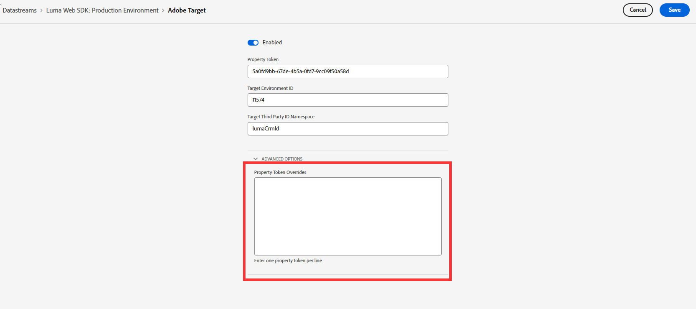
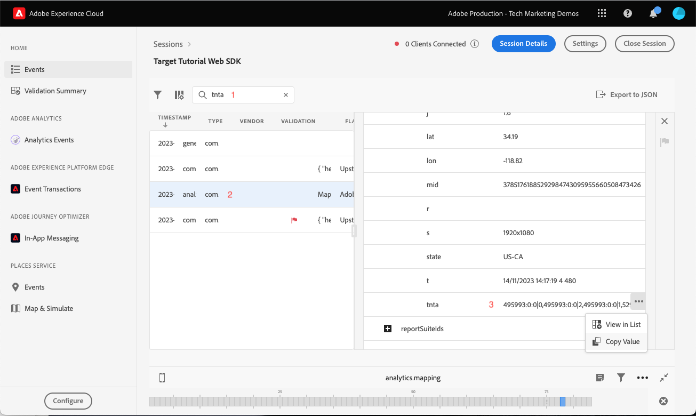

# Configurare Adobe Target con Platform Web SDK

Scopri come implementare Adobe Target utilizzando Platform Web SDK. Scopri come distribuire esperienze e come trasmettere parametri aggiuntivi a Target.

[Adobe Target](https://docs.adobe.com/content/help/it-IT/experience-cloud/user-guides/home.translate.html) è l’applicazione Adobe Experience Cloud che offre tutto il necessario per adattare e personalizzare l’esperienza dei clienti in modo da massimizzare i ricavi sui siti web e mobili, applicazioni e altri canali digitali.


## Obiettivi di apprendimento

Alla fine di questa lezione, sarai in grado di fare quanto segue con un’implementazione Web SDK di Target:

* Aggiungi il frammento pre-hiding per evitare sfarfallii
* Configurare uno stream di dati per abilitare la funzionalità di Target
* Attività del compositore esperienza visivo rendering
* Attività del compositore moduli rendering
* Trasmettere i dati XDM a Target e comprendere la mappatura dei parametri di Target
* Trasmettere dati personalizzati a Target, ad esempio parametri di profilo ed entità
* Convalidare un’implementazione di Target
* Separare le richieste di personalizzazione dalle richieste di Analytics

>[!TIP]
>
>Visualizza la [Migrare Target da at.js 2.x a Platform Web SDK](/help/tutorial-migrate-target-websdk/introduction.md) tutorial per una guida dettagliata alla migrazione dell’implementazione at.js esistente.


## Prerequisiti

Per completare le lezioni in questa sezione, devi prima:

* Completa tutte le lezioni per la configurazione iniziale di Platform Web SDK, inclusa la configurazione di elementi dati e regole.
* Assicurati di avere [Ruolo editor o approvatore](https://experienceleague.adobe.com/docs/target/using/administer/manage-users/enterprise/properties-overview.html#section_8C425E43E5DD4111BBFC734A2B7ABC80) in Adobe Target.
* Installare [Estensione Helper per Compositore esperienza visivo](https://experienceleague.adobe.com/docs/target/using/experiences/vec/troubleshoot-composer/vec-helper-browser-extension.html) se utilizzi il browser Google Chrome.
* Scopri come impostare le attività in Target. Se hai bisogno di un aggiornamento, i seguenti tutorial e guide sono utili per questa lezione:
   * [Utilizzare l’estensione VEC Helper](https://experienceleague.adobe.com/docs/target/using/experiences/vec/troubleshoot-composer/vec-helper-browser-extension.html)
   * [Utilizzare il Compositore esperienza visivo](https://experienceleague.adobe.com/docs/target-learn/tutorials/experiences/use-the-visual-experience-composer.html)
   * [Utilizzare il Compositore esperienza basato su moduli](https://experienceleague.adobe.com/docs/target-learn/tutorials/experiences/use-the-form-based-experience-composer.html)
   * [Creare attività Targeting esperienza](https://experienceleague.adobe.com/docs/target-learn/tutorials/activities/create-experience-targeting-activities.html)

## Aggiungi gestione sfarfallio

Prima di iniziare, determina se è necessaria un’ulteriore soluzione di gestione della visualizzazione momentanea di altri contenuti a seconda di come viene caricata la libreria di tag.

>[!NOTE]
>
>Questa esercitazione utilizza [Sito Luma](https://luma.enablementadobe.com/content/luma/us/en.html) con un’implementazione asincrona dei tag e una mitigazione della visualizzazione momentanea di altri contenuti. Questa sezione serve come riferimento per comprendere come funziona la mitigazione della visualizzazione momentanea di altri contenuti con Platform Web SDK.


### Implementazione asincrona

Quando una libreria di tag viene caricata in modo asincrono, la pagina potrebbe terminare il rendering prima che Target abbia sostituito il contenuto predefinito con il contenuto personalizzato. Questo comportamento può causare il cosiddetto &quot;sfarfallio&quot;, in cui il contenuto predefinito viene visualizzato brevemente prima di essere sostituito dal contenuto personalizzato specificato da Target. Per evitare questo sfarfallio, l’Adobe consiglia di aggiungere uno speciale frammento pre-hiding immediatamente prima del codice di incorporamento di tag asincrono.

Questo frammento è già presente nel sito Luma, ma diamo uno sguardo più da vicino per capire il funzionamento del codice:

```html
<script>
  !function(e,a,n,t){var i=e.head;if(i){
  if (a) return;
  var o=e.createElement("style");
  o.id="alloy-prehiding",o.innerText=n,i.appendChild(o),setTimeout(function(){o.parentNode&&o.parentNode.removeChild(o)},t)}}
  (document, document.location.href.indexOf("adobe_authoring_enabled") !== -1, ".personalization-container { opacity: 0 !important }", 3000);
</script>
```

Il frammento pre-hiding crea un tag di stile nella parte superiore della pagina con la definizione CSS desiderata. Questo tag di stile viene rimosso quando viene ricevuta una risposta da Target o quando viene raggiunto il timeout.

Il comportamento di pre-hiding è controllato da due configurazioni alla fine del frammento.

* `body { opacity: 0 !important }` specifica la definizione CSS da utilizzare per il pre-hiding fino al caricamento di Target. Per impostazione predefinita, l’intera pagina è nascosta. Puoi aggiornare questa definizione ai selettori che desideri nascondere anticipatamente insieme alla modalità con cui vuoi nasconderli. Puoi includere più definizioni, poiché questo valore è semplicemente ciò che viene inserito nel tag di stile per nascondere contenuti anticipatamente. Se il contenuto all’interno della navigazione è racchiuso in un elemento contenitore facilmente identificabile, puoi utilizzare questa impostazione per limitare il pre-hiding per quell’elemento contenitore.
* `3000` specifica il timeout in millisecondi per il pre-hiding. Se una risposta da Target non viene ricevuta prima del timeout, il tag di stile per nascondere contenuti anticipatamente viene rimosso. Il raggiungimento di questo timeout dovrebbe essere raro.

>[!NOTE]
>
>Il frammento pre-hiding per Platform Web SDK è leggermente diverso da quello utilizzato con la libreria at.js di Target. Assicurati di utilizzare lo snippet corretto per Platform Web SDK poiché utilizza un ID di stile diverso da `alloy-prehiding`. Se si utilizza il frammento pre-hiding per at.js, potrebbe non funzionare correttamente.

Il frammento pre-hiding è disponibile anche all’interno dei tag:

1. Vai a **[!UICONTROL Estensioni]** sezione dei tag
1. Seleziona **[!UICONTROL Configura]** per l’estensione Adobe Experience Platform Web SDK
1. Seleziona la **[!UICONTROL Copia frammento pre-hiding negli Appunti]** pulsante

   

   >[!NOTE]
   >
   >Il frammento predefinito per nascondere contenuti copiato dall’estensione Platform Web SDK può includere una definizione CSS che non esiste nel sito, ad esempio `.personalization-container { opacity: 0 !important }`. Verifica e modifica il frammento pre-hiding in modo appropriato per il sito.

### Implementazione sincrona

L’Adobe consiglia di implementare i tag in modo asincrono, come dimostrato sul sito Luma. Tuttavia, se la libreria di tag viene caricata in modo sincrono, il frammento pre-hiding non è necessario. Lo stile per nascondere anticipatamente è invece specificato nelle impostazioni dell’estensione Platform Web SDK.

Lo stile di pre-hiding per le implementazioni sincrone può essere configurato come segue:

1. Vai a **[!UICONTROL Estensioni]** sezione dei tag
1. Seleziona la **[!UICONTROL Configura]** pulsante per l’estensione Platform Web SDK
1. Seleziona la **[!UICONTROL Modifica stile pre-hiding]** pulsante

   

1. Modifica il CSS in modo da includere i selettori e i metodi di nasconderlo che desideri utilizzare, ad esempio: `body { opacity: 0 !important }` se desideri nascondere anticipatamente l’intero corpo della pagina.
1. Salvare le modifiche e generare in una libreria

>[!NOTE]
>
>L’impostazione di stile per nascondere anticipatamente deve essere utilizzata solo per le implementazioni sincrone. Se utilizzi un’implementazione asincrona dei tag, questo stile deve essere vuoto o deve essere commentato.

Per ulteriori informazioni su come Platform Web SDK può gestire la visualizzazione momentanea di altri contenuti, consulta la sezione guida: [gestione della visualizzazione momentanea di altri contenuti per esperienze personalizzate](https://experienceleague.adobe.com/docs/experience-platform/edge/personalization/manage-flicker.html).


## Configurare lo stream di dati

Target deve essere abilitato nella configurazione dello stream di dati prima che Platform Web SDK possa distribuire qualsiasi attività di Target.

Per configurare Target nello stream di dati:

1. Vai a [Raccolta dati](https://experience.adobe.com/#/data-collection){target="blank"} Interfaccia
1. Nel menu di navigazione a sinistra, seleziona **[!UICONTROL Flussi di dati]**
1. Seleziona il creato in precedenza `Luma Web SDK: Development Environment` flusso di dati

   

1. Seleziona **[!UICONTROL Aggiungi servizio]**
   
1. Seleziona **[!UICONTROL Adobe Target]** come **[!UICONTROL Servizio]**
1. Se necessario, immetti i dettagli facoltativi sull’implementazione di Target seguendo le indicazioni riportate di seguito.
1. Seleziona **[!UICONTROL Salva]**

   

### Token di proprietà

I clienti Target Premium possono gestire le autorizzazioni utente con proprietà. Le proprietà di Target ti consentono di definire i limiti intorno ai quali gli utenti possono eseguire le attività di Target. Consulta la sezione [Autorizzazioni Enterprise](https://experienceleague.adobe.com/docs/target/using/administer/manage-users/enterprise/properties-overview.html?lang=it) nella documentazione di Target.

Per impostare o trovare i token di proprietà, passa a **Adobe Target** > **[!UICONTROL Amministrazione]** > **[!UICONTROL Proprietà]**. Il `</>` visualizza il codice di implementazione. Il `at_property` value è il token di proprietà che utilizzeresti nel flusso di dati.


<a id="advanced-pto"></a>

È possibile specificare un solo token di proprietà per ogni stream di dati, ma gli override del token di proprietà consentono di specificare token di proprietà alternativi per sostituire il token di proprietà primario definito nello stream di dati. Un aggiornamento della sezione `sendEvent` è inoltre necessaria un’azione per ignorare lo stream di dati.



### ID ambiente di destinazione

[Ambienti](https://experienceleague.adobe.com/docs/target/using/administer/environments.html) in Target aiuta a gestire la tua implementazione attraverso tutte le fasi di sviluppo. Questa impostazione opzionale specifica l’ambiente Target da utilizzare con ogni flusso di dati.

L’Adobe consiglia di impostare l’ID dell’ambiente di Target in modo diverso per ciascuno dei flussi di dati di sviluppo, staging e produzione per semplificare le operazioni. In alternativa, puoi organizzare gli ambienti nell’interfaccia di Target utilizzando [host](https://experienceleague.adobe.com/docs/target/using/administer/hosts.html?lang=it) funzionalità.

Per impostare o trovare gli ID ambiente, passa a **Adobe Target** > **[!UICONTROL Amministrazione]** > **[!UICONTROL Ambienti]**.


>[!NOTE]
>
>Se non viene specificato alcun ID ambiente Target, viene utilizzato l’ambiente Target di produzione.

### Spazio dei nomi ID di terze parti di Target

Questa impostazione opzionale consente di specificare il simbolo di identità da utilizzare per l’ID di terze parti di Target. Target supporta solo la sincronizzazione dei profili su un singolo simbolo di identità o spazio dei nomi. Per ulteriori informazioni, consulta [Sincronizzazione dei profili in tempo reale per mbox3rdPartyId](https://experienceleague.adobe.com/docs/target/using/audiences/visitor-profiles/3rd-party-id.html) sezione della guida di Target.

I Simboli di identità si trovano nell’elenco delle identità in **Raccolta dati** > **[!UICONTROL Cliente]** > **[!UICONTROL Identità]**.


Ai fini di questa esercitazione utilizzando il sito Luma, utilizza il simbolo di identità `lumaCrmId` configurato durante la lezione su [Identità](configure-identities.md).


## Eseguire il rendering delle decisioni di personalizzazione visiva

Per decisioni sulla personalizzazione visiva si intendono le esperienze create nel Compositore esperienza visivo di Adobe Target. Innanzitutto, devi comprendere la terminologia utilizzata nelle interfacce Target e tag:

* **Attività**: un set di esperienze indirizzato a uno o più tipi di pubblico. Ad esempio, un semplice test A/B potrebbe essere un’attività con due esperienze.
* **Esperienza**: un set di azioni indirizzate a una o più posizioni o ambiti decisionali.
* **Ambito della decisione**: posizione in cui viene distribuita un’esperienza Target. Gli ambiti decisionali sono equivalenti a &quot;mbox&quot; se hai familiarità con l’utilizzo di versioni precedenti di Target.
* **Decisione di personalizzazione**: azione che il server determina da applicare. Queste decisioni possono essere basate sui criteri di pubblico e sulla definizione delle priorità delle attività di Target.
* **Proposta**: risultato delle decisioni prese dal server e consegnate nella risposta di Platform Web SDK. Ad esempio, la sostituzione di un&#39;immagine del banner rappresenta una proposta.

### Aggiornare il [!UICONTROL Invia evento] azione

Le decisioni di personalizzazione visiva da Target vengono consegnate da Platform Web SDK, se Target è abilitato nello stream di dati. Tuttavia, _non vengono renderizzati automaticamente_. È necessario aggiornare [!UICONTROL Invia evento] per abilitare il rendering automatico.

1. In [Raccolta dati](https://experience.adobe.com/#/data-collection){target="blank"} , apri la proprietà tag utilizzata per questa esercitazione
1. Apri `all pages - library loaded - send event - 50` regola
1. Seleziona la `Adobe Experience Platform Web SDK - Send event` azione
1. Abilita **[!UICONTROL Eseguire il rendering delle decisioni di personalizzazione visiva]** con la casella di controllo

   

<!--
1. In the **[!UICONTROL Datastream configuration overrides**] the **[!UICONTROL Target Property Token]** can be overridden either as a static value or with a data element. Only property tokens defined in the [**Advanced Property Token Overrides**](#advanced-pto) section in **Datastream Configuration** will return results.
   
   
   -->

1. Salva le modifiche e quindi genera la libreria

L’impostazione relativa alle decisioni sulla personalizzazione visiva del rendering fa in modo che Platform Web SDK applichi automaticamente tutte le modifiche specificate utilizzando il Compositore esperienza visivo di Target o &quot;mbox globale&quot;.

>[!NOTE]
>
>In genere, il [!UICONTROL Eseguire il rendering delle decisioni di personalizzazione visiva] L’impostazione deve essere abilitata solo per una singola azione Invia evento per caricamento di pagina completo. Se questa impostazione è abilitata per più azioni Invia evento, le richieste di rendering successive vengono ignorate.

Se preferisci eseguire il rendering o intervenire direttamente su queste decisioni utilizzando un codice personalizzato, puoi lasciare [!UICONTROL Eseguire il rendering delle decisioni di personalizzazione visiva] impostazione disabilitata. Platform Web SDK è flessibile e offre questa funzionalità per un controllo completo. Per ulteriori informazioni su, consulta la guida [rendering manuale di contenuti personalizzati](https://experienceleague.adobe.com/docs/experience-platform/edge/personalization/rendering-personalization-content.html).


### Configurare un’attività Target con il Compositore esperienza visivo

Ora che la sezione sull’implementazione di base è stata completata, crea un’attività Targeting esperienza in Target per verificare che tutto funzioni correttamente. Consulta l’esercitazione di Target per [creazione di attività Targeting esperienza](https://experienceleague.adobe.com/docs/target-learn/tutorials/activities/create-experience-targeting-activities.html) se ha bisogno di assistenza.

>[!NOTE]
>
>Se utilizzi Google Chrome come browser, il [Estensione VEC Helper](https://experienceleague.adobe.com/docs/target/using/experiences/vec/troubleshoot-composer/vec-helper-browser-extension.html?lang=en) è necessario per caricare il sito correttamente per la modifica nel Compositore esperienza visivo.

1. Passa all’interfaccia di Adobe Target
1. Creare un’attività Targeting esperienza (XT) utilizzando la pagina home di Luma per l’URL dell’attività

   

1. Modifica la pagina, ad esempio modifica il testo sul banner principale della pagina home.  Al termine, seleziona **[!UICONTROL Salva]** allora **[!UICONTROL Successivo]**.

   

1. Aggiorna il nome dell’evento, quindi seleziona **[!UICONTROL Successivo]**.

   

1. Scegli Adobe Analytics come origine per la generazione di rapporti con la suite di rapporti appropriata e la metrica Ordini come obiettivo

   

   >[!NOTE]
   >
   >Se non utilizzi Adobe Analytics, seleziona Target come origine per la generazione di rapporti e scegli una metrica diversa, ad esempio **Coinvolgimento > Visualizzazioni pagina** invece. Per salvare e visualizzare in anteprima l’attività è necessaria una metrica di obiettivo.

1. Salvare l’attività
1. Se hai familiarità con le modifiche, puoi attivare l’attività. In caso contrario, se desideri visualizzare l&#39;anteprima dell&#39;esperienza senza attivarla, puoi copiare [URL anteprima controllo di qualità](https://experienceleague.adobe.com/docs/target/using/activities/activity-qa/activity-qa.html).
1. Carica la home page di Luma e dovresti vedere le modifiche applicate
1. Dopo alcune ore, dovresti essere in grado di visualizzare i dati di attività e le conversioni di Target in Adobe Analytics. Fai riferimento alla Guida di Target per informazioni dettagliate su [Generazione di rapporti di Analytics for Target (A4T)](https://experienceleague.adobe.com/docs/target/using/integrate/a4t/reporting.html?lang=en).


### Convalida con Debugger

Se imposti un’attività, il contenuto dovrebbe essere visualizzato nella pagina di rendering. Tuttavia, anche se non ci sono attività live, puoi anche guardare la chiamata di rete Send Event per verificare che Target sia configurato correttamente.

>[!CAUTION]
>
>Se utilizzi Google Chrome e disponi di [Estensione VEC Helper](https://experienceleague.adobe.com/docs/target/using/experiences/vec/troubleshoot-composer/vec-helper-browser-extension.html?lang=en) installate, assicuratevi che **Inserisci librerie di Target** è disabilitata. Se abiliti questa impostazione, si otterranno richieste Target aggiuntive.

1. Apri l’estensione del browser Adobi Experience Platform Debugger
1. Vai a [Sito di dimostrazione Luma](https://luma.enablementadobe.com/content/luma/us/en.html) e utilizza il debugger per [modifica la proprietà tag sul sito con la tua proprietà di sviluppo](validate-with-debugger.md#use-the-experience-platform-debugger-to-map-to-your-tags-property)
1. Ricarica la pagina
1. Seleziona la **[!UICONTROL Rete]** strumento nel debugger
1. Filtra per **[!UICONTROL Adobe Experience Platform Web SDK]**
1. Seleziona il valore nella riga degli eventi per la prima chiamata

   

1. Tieni presente che ci sono chiavi in `query` > `personalization` e  `decisionScopes` ha un valore di `__view__`. Questo ambito equivale al `target-global-mbox`. Questa chiamata di Platform Web SDK ha richiesto decisioni a Target.

   

1. Chiudi la sovrapposizione e seleziona i dettagli dell’evento per la seconda chiamata di rete. Questa chiamata è presente solo se Target ha restituito un’attività.
1. Tieni presente che ci sono dettagli sull’attività e sull’esperienza restituite da Target. Questa chiamata di Platform Web SDK invia una notifica indicante che è stato eseguito il rendering di un’attività Target all’utente e incrementa un’impression.

   

## Impostare ed eseguire il rendering di un ambito decisionale personalizzato

Gli ambiti decisionali personalizzati (precedentemente noti come &quot;mbox&quot;) possono essere utilizzati per fornire contenuto HTML o JSON in modo strutturato utilizzando il Compositore esperienza basato su moduli di Target. Il contenuto distribuito a uno di questi ambiti personalizzati non viene renderizzato automaticamente da Platform Web SDK. Può essere riprodotto utilizzando un’azione in Tag.

### Aggiungere un ambito al [!UICONTROL Invia azione evento]

Modifica la regola di caricamento pagina per aggiungere un ambito di decisione personalizzato:

1. Apri `all pages - library loaded - send event - 50` regola
1. Seleziona la `Adobe Experience Platform Web SDK - Send Event` azione
1. Aggiungi uno o più ambiti da utilizzare. Per questo esempio, utilizza `homepage-hero`.

   

1. Salvare le modifiche e generare nella libreria

>[!TIP]
>
>Per questa esercitazione verrà utilizzato un singolo ambito definito manualmente a scopo dimostrativo. Se decidi di utilizzare diversi ambiti decisionali destinati a pagine specifiche, è consigliabile utilizzare un elemento dati che restituisca una matrice di ambiti in modo condizionale a seconda del percorso della pagina. Questo approccio consente di mantenere l’implementazione semplice e scalabile.

### Elabora la risposta da Target

Ora che hai configurato Platform Web SDK per richiedere contenuti per `homepage-hero` ambito, devi intervenire sulla risposta. L’estensione tag Platform Web SDK fornisce una [!UICONTROL Invia evento completato] che può essere utilizzato per attivare immediatamente una nuova regola quando una risposta da un [!UICONTROL Invia evento] azione ricevuta.

1. Creare una regola denominata `homepage - send event complete - render homepage-hero`.
1. Aggiungi un evento alla regola. Utilizza il **Adobe Experience Platform Web SDK** e **[!UICONTROL Invio evento completato]** tipo di evento.
1. Aggiungi una condizione per limitare la regola alla home page Luma (il percorso senza stringa di query è uguale a `/content/luma/us/en.html`).
1. Aggiungi un&#39;azione alla regola. Utilizza il **Adobe Experience Platform Web SDK** estensione e **Applicare le proposte** tipo di azione.

   

   >[!TIP]
   >
   >Assegna nomi descrittivi a eventi, condizioni e azioni della regola invece di utilizzare i nomi predefiniti. I nomi affidabili dei componenti regola rendono i risultati della ricerca molto più utili.

1. Invio `%event.propositions%` nel campo Proposte quando utilizziamo l’evento &quot;Invia evento completato&quot; come attivatore per questa regola.
1. Nella sezione &quot;metadati della proposta&quot;, seleziona la **[!UICONTROL Utilizzare un modulo]**
1. Per **[!UICONTROL Ambito]** input campo `homepage-hero`
1. Per **[!UICONTROL Selettore]** input campo `div.heroimage`
1. Per **[!UICONTROL Tipo di azione]** seleziona **[!UICONTROL Imposta HTML]**

   

1. Salvare le modifiche e generare nella libreria
1. Carica la home page di Luma alcune volte, il che dovrebbe essere sufficiente per creare la nuova `homepage-hero` registro dell’ambito decisionale nell’interfaccia di Target.

### Configurare un’attività Target con il Compositore esperienza basato su moduli

Ora che disponi di una regola per eseguire manualmente il rendering di un ambito di decisione personalizzato, puoi creare un’altra attività Targeting esperienza in Target. Questa volta utilizza il Compositore esperienza basato su moduli.

1. Apri [Adobe Target](https://experience.adobe.com/target)
1. Disattiva l&#39;attività utilizzata per la lezione precedente
1. Creare un’attività Targeting esperienza (XT) utilizzando l’opzione Compositore esperienza basato su moduli

   

1. Seleziona la **`homepage-hero`** posizione dal menu a discesa posizione e **[!UICONTROL Crea offerta HTML]** dal menu a discesa dei contenuti. Se la posizione non è disponibile, è possibile digitarla in. Target compila periodicamente i nuovi nomi di posizione dopo aver ricevuto le richieste per tale posizione o ambito.

   

1. Incolla il codice seguente nella casella del contenuto. Questo codice è un banner hero di base con un’immagine di sfondo diversa:

   ```html
   <div class="we-HeroImage jumbotron" style="background-image: url('/content/luma/us/en/women/_jcr_content/root/hero_image.coreimg.jpeg');">
      <div class="container cq-dd-image">
         <div class="we-HeroImage-wrapper">
            <p class="h3">New Luma Yoga Collection</p>
            <strong class="we-HeroImage-title h1">Be active with style&nbsp;</strong>
            <p>
               <a class="btn btn-primary btn-action" href="/content/luma/us/en/products.html" role="button">Shop Now</a>
            </p>
         </div>
      </div>
   </div>
   ```

1. Il giorno [!UICONTROL Obiettivi e impostazioni] , scegli Adobe Target come origine per la generazione di rapporti e [!UICONTROL Coinvolgimento] > [!UICONTROL Visualizzazioni pagina] come obiettivo
1. Salvare l’attività
1. Se hai familiarità con le modifiche, puoi attivare l’attività. In caso contrario, se desideri visualizzare l&#39;anteprima dell&#39;esperienza senza attivarla, puoi copiare [URL anteprima controllo di qualità](https://experienceleague.adobe.com/docs/target/using/activities/activity-qa/activity-qa.html).
1. Carica la home page di Luma e dovresti vedere le modifiche applicate

>[!NOTE]
>
>L’obiettivo di conversione &quot;Clic su una mbox&quot; non funziona automaticamente. Poiché Platform Web SDK non esegue automaticamente il rendering degli ambiti personalizzati, non tiene traccia dei clic nelle posizioni scelte per applicare il contenuto. Puoi creare un tracciamento dei clic personalizzato per ogni ambito utilizzando il &quot;clic&quot; `eventType` con le disposizioni applicabili `_experience` dettagli utilizzando `sendEvent` azione.

### Convalida con Debugger

Se hai attivato l’attività, sulla pagina dovrebbe essere visualizzato il rendering del contenuto. Tuttavia, anche se non ci sono attività live, puoi anche vedere [!UICONTROL Invia evento] chiamata di rete per confermare che Target richiede contenuto per gli ambiti personalizzati.

1. Apri l’estensione del browser Adobe Experience Platform Debugger
1. Vai a [Sito di dimostrazione Luma](https://luma.enablementadobe.com/content/luma/us/en.html) e utilizza il debugger per [modifica la proprietà tag sul sito con la tua proprietà di sviluppo](validate-with-debugger.md#use-the-experience-platform-debugger-to-map-to-your-tags-property)
1. Ricarica la pagina
1. Seleziona la **[!UICONTROL Rete]** strumento nel debugger
1. Filtra per **[!UICONTROL Adobe Experience Platform Web SDK]**
1. Seleziona il valore nella riga degli eventi per la prima chiamata

   

1. Tieni presente che ci sono chiavi in `query` > `personalization` e  `decisionScopes` ha un valore di `__view__` come prima, ma ora c&#39;è anche un `homepage-hero` ambito incluso. Questa chiamata di Platform Web SDK ha richiesto a Target decisioni per le modifiche effettuate utilizzando il Compositore esperienza visivo e gli `homepage-hero` posizione.

   

1. Chiudi la sovrapposizione e seleziona i dettagli dell’evento per la seconda chiamata di rete. Questa chiamata è presente solo se Target ha restituito un’attività.
1. Tieni presente che ci sono dettagli sull’attività e sull’esperienza restituite da Target. Questa chiamata di Platform Web SDK invia una notifica indicante che è stato eseguito il rendering di un’attività Target all’utente e incrementa un’impression.

   

## Inviare parametri a Target

In questa sezione, trasmetterai dati specifici di Target e vedrai più da vicino come i dati XDM vengono mappati sui parametri di Target.

### Parametri di pagina (mbox) e XDM

Tutti i campi XDM vengono passati automaticamente a Target come [parametri di pagina](https://experienceleague.adobe.com/en/docs/target-dev/developer/implementation/methods/page) o parametri mbox.

Alcuni di questi campi XDM verranno mappati su oggetti speciali nel backend di Target. Ad esempio: `web.webPageDetails.URL` sarà automaticamente disponibile per creare condizioni di targeting basate su URL o come `page.url` durante la creazione di script di profilo.

### Parametri speciali e oggetto dati

Alcuni punti dati possono essere utili per Target e non sono mappati dall’oggetto XDM. Questi parametri speciali di Target includono:

* [Attributi del profilo](https://experienceleague.adobe.com/docs/target/using/implement-target/before-implement/methods/in-page-profile-attributes.html?lang=en)
* [Attributi di entità Recommendations](https://experienceleague.adobe.com/docs/target/using/recommendations/entities/entity-attributes.html?lang=en)
* [Parametri riservati di Recommendations](https://experienceleague.adobe.com/docs/target/using/recommendations/plan-implement.html?lang=en#pass-behavioral)
* Valori categoria per [affinità tra categorie](https://experienceleague.adobe.com/docs/target/using/audiences/visitor-profiles/category-affinity.html?lang=en)

Questi parametri devono essere inviati nel `data` oggetto invece di nel `xdm` oggetto. Inoltre, i parametri di pagina (o mbox) possono essere inclusi anche nel `data` oggetto.

Per popolare l’oggetto dati, crea il seguente elemento dati, riutilizzando gli elementi dati creati in [Creare elementi dati](create-data-elements.md) lezione:

* **`data.content`** utilizzando il seguente codice personalizzato:

  ```javascript
  var data = {
     __adobe: {
        target: {
           "entity.id": _satellite.getVar("product.productInfo.sku"),
           "entity.name": _satellite.getVar("product.productInfo.title"),
           "profile.loggedIn": _satellite.getVar("user.profile.attributes.loggedIn"),
           "user.categoryId": _satellite.getVar("product.category")
        }
     }
  }
  return data;
  ```


### Aggiornare la regola di caricamento della pagina

Il passaggio di dati aggiuntivi per Target all’esterno dell’oggetto XDM richiede l’aggiornamento di tutte le regole applicabili. In questo esempio, l’unica modifica da apportare è quella di includere il nuovo **data.content** alla regola di caricamento pagina generica e alla regola di visualizzazione della pagina di prodotto.

1. Apri `all pages - library loaded - send event - 50` regola
1. Seleziona la `Adobe Experience Platform Web SDK - Send event` azione
1. Aggiungi il `data.content` Elemento dati al campo Dati

   

1. Salvare le modifiche e generare nella libreria
1. Ripetere i passaggi da 1 a 4 per **e-commerce - libreria caricata - imposta variabili dettagli prodotto - 20** regola

>[!NOTE]
>
>L’esempio precedente utilizza un `data` oggetto che non è completamente popolato su tutti i tipi di pagina. I tag gestiscono questa situazione in modo appropriato e omettono le chiavi con un valore non definito. Ad esempio: `entity.id` e `entity.name` non verrebbe trasmesso ad alcuna pagina oltre ai dettagli del prodotto.


## Suddivisione delle richieste di personalizzazione e analisi

Il livello dati sul sito Luma è completamente definito prima che il codice di incorporamento dei tag. Questo ci consente di utilizzare una singola chiamata sia per recuperare contenuti personalizzati (ad esempio da Adobe Target) che per inviare dati analitici (ad esempio ad Adobe Analytics).

In molti siti web, tuttavia, il livello dati non può essere caricato abbastanza presto o abbastanza rapidamente da utilizzare una singola chiamata per entrambe le applicazioni. In queste situazioni, puoi utilizzare due [!UICONTROL Invia evento] azioni su una singola pagina carica e utilizza la prima per la personalizzazione e la seconda per analytics. Suddividere gli eventi in questo modo consente all’evento di personalizzazione di attivarsi il prima possibile, in attesa che il livello dati venga completamente caricato prima di inviare l’evento Analytics. È simile a molte implementazioni SDK pre-Web, in cui Adobe Target attiverebbe `target-global-mbox` nella parte superiore della pagina e Adobe Analytics attiverebbe il `s.t()` chiama in fondo alla pagina

Per creare la richiesta di personalizzazione on-top:

1. Apri `all pages - library loaded - send event - 50` regola
1. Apri **Invia evento** azione
1. Seleziona **[!UICONTROL Utilizzare gli eventi guidati]** e quindi seleziona **[!UICONTROL Richiedi personalizzazione]**
1. Questo blocca il **Tipo** as **[!UICONTROL Recupero della proposta di decisione]**

   

Per creare la richiesta Analytics-on-bottom:

1. Crea una nuova regola denominata `all pages - page bottom - send event - 50`
1. Aggiungi un evento alla regola. Utilizza il **Core** e **[!UICONTROL Page Bottom]** tipo di evento
1. Aggiungi un&#39;azione alla regola. Utilizza il **Adobe Experience Platform Web SDK** estensione e **Invia evento** tipo di azione
1. Seleziona **[!UICONTROL Utilizzare gli eventi guidati]** e quindi seleziona **[!UICONTROL Raccogli analisi]**
1. Questo blocca il **[!UICONTROL Includi notifiche di visualizzazione in sospeso]** è stata selezionata una casella di controllo che consente di inviare la notifica di visualizzazione in coda dalla richiesta di decisioning.


>[!TIP]
>
>Se l’evento per il quale stai recuperando una proposta di decisione non ha un evento Adobe Analytics successivo, utilizza **Stile evento guidato** **[!UICONTROL Non guidato: mostra tutti i campi]**. Dovrai selezionare tutte le opzioni manualmente, ma l’opzione si sblocca in **[!UICONTROL invia automaticamente una notifica di visualizzazione]** insieme alla richiesta di recupero.


### Convalida con Debugger

Ora che le regole sono aggiornate, puoi verificare se i dati vengono passati correttamente utilizzando l’Adobe Debugger.

1. Accedi a [Sito di dimostrazione Luma](https://luma.enablementadobe.com/content/luma/us/en.html) e accedi con l’e-mail `test@adobe.com` e password `test`
1. Passare a una pagina dei dettagli del prodotto
1. Apri l’estensione del browser Adobe Experience Platform Debugger e [passa la proprietà tag alla tua proprietà di sviluppo](validate-with-debugger.md#use-the-experience-platform-debugger-to-map-to-your-tags-property)
1. Ricarica la pagina
1. Seleziona la **Rete** nel debugger e filtra per **Adobe Experience Platform Web SDK**
1. Seleziona il valore nella riga degli eventi per la prima chiamata
1. Tieni presente che ci sono chiavi in `data` > `__adobe` > `target` e contengono informazioni sul prodotto, la categoria e lo stato di accesso.

   

### Convalida nell’interfaccia di Target

Quindi, cerca nell’interfaccia di Target per confermare che i dati sono stati ricevuti e sono disponibili per l’utilizzo in tipi di pubblico e attività. I dati XDM vengono mappati automaticamente sui parametri di Target personalizzati. Puoi verificare che i dati XDM siano stati ricevuti da Target e siano disponibili creando un pubblico.

1. Apri [Adobe Target](https://experience.adobe.com/target)
1. Accedi a **[!UICONTROL Tipi di pubblico]** sezione
1. Crea un pubblico e scegli il **[!UICONTROL Personalizzato]** tipo di attributo
1. Cerca in **[!UICONTROL Parametro]** campo per `web`. Il menu a discesa deve essere compilato con tutti i campi XDM relativi ai dettagli della pagina web.

   

Successivamente, verifica che l’attributo del profilo dello stato di accesso sia stato passato correttamente.

1. Scegli la **[!UICONTROL Profilo visitatore]** tipo di attributo
2. Cerca `loggedIn`. Se l&#39;attributo è disponibile nel menu a discesa, allora l&#39;attributo è stato passato correttamente a Target. I nuovi attributi potrebbero richiedere alcuni minuti per diventare disponibili nell’interfaccia utente di Target.

   

Se disponi di Target Premium, puoi anche verificare che i dati delle entità siano stati passati correttamente e che i dati dei prodotti siano stati scritti nel catalogo prodotti Recommendations.

1. Accedi a **[!UICONTROL Recommendations]** sezione
1. Seleziona **[!UICONTROL Ricerca nel catalogo]** nel menu di navigazione a sinistra
1. Cerca lo SKU del prodotto o il nome del prodotto visitato in precedenza sul sito Luma. Il prodotto deve essere visualizzato nel catalogo dei prodotti. La ricerca di nuovi prodotti nel catalogo dei prodotti Recommendations potrebbe richiedere alcuni minuti.

   

### Convalida con garanzia

Inoltre, puoi utilizzare la funzione Assurance quando appropriato per confermare che le richieste di decisioni di Target ricevono i dati corretti e che eventuali trasformazioni lato server si verificano correttamente. Puoi anche verificare che le informazioni sulla campagna e sull’esperienza siano contenute nelle chiamate di Adobe Analytics anche quando le chiamate a Target decisioning e Adobe Analytics vengono inviate separatamente.

1. Apri [Assurance](https://experience.adobe.com/it/assurance)
1. Avvia una nuova sessione di verifica, immetti **[!UICONTROL nome sessione]** e immettere **[!UICONTROL url di base]** per il tuo sito o qualsiasi altra pagina che stai testando
1. Clic **[!UICONTROL Successivo]**

   

1. Seleziona il metodo di connessione; in questo caso utilizzeremo **[!UICONTROL copia collegamento]**
1. Copia il collegamento e incollalo in una nuova scheda del browser
1. Clic **[!UICONTROL Fine]**

   

1. Una volta avviata la sessione Assurance, nella scheda degli eventi viene visualizzato il popolamento degli eventi
1. Filtra per &quot;tnta&quot;
1. Seleziona la chiamata più recente ed espandi i messaggi per assicurarti che venga compilata correttamente e annota i valori &quot;tnta&quot;

   

1. Quindi mantieni il filtro &quot;tnta&quot; e seleziona l’evento analytics.mapping che si verifica dopo l’evento di destinazione appena visualizzato.
1. Esamina &quot;context.mappedQueryParams&quot;.\&lt;yourschemaname>&quot; per confermare che contiene un attributo &quot;tnta&quot; con una stringa concatenata che corrisponde ai valori &quot;tnta&quot; trovati nell’evento di destinazione precedente.

   

Ciò conferma che le informazioni A4T che erano in coda per una trasmissione successiva quando abbiamo effettuato la chiamata di decisione di Target sono state inviate correttamente quando la chiamata di tracciamento di Analytics è stata attivata più avanti sulla pagina.

Dopo aver completato questa lezione, è necessario disporre di un’implementazione funzionante di Adobe Target utilizzando Platform Web SDK.

[Successivo: ](setup-web-channel.md)

>[!NOTE]
>
>Grazie per aver dedicato il tuo tempo all’apprendimento di Adobe Experience Platform Web SDK. Se hai domande, vuoi condividere commenti generali o suggerimenti su contenuti futuri, condividili su questo [Experience League post di discussione community](https://experienceleaguecommunities.adobe.com/t5/adobe-experience-platform-launch/tutorial-discussion-implement-adobe-experience-cloud-with-web/td-p/444996)
