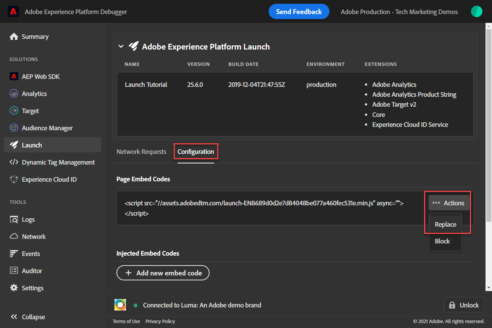

# Convalidare le implementazioni Web SDK con Experienci Platform Debugger

Scopri come convalidare l’implementazione di Platform Web SDK con l’Adobe Experience Platform Debugger.

Experienci Platform Debugger è un’estensione disponibile per i browser Chrome e Firefox che consente di visualizzare la tecnologia Adobe implementata nelle pagine web. Scarica la versione per il browser preferito:

* [Estensione Firefox](https://addons.mozilla.org/it/firefox/addon/adobe-experience-platform-dbg/)
* [Estensione Chrome](https://chrome.google.com/webstore/detail/adobe-experience-platform/bfnnokhpnncpkdmbokanobigaccjkpob)

Se non hai mai utilizzato il debugger prima, e questo è diverso dal precedente Adobe Experience Cloud Debugger, guarda questo video introduttivo di cinque minuti:

>[!VIDEO](https://video.tv.adobe.com/v/32156?learn=on)

In questa lezione, utilizzerai [Estensione Adobe Experience Cloud Debugger](https://chrome.google.com/webstore/detail/adobe-experience-cloud-de/ocdmogmohccmeicdhlhhgepeaijenapj) per sostituire la proprietà di tag in codifica fissa [Sito di dimostrazione Luma](https://luma.enablementadobe.com/content/luma/us/en.html) con la tua proprietà.

Questa tecnica è denominata cambio di ambiente e sarà utile in un secondo momento, quando lavorerai con i tag sul tuo sito web. Puoi caricare il tuo sito web di produzione nel browser, ma con *sviluppo* nell’ambiente dei tag. Questa funzionalità ti consente di creare e convalidare le modifiche ai tag in modo indipendente dalle regolari versioni del codice. Dopo tutto, questa separazione tra versioni di tag di marketing e versioni di codice è uno dei motivi principali per cui i clienti utilizzano i tag.

## Obiettivi di apprendimento

Alla fine di questa lezione, potrai utilizzare il debugger per:

* Caricare una libreria di tag alternativa
* Verificare che l’evento XDM lato client acquisisca e invii i dati come previsto a Platform Edge Network
* Abilita Edge Trace per visualizzare le richieste lato server inviate da Platform Edge Network
* Avvia una sessione di Adobe Experience Platform Assurance per visualizzare un ID Experience Cloud generato da Platform Edge Network

## Prerequisiti

Conosci i tag di raccolta dati e la [Sito di dimostrazione Luma](https://luma.enablementadobe.com/content/luma/us/en.html){target="_blank"} e hanno completato le seguenti lezioni precedenti nell’esercitazione:

* [Configurare uno schema XDM](configure-schemas.md)
* [Configurare uno spazio dei nomi delle identità](configure-identities.md)
* [Configurare uno stream di dati](configure-datastream.md)
* [Estensione Web SDK installata nella proprietà tag](install-web-sdk.md)
* [Creare elementi dati](create-data-elements.md)
* [Creare identità](create-identities.md)
* [Creare una regola di tag](create-tag-rule.md)

## Caricare librerie di tag alternative con Debugger

Questa esercitazione utilizza una versione in hosting pubblico del [Sito web di dimostrazione Luma](https://luma.enablementadobe.com/content/luma/us/en.html). Apri la home page e aggiungi un segnalibro.

Experienci Platform Debugger dispone di una funzione interessante che consente di sostituire una libreria di tag esistente con una diversa. Questa tecnica è utile per la convalida e ci consente di saltare molti passaggi di implementazione in questa esercitazione.

1. Assicurati di avere aperto il sito Luma e seleziona l’icona dell’estensione Experienci Platform Debugger
1. Debugger si aprirà e mostrerà alcuni dettagli dell’implementazione hardcoded, che non è correlata a questa esercitazione (potrebbe essere necessario ricaricare il sito Luma dopo aver aperto Debugger)
1. Conferma che il debugger è &quot;**[!UICONTROL Connesso a Luma]**&quot; come illustrato di seguito, quindi selezionare la&quot;**[!UICONTROL blocca]**&quot; per bloccare Debugger sul sito Luma.
1. Seleziona la **[!UICONTROL Accedi]** e accedi a Adobe Experience Cloud utilizzando il tuo ID Adobe.
1. Ora vai a **[!UICONTROL Tag Experience Platform]** nel menu di navigazione a sinistra

   

1. Seleziona la **[!UICONTROL Configurazione]** scheda
1. A destra della posizione in cui è visualizzato **[!UICONTROL Codici di incorporamento pagina]**, apri **[!UICONTROL Azioni]** e seleziona **[!UICONTROL Sostituisci]**

   

1. Poiché sei autenticato, il Debugger estrae le proprietà e gli ambienti dei tag disponibili. Seleziona la proprietà; in questo caso `Web SDK Course 3`
1. Seleziona il `Development` ambiente
1. Seleziona la **[!UICONTROL Applica]** pulsante

   

1. Il sito web Luma verrà ricaricato _con la tua proprietà tag_.

   

Continuando l’esercitazione, utilizzi questa tecnica per mappare il sito Luma sulla tua proprietà tag per convalidare l’implementazione dell’SDK web per Platform. Quando inizi a utilizzare i tag sul sito web di produzione, puoi usare questa stessa tecnica per convalidare le modifiche.

## Convalidare richieste di rete lato client con Experienci Platform Debugger

Puoi utilizzare il debugger per convalidare i beacon lato client attivati dall’implementazione di Platform Web SDK per visualizzare i dati inviati a Platform Edge Network:

1. Vai a **[!UICONTROL Riepilogo]** nel menu di navigazione a sinistra, per visualizzare i dettagli della proprietà tag

   

1. Ora vai a **[!UICONTROL Experienci Platform Web SDK]** nel menu di navigazione a sinistra per visualizzare **[!UICONTROL Richieste di rete]**
1. Apri **[!UICONTROL Eventi]** riga

   

1. Nota come è possibile visualizzare `web.webpagedetails.pageView` tipo di evento specificato nel [!UICONTROL Aggiorna variabile] e altre variabili pronte all’uso conformi alla `AEP Web SDK ExperienceEvent` gruppo di campi

   

1. Scorri verso il basso fino a `web` dell&#39;oggetto, selezionare per aprirlo ed esaminare `webPageDetails.name`, `webPageDetails.server`, e `webPageDetails.siteSection`. Devono corrispondere al corrispondente `digitalData` variabili del livello dati nella home page

>[!TIP]
>
> Per visualizzare e confrontare `digitalData` livello dati nella home page:
>
> 1. Nella home page di Luma, apri gli strumenti di sviluppo del browser. Nel caso di Chrome, seleziona il pulsante `F12` sulla tastiera
> 1. Seleziona la **[!UICONTROL Console]** scheda
> 1. Invio `digitalData` e seleziona `Enter` sulla tastiera per visualizzare i valori del livello dati

Puoi anche convalidare i dettagli di Identity Map:

1. Accedi al sito Luma utilizzando le credenziali `test@adobe.com`/`test`

1. Torna alla [home page di Luma](https://luma.enablementadobe.com/content/luma/us/en.html)

1. Apri **[!UICONTROL Experienci Platform Web SDK]** sezione nel menu di navigazione a sinistra

   

1. Seleziona la **[!UICONTROL Eventi]** riga per aprire i dettagli in un pop-up

   

1. Cerca **identityMap** all&#39;interno del pop-up. Qui dovresti vedere `lumaCrmId` con tre chiavi di authenticatedState, id e primary:
   

### Convalidare le richieste lato client con gli strumenti di sviluppo del browser

Questi tipi di dettagli della richiesta sono visibili anche negli strumenti di sviluppo web del browser **Rete** (supponendo che il sito web stia caricando la libreria di tag).

1. Apri gli strumenti di sviluppo web del browser **Rete** e ricarica la pagina. Filtra per chiamate con `/ee` per individuare la chiamata, selezionarla e quindi cercare nella **Intestazioni** e **Payload** scheda

   

1. Vai a **Risposta** e osserva come il valore ECID viene incluso nella risposta. Copia questo valore così come lo utilizzerai per convalidare le informazioni sul profilo nel prossimo esercizio

   

## Convalidare le richieste di rete lato server con Experienci Platform Debugger

Come hai imparato nella [Configurare uno stream di dati](configure-datastream.md) lezione, Platform Web SDK invia prima i dati dalla proprietà digitale a Platform Edge Network. Quindi, Platform Edge Network effettua richieste aggiuntive lato server ai servizi corrispondenti abilitati nello stream di dati.

Puoi convalidare le richieste lato server abilitando Edge Trace nel Debugger. Inoltre, puoi anche convalidare il payload completamente elaborato dopo aver raggiunto un’applicazione di Adobe utilizzando [Adobe Experience Platform Assurance](https://experienceleague.adobe.com/docs/experience-platform/assurance/home.html?lang=en).

Nei due esercizi successivi, abiliti Edge Trace e visualizzi l’ID Experience Cloud generato da Platform Edge Network utilizzando Assurance.

### Abilita traccia perimetrale

Per abilitare la traccia Edge

1. Nella barra di navigazione a sinistra di **[!UICONTROL Debugger Experienci Platform]** seleziona **[!UICONTROL Registri]**
1. Seleziona la **[!UICONTROL Bordo]** e seleziona **[!UICONTROL Connetti]**

   

1. Per il momento è vuoto

   

1. Aggiorna il [Home page Luma](https://luma.enablementadobe.com/) e verifica **[!UICONTROL Debugger Experienci Platform]** di nuovo, per vedere i dati arrivare attraverso.

   

A questo punto, non è possibile visualizzare le richieste di Platform Edge Network indirizzate a un’applicazione di Adobe perché non ne hai abilitato alcuna nello stream di dati. Nelle lezioni future, utilizzi Edge Trace per visualizzare le richieste lato server in uscita alle applicazioni Adobe. Tuttavia, utilizzando Assurance è ancora possibile visualizzare l’ID Experience Cloud generato da Platform Edge Network.

### Avviare una sessione Assurance

Adobe Experience Platform Assurance è un prodotto di Adobe Experience Cloud che consente di verificare, verificare, simulare e convalidare le modalità di raccolta dei dati o di gestione delle esperienze.

Ulteriori informazioni su [Adobe Assurance](https://experienceleague.adobe.com/docs/experience-platform/assurance/home.html?lang=en).

Ogni volta che abiliti Edge Trace, viene avviata in background una sessione Assurance.

Per visualizzare la sessione Assurance:

1. Con Edge Trace abilitato, puoi visualizzare un’icona di collegamento in uscita in alto. Seleziona l’icona per aprire Assurance. Viene visualizzata una nuova scheda nel browser.

   

1. Seleziona la riga con l’evento denominato Adobe Response Handle.
1. A destra viene visualizzato un menu. Seleziona la `+` accedi a `[!UICONTROL ACPExtensionEvent]`
1. Espandere selezionando `[!UICONTROL payload > 0 > payload > 0 > namespace]`. L’ID mostrato sotto l’ultimo `0` corrisponde al `ECID`. Lo sai dal valore che viene visualizzato in `namespace` corrispondenza `ECID`

   

   >[!CAUTION]
   >
   >Il valore ECID potrebbe essere troncato a causa della larghezza della finestra. Seleziona la barra della maniglia nell’interfaccia e trascina a sinistra per visualizzare l’intero ECID.

Nelle lezioni future, utilizzi Assurance per convalidare i payload completamente elaborati raggiungendo un’applicazione di Adobe abilitata nel flusso di dati.

Ora che un oggetto XDM viene attivato su una pagina e sai come convalidare la raccolta dati, puoi configurare le singole applicazioni Adobe utilizzando Platform Web SDK.

[Successivo: ](setup-experience-platform.md)

>[!NOTE]
>
>Grazie per aver dedicato il tuo tempo all’apprendimento di Adobe Experience Platform Web SDK. Se hai domande, vuoi condividere commenti generali o suggerimenti su contenuti futuri, condividili su questo [Experience League post di discussione community](https://experienceleaguecommunities.adobe.com/t5/adobe-experience-platform-launch/tutorial-discussion-implement-adobe-experience-cloud-with-web/td-p/444996)