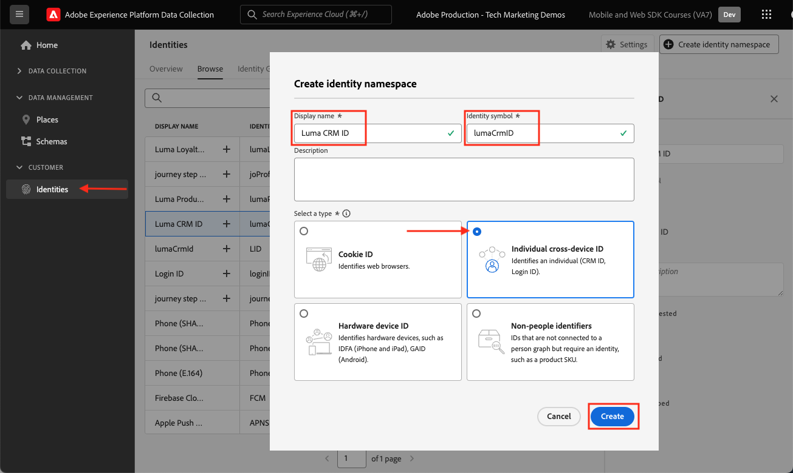

# Configurare uno spazio dei nomi di identità

Scopri come configurare i namespace di identità da utilizzare con Adobe Experience Platform Web SDK.

La [Servizio Adobe Experience Platform Identity](https://experienceleague.adobe.com/docs/id-service/using/home.html?lang=it) imposta un ID visitatore comune in tutte le soluzioni Adobe per abilitare funzionalità di Experience Cloud come la condivisione del pubblico tra le soluzioni. Puoi anche inviare i tuoi ID cliente personalizzati al Servizio per abilitare il targeting tra dispositivi e le integrazioni con altri sistemi, ad esempio il tuo sistema di gestione delle relazioni con i clienti (CRM, Customer Relationship Management).

Se il tuo sito web utilizza già il servizio Experience Cloud ID sul tuo sito web, tramite API visitatore o l’estensione tag del servizio Experience Cloud ID, e desideri continuare a usarlo durante la migrazione all’SDK per web di Adobe Experience Platform, devi utilizzare la versione più recente dell’API visitatore o l’estensione tag del servizio Experience Cloud ID. Vedi [Migrazione degli ID](https://experienceleague.adobe.com/docs/experience-platform/edge/identity/overview.html?lang=en) per ulteriori informazioni.

>[!NOTE]
>
> A scopo dimostrativo, gli esercizi di questa lezione ti consentono di acquisire i dettagli di identità di un cliente fittizio connesso al [Sito Demo Luma](https://luma.enablementadobe.com/content/luma/us/en.html) utilizzando le credenziali, **utente: test@adobe.com / password: test**. Anche se puoi utilizzare questi passaggi per creare un’identità diversa per i tuoi scopi, per scoprire le funzionalità di Identity Map nell’interfaccia di raccolta dati ti consigliamo di seguire prima di tutto per acquisire l’identità di esempio.

## Finalità di apprendimento

Alla fine di questa lezione, potrai:

* Comprendere gli spazi dei nomi delle identità
* Creare uno spazio dei nomi di identità personalizzato per acquisire un ID CRM interno

## Prerequisiti

Devi aver già completato le lezioni precedenti:

* [Configurare le autorizzazioni](configure-permissions.md)
* [Configurare gli schemi](configure-schemas.md)

>[!IMPORTANT]
>
>La [Estensione Experience Cloud ID](https://exchange.adobe.com/experiencecloud.details.100160.adobe-experience-cloud-id-launch-extension.html) non è necessario per l’implementazione di Adobe Experience Platform Web SDK, in quanto la libreria JavaScript SDK per web contiene la funzionalità del servizio ID visitatore.

## Creare uno spazio dei nomi di identità

In questo esercizio crei uno spazio dei nomi di identità per il campo di identità personalizzata di Luma, `lumaCrmId`. Gli spazi dei nomi di identità svolgono un ruolo fondamentale nella creazione di profili cliente in tempo reale, in quanto due valori corrispondenti nello stesso spazio dei nomi consentono a due origini dati di formare un grafico di identità.

Prima di iniziare gli esercizi, guarda questo breve video per saperne di più sull&#39;identità in Adobe Experience Platform:
>[!VIDEO](https://video.tv.adobe.com/v/27841?quality=12&learn=on)

Ora crea uno spazio dei nomi per l’ID CRM Luma:

1. Apri [Interfaccia di raccolta dati](https://launch.adobe.com/){target=&quot;_blank&quot;}
1. Seleziona la sandbox utilizzata per l’esercitazione

   >[!NOTE]
   >
   >Se sei cliente di un’applicazione basata su Platform come Real-Time CDP, ti consigliamo di utilizzare una sandbox di sviluppo per questa esercitazione. In caso contrario, utilizza il **[!UICONTROL Prod]** sandbox.

1. Seleziona **[!UICONTROL Identità]** nella navigazione a sinistra
1. Seleziona **[!UICONTROL Sfoglia]**

   Nell’interfaccia principale della pagina viene visualizzato un elenco di spazi dei nomi delle identità, in cui sono indicati i nomi, i simboli di identità, la data dell’ultimo aggiornamento e se si tratta di spazi dei nomi standard o personalizzati. La barra a destra contiene informazioni sulla forza del grafico di identità.

1. Seleziona **[!UICONTROL Creare uno spazio dei nomi di identità]**

   

1. Fornisci i seguenti dettagli e seleziona **[!UICONTROL Crea]**.

   | Campo | Valore |
   |---------------|-----------|
   | Nome visualizzato | ID CRM Luma |
   | Simbolo di identità | lumaCrmId |
   | Tipo | ID multi-dispositivo |

   

   Lo spazio dei nomi Identity viene compilato nel **[!UICONTROL Identità]** schermo.

   

>[!INFO]
>
> In [Creare elementi dati](create-data-elements.md) Viene illustrato come utilizzare questo namespace quando si inviano identità a Platform Edge Network.

## Creare lo spazio dei nomi delle identità nella sandbox di produzione

A causa di una limitazione corrente nell’estensione Web SDK, è necessario creare spazi dei nomi di identità anche nella sandbox di produzione per utilizzare lo spazio dei nomi per inviare dati a una sandbox di sviluppo. Quindi, se utilizzi una sandbox di sviluppo per questa esercitazione, crea anche la `Luma CRM ID` spazio dei nomi nella sandbox di produzione.

## Risorse aggiuntive

* [Documentazione del servizio Identity](https://experienceleague.adobe.com/docs/experience-platform/identity/home.html?lang=it)
* [API del servizio Identity](https://www.adobe.io/experience-platform-apis/references/identity-service/)

Ora che sono presenti le identità, il datastream può essere configurato.

[Avanti: ](configure-datastream.md)

>[!NOTE]
>
>Grazie per aver investito il tuo tempo nel conoscere Adobe Experience Platform Web SDK. In caso di domande, se desideri condividere feedback generali o se hai suggerimenti su contenuti futuri, condividi questi su questo [Experience League Articolo di discussione della Comunità](https://experienceleaguecommunities.adobe.com/t5/adobe-experience-platform-launch/tutorial-discussion-implement-adobe-experience-cloud-with-web/td-p/444996)
