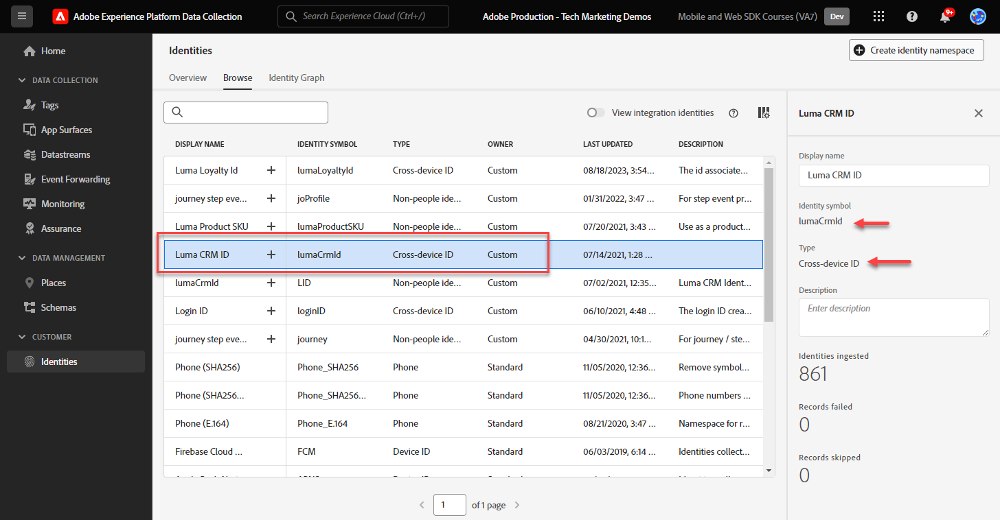

# Configurare uno spazio dei nomi delle identità

Scopri come configurare gli spazi dei nomi di identità da utilizzare con Adobe Experience Platform Web SDK.

Il servizio [Adobe Experience Cloud Identity](https://experienceleague.adobe.com/en/docs/id-service/using/home) imposta un ID visitatore comune (ECID) tra le applicazioni Adobe basate su SDK per abilitare le funzionalità di Experience Cloud, ad esempio la condivisione del pubblico tra le applicazioni. Puoi anche inviare i tuoi ID cliente personalizzati al Servizio per abilitare il targeting su più dispositivi e le integrazioni con altri sistemi, come il sistema di gestione delle relazioni con i clienti (CRM).

Il [servizio Adobe Experience Platform Identity](https://experienceleague.adobe.com/en/docs/experience-platform/identity/home) (sì, ce ne sono due!) utilizza gli ECID e gli ID cliente per generare grafici di identità, che consentono di unire attributi e comportamenti in profili cliente in tempo reale.

>[!NOTE]
>
>Per implementare Adobe Analytics, Adobe Target o Adobe Audience Manager con Web SDK è necessario uno spazio dei nomi di identità personalizzato _non richiesto_. Le identità autenticate possono essere passate nell&#39;oggetto `data` anziché nell&#39;oggetto `xdm`, come verrà visualizzato in seguito. Gli spazi dei nomi di identità sono necessari per le applicazioni native per la piattaforma come Journey Optimizer, Real-time Customer Data Platform, Customer Journey Analytics. Anche se puoi decidere di non utilizzare uno spazio dei nomi delle identità nella tua implementazione, è previsto che tu lo faccia come parte di questa esercitazione.

>[!NOTE]
>
> A scopo dimostrativo, gli esercizi di questa lezione ti consentono di acquisire i dettagli di identità di un cliente fittizio che ha effettuato l&#39;accesso al [sito dimostrativo Luma](https://luma.enablementadobe.com/content/luma/us/en.html) utilizzando le credenziali, **utente: `test@adobe.com` / password: test**.

## Obiettivi di apprendimento

Alla fine di questa lezione, potrai:

* Comprendere gli spazi dei nomi delle identità
* Creare uno spazio dei nomi di identità personalizzato per acquisire un ID CRM interno

## Prerequisiti

Devi avere già completato le lezioni precedenti:

* [Configurare gli schemi](configure-schemas.md)

>[!IMPORTANT]
>
>L&#39;estensione [ID Experience Cloud](https://exchange.adobe.com/apps/ec/100160/adobe-experience-cloud-id-launch-extension) non è necessaria quando si implementa Adobe Experience Platform Web SDK, in quanto la libreria JavaScript dell&#39;SDK Web contiene la funzionalità del servizio ID visitatore.
>
> Se il sito web utilizza già il servizio ID Experience Cloud sul sito web, tramite API Visitor o l’estensione tag del servizio ID Experience Cloud, e desideri continuare a utilizzarlo durante la migrazione a Adobe Experience Platform Web SDK, devi utilizzare la versione più recente dell’API Visitor o l’estensione tag del servizio ID Experience Cloud. Per ulteriori informazioni, consulta [Migrazione ID](https://experienceleague.adobe.com/en/docs/experience-platform/edge/identity/overview).

## Creare uno spazio dei nomi delle identità

In questo esercizio creerai uno spazio dei nomi delle identità per il campo di identità personalizzato di Luma, `lumaCrmId`. Gli spazi dei nomi delle identità svolgono un ruolo fondamentale nella creazione di profili cliente in tempo reale, in quanto due valori corrispondenti nello stesso spazio dei nomi consentono a due origini di dati di formare un grafo identità.

Prima di iniziare gli esercizi, guarda questo breve video per ulteriori informazioni sull’identità in Adobe Experience Platform:

>[!VIDEO](https://video.tv.adobe.com/v/27841?learn=on)

Ora crea uno spazio dei nomi per l’ID CRM Luma:

1. Apri l&#39;interfaccia [Data Collection](https://launch.adobe.com/){target="_blank"}
1. Seleziona la sandbox in uso per l’esercitazione

   >[!NOTE]
   >
   >Se sei il cliente di un’applicazione basata su Platform come Real-Time CDP o Journey Optimizer, per questa esercitazione ti consigliamo di utilizzare una sandbox di sviluppo. In caso contrario, utilizza la sandbox **[!UICONTROL Prod]**.

1. Seleziona **[!UICONTROL Identità]** nel menu di navigazione a sinistra
1. Seleziona **[!UICONTROL Sfoglia]**

   Nell’interfaccia principale della pagina viene visualizzato un elenco di spazi dei nomi di identità, con i nomi, i simboli di identità, la data dell’ultimo aggiornamento e se si tratta di spazi dei nomi standard o personalizzati. La barra a destra contiene informazioni sulla [!UICONTROL forza del grafico delle identità].

1. Seleziona **[!UICONTROL Crea spazio dei nomi identità]**

   

1. Fornisci i dettagli come segue e seleziona **[!UICONTROL Crea]**.

   | Campo | Valore |
   |---------------|-----------|
   | Nome visualizzato | ID CRM Luma |
   | Simbolo di identità | lumaCrmId |
   | Tipo | ID individuale per più dispositivi |

   

   Lo spazio dei nomi Identity viene popolato nella schermata **[!UICONTROL Identities]**.

   

>[!NOTE]
>
> Nella lezione [Creare identità](create-identities.md) scoprirai come utilizzare questo spazio dei nomi durante l&#39;invio di identità all&#39;Edge Network di Platform.

Ora che le identità sono presenti, è possibile configurare lo stream di dati.

[Successivo: ](configure-datastream.md)

>[!NOTE]
>
>Grazie per aver dedicato il tuo tempo all’apprendimento di Adobe Experience Platform Web SDK. Se hai domande, vuoi condividere commenti generali o suggerimenti su contenuti futuri, condividili in questo [Experience League post di discussione della community](https://experienceleaguecommunities.adobe.com/t5/adobe-experience-platform-data/tutorial-discussion-implement-adobe-experience-cloud-with-web/td-p/444996)
