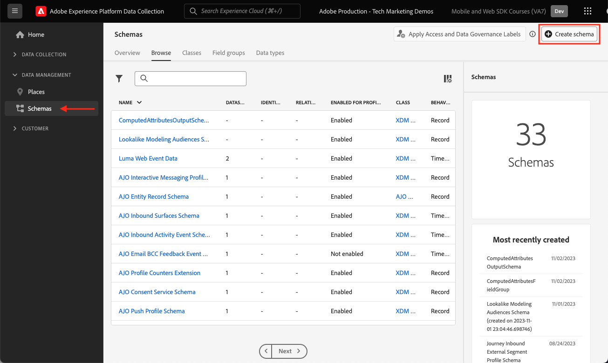

# Creare uno schema XDM per i dati web

Scopri come creare uno schema XDM per i dati web nell’interfaccia di raccolta dati di Adobe Experience Platform.

Gli schemi Experience Data Model (XDM) sono gli elementi costitutivi, i principi e le best practice per la raccolta di dati in Adobe Experience Platform.

Platform Web SDK utilizza lo schema per standardizzare i dati dell’evento web, inviarli a Platform Edge Network e infine inoltrarli a qualsiasi applicazione Experience Cloud configurata nello stream di dati. Questo passaggio è fondamentale in quanto definisce un modello dati standard necessario per acquisire i dati sulla customer experience in Experience Platform e abilita servizi e applicazioni a valle basati su questi standard.

>[!NOTE]
>
>Per implementare Adobe Analytics, Adobe Target o Adobe Audience Manager con Web SDK è necessario uno schema XDM _non_ (i dati possono essere passati nell&#39;oggetto `data` anziché nell&#39;oggetto `xdm` come verrà visualizzato in seguito). È necessario uno schema XDM per le implementazioni più performanti di applicazioni native per la piattaforma come Journey Optimizer, Real-Time Customer Data Platform, Customer Journey Analytics. Anche se puoi decidere di non utilizzare uno schema XDM nella tua implementazione, è previsto che tu lo faccia come parte di questa esercitazione.

## Perché modellare i dati?

Le aziende hanno un proprio linguaggio per comunicare sul proprio dominio. I concessionari di automobili si occupano di marche, modelli e cilindri. Le compagnie aeree si occupano di numeri di volo, classe di servizio e assegnazione di posti. Alcuni di questi termini sono specifici per un&#39;azienda specifica, altri sono condivisi tra un settore verticale e altri sono condivisi da quasi tutte le aziende. Per i termini condivisi in un settore verticale o anche più ampio, puoi iniziare a fare cose potenti con i tuoi dati quando denomini e strutturi questi termini in modo comune.

Ad esempio, molte aziende gestiscono gli ordini. E se, collettivamente, queste aziende decidessero di modellare un ordine in modo simile? Ad esempio, cosa succede se il modello dati è costituito da un oggetto con una proprietà `priceTotal` che rappresenta il prezzo totale dell&#39;ordine? Cosa succede se l&#39;oggetto ha anche proprietà denominate `currencyCode` e `purchaseOrderNumber`? È possibile che l&#39;oggetto dell&#39;ordine contenga una proprietà denominata `payments` che potrebbe essere un array di oggetti di pagamento. Ogni oggetto rappresenta un pagamento per l&#39;ordine. Ad esempio, un cliente ha pagato parte dell’ordine con una gift card e il resto con una carta di credito. Puoi iniziare a costruire un modello simile al seguente:

```json
{
  "order": {
    "priceTotal": 89.50,
    "currencyCode": "EUR",
    "purchaseOrderNumber": "JWN20192388410012",
    "payments": [
      {
        "paymentType": "gift_card",
        "paymentAmount": 50
      },
      {
        "paymentType": "credit_card",
        "paymentAmount": 39.50
      }
    ]
  }
}
```

Se tutte le aziende che gestiscono gli ordini decidessero di modellare i propri dati in modo coerente per i termini comuni nel settore, potrebbero iniziare a verificarsi eventi magici. Lo scambio di informazioni all’interno e all’esterno dell’organizzazione può essere più fluido, invece di continuare a interpretare e tradurre i dati (prop ed evar, qualcuno?). L&#39;apprendimento automatico è in grado di capire più facilmente il significato dei dati _1&rbrace; e fornire informazioni utili._ Le interfacce utente per la visualizzazione di dati rilevanti potrebbero diventare più intuitive. I dati possono essere integrati direttamente con partner e fornitori che seguono lo stesso modello.

Questo è l&#39;obiettivo del [Experience Data Model](https://business.adobe.com/products/experience-platform/experience-data-model.html) di Adobe. XDM fornisce una modellazione prescrittiva per i dati comune nel settore, consentendo al contempo di estendere il modello in base alle tue esigenze specifiche. Adobe Experience Platform è basato su XDM e, come tale, i dati inviati ad Experience Platform devono essere in XDM. Invece di pensare a dove e come trasformare i modelli di dati correnti in XDM prima di inviare i dati ad Experience Platform, considera l’adozione più diffusa di XDM all’interno dell’organizzazione, in modo che la traduzione abbia raramente bisogno di essere eseguita.


>[!NOTE]
>
> A scopo dimostrativo, gli esercizi di questa lezione generano uno schema di esempio per acquisire i contenuti visualizzati e i prodotti acquistati dai clienti nel [sito dimostrativo Luma](https://luma.enablementadobe.com/content/luma/us/en.html). Anche se puoi utilizzare questi passaggi per creare uno schema diverso per le tue finalità, ti consigliamo di seguire prima la creazione dello schema di esempio per scoprire le funzionalità dell’editor schema.

Per ulteriori informazioni sugli schemi XDM, consulta la playlist [Modellare i dati sull&#39;esperienza del cliente con XDM](https://experienceleague.adobe.com/en/playlists/experience-platform-model-your-customer-experience-data-with-xdm) oppure la [panoramica del sistema XDM](https://experienceleague.adobe.com/en/docs/experience-platform/xdm/home).

## Obiettivi di apprendimento

Alla fine di questa lezione, potrai:

* Creare uno schema XDM dall’interfaccia di Data Collection
* Aggiungere gruppi di campi allo schema XDM
* Creare schemi XDM per i dati degli eventi web utilizzando le best practice

## Prerequisiti

Tutte le autorizzazioni utente e di provisioning necessarie per Data Collection e Adobe Experience Platform sono descritte nella pagina [panoramica](overview.md).

## Creare uno schema XDM

Gli schemi XDM sono il modo standard per descrivere i dati in Experience Platform, consentendo di riutilizzare tutti i dati conformi agli schemi in un’organizzazione senza conflitti, o anche di condividerli tra più organizzazioni. Per ulteriori informazioni, consulta le [nozioni di base sulla composizione dello schema](https://experienceleague.adobe.com/en/docs/experience-platform/xdm/schema/composition).

In questo esercizio creerai uno schema XDM utilizzando i gruppi di campi della linea di base consigliati per l’acquisizione dei dati dell’evento web nel [sito dimostrativo Luma](https://luma.enablementadobe.com/content/luma/us/en.html){target="_blank"}:

1. Apri l&#39;interfaccia di [Data Collection](https://experience.adobe.com/data-collection/){target="_blank"}
1. Assicurati di trovarti nella sandbox corretta. Individua la sandbox nell’angolo superiore destro

   >[!NOTE]
   >
   >Se sei il cliente di un’applicazione basata su Platform come Real-Time CDP o Journey Optimizer, per questa esercitazione ti consigliamo di utilizzare una sandbox di sviluppo. In caso contrario, utilizza la sandbox **[!UICONTROL Prod]**.

1. Vai a **[!UICONTROL Schemi]** nel menu di navigazione a sinistra
1. Seleziona il pulsante **[!UICONTROL Crea schema]** in alto a destra

   
1. Seleziona **[!UICONTROL Evento esperienza]** nella seguente schermata
1. Seleziona **[!UICONTROL Avanti]**

   

1. Immetti il nome per lo schema nel campo **[!UICONTROL Nome visualizzato schema]**, in questo caso `Luma Web Event Data`

   >[!TIP]
   >
   >Una convenzione di denominazione comune per gli schemi XDM consiste nel denominare lo schema dopo l’origine dei dati.


1. Seleziona fine

   

## Aggiungi gruppi di campi

Come indicato in precedenza, XDM è il framework principale che standardizza i dati sull’esperienza del cliente fornendo strutture e definizioni comuni da utilizzare nei servizi Adobe Experience Platform a valle. Aderendo agli standard XDM, _tutti i dati sulla customer experience_ possono essere incorporati in una rappresentazione comune. Questo approccio consente di ottenere informazioni preziose dalle azioni dei clienti, definire i tipi di pubblico dei clienti attraverso i segmenti ed esprimere gli attributi dei clienti a scopo di personalizzazione utilizzando dati provenienti da più origini. Per ulteriori informazioni, consulta [Best practice per la modellazione dei dati](https://experienceleague.adobe.com/en/docs/experience-platform/xdm/schema/best-practices).

Quando possibile, si consiglia di utilizzare i gruppi di campi esistenti e di aderire a un modello indipendente dal prodotto e alle convenzioni di denominazione. Per i dati specifici dell’organizzazione che non rientrano nei gruppi di campi predefiniti qui sopra, puoi creare un gruppo di campi personalizzato. Consulta [Creazione di uno schema tramite l&#39;Editor di schema](https://experienceleague.adobe.com/en/docs/experience-platform/xdm/tutorials/create-schema-ui#create) per i passaggi più dettagliati sugli schemi personalizzati.

>[!TIP]
> 
>In questo esercizio aggiungerai i gruppi di campi predefiniti consigliati per la raccolta dati Web: _&#x200B;**[!UICONTROL AEP Web SDK ExperienceEvent]**&#x200B;_ e _&#x200B;**[!UICONTROL Consumer Experience Event]**&#x200B;_.
>


1. Nella sezione **[!UICONTROL Gruppi di campi]**, seleziona **[!UICONTROL Aggiungi]**

   

1. Cerca [!UICONTROL `AEP Web SDK ExperienceEvent`]
1. Seleziona la casella
1. Cerca [!UICONTROL `Consumer Experience Event`]
1. Seleziona la casella
1. Seleziona **[!UICONTROL Aggiungi gruppi di campi]**

   

Con entrambi i gruppi di campi, puoi accedere alle coppie chiave-valore più comunemente utilizzate, necessarie per la raccolta di dati sul web. Il [!UICONTROL nome visualizzato] di ciascun campo viene visualizzato dagli addetti al marketing nell&#39;interfaccia del generatore di segmenti delle applicazioni basate su Platform ed è possibile modificare il nome visualizzato dei campi standard in base alle proprie esigenze. È inoltre possibile rimuovere i campi non desiderati. Quando fai clic sul nome di uno dei gruppi di campi, l’interfaccia evidenzia quali gruppi di coppie chiave-valore appartengono ad esso. Nell&#39;esempio seguente vengono visualizzati i campi appartenenti a **[!UICONTROL Evento esperienza del consumatore]**.


Questa lezione è solo un punto di partenza. Quando crei uno schema di eventi web personalizzato, devi esplorare e documentare i requisiti aziendali. Questo processo è simile alla creazione di un [documento sui requisiti aziendali](https://experienceleague.adobe.com/en/docs/analytics-learn/tutorials/implementation/implementation-basics/creating-a-business-requirements-document) e di un [riferimento di progettazione della soluzione](https://experienceleague.adobe.com/en/docs/analytics-learn/tutorials/implementation/implementation-basics/creating-and-maintaining-an-sdr) per un&#39;implementazione di Adobe Analytics, ma deve includere i requisiti per _tutti i destinatari dei dati downstream_ come Platform, Target e le destinazioni di inoltro degli eventi.


### Oggetto identityMap

È presente un campo speciale utilizzato per identificare gli utenti Web denominato `[!UICONTROL identityMap]`.


Si tratta di un oggetto obbligatorio per qualsiasi raccolta di dati relativi al web, in quanto ospita l’Experience Cloud ID richiesto per identificare gli utenti sul web. È anche la chiave per impostare gli ID cliente interni per gli utenti autenticati. `[!UICONTROL identityMap]` è discusso ulteriormente nella lezione [Configurare le identità](configure-identities.md). Viene incluso automaticamente in tutti gli schemi che utilizzano la classe **[!UICONTROL XDM ExperienceEvent]**.


>[!IMPORTANT]
>
> È possibile abilitare **[!UICONTROL Profilo]** per uno schema prima di salvarlo. **Non** attivarlo a questo punto. Una volta abilitato lo schema per il profilo, non è possibile disattivarlo o eliminarlo senza ripristinare l’intera sandbox. A questo punto non è possibile rimuovere i campi dagli schemi, anche se è possibile [rendere obsoleti i campi nell&#39;interfaccia utente](https://experienceleague.adobe.com/en/docs/experience-platform/xdm/tutorials/field-deprecation-ui#deprecate). Queste implicazioni sono importanti da tenere presenti in un secondo momento quando si lavora con i propri dati nell’ambiente di produzione.
>
>
>Questa impostazione viene discussa ulteriormente durante la lezione [Configurazione di Experience Platform](setup-experience-platform.md).
>&#x200B;>

Per completare questa lezione, seleziona **[!UICONTROL Salva]** in alto a destra.


Ora è possibile fare riferimento a questo schema quando si aggiunge l’estensione Web SDK alla proprietà tag.

>[!NOTE]
>
>Grazie per aver dedicato tempo all&#39;apprendimento di Adobe Experience Platform Web SDK. Se hai domande, vuoi condividere commenti generali o suggerimenti su contenuti futuri, condividili in questo [post di discussione della community Experience League](https://experienceleaguecommunities.adobe.com/t5/adobe-experience-platform-data/tutorial-discussion-implement-adobe-experience-cloud-with-web/td-p/444996)
