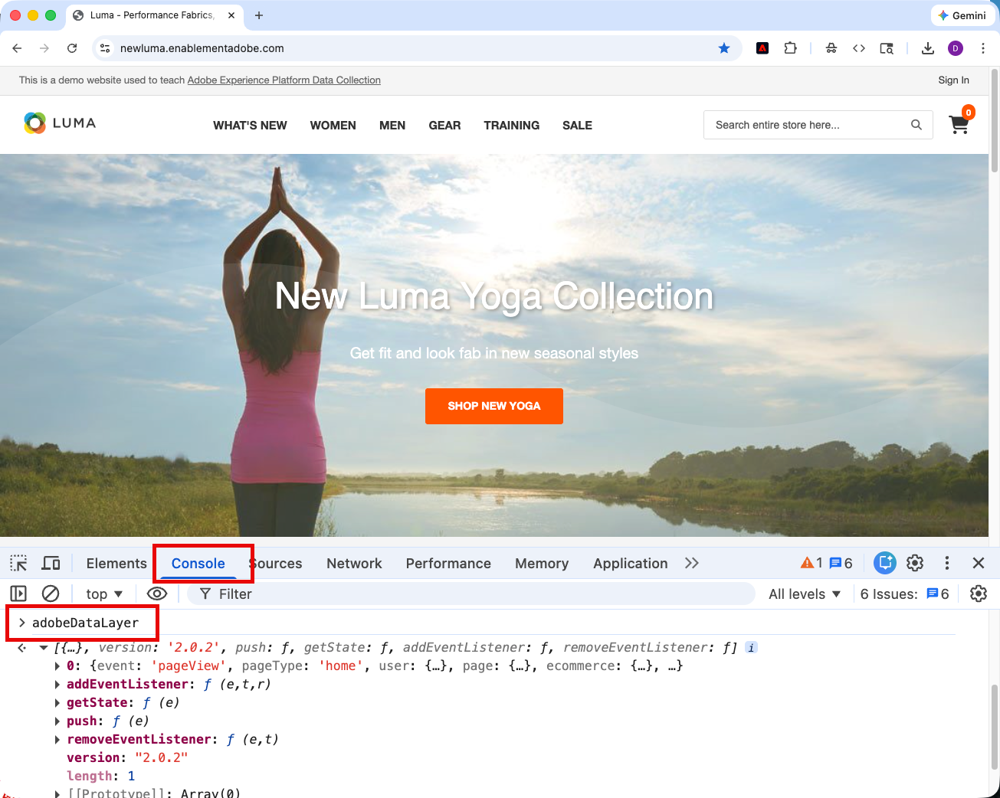
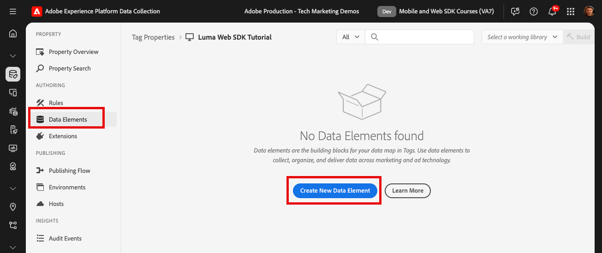
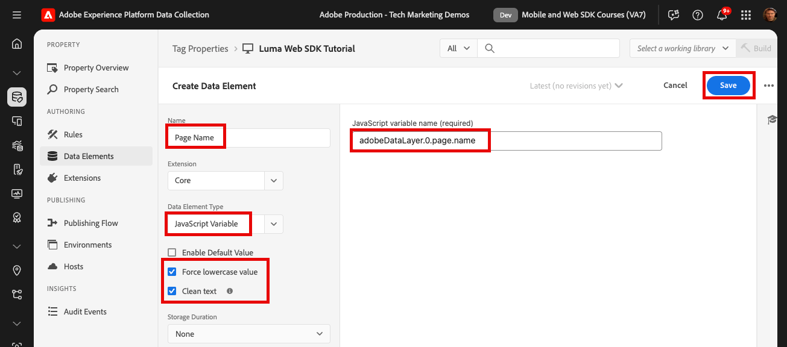
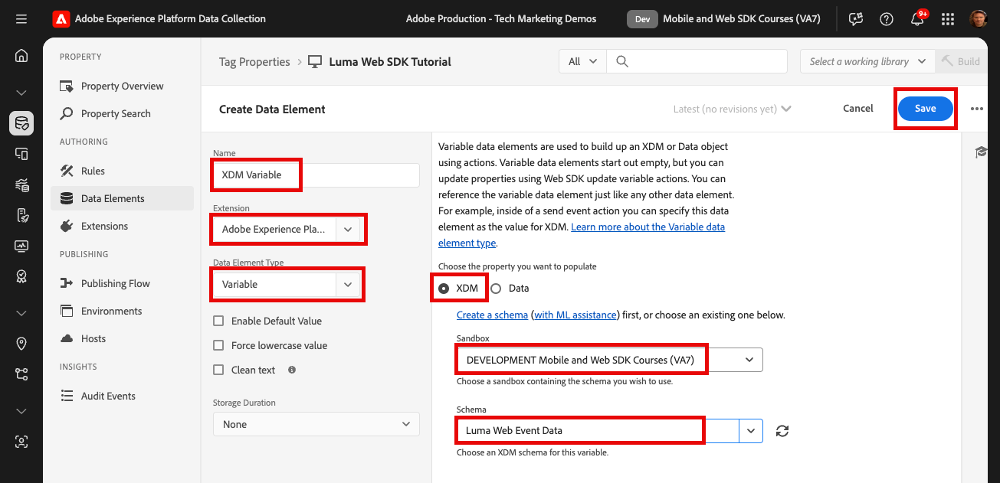
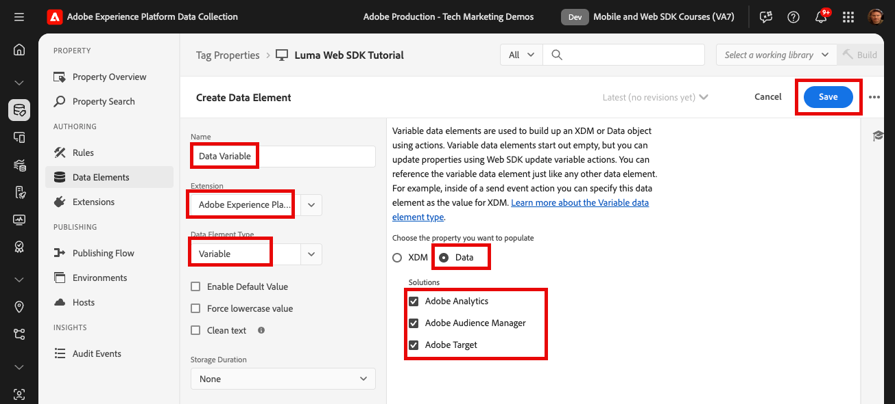

# Creare elementi dati

Scopri come creare elementi dati nei tag per i dati di contenuto, e-commerce e identità sul [sito Web di dimostrazione Luma](https://luma.enablementadobe.com). Quindi compila i campi nello schema XDM.


## Obiettivi di apprendimento

Alla fine di questa lezione, sarai in grado di:

* Comprendere diversi approcci per la mappatura di un livello dati su XDM
* Creare elementi dati per acquisire dati
* Mappare elementi dati a un oggetto XDM


## Prerequisiti

Conosci cos’è un livello dati e hai completato le lezioni precedenti nell’esercitazione:

* [Configurare uno schema XDM](configure-schemas.md)
* [Configurare uno spazio dei nomi delle identità](configure-identities.md)
* [Configurare uno stream di dati](configure-datastream.md)
* [Estensione Web SDK installata nella proprietà tag](install-web-sdk.md)


>[!IMPORTANT]
>
>I dati per questa lezione provengono dal livello dati `[!UICONTROL adobeDataLayer]` sul [sito Luma](https://luma.enablementadobe.com). Per visualizzare il livello dati, apri la console per sviluppatori e digita in `[!UICONTROL adobeDataLayer]` per visualizzare l&#39;intero livello dati disponibile.


## Approcci al livello dati

Esistono diversi modi per mappare i dati dal livello dati a XDM utilizzando la funzionalità tag di Adobe Experience Platform. Di seguito sono riportati alcuni pro e contro di tre diversi approcci. Se necessario, è possibile combinare gli approcci:

1. Implementare XDM nel livello dati
1. Mappare su XDM nei tag
1. Mappa su XDM nello stream di dati

>[!NOTE]
>
>Gli esempi in questa esercitazione seguono l’approccio Map to XDM in tags.


### Implementare XDM nel livello dati

In questo approccio, gli sviluppatori web implementano un oggetto XDM completamente definito come struttura per il livello dati. Quindi nei tag puoi semplicemente mappare l’intero livello dati a un oggetto XDM. Se l&#39;implementazione non utilizza un gestore di tag, questo approccio potrebbe essere ideale perché è possibile inviare dati a XDM direttamente dall&#39;applicazione utilizzando il comando [XDM sendEvent](https://experienceleague.adobe.com/en/docs/experience-platform/edge/fundamentals/tracking-events#sending-xdm-data). Se utilizzi i tag, puoi creare un elemento dati con codice personalizzato che acquisisce l’intero livello dati come oggetto JSON pass-through per XDM. Quindi, mappi il JSON pass-through al campo dell’oggetto XDM nell’azione Invia evento.

Di seguito è riportato un esempio dell’aspetto del livello dati utilizzando il formato Adobe Client Data Layer:

+++Esempio di XDM in Data Layer

```JSON
window.adobeDataLayer.push({
"eventType": "web.webPageDetails.pageViews",
"web":{
         "webInteraction":{
            "linkClicks":{
               "id":"",
               "value":""
            },
            "URL":"",
            "name":"",
            "region":"",
            "type":""
         },
         "webPageDetails":{
            "pageViews":{
               "id":"",
               "value":"1"
            },
            "URL":"https://luma.enablementadobe.com/",
            "isErrorPage":"",
            "isHomePage":"",
            "name":"luma:home",
            "server":"enablementadobe.com",
            "siteSection":"home",
            "viewName":""
         },
         "webReferrer":{
            "URL":"",
            "type":""
         }
      }
});
```

+++

Pro

* Elimina passaggi aggiuntivi per la mappatura delle variabili del livello dati su XDM
* L’implementazione potrebbe essere più rapida se il team di sviluppo web è anche responsabile dell’assegnazione tag del comportamento digitale

Contro

* Completa dipendenza dal team di sviluppo e dal ciclo di sviluppo per aggiornare i dati da inviare a XDM
* Flessibilità limitata, poiché XDM riceve il payload esatto dal livello dati
* Non è possibile utilizzare le funzioni dei tag incorporate, ad esempio raschiamento, persistenza e funzioni per distribuzioni rapide
* È più difficile utilizzare il livello dati per pixel di terze parti (ma potrebbe essere utile spostare questi pixel in [inoltro eventi](setup-event-forwarding.md)!)
* Impossibilità di trasformare i dati tra il livello dati e XDM

### Mappare su XDM nei tag

Questo approccio comporta la mappatura di singole variabili del livello dati su elementi dati nei tag e infine su XDM. Si tratta dell’approccio tradizionale all’implementazione tramite un sistema di gestione dei tag.

#### Pro

* L’approccio più flessibile, in quanto è possibile controllare singole variabili e trasformare i dati prima che arrivino a XDM
* Può utilizzare i trigger dei tag di Adobe e la funzionalità di scraping per trasmettere dati a XDM
* È in grado di mappare gli elementi dati su pixel di terze parti lato client

#### Contro

* Ci vuole del tempo per ricostruire il livello dati come elementi dati di tag


>[!IMPORTANT]
>
>Come indicato in precedenza, gli esempi in questa esercitazione seguono l’approccio Map to XDM in tags.

### Mappa su XDM nello stream di dati

Questo approccio utilizza funzionalità integrate nella configurazione dello stream di dati denominata [Preparazione dati per la raccolta dati](https://experienceleague.adobe.com/en/docs/experience-platform/datastreams/data-prep) e ignora la mappatura delle variabili del livello dati su XDM nei tag.

#### Pro

* Mappatura flessibile di singole variabili su XDM in un’interfaccia utente semplice e intuitiva
* Possibilità di [calcolare nuovi valori](https://experienceleague.adobe.com/en/docs/experience-platform/data-prep/functions) o [trasformare tipi di dati](https://experienceleague.adobe.com/en/docs/experience-platform/data-prep/data-handling) da un livello dati prima di passare a XDM

#### Contro

* Non è possibile utilizzare le variabili del livello dati come elementi dati per pixel di terze parti lato client, ma può utilizzarle con l’inoltro degli eventi
* Impossibile utilizzare la funzionalità di raschiamento nei tag
* La complessità di manutenzione aumenta se si esegue la mappatura del livello dati sia nei tag che nello stream di dati


>[!TIP]
>
> Google Data Layer
> 
> Se la tua organizzazione utilizza già Google Analytics e dispone dell&#39;oggetto Google dataLayer tradizionale sul sito Web, puoi utilizzare l&#39;estensione [Google Data Layer](https://experienceleague.adobe.com/en/docs/experience-platform/tags/extensions/client/google-data-layer/overview) nei tag. Questo consente di implementare la tecnologia Adobe più rapidamente senza dover richiedere supporto al team IT. La mappatura del livello dati di Google su XDM segue gli stessi passaggi indicati sopra.


## Creare elementi dati per acquisire il livello dati

Prima di popolare i campi XDM, acquisisci i punti dati necessari come elementi dati dei tag:

1. Vai a **[!UICONTROL Elementi dati]** e seleziona **[!UICONTROL Aggiungi elemento dati]** (o **[!UICONTROL Crea nuovo elemento dati]** se nella proprietà tag non sono presenti elementi dati esistenti)

   

1. Denomina l’elemento dati `Page Name`
1. Utilizza la **[!UICONTROL variabile JavaScript]** **[!UICONTROL tipo di elemento dati]** per puntare al valore nel livello dati di Luma: `adobeDataLayer.0.page.name`

1. Seleziona le caselle per **[!UICONTROL Forza valori minuscoli]** e **[!UICONTROL Pulisci testo]** per standardizzare il caso e rimuovere spazi estranei

1. Lascia `None` come impostazione di **[!UICONTROL Durata memorizzazione]**, poiché questo valore è diverso in ogni pagina

1. Seleziona **[!UICONTROL Salva]**

   

Crea questi elementi di dati aggiuntivi seguendo gli stessi passaggi:

* **`User Id`** mappato a
  `adobeDataLayer.0.user.id`

* **`User Logged In`** mappato a
  `adobeDataLayer.0.user.loggedIn`

* **`Ecommerce Product Id`** mappato a `adobeDataLayer.0.ecommerce.detail.products.0.id`
* **`Ecommerce Product Name`** mappato a `adobeDataLayer.0.ecommerce.detail.products.0.name`
* **`Ecommerce Purchase Id`** mappato a `adobeDataLayer.0.ecommerce.purchase.actionField.id`
* **`Ecommerce Product Category`** utilizzando il **[!UICONTROL Codice personalizzato]** **[!UICONTROL Tipo elemento dati]** e il seguente codice personalizzato:

  ```javascript
  return adobeDataLayer[0].ecommerce.detail.products[0].category+":"+adobeDataLayer[0].ecommerce.detail.products[0].subcategory;
  ```

* **`Ecommerce Cart Products`** utilizzando il seguente codice personalizzato:

  ```javascript
  const cartProducts = adobeDataLayer
  .flatMap(evt => Array.isArray(evt?.ecommerce?.cart?.items) ? evt.ecommerce.cart.items : [])
  .filter(item => item && item.id && item.name && item.brand)
  .map(({ id, name, brand }) => ({ id, name, brand }));
  
  return cartProducts;
  ```

* **`Ecommerce Purchase Products`** utilizzando il seguente codice personalizzato:

  ```javascript
  const purchaseEvent = adobeDataLayer.find(e => e.event === "purchase");
  
  const currencyCode = purchaseEvent?.ecommerce?.currencyCode ?? "USD";
  
  const purchasedProducts = (purchaseEvent?.ecommerce?.purchase?.products || []).map(p => {
     const unitPrice = parseFloat(String(p.price).replace(/[^0-9.-]/g, "")) || 0;
     const qty = Number(p.quantity) || 0;
  
     return {
     SKU: p.id,                       // id -> SKU
     name: p.name,                    // name -> name
     quantity: qty,                   // quantity -> quantity
     priceTotal: unitPrice * qty,     // price -> priceTotal (unit price × quantity)
     currencyCode                     // "USD" -> currencyCode (from ecommerce.currencyCode)
     };
  });
  
  return(purchasedProducts);
  ```


>[!CAUTION]
>
>Il tipo di elemento dati [!UICONTROL variabile JavaScript] tratta i riferimenti di matrice come punti invece che come parentesi quadre, pertanto il riferimento all&#39;elemento dati username come `adobeDataLayer[0].page.name` **non funzionerà**.

## Creare elementi dati variabili per XDM e oggetti dati

Gli elementi dati appena creati verranno utilizzati per creare un oggetto XDM (per le applicazioni Platform) e un oggetto dati (per Analytics, Target e Audience Manager). Questi oggetti dispongono di elementi dati speciali denominati **[!UICONTROL Elementi dati variabili]** che sono molto facili da creare.

Per creare l&#39;elemento dati Variable per XDM, è necessario collegarlo allo schema creato nella lezione [Configurare uno schema](configure-schemas.md):

1. Seleziona **[!UICONTROL Aggiungi elemento dati]**
1. Denomina l&#39;elemento dati `XDM Variable`. È consigliabile usare il prefisso &quot;XDM&quot; per gli elementi dati specifici di XDM per organizzare meglio la proprietà tag
1. Seleziona **[!UICONTROL Adobe Experience Platform Web SDK]** come **[!UICONTROL estensione]**
1. Seleziona la **[!UICONTROL Variabile]** come **[!UICONTROL Tipo di elemento dati]**
1. Seleziona **[!UICONTROL XDM]** come **[!UICONTROL proprietà]**
1. Seleziona la **[!UICONTROL Sandbox]** in cui hai creato lo schema
1. Seleziona lo **[!UICONTROL Schema]** appropriato, in questo caso `Luma Web Event Data`
1. Seleziona **[!UICONTROL Salva]**

   

Quindi, crea l’elemento dati Variable per l’oggetto dati:

1. Seleziona **[!UICONTROL Aggiungi elemento dati]**
1. Denomina l&#39;elemento dati `Data Variable`.
1. Seleziona **[!UICONTROL Adobe Experience Platform Web SDK]** come **[!UICONTROL estensione]**
1. Seleziona la **[!UICONTROL Variabile]** come **[!UICONTROL Tipo di elemento dati]**
1. Seleziona **[!UICONTROL dati]** come **[!UICONTROL proprietà]**
1. Seleziona le soluzioni Experience Cloud da implementare come parte di questa esercitazione
1. Seleziona **[!UICONTROL Salva]**

   


Al termine di questi passaggi, dovresti aver creato i seguenti elementi di dati:

| Elementi dati dell&#39;estensione core | Elementi dati dell’estensione Platform Web SDK |
| ----------------------------- | ------------------------------- |
| `Ecommerce Cart Products` | `Data Variable` |
| `Ecommerce Product Category` | `XDM Variable` |
| `Ecommerce Product Id` | |
| `Ecommerce Product Name` | |
| `Ecommerce Purchase Id` | |
| `Ecommerce Purchase Products` | |
| `Page Name` | |
| `User Id` | |
| `User Logged In` | |

Una volta impostati questi elementi dati, puoi iniziare a inviare dati a Platform Edge Network con una regola di tag. Ma prima, scopri come raccogliere le identità con Web SDK.

>[!NOTE]
>
>Grazie per aver dedicato tempo all&#39;apprendimento di Adobe Experience Platform Web SDK. Se hai domande, vuoi condividere commenti generali o suggerimenti su contenuti futuri, condividili in questo [post di discussione della community Experience League](https://experienceleaguecommunities.adobe.com/adobe-experience-platform-18/tutorial-discussion-implement-adobe-experience-cloud-with-web-sdk-tutorial-248848)
