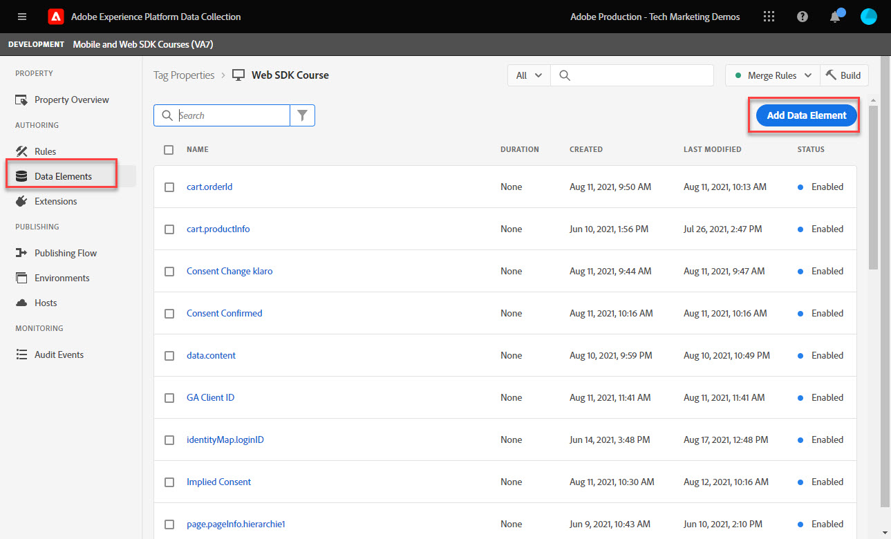
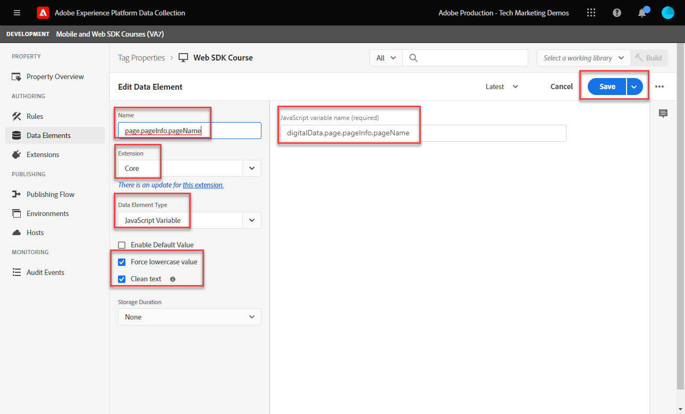
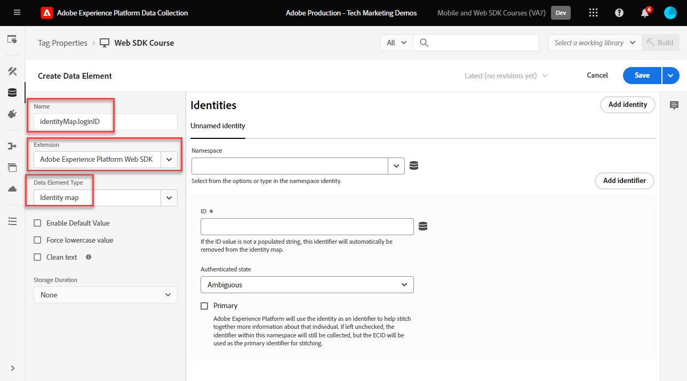

# Creare elementi dati

Scopri come creare gli elementi dati essenziali necessari per acquisire dati con Experience Platform Web SDK. Acquisire sia i dati di contenuto che quelli di identità sul [Sito dimostrativo Luma](https://luma.enablementadobe.com/content/luma/us/en.html). Scopri come utilizzare lo schema XDM creato in precedenza per la raccolta di dati tramite Platform Web SDK tramite un nuovo tipo di elemento dati denominato Oggetto XDM.

>[!NOTE]
>
> A scopo dimostrativo, gli esercizi contenuti in questa lezione si basano sull’esempio utilizzato durante [Configurare uno schema](configure-schemas.md) passo; creazione di oggetti XDM di esempio che acquisiscono il contenuto visualizzato e le identità degli utenti sul [Sito dimostrativo Luma](https://luma.enablementadobe.com/content/luma/us/en.html).

>[!IMPORTANT]
>
>I dati di questa lezione provengono dal `[!UICONTROL digitalData]` livello dati sul sito Luma. Per visualizzare il livello dati, apri la console per sviluppatori e digita `[!UICONTROL digitalData]` per visualizzare il livello dati completo disponibile.


Indipendentemente da Platform Web SDK, devi continuare a creare elementi dati all’interno della proprietà tag che vengono mappati su variabili di raccolta dati del sito web, ad esempio un livello dati, un attributo HTML o altri. Una volta creati questi elementi di dati, è necessario mapparli allo schema XDM creato durante il [configurare schemi](configure-schemas.md) lezione. A questo scopo, l’estensione Platform Web SDK rende disponibile un nuovo tipo di elemento dati denominato oggetto XDM. Pertanto, la creazione di elementi dati consiste in due azioni:

1. Mappatura delle variabili del sito web a elementi di dati e
1. Mappatura di tali elementi dati su un oggetto XDM

Per il passaggio 1, continua a mappare il livello dati agli elementi dati nel modo in cui lo fai attualmente, utilizzando uno qualsiasi dei tipi di elementi dati dell’estensione tag core. Per il passaggio 2, l’estensione Platform Web SDK crea un set di nuovi tipi di elementi dati non precedentemente disponibili:

* ID unione eventi
* Mappa identità
* Oggetto XDM

Questa lezione si concentra sui tipi di elementi dati mappa identità e oggetto XDM. Puoi creare oggetti XDM per acquisire l’attività dei visitatori Luma e lo stato di autenticazione.

## Finalità di apprendimento

Alla fine di questa lezione, puoi:

* Creazione di elementi dati per acquisire il contenuto e i dati ID di accesso dell’utente
* Creare un elemento dati mappa identità
* Mappatura di elementi dati su un elemento dati oggetto XDM


## Prerequisiti

Si capisce cosa sia un livello di dati, si ha familiarità con [Sito dimostrativo Luma](https://luma.enablementadobe.com/content/luma/us/en.html)Livello dati {target=&quot;_blank&quot;} e informazioni su come fare riferimento a elementi dati nei tag. Devi aver completato i seguenti passaggi precedenti nell’esercitazione

* [Configurare le autorizzazioni](configure-permissions.md)
* [Configurare uno schema XDM](configure-schemas.md)
* [Configurare uno spazio dei nomi di identità](configure-identities.md)
* [Configurare un datastream](configure-datastream.md)
* [Estensione SDK per web installata nella proprietà tag](install-web-sdk.md)

>[!IMPORTANT]
>
>La [Estensione del servizio Experience Cloud ID](https://exchange.adobe.com/experiencecloud.details.100160.adobe-experience-cloud-id-launch-extension.html) non è necessario per l’implementazione di Adobe Experience Platform Web SDK, in quanto la funzionalità del servizio ID è incorporata in Platform Web SDK.

## Creare elementi dati per acquisire il livello dati

Prima di iniziare la creazione dell&#39;oggetto XDM, crea il seguente set di elementi dati che corrispondono a [Sito dimostrativo Luma](https://luma.enablementadobe.com/content/luma/us/en.html)Livello dati {target=&quot;_blank&quot;}:

1. Vai a **[!UICONTROL Elementi dati]** e seleziona **[!UICONTROL Aggiungi elemento dati]** o **[!UICONTROL Crea nuovo elemento dati]** se nella proprietà tag non sono presenti elementi dati)

   

1. Denomina l’elemento dati `page.pageInfo.pageName`
1. Utilizza la **[!UICONTROL Variabile JavaScript]** **[!UICONTROL Tipo di elemento dati]** per puntare a un valore nel livello dati di Luma: `digitalData.page.pageInfo.pageName`

1. Seleziona le caselle per **[!UICONTROL Forza valori minuscoli]** e **[!UICONTROL Pulisci testo]** per standardizzare l’uso di maiuscole/minuscole e rimuovere spazi estranei

1. Esci `None` come **[!UICONTROL Durata archiviazione]** poiché questo valore è diverso in ogni pagina

1. Seleziona **[!UICONTROL Salva]**

   

Segui gli stessi passaggi per creare questi quattro elementi di dati aggiuntivi:

* **`page.pageInfo.server`**  mappato su
   `digitalData.page.pageInfo.server`

* **`page.pageInfo.hierarchie1`**  mappato su
   `digitalData.page.pageInfo.hierarchie1`

* **`user.profile.attributes.username`**  mappato su
   `digitalData.user.0.profile.0.attributes.username`

* **`user.profile.attributes.loggedIn`** mappato su
   `digitalData.user.0.profile.0.attributes.loggedIn`

* **`cart.orderId`** mappato su `digitalData.cart.orderId` (questo viene utilizzato durante il [Configurazione di Analytics](setup-analytics.md) lezione)


>[!CAUTION]
>
>La [!UICONTROL Variabile JavaScript] il tipo di elemento dati tratta i riferimenti dell’array come punti invece delle parentesi, facendo riferimento all’elemento dati del nome utente come `digitalData.user[0].profile[0].attributes.username` **non funzionerà**.

## Crea elemento dati mappa identità

Successivamente puoi creare l’elemento dati Identity Map:

1. Vai a **[!UICONTROL Elementi dati]** e seleziona **[!UICONTROL Aggiungi elemento dati]**

1. **[!UICONTROL Nome]** Elemento dati `identityMap.loginID`

1. Come **[!UICONTROL Estensione]**, seleziona `Adobe Experience Platform Web SDK`

1. Come **[!UICONTROL Tipo di elemento dati]**, seleziona `Identity map`

1. Viene visualizzata un&#39;area dello schermo a destra all&#39;interno della **[!UICONTROL Interfaccia di raccolta dati]** per configurare l&#39;identità:

   

1. Come  **[!UICONTROL Namespace]**, seleziona `Luma CRM Id` spazio dei nomi creato in precedenza in [Configurare le identità](configure-identities.md) lezione.

   >[!NOTE]
   >
   >    Se non vedi il tuo `Luma CRM Id` namespace, verifica di averlo creato anche nella sandbox di produzione predefinita. Nel menu a discesa namespace vengono attualmente visualizzati solo i namespace creati nella sandbox di produzione predefinita.

1. Dopo la **[!UICONTROL Namespace]** Se è selezionato, è necessario impostare un ID. Seleziona la `user.profile.attributes.username` elemento dati creato in precedenza in questa lezione, che acquisisce un ID quando gli utenti vengono collegati al sito Luma.

<!--  >[!TIP]
   >
   >You can verify the **[!UICONTROL Luma CRM ID]** is collected in a data element on the web property by going to the [Luma Demo site](https://luma.enablementadobe.com/content/luma/us/en.html), logging in, [switching the tag environment](validate-with-debugger.md#use-the-experience-platform-debugger-to-map-to-your-tag-property) to your own, and typing `_satellite.getVar("user.profile.attributes.username")` in the web browser developer console.
   >
   >   
-->

1. Come **[!UICONTROL Stato autenticato]**, seleziona **[!UICONTROL Autenticato]**

1. Seleziona **[!UICONTROL Salva]**

   

>[!WARNING]
>
>L’identità principale è necessaria in tutti i record inviati a Adobe Experience Platform. Per impostazione predefinita, l’ID Experience Cloud (ECID) viene utilizzato come identità principale dell’SDK per web di Platform. Non vorreste mai usare qualcosa come il `Luma CRM ID` come identità principale con l&#39;SDK web, poiché esiste solo dopo l&#39;autenticazione dell&#39;utente e non sarebbe quindi disponibile in tutti i record.

<!--
1. Once the data element is configured in **[!UICONTROL Data Collection interface]**, it can be tested on the Luma web property like any other Data Element. Enter the following script in the browser developer console
   
   
   ```
   _satellite.getVar('identityMap.loginID')
   ```  

   
   
   >[!NOTE]
   >
   >ECID identifier will NOT populate in the Data Element, as this is configured already with Platform Web SDK.   
-->

## Mappatura di elementi dati su oggetti XDM

Tutti gli elementi dati creati devono essere mappati su un oggetto XDM. Questo oggetto deve essere conforme allo schema XDM creato durante il [Configurare uno schema](configure-schemas.md) lezione.

Esistono diversi modi per mappare gli elementi dati ai campi oggetto XDM. È possibile mappare singoli elementi dati a singoli campi XDM o mappare elementi dati a interi oggetti XDM, purché l’elemento dati corrisponda allo schema esatto della coppia chiave-valore presente nell’oggetto XDM. In questa lezione, acquisirai i dati del contenuto mediante la mappatura a singoli campi. Imparerai come [mappare un elemento dati a un intero oggetto XDM](setup-analytics.md#Map-an-entire-array-to-an-XDM-Object) in [Configurazione di Analytics](setup-analytics.md) lezione.

Creare un oggetto XDM per acquisire i dati di contenuto:

1. Nella navigazione a sinistra, seleziona **[!UICONTROL Elementi dati]**
1. Seleziona **[!UICONTROL Aggiungi elemento dati]**
1. **** Denomina l’elemento dati **`xdm.content`**
1. Come **[!UICONTROL Estensione]** select `Adobe Experience Platform Web SDK`
1. Come **[!UICONTROL Tipo di elemento dati]** select `XDM object`
1. Seleziona la piattaforma **[!UICONTROL Sandbox]** in cui è stato creato lo schema XDM in durante il [Configurare uno schema XDM](configure-schemas.md) lezione, in questo esempio `DEVELOPMENT Mobile and Web SDK Courses`
1. Come **[!UICONTROL Schema]**, seleziona la `Luma Web Event Data` schema:

   

   >[!NOTE]
   >
   >La sandbox corrisponde all’Experience Platform sandbox in cui è stato creato lo schema. Nell’istanza di Experience Platform possono essere disponibili più sandbox, quindi assicurati di selezionare quella giusta. Lavorare sempre prima nello sviluppo, poi nella produzione.

1. Scorri verso il basso fino a raggiungere il **`web`** oggetto
1. Selezionare per aprirlo

   


1. Mappa le seguenti variabili XDM web su elementi dati

   * **`web.webPageDetials.name`** in `%page.pageInfo.pageName%`
   * **`web.webPageDetials.server`** in `%page.pageInfo.server%`
   * **`web.webPageDetials.siteSection`** in `%page.pageInfo.hierarchie1%`

   

1. Quindi, trova il `identityMap` oggetto nello schema e selezionalo

1. Mappa su `identityMap.loginID` elemento dati

1. Seleziona **[!UICONTROL Salva]**

   


Al termine di questi passaggi, è necessario creare i seguenti elementi dati:

| Elementi dati dell’estensione CORE | Elementi dati SDK per web Platform |
-----------------------------|-------------------------------
| `cart.orderId` | `identityMap.loginID` |
| `page.pageInfo.hierarchie1` | `xdm.content` |
| `page.pageInfo.pageName` |  |
| `page.pageInfo.server` |  |
| `user.profile.attributes.loggedIn` |  |
| `user.profile.attributes.username` |  |

Con questi elementi dati in essere, puoi iniziare a inviare dati a Platform Edge Network tramite l’oggetto XDM creando una regola nei tag.

[Avanti: ](create-tag-rule.md)

>[!NOTE]
>
>Grazie per aver investito il tuo tempo nel conoscere Adobe Experience Platform Web SDK. In caso di domande, se desideri condividere feedback generali o se hai suggerimenti su contenuti futuri, condividi questi su questo [Experience League Articolo di discussione della Comunità](https://experienceleaguecommunities.adobe.com/t5/adobe-experience-platform-launch/tutorial-discussion-implement-adobe-experience-cloud-with-web/td-p/444996)
