# Creare regole di tag

Scopri come inviare eventi all’Edge Network di Adobe Experience Platform utilizzando le regole di tag. Una regola di tag è una combinazione di eventi, condizioni e azioni che indica alla proprietà tag di eseguire un&#39;operazione. Con Platform Web SDK, le regole vengono utilizzate per inviare eventi a Platform Edge Network con i dati corretti.

## Obiettivi di apprendimento

Alla fine di questa lezione, sarai in grado di:

* Utilizza una convenzione di denominazione per gestire le regole all’interno dei tag
* Inviare un evento con campi XDM utilizzando le azioni Aggiorna variabile e Invia evento
* Sovrapponi più set di campi XDM in più regole
* Mappare singoli o interi elementi di dati array all’oggetto XDM
* Pubblicare una regola di tag in una libreria di sviluppo

## Prerequisiti

Conosci i tag di raccolta dati e il [sito di dimostrazione Luma](https://luma.enablementadobe.com) e hai completato le lezioni precedenti nell’esercitazione:

* [Configurare uno schema XDM](configure-schemas.md)
* [Configurare uno spazio dei nomi delle identità](configure-identities.md)
* [Configurare uno stream di dati](configure-datastream.md)
* [Installare l’estensione Web SDK](install-web-sdk.md)
* [Creare elementi dati](create-data-elements.md)
* [Acquisire le identità](create-identities.md)

## Convenzioni di denominazione

Per gestire le regole nei tag, si consiglia di seguire una convenzione di denominazione standard. Questa esercitazione utilizza una convenzione di denominazione in quattro parti:

* [**posizione**] - [**evento**] - [**scopo**] - [**ordine**]

dove;

1. **posizione** è la pagina o le pagine del sito in cui viene attivata la regola
1. **event** è il trigger per la regola
1. **scopo** è l&#39;azione principale eseguita dalla regola
1. **order** è l&#39;ordine in cui attivare la regola in relazione ad altre regole che condividono lo stesso evento
<!-- minor update -->

## Aggiungere l’estensione Adobe Client Data Layer

Il sito web Luma utilizza un livello dati basato su eventi denominato Adobe Client Data Layer (ACDL). Ogni volta che si verifica un evento del livello dati, viene inviato all&#39;array `adobeDataLayer`. Questa esercitazione utilizza un’estensione tag denominata Adobe Client Data Layer per accedere comodamente a questi eventi e creare le nostre regole.

Per aggiungere l&#39;estensione:

1. Vai a **[!UICONTROL Estensioni]**
1. Filtra per **[!UICONTROL Adobe Client Data Layer]**
1. Seleziona **[!UICONTROL Installa]**

   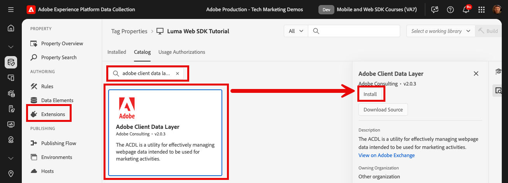

1. Lascia le impostazioni predefinite
1. Seleziona **[!UICONTROL Salva]**

>[!NOTE]
>
> Non è necessario utilizzare Adobe Client Data Layer per implementare Experience Platform Web SDK. Molti altri tipi di eventi vengono comunemente utilizzati nelle implementazioni di tag (Library Loaded, DOM Ready, Window Loaded e così via) per attivare le regole.

## Creare regole di tag

Nei tag, le regole vengono utilizzate per eseguire azioni quali l’impostazione di variabili e l’attivazione di chiamate di rete in varie condizioni. L’estensione tag di Experience Platform Web SDK include due azioni utilizzate nelle regole:

* **[!UICONTROL Aggiorna variabile]** associa gli elementi dati alle variabili di dati o XDM
* **[!UICONTROL Invia evento]** effettua la chiamata di rete per inviare dati ad Experience Platform Edge Network

Nel resto di questa lezione:

1. Utilizza l&#39;azione **[!UICONTROL Aggiorna variabile]** per definire una &quot;configurazione globale&quot; dei campi XDM.

1. Utilizza di nuovo l&#39;azione **[!UICONTROL Aggiorna variabile]** per ignorare la &quot;configurazione globale&quot; e contribuire con campi XDM aggiuntivi in determinate condizioni (ad esempio, l&#39;aggiunta di dettagli prodotto nelle pagine dei prodotti).

1. Utilizza l&#39;azione **[!UICONTROL Invia evento]** per inviare i dati a Adobe Experience Platform Edge Network.

Tutte queste regole verranno sequenziate correttamente utilizzando l&#39;opzione &quot;[!UICONTROL order]&quot;.

Questo video offre una panoramica del processo:

>[!VIDEO](https://video.tv.adobe.com/v/3427710/?learn=on&enablevpops)

### Campi di configurazione globali

Per creare una regola di tag per i campi XDM globali:

1. Apri la proprietà tag utilizzata per questa esercitazione

1. Vai a **[!UICONTROL Regole]** nel menu di navigazione a sinistra

1. Seleziona il pulsante **[!UICONTROL Crea nuova regola]**

   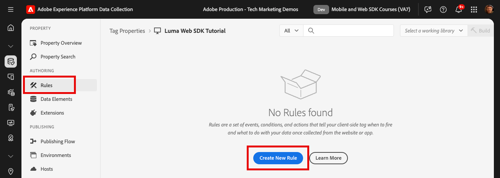

1. Denomina la regola `all pages - adobeDataLayer push - set global variables - 1`

1. Nella sezione **[!UICONTROL Eventi]**, seleziona **[!UICONTROL Aggiungi]**

   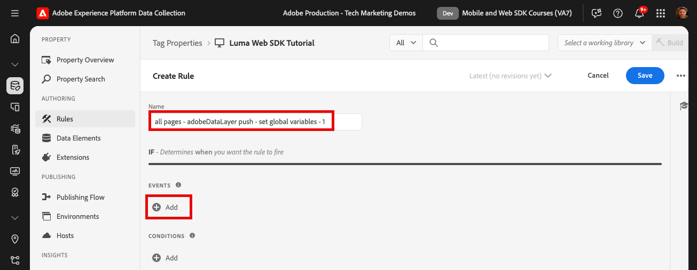

1. Utilizza l&#39;estensione **[!UICONTROL Adobe Client Data Layer]** e seleziona **[!UICONTROL Dati inviati]** come **[!UICONTROL Tipo evento]**

1. Seleziona il menu a discesa **[!UICONTROL Avanzate]** e immetti `1` come **[!UICONTROL Ordine]**

   >[!NOTE]
   >
   > Minore è il numero d&#39;ordine, prima viene eseguito. Pertanto, alla nostra &quot;configurazione globale&quot; viene assegnato un numero d&#39;ordine basso.

1. Ascolta **[!UICONTROL Tutti gli eventi]**
1. Seleziona **[!UICONTROL Mantieni modifiche]** per tornare alla schermata della regola principale
   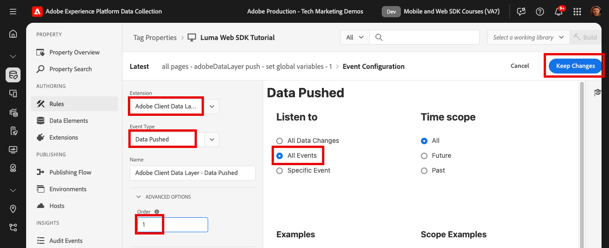

1. Nella sezione **[!UICONTROL Azioni]**, seleziona **[!UICONTROL Aggiungi]**

1. Come **[!UICONTROL Estensione]**, seleziona **[!UICONTROL Adobe Experience Platform Web SDK]**

1. Come **[!UICONTROL Tipo azione]**, seleziona **[!UICONTROL Aggiorna variabile]**

1. Come **[!UICONTROL elemento dati]**, seleziona `XDM Variable` creato nella lezione [Creare elementi dati](create-data-elements.md)

   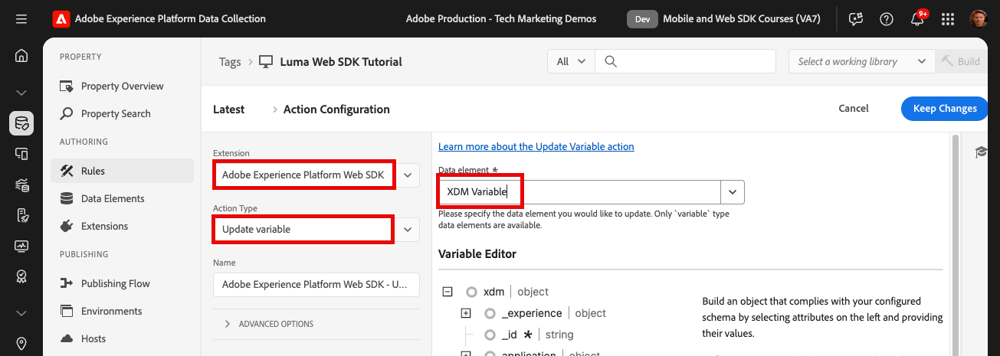

1. Ora, specifica i campi XDM mappandoli ai valori appropriati:

   | Campo XDM | Mappa a |
   |---|---|
   | `eventType` | `Web Webpagedetails Page Views` (iniziare a digitare per visualizzare i valori suggeriti) |
   | `identityMap` | `Identity Map` elemento dati |
   | `web.webPageDetails.name` | `Page Name` elemento dati |
   | `web.webPageDetails.pageViews.value` | `1` |

   >[!TIP]
   >
   > I campi XDM non verranno inclusi nella richiesta di rete se l’elemento dati è nullo. Pertanto, quando l&#39;utente non è autenticato e l&#39;elemento dati `Identity Map` è null, l&#39;oggetto `identityMap` non verrà inviato. Per questo possiamo definirla senza problemi nella nostra &quot;configurazione globale&quot;.

   >[!TIP]
   >
   > L&#39;impostazione di `web.webPageDetails.pageViews.value` fornisce un metodo standard per indicare una visualizzazione di pagina per altre applicazioni a valle. Non è necessario che Adobe Analytics elabori una chiamata di rete come visualizzazione di pagina.

1. Al termine, `XDM Variable` avrà un aspetto simile a questo. I campi compilati e parzialmente compilati sono indicati con i cerchi blu:
   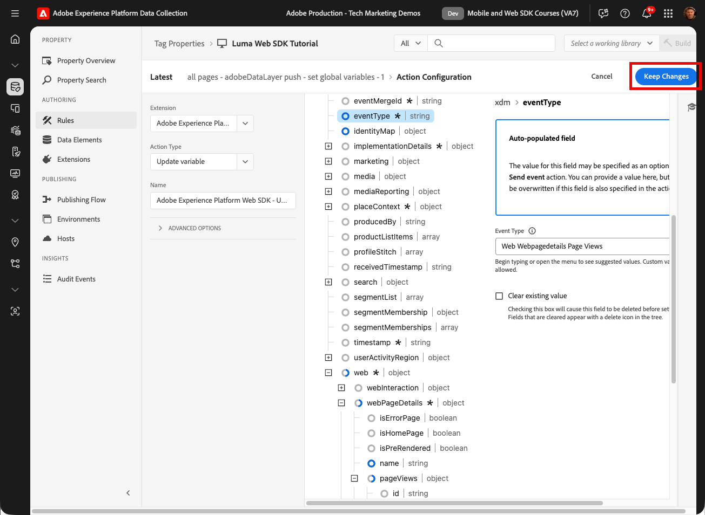
1. Seleziona **[!UICONTROL Mantieni modifiche]**, quindi **[!UICONTROL Salva]** la regola

### Campi pagina prodotto

Ora, inizia a utilizzare **[!UICONTROL Aggiorna variabile]** in regole aggiuntive in sequenza per arricchire l&#39;oggetto XDM prima di inviarlo a [!UICONTROL Platform Edge Network].

>[!TIP]
>
>L&#39;ordine delle regole determina quale regola viene eseguita per prima quando viene attivato un evento. Se due regole hanno lo stesso tipo di evento, viene eseguita per prima la regola con il numero di ordine più basso.
> 

Per iniziare, monitora le visualizzazioni del prodotto nella pagina dei dettagli del prodotto di Luma:

1. Seleziona **[!UICONTROL Aggiungi regola]**
1. Denomina [!UICONTROL `product detail pages - adobeDataLayer push - set product details variables - 20`]
1. Seleziona il simbolo  in Evento per aggiungere un nuovo trigger
1. In **[!UICONTROL Estensione]**, seleziona **[!UICONTROL Adobe Client Data Layer]**
1. In **[!UICONTROL Tipo evento]**, seleziona **[!UICONTROL Dati inviati]**
1. Seleziona per aprire **[!UICONTROL Opzioni avanzate]**, digita in `20`. Questo valore dell&#39;ordine assicura che la regola venga eseguita _dopo_ la regola delle variabili globali.
1. Ascolta un **[!UICONTROL evento specifico]**
1. Immetti `productView` come **[!UICONTROL Evento / Chiave da registrare per]**
1. Seleziona **[!UICONTROL Mantieni modifiche]**

   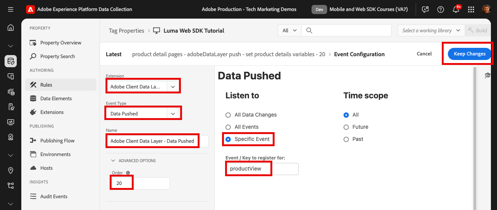

1. In **[!UICONTROL Azioni]** selezionare **[!UICONTROL Aggiungi]**
1. Seleziona estensione **[!UICONTROL Adobe Experience Platform Web SDK]**
1. Seleziona **[!UICONTROL Tipo azione]** come **[!UICONTROL Aggiorna variabile]**
1. Seleziona `XDM Variable` come **[!UICONTROL elemento dati]**
1. Mappa questi campi XDM sui valori appropriati:

   | Campo XDM | Mappa a |
   |---|---|
   | `eventType` | `Commerce Product Views` (iniziare a digitare per visualizzare i valori suggeriti) |
   | `commerce.productViews.value` | `1` |
   | `productListItems.name` | `Ecommerce Product Name` elemento dati (selezionare **[!UICONTROL Fornisci singoli elementi]** e **[!UICONTROL Aggiungi elemento]** prima ) |
   | `productListItems.sku` | `Ecommerce Product Id` elemento dati |

1. Seleziona **[!UICONTROL Mantieni modifiche]**

1. Seleziona **[!UICONTROL Salva]** per salvare la regola

   >[!NOTE]
   >
   >Poiché questa regola ha un ordine più alto, sovrascriverà `eventType` impostato nella regola di &quot;configurazione globale&quot;. `eventType` può contenere un solo valore e si consiglia di impostarlo con l&#39;evento di maggior valore.

   >[!TIP]
   >
   >L&#39;impostazione di commerce.productViews.value=1 in XDM viene mappata automaticamente all&#39;evento `prodView` in Analytics

### Campi carrello

Puoi mappare l’intero array a un oggetto XDM, purché l’array corrisponda al formato dello schema XDM. L’elemento dati del codice personalizzato `Ecommerce Cart Products` creato in precedenza esegue un ciclo nell’oggetto livello dati `adobeDataLayer.ecommerce.cart.items` sul sito web Luma e lo traduce nel formato richiesto dell’oggetto `productListItems` dello schema XDM.

Per illustrare, consulta il confronto seguente del livello dati del sito Luma (a sinistra) con l’elemento dati tradotto (a destra):

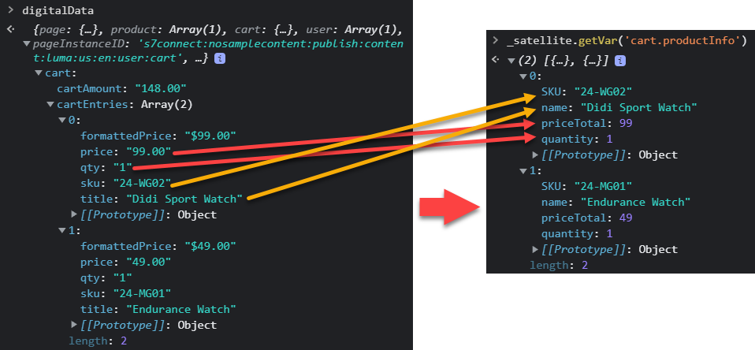

Confrontare l&#39;elemento dati con la struttura `productListItems` (suggerimento, dovrebbe corrispondere).

>[!NOTE]
>
> A questo punto dell&#39;esercitazione non sarà possibile eseguire `_satellite.getVar('Ecommerce Cart Products')`.

>[!IMPORTANT]
>
>Quando mappi i campi dal livello dati a XDM, assicurati che i campi corrispondano al tipo di dati del campo XDM. Nell’esempio precedente `quantity` e `priceTotal` devono essere numeri interi o il record non verrà acquisito in Platform.
> 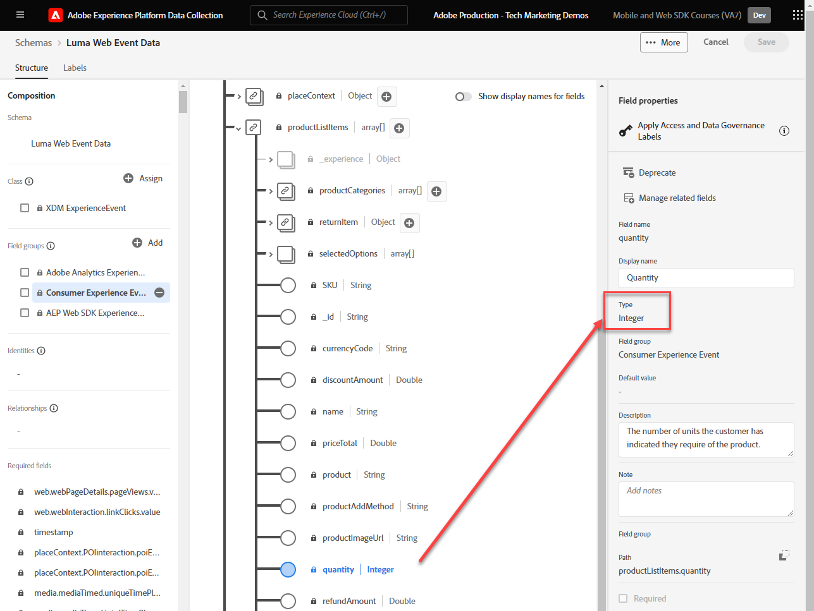

Ora associamo il nostro array all’oggetto XDM:

1. Crea una nuova regola denominata `cart page - adobeDataLayer push - set cart variables - 20`
1. Seleziona il simbolo  in Evento per aggiungere un nuovo trigger
1. In **[!UICONTROL Estensione]**, seleziona **[!UICONTROL Adobe Client Data Layer]**
1. In **[!UICONTROL Tipo evento]**, seleziona **[!UICONTROL Dati inviati]**
1. Seleziona per aprire **[!UICONTROL Opzioni avanzate]**, digita in `20`. Questo valore dell&#39;ordine assicura che la regola venga eseguita _dopo_ la regola delle variabili globali.
1. Ascolta un **[!UICONTROL evento specifico]**
1. Immetti `cartView` come **[!UICONTROL Evento / Chiave da registrare per]**
1. Seleziona **[!UICONTROL Mantieni modifiche]**

   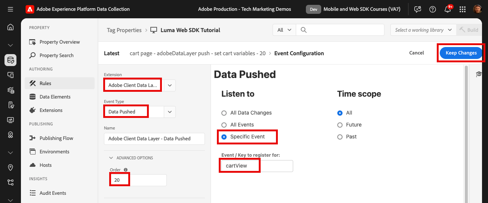

1. In **[!UICONTROL Azioni]** selezionare **[!UICONTROL Aggiungi]**
1. Seleziona estensione **[!UICONTROL Adobe Experience Platform Web SDK]**
1. Seleziona **[!UICONTROL Tipo azione]** come **[!UICONTROL Aggiorna variabile]**
1. Seleziona `XDM Variable` come **[!UICONTROL elemento dati]**
1. Mappa questi campi XDM sui valori appropriati:

   | Campo XDM | Mappa a |
   |---|---|
   | `eventType` | `Commerce Product List (Cart) Views` (iniziare a digitare per visualizzare i valori suggeriti) |
   | `commerce.productListViews.value` | `1` |
   | `productListItems` | `Ecommerce Cart Products` elemento dati (selezionare **[!UICONTROL Fornire prima l&#39;intero array]** ) |

   >[!TIP]
   >
   >L&#39;impostazione di commerce.productListViews.value=1 in XDM viene mappata automaticamente all&#39;evento `scView` in Analytics

1. Seleziona **[!UICONTROL Mantieni modifiche]**

1. Seleziona **[!UICONTROL Salva]** per salvare la regola

### Campi di conferma dell’ordine

Crea un’altra regola per gli eventi di acquisto:

1. Crea una nuova regola denominata `order confirmation - adobeDataLayer push - set purchase variables -  20`
1. Seleziona il simbolo  in Evento per aggiungere un nuovo trigger
1. In **[!UICONTROL Estensione]**, seleziona **[!UICONTROL Adobe Client Data Layer]**
1. In **[!UICONTROL Tipo evento]**, seleziona **[!UICONTROL Dati inviati]**
1. Seleziona per aprire **[!UICONTROL Opzioni avanzate]**, digita in `20`. Questo valore dell&#39;ordine assicura che la regola venga eseguita _dopo_ la regola delle variabili globali.
1. Ascolta un **[!UICONTROL evento specifico]**
1. Immetti `purchase` come **[!UICONTROL Evento / Chiave da registrare per]**
1. Seleziona **[!UICONTROL Mantieni modifiche]**
1. In **[!UICONTROL Azioni]** selezionare **[!UICONTROL Aggiungi]**
1. Seleziona estensione **[!UICONTROL Adobe Experience Platform Web SDK]**
1. Seleziona **[!UICONTROL Tipo azione]** come **[!UICONTROL Aggiorna variabile]**
1. Seleziona `XDM Variable` come **[!UICONTROL elemento dati]**
1. Mappa questi campi XDM sui valori appropriati:

   | Campo XDM | Mappa a |
   |---|---|
   | `eventType` | `Commerce Purchases` (iniziare a digitare per visualizzare i valori suggeriti) |
   | `commerce.productListViews.value` | `1` |
   | `commerce.order.purchaseID` | `Ecommerce Purchase Id` elemento dati |
   | `commerce.order.currencyCode` | `USD` |
   | `productListItems` | `Ecommerce Cart Products` elemento dati(Selezionare **[!UICONTROL Fornire prima l&#39;intero array]** ) |

   >[!TIP]
   >
   >L&#39;impostazione di `commerce.productListViews.value` su `1`, `commerce.order.purchaseID` e `commerce.order.currencyCode` in XDM viene mappata automaticamente sulle variabili `purchase`, `s.purchaseID` e `s.currencyCode` in Analytics, rispettivamente.

1. Seleziona **[!UICONTROL Mantieni modifiche]**
1. Seleziona **[!UICONTROL Salva]**

### Invia regola evento

Dopo aver impostato le variabili, puoi creare la regola per inviare l&#39;oggetto XDM completo a Platform Edge Network con l&#39;azione **[!UICONTROL Invia evento]**.

1. Crea una nuova regola denominata `all pages - adobeDataLayer push - send event - 50`
1. Seleziona il simbolo  in Evento per aggiungere un nuovo trigger
1. In **[!UICONTROL Estensione]**, seleziona **[!UICONTROL Adobe Client Data Layer]**
1. In **[!UICONTROL Tipo evento]**, seleziona **[!UICONTROL Dati inviati]**
1. Selezionare per aprire **[!UICONTROL Opzioni avanzate]**, digitare `50` (probabilmente l&#39;impostazione predefinita). Questo valore dell&#39;ordine assicura che la regola venga eseguita _dopo_ le regole di impostazione delle variabili.
1. Ascolta **[!UICONTROL Tutti gli eventi]**
1. Seleziona **[!UICONTROL Mantieni modifiche]**
1. In **[!UICONTROL Azioni]** selezionare **[!UICONTROL Aggiungi]**
1. Seleziona estensione **[!UICONTROL Adobe Experience Platform Web SDK]**
1. Seleziona **[!UICONTROL Tipo azione]** come **[!UICONTROL Invia variabile evento]**

1. Come **[!UICONTROL Tipo azione]**, seleziona **[!UICONTROL Invia evento]**

1. Come **[!UICONTROL XDM]**, seleziona l&#39;elemento dati `XDM Variable` creato nella lezione precedente

1. Seleziona **[!UICONTROL Mantieni modifiche]** per tornare alla schermata della regola principale

   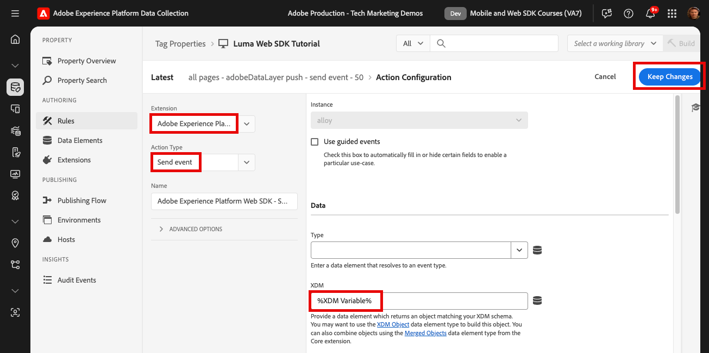
1. Seleziona **[!UICONTROL Salva]** per salvare la regola

   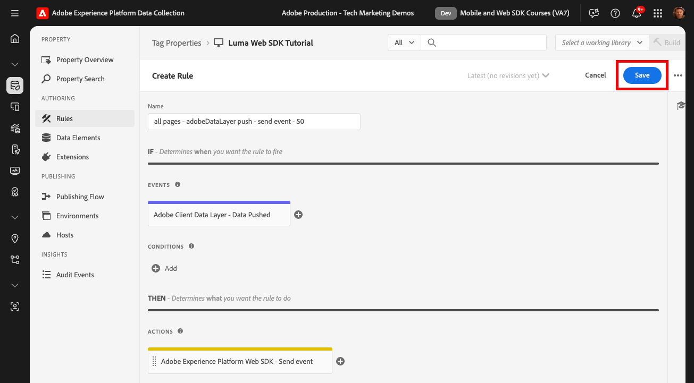

Nella proprietà dovrebbero essere presenti le seguenti regole:

    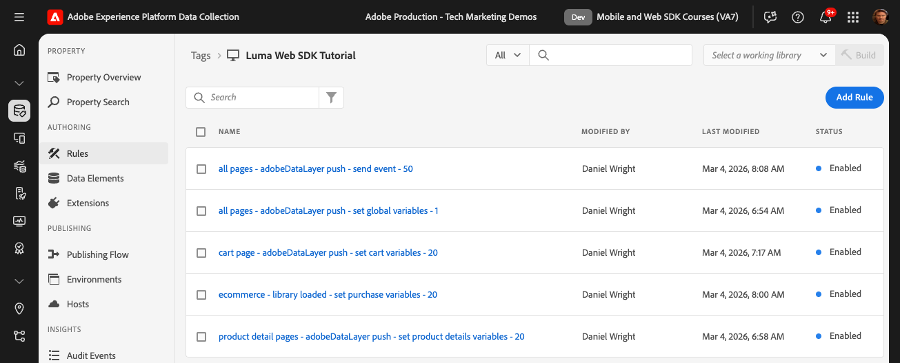

## Pubblicare le regole in una libreria

Successivamente, pubblica la regola nell&#39;ambiente di sviluppo in modo da poterne verificare il funzionamento.

Per creare una libreria:

1. Vai a **[!UICONTROL Flusso di pubblicazione]** nel menu di navigazione a sinistra

1. Seleziona **[!UICONTROL Aggiungi libreria]**

   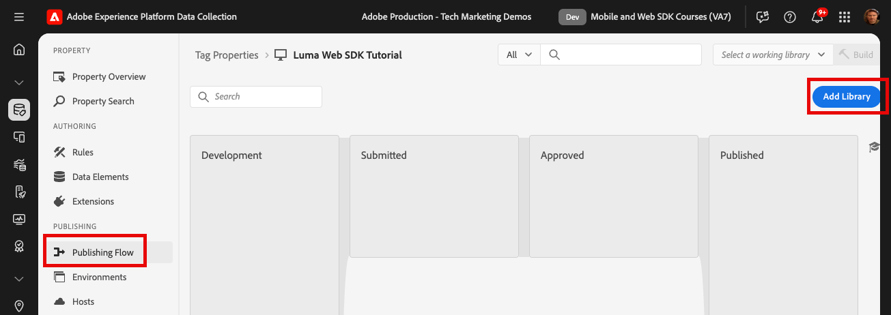
1. Per **[!UICONTROL Name]**, immetti `Luma Web SDK Tutorial`
1. Per l&#39;**[!UICONTROL ambiente]**, selezionare `Development`
1. Seleziona **[!UICONTROL Aggiungi tutte le risorse modificate]**

   >[!NOTE]
   >
   >    Dovresti visualizzare tutti i componenti tag creati nelle lezioni precedenti. L’estensione Core contiene il JavaScript di base richiesto da tutte le proprietà dei tag web.

1. Seleziona **[!UICONTROL Salva e genera per sviluppo]**

   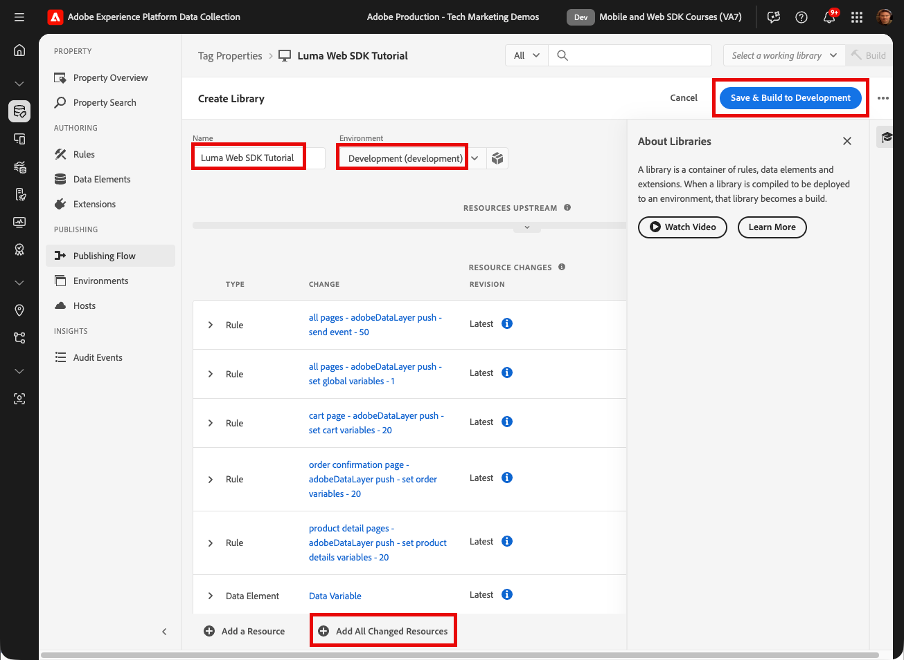

La creazione della libreria potrebbe richiedere alcuni minuti e al termine viene visualizzato un punto verde a sinistra del nome della libreria:

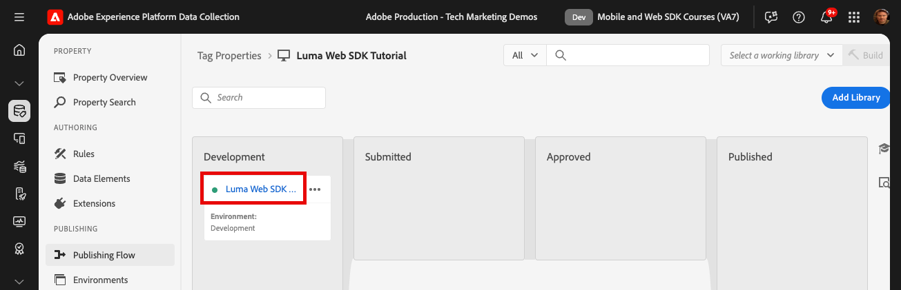

Come puoi vedere nella schermata [!UICONTROL Flusso di pubblicazione], il processo di pubblicazione richiede molto di più, il che va oltre l&#39;ambito di questa esercitazione. Questo tutorial utilizza una sola libreria nell’ambiente di sviluppo.

Ora puoi convalidare i dati nella richiesta utilizzando Adobe Experience Platform Debugger.

>[!NOTE]
>
>Grazie per aver dedicato tempo all&#39;apprendimento di Adobe Experience Platform Web SDK. Se hai domande, vuoi condividere commenti generali o suggerimenti su contenuti futuri, condividili in questo [post di discussione della community Experience League](https://experienceleaguecommunities.adobe.com/adobe-experience-platform-18/tutorial-discussion-implement-adobe-experience-cloud-with-web-sdk-tutorial-248848?profile.language=it)
