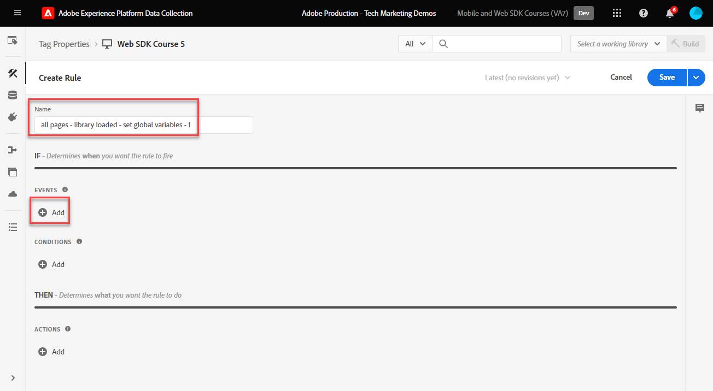
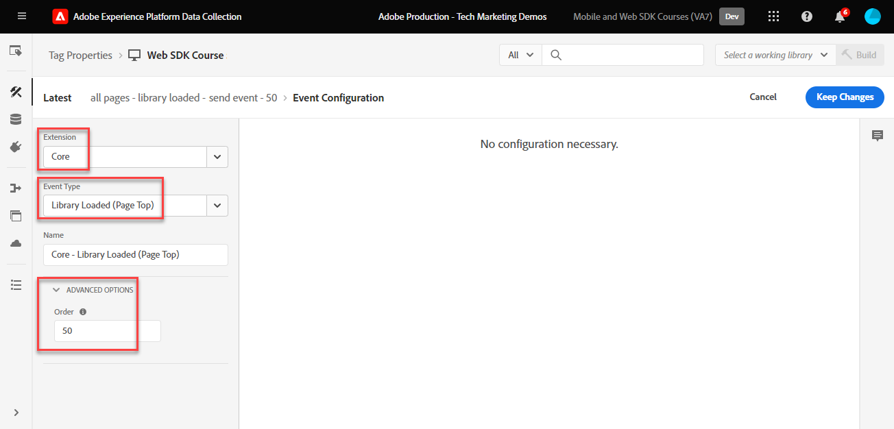

# Creare regole di tag

Scopri come inviare eventi all’Edge Network di Adobe Experience Platform con l’oggetto XDM utilizzando le regole di tag. Una regola di tag è una combinazione di eventi, condizioni e azioni che indica alla proprietà tag di eseguire un&#39;operazione. Con Platform Web SDK, le regole vengono utilizzate per inviare eventi a Platform Edge Network con i dati corretti.

## Obiettivi di apprendimento

Alla fine di questa lezione, sarai in grado di:

* Utilizza una convenzione di denominazione per gestire le regole all’interno dei tag
* Inviare un evento con campi XDM utilizzando le azioni Aggiorna variabile e Invia evento
* Sovrapponi più set di campi XDM in più regole
* Mappare singoli o interi elementi di dati array all’oggetto XDM
* Pubblicare una regola di tag in una libreria di sviluppo

## Prerequisiti

Conosci i tag di raccolta dati e il [sito di dimostrazione Luma](https://luma.enablementadobe.com/content/luma/us/en.html) e hai completato le lezioni precedenti nell’esercitazione:

* [Configurare uno schema XDM](configure-schemas.md)
* [Configurare uno spazio dei nomi delle identità](configure-identities.md)
* [Configurare uno stream di dati](configure-datastream.md)
* [Installare l’estensione Web SDK](install-web-sdk.md)
* [Creare elementi dati](create-data-elements.md)
* [Creare identità](create-identities.md)

## Convenzioni di denominazione

Per gestire le regole nei tag, si consiglia di seguire una convenzione di denominazione standard. Questa esercitazione utilizza una convenzione di denominazione in cinque parti:

* [**posizione**] - [**evento**] - [**scopo**] - [**ordine**]

dove;

1. **posizione** è la pagina o le pagine del sito in cui viene attivata la regola
1. **event** è il trigger per la regola
1. **scopo** è l&#39;azione principale eseguita dalla regola
1. **order** è l&#39;ordine in cui attivare la regola in relazione ad altre regole
<!-- minor update -->

## Creare regole di tag

Nei tag, le regole vengono utilizzate per eseguire azioni (chiamate di attivazione) in varie condizioni. L’estensione dei tag di Platform Web SDK include due azioni utilizzate in questa lezione:

* **[!UICONTROL Aggiorna variabile]** associa gli elementi dati alle proprietà in un oggetto XDM
* **[!UICONTROL Invia evento]** invia l&#39;oggetto XDM ad Experience Platform Edge Network

Nel resto di questa lezione:

1. Crea una regola con l&#39;azione **[!UICONTROL Aggiorna variabile]** per definire una &quot;configurazione globale&quot; dei campi XDM.

1. Crea regole aggiuntive con l&#39;azione **[!UICONTROL Aggiorna variabile]** che sostituiscono la &quot;configurazione globale&quot; e contribuiscono con campi XDM aggiuntivi in determinate condizioni (ad esempio, l&#39;aggiunta di dettagli prodotto nelle pagine dei prodotti).

1. Crea un&#39;altra regola con l&#39;azione **[!UICONTROL Invia evento]**, che invierà l&#39;oggetto XDM completo a Adobe Experience Platform Edge Network.

Tutte queste regole verranno sequenziate correttamente utilizzando l&#39;opzione &quot;[!UICONTROL order]&quot;.

Questo video offre una panoramica del processo:

>[!VIDEO](https://video.tv.adobe.com/v/3427710/?learn=on&enablevpops)

### Campi di configurazione globali

Per creare una regola di tag per i campi XDM globali:

1. Apri la proprietà tag utilizzata per questa esercitazione

1. Vai a **[!UICONTROL Regole]** nel menu di navigazione a sinistra

1. Seleziona il pulsante **[!UICONTROL Crea nuova regola]**

   

1. Denomina la regola `all pages - library loaded - set global variables - 1`

1. Nella sezione **[!UICONTROL Eventi]**, seleziona **[!UICONTROL Aggiungi]**

   

1. Utilizza l&#39;**[!UICONTROL Estensione core]** e seleziona **[!UICONTROL Libreria caricata (parte superiore della pagina)]** come **[!UICONTROL Tipo evento]**

1. Seleziona il menu a discesa **[!UICONTROL Avanzate]** e immetti `1` come **[!UICONTROL Ordine]**

   >[!NOTE]
   >
   > Minore è il numero d&#39;ordine, prima viene eseguito. Pertanto, alla nostra &quot;configurazione globale&quot; viene assegnato un numero d&#39;ordine basso.

1. Seleziona **[!UICONTROL Mantieni modifiche]** per tornare alla schermata della regola principale
   

1. Nella sezione **[!UICONTROL Azioni]**, seleziona **[!UICONTROL Aggiungi]**

1. Come **[!UICONTROL Estensione]**, seleziona **[!UICONTROL Adobe Experience Platform Web SDK]**

1. Come **[!UICONTROL Tipo azione]**, seleziona **[!UICONTROL Aggiorna variabile]**

1. Come **[!UICONTROL elemento dati]**, seleziona `xdm.variable.content` creato nella lezione [Creare elementi dati](create-data-elements.md)

   

Ora, mappa i [!UICONTROL elementi dati] con lo [!UICONTROL schema] utilizzato dall&#39;oggetto XDM. È possibile eseguire il mapping a singole proprietà o a interi oggetti. In questo esempio, esegui il mapping a singole proprietà:

1. Individuare il campo eventType e selezionarlo

1. Immettere il valore `web.webpagedetails.pageViews`

   >[!TIP]
   >
   > Per capire quali valori compilare nel campo `eventType`, è necessario passare alla pagina dello schema e selezionare il campo `eventType` per visualizzare i valori suggeriti nella barra a destra. Se necessario, puoi anche immettere un nuovo valore.
   > 

1. Individuare quindi l&#39;oggetto `identityMap` nello schema e selezionarlo

1. Mappa all&#39;elemento dati `identityMap.loginID`

   

   >[!TIP]
   >
   > I campi XDM non verranno inclusi nella richiesta di rete se l’elemento dati è nullo. Pertanto, quando l&#39;utente non è autenticato e l&#39;elemento dati `identityMap.loginID` è null, l&#39;oggetto `identityMap` non verrà inviato. Per questo possiamo definirla nella nostra &quot;configurazione globale&quot;.

1. Scorri verso il basso fino a raggiungere l&#39;oggetto **`web`**

1. Seleziona per aprirlo

1. Mappa i seguenti elementi dati alle corrispondenti `web` variabili XDM

   * Da **`web.webPageDetials.name`** a `%page.pageInfo.pageName%`
   * Da **`web.webPageDetials.server`** a `%page.pageInfo.server%`
   * Da **`web.webPageDetials.siteSection`** a `%page.pageInfo.hierarchie1%`

1. Imposta `web.webPageDetials.pageViews.value` su `1`.

   

   >[!TIP]
   >
   > Sebbene non sia necessario `eventType` impostato su `web.webpagedetails.pageViews` né `web.webPageDetails.pageViews.value` per consentire ad Adobe Analytics di elaborare un beacon come visualizzazione di pagina, è utile disporre di un modo standard per indicare una visualizzazione di pagina per altre applicazioni a valle.

1. Seleziona **[!UICONTROL Mantieni modifiche]**, quindi **[!UICONTROL Salva]** la regola nella schermata successiva per completare la creazione della regola

### Campi pagina prodotto

Ora, inizia a utilizzare **[!UICONTROL Aggiorna variabile]** in regole aggiuntive in sequenza per arricchire l&#39;oggetto XDM prima di inviarlo a [!UICONTROL Platform Edge Network].

>[!TIP]
>
>L&#39;ordine delle regole determina quale regola viene eseguita per prima quando viene attivato un evento. Se due regole hanno lo stesso tipo di evento, viene eseguito per primo quello con il numero più basso.
> 

Per iniziare, monitora le visualizzazioni del prodotto nella pagina dei dettagli del prodotto di Luma:

1. Seleziona **[!UICONTROL Aggiungi regola]**
1. Denomina [!UICONTROL `ecommerce - library loaded - set product details variables - 20`]
1. Seleziona il simbolo  in Evento per aggiungere un nuovo trigger
1. In **[!UICONTROL Estensione]**, seleziona **[!UICONTROL Core]**
1. In **[!UICONTROL Tipo evento]**, seleziona **[!UICONTROL Libreria caricata (parte superiore della pagina)]**
1. Seleziona per aprire **[!UICONTROL Opzioni avanzate]**, digita in `20`. Questo valore dell&#39;ordine assicura l&#39;esecuzione della regola _dopo_ di `all pages - library loaded - set global variables - 1` che imposta la configurazione globale.
1. Seleziona **[!UICONTROL Mantieni modifiche]**

   

1. In **[!UICONTROL Condizioni]**, seleziona **[!UICONTROL Aggiungi]**
1. Lascia **[!UICONTROL Tipo di logica]** come **[!UICONTROL Normale]**
1. Lascia **[!UICONTROL Estensione]** come **[!UICONTROL Core]**
1. Seleziona **[!UICONTROL Tipo condizione]** come **[!UICONTROL Percorso senza stringa di query]**
1. A destra, attiva **[!UICONTROL Regex]**
1. In **[!UICONTROL path è uguale a]** set `/products/`. Per il sito di dimostrazione Luma, assicura che la regola venga attivata solo sulle pagine dei prodotti
1. Seleziona **[!UICONTROL Mantieni modifiche]**

   

1. In **[!UICONTROL Azioni]** selezionare **[!UICONTROL Aggiungi]**
1. Seleziona estensione **[!UICONTROL Adobe Experience Platform Web SDK]**
1. Seleziona **[!UICONTROL Tipo azione]** come **[!UICONTROL Aggiorna variabile]**
1. Seleziona `xdm.variable.content` come **[!UICONTROL elemento dati]**
1. Scorri verso il basso fino all&#39;oggetto `commerce`
1. Apri l&#39;oggetto **[!UICONTROL productViews]** e imposta **[!UICONTROL value]** su `1`

   

   >[!TIP]
   >
   >L&#39;impostazione di commerce.productViews.value=1 in XDM viene mappata automaticamente all&#39;evento `prodView` in Analytics

1. Scorri verso il basso fino a `eventType` e impostalo su `commerce.productViews`

   >[!NOTE]
   >
   >Poiché questa regola ha un ordine più alto, sovrascriverà `eventType` impostato nella regola di &quot;configurazione globale&quot;. `eventType` può contenere un solo valore e si consiglia di impostarlo con l&#39;evento di maggior valore.

1. Scorri verso il basso fino a e seleziona `productListItems` array
1. Seleziona **[!UICONTROL Fornisci singoli elementi]**
1. Seleziona **[!UICONTROL Aggiungi elemento]**

   

   >[!CAUTION]
   >
   >**`productListItems`** è un tipo di dati `array` e prevede che i dati vengano inseriti come raccolta di elementi. A causa della struttura del livello dati del sito di dimostrazione Luma e poiché è possibile visualizzare un solo prodotto alla volta sul sito Luma, puoi aggiungere elementi singolarmente. Quando implementi sul tuo sito web, a seconda della struttura del livello dati, potresti essere in grado di fornire un intero array.

1. Seleziona per aprire **[!UICONTROL Elemento 1]**
1. Mappa **`productListItems.item1.SKU`** a `%product.productInfo.sku%`

   

1. Seleziona **[!UICONTROL Mantieni modifiche]**

1. Seleziona **[!UICONTROL Salva]** per salvare la regola

### Campi carrello

Puoi mappare l’intero array a un oggetto XDM, purché l’array corrisponda al formato dello schema XDM. L’elemento dati del codice personalizzato `cart.productInfo` creato in precedenza esegue un ciclo nell’oggetto livello dati `digitalData.cart.cartEntries` su Luma e lo traduce nel formato richiesto dell’oggetto `productListItems` dello schema XDM.

Per illustrare, consulta il confronto seguente del livello dati del sito Luma (a sinistra) con l’elemento dati tradotto (a destra):

Confrontare l&#39;elemento dati con la struttura `productListItems` (suggerimento, dovrebbe corrispondere).

>[!IMPORTANT]
>
>Si noti come le variabili numeriche vengono convertite, con valori stringa nel livello dati come `price` e `qty` riformattati in numeri nell&#39;elemento dati. Questi requisiti di formato sono importanti per l&#39;integrità dei dati in Platform e vengono determinati durante il passaggio [configura schemi](configure-schemas.md). Nell&#39;esempio, **[!UICONTROL quantity]** utilizza il tipo di dati **[!UICONTROL Integer]**.
>> 

Ora associamo il nostro array all’oggetto XDM:

1. Crea una nuova regola denominata `ecommerce - library loaded - set shopping cart variables - 20`
1. Seleziona il simbolo  in Evento per aggiungere un nuovo trigger
1. In **[!UICONTROL Estensione]**, seleziona **[!UICONTROL Core]**
1. In **[!UICONTROL Tipo evento]**, seleziona **[!UICONTROL Libreria caricata (parte superiore della pagina)]**
1. Seleziona per aprire **[!UICONTROL Opzioni avanzate]**, digita in `20`
1. Seleziona **[!UICONTROL Mantieni modifiche]**

   

1. In **[!UICONTROL Condizioni]**, seleziona **[!UICONTROL Aggiungi]**
1. Lascia **[!UICONTROL Tipo di logica]** come **[!UICONTROL Normale]**
1. Lascia **[!UICONTROL Estensioni]** come **[!UICONTROL Core]**
1. Seleziona **[!UICONTROL Tipo condizione]** come **[!UICONTROL Percorso senza stringa di query]**
1. A destra, **do not** abilita l&#39;interruttore **[!UICONTROL Regex]**
1. In **[!UICONTROL path è uguale a]** set `/content/luma/us/en/user/cart.html`. Per il sito di dimostrazione Luma, assicura che la regola venga attivata solo sulla pagina del carrello
1. Seleziona **[!UICONTROL Mantieni modifiche]**

   

1. In **[!UICONTROL Azioni]** selezionare **[!UICONTROL Aggiungi]**
1. Seleziona estensione **[!UICONTROL Adobe Experience Platform Web SDK]**
1. Seleziona **[!UICONTROL Tipo azione]** come **[!UICONTROL Aggiorna variabile]**
1. Seleziona `xdm.variable.content` come **[!UICONTROL elemento dati]**
1. Scorrere verso il basso fino all&#39;oggetto `commerce` e selezionare per aprirlo.
1. Apri l&#39;oggetto **[!UICONTROL productListViews]** e imposta **[!UICONTROL value]** su `1`

   

   >[!TIP]
   >
   >L&#39;impostazione di commerce.productListViews.value=1 in XDM viene mappata automaticamente all&#39;evento `scView` in Analytics

1. Seleziona `eventType` e imposta su `commerce.productListViews`

1. Scorri verso il basso fino a e seleziona l&#39;array **[!UICONTROL productListItems]**

1. Seleziona **[!UICONTROL Fornisci intero array]**

1. Mappa a **`cart.productInfo`** elemento dati

1. Seleziona **[!UICONTROL Mantieni modifiche]**

1. Seleziona **[!UICONTROL Salva]** per salvare la regola

Crea altre due regole per il pagamento e l’acquisto seguendo lo stesso pattern con le seguenti differenze:

**Nome regola**: `ecommerce  - library loaded - set checkout variables - 20`

1. **[!UICONTROL Condizione]**: /content/luma/us/en/user/checkout.html
1. Imposta `eventType` su `commerce.checkouts`.
1. Imposta `commerce.checkout.value` su `1`.

   >[!TIP]
   >
   >Equivale a impostare l&#39;evento `scCheckout` in Analytics

**Nome regola**: `ecommerce - library loaded - set purchase variables -  20`

1. **[!UICONTROL Condizione]**: /content/luma/us/en/user/checkout/order/thank-you.html
1. Imposta `eventType` su `commerce.purchases`.
1. Imposta `commerce.purchases.value` su `1`.

   >[!TIP]
   >
   >Equivale a impostare l&#39;evento `purchase` in Analytics

1. Imposta `commerce.order.purchaseID` sull&#39;elemento dati `cart.orderId`
1. Imposta `commerce.order.currencyCode` sul valore hardcoded `USD`

   

   >[!TIP]
   >
   >Equivale a impostare le variabili `s.purchaseID` e `s.currencyCode` in Analytics

1. Scorri verso il basso fino a e seleziona l&#39;array **[!UICONTROL productListItems]**
1. Seleziona **[!UICONTROL Fornisci intero array]**
1. Mappa a **`cart.productInfo.purchase`** elemento dati
1. Seleziona **[!UICONTROL Mantieni modifiche]**
1. Seleziona **[!UICONTROL Salva]**

Al termine dell’operazione, dovresti vedere che sono state create le seguenti regole.

### Invia regola evento

Dopo aver impostato le variabili, puoi creare la regola per inviare l&#39;oggetto XDM completo a Platform Edge Network con l&#39;azione **[!UICONTROL Invia evento]**.

1. A destra, seleziona **[!UICONTROL Aggiungi regola]** per creare un&#39;altra regola

1. Denomina la regola `all pages - library loaded - send event - 50`

1. Nella sezione **[!UICONTROL Eventi]**, seleziona **[!UICONTROL Aggiungi]**

1. Utilizza l&#39;estensione **[!UICONTROL Core]** e seleziona `Library Loaded (Page Top)` come **[!UICONTROL Tipo evento]**

1. Seleziona il menu a discesa **[!UICONTROL Avanzate]** e immetti `50` in **[!UICONTROL Ordine]**. Questa regola verrà attivata dopo tutte le altre regole configurate (che avevano `1` o `20` come [!UICONTROL Ordine]).

1. Seleziona **[!UICONTROL Mantieni modifiche]** per tornare alla schermata della regola principale
   

1. Nella sezione **[!UICONTROL Azioni]**, seleziona **[!UICONTROL Aggiungi]**

1. Come **[!UICONTROL Estensione]**, seleziona **[!UICONTROL Adobe Experience Platform Web SDK]**

1. Come **[!UICONTROL Tipo azione]**, seleziona **[!UICONTROL Invia evento]**

1. Come **[!UICONTROL XDM]**, seleziona l&#39;elemento dati `xdm.variable.content` creato nella lezione precedente

1. Seleziona **[!UICONTROL Mantieni modifiche]** per tornare alla schermata della regola principale

   
1. Seleziona **[!UICONTROL Salva]** per salvare la regola

   

## Pubblicare le regole in una libreria

Successivamente, pubblica la regola nell&#39;ambiente di sviluppo in modo da poterne verificare il funzionamento.

Per creare una libreria:

1. Vai a **[!UICONTROL Flusso di pubblicazione]** nel menu di navigazione a sinistra

1. Seleziona **[!UICONTROL Aggiungi libreria]**

   
1. Per **[!UICONTROL Name]**, immetti `Luma Web SDK Tutorial`
1. Per l&#39;**[!UICONTROL ambiente]**, selezionare `Development`
1. Seleziona **[!UICONTROL Aggiungi tutte le risorse modificate]**

   >[!NOTE]
   >
   >    Dovresti visualizzare tutti i componenti tag creati nelle lezioni precedenti. L’estensione Core contiene il JavaScript di base richiesto da tutte le proprietà dei tag web.

1. Seleziona **[!UICONTROL Salva e genera per sviluppo]**

   

La creazione della libreria potrebbe richiedere alcuni minuti e al termine viene visualizzato un punto verde a sinistra del nome della libreria:

Come puoi vedere nella schermata [!UICONTROL Flusso di pubblicazione], il processo di pubblicazione richiede molto di più, il che va oltre l&#39;ambito di questa esercitazione. Questo tutorial utilizza una sola libreria nell’ambiente di sviluppo.

Ora puoi convalidare i dati nella richiesta utilizzando Adobe Experience Platform Debugger.

>[!NOTE]
>
>Grazie per aver dedicato tempo all&#39;apprendimento di Adobe Experience Platform Web SDK. Se hai domande, vuoi condividere commenti generali o suggerimenti su contenuti futuri, condividili in questo [post di discussione della community Experience League](https://experienceleaguecommunities.adobe.com/t5/adobe-experience-platform-data/tutorial-discussion-implement-adobe-experience-cloud-with-web/td-p/444996)
