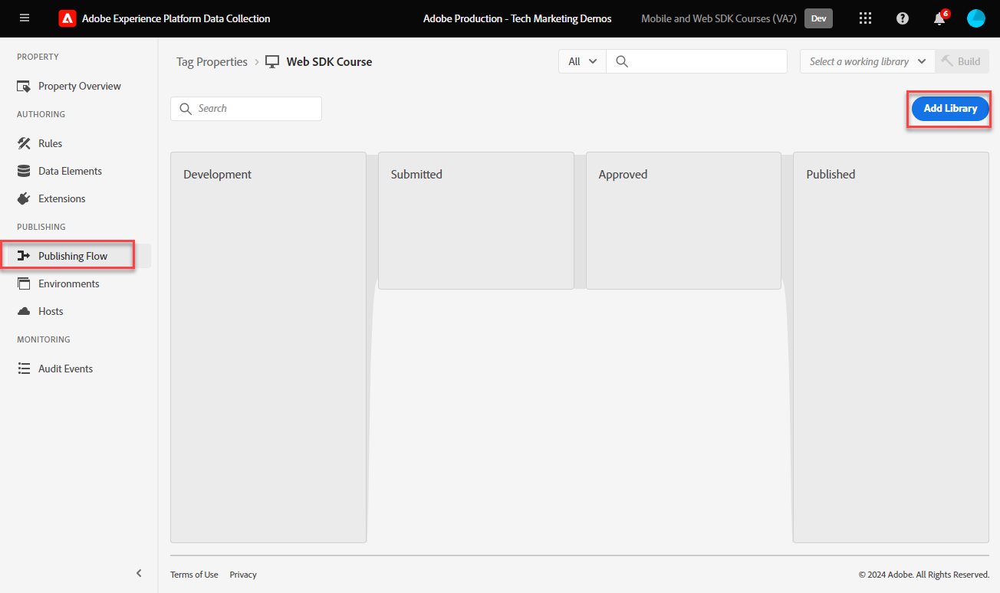

# Creare una regola di tag

Scopri come inviare un evento a Platform Edge Network con il tuo oggetto XDM utilizzando una regola di tag. Una regola di tag è una combinazione di eventi, condizioni e azioni che indica alla proprietà tag di eseguire un&#39;operazione.

>[!NOTE]
>
> A scopo dimostrativo, gli esercizi di questa lezione si basano sull’esempio utilizzato durante la [Creare elementi dati](create-data-elements.md) passaggio; invio di un’azione evento XDM per acquisire contenuto e identità dagli utenti sul [Sito di dimostrazione Luma](https://luma.enablementadobe.com/content/luma/us/en.html).

## Finalità di apprendimento

Alla fine di questa lezione, potrai:

* Utilizza una convenzione di denominazione per gestire le regole all’interno dei tag
* Creare una regola di tag per inviare un evento XDM
* Pubblicare una regola di tag in una libreria di sviluppo

## Prerequisiti

Conosci i tag di raccolta dati e la [Sito di dimostrazione Luma](https://luma.enablementadobe.com/content/luma/us/en.html), e aver completato le seguenti lezioni precedenti nell’esercitazione:

* [Configurare le autorizzazioni](configure-permissions.md)
* [Configurare uno schema XDM](configure-schemas.md)
* [Configurare uno spazio dei nomi delle identità](configure-identities.md)
* [Configurare uno stream di dati](configure-datastream.md)
* [Estensione Web SDK installata nella proprietà tag](install-web-sdk.md)
* [Creare elementi dati](create-data-elements.md)

## Convenzioni di denominazione

Per gestire meglio le regole nei tag, si consiglia di seguire una convenzione di denominazione standard. Questa esercitazione utilizza una convenzione di denominazione in tre parti:

* [posizione] - [evento] - [strumento]

Dove;

1. posizione è la pagina o le pagine del sito in cui viene attivata la regola
1. è il trigger che attiva il beacon
1. strumento è l&#39;applicazione o le applicazioni specifiche utilizzate nel passaggio di azione per tale regola

## Crea regola di tag

Nei tag, le regole vengono utilizzate per eseguire azioni (chiamate di attivazione) in varie condizioni. Questa prima regola verrà utilizzata per inviare l’oggetto XDM alla rete Edge utilizzando l’SDK per web [!UICONTROL Invia evento] azione. Più avanti in questo tutorial, invierai diverse versioni dell’oggetto XDM in base al tipo di pagina su cui si trova il visitatore. Per questo motivo, utilizzerai le condizioni della regola per escludere questi altri tipi di pagine.

Per creare una regola di tag:

1. Apri la proprietà tag utilizzata per questa esercitazione
1. Vai a **[!UICONTROL Regole]** nel menu di navigazione a sinistra
1. Seleziona la **[!UICONTROL Crea nuova regola]** pulsante
   
1. Denomina la regola `all pages - library load - AA & AT`

   >[!NOTE]
   >
   > Questa regola viene utilizzata in modo specifico da Adobe Analytics e Target in una lezione futura, ed è per questo che `AA & AT` viene utilizzato alla fine del nome.

1. In **[!UICONTROL Eventi]** sezione, seleziona **[!UICONTROL Aggiungi]**
   
1. Utilizza il **[!UICONTROL Estensione core]** e seleziona `Library Loaded (Page Top)` come **[!UICONTROL Tipo di evento]**.

   Questa impostazione indica che la regola viene attivata ogni volta che la libreria di tag viene caricata su una pagina.
1. Seleziona **[!UICONTROL Mantieni modifiche]** per tornare alla schermata principale delle regole
   
1. In **[!UICONTROL Condizioni]** , seleziona la sezione **[!UICONTROL Aggiungi]** pulsante
   
1. Seleziona **[!UICONTROL Tipo di logica]** `Exception`, **[!UICONTROL Estensione]** `Core`, e **[!UICONTROL Tipo di condizione]** `Path Without Query String`
1. Immetti il percorso dell&#39;URL `/content/luma/us/en/user/cart.html` nel **[!UICONTROL path è uguale a]** campo e **[!UICONTROL nome]** it `Core - cart page`
1. Seleziona **[!UICONTROL Mantieni modifiche]**
   
1. Aggiungi altre tre eccezioni per i seguenti percorsi URL

   * **`Core - checkout page`** per `/content/luma/us/en/user/checkout.html`
   * **`Core - thank you page`** per `/content/luma/us/en/user/checkout/order/thank-you.html`
   * **`Core - product page`** per `/products/` con l&#39;interruttore Regex attivato

   

1. In **[!UICONTROL Azioni]** sezione, seleziona **[!UICONTROL Aggiungi]**
1. Seleziona **[!UICONTROL Adobe Experience Platform Web SDK]** come **[!UICONTROL Estensione]**
1. Seleziona **[!UICONTROL Invia evento]** come **[!UICONTROL Tipo di azione]**
1. Seleziona **[!UICONTROL web.webpagedetails.pageViews]** come **[!UICONTROL Tipo]**.

   >[!WARNING]
   >
   > Questo menu a discesa popola **`xdm.eventType`** variabile nell’oggetto XDM. Anche se è possibile digitare etichette in formato libero in questo campo, si consiglia di **non** in quanto avrà effetti negativi con Platform.

1. Come **[!UICONTROL Dati XDM]**, seleziona la `xdm.content` elemento dati creato nella lezione precedente
1. Seleziona **[!UICONTROL Mantieni modifiche]** per tornare alla schermata principale delle regole

   
1. Seleziona **[!UICONTROL Salva]** per salvare la regola

   

## Pubblicare la regola in una libreria

Successivamente, pubblica la regola nel tuo ambiente di sviluppo in modo da poterne verificare il funzionamento.

Per creare una libreria:

1. Vai a **[!UICONTROL Flusso di pubblicazione]** nel menu di navigazione a sinistra
1. Seleziona **[!UICONTROL Aggiungi libreria]**

   
1. Per **[!UICONTROL Nome]**, immetti `Luma Web SDK Tutorial`
1. Per **[!UICONTROL Ambiente]**, seleziona `Development`
1. Seleziona  **[!UICONTROL Aggiungi tutte le risorse modificate]**

   >[!NOTE]
   >
   >    Oltre all’estensione Adobe Experience Platform Web SDK e al `all pages - library load - AA & AT` regola, vedrai i componenti tag creati nelle lezioni precedenti. L’estensione Core contiene il JavaScript di base richiesto da tutte le proprietà dei tag web.

1. Seleziona **[!UICONTROL Salva e genera per sviluppo]**

   

La creazione della libreria potrebbe richiedere alcuni minuti e al termine viene visualizzato un punto verde a sinistra del nome della libreria:

Come è possibile vedere sul [!UICONTROL Flusso di pubblicazione] , il processo di pubblicazione richiede molto di più, il che va oltre l’ambito di questa esercitazione. Questo tutorial utilizza una sola libreria nell’ambiente di sviluppo.

Ora puoi convalidare i dati nella richiesta utilizzando l’Adobe Experience Platform Debugger.

[Successivo ](validate-with-debugger.md)

>[!NOTE]
>
>Grazie per aver dedicato il tuo tempo all’apprendimento di Adobe Experience Platform Web SDK. Se hai domande, vuoi condividere feedback generali o suggerimenti su contenuti futuri, condividili su questo [Experience League post di discussione community](https://experienceleaguecommunities.adobe.com/t5/adobe-experience-platform-launch/tutorial-discussion-implement-adobe-experience-cloud-with-web/td-p/444996)
