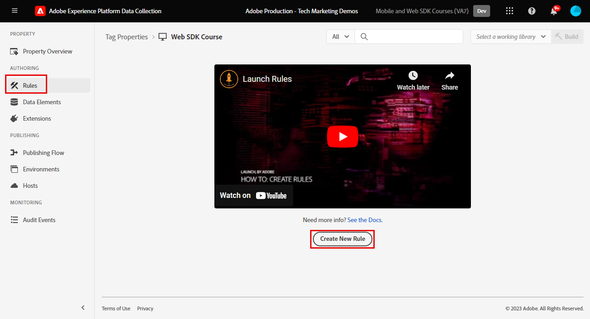

# Creare una regola di tag

Scopri come inviare un evento a Platform Edge Network con il tuo oggetto XDM utilizzando una regola di tag. Una regola di tag è una combinazione di eventi, condizioni e azioni che indica alla proprietà tag di eseguire un’operazione.

>[!NOTE]
>
> A scopo dimostrativo, gli esercizi contenuti in questa lezione si basano sull’esempio utilizzato durante il [Creare elementi dati](create-data-elements.md) passo; invio di un’azione evento XDM per acquisire contenuti e identità dagli utenti sul [Sito dimostrativo Luma](https://luma.enablementadobe.com/content/luma/us/en.html).

## Finalità di apprendimento

Alla fine di questa lezione, potrai:

* Utilizzare una convenzione di denominazione per gestire le regole all’interno dei tag
* Creare una regola di tag per inviare un evento XDM
* Pubblicare una regola di tag in una libreria di sviluppo

## Prerequisiti

Hai familiarità con i tag di raccolta dati e con [Sito dimostrativo Luma](https://luma.enablementadobe.com/content/luma/us/en.html)e devi aver completato le seguenti lezioni precedenti nell’esercitazione:

* [Configurare le autorizzazioni](configure-permissions.md)
* [Configurare uno schema XDM](configure-schemas.md)
* [Configurare uno spazio dei nomi di identità](configure-identities.md)
* [Configurare un datastream](configure-datastream.md)
* [Estensione SDK per web installata nella proprietà tag](install-web-sdk.md)
* [Creare elementi dati](create-data-elements.md)

## Convenzioni di denominazione

Per gestire meglio le regole nei tag, si consiglia di seguire una convenzione di denominazione standard. Questa esercitazione utilizza una convenzione di denominazione in tre parti:

* [posizione] - [event] - [strumento]

Dove;

1. posizione è la pagina o le pagine del sito in cui la regola si attiva
1. l&#39;evento è il trigger che attiva il beacon
1. strumento è l&#39;applicazione o le applicazioni specifiche utilizzate nella fase dell&#39;azione per quella regola

## Creare una regola di tag

Nei tag , le regole vengono utilizzate per eseguire azioni (chiamate di attivazione) in varie condizioni. Questa prima regola verrà utilizzata per inviare l’oggetto XDM alla rete Edge utilizzando gli SDK per web [!UICONTROL Invia evento] azione. Successivamente in questa esercitazione, invierai diverse versioni dell&#39;oggetto XDM in base al tipo di pagina su cui si trova il visitatore. Per questo motivo, utilizzerai le condizioni della regola per escludere gli altri tipi di pagine.

Per creare una regola di tag:

1. Apri la proprietà tag utilizzata per questa esercitazione.
1. Vai a **[!UICONTROL Regole]** nella navigazione a sinistra
1. Seleziona la **[!UICONTROL Crea nuova regola]** pulsante
   
1. Denomina la regola `all pages - library load - AA & AT`

   >[!NOTE]
   >
   > Questa regola viene utilizzata in modo specifico da Adobe Analytics e Target in una lezione futura, ed è per questo che `AA & AT` viene utilizzato alla fine del nome.

1. In **[!UICONTROL Eventi]** sezione , seleziona **[!UICONTROL Aggiungi]**

   
1. Utilizza la **[!UICONTROL Estensione core]** e seleziona `Library Loaded (Page Top)` come **[!UICONTROL Tipo evento]**.

   Questa impostazione significa che la regola si attiva ogni volta che la libreria di tag viene caricata su una pagina.
1. Seleziona **[!UICONTROL Mantieni modifiche]** per tornare alla schermata della regola principale
   
1. In **[!UICONTROL Condizioni]** seleziona la sezione **[!UICONTROL Aggiungi]** pulsante
   
1. Seleziona **[!UICONTROL Tipo di logica]** `Exception`, **[!UICONTROL Estensione]** `Core`e **[!UICONTROL Tipo di condizione]** `Path Without Query String`
1. Immettere il percorso URL `/content/luma/us/en/user/cart.html` in **[!UICONTROL path è uguale a]** campo e **[!UICONTROL name]** it `Core - cart page`
1. Seleziona **[!UICONTROL Mantieni modifiche]**

   
1. Aggiungi altre tre eccezioni per i seguenti percorsi URL

   * **`Core - checkout page`** per `/content/luma/us/en/user/checkout.html`
   * **`Core - thank you page`** per `/content/luma/us/en/user/checkout/order/thank-you.html`
   * **`Core - product page`** per `/products/` con l&#39;interruttore Regex attivato

   

1. In **[!UICONTROL Azioni]** sezione , seleziona **[!UICONTROL Aggiungi]**
1. Seleziona **[!UICONTROL Adobe Experience Platform Web SDK]** come **[!UICONTROL Estensione]**
1. Seleziona **[!UICONTROL Invia evento]** come **[!UICONTROL Tipo di azione]**
1. Seleziona **[!UICONTROL web.webpagedetails.pageViews]** come **[!UICONTROL Tipo]**.

   >[!WARNING]
   >
   > Questo menu a discesa popola il **`xdm.eventType`** nell&#39;oggetto XDM. Anche se in questo campo è possibile digitare etichette in formato libero, si consiglia vivamente di **non** poiché avrà effetti avversi con Platform.

1. Come **[!UICONTROL Dati XDM]**, seleziona `xdm.content` elemento dati creato nella lezione precedente
1. Seleziona **[!UICONTROL Mantieni modifiche]** per tornare alla schermata della regola principale

   
1. Seleziona **[!UICONTROL Salva]** per salvare la regola

   

## Pubblicare la regola in una libreria

Quindi, pubblica la regola nel tuo ambiente di sviluppo in modo che possiamo verificare che funzioni.

Per creare una libreria:

1. Vai a **[!UICONTROL Flusso di pubblicazione]** nella navigazione a sinistra
1. Seleziona **[!UICONTROL Aggiungi libreria]**

   
1. Per **[!UICONTROL Nome]**, inserisci `Luma Web SDK Tutorial`
1. Per **[!UICONTROL Ambiente]**, seleziona `Development`
1. Seleziona  **[!UICONTROL Aggiungi tutte le risorse modificate]**

   >[!NOTE]
   >
   >    Oltre all&#39;estensione Adobe Experience Platform Web SDK e alle `all pages - library load - AA & AT` , vedrai i componenti tag creati nelle lezioni precedenti. L&#39;estensione Core contiene il JavaScript di base richiesto da tutte le proprietà dei tag web.

1. Seleziona **[!UICONTROL Salva e genera per sviluppo]**

   

La libreria potrebbe richiedere alcuni minuti per la creazione e, una volta completata, visualizza un punto verde a sinistra del nome della libreria:

Come puoi vedere sul [!UICONTROL Flusso di pubblicazione] Il processo di pubblicazione è molto più ampio rispetto all’ambito di questa esercitazione. Questa esercitazione utilizza solo una singola libreria nell&#39;ambiente di sviluppo.

Ora puoi convalidare i dati nella richiesta utilizzando Adobe Experience Platform Debugger.

[Successivo ](validate-with-debugger.md)

>[!NOTE]
>
>Grazie per aver investito il tuo tempo nel conoscere Adobe Experience Platform Web SDK. In caso di domande, se desideri condividere feedback generali o se hai suggerimenti su contenuti futuri, condividi questi su questo [Experience League Articolo di discussione della Comunità](https://experienceleaguecommunities.adobe.com/t5/adobe-experience-platform-launch/tutorial-discussion-implement-adobe-experience-cloud-with-web/td-p/444996)
