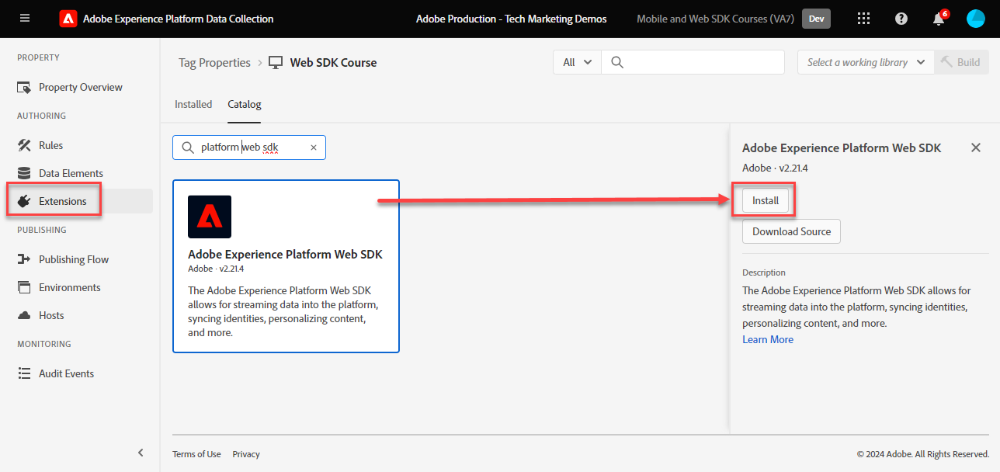

# Installare l&#39;estensione tag Adobe Experience Platform Web SDK

Scopri come installare e configurare l’estensione tag Adobe Experience Platform Web SDK. Il modo più semplice per implementare Web SDK consiste nell’utilizzare i tag di Adobe Manager (precedentemente noti come Launch). L&#39;estensione tag di Platform Web SDK è l&#39;_unica estensione tag_ necessaria per inviare dati a _tutte le applicazioni Adobe Experience Cloud_, incluse [Analytics](setup-analytics.md), [Target](setup-target.md), [Audience Manager](setup-audience-manager.md), Real-Time Customer Data Platform e [Journey Optimizer](setup-web-channel.md).

>[!WARNING]
>
> Il sito web Luma utilizzato in questa esercitazione dovrebbe essere sostituito durante la settimana del 16 febbraio 2026. Il lavoro svolto come parte di questo tutorial potrebbe non essere applicabile al nuovo sito web.

## Obiettivi di apprendimento

Alla fine di questa lezione, potrai:

* Creare una proprietà tag nell’interfaccia di Data Collection
* Installare l’estensione tag Platform Web SDK
* Mappa lo stream di dati creato in precedenza sull’estensione

## Prerequisiti

Devi aver completato le lezioni precedenti in questa esercitazione:

* [Configurare uno stream di dati](configure-datastream.md)

### Aggiungi una proprietà tag

Innanzitutto devi avere una proprietà tag. Una proprietà è un contenitore per tutte le JavaScript, le regole e le altre funzioni necessarie per raccogliere i dettagli da una pagina web e inviarli a varie posizioni.

Crea una nuova proprietà tag per l’esercitazione:

1. Apri l&#39;interfaccia di [Data Collection](https://experience.adobe.com/data-collection/){target="_blank"}
1. Seleziona **[!UICONTROL Tag]** nel menu di navigazione a sinistra
1. Seleziona il pulsante **[!UICONTROL Nuova proprietà]**
   
1. Come **[!UICONTROL Nome]**, immetti `Web SDK Course` (aggiungi il tuo nome alla fine, se più persone della tua azienda stanno seguendo questa esercitazione)
1. Come **[!UICONTROL Domini]**, immetti `enablementadobe.com` (spiegato più tardi)
1. Seleziona **[!UICONTROL Salva]**
   

## Aggiungere l&#39;estensione Web SDK

Con la creazione dello schema XDM, dello stream di dati e della proprietà tag, puoi installare l’estensione Platform Web SDK:

1. Apri la nuova proprietà tag
1. Vai a **[!UICONTROL Estensioni]** > **[!UICONTROL Catalogo]**
1. Cerca `Adobe Experience Platform Web SDK`
1. Seleziona **[!UICONTROL Installa]**

   

## Collegare l’estensione allo stream di dati

Lascia la maggior parte delle impostazioni predefinite e aggiornale in un secondo momento, in base alle esigenze. L’unica cosa da fare ora è collegare l’estensione allo stream di dati:

1. In **[!UICONTROL Datastreams]**, seleziona il metodo di input **[!UICONTROL Scegli dall&#39;elenco]**
1. Seleziona la sandbox in cui hai creato lo schema, lo spazio dei nomi delle identità e lo stream di dati
1. Seleziona lo stream di dati creato in precedenza, `Luma Web SDK`
1. Seleziona **[!UICONTROL Salva]**

   >[!NOTE]
   >
   > Se non riesci a trovare lo stream di dati, vai alla lezione [Configurare uno stream di dati](configure-datastream.md) e segui i passaggi per crearne uno

   

Per ulteriori informazioni su ciascuna sezione dell&#39;estensione, vedere [Configurare l&#39;estensione Adobe Experience Platform Web SDK](https://experienceleague.adobe.com/en/docs/experience-platform/tags/extensions/client/web-sdk/web-sdk-extension-configuration).

>[!NOTE]
>
>Sebbene in questa lezione non sia stato configurato un CNAME nell&#39;impostazione del [!UICONTROL dominio Edge], Adobe consiglia di utilizzare un CNAME quando si implementa Platform Web SDK sul proprio sito Web. Nonostante un’implementazione CNAME non offra vantaggi in termini di durata dei cookie, potrebbero esserci altri vantaggi. Questi vantaggi includono ad blocker e browser meno comuni che impediscono l’invio dei dati a domini classificati come tracciatori. In questi casi, l’utilizzo di un CNAME potrebbe agevolare la raccolta di dati relativi agli utenti che utilizzano tali strumenti.

>[!NOTE]
>
>Durante questa esercitazione, puoi configurare un solo stream di dati e associarlo a tutti gli ambienti di tag (sviluppo, stage e produzione). Quando implementi Platform Web SDK sul tuo sito web, devi configurare un flusso di dati separato per ogni ambiente e mapparlo di conseguenza nella configurazione dell’estensione.

Dopo aver installato Platform Web SDK e averlo associato allo stream di dati, è possibile iniziare a raccogliere i dati.

>[!NOTE]
>
>Grazie per aver dedicato tempo all&#39;apprendimento di Adobe Experience Platform Web SDK. Se hai domande, vuoi condividere commenti generali o suggerimenti su contenuti futuri, condividili in questo [post di discussione della community Experience League](https://experienceleaguecommunities.adobe.com/t5/adobe-experience-platform-data/tutorial-discussion-implement-adobe-experience-cloud-with-web/td-p/444996)
