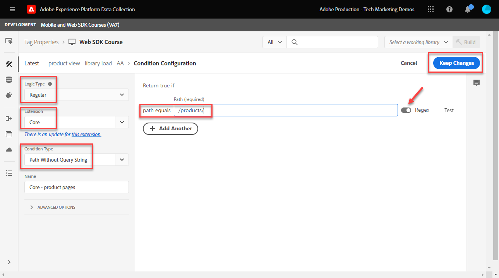

# Configurare Adobe Analytics con Platform Web SDK

Scopri come configurare Adobe Analytics utilizzando [Experienci Platform Web SDK](https://experienceleague.adobe.com/docs/platform-learn/data-collection/web-sdk/overview.html), crea regole di tag per inviare dati ad Adobe Analytics e verifica che Analytics stia acquisendo i dati come previsto.

[Adobe Analytics](https://experienceleague.adobe.com/docs/analytics.html?lang=it) è un&#39;applicazione leader di settore che ti consente di comprendere i tuoi clienti come persone e gestire la tua attività grazie alle informazioni sul cliente.

## Finalità di apprendimento

Alla fine di questa lezione, potrai:

* Configura uno schema XDM per Adobe Analytics e scopri la differenza tra le variabili XDM mappate automaticamente e manualmente per Analytics
* Configurare uno stream di dati per abilitare Adobe Analytics
* Mappare singoli o interi elementi di dati array all’oggetto XDM
* Acquisire le visualizzazioni di pagina in Adobe Analytics con l’oggetto XDM
* Acquisire dati di e-commerce con l’oggetto XDM per la stringa di prodotto Adobe Analytics
* Convalidare le variabili Adobe Analytics impostate con l’oggetto XDM utilizzando Experienci Platform Debugger
* Utilizzare le regole di elaborazione di Adobe Analytics per impostare variabili personalizzate
* Convalidare i dati acquisiti da Adobe Analytics utilizzando i rapporti in tempo reale

## Prerequisiti

Conosci tag, Adobe Analytics e [Sito di dimostrazione Luma](https://luma.enablementadobe.com/content/luma/us/en.html){target="_blank"} funzionalità di login e shopping.

È necessario almeno un ID suite per report test/dev. Se non hai una suite per report test/dev che puoi usare per questa esercitazione, [creane uno](https://experienceleague.adobe.com/docs/analytics/admin/manage-report-suites/new-report-suite/t-create-a-report-suite.html).

Devi aver completato tutti i passaggi delle sezioni precedenti nell’esercitazione:

* Configurazione iniziale
   * [Configurare le autorizzazioni](configure-permissions.md)
   * [Configurare uno schema XDM](configure-schemas.md)
   * [Configurare uno spazio dei nomi delle identità](configure-identities.md)
   * [Configurare uno stream di dati](configure-datastream.md)
* Configurazione tag
   * [Installare l’estensione Web SDK](install-web-sdk.md)
   * [Creare elementi dati](create-data-elements.md)
   * [Creare una regola di tag](create-tag-rule.md)
   * [Convalida con Adobe Experience Platform Debugger](validate-with-debugger.md)

## Schemi XDM e variabili di Analytics

Congratulazioni! Hai già configurato uno schema compatibile con Adobe Analytics in [Configurare uno schema](configure-schemas.md) lezione!

L’implementazione di Platform Web SDK deve essere il più possibile indipendente dal prodotto. Per Adobe Analytics, la mappatura di eVar, prop ed eventi non si verifica durante la creazione dello schema, né durante la configurazione delle regole tag, come è stato fatto tradizionalmente. Al contrario, ogni coppia chiave-valore XDM diventa una variabile di dati contestuali mappata su una variabile di Analytics in uno dei due modi seguenti:

1. Variabili mappate automaticamente utilizzando campi XDM riservati
1. Variabili mappate manualmente tramite le regole di elaborazione di Analytics

Per capire quali variabili XDM vengono mappate automaticamente ad Adobe Analytics, consulta [Variabili mappate automaticamente in Analytics](https://experienceleague.adobe.com/docs/experience-platform/edge/data-collection/adobe-analytics/automatically-mapped-vars.html?lang=en). Qualsiasi variabile non mappata automaticamente deve essere mappata manualmente.

Lo schema creato in [Configurare uno schema](configure-schemas.md) La lezione contiene alcune variabili mappate automaticamente su Analytics, come descritto in questa tabella:

| Variabili mappate automaticamente da XDM ad Analytics | Variabile Adobe Analytics |
|-------|---------|
| `identitymap.ecid.[0].id` | mid |
| `web.webPageDetails.pageViews.value` | una chiamata s.t() di visualizzazione pagina |
| `web.webPageDetails.name` | s.pageName |
| `web.webPageDetails.server` | s.server |
| `web.webPageDetails.siteSection` | s.channel |
| `commerce.productViews.value` | prodView |
| `commerce.productListViews.value` | scView |
| `commerce.checkouts.value` | scCheckout |
| `commerce.purchases.value` | acquisto |
| `commerce.order.currencyCode` | s.currencyCode |
| `commerce.order.purchaseID` | s.purchaseID |
| `productListItems[].SKU` | s.products=;product name;;;; (primario - vedi nota sotto) |
| `productListItems[].name` | s.products=;product name;;;; (fallback - vedi la nota seguente) |
| `productListItems[].quantity` | s.products=;;quantità prodotto;;; |
| `productListItems[].priceTotal` | s.product=;;;;prezzo del prodotto;; |

>[!NOTE]
>
>Le singole sezioni della stringa di prodotto Analytics sono impostate tramite diverse variabili XDM sotto `productListItems` oggetto.
>Dal 18 agosto 2022, `productListItems[].SKU` ha priorità nella mappatura al nome del prodotto nella variabile s.products.
>Il valore impostato su `productListItems[].name` è mappato al nome del prodotto solo se `productListItems[].SKU` non esiste. In caso contrario, non è mappato ed è disponibile nei dati contestuali.
>Non impostare una stringa vuota o null su  `productListItems[].SKU`. Questo ha l’effetto indesiderato di mappare al nome del prodotto nella variabile s.products.


## Configurare lo stream di dati

Platform Web SDK invia i dati dal sito web a Platform Edge Network. Lo stream di dati indica quindi a Platform Edge Network dove inoltrare tali dati, in questo caso, quale delle suite di rapporti di Adobe Analytics.

1. Vai a [Raccolta dati](https://experience.adobe.com/it#/data-collection){target="blank"} Interfaccia
1. Nel menu di navigazione a sinistra, seleziona **[!UICONTROL Flussi di dati]**
1. Seleziona il creato in precedenza `Luma Web SDK` flusso di dati

   

1. Seleziona **[!UICONTROL Aggiungi servizio]**
   
1. Seleziona **[!UICONTROL Adobe Analytics]** come **[!UICONTROL Servizio]**
1. Inserisci il  **[!UICONTROL ID suite di rapporti]** della suite di rapporti per lo sviluppo
1. Seleziona **[!UICONTROL Salva]**

   

   >[!TIP]
   >
   >Aggiunta di più suite di rapporti selezionando **[!UICONTROL Aggiungi suite di rapporti]** equivale all’assegnazione tag per più suite.

>[!WARNING]
>
>In questa esercitazione, configuri solo la suite di rapporti Adobe Analytics per lo sviluppo. Quando crei flussi di dati per il tuo sito web, puoi creare flussi di dati e suite di rapporti aggiuntivi per gli ambienti di staging e produzione.


## Creare elementi di dati aggiuntivi

Quindi, acquisisci dati aggiuntivi dal livello dati Luma e inviali alla rete Edge di Platform. Mentre la lezione si concentra sui requisiti comuni di Adobe Analytics, tutti i dati acquisiti possono essere facilmente inviati ad altre destinazioni in base alla configurazione dello stream di dati. Ad esempio, se hai completato la lezione di Adobe Experience Platform, i dati aggiuntivi acquisiti in questa lezione vengono inviati anche a Platform.

### Creare elementi di dati di e-commerce

Durante la lezione Creare elementi dati, puoi: [elementi dati JavaScript creati](create-data-elements.md#create-data-elements-to-capture-the-data-layer) che acquisiva contenuti e dettagli di identità. Ora creerai elementi di dati aggiuntivi per acquisire dati di e-commerce. Perché il [Sito di dimostrazione Luma](https://luma.enablementadobe.com/content/luma/us/en.html){target="_blank"} utilizza diverse strutture dei livelli di dati per le pagine dei dettagli del prodotto e i prodotti nel carrello; è necessario creare elementi di dati per ogni scenario. Dovrai creare alcuni elementi dati di codice personalizzato per acquisire ciò di cui hai bisogno dal livello dati Luma, che può essere necessario o meno quando si implementa sul tuo sito. In questo caso, è necessario scorrere una serie di articoli del carrello per acquisire dettagli specifici di ciascun prodotto. Utilizza i frammenti di codice forniti di seguito:

1. Apri la proprietà tag utilizzata per l’esercitazione
1. Vai a **[!UICONTROL Elementi dati]**
1. Seleziona **[!UICONTROL Aggiungi elemento dati]**
1. Assegna un nome **`product.productInfo.sku`**
1. Utilizza il **[!UICONTROL Codice personalizzato]** **[!UICONTROL Tipo di elemento dati]**
1. Lascia le caselle di controllo per **[!UICONTROL Forza valore minuscolo]** e **[!UICONTROL Pulisci testo]** non selezionato
1. Esci `None` come **[!UICONTROL Durata archiviazione]** poiché questo valore è diverso su ogni pagina
1. Seleziona **[!UICONTROL Apri editor]**

   

1. Copia e incolla il seguente codice

   ```javascript
   var cart = digitalData.product;
   var cartItem;
   cart.forEach(function(item){
   cartItem = item.productInfo.sku;
   });
   return cartItem;
   ```

1. Seleziona **[!UICONTROL Salva]** per salvare il codice personalizzato

   

1. Seleziona **[!UICONTROL Salva]** per salvare l’elemento dati

Segui gli stessi passaggi per creare questi elementi di dati aggiuntivi:

* **`product.productInfo.title`**

  ```javascript
  var cart = digitalData.product;
  var cartItem;
  cart.forEach(function(item){
  cartItem = item.productInfo.title;
  });
  return cartItem;
  ```

* **`cart.productInfo`**

  ```javascript
  var cart = digitalData.cart.cartEntries;
  var cartItem = [];
  cart.forEach(function(item, index, array){
  var qty = parseInt(item.qty);
  var price = parseInt(item.price);
  cartItem.push({
  "SKU": item.sku,
  "name":item.title,
  "quantity":qty,
  "priceTotal":price
  });
  });
  return cartItem;
  ```

Dopo aver aggiunto questi elementi dati e aver creato quelli precedenti in [Creare elementi dati](create-data-elements.md) lezione, dovresti disporre dei seguenti elementi di dati:

| Elementi dati |
-----------------------------|
| `cart.orderId` |
| `cart.productInfo` |
| `identityMap.loginID` |
| `page.pageInfo.hierarchie1` |
| `page.pageInfo.pageName` |
| `page.pageInfo.server` |
| `product.productInfo.sku` |
| `product.productInfo.title` |
| `user.profile.attributes.loggedIn` |
| `user.profile.attributes.username` |
| `xdm.content` |

>[!IMPORTANT]
>
>In questa esercitazione verrà creato un oggetto XDM diverso per ogni evento. Ciò significa che devi rimappare le variabili che sarebbero considerate &quot;globalmente&quot; disponibili su ogni hit, come il nome della pagina e identityMap. Tuttavia, è possibile [Unisci oggetti](https://experienceleague.adobe.com/docs/experience-platform/tags/extensions/adobe/core/overview.html#merged-objects) o utilizzare [Mappatura delle tabelle](https://exchange.adobe.com/experiencecloud.details.103136.mapping-table.html) per gestire gli oggetti XDM in modo più efficiente in una situazione reale. Per questa lezione, le variabili globali sono considerate:
>
>* **[!UICONTROL identityMap]** per acquisire l’ID autenticato come da [Creare un elemento dati di Identity Map](create-data-elements.md#create-identity-map-data-element) esercitarsi in [Creare elementi dati](create-data-elements.md) lezione.
>* **[!UICONTROL web]** oggetto per acquisire il contenuto come da [oggetto XDM del contenuto](create-data-elements.md#map-content-data-elements-to-XDM-Schema-individually) esercitarsi in [Creare elementi dati](create-data-elements.md) lezione su ogni elemento dati precedente.

### Incrementare le visualizzazioni di pagina

Nella lezione Creare elementi dati, puoi [ha creato un `xdm.content` elemento dati](create-data-elements.md#map-content-data-elements-to-xdm-schema-individually) per acquisire dimensioni di contenuto. Poiché ora invii dati ad Adobe Analytics, devi anche mappare un campo XDM aggiuntivo per indicare che un beacon deve essere elaborato come visualizzazione pagina di Analytics.

1. Apri il `xdm.content` elemento dati
1. Scorri verso il basso e seleziona per aprire fino a `web.webPageDetails`
1. Seleziona per aprire **[!UICONTROL pageViews]** oggetto
1. Imposta **[!UICONTROL valore]** a `1`
1. Seleziona [!UICONTROL **Salva**]

   

>[!TIP]
>
>Questo campo equivale a inviare un **`s.t()`** beacon di visualizzazione pagina per Analytics tramite `AppMeasurement.js`. Per un beacon clic collegamento, imposta `webInteraction.linkClicks.value` a `1`


### Impostare la stringa di prodotto

Prima di eseguire il mapping alla stringa di prodotto, è importante comprendere che nello schema XDM sono presenti due oggetti principali utilizzati per l’acquisizione di dati di e-commerce che hanno relazioni speciali con Adobe Analytics:

1. Il `commerce` set di oggetti eventi di Analytics come `prodView`, `scView`, e `purchase`
1. Il `productListItems` oggetti imposta dimensioni di Analytics quali `productID`.

Consulta [Raccogliere dati su prodotti e commerce](https://experienceleague.adobe.com/docs/experience-platform/edge/data-collection/collect-commerce-data.html?lang=en) per ulteriori dettagli.

È anche importante capire che è possibile **[!UICONTROL fornire attributi individuali]** ai singoli campi XDM o **[!UICONTROL fornire un intero array]** a un oggetto XDM.


### Mappare singoli attributi a un oggetto XDM

Puoi eseguire il mapping a singole variabili per acquisire dati sulla pagina dei dettagli del prodotto del sito di dimostrazione Luma:

1. Creare un **[!UICONTROL Oggetto XDM]** **[!UICONTROL Tipo di elemento dati]** denominato **`xdm.commerce.prodView`**
1. Seleziona la stessa sandbox Platform e lo stesso schema XDM utilizzati nelle lezioni precedenti
1. Apri **[!UICONTROL commerce]** oggetto
1. Apri **[!UICONTROL productViews]** oggetto e set **[!UICONTROL valore]** a `1`

   

   >[!TIP]
   >
   >Questo passaggio equivale all&#39;impostazione `prodView` evento in Analytics


1. Scorri verso il basso fino a e seleziona `productListItems` array
1. Seleziona **[!UICONTROL Fornisci singoli elementi]**
1. Seleziona **[!UICONTROL Aggiungi elemento]**

   

   >[!CAUTION]
   >
   >Il **`productListItems`** è un `array` tipo di dati in modo che preveda che i dati vengano inseriti come una raccolta di elementi. A causa della struttura del livello dati del sito di dimostrazione Luma e poiché è possibile visualizzare un solo prodotto alla volta sul sito Luma, gli elementi verranno aggiunti singolarmente. Quando implementi sul tuo sito web, a seconda della struttura del livello dati, potresti essere in grado di fornire un intero array.

1. Seleziona per aprire **[!UICONTROL Elemento 1]**
1. Mappa le seguenti variabili XDM su elementi dati

   * **`productListItems.item1.SKU`** in `%product.productInfo.sku%`
   * **`productListItems.item1.name`** in `%product.productInfo.title%`

   

   >[!IMPORTANT]
   >
   >Prima di salvare questo oggetto XDM, accertati di impostare anche le variabili &quot;globali&quot; e l’incremento della visualizzazione della pagina:
   >

1. Seleziona **[!UICONTROL Salva]**

### Mappare un intero array a un oggetto XDM

Come notato in precedenza, il sito Demo Luma utilizza una diversa struttura del livello dati per i prodotti nel carrello. Elemento dati del codice personalizzato `cart.productInfo` l&#39;elemento dati creato in precedenza scorre ciclicamente `digitalData.cart.cartEntries` l’oggetto livello dati e lo traduce nello schema di oggetti XDM richiesto. Il nuovo formato **deve corrispondere esattamente** lo schema definito da `productListItems` oggetto dello schema XDM.

Per illustrare, consulta il confronto seguente del livello dati del sito Luma (a sinistra) con l’elemento dati tradotto (a destra):


Confronta l’elemento dati con `productListItems` struttura (suggerimento, deve corrispondere).

>[!IMPORTANT]
>
>Nota come le variabili numeriche vengono tradotte, con valori stringa nel livello dati come `price` e `qty` viene riformattato in numeri nell’elemento dati. Questi requisiti di formato sono importanti per l’integrità dei dati in Platform e vengono determinati durante [configurare gli schemi](configure-schemas.md) passaggio. Nell’esempio, **[!UICONTROL quantità]** utilizza **[!UICONTROL Intero]** tipo di dati.
> 

Ora si torna a mappare l’oggetto XDM su un intero array. Crea un elemento dati oggetto XDM per acquisire i prodotti sulla pagina del carrello:

1. Creare un **[!UICONTROL Oggetto XDM]** **[!UICONTROL Tipo di elemento dati]** denominato **`xdm.commerce.cartView`**
1. Seleziona la stessa sandbox Platform e lo stesso schema XDM utilizzati per questa esercitazione
1. Apri **[!UICONTROL commerce]** oggetto
1. Apri **[!UICONTROL productListViews]** oggetto e set `value` a `1`

   >[!TIP]
   >
   >Questo passaggio equivale all&#39;impostazione `scView` evento in Analytics

1. Scorri verso il basso fino a e seleziona **[!UICONTROL productListItems]** array
1. Seleziona **[!UICONTROL Fornire l&#39;intero array]**
1. Mappa a **`cart.productInfo`** elemento dati

   

   >[!IMPORTANT]
   >
   >Prima di salvare questo oggetto XDM, accertati di impostare anche le variabili &quot;globali&quot; e l’incremento della visualizzazione della pagina:
   >

1. Seleziona **[!UICONTROL Salva]**

Crea un altro **[!UICONTROL Oggetto XDM]**  **[!UICONTROL Tipo di elemento dati]** per i checkout denominati `xdm.commerce.checkout`. Questa volta imposta il **[!UICONTROL commerce.checkouts.value]** a `1`, mappa **[!UICONTROL productListItems]** a **`cart.productInfo`** come hai appena fatto, e aggiungi le variabili &quot;globali&quot; e il contatore di visualizzazione della pagina.

>[!TIP]
>
>Questo passaggio equivale all&#39;impostazione `scCheckout` evento in Analytics


Sono disponibili passaggi aggiuntivi per acquisire `purchase` evento:

1. Crea un altro  **[!UICONTROL Oggetto XDM]**  **[!UICONTROL Tipo di elemento dati]** per acquisti richiamati `xdm.commerce.purchase`
1. Apri **[!UICONTROL commerce]** oggetto
1. Apri **[!UICONTROL ordine]** oggetto
1. Mappa **[!UICONTROL purchaseID]** al `cart.orderId` elemento dati
1. Imposta **[!UICONTROL currencyCode]** al valore hardcoded `USD`

   

   >[!TIP]
   >
   >Equivale all&#39;impostazione `s.purcahseID` e `s.currencyCode` variabili in Analytics

1. Seleziona per aprire `purchases` oggetto e set `value` a `1`
   >[!TIP]
   >
   >Equivale all&#39;impostazione `purchase` evento in Analytics

   >[!IMPORTANT]
   >
   >Prima di salvare questo oggetto XDM, accertati di impostare anche le variabili &quot;globali&quot; e l’incremento della visualizzazione della pagina:
   >

1. Seleziona **[!UICONTROL Salva]**

Al termine di questi passaggi, dovresti aver creato i seguenti cinque elementi dati di oggetti XDM:

| Elementi dati dell’oggetto XDM |
-----------------------------|
| `xdm.commerce.cartView` |
| `xdm.commerce.checkout` |
| `xdm.commerce.prodView` |
| `xdm.commerce.purchase` |
| `xdm.content` |


## Creare regole aggiuntive per Platform Web SDK

Una volta creati più elementi dati dell’oggetto XDM, puoi impostare i beacon utilizzando le regole. In questo esercizio creerai singole regole per evento di e-commerce e condizioni di utilizzo in modo che le regole vengano attivate sulle pagine giuste. Iniziamo con un evento Visualizzazione prodotto.

1. Dal menu di navigazione a sinistra, seleziona **[!UICONTROL Regole]** e quindi seleziona **[!UICONTROL Aggiungi regola]**
1. Assegna un nome  [!UICONTROL `product view - library load - AA`]
1. Sotto **[!UICONTROL Eventi]**, seleziona **[!UICONTROL Library Loaded (Page Top)]**
1. Sotto **[!UICONTROL Condizioni]**, seleziona per **[!UICONTROL Aggiungi]**

   

1. Esci **[!UICONTROL Tipo di logica]** as **[!UICONTROL Normale]**
1. Esci **[!UICONTROL Estensioni]** as **[!UICONTROL Core]**
1. Seleziona **[!UICONTROL Tipo di condizione]** as **[!UICONTROL Percorso senza stringa di query]**
1. A destra, abilita **[!UICONTROL Regex]** attivare/disattivare
1. Sotto **[!UICONTROL path è uguale a]** set `/products/`. Per il sito di dimostrazione Luma, assicura che la regola venga attivata solo sulle pagine dei prodotti
1. Seleziona **[!UICONTROL Mantieni modifiche]**

   

1. Sotto **[!UICONTROL Azioni]** seleziona **[!UICONTROL Aggiungi]**
1. Seleziona **[!UICONTROL Adobe Experience Platform Web SDK]** estensione
1. Seleziona **[!UICONTROL Tipo di azione]** as **[!UICONTROL Invia evento]**
1. Il **[!UICONTROL Tipo]** Il campo include un elenco a discesa di valori tra cui scegliere. Seleziona `[!UICONTROL commerce.productViews]`

   >[!TIP]
   >
   >Il valore selezionato qui non ha alcun effetto sul modo in cui i dati vengono mappati ad Analytics, tuttavia si consiglia di applicare questa variabile in modo approfondito, in quanto viene utilizzata nell’interfaccia del generatore di segmenti di Adobe Experience Platform. Il valore selezionato è disponibile per l&#39;utilizzo in `[!UICONTROL c.a.x.eventtype]` variabile di dati di contesto a valle.

1. Sotto **[!UICONTROL Dati XDM]**, seleziona la `[!UICONTROL xdm.commerce.prodView]` Elemento dati oggetto XDM
1. Seleziona **[!UICONTROL Mantieni modifiche]**

   

1. La regola deve essere simile alla seguente. Seleziona **[!UICONTROL Salva]**

   


Ripeti lo stesso per tutti gli altri eventi di e-commerce utilizzando i seguenti parametri:

**Nome regola**: visualizzazione carrello - caricamento libreria - AA

* **[!UICONTROL Tipo di evento]**: Libreria caricata (parte superiore della pagina)
* **[!UICONTROL Condizione]**: /content/luma/us/en/user/cart.html
* **Digita il valore in SDK web - Azione di invio**: commerce.productListViews
* **Dati XDM per Web SDK - Azione di invio:** `%xdm.commerce.cartView%`

**Nome regola**: pagamento - caricamento libreria - AA

* **[!UICONTROL Tipo di evento]**: Libreria caricata (parte superiore della pagina)
* **[!UICONTROL Condizione]** /content/luma/us/en/user/checkout.html
* **Tipo per Web SDK - Azione di invio**: commerce.checkouts
* **Dati XDM per Web SDK - Azione di invio:** `%xdm.commerce.checkout%`

**Nome regola**: acquisto - caricamento libreria - AA

* **[!UICONTROL Tipo di evento]**: Libreria caricata (parte superiore della pagina)
* **[!UICONTROL Condizione]** /content/luma/us/en/user/checkout/order/thank-you.html
* **Tipo per Web SDK - Azione di invio**: commerce.purchases
* **Dati XDM per Web SDK - Azione di invio:** `%xdm.commerce.purchase%`

Al termine dell’operazione, dovresti vedere che sono state create le seguenti regole.


## Creare l’ambiente di sviluppo

Aggiungi nuovi elementi dati e regole al tuo `Luma Web SDK Tutorial` libreria di tag e ricreare l’ambiente di sviluppo.


## Convalidare Adobe Analytics per Platform Web SDK

In [Debugger](validate-with-debugger.md) lezione, hai imparato a ispezionare il beacon dell’oggetto XDM lato client con Platform Debugger e la console per sviluppatori del browser, in modo simile a come si esegue il debug di un `AppMeasurement.js` Implementazione di Analytics. Per verificare che Analytics acquisisca correttamente i dati tramite Platform Web SDK, devi effettuare due passaggi ulteriori:

1. Convalida il modo in cui i dati vengono elaborati dall’oggetto XDM sulla rete Edge di Platform, utilizzando la funzione Edge Trace di Experienci Platform Debugger
1. Convalida il modo in cui i dati vengono elaborati da Analytics utilizzando le Regole di elaborazione e i rapporti in tempo reale.

### Usa traccia spigoli

Scopri come verificare che Adobe Analytics acquisisca ECID, visualizzazioni di pagina, la stringa di prodotto e gli eventi di e-commerce con la funzione Edge Trace di Experienci Platform Debugger.

### Convalida dell’ID Experience Cloud

1. Vai a [Sito di dimostrazione Luma](https://luma.enablementadobe.com/content/luma/us/en.html){target="_blank"} e utilizza Experienci Platform Debugger per: [modifica la proprietà tag sul sito con la tua proprietà di sviluppo](validate-with-debugger.md#use-the-experience-platform-debugger-to-map-to-your-tags-property)

   >[!WARNING]
   >
   >Prima di continuare, assicurati di aver effettuato l’accesso al sito Luma.  Se non hai effettuato l’accesso, il sito Luma non ti consente di effettuare l’estrazione.
   >
   > 1. In Luma, seleziona il pulsante di accesso in alto a destra e utilizza le credenziali. **u: test@adobe.com p: test** per autenticare
   >
   > 1. Verrai automaticamente reindirizzato al [Pagina prodotto Didi Sport Watch](https://luma.enablementadobe.com/content/luma/us/en/products/gear/watches/didi-sport-watch.html#24-WG02) al successivo caricamento della pagina

1. Per abilitare Edge Trace, passa a Debugger di Experienci Platform e, nel menu di navigazione a sinistra, seleziona **[!UICONTROL Registri]**, quindi seleziona la **[!UICONTROL Bordo]** e seleziona **[!UICONTROL Connetti]**

   

1. Per ora sarà vuoto

   

1. Aggiorna il [Pagina prodotto Didi Sport Watch](https://luma.enablementadobe.com/content/luma/us/en/products/gear/watches/didi-sport-watch.html#24-WG02) e controlla di nuovo Experienci Platform Debugger, dovresti vedere i dati arrivare attraverso. La riga che inizia con **[!UICONTROL RSID mappatura automatica di Analytics]** è il beacon di Adobe Analytics
1. Seleziona per aprire entrambi `[!UICONTROL mappedQueryParams]` e il secondo a discesa per visualizzare le variabili di Analytics

   

   >[!TIP]
   >
   >Il secondo elenco a discesa corrisponde all’ID suite di rapporti di Analytics a cui stai inviando i dati. Deve corrispondere alla tua suite di rapporti, non a quella nella schermata.

1. Scorri verso il basso per trovare `[!UICONTROL c.a.x.identitymap.ecid.[0].id]`. È una variabile di dati contestuali che acquisisce ECID
1. Continua a scorrere verso il basso fino a visualizzare il pannello Analytics `[!UICONTROL mid]` variabile. Entrambi gli ID corrispondono all’ID Experience Cloud del dispositivo.

   

   >[!NOTE]
   >
   >Dopo l&#39;accesso, attendere alcuni istanti per convalidare l&#39;ID autenticato `112ca06ed53d3db37e4cea49cc45b71e` per l’utente **test@adobe.com** viene acquisito anche in `[!UICONTROL c.a.x.identitymap.lumacrmid.[0].id]`


### Visualizzazioni della pagina del contenuto

Utilizza lo stesso beacon per verificare che le visualizzazioni della pagina di contenuto siano acquisite da Analytics.

1. Cerca `[!UICONTROL c.a.x.web.webpagedetails.pageviews.value]=1`. Ti dice una `s.t()` il beacon di visualizzazione pagina viene inviato ad Analytics
1. Scorri verso il basso per visualizzare `[!UICONTROL gn]` variabile. È la sintassi dinamica di Analytics per `[!UICONTROL s.pageName]` variabile. Acquisisce il nome della pagina dal livello dati.

   

### Stringa di prodotto ed eventi di e-commerce

Poiché ti trovi già in una pagina di prodotto, questo esercizio continua a utilizzare la stessa traccia Edge per convalidare i dati del prodotto acquisiti da Analytics. Sia la stringa di prodotto che gli eventi di e-commerce vengono mappati automaticamente le variabili XDM su Analytics. Se hai mappato al corretto `productListItem` Variabile XDM durante [configurazione di uno schema XDM per Adobe Analytics](setup-analytics.md#configure-an-xdm-schema-for-adobe-analytics), Platform Edge Network si occupa della mappatura dei dati sulle variabili di analisi appropriate.

1. Verifica innanzitutto che il `Product String` è impostato
1. Cerca `[!UICONTROL c.a.x.productlistitems.][0].[!UICONTROL sku]`. La variabile acquisisce il valore dell&#39;elemento dati mappato al `productListItems.item1.sku` all&#39;inizio di questa lezione
1. Scorri verso il basso per visualizzare `[!UICONTROL pl]` variabile. È la sintassi dinamica della variabile della stringa di prodotto Analytics
1. Entrambi i valori corrispondono al nome del prodotto disponibile nel livello dati

   

La traccia Edge tratta `commerce` eventi leggermente diversi rispetto a `productList` dimensioni. Non viene visualizzata una variabile di dati contestuali mappata nello stesso modo in cui viene visualizzato il nome del prodotto mappato a `[!UICONTROL c.a.x.productlistitem.[0].name]` sopra. La traccia Edge mostra invece la mappatura automatica finale dell’evento in Analytics `event` variabile. Platform Edge Network lo mappa di conseguenza, purché mappato sul modello XDM corretto `commerce` variabile durante [configurazione dello schema per Adobe Analytics](setup-analytics.md#configure-an-xdm-schema-for-adobe-analytics); in questo caso il `commerce.productViews.value=1`.

1. Nella finestra di Experienci Platform Debugger, scorri verso il basso fino a `[!UICONTROL event]` variabile, è impostato su `[!UICONTROL prodView]`

   

Verifica che gli altri eventi di e-commerce e le stringhe di prodotto siano impostati per Analytics.

1. Aggiungi [Orologio Didi Sport](https://luma.enablementadobe.com/content/luma/us/en/products/gear/watches/didi-sport-watch.html#24-WG02) al carrello
1. Vai a [Pagina carrello](https://luma.enablementadobe.com/content/luma/us/en/user/cart.html), verifica traccia spigolo per `[!UICONTROL events: "scView"]` e la stringa di prodotto

   

1. Procedi con il pagamento, controlla Edge Trace per `[!UICONTROL events: "scCheckout"]` e la stringa di prodotto

   

1. Compila solo il **Nome** e **Cognome** campi nel modulo di spedizione e selezionare **Continua**. Nella pagina successiva, seleziona **Inserisci ordine**
1. Nella pagina di conferma, seleziona Edge Trace per

   * Evento di acquisto in fase di impostazione `[!UICONTROL events: "purchase"]`
   * Variabile codice valuta impostata `[!UICONTROL cc: "USD"]`
   * ID acquisto impostato in `[!UICONTROL pi]`
   * Stringa di prodotto `[!UICONTROL pl]` impostazione del nome, della quantità e del prezzo del prodotto

   

## Regole di elaborazione e rapporti in tempo reale

Ora che hai convalidato i beacon di Analytics con Edge Trace, puoi anche convalidare i dati elaborati da Analytics utilizzando i rapporti in tempo reale. Prima di controllare i rapporti in tempo reale, devi configurare le Regole di elaborazione per Analytics `props` secondo necessità.

### Regole di elaborazione per le mappature Analytics personalizzate

In questo esercizio, mappi una variabile XDM a una proprietà in modo da poterla visualizzare nei rapporti in tempo reale. Segui questi stessi passaggi per qualsiasi mappatura personalizzata da eseguire per qualsiasi `eVar`, `prop`, `event`, o variabile accessibile tramite Regole di elaborazione.

1. Nell’interfaccia utente di Analytics, vai a [!UICONTROL Amministratore] > [!UICONTROL Strumenti di amministrazione] > [!UICONTROL Suite di rapporti]
1. Seleziona la suite di rapporti per sviluppo/test che stai utilizzando per l’esercitazione > [!UICONTROL Modifica impostazioni] > [!UICONTROL Generale] > [!UICONTROL Regole di elaborazione]

   

1. Crea una regola per **[!UICONTROL Sovrascrivi valore di]** `[!UICONTROL Product Name (prop1)]` a `a.x.productlistitems.0.name`. Ricorda di aggiungere la nota sul motivo per cui stai creando la regola e assegna un nome al titolo della regola. Seleziona **[!UICONTROL Salva]**

   

   >[!IMPORTANT]
   >
   >La prima volta che esegui il mapping a una regola di elaborazione, l’interfaccia utente non mostra le variabili di dati di contesto dall’oggetto XDM. Per risolvere il problema, seleziona un valore qualsiasi, Salva e torna per modificarlo. Verranno visualizzate tutte le variabili XDM.

1. Vai a [!UICONTROL Modifica impostazioni] >  [!UICONTROL Tempo reale]. Configura tutti e tre con i seguenti parametri mostrati di seguito in modo da poter convalidare le visualizzazioni di pagina del contenuto, le visualizzazioni del prodotto e gli acquisti

   

1. Ripeti i passaggi di convalida e osserva che i rapporti in tempo reale compilano i dati di conseguenza.

   **Page Views**
   

   **Visualizzazioni prodotto**
   

   **Acquisti**
   

1. Nell’interfaccia utente di Workspace, crea una tabella per visualizzare l’intero flusso di e-commerce del prodotto acquistato

   

Per ulteriori informazioni sulla mappatura dei campi XDM sulle variabili Analytics, guarda il video [Mappare le variabili Web SDK in Adobe Analytics](https://experienceleague.adobe.com/docs/analytics-learn/tutorials/analysis-use-cases/internal-site-search/map-web-sdk-variables-into-adobe-analytics.html).

Congratulazioni! Questa è la fine della lezione e ora sei pronto a implementare Adobe Analytics con Platform Web SDK per il tuo sito Web.

[Successivo: ](setup-audience-manager.md)

>[!NOTE]
>
>Grazie per aver dedicato il tuo tempo all’apprendimento di Adobe Experience Platform Web SDK. Se hai domande, vuoi condividere feedback generali o suggerimenti su contenuti futuri, condividili su questo [Experience League post di discussione community](https://experienceleaguecommunities.adobe.com/t5/adobe-experience-platform-launch/tutorial-discussion-implement-adobe-experience-cloud-with-web/td-p/444996)
