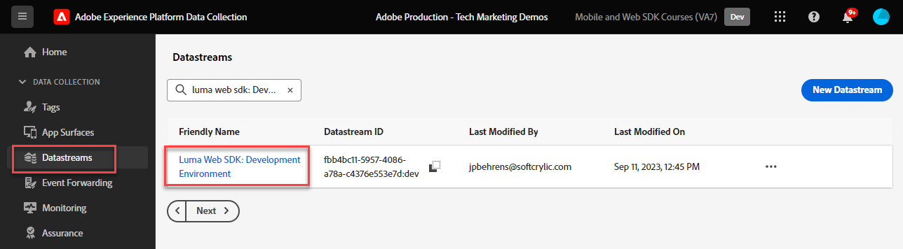
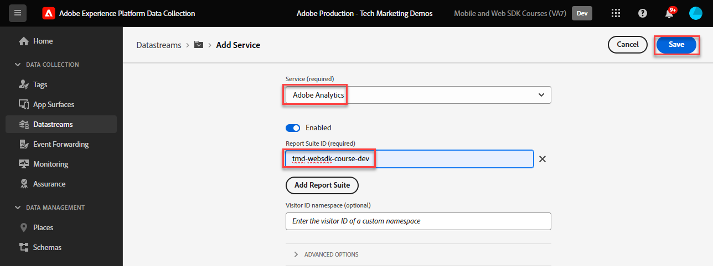
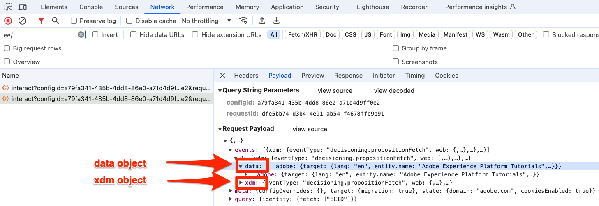
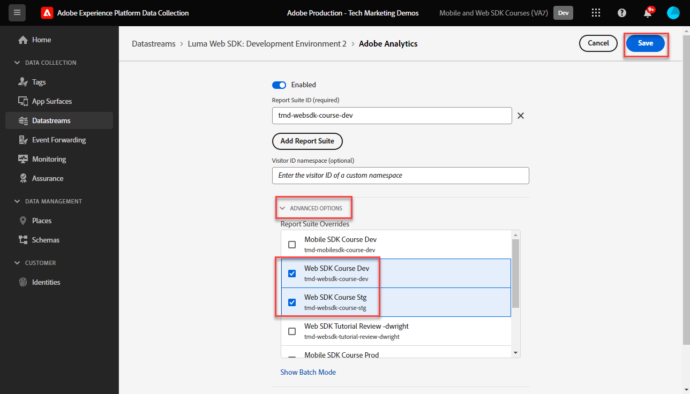

# Configurare Adobe Analytics con Adobe Experience Platform Web SDK

Scopri come configurare Adobe Analytics utilizzando [Adobe Experience Platform Web SDK](https://experienceleague.adobe.com/en/docs/platform-learn/data-collection/web-sdk/overview), creare regole di tag per inviare dati ad Adobe Analytics e verificare che Analytics stia acquisendo i dati come previsto.

[Adobe Analytics](https://experienceleague.adobe.com/it/docs/analytics) è un&#39;applicazione leader di settore che ti consente di comprendere i tuoi clienti come persone e gestire la tua attività grazie alle informazioni sul cliente.

## Obiettivi di apprendimento

Alla fine di questa lezione, potrai:

* Configurare uno stream di dati per abilitare Adobe Analytics
* Scopri quali campi XDM standard vengono mappati automaticamente sulle variabili di Analytics
* Impostare le variabili di Analytics nell’oggetto dati
* Inviare dati a un’altra suite di rapporti ignorando lo stream di dati
* Convalidare le variabili di Adobe Analytics utilizzando Debugger e Assurance

## Prerequisiti

Per completare questa lezione, devi prima:

* Acquisisci familiarità con Adobe Analytics e accedi ad esso.

* Avere almeno un ID suite per report test/dev. Se non hai una suite per report test/dev che puoi usare per questa esercitazione, [creane una](https://experienceleague.adobe.com/en/docs/analytics/admin/admin-tools/manage-report-suites/c-new-report-suite/t-create-a-report-suite).

* Completa le lezioni precedenti nelle sezioni Configurazione iniziale e Configurazione tag di questa esercitazione.

## Configurare lo stream di dati

Platform Web SDK invia i dati dal sito Web a Platform Edge Network. Lo stream di dati comunica quindi a Platform Edge Network a quali suite di rapporti Adobe Analytics devono essere inviati i dati.

1. Vai all&#39;interfaccia [Raccolta dati](https://experience.adobe.com/#/data-collection){target="blank"}
1. Nel menu di navigazione a sinistra, seleziona **[!UICONTROL Flussi di dati]**
1. Seleziona lo stream di dati `Luma Web SDK: Development Environment` creato in precedenza

   

1. Seleziona **[!UICONTROL Aggiungi servizio]**
   
1. Seleziona **[!UICONTROL Adobe Analytics]** come **[!UICONTROL Servizio]**
1. Immetti l&#39;**[!UICONTROL ID suite di rapporti]** della tua suite di rapporti per lo sviluppo
1. Seleziona **[!UICONTROL Salva]**

   

   >[!TIP]
   >
   >L&#39;aggiunta di altre suite di rapporti selezionando **[!UICONTROL Aggiungi suite di rapporti]** equivale all&#39;assegnazione di tag multisuite.

>[!WARNING]
>
>In questa esercitazione, puoi configurare solo la suite di rapporti di Adobe Analytics per il tuo ambiente di sviluppo. Quando crei flussi di dati per il tuo sito web, devi creare flussi di dati e suite di rapporti aggiuntivi per gli ambienti di staging e produzione.

## Impostare le variabili di Analytics

Esistono diversi modi per impostare le variabili di Analytics in un’implementazione Web SDK:

1. Mappatura automatica dei campi XDM sulle variabili di Analytics (automatica).
1. Impostare i campi nell&#39;oggetto `data` (scelta consigliata).
1. Mappa i campi XDM sulle variabili di Analytics nelle regole di elaborazione di Analytics (non più consigliato).
1. Mappa sulle variabili di Analytics direttamente nello schema XDM (non più consigliato).

A partire da maggio 2024, non è più necessario creare uno schema XDM per implementare Adobe Analytics con Platform Web SDK. L&#39;oggetto `data` (e l&#39;elemento dati `data.variable` creato nella lezione [Creare elementi dati](create-data-elements.md)) possono essere utilizzati per impostare tutte le variabili di Analytics personalizzate. L’impostazione di queste variabili nell’oggetto dati sarà familiare ai clienti Analytics esistenti, è più efficiente dell’utilizzo dell’interfaccia delle regole di elaborazione e impedisce che dati non necessari occupino spazio in Real-Time Customer Profiles (importante se si dispone di Real-Time Customer Data Platform o Journey Optimizer).

### Campi mappati automaticamente

Molti campi XDM vengono mappati automaticamente alle variabili di Analytics. Per l&#39;elenco aggiornato dei mapping, vedere [Mappatura delle variabili di Analytics in Adobe Experience Edge](https://experienceleague.adobe.com/en/docs/experience-platform/edge/data-collection/adobe-analytics/automatically-mapped-vars).

Ciò si verifica se _anche se non hai definito uno schema personalizzato_. Experience Platform Web SDK raccoglie automaticamente alcuni dati e li invia a Platform Edge Network come campi XDM. Web SDK, ad esempio, legge l&#39;URL della pagina corrente e lo invia come campo XDM `web.webPageDetails.URL`. Questo campo viene inoltrato ad Adobe Analytics e automaticamente popola i rapporti URL pagina in Adobe Analytics.

Se implementi Web SDK per Adobe Analytics con uno schema XDM, come hai fatto in questo tutorial, alcuni dei campi XDM che hai implementato sono mappati automaticamente alle variabili Analytics, come descritto in questa tabella:

| Variabili mappate automaticamente da XDM ad Analytics | Variabile Adobe Analytics |
|-------|---------|
| `identitymap.ecid.[0].id` | mid |
| `web.webPageDetails.name` | s.pageName |
| `web.webPageDetails.server` | s.server |
| `web.webPageDetails.siteSection` | s.channel |
| `commerce.productViews.value` | prodView |
| `commerce.productListViews.value` | scView |
| `commerce.checkouts.value` | scCheckout |
| `commerce.purchases.value` | acquisto |
| `commerce.order.currencyCode` | s.currencyCode |
| `commerce.order.purchaseID` | s.purchaseID |
| `productListItems[].SKU` | s.products=;product name;;;; (primario - vedi nota sotto) |
| `productListItems[].name` | s.products=;product name;;;; (fallback - vedi la nota seguente) |
| `productListItems[].quantity` | s.products=;;quantità prodotto;;; |
| `productListItems[].priceTotal` | s.product=;;;;prezzo del prodotto;; |

Le singole sezioni della stringa di prodotto Analytics sono impostate tramite diverse variabili XDM sotto l&#39;oggetto `productListItems`.

>[!NOTE]
>
>A partire dal 18 agosto 2022, `productListItems[].SKU` ha la priorità per il mapping al nome del prodotto nella variabile s.products.
>&#x200B;>Il valore impostato su `productListItems[].name` è mappato al nome del prodotto solo se `productListItems[].SKU` non esiste. In caso contrario, non è mappato ed è disponibile nei dati contestuali.
>&#x200B;>Non impostare una stringa vuota o null su `productListItems[].SKU`. Questo ha l’effetto indesiderato di mappare al nome del prodotto nella variabile s.products.

### Impostare le variabili nell’oggetto dati

Ma cosa dire di eVar, prop ed eventi? L&#39;impostazione delle variabili nell&#39;oggetto `data` è il metodo consigliato per impostare queste variabili di Analytics con Web SDK. L’impostazione delle variabili nell’oggetto dati può inoltre sovrascrivere qualsiasi variabile mappata automaticamente.

Innanzitutto, qual è l&#39;oggetto `data`? In qualsiasi evento di Web SDK è possibile inviare due oggetti con dati personalizzati, l&#39;oggetto `xdm` e l&#39;oggetto `data`. Entrambi vengono inviati a Platform Edge Network, ma solo l&#39;oggetto `xdm` viene inviato al set di dati di Experience Platform. Le proprietà nell&#39;oggetto `data` possono essere mappate sui campi di Edge a `xdm` utilizzando la funzione Preparazione per la raccolta dati, ma in caso contrario non vengono inviate ad Experience Platform. Questo lo rende un modo ideale per inviare dati ad applicazioni come Analytics, che non sono basate su Experience Platform in modo nativo.

Di seguito sono riportati i due oggetti in una chiamata generica di Web SDK:

Adobe Analytics è configurato per cercare eventuali proprietà nell&#39;oggetto `data.__adobe.analytics` e utilizzarle per le variabili di Analytics.

Ora vediamo come funziona. Impostiamo `eVar1` e `prop1` con il nome della nostra pagina e vediamo come il valore mappato da XDM può essere sovrascritto

1. Apri la regola di tag `all pages - library loaded - set global variables - 1`
1. Aggiungi una nuova **[!UICONTROL azione]**
1. Seleziona estensione **[!UICONTROL Adobe Experience Platform Web SDK]**
1. Seleziona **[!UICONTROL Tipo azione]** come **[!UICONTROL Aggiorna variabile]**
1. Seleziona `data.variable` come **[!UICONTROL elemento dati]**
1. Seleziona l&#39;oggetto **[!UICONTROL analytics]**
1. Imposta `eVar1` come elemento dati `page.pageInfo.pageName`
1. Imposta `prop1` per copiare il valore di `eVar1`
1. Per verificare la sovrascrittura dei valori mappati XDM, nella sezione **[!UICONTROL Proprietà aggiuntiva]** impostare il nome della pagina come valore statico `test`
1. Salva la regola

Ora è necessario includere l’oggetto dati nella regola dell’evento di invio.

1. Apri la regola di tag `all pages - library loaded - send event - 50`
1. Apri l&#39;azione **[!UICONTROL Invia evento]**
1. Seleziona `data.variable` come **[!UICONTROL Dati]**
1. Seleziona **[!UICONTROL Mantieni modifiche]**
1. Seleziona **[!UICONTROL Salva]**

<!--

### Map to Analytics variables with processing rules

All fields in the XDM schema become available to Adobe Analytics as Context Data Variables with the following prefix `a.x.`. For example, `a.x.web.webinteraction.region`

In this exercise, you map one XDM variable to a prop. Follow these same steps for any custom mapping that you must do for any `eVar`, `prop`, `event`, or variable accessible via Processing Rules.

1. Go to the Analytics interface
1. Go to [!UICONTROL Admin] > [!UICONTROL Admin Tools] > [!UICONTROL Report Suites ]
1. Select the dev/test report suite that you are using for the tutorial > [!UICONTROL Edit Settings] > [!UICONTROL General] > [!UICONTROL Processing Rules]

       

1. Create a rule to **[!UICONTROL Overwrite value of]** `[!UICONTROL Product SKU (prop1)]` to `a.x.productlistitems.0.sku`. Remember to add a note about why you are creating the rule and name your rule title. Select **[!UICONTROL Save]**

       

    >[!IMPORTANT]
    >
    >The first time you map to a processing rule, the UI does not show you the context data variables from the XDM object. To fix that select any value, Save, and come back to edit. All XDM variables should now appear.

### Map to Analytics variables using the Adobe Analytics field group

An alternative to processing rules is to map to Analytics variables in the XDM schema using the `Adobe Analytics ExperienceEvent Template` field group. This approach has gained popularity because many users find it simpler than configuring processing rules, however, by increasing the size of the XDM payload it could in turn increase the profile size in other applications like Real-Time CDP.

To add the `Adobe Analytics ExperienceEvent Template` field group to your schema:

1. Open the [Data Collection](https://experience.adobe.com/#/data-collection){target="blank"} interface
1. Select **[!UICONTROL Schemas]** from the left navigation
1. Make sure you are in the sandbox you are using from the tutorial
1. Open your `Luma Web Event Data` schema
1. In the **[!UICONTROL Field Groups]** section, select **[!UICONTROL Add]**
1. Find the `Adobe Analytics ExperienceEvent Template` field group and add it to your schema

Now, set a merchandising eVar in the product string. With the `Adobe Analytics ExperienceEvent Template` field group, you are able to map variables to merchandising eVars or events within the product string. This is also known as setting **Product Syntax Merchandising**. 

1. Go back to your tag property

1. Open the rule `ecommerce - library loaded - set product details variables - 20`

1. Open the **[!UICONTROL Set Variable]** action

1. Select to open `_experience > analytics > customDimensions > eVars > eVar1`

1. Set the **[!UICONTROL Value]** to `%product.productInfo.title%`

1. Select **[!UICONTROL Keep Changes]**

    

1. Select **[!UICONTROL Save]** to save the rule

As you just saw, basically all of the Analytics variables can be set in the `Adobe Analytics ExperienceEvent Template` field group.

>[!NOTE]
>
> Notice the `_experience` object under `productListItems` > `Item 1`. Setting any variable under this [!UICONTROL object] sets Product Syntax eVars or Events.

-->

## Inviare dati a una suite di rapporti diversa

Puoi modificare i dati della suite di rapporti di Adobe Analytics a cui vengono inviati i visitatori quando si trovano su determinate pagine. Questo richiede una configurazione sia nello stream di dati che in una regola.

### Configurare lo stream di dati per una sostituzione della suite di rapporti

Per configurare l’impostazione di sostituzione della suite di rapporti di Adobe Analytics nello stream di dati:

1. Apri lo stream di dati
1. Modifica la configurazione di **[!UICONTROL Adobe Analytics]** aprendo il menu  e selezionando **[!UICONTROL Modifica]**

   

1. Seleziona **[!UICONTROL Opzioni avanzate]** per aprire **[!UICONTROL Sostituzioni suite di rapporti]**

1. Seleziona le suite di rapporti da ignorare. In questo caso, `Web SDK Course Dev` e `Web SDK Course Stg`

1. Seleziona **[!UICONTROL Salva]**

   

### Configurare una regola per una sostituzione della suite di rapporti

Creiamo una regola per inviare una chiamata aggiuntiva di visualizzazione della pagina a una suite di rapporti diversa. Utilizza la funzione di sostituzione dello stream di dati per modificare la suite di rapporti per una pagina utilizzando l&#39;azione **[!UICONTROL Invia evento]**.

1. Crea una nuova regola, denominala `homepage - library loaded - AA report suite override - 51`

1. Seleziona il segno più in **[!UICONTROL Evento]** per aggiungere un nuovo trigger

1. In **[!UICONTROL Estensione]**, seleziona **[!UICONTROL Core]**

1. In **[!UICONTROL Tipo evento]**, seleziona **[!UICONTROL Libreria caricata (parte superiore della pagina)]**

1. Seleziona per aprire **[!UICONTROL Opzioni avanzate]**, digita in `51`. In questo modo la regola viene eseguita dopo `all pages - library loaded - send event - 50` che imposta l&#39;XDM della linea di base con il tipo di azione **[!UICONTROL Aggiorna variabile]**.
1. Seleziona **[!UICONTROL Mantieni modifiche]**

   

1. In **[!UICONTROL Condizioni]**, seleziona **[!UICONTROL Aggiungi]**

1. Lascia **[!UICONTROL Tipo di logica]** come **[!UICONTROL Normale]**

1. Lascia **[!UICONTROL Estensioni]** come **[!UICONTROL Core]**

1. Seleziona **[!UICONTROL Tipo condizione]** come **[!UICONTROL Percorso senza stringa di query]**

1. A destra, lascia l&#39;opzione **[!UICONTROL Regex]** disabilitata

1. In **[!UICONTROL path è uguale a]** set `/content/luma/us/en.html`. Per il sito di dimostrazione Luma, assicura che la regola venga attivata solo sulla pagina Home

1. Seleziona **[!UICONTROL Mantieni modifiche]**

   

1. In **[!UICONTROL Azioni]** selezionare **[!UICONTROL Aggiungi]**

1. Come **[!UICONTROL Estensione]**, seleziona **[!UICONTROL Adobe Experience Platform Web SDK]**

1. Come **[!UICONTROL Tipo azione]**, seleziona **[!UICONTROL Invia evento]**

1. Come **[!UICONTROL dati XDM]**, seleziona l&#39;elemento dati `xdm.variable.content` creato nella lezione [Creare elementi dati](create-data-elements.md)

1. Come **[!UICONTROL Dati]**, seleziona l&#39;elemento dati `data.variable` creato nella lezione [Creare elementi dati](create-data-elements.md)

   

1. Scorri verso il basso fino alla sezione **[!UICONTROL Override configurazioni stream di dati]**

1. Lascia selezionata la scheda **[!UICONTROL Sviluppo]**.

   >[!TIP]
   >
   >    Questa scheda determina in quale ambiente di tag si verifica l’esclusione. Per questa esercitazione, si specifica solo l&#39;ambiente di sviluppo, ma quando si distribuisce questo a produzione ricordare di farlo anche nell&#39;ambiente **[!UICONTROL Produzione]**.

1. Seleziona **[!UICONTROL Sandbox]** in uso per l&#39;esercitazione
1. Seleziona lo **[!UICONTROL stream di dati]**, in questo caso `Luma Web SDK: Development Environment`

1. In **[!UICONTROL Suite di rapporti]**, seleziona il sito di rapporti che desideri utilizzare per la sostituzione. In questo caso, `tmd-websdk-course-stg`.

1. Seleziona **[!UICONTROL Mantieni modifiche]**

1. E **[!UICONTROL Salva]** la regola

   

## Creare l’ambiente di sviluppo

Aggiungi le regole aggiornate alla libreria di tag `Luma Web SDK Tutorial` e rigenera l&#39;ambiente di sviluppo.

Congratulazioni! Il passaggio successivo consiste nel convalidare l’implementazione di Adobe Analytics tramite Experience Platform Web SDK.

## Convalidare Adobe Analytics con Debugger

Scopri come verificare che Adobe Analytics acquisisca ECID, visualizzazioni di pagina, la stringa di prodotto e gli eventi di e-commerce con la funzione Edge Trace di Experience Platform Debugger.

Nella lezione [Debugger](validate-with-debugger.md), hai imparato a esaminare la richiesta XDM lato client con Platform Debugger e la console per sviluppatori del browser, in modo simile a come si esegue il debug di un&#39;implementazione di Analytics `AppMeasurement.js`. Hai anche imparato a convalidare le richieste lato server di Platform Edge Network inviate alle applicazioni Adobe e a visualizzare un payload completamente elaborato utilizzando Assurance.

Per verificare che Analytics stia acquisendo correttamente i dati tramite Experience Platform Web SDK, è necessario effettuare due passaggi per:

1. Convalidare il modo in cui i dati vengono elaborati dall’oggetto XDM su Platform Edge Network, utilizzando la funzione di traccia di Edge di Experience Platform Debugger
1. Convalidare il modo in cui i dati vengono completamente elaborati da Analytics utilizzando Adobe Experience Platform Assurance

### Convalida Experience Cloud ID

1. Vai al [sito demo Luma](https://luma.enablementadobe.com/content/luma/us/en.html){target="_blank"}
1. Seleziona il pulsante di accesso in alto a destra e utilizza le credenziali u: test@test.com p: test per autenticare
1. Apri Experience Platform Debugger e [imposta la proprietà tag sul sito sulla tua proprietà di sviluppo](validate-with-debugger.md#use-the-experience-platform-debugger-to-map-to-your-tags-property)

1. Per abilitare Edge Trace, vai ad Experience Platform Debugger, nella navigazione a sinistra seleziona **[!UICONTROL Registri]**, quindi seleziona la scheda **[!UICONTROL Edge]** e infine seleziona **[!UICONTROL Connetti]**

   

1. Per ora sarà vuoto

   

1. Aggiorna la pagina Luma e controlla di nuovo Experience Platform Debugger; dovresti vedere i dati arrivare. La riga che inizia con **[!UICONTROL Mappatura automatica di Analytics]** è il beacon di Adobe Analytics
1. Seleziona per aprire sia il menu a discesa `[!UICONTROL mappedQueryParams]` che il secondo per visualizzare le variabili di Analytics

   

   >[!TIP]
   >
   >Il secondo elenco a discesa corrisponde all’ID suite di rapporti di Analytics a cui stai inviando i dati. Deve corrispondere alla tua suite di rapporti, non a quella nella schermata.

1. Scorri verso il basso per trovare `[!UICONTROL c.a.x.identitymap.ecid.[0].id]`. È una variabile di dati contestuali che acquisisce ECID
1. Continuare a scorrere verso il basso fino a visualizzare la variabile `[!UICONTROL mid]` di Analytics. Entrambi gli ID corrispondono all’ID Experience Cloud del tuo dispositivo.
1. Sul sito Luma:

   

   >[!NOTE]
   >
   >Dopo l&#39;accesso, attendere alcuni istanti per convalidare l&#39;ID autenticato `b642b4217b34b1e8d3bd915fc65c4452` per l&#39;utente **`test@test.com`** acquisito anche in `[!UICONTROL c.a.x.identitymap.lumacrmid.[0].id]`

### Convalida dell’override della suite di rapporti

Qui sopra hai configurato una sostituzione dello stream di dati per la [home page Luma](https://luma.enablementadobe.com/content/luma/us/en.html).  Per convalidare questa configurazione

1. Cerca una riga con **[!UICONTROL Configurazione dello stream di dati dopo l&#39;applicazione dell&#39;override]**. Qui puoi trovare la suite di rapporti principale e le suite di rapporti aggiuntive configurate per le sostituzioni della suite di rapporti.

   

1. Scorri verso il basso fino alla riga che inizia con **[!UICONTROL Mappatura automatica di Analytics]** e verifica che `[!UICONTROL reportSuiteIds]` mostri la suite di rapporti specificata nelle configurazioni di sostituzione

   

### Convalida delle visualizzazioni della pagina del contenuto

Vai a una pagina di prodotto come [Didi Sport Watch](https://luma.enablementadobe.com/content/luma/us/en/products/gear/watches/didi-sport-watch.html#24-WG02).  Verifica che le visualizzazioni della pagina di contenuto siano acquisite da Analytics.

1. Cerca `[!UICONTROL c.a.x.web.webpagedetails.pageviews.value]=1`.
1. Scorrere verso il basso per visualizzare la variabile `[!UICONTROL gn]`. Sintassi dinamica di Analytics per la variabile `[!UICONTROL s.pageName]`. Acquisisce il nome della pagina dal livello dati.

   >[!NOTE]
   >
   > Il valore `gn` potrebbe essere `test` se l&#39;oggetto `xdm` è stato sovrascritto con l&#39;oggetto `data` nell&#39;esercizio precedente.

   

### Convalida della stringa di prodotto e degli eventi di e-commerce

Poiché ti trovi già in una pagina di prodotto, questo esercizio continua a utilizzare la stessa traccia di Edge per convalidare i dati del prodotto acquisiti da Analytics. Sia la stringa di prodotto che gli eventi di e-commerce vengono mappati automaticamente le variabili XDM su Analytics. Se hai eseguito il mapping alla variabile XDM `productListItem` corretta durante la [configurazione di uno schema XDM per Adobe Analytics](setup-analytics.md#configure-an-xdm-schema-for-adobe-analytics), Platform Edge Network si occupa di mappare i dati alle variabili di analisi appropriate.

**Verificare innanzitutto che `Product String` sia impostato**

1. Cerca `[!UICONTROL c.a.x.productlistitems.][0].[!UICONTROL sku]`. La variabile acquisisce il valore dell&#39;elemento dati mappato a `productListItems.item1.sku` in questa lezione
1. Cerca anche `[!UICONTROL c.a.x.productlistitems.][0].[!UICONTROL _experience.analytics.customdimensions.evars.evar1]`. La variabile acquisisce il valore elemento dati mappato a `productListItems.item1._experience.analytics.customdimensions.evars.evar1`
1. Scorrere verso il basso per visualizzare la variabile `[!UICONTROL pl]`. È la sintassi dinamica della variabile della stringa di prodotto Analytics
1. Il nome del prodotto dal livello dati è mappato sia al parametro `[!UICONTROL c.a.x.productlistitems.][0].[!UICONTROL sku]` che al parametro `[!UICONTROL product]` della stringa prodotti.  Inoltre, il titolo del prodotto dal livello dati viene mappato su evar1 merchandising nella stringa prodotti.

   

   Edge Trace tratta gli eventi `commerce` in modo leggermente diverso rispetto alle dimensioni `productList`. Non viene visualizzata una variabile di dati contestuali mappata nello stesso modo in cui viene visualizzato il nome del prodotto mappato a `[!UICONTROL c.a.x.productlistitem.[0].name]` sopra. La traccia di Edge mostra invece il mapping automatico dell&#39;evento finale nella variabile `event` di Analytics. Platform Edge Network ne esegue il mapping di conseguenza finché non si esegue il mapping alla variabile XDM `commerce` corretta durante la [configurazione dello schema per Adobe Analytics](setup-analytics.md#configure-an-xdm-schema-for-adobe-analytics); in questo caso `commerce.productViews.value=1`.

1. Nella finestra di Experience Platform Debugger, scorri verso il basso fino alla variabile `[!UICONTROL events]`, è impostata su `[!UICONTROL prodView]`

1. Nota inoltre che `[!UICONTROL c.a.x.eventType]` è impostato su `commerce.productViews` poiché ci si trova in una pagina di prodotto.

   >[!TIP]
   >
   > La regola `ecommerce - library loaded - set product details variables - 20` sovrascrive il valore di `eventType` impostato dalla regola `all pages - library loaded - set global variables - 1` in quanto è impostato per l&#39;attivazione in un secondo momento della sequenza

   

**Convalidare il resto degli eventi di e-commerce e le stringhe di prodotto impostate per Analytics**

1. Aggiungi [Didi Sport Watch](https://luma.enablementadobe.com/content/luma/us/en/products/gear/watches/didi-sport-watch.html#24-WG02) al carrello
1. Vai alla [pagina carrello](https://luma.enablementadobe.com/content/luma/us/en/user/cart.html), controlla Edge Trace per

   * `eventType` impostato su `commerce.productListViews`
   * `[!UICONTROL events: "scView"]` e
   * la stringa di prodotto è impostata

   

1. Procedi con il pagamento, controlla Edge Trace per

   * `eventType` impostato su `commerce.checkouts`
   * `[!UICONTROL events: "scCheckout"]` e
   * la stringa di prodotto è impostata

   

1. Compila solo i campi **Nome** e **Cognome** nel modulo di spedizione e seleziona **Continua**. Nella pagina successiva, seleziona **Inserisci ordine**
1. Nella pagina di conferma, seleziona Edge Trace per

   * `eventType` impostato su `commerce.purchases`
   * Evento di acquisto in fase di impostazione `[!UICONTROL events: "purchase"]`
   * Variabile codice valuta impostata `[!UICONTROL cc: "USD"]`
   * ID acquisto impostato in `[!UICONTROL pi]`
   * Stringa di prodotto `[!UICONTROL pl]` che imposta il nome, la quantità e il prezzo del prodotto

   

## Convalidare Adobe Analytics tramite Assurance

Adobe Experience Platform Assurance consente di verificare, verificare, simulare e convalidare la modalità di raccolta dei dati o di invio delle esperienze con il sito web e l’app mobile.

Nell’esercizio precedente hai verificato che Adobe Analytics acquisisce l’ECID, le visualizzazioni di pagina, la stringa di prodotto e gli eventi di e-commerce con la funzione Edge Trace di Experience Platform Debugger.  Successivamente, convalida gli stessi eventi utilizzando Adobe Experience Platform Assurance, un’interfaccia alternativa per accedere agli stessi dati in Edge Trace.

Come hai appreso nella lezione [Assurance](validate-with-assurance.md), esistono diversi modi per avviare una sessione Assurance. Poiché Adobe Experience Platform Debugger è già aperto con una sessione di Edge Trace avviata dall’ultimo esercizio, si consiglia di accedere ad Assurance tramite Debugger:

All&#39;interno del **[!UICONTROL &quot;Esercitazione Web SDK 3&quot;]** sessione Assurance immettere **[!UICONTROL &quot;hitdebugger&quot;]** nella barra di ricerca degli eventi per filtrare i risultati nei dati post-elaborati di Adobe Analytics.

### Convalida Experience Cloud ID

Per verificare che Adobe Analytics acquisisca l’ECID, seleziona un beacon e apri il Payload.  Il fornitore per questo beacon deve essere **[!UICONTROL com.adobe.analytics.hitdebugger]**

Quindi scorri verso il basso fino a **[!UICONTROL mcvisId]** per verificare che l&#39;ECID sia stato acquisito correttamente

### Convalida delle visualizzazioni della pagina del contenuto

Utilizzando lo stesso beacon, verifica che le visualizzazioni della pagina di contenuto siano mappate sulla variabile Adobe Analytics corretta.
Scorri verso il basso fino a **[!UICONTROL pageName]** per verificare che `Page Name` sia acquisito correttamente:

    >[!NOTE]
    >
    > Il valore &quot;pageName&quot; potrebbe essere &quot;test&quot; se hai sovrascritto l’oggetto &quot;xdm&quot; con l’oggetto &quot;data&quot; nell’esercizio precedente.
    
    

### Convalida della stringa di prodotto e degli eventi di e-commerce

Seguendo gli stessi casi di utilizzo della convalida utilizzati durante la convalida con Experience Platform Debugger, continua a utilizzare lo stesso beacon per convalidare `Ecommerce Events` e `Product String`.

1. Cerca payload in cui **[!UICONTROL eventi]** contengono `prodView`
   
1. Scorri verso il basso fino a **[!UICONTROL product-string]** per convalidare `Product String`.
   * Annotare `Product SKU` e `Merchandizing eVar1`.
1. Scorri verso il basso e verifica che `prop1`, configurato utilizzando le regole di elaborazione nella sezione precedente, contenga `Product SKU`\
   

Continua a convalidare la tua implementazione rivedendo il carrello, gli eventi di pagamento e gli eventi di acquisto.

1. Cerca il payload in cui **[!UICONTROL eventi]** contengono `scView` e convalida la stringa di prodotto.
   
1. Cerca il payload in cui **[!UICONTROL eventi]** contengono `scCheckout` e convalida la stringa di prodotto.
   
1. Cerca payload in cui **[!UICONTROL eventi]** contengono `purchase`
   
1. Durante la convalida dell&#39;evento `purchase`, tenere presente che `Product String` deve contenere `Product SKU`, `Product Quantity` e `Product Total Price`.
1. Inoltre, per `purchase` verificare che `purchase-id` e/o `purchaseId` siano impostati

Congratulazioni! Ce l&#39;hai fatta! Questa è la fine della lezione e ora puoi implementare Adobe Analytics con Platform Web SDK per il tuo sito Web.

>[!NOTE]
>
>Grazie per aver dedicato tempo all&#39;apprendimento di Adobe Experience Platform Web SDK. Se hai domande, vuoi condividere commenti generali o suggerimenti su contenuti futuri, condividili in questo [post di discussione della community Experience League](https://experienceleaguecommunities.adobe.com/t5/adobe-experience-platform-data/tutorial-discussion-implement-adobe-experience-cloud-with-web/td-p/444996)
