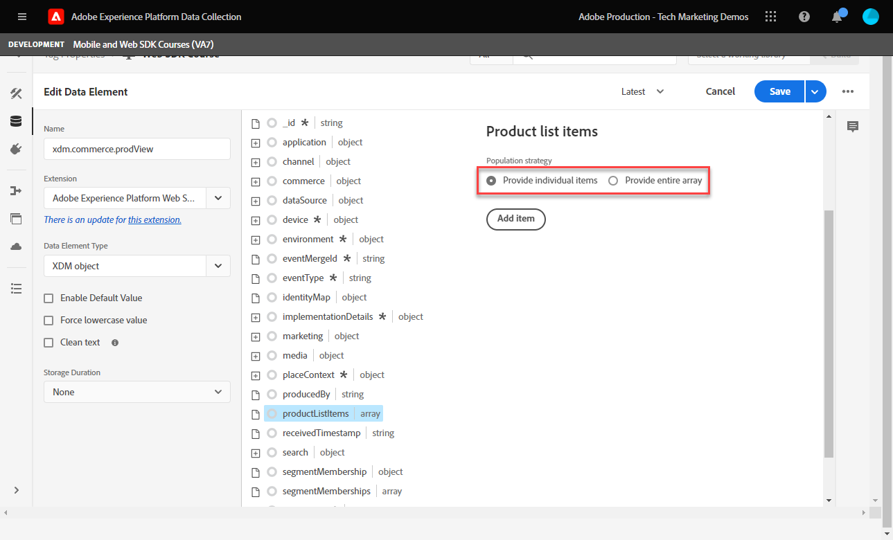
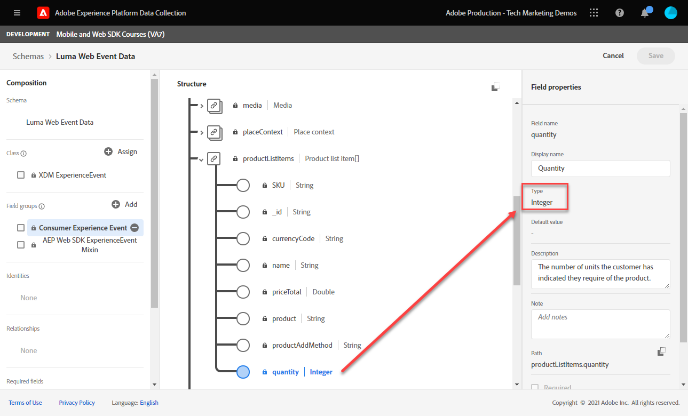

# Configurare Adobe Analytics con Platform Web SDK

Scopri come configurare Adobe Analytics utilizzando [Experience Platform Web SDK](https://experienceleague.adobe.com/docs/platform-learn/data-collection/web-sdk/overview.html), crea regole di tag per inviare dati ad Adobe Analytics e verifica che Analytics acquisisca i dati come previsto.

[Adobe Analytics](https://experienceleague.adobe.com/docs/analytics.html?lang=it) è un&#39;applicazione leader di settore che ti consente di comprendere i tuoi clienti come persone e gestire la tua attività grazie alle informazioni sul cliente.

## Finalità di apprendimento

Alla fine di questa lezione, potrai:

* Configura uno schema XDM per Adobe Analytics e comprendi la differenza tra variabili XDM mappate automaticamente e manualmente per Analytics
* Configurare un datastream per abilitare Adobe Analytics
* Mappare elementi dati di array singoli o interi all’oggetto XDM
* Acquisire le visualizzazioni di pagina in Adobe Analytics con l’oggetto XDM
* Acquisire dati di e-commerce con l’oggetto XDM per la stringa di prodotto Adobe Analytics
* Convalidare le variabili Adobe Analytics impostate con l’oggetto XDM utilizzando Experience Platform Debugger
* Utilizzare le regole di elaborazione di Adobe Analytics per impostare variabili personalizzate
* Convalidare i dati viene acquisito da Adobe Analytics utilizzando i rapporti in tempo reale

## Prerequisiti

Hai familiarità con i tag, Adobe Analytics e la [Sito dimostrativo Luma](https://luma.enablementadobe.com/content/luma/us/en.html)Funzionalità di accesso e acquisto di {target=&quot;_blank&quot;}.

È necessario almeno un ID suite di rapporti test/dev. Se non hai una suite di rapporti test/dev che puoi usare per questa esercitazione, [creane uno](https://experienceleague.adobe.com/docs/analytics/admin/manage-report-suites/new-report-suite/t-create-a-report-suite.html).

Devi aver completato tutti i passaggi delle sezioni precedenti dell’esercitazione:

* Configurazione iniziale
   * [Configurare le autorizzazioni](configure-permissions.md)
   * [Configurare uno schema XDM](configure-schemas.md)
   * [Configurare uno spazio dei nomi di identità](configure-identities.md)
   * [Configurare un datastream](configure-datastream.md)
* Configurazione dei tag
   * [Installare l’estensione SDK per web](install-web-sdk.md)
   * [Creare elementi dati](create-data-elements.md)
   * [Creare una regola di tag](create-tag-rule.md)
   * [Convalida con debugger Adobe Experience Platform](validate-with-debugger.md)

## Schemi XDM e variabili di Analytics

Congratulazioni! Hai già configurato uno schema compatibile con Adobe Analytics nel [Configurare uno schema](configure-schemas.md) lezione!

L’implementazione di Platform Web SDK deve essere il più possibile indipendente dal prodotto. Per Adobe Analytics, la mappatura di eVar, prop ed eventi non si verifica durante la creazione dello schema, né durante la configurazione delle regole dei tag come avviene tradizionalmente. Invece, ogni coppia chiave-valore XDM diventa una variabile di dati di contesto che si mappa a una variabile di Analytics in uno dei due modi seguenti:

1. Variabili mappate automaticamente utilizzando campi XDM riservati
1. Variabili mappate manualmente utilizzando le regole di elaborazione di Analytics

Per capire quali variabili XDM sono mappate automaticamente ad Adobe Analytics, vedi [Variabili mappate automaticamente in Analytics](https://experienceleague.adobe.com/docs/experience-platform/edge/data-collection/adobe-analytics/automatically-mapped-vars.html?lang=en). Qualsiasi variabile non mappata automaticamente deve essere mappata manualmente.

Lo schema creato in [Configurare uno schema](configure-schemas.md) La lezione contiene alcune variabili di Analytics mappate automaticamente, come descritto in questa tabella:

| Variabili mappate automaticamente da XDM ad Analytics | Variabile Adobe Analytics |
|-------|---------|
| `identitymap.ecid.[0].id` | mid |
| `web.webPageDetails.pageViews.value` | a page view s.t() call |
| `web.webPageDetails.name` | s.pageName |
| `web.webPageDetails.server` | s.server |
| `web.webPageDetails.siteSection` | s.channel |
| `commerce.productViews.value` | prodView |
| `commerce.productListViews.value` | scView |
| `commerce.checkouts.value` | scCheckout |
| `commerce.purchases.value` | acquisto |
| `commerce.order.currencyCode` | s.currencyCode |
| `commerce.order.purchaseID` | s.purchaseID |
| `productListItems[].SKU` | s.products=;nome del prodotto;;; (primario - vedi la nota seguente) |
| `productListItems[].name` | s.products=;nome del prodotto;;; (fallback - vedi la nota di seguito) |
| `productListItems[].quantity` | s.products=;;quantità del prodotto;;; |
| `productListItems[].priceTotal` | s.product=;;;prezzo del prodotto; |

>[!NOTE]
>
>Le singole sezioni della stringa di prodotto Analytics sono impostate tramite variabili XDM diverse nella sezione `productListItems` oggetto.
>Dal 18 agosto 2022, `productListItems[].SKU` considera la priorità per la mappatura al nome del prodotto nella variabile s.products .
>Il valore impostato su `productListItems[].name` è mappato al nome del prodotto solo se `productListItems[].SKU` non esiste. In caso contrario, non viene mappata e disponibile nei dati contestuali.
>Non impostare una stringa vuota o un valore nullo su  `productListItems[].SKU`. Questo ha l&#39;effetto indesiderato di mappare il nome del prodotto nella variabile s.products .


## Configurare il datastream

Platform Web SDK invia i dati dal sito web a Platform Edge Network. Il datastream comunica quindi a Platform Edge Network dove inoltrare tali dati, in questo caso, quali suite di rapporti di Adobe Analytics.

1. Vai a [Raccolta dati](https://experience.adobe.com/#/data-collection)Interfaccia {target=&quot;blank&quot;}
1. Nella navigazione a sinistra, seleziona **[!UICONTROL Datastreams]**
1. Seleziona il creato in precedenza `Luma Web SDK` datastream

   

1. Seleziona **[!UICONTROL Aggiungi servizio]**

   
1. Seleziona **[!UICONTROL Adobe Analytics]** come **[!UICONTROL Servizio]**
1. Inserisci il  **[!UICONTROL ID suite di rapporti]** della suite di rapporti per lo sviluppo
1. Seleziona **[!UICONTROL Salva]**

   

   >[!TIP]
   >
   >Aggiunta di più suite di rapporti selezionando **[!UICONTROL Aggiungi suite di rapporti]** equivale all’assegnazione di tag a più suite.

>[!WARNING]
>
>In questa esercitazione configuri solo la suite di rapporti Adobe Analytics per lo sviluppo. Quando crei dei datastreams per il tuo sito web, crei altri datastreams e suite di rapporti per i tuoi ambienti di staging e produzione.


## Creare elementi dati aggiuntivi

Quindi, acquisisci dati aggiuntivi dal livello dati Luma e inviali alla piattaforma Edge Network. Mentre la lezione si concentra sui requisiti Adobe Analytics comuni, tutti i dati acquisiti possono essere facilmente inviati ad altre destinazioni in base alla configurazione del datastream. Ad esempio, se hai completato la lezione Adobe Experience Platform, anche i dati aggiuntivi acquisiti in questa lezione vengono inviati a Platform.

### Creare elementi dati di e-commerce

Durante la lezione Creazione di elementi dati , [elementi dati JavaScript creati](create-data-elements.md#create-data-elements-to-capture-the-data-layer) che acquisiva contenuti e dettagli di identità. Ora puoi creare elementi di dati aggiuntivi per acquisire dati di e-commerce. Perché [Sito dimostrativo Luma](https://luma.enablementadobe.com/content/luma/us/en.html){target=&quot;_blank&quot;} utilizza diverse strutture dei livelli dati per le pagine di dettaglio del prodotto e i prodotti nel carrello, è necessario creare elementi dati per ogni scenario. Utilizza i frammenti di codice forniti di seguito:

1. Apri la proprietà tag utilizzata per l’esercitazione.
1. Vai a **[!UICONTROL Elementi dati]**
1. Seleziona **[!UICONTROL Aggiungi elemento dati]**
1. Denomina **`product.productInfo.sku`**
1. Utilizza la **[!UICONTROL Codice personalizzato]** **[!UICONTROL Tipo di elemento dati]**
1. Lascia le caselle di controllo per **[!UICONTROL Forza valore minuscolo]** e **[!UICONTROL Testo pulito]** non selezionato
1. Esci `None` come **[!UICONTROL Durata archiviazione]** poiché questo valore è diverso in ogni pagina
1. Seleziona **[!UICONTROL Apri editor]**

   

1. Copia e incolla il seguente codice

   ```javascript
   var cart = digitalData.product;
   var cartItem;
   cart.forEach(function(item){
   cartItem = item.productInfo.sku;
   });
   return cartItem;
   ```

1. Seleziona **[!UICONTROL Salva]** per salvare il codice personalizzato

   

1. Seleziona **[!UICONTROL Salva]** per salvare l’elemento dati

Segui gli stessi passaggi per creare questi elementi di dati aggiuntivi:

* **`product.productInfo.title`**

   ```javascript
   var cart = digitalData.product;
   var cartItem;
   cart.forEach(function(item){
   cartItem = item.productInfo.title;
   });
   return cartItem;
   ```

* **`cart.productInfo`**

   ```javascript
   var cart = digitalData.cart.cartEntries;
   var cartItem = [];
   cart.forEach(function(item, index, array){
   var qty = parseInt(item.qty);
   var price = parseInt(item.price);
   cartItem.push({
   "SKU": item.sku,
   "name":item.title,
   "quantity":qty,
   "priceTotal":price
   });
   });
   return cartItem;
   ```

Dopo aver aggiunto questi elementi dati e creato quelli precedenti in [Creare elementi dati](create-data-elements.md) lezione, è necessario disporre dei seguenti elementi dati:

| Elementi dati |
-----------------------------|
| `cart.orderId` |
| `cart.productInfo` |
| `identityMap.loginID` |
| `page.pageInfo.hierarchie1` |
| `page.pageInfo.pageName` |
| `page.pageInfo.server` |
| `product.productInfo.sku` |
| `product.productInfo.title` |
| `user.profile.attributes.loggedIn` |
| `user.profile.attributes.username` |
| `xdm.content` |

>[!IMPORTANT]
>
>In questa esercitazione verrà creato un oggetto XDM diverso per ogni evento. Questo significa che devi mappare le variabili che sarebbero considerate &quot;globalmente&quot; disponibili su ogni hit, come il nome della pagina e identityMap. Tuttavia, è possibile [Unisci oggetti](https://experienceleague.adobe.com/docs/experience-platform/tags/extensions/adobe/core/overview.html#merged-objects) o utilizzare [Tabelle di mappatura](https://exchange.adobe.com/experiencecloud.details.103136.mapping-table.html) per gestire gli oggetti XDM in modo più efficiente in una situazione reale. Per questa lezione, le variabili globali sono considerate come:
>
>* **[!UICONTROL identityMap]** per acquisire l&#39;ID autenticato come da [Crea elemento dati mappa identità](create-data-elements.md#create-identity-map-data-element) l&#39;esercizio [Creare elementi dati](create-data-elements.md) lezione.
>* **[!UICONTROL web]** oggetto per acquisire il contenuto come da [oggetto XDM di contenuto](create-data-elements.md#map-content-data-elements-to-XDM-Schema-individually) l&#39;esercizio [Creare elementi dati](create-data-elements.md) lezione su ogni elemento dati precedente.


### Incrementa le visualizzazioni di pagina

Nella lezione Creazione di elementi dati , [creato `xdm.content` elemento dati](create-data-elements.md#map-content-data-elements-to-xdm-schema-individually) per acquisire dimensioni di contenuto. Poiché ora invii dati ad Adobe Analytics, devi anche mappare un campo XDM aggiuntivo per indicare che un beacon deve essere elaborato come visualizzazione di pagina di Analytics.

1. Apri il tuo `xdm.content` elemento dati
1. Scorri verso il basso e seleziona per aprire fino a `web.webPageDetails`
1. Seleziona per aprire la **[!UICONTROL pageViews]** oggetto
1. Imposta **[!UICONTROL value]** a `1`
1. Seleziona [!UICONTROL **Salva**]

   

>[!TIP]
>
>Equivale a inviare un **`s.t()`** beacon di visualizzazione della pagina per Analytics che utilizza `AppMeasurement.js`. Per un beacon di clic del collegamento, imposta la `webInteraction.linkClicks.value` a `1`


### Imposta la stringa di prodotto

Prima di eseguire la mappatura sulla stringa di prodotto, è importante comprendere che lo schema XDM contiene due oggetti principali utilizzati per l’acquisizione di dati di e-commerce che hanno relazioni speciali con Adobe Analytics:

1. La `commerce` l&#39;oggetto imposta gli eventi di Analytics come `prodView`, `scView`e `purchase`
1. La `productListItems` l&#39;oggetto imposta le dimensioni di Analytics come `productID`.

Vedi [Raccogliere dati di Commerce e Prodotti](https://experienceleague.adobe.com/docs/experience-platform/edge/data-collection/collect-commerce-data.html?lang=en) per ulteriori dettagli.

È importante anche capire che è possibile **[!UICONTROL fornire attributi singoli]** a campi XDM singoli o **[!UICONTROL fornire un intero array]** a un oggetto XDM.



### Mappatura di singoli attributi su un oggetto XDM

Puoi eseguire la mappatura su singole variabili per acquisire dati nella pagina dei dettagli del prodotto del sito Demo Luma:

1. Crea un **[!UICONTROL Oggetto XDM]** **[!UICONTROL Tipo di elemento dati]** denominato **`xdm.commerce.prodView`**
1. Seleziona la stessa sandbox Platform e lo stesso schema XDM utilizzati nelle lezioni precedenti
1. Apri **[!UICONTROL commerce]** oggetto
1. Apri **[!UICONTROL productViews]** oggetto e set **[!UICONTROL value]** a `1`

   

   >[!TIP]
   >
   >Questo passaggio equivale all’impostazione `prodView` evento in Analytics


1. Scorri verso il basso e seleziona `productListItems` array
1. Seleziona **[!UICONTROL Fornire singoli elementi]**
1. Seleziona **[!UICONTROL Aggiungi elemento]**

   

   >[!CAUTION]
   >
   >La **`productListItems`** è un `array` tipo di dati in modo che i dati vengano inclusi come raccolta di elementi. A causa della struttura del livello dati del sito di dimostrazione Luma e poiché è possibile visualizzare un solo prodotto alla volta sul sito Luma, aggiungerai singoli elementi. Quando si implementa sul sito web, a seconda della struttura del livello dati, è possibile fornire un intero array.

1. Seleziona per aprire **[!UICONTROL Elemento 1]**
1. Mappa le seguenti variabili XDM su elementi dati

   * **`productListItems.item1.SKU`** in `%product.productInfo.sku%`
   * **`productListItems.item1.name`** in `%product.productInfo.title%`

   

   >[!IMPORTANT]
   >
   >Prima di salvare questo oggetto XDM, accertati di impostare anche le variabili &quot;globali&quot; e l&#39;incremento della visualizzazione della pagina:
   >

1. Seleziona **[!UICONTROL Salva]**

### Mappare un intero array su un oggetto XDM

Come indicato in precedenza, il sito Demo Luma utilizza una struttura di livello dati diversa per i prodotti nel carrello. L’elemento dati del codice personalizzato `cart.productInfo` elemento dati creato in precedenza loop attraverso `digitalData.cart.cartEntries` oggetto livello dati e lo traduce nello schema di oggetti XDM richiesto. Il nuovo formato **deve corrispondere esattamente** lo schema definito dalla `productListItems` oggetto dello schema XDM.

Per illustrare il confronto tra il livello dati del sito Luma (a sinistra) e l’elemento dati tradotto (a destra), riportato di seguito:


Confronta l’elemento dati con `productListItems` struttura (suggerimento, dovrebbe corrispondere).

>[!IMPORTANT]
>
>Si noti come le variabili numeriche sono tradotte con valori stringa nel livello dati come `price` e `qty` riformattato in numeri nell’elemento dati. Questi requisiti di formato sono importanti per l’integrità dei dati in Platform e sono determinati durante il [configurare schemi](configure-schemas.md) passo. Nell’esempio, **[!UICONTROL quantità]** utilizza **[!UICONTROL Intero]** tipo di dati.
> 

Ora torniamo a mappare l&#39;oggetto XDM su un intero array. Crea un elemento dati oggetto XDM per acquisire i prodotti nella pagina del carrello:

1. Crea un **[!UICONTROL Oggetto XDM]** **[!UICONTROL Tipo di elemento dati]** denominato **`xdm.commerce.cartView`**
1. Seleziona la stessa sandbox Platform e lo stesso schema XDM utilizzato per questa esercitazione
1. Apri **[!UICONTROL commerce]** oggetto
1. Apri **[!UICONTROL productListViews]** oggetto e set `value` a `1`

   >[!TIP]
   >
   >Questo passaggio equivale all’impostazione `scView` evento in Analytics

1. Scorri verso il basso e seleziona **[!UICONTROL productListItems]** array
1. Seleziona **[!UICONTROL Fornire un intero array]**
1. Mappa su **`cart.productInfo`** elemento dati

   

   >[!IMPORTANT]
   >
   >Prima di salvare questo oggetto XDM, accertati di impostare anche le variabili &quot;globali&quot; e l&#39;incremento della visualizzazione della pagina:
   >

1. Seleziona **[!UICONTROL Salva]**

Crea un altro **[!UICONTROL Oggetto XDM]**  **[!UICONTROL Tipo di elemento dati]** per i pagamenti chiamati `xdm.commerce.checkout`. Questa ora imposta il **[!UICONTROL commerce.checkouts.value]** a `1`, mappa **[!UICONTROL productListItems]** a **`cart.productInfo`** come hai appena fatto, e aggiungi le variabili &quot;globali&quot; e il contatore di visualizzazione della pagina.

>[!TIP]
>
>Questo passaggio equivale all’impostazione `scCheckout` evento in Analytics


Sono disponibili ulteriori passaggi per l’acquisizione di `purchase` evento:

1. Crea un altro  **[!UICONTROL Oggetto XDM]**  **[!UICONTROL Tipo di elemento dati]** per gli acquisti denominati `xdm.commerce.purchase`
1. Apri **[!UICONTROL commerce]** oggetto
1. Apri **[!UICONTROL ordine]** oggetto
1. Mappa **[!UICONTROL purchaseID]** al `cart.orderId` elemento dati
1. Imposta **[!UICONTROL currencyCode]** al valore hardcoded `USD`

   

   >[!TIP]
   >
   >Equivale all’impostazione `s.purcahseID` e `s.currencyCode` variabili in Analytics

1. Seleziona per aprire la `purchases` oggetto e set `value` a `1`
   >[!TIP]
   >
   >Equivale all’impostazione `purchase` evento in Analytics

   >[!IMPORTANT]
   >
   >Prima di salvare questo oggetto XDM, accertati di impostare anche le variabili &quot;globali&quot; e l&#39;incremento della visualizzazione della pagina:
   >

1. Seleziona **[!UICONTROL Salva]**

Al termine di questi passaggi, è necessario creare i seguenti cinque elementi dati oggetto XDM:

| Elementi dati oggetto XDM |
-----------------------------|
| `xdm.commerce.cartView` |
| `xdm.commerce.checkout` |
| `xdm.commerce.prodView` |
| `xdm.commerce.purchase` |
| `xdm.content` |


## Creare regole aggiuntive per Platform Web SDK

Con i diversi elementi dati oggetto XDM creati, è possibile impostare i beacon utilizzando le regole. In questo esercizio, puoi creare singole regole per ogni evento di e-commerce e utilizzare condizioni in modo che le regole si attivino sulle pagine giuste. Cominciamo con un evento Visualizzazione prodotto .

1. Dalla navigazione a sinistra, seleziona **[!UICONTROL Regole]** quindi seleziona **[!UICONTROL Aggiungi regola]**
1. Denomina  [!UICONTROL `product view - library load - AA`]
1. Sotto **[!UICONTROL Eventi]**, seleziona **[!UICONTROL Libreria caricata (Pagina in alto)]**
1. Sotto **[!UICONTROL Condizioni]**, seleziona **[!UICONTROL Aggiungi]**

   

1. Esci **[!UICONTROL Tipo di logica]** come **[!UICONTROL Regolare]**
1. Esci **[!UICONTROL Estensioni]** come **[!UICONTROL Core]**
1. Seleziona **[!UICONTROL Tipo di condizione]** come **[!UICONTROL Percorso senza stringa di query]**
1. A destra, abilita **[!UICONTROL Regex]** interruttore
1. Sotto **[!UICONTROL path è uguale a]** set `/products/`. Per il sito di dimostrazione Luma, assicura che la regola si attivi solo sulle pagine di prodotto
1. Seleziona **[!UICONTROL Mantieni modifiche]**

   

1. Sotto **[!UICONTROL Azioni]** select **[!UICONTROL Aggiungi]**
1. Seleziona **[!UICONTROL Adobe Experience Platform Web SDK]** estensione
1. Seleziona **[!UICONTROL Tipo di azione]** come **[!UICONTROL Invia evento]**
1. La **[!UICONTROL Tipo]** il campo dispone di un elenco a discesa di valori tra cui scegliere. Seleziona `[!UICONTROL commerce.productViews]`

   >[!TIP]
   >
   >Il valore selezionato qui non ha alcun effetto sul modo in cui i dati vengono mappati in Analytics, tuttavia si consiglia di applicare delicatamente questa variabile, in quanto viene utilizzata nell’interfaccia di Generatore di segmenti di Adobe Experience Platform. Il valore selezionato è disponibile per l&#39;utilizzo in `[!UICONTROL c.a.x.eventtype]` variabile di dati di contesto a valle.

1. Sotto **[!UICONTROL Dati XDM]**, seleziona `[!UICONTROL xdm.commerce.prodView]` Elemento dati oggetto XDM
1. Seleziona **[!UICONTROL Mantieni modifiche]**

   

1. La regola deve essere simile alla seguente. Seleziona **[!UICONTROL Salva]**

   


Ripeti lo stesso per tutti gli altri eventi di e-commerce utilizzando i seguenti parametri:

**Nome della regola**: vista carrello - Caricamento libreria - AA

* **[!UICONTROL Tipo evento]**: Libreria caricata (Pagina in alto)
* **[!UICONTROL Condizione]**: /content/luma/us/en/user/cart.html
* **Valore digitato in SDK per web - Azione di invio**: commerce.productListViews
* **Dati XDM per Web SDK - Azione di invio:** `%xdm.commerce.cartView%`

**Nome della regola**: pagamento - Caricamento libreria - AA

* **[!UICONTROL Tipo evento]**: Libreria caricata (Pagina in alto)
* **[!UICONTROL Condizione]** /content/luma/us/en/user/checkout.html
* **Tipo per SDK web - Azione di invio**: commerce.checkout
* **Dati XDM per Web SDK - Azione di invio:** `%xdm.commerce.checkout%`

**Nome della regola**: acquisto - carico libreria - AA

* **[!UICONTROL Tipo evento]**: Libreria caricata (Pagina in alto)
* **[!UICONTROL Condizione]** /content/luma/us/en/user/checkout/order/thank-you.html
* **Tipo per SDK web - Azione di invio**: commerce.purchase
* **Dati XDM per Web SDK - Azione di invio:** `%xdm.commerce.purchase%`

Al termine, dovresti vedere le seguenti regole create.


## Creare l’ambiente di sviluppo

Aggiungi i nuovi elementi dati e le nuove regole al tuo `Luma Web SDK Tutorial` libreria di tag e ricostruisci l&#39;ambiente di sviluppo.


## Convalidare Adobe Analytics per l’SDK per web di Platform

In [Debugger](validate-with-debugger.md) lezione: come ispezionare il beacon oggetto XDM lato client con Platform Debugger e la console per sviluppatori di browser, che è simile a come eseguire il debug di un `AppMeasurement.js` Implementazione di Analytics. Per convalidare che Analytics acquisisca correttamente i dati tramite Platform Web SDK, devi effettuare due passaggi ulteriori per:

1. Convalidare il modo in cui i dati vengono elaborati dall’oggetto XDM su Platform Edge Network, utilizzando la funzione Edge Trace di Experience Platform Debugger
1. Convalida il modo in cui i dati vengono elaborati da Analytics utilizzando le Regole di elaborazione e i rapporti in tempo reale.

### Usa traccia Edge

Scopri come verificare che Adobe Analytics acquisisca l’ECID, le visualizzazioni di pagina, la stringa di prodotto e gli eventi di e-commerce con la funzione Edge Trace di Experience Platform Debugger.

### Convalida ID Experience Cloud

1. Vai a [Sito dimostrativo Luma](https://luma.enablementadobe.com/content/luma/us/en.html){target=&quot;_blank&quot;} e utilizza il debugger Experience Platform per [imposta la proprietà tag del sito sulla proprietà di sviluppo](validate-with-debugger.md#use-the-experience-platform-debugger-to-map-to-your-tags-property)

   >[!WARNING]
   >
   >Prima di continuare, assicurati di aver effettuato l’accesso al sito Luma.  Se non hai effettuato l’accesso, il sito Luma non ti consente di effettuare il pagamento.
   >
   > 1. Su Luma, seleziona il pulsante di accesso in alto a destra e utilizza le credenziali **u: test@adobe.com p. test** per autenticare
   >
   > 1. Verrà automaticamente reindirizzato al [Pagina del prodotto Didi Sport Watch](https://luma.enablementadobe.com/content/luma/us/en/products/gear/watches/didi-sport-watch.html#24-WG02) al caricamento successivo della pagina


1. Per abilitare la traccia Edge, vai a Experience Platform Debugger e nella navigazione a sinistra seleziona **[!UICONTROL Registri]**, quindi seleziona la **[!UICONTROL Bordo]** e seleziona **[!UICONTROL Connetti]**

   

1. Sarà vuoto per ora

   

1. Aggiorna [Pagina del prodotto Didi Sport Watch](https://luma.enablementadobe.com/content/luma/us/en/products/gear/watches/didi-sport-watch.html#24-WG02) e controlla nuovamente Experience Platform Debugger, dovresti vedere i dati che arrivano. La riga che inizia con **[!UICONTROL RSID di mappatura automatica di Analytics]** è il beacon di Adobe Analytics
1. Seleziona per aprire entrambe le `[!UICONTROL mappedQueryParams]` menu a discesa e il secondo menu a discesa per visualizzare le variabili di Analytics

   

   >[!TIP]
   >
   >Il secondo elenco a discesa corrisponde all’ID suite di rapporti di Analytics a cui stai inviando i dati. Dovrebbe corrispondere alla tua suite di rapporti, non a quella nello screenshot.

1. Scorri verso il basso per trovare `[!UICONTROL c.a.x.identitymap.ecid.[0].id]`. È una variabile di dati di contesto che acquisisce ECID
1. Continua a scorrere fino a visualizzare Analytics `[!UICONTROL mid]` variabile. Entrambi gli ID corrispondono all&#39;ID Experience Cloud del tuo dispositivo.

   

   >[!NOTE]
   >
   >Dopo l&#39;accesso, verifica attentamente l&#39;ID autenticato. `112ca06ed53d3db37e4cea49cc45b71e` per l&#39;utente **test@adobe.com** viene catturato anche nella `[!UICONTROL c.a.x.identitymap.lumacrmid.[0].id]`


### Visualizzazioni della pagina del contenuto

Utilizza lo stesso beacon per convalidare il contenuto delle visualizzazioni di pagina acquisite da Analytics.

1. Cerca `[!UICONTROL c.a.x.web.webpagedetails.pageviews.value]=1`. Ti dice un `s.t()` il beacon di visualizzazione della pagina viene inviato ad Analytics
1. Scorri verso il basso per visualizzare il `[!UICONTROL gn]` variabile. È la sintassi dinamica di Analytics per `[!UICONTROL s.pageName]` variabile. Cattura il nome della pagina dal livello dati.

   

### Eventi stringa di prodotto ed e-commerce

Poiché ti trovi già in una pagina di prodotto, questo esercizio continua a utilizzare la stessa traccia Edge per convalidare i dati di prodotto acquisiti da Analytics. Sia la stringa di prodotto che gli eventi e-commerce vengono mappati automaticamente in Analytics le variabili XDM. Se hai mappato il `productListItem` Variabile XDM mentre [configurazione di uno schema XDM per Adobe Analytics](setup-analytics.md#configure-an-xdm-schema-for-adobe-analytics), Platform Edge Network si occupa di mappare i dati alle variabili di analisi appropriate.

1. Per prima cosa convalida che `Product String` è impostato
1. Cerca `[!UICONTROL c.a.x.productlistitems.][0].[!UICONTROL sku]`. La variabile acquisisce il valore dell’elemento dati mappato alla variabile `productListItems.item1.sku` in questa lezione
1. Scorri verso il basso per visualizzare il `[!UICONTROL pl]` variabile. È la sintassi dinamica della variabile della stringa di prodotto Analytics
1. Entrambi i valori corrispondono al nome del prodotto disponibile nel livello dati

   

La traccia Edge tratta `commerce` eventi leggermente diversi rispetto a `productList` dimensioni. Non viene visualizzata una variabile di dati di contesto mappata nello stesso modo in cui viene mappato il nome del prodotto `[!UICONTROL c.a.x.productlistitem.[0].name]` sopra. Invece, la traccia Edge mostra la mappatura automatica dell’evento finale in Analytics `event` variabile. Platform Edge Network lo mappa di conseguenza, purché si esegua la mappatura sul XDM appropriato `commerce` variabile while [configurazione dello schema per Adobe Analytics](setup-analytics.md#configure-an-xdm-schema-for-adobe-analytics); in questo caso `commerce.productViews.value=1`.

1. Torna alla finestra di Experience Platform Debugger e scorri verso il basso fino a `[!UICONTROL event]` è impostato su `[!UICONTROL prodView]`

   

Convalida gli altri eventi e-commerce e le stringhe di prodotto impostate per Analytics.

1. Aggiungi [Didi Sport Watch](https://luma.enablementadobe.com/content/luma/us/en/products/gear/watches/didi-sport-watch.html#24-WG02) al carrello
1. Vai a [Pagina del carrello](https://luma.enablementadobe.com/content/luma/us/en/user/cart.html), controlla la traccia Edge per `[!UICONTROL events: "scView"]` e la stringa di prodotto

   

1. Procedi al pagamento, controlla la traccia Edge per `[!UICONTROL events: "scCheckout"]` e la stringa di prodotto

   

1. Compila solo le **Nome** e **Cognome** campi del modulo di spedizione e selezionare **Continua**. Nella pagina successiva, seleziona **Ordine**
1. Nella pagina di conferma, seleziona la traccia Edge per

   * Evento di acquisto impostato `[!UICONTROL events: "purchase"]`
   * Variabile Codice valuta impostata `[!UICONTROL cc: "USD"]`
   * ID acquisto impostato in `[!UICONTROL pi]`
   * Stringa di prodotto `[!UICONTROL pl]` impostazione del nome, della quantità e del prezzo del prodotto

   

## Regole di elaborazione e rapporti in tempo reale

Ora che hai convalidato i beacon di Analytics con Edge Trace, puoi anche convalidare i dati elaborati da Analytics utilizzando i report in tempo reale. Prima di controllare i rapporti in tempo reale, devi configurare le regole di elaborazione per Analytics `props` se necessario.

### Regole di elaborazione per le mappature personalizzate di Analytics

In questo esercizio, mappi una variabile XDM su una proprietà in modo da poter visualizzare nei rapporti in tempo reale. Segui questi stessi passaggi per qualsiasi mappatura personalizzata che devi eseguire per qualsiasi `eVar`, `prop`, `event`, o variabile accessibile tramite Regole di elaborazione.

1. Nell’interfaccia utente di Analytics, passa a [!UICONTROL Amministratore] > [!UICONTROL Strumenti di amministrazione] > [!UICONTROL Suite di rapporti ]
1. Seleziona la suite di rapporti dev/test che utilizzi per l’esercitazione > [!UICONTROL Modifica impostazioni] > [!UICONTROL Generale] > [!UICONTROL Regole di elaborazione]

   

1. Crea una regola per **[!UICONTROL Valore di sovrascrittura di]** `[!UICONTROL Product Name (prop1)]` a `a.x.productlistitems.0.name`. Ricorda di aggiungere la nota relativa alla creazione della regola e di assegnare un nome al titolo della regola. Seleziona **[!UICONTROL Salva]**

   

   >[!IMPORTANT]
   >
   >La prima volta che esegui la mappatura su una regola di elaborazione, l’interfaccia utente non mostra le variabili di dati di contesto dall’oggetto XDM. Per correggere la selezione di qualsiasi valore, salvare e tornare alla modifica. Ora devono essere visualizzate tutte le variabili XDM.

1. Vai a [!UICONTROL Modifica impostazioni] >  [!UICONTROL Tempo reale]. Configura tutte e tre con i seguenti parametri mostrati di seguito per convalidare le visualizzazioni di pagina del contenuto, le visualizzazioni di prodotto e gli acquisti

   

1. Ripetere i passaggi di convalida per verificare che i rapporti in tempo reale compilino i dati di conseguenza.

   **Page Views**
   

   **Visualizzazioni prodotto**
   

   **Acquisti**
   

1. Nell’interfaccia utente di Workspace, crea una tabella per visualizzare l’intero flusso di e-commerce del prodotto acquistato

   

Per ulteriori informazioni sulla mappatura dei campi XDM sulle variabili Analytics, guarda il video [Mappare variabili SDK per web in Adobe Analytics](https://experienceleague.adobe.com/docs/analytics-learn/tutorials/analysis-use-cases/internal-site-search/map-web-sdk-variables-into-adobe-analytics.html).

Congratulazioni! Questa è la fine della lezione e ora sei pronto per implementare Adobe Analytics con Platform Web SDK per il tuo sito web.

[Avanti: ](setup-audience-manager.md)

>[!NOTE]
>
>Grazie per aver investito il tuo tempo nel conoscere Adobe Experience Platform Web SDK. In caso di domande, se desideri condividere feedback generali o se hai suggerimenti su contenuti futuri, condividi questi su questo [Experience League Articolo di discussione della Comunità](https://experienceleaguecommunities.adobe.com/t5/adobe-experience-platform-launch/tutorial-discussion-implement-adobe-experience-cloud-with-web/td-p/444996)
