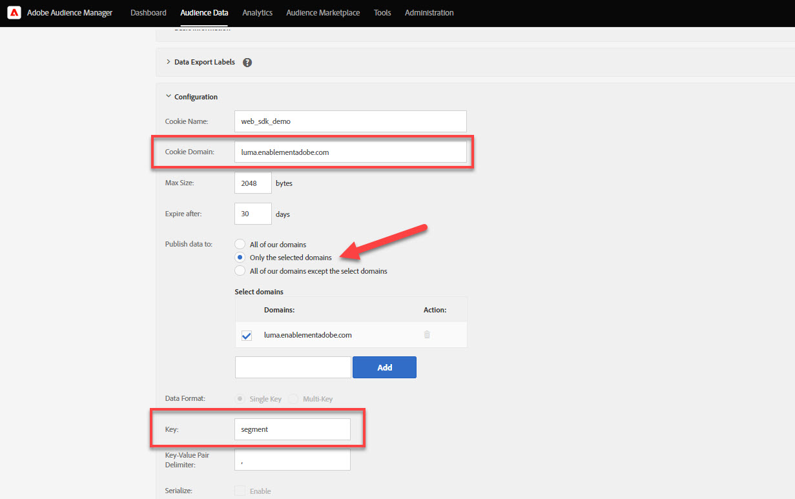

# Configurare un Audience Manager con Platform Web SDK

Scopri come configurare Adobe Audience Manager utilizzando Platform Web SDK e convalidare l’implementazione utilizzando una destinazione cookie.

[Adobe Audience Manager](https://experienceleague.adobe.com/docs/audience-manager.html?lang=it) è la soluzione di Adobe Experience Cloud che offre tutto il necessario per raccogliere informazioni rilevanti dal punto di vista commerciale sui visitatori del sito, creare segmenti commerciabili e distribuire contenuti e pubblicità mirati al pubblico giusto.

## Obiettivi di apprendimento

Alla fine di questa lezione, potrai:

* Configurare uno stream di dati per abilitare Audienci Manager
* Abilitare una destinazione cookie in Audienci Manager
* Convalida l’implementazione di Audienci Manager confermando la qualifica del pubblico con Adobi Experience Platform Debugger

## Prerequisiti

Per completare questa lezione, devi prima:

* Completa le lezioni precedenti nelle sezioni Configurazione iniziale e Configurazione tag di questa esercitazione.
* Accedi a Adobe Audience Manager e disponi delle autorizzazioni appropriate per creare, leggere e scrivere caratteristiche, segmenti e destinazioni. Per ulteriori informazioni, consulta [Controllo degli accessi basato sul ruolo di Audienci Manager](https://experienceleague.adobe.com/docs/audience-manager-learn/tutorials/setup-and-admin/user-management/setting-permissions-with-role-based-access-control.html?lang=en).

## Configurare lo stream di dati

L’implementazione di Audience Manager che utilizza Platform Web SDK è diversa dall’implementazione che utilizza [inoltro lato server (SSF)](https://experienceleague.adobe.com/docs/analytics/admin/admin-tools/server-side-forwarding/ssf.html?lang=it). L’inoltro lato server trasmette ad Audienci Manager i dati della richiesta di Adobe Analytics. Un’implementazione di Platform Web SDK trasmette i dati XDM inviati all’Edge Network di Platform all’Audience Manager. Audience Manager abilitato nello stream di dati:

1. Vai a [Raccolta dati](https://experience.adobe.com/#/data-collection){target="blank"} Interfaccia
1. Nel menu di navigazione a sinistra, seleziona **[!UICONTROL Flussi di dati]**
1. Seleziona il creato in precedenza `Luma Web SDK: Development Environment` flusso di dati

   

1. Seleziona **[!UICONTROL Aggiungi servizio]**
   
1. Seleziona **[!UICONTROL Adobe Audience Manager]** come **[!UICONTROL Servizio]**
1. Conferma che **[!UICONTROL Destinazioni cookie abilitate]** e **[!UICONTROL Destinazioni URL abilitate]** sono selezionati
1. Seleziona **[!UICONTROL Salva]**
   

## Creare un’origine dati

Quindi, crea un [Origine dati](https://experienceleague.adobe.com/docs/audience-manager/user-guide/features/data-sources/datasources-list-and-settings.html?lang=en), uno strumento fondamentale per organizzare i dati in Audienci Manager:

1. Vai a [Audience Manager](https://experience.adobe.com/#/audience-manager/) Interfaccia
1. Seleziona **[!UICONTROL Dati sul pubblico]** dalla navigazione superiore
1. Seleziona la **[!UICONTROL Origini dati]** dal menu a discesa
1. Seleziona la **[!UICONTROL Aggiungi nuovo]** nella parte superiore della pagina Origini dati

   

1. Assegna all&#39;origine dati un nome descrittivo e una descrizione. Per la configurazione iniziale, puoi denominarla `Platform Web SDK tutorial`.
1. Imposta **[!UICONTROL Tipo ID]** a **[!UICONTROL Cookie]**
1. In **[!UICONTROL Controlli sull’esportazione dei dati]** sezione, seleziona **[!UICONTROL Nessuna restrizione]**

   

1. **[!UICONTROL Salva]** Origine dati

## Creare una caratteristica

Dopo il salvataggio dell&#39;origine dati, impostare un [caratteristica](https://experienceleague.adobe.com/docs/audience-manager/user-guide/features/traits/traits-overview.html?lang=it). Le caratteristiche sono una combinazione di uno o più segnali in Audience Manager. Creare una caratteristica per i visitatori della homepage.

>[!NOTE]
>
>Tutti i dati XDM vengono inviati ad Audienci Manager se sono abilitati nello stream di dati, tuttavia i dati potrebbero richiedere 24 ore finché non sono disponibili nel rapporto Segnali non utilizzati. Crea caratteristiche esplicite per i dati XDM da utilizzare immediatamente in Audienci Manager, come descritto in questo esercizio.

1. Seleziona **[!UICONTROL Dati sul pubblico]** >  **[!UICONTROL Caratteristiche]**
1. Seleziona **[!UICONTROL Aggiungi nuovo]** >  **[!UICONTROL Basato su regole]** caratteristica

   

1. Assegna alla caratteristica un nome descrittivo e una descrizione, `Luma homepage view`
1. Seleziona la **[!UICONTROL Origine dati]** creato nella sezione precedente.
1. **[!UICONTROL Seleziona una cartella]** in cui salvare le caratteristiche nel riquadro a destra. È possibile creare una cartella tramite **selezione dell’icona +** accanto a una cartella padre esistente. Puoi denominare questa nuova cartella `Platform Web SDK tutorial`.
1. Espandi **[!UICONTROL Espressione di caratteristica]** cursore e selezione **[!UICONTROL Generatore di espressioni]** Devi fornire una coppia chiave-valore che indichi una visita alla pagina home.
1. Apri [Home page Luma](https://luma.enablementadobe.com/content/luma/us/en.html) (mappato alla proprietà tag) e **Adobe Experience Platform Debugger** e aggiorna la pagina.
1. Osserva le Richieste di rete e i dettagli dell’evento per Platform Web SDK per trovare la chiave e il valore del nome per la home page.
   
1. Torna al Generatore di espressioni nell’interfaccia utente di Audienci Manager e immetti la chiave come **`web.webPageDetails.name`** e il valore di **`content:luma:us:en`**. Questo passaggio ti assicura di attivare una caratteristica ogni volta che carichi la pagina home.
1. **[!UICONTROL Salva]** la caratteristica.

## Creare un segmento

Il passaggio successivo consiste nel creare un **segmento**, e assegna la caratteristica appena definita a questo segmento.

1. Seleziona **[!UICONTROL Dati sul pubblico]** nella navigazione in alto e seleziona **[!UICONTROL Segmenti]**
1. Seleziona **[!UICONTROL Aggiungi nuovo]** in alto a sinistra nella pagina per aprire il generatore di segmenti
1. Assegna al segmento un nome descrittivo e una descrizione, ad esempio `Platform Web SDK - Homepage visitors`
1. **[!UICONTROL Seleziona una cartella]** dove verrà salvato il segmento nel riquadro a destra. È possibile creare una cartella tramite **selezione dell’icona +** accanto a una cartella padre esistente. Puoi denominare questa nuova cartella `Platform Web SDK tutorial`.
1. Aggiungi un codice di integrazione, che in questo caso è un set casuale di numeri.
1. In **[!UICONTROL Origine dati]** sezione, seleziona **[!UICONTROL Audience Manager]** e l’origine dati creata in precedenza
1. Espandi **[!UICONTROL Caratteristiche]** e cercare la caratteristica creata
1. Seleziona **[!UICONTROL Aggiungi caratteristica]**.
1. Seleziona **[!UICONTROL Salva]** nella parte inferiore della pagina

   

   

## Creare una destinazione

Quindi, crea un **Destinazione basata su cookie** utilizzando **Generatore di destinazione**. Il Generatore di destinazioni consente di creare e gestire cookie, URL e destinazioni da server a server.

1. Apri il Generatore di destinazione selezionando. **[!UICONTROL Destinazioni]** all&#39;interno del **Dati sul pubblico** menu nella navigazione superiore
1. Seleziona **[!UICONTROL Crea destinazione]**
1. Inserire un nome e una descrizione. `Platform Web SDK tutorial`
1. Come **[!UICONTROL Categoria]**, seleziona **[!UICONTROL Personalizzato]**
1. Come **[!UICONTROL Tipo]**, seleziona **[!UICONTROL Cookie]**

   

1. Apri **[!UICONTROL Configurazione]** sezione per immettere i dettagli sulla destinazione del cookie
1. Assegna al cookie un nome descrittivo. `platform_web_sdk_tutorial`
1. Come **[!UICONTROL Dominio cookie]**, aggiungi il dominio del sito in cui stai pianificando l’integrazione, per l’esercitazione inserisci il dominio Luma, `luma.enablementadobe.com`
1. Come **[!UICONTROL Pubblica dati in]** , seleziona **[!UICONTROL Solo i domini selezionati]**
1. Seleziona il dominio se non è già stato aggiunto
1. Come **[!UICONTROL Formato dati]**, seleziona **[!UICONTROL Chiave singola]** e dai una chiave al tuo cookie. Per questo utilizzo del tutorial `segment` come valore chiave.
1. Infine, seleziona **[!UICONTROL Salva]** per salvare i dettagli della configurazione di destinazione.

   

<!--
   

   
-->

1. In **[!UICONTROL Mappature dei segmenti]** , utilizza la sezione **[!UICONTROL Cercare e aggiungere segmenti]** funzionalità per la ricerca di quelle create in precedenza `Platform Web SDK - Homepage visitors` e seleziona **[!UICONTROL Aggiungi]**.

1. Dopo aver aggiunto il segmento, viene visualizzato un pop-up in cui devi fornire un valore previsto per il cookie. Per questo esercizio, immetti il valore &quot;hpvisitor&quot;.

1. Seleziona **[!UICONTROL Salva]**

1. Seleziona **[!UICONTROL Fine]**
   

Il periodo di mappatura dei segmenti richiede alcune ore per essere attivato. Al termine, puoi aggiornare l’interfaccia Audienci Manager e verificare che il **Segmenti mappati** elenco aggiornato.

## Convalidare il segmento

Poche ore dopo la creazione iniziale del segmento, puoi verificare che funzioni correttamente.

Innanzitutto, conferma di essere idoneo per il segmento

1. Apri [Home page del sito di dimostrazione Luma](https://luma.enablementadobe.com/content/luma/us/en.html) con mappato alla proprietà tag per qualificarsi per il segmento appena creato.
1. Apri il **strumenti per sviluppatori**  > **Rete** scheda
1. Filtra la richiesta dell’SDK web di Platform tramite `interact` come filtro di testo
1. Seleziona una chiamata e apri **Anteprima** per visualizzare i dettagli della risposta
1. Espandi **payload** per visualizzare i dettagli dei cookie previsti, come configurato in precedenza in Audienci Manager. In questo esempio, verrà visualizzato il nome del cookie previsto `platform_web_sdk_tutorial`.

   

1. Apri **Applicazione** e aprire **Cookie** dal **Storage** menu.
1. Seleziona la **`https://luma.enablementadobe.com`** e confermare che il cookie sia scritto correttamente nell’elenco

   

Infine, apri il segmento nell’interfaccia Audienci Manager e assicurati che il **Popolazioni dei segmenti** ha incrementato:

Dopo aver completato questa lezione, dovresti essere in grado di vedere in che modo l’SDK web di Platform trasmette i dati a Audienci Manager e puoi impostare un cookie di prime parti specifico per il segmento con una destinazione cookie.

[Successivo: ](setup-target.md)

>[!NOTE]
>
>Grazie per aver dedicato il tuo tempo all’apprendimento di Adobe Experience Platform Web SDK. Se hai domande, vuoi condividere commenti generali o suggerimenti su contenuti futuri, condividili su questo [Experience League post di discussione community](https://experienceleaguecommunities.adobe.com/t5/adobe-experience-platform-launch/tutorial-discussion-implement-adobe-experience-cloud-with-web/td-p/444996)
