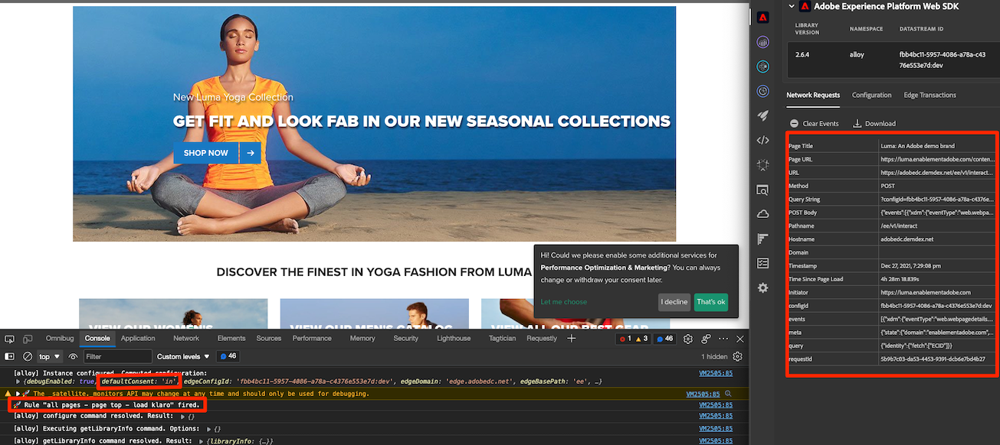
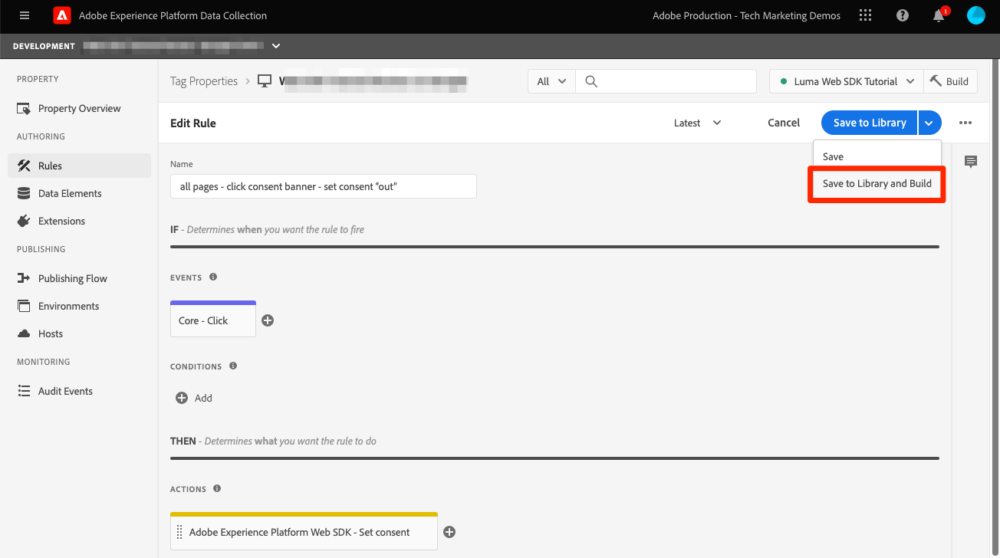
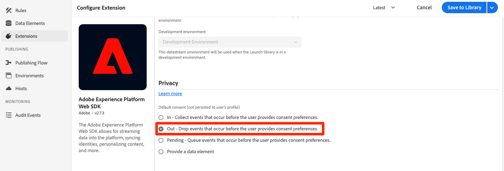

# Configurare il consenso con Platform Web SDK

Scopri come configurare le impostazioni di privacy dell’estensione tag Experienci Platform Web SDK. Imposta il consenso in base all’interazione del visitatore con un banner di una piattaforma di gestione del consenso (CMP).

>[!NOTE]
> 
>A scopo dimostrativo, questa esercitazione utilizza [Klaro](https://heyklaro.com/) come CMP. Siete invitati a seguire l&#39;utilizzo di Klaro o la CMP che usate con il vostro sito web.


## Obiettivi di apprendimento

Alla fine di questa lezione, sarai in grado di:

* Caricare una CMP utilizzando i tag
* Configurare le impostazioni della privacy nell’estensione tag Experienci Platform Web SDK
* Imposta il consenso per l’SDK per web di Experience Platform in base all’azione del visitatore

## Prerequisiti

Devi acquisire familiarità con i tag e i passaggi per creare regole, elementi di dati, creare librerie in ambienti e cambiare le librerie di tag utilizzando Experienci Platform Debugger.

Prima di iniziare a configurare le impostazioni della privacy e a creare le regole per l’impostazione del consenso, assicurati di aver inserito lo script della piattaforma di gestione del consenso sul sito web e di funzionare correttamente. Una CMP può essere caricata direttamente nel codice sorgente con l’aiuto degli sviluppatori del sito o attraverso i tag stessi. Questa lezione illustra quest&#39;ultimo approccio.
>[!NOTE]
> 
>1. Una piattaforma di gestione del consenso (o CMP) viene utilizzata dalle organizzazioni per documentare e gestire legalmente le scelte di consenso di un visitatore prima di raccogliere, condividere o vendere i dati del visitatore da fonti online come siti web e app.
>
>2. L’approccio consigliato per l’inserimento di una CMP è quello di passare direttamente attraverso il codice sorgente prima dello script di gestione dei tag.

### Configurare Klaro

Prima di passare alle configurazioni di tag, scopri di più sulla piattaforma di gestione del consenso utilizzata in questo tutorial Klaro.

1. Visita [Klaro](https://heyklaro.com/) e impostare un account.
1. Vai a **Gestione della privacy** e crea un’istanza seguendo le istruzioni.
1. Utilizza il **Codice di integrazione** per iniettare Klaro nella proprietà del tag (le istruzioni sono riportate nell’esercizio successivo).
1. Ignora **Scansione** , poiché rileverà la proprietà tag che è codificata nel sito web di dimostrazione Luma e non quella creata per questa esercitazione.
1. Aggiungi un servizio denominato `aep web sdk` e attivare **Stato predefinito del servizio**. Quando è attivata, il valore di consenso predefinito è `true`, altrimenti è `false`. Questa configurazione è utile quando desideri decidere quale sarà lo stato di consenso predefinito (prima del consenso del visitatore) per l’applicazione web. Ad esempio:
   * Per il CCPA, il consenso predefinito è solitamente impostato su `true`. State per fare riferimento a questo scenario come **Consenso implicito** in questa esercitazione
   * Per il RGPD, il consenso predefinito è comunemente impostato su `false`. State per fare riferimento a questo scenario come **Rinuncia implicita** in questa esercitazione.

<!--
    This consent value can be verified by returning the JavaScript object ```klaro.getManager().consents``` in the browser's developer console.
-->
    >[!NOTA]
    >
    >In genere, i passaggi sopra indicati vengono eseguiti e gestiti dal team o dalla persona responsabile della gestione della CMP, ad esempio OneTrust o TrustArc.

## Iniettare una CMP

>[!WARNING]
>
>La best practice per implementare una piattaforma di gestione dei consensi è in genere quella di caricare la CMP _prima di_ caricamento del gestore di tag. Per facilitare questa esercitazione, verrà caricata la CMP _con_ il gestore di tag. Questa lezione è progettata per mostrare come utilizzare le funzioni di consenso in Platform Web SDK e non deve essere utilizzata come guida per configurare correttamente Klaro o qualsiasi altra CMP.


Ora, una volta completate le configurazioni di Klaro, crea regole tag con le seguenti configurazioni:

* [!UICONTROL Nome]: `all pages - library load - Klaro`
* [!UICONTROL Evento]: [!UICONTROL Library Loaded (Page Top)] con [!UICONTROL Opzioni avanzate] > [!UICONTROL Ordine] impostato su 1
* [!UICONTROL Azione]: [!UICONTROL Codice personalizzato], [!UICONTROL Lingua]: HTML per caricare lo script CMP.


Il blocco di codice personalizzato deve essere simile al seguente:


Ora salva e genera questa regola nella libreria di sviluppo, verifica che il banner di consenso venga visualizzato cambiando la libreria di tag dal sito Luma al tuo. Dovresti visualizzare un banner CMP sul sito web, come indicato di seguito. Inoltre, per verificare l’autorizzazione del consenso del visitatore corrente, puoi utilizzare il seguente frammento di codice nella console del browser.

```javascript
    klaro.getManager().consents 
```


Per accedere alla modalità di debug, utilizza la seguente casella di controllo nel debugger di Adobe Experience Platform.


Inoltre, potrebbe essere necessario cancellare i cookie e l’archiviazione locale più volte durante l’esercitazione, poiché il valore di consenso del visitatore viene memorizzato lì. Puoi semplicemente farlo come segue:


## Scenari di consenso

Gli atti in materia di privacy come RGPD, CCPA e altri svolgono un ruolo fondamentale nel modo in cui vengono implementati i consensi. In questa lezione, esplori come un visitatore potrebbe interagire con il banner del consenso in base ai due atti sulla privacy più importanti.


### Scenario 1: consenso implicito

Il consenso implicito significa che l’azienda non deve ottenere il consenso del visitatore (o il &quot;consenso&quot;) prima di raccogliere i propri dati, e quindi tutti i visitatori del sito web vengono trattati come consenso predefinito. Tuttavia, il visitatore può rinunciare rifiutando i cookie tramite il banner di consenso. Questo caso d’uso è simile al CCPA.

Ora configurerai e implementerai il consenso per questo scenario:

1. In **[!UICONTROL Privacy]** dell&#39;estensione tag Experienci Platform Web SDK, assicurati che il  **[!UICONTROL Consenso predefinito]** è impostato su **[!UICONTROL In entrata]** :


   

   >[!NOTE]
   > 
   >Per una soluzione dinamica, seleziona l’opzione &quot;Provide a data element&quot; (Fornisci un elemento dati) e passa un elemento dati che restituisce il valore di ```klaro.getManager().consents```
   >
   >Questa opzione viene utilizzata se la CMP viene inserita nel codice sorgente *prima di* il codice di incorporamento di tag in modo che il consenso predefinito sia disponibile prima che l’estensione Experienci Platform Web SDK inizi a essere caricata. Nel nostro esempio, non è possibile utilizzare questa opzione perché la CMP è caricata con i tag e non prima dei tag.


2. Salva e genera questa modifica nella libreria tag
3. Caricare la libreria di tag nel sito di dimostrazione Luma
4. Abilita il debug dei tag durante la visita al sito Luma e ricarica la pagina. Nella console per sviluppatori del browser, dovresti notare che defaultConsent è uguale a **[!UICONTROL In entrata]**
5. Con questa configurazione, l’estensione Experienci Platform Web SDK continua a effettuare richieste di rete, a meno che un visitatore non decida di rifiutare i cookie e la rinuncia:

   


Se un visitatore decide di rinunciare (rifiutare i cookie di tracciamento), devi modificare il consenso in **[!UICONTROL Uscita]**. Modifica l’impostazione del consenso seguendo questi passaggi:

<!--
1. Create a data element to store the consent value of the visitor. Let's call it `klaro consent value`. Use the code snippet to create a custom code type data element:
    
    ```javascript
    return klaro.getManager().consents["aep web sdk"]
    ```

    


1. Create another custom code data element, `consent confirmed`, with the following snippet which returns ```true``` only after a visitor confirms consent:

    
    ```javascript
    return klaro.getManager().confirmed
    ```

    
-->

1. Crea una regola che viene attivata quando il visitatore fa clic su **Rifiuto**.  Denomina questa regola come: `all pages - click consent banner - set consent "out"`

1. Come **[!UICONTROL Evento]**, utilizza **[!UICONTROL Clic]** il **[!UICONTROL Elementi che corrispondono al selettore CSS]** `#klaro .cn-decline`

   

1. Ora, utilizza l’SDK per web di Experience Platform, [!UICONTROL Impostare il consenso] [!UICONTROL tipo di azione] per impostare il consenso come &quot;out&quot;:

   

1. Seleziona **[!UICONTROL Salva nella libreria e genera]**:

   

Ora, quando un visitatore rinuncia, la regola configurata nel modo precedente si attiva e imposta il consenso dell’SDK web come **[!UICONTROL Uscita]**.

Per eseguire la convalida, accedi al sito di dimostrazione Luma, rifiuta i cookie e verifica che non venga attivata alcuna richiesta Web SDK dopo la rinuncia.

### Scenario 2: rinuncia implicita


La rinuncia implicita significa che i visitatori devono essere trattati come rinuncia per impostazione predefinita e i cookie non devono essere impostati. Le richieste SDK per web non devono essere attivate a meno che i visitatori non decidano di dare il consenso manualmente accettando i cookie tramite il banner di consenso. Potresti dover gestire un caso d’uso di questo tipo nell’area dell’Unione Europea in cui si applica il RGPD.

Ecco come impostare la configurazione per uno scenario di rinuncia implicita:

1. In Klaro, disattiva il **Stato predefinito del servizio** nel tuo `aep web sdk` e salva la configurazione aggiornata.

1. In entrata **[!UICONTROL Privacy]** dell’estensione Experienci Platform Web SDK, imposta il consenso predefinito su **[!UICONTROL Uscita]** o **[!UICONTROL In sospeso]** secondo necessità.

   

1. **Salva** la configurazione aggiornata alla libreria tag e ricrearla.

   Con questa configurazione, Experienci Platform Web SDK garantisce che nessuna richiesta venga attivata a meno che l’autorizzazione di consenso non cambi in **[!UICONTROL In entrata]**. Ciò potrebbe verificarsi in seguito all’accettazione manuale dei cookie da parte di un visitatore che acconsente.

1. In Debugger, assicurati che il sito Luma sia mappato alla proprietà tag e che la registrazione della console tag sia attiva.
1. Usa la Developer Console del browser per **Cancella dati sito** in **Applicazione** > **Storage**

1. Ricarica il sito Luma e dovresti visualizzarlo `defaultConsent` è impostato su **[!UICONTROL Uscita]** e non è stata effettuata alcuna richiesta SDK web

   

Se un visitatore decide di dare il consenso (accettare i cookie di tracciamento), devi modificare il consenso e impostarlo su **[!UICONTROL In entrata]**. Ecco come eseguire questa operazione con una regola:

1. Crea una regola che viene attivata quando il visitatore fa clic su **Va bene.**.  Denomina questa regola come: `all pages - click consent banner - set consent "in"`

1. Come **[!UICONTROL Evento]**, utilizza **[!UICONTROL Clic]** il **[!UICONTROL Elementi che corrispondono al selettore CSS]** `#klaro .cm-btn-success`

   

1. Aggiungere un’azione tramite Experienci Platform Web SDK [!UICONTROL Estensione], **[!UICONTROL Tipo di azione]** di **[!UICONTROL Impostare il consenso]**, **[!UICONTROL Consenso generale]** as **[!UICONTROL In entrata]**.

   

   Una cosa da notare qui è che questo [!UICONTROL Impostare il consenso] L&#39;azione sarà la prima richiesta che esce e stabilisce l&#39;identità. Per questo motivo, potrebbe essere importante sincronizzare le identità alla prima richiesta. È possibile aggiungere la mappa delle identità a [!UICONTROL Impostare il consenso] mediante il passaggio di un elemento dati di tipo identità.

1. Seleziona **[!UICONTROL Salva nella libreria e genera]**:

   

1. **[!UICONTROL Salva]** la regola nella libreria e ricrearla.

Dopo aver impostato questa regola, la raccolta di eventi deve iniziare quando un visitatore acconsente.


Per ulteriori informazioni sul consenso in Web SDK, consulta [Preferenze di supporto del consenso dei clienti](https://experienceleague.adobe.com/docs/experience-platform/edge/consent/supporting-consent.html?lang=en).


Per ulteriori informazioni su [!UICONTROL Impostare il consenso] azione, vedi [Impostare il consenso](https://experienceleague.adobe.com/docs/experience-platform/edge/extension/action-types.html?lang=en#set-consent).

[Successivo: ](setup-event-forwarding.md)

>[!NOTE]
>
>Grazie per aver dedicato il tuo tempo all’apprendimento di Adobe Experience Platform Web SDK. Se hai domande, vuoi condividere commenti generali o suggerimenti su contenuti futuri, condividili su questo [Experience League post di discussione community](https://experienceleaguecommunities.adobe.com/t5/adobe-experience-platform-launch/tutorial-discussion-implement-adobe-experience-cloud-with-web/td-p/444996)
