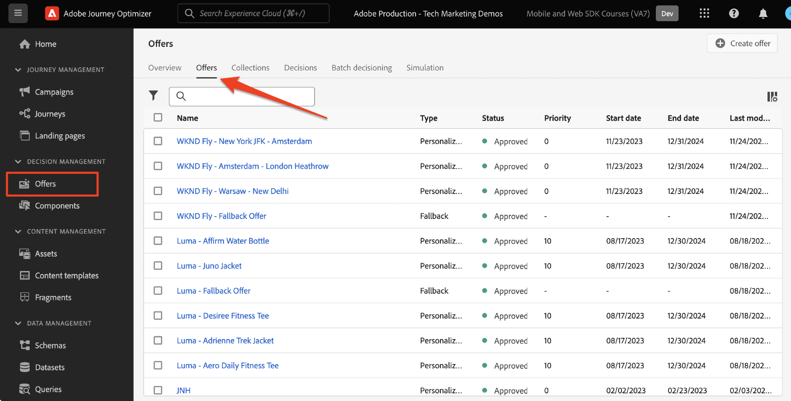

# Configurare la gestione delle decisioni con Platform Web SDK

Scopri come implementare la funzionalità di gestione delle decisioni di Adobe Journey Optimizer utilizzando Platform Web SDK. Questa guida descrive i prerequisiti fondamentali per la gestione delle decisioni, i passaggi dettagliati per la configurazione e un approfondimento del caso d’uso incentrato sullo stato di fedeltà.

Seguendo questa esercitazione, gli utenti di Journey Optimizer possono utilizzare le funzioni di gestione delle decisioni, migliorando la personalizzazione e la rilevanza delle interazioni con i clienti.


## Finalità di apprendimento

Alla fine di questa lezione, sarai in grado di:

* Acquisisci i concetti fondamentali della gestione delle decisioni in Adobe Journey Optimizer e la sua integrazione con Adobe Experience Platform Web SDK.

* Scopri la procedura dettagliata per configurare l’SDK per web, ad Offer decisioning, garantendo un’integrazione perfetta con Journey Optimizer.

* Esplora un caso d’uso dettagliato incentrato sulle offerte di stato della fedeltà, acquisendo informazioni sulla creazione e la gestione efficaci di offerte, decisioni e posizionamenti.

* Acquisisci i termini essenziali e le loro implicazioni nel framework di gestione delle decisioni.

* Comprendi l’importanza delle regole di decisione, dei qualificatori di raccolta e delle offerte di fallback nella distribuzione dell’offerta giusta all’utente giusto.

* Approfondisci argomenti avanzati come simulazioni e raccolta dati di eventi personalizzati, per testare, convalidare e migliorare i meccanismi di consegna delle offerte.

## Prerequisiti

Per completare le lezioni in questa sezione, devi prima:

* Assicurati che la tua organizzazione abbia accesso a Adobe Journey Optimizer Ultimate (Journey Optimizer e Offer Decisioning) o Adobe Experience Platform e al componente aggiuntivo Offer Decisioning.

* Completa tutte le lezioni per la configurazione iniziale di Platform Web SDK.

* Abilita la tua organizzazione per Edge Decisioning.

* Scopri come configurare un posizionamento e creare istanze degli ID posizionamento e attività nel JSON dell’ambito decisionale.

## Limitazioni

Le offerte basate su eventi non sono attualmente supportate in Adobe Journey Optimizer. Se crei una regola di decisione basata su un evento, non puoi applicarla a un’offerta.

## Concedere l’accesso alla gestione delle decisioni

Per concedere l&#39;accesso alla funzionalità di gestione delle decisioni, devi creare un **profilo di prodotto** e assegnare le autorizzazioni corrispondenti ai tuoi utenti. [Ulteriori informazioni sulla gestione di utenti e autorizzazioni di Journey Optimizer sono disponibili in questa sezione](https://experienceleague.adobe.com/en/docs/journey-optimizer/using/access-control/privacy/high-low-permissions#decisions-permissions).

## Configurare lo stream di dati

L&#39;Offer decisioning deve essere abilitato nella configurazione **datastream** prima che Platform Web SDK possa distribuire le attività di gestione delle decisioni.

Per configurare Offer Decisioning nello stream di dati:

1. Passare all&#39;interfaccia [Raccolta dati](https://experience.adobe.com/#/data-collection).

1. Nel menu di navigazione a sinistra, seleziona **Flussi di dati**.

1. Seleziona lo stream di dati Luma Web SDK creato in precedenza.

   

1. Seleziona **Modifica** all&#39;interno del **Servizio Adobe Experience Platform**.

   

1. Selezionare la casella **Offer decisioning**.

   

1. Seleziona **Salva**.

In questo modo gli eventi in entrata per Journey Optimizer verranno gestiti correttamente da **Adobe Experience Platform Edge**.

## Configurare l’SDK per la gestione delle decisioni

La gestione delle decisioni richiede passaggi SDK aggiuntivi, a seconda del tipo di implementazione dell’SDK web. Sono disponibili due opzioni per configurare l’SDK per la gestione delle decisioni.

* Installazione autonoma SDK
   1. Configurare l&#39;azione `sendEvent` con `decisionScopes`.

      ```javascript
      alloy("sendEvent", {
         ...
         "decisionScopes": [
            "[DECISION SCOPE 1]",
            "[DECISION SCOPE 2]"
         ]
      })
      ```

* Installazione dei tag SDK
   1. Passa all’interfaccia di Data Collection.

   1. Nel menu di navigazione a sinistra, seleziona **Tag**.

      

   1. Selezionare la **proprietà tag**.

   1. Crea le **regole**.
      * Aggiungi un Platform Web SDK **Invia azione evento** e aggiungi `decisionScopes` pertinente alla configurazione di tale azione.

   1. Crea e pubblica una **Libreria** contenente tutte le **Regole**, **Elementi dati** e **Estensioni** pertinenti che hai configurato.

## Terminologia

Innanzitutto, devi comprendere la terminologia utilizzata nell’interfaccia di Gestione delle decisioni.

* **Limitazione**: vincolo che determina la frequenza con cui viene visualizzata un&#39;offerta. Due tipi:
   * Limiti totali: il numero massimo di volte in cui un’offerta può essere visualizzata nel pubblico di destinazione.
   * Limite profilo: orari in cui è possibile mostrare un’offerta a un particolare utente.
* **Raccolte**: sottoinsiemi di offerte raggruppati per condizioni specifiche impostate da un addetto marketing, ad esempio una categoria di offerte.
* **Decisione**: logica che determina la scelta di un&#39;offerta.
* **Regola di decisione**: vincoli sulle offerte per scoprire l&#39;idoneità di un utente.
* **Offerta idonea**: un&#39;offerta che corrisponde ai vincoli predefiniti e che può essere mostrata a un utente.
* **Gestione delle decisioni**: il sistema di creazione e distribuzione di offerte personalizzate utilizzando la logica di business e le regole decisionali.
* **Offerte di fallback**: l&#39;offerta predefinita visualizzata quando un utente non è idoneo per nessuna offerta in una raccolta.
* **Offerta**: un messaggio di marketing con potenziali regole di idoneità che ne determinano i visualizzatori.
* **Libreria di offerte**: archivio centrale che gestisce offerte, decisioni e regole associate.
* **Offerte personalizzate**: messaggi di marketing personalizzati in base ai vincoli di idoneità.
* **Posizionamenti**: impostazione o scenario in cui un&#39;offerta viene visualizzata a un utente.
* **Priorità**: metrica di classificazione per le offerte che considera vari vincoli come l&#39;idoneità e il limite.
* **Rappresentazioni**: informazioni specifiche per il canale, ad esempio posizione o lingua, che guidano la visualizzazione di un&#39;offerta.

## Panoramica del caso d’uso: premi fedeltà

In questa lezione viene implementato un caso di utilizzo di esempio dei premi fedeltà per comprendere la gestione delle decisioni tramite Web SDK.

Questo caso d’uso consente di comprendere meglio in che modo Journey Optimizer può contribuire a fornire la migliore offerta ai clienti, utilizzando la libreria di offerte centralizzata e il motore decisionale per la gestione delle decisioni.

>[!NOTE]
>
> Poiché questo tutorial è destinato agli implementatori, vale la pena notare che questa lezione richiede un notevole lavoro sull’interfaccia in Journey Optimizer. Anche se tali attività di interfaccia sono in genere gestite dagli esperti di marketing, può essere utile che i responsabili dell’implementazione possano acquisire informazioni approfondite sul processo, anche se non sono responsabili della creazione di campagne di gestione delle decisioni nel lungo periodo.

## Componenti

Prima di iniziare a creare le offerte, devi definire diversi componenti prerequisiti.

### Creare un posizionamento per le offerte fedeltà

**I posizionamenti** sono contenitori utilizzati per mostrare le offerte. In questo esempio, crei un posizionamento nella parte superiore del sito Luma.

L&#39;elenco dei posizionamenti è accessibile nel menu **Componenti**. I filtri sono disponibili per aiutarti a recuperare i posizionamenti in base a un canale o a un contenuto specifico.


Per creare il posizionamento, effettuate le seguenti operazioni:

1. Fai clic su **Crea posizionamento**.

   

1. Definite le proprietà del posizionamento:
   * **Nome**: nome del posizionamento. Chiamiamo il posizionamento di esempio *&#39;Banner homepage&#39;*.
   * **Tipo di canale**: il canale per il quale viene utilizzato il posizionamento. Usiamo *&#39;Web&#39;* poiché le offerte sono visualizzate sul sito Web Luma.
   * **Tipo di contenuto**: tipo di contenuto che il posizionamento può visualizzare: Testo, HTML, Collegamento immagine o JSON. È possibile utilizzare *&#39;HTML&#39;* per l&#39;offerta.
   * **Descrizione**: descrizione del posizionamento (facoltativo).

   

1. Fai clic su **Salva**.
1. Una volta creato, il posizionamento viene visualizzato nell’elenco dei posizionamenti.
1. Seleziona la riga contenente il nuovo posizionamento e prendi nota dell’ID posizionamento, in quanto potrebbe essere necessario per la configurazione all’interno dell’ambito decisionale.

   

### Regole di decisione per lo stato di fedeltà

**Le regole di decisione** specificano le condizioni in cui vengono presentate le offerte. In questo esempio, puoi creare regole di decisione per distribuire offerte diverse a seconda dello stato di Fedeltà di un utente.

L&#39;elenco delle regole di decisione è accessibile nel menu **Componenti**.

Per creare le regole di decisione, segui questi passaggi:

1. Passare alla scheda **Regole** e fare clic su **Crea regola**.

   

1. Denominiamo la prima regola &#39;*Regola di stato di fedeltà Gold*&#39;. Puoi utilizzare i campi XDM per definire la regola. Il Generatore di segmenti **di Adobe Experience Platform** è un&#39;interfaccia intuitiva che è possibile utilizzare per creare le condizioni della regola.

   

1. Fai clic su **Salva** per confermare la condizione della regola.
1. La nuova regola &#39;*Gold Loyalty Status*&#39; salvata verrà visualizzata nell&#39;elenco delle **regole**. Selezionala per visualizzarne le proprietà.

   

1. Ora crea le condizioni della regola di offerta fedeltà rimanenti per il caso d’uso.


### Qualificatori raccolta

**I qualificatori di raccolta** ti consentono di organizzare e cercare facilmente le offerte all&#39;interno della libreria di offerte. In questo esempio, aggiungi i qualificatori di raccolta alle offerte di premi fedeltà per migliorare l’organizzazione dell’offerta.

L&#39;elenco dei qualificatori di raccolta è accessibile nel menu **Componenti**.

Per creare il qualificatore per la raccolta Premi fedeltà, effettua le seguenti operazioni:

1. Passare alla scheda **Qualificatori raccolta** e fare clic su **Crea qualificatore raccolta**.

   

1. Denominiamo il qualificatore della raccolta &#39;*Premi fedeltà*&#39;

   

1. Il nuovo qualificatore di raccolta deve ora essere visualizzato nella scheda **Qualificatore raccolta**

## Offerte

Ora è il momento di creare le offerte di Premi fedeltà.

L&#39;elenco delle offerte è accessibile nel menu **Offerte**.




### Creazione di offerte per diversi livelli di fedeltà

Inizia creando offerte personalizzate per i diversi livelli di fedeltà Luma.

Per creare la prima **offerta**, eseguire la procedura seguente:

1. Fai clic su **Crea offerta**, quindi seleziona **Offerta personalizzata**.

1. Chiamiamo la prima offerta &#39;*Livello fedeltà Luma - Oro*&#39;. È necessario specificare una data e un’ora di inizio/fine per questa offerta. È inoltre necessario associare il qualificatore **raccolta** &#39;*Premi fedeltà*&#39; all&#39;offerta, per organizzarla meglio nella **Libreria offerte**. In seguito, fai clic su **Avanti**.

   

1. Ora devi aggiungere **rappresentazioni** per definire dove viene visualizzata l&#39;offerta. Scegli il **canale Web**. Scegli anche il &#39;*Banner homepage*&#39; **posizionamento** configurato in precedenza. Il **posizionamento** selezionato è di tipo HTML, quindi puoi aggiungere contenuto HTML, JSON o TEXT direttamente all&#39;editor per creare l&#39;offerta utilizzando il pulsante di opzione **Personalizzato**.

   

1. Modifica il contenuto dell&#39;offerta direttamente con **Expression Editor**. Ricorda che puoi aggiungere contenuti HTML, JSON o TEXT a questo posizionamento. Assicurati di selezionare la **modalità** corretta nella parte inferiore dell&#39;editor, a seconda del tipo di contenuto. Puoi anche premere **validate** per verificare che non vi siano errori.

   

1. Inoltre, puoi utilizzare l’editor espressioni per recuperare gli attributi memorizzati in Adobe Experience Platform. Aggiungiamo il nome di un profilo al contenuto dell’offerta per personalizzarlo meglio per i membri fedeltà su un livello 1:1.

   

1. Aggiungi vincoli per mostrare l&#39;offerta solo ai profili idonei per la regola &#39;*Stato fedeltà oro*&#39;.

   

1. Dopo aver esaminato l&#39;offerta, fare clic su **Fine**. Seleziona **Salva e approva**.

Ora crea il resto delle offerte per i vari livelli di fedeltà Luma

### Offerte di fallback

Desideri comunque distribuire un’offerta ai visitatori del sito Luma non fedeltà. A questo scopo, puoi configurare un&#39;offerta di **fallback** per la campagna.

Per creare l’offerta di fallback, effettua le seguenti operazioni:

1. Fai clic su **Crea offerta**, quindi seleziona **Offerta di fallback**.
   <!--
      
   -->
1. Chiamiamo l&#39;offerta di fallback &#39;*Fedeltà non Luma*&#39;. È inoltre possibile associare il qualificatore **raccolta**, &#39;*Premi fedeltà*&#39; creato in precedenza all&#39;offerta di fallback per semplificare l&#39;organizzazione delle offerte.
   <!--
      
   -->
1. Aggiungi il contenuto dell&#39;offerta di fallback all&#39;**editor espressioni**. Ricorda che puoi aggiungere contenuto HTML, JSON o TEXT a questo posizionamento. Assicurati di selezionare la **modalità** corretta nella parte inferiore dell&#39;editor, a seconda del tipo di contenuto. Puoi anche premere **validate** per verificare che non vi siano errori.
   <!--
      
   -->
1. Se tutto è configurato correttamente, premi **Fine**, quindi **Salva e approva**.
<!--
   
-->

## Decisioni

**Decisioni** sono contenitori per le offerte che scelgono la migliore offerta disponibile per un cliente, a seconda della destinazione.

L&#39;elenco delle decisioni è disponibile nella scheda **Decisioni** del menu **Offerte**.
<!--
   
-->

### Creazione di una decisione per le offerte fedeltà

Creiamo una decisione per il caso d’uso Luma Loyalty Rewards.

Per creare la decisione, segui questi passaggi:

1. Fai clic su **Crea decisione**.
   <!--
      
   -->
1. Chiamiamo la decisione &#39;*Offerte fedeltà Luma dicembre*&#39;. Le offerte devono avere una durata di 1 mese, quindi specifichiamole qui.
   <!--
      
   -->
1. Ora devi definire gli **ambiti decisionali**. Selezionate un posizionamento. È possibile utilizzare il banner &#39;*Homepage*&#39; creato in precedenza.
   <!--
      
   -->
1. Successivamente è necessario aggiungere **criteri di valutazione** per l&#39;ambito della decisione. Fai clic su **Aggiungi** e scegli la raccolta &#39;*Premi fedeltà*&#39; creata in precedenza **contenente tutte le offerte fedeltà da considerare.
   <!--
      
   -->
1. All&#39;interno della raccolta &#39;*Premi fedeltà*&#39;, puoi utilizzare il campo di idoneità per limitare la consegna dell&#39;offerta a un sottoinsieme di visitatori Luma. Tuttavia, per questo caso d’uso desideri che ogni visitatore riceva una delle offerte. Ricorda che hai configurato una **offerta di fallback** per tutti i visitatori non fidelizzati. Imposta l’idoneità su &quot;Nessuno&quot;.
   <!--
      
   -->
1. Inoltre, puoi utilizzare il campo **metodo di classificazione** per selezionare l&#39;offerta migliore per ogni visitatore Luma, se più offerte sono idonee per la combinazione utente/posizionamento. Per questo caso d&#39;uso, puoi utilizzare il metodo **Priorità offerta**, che utilizza i valori definiti nelle offerte per fornire l&#39;offerta migliore.
   <!--
      
   -->
1. Aggiungere ora l&#39;**offerta di fallback** alla decisione. Promemoria del fatto che l’offerta di fallback è l’offerta predefinita visualizzata ai visitatori Luma se non rientrano in nessuno dei tipi di pubblico Fedeltà Luma. Seleziona &#39;*Fedeltà non Luma*&#39; dall&#39;elenco delle offerte di fallback disponibili per il posizionamento &#39;*Banner homepage*&#39;.
   <!--
      
   -->
1. Prima di attivare la decisione, esaminiamo l’ambito della decisione, le offerte di fallback, l’anteprima delle offerte disponibili e stimiamo i profili qualificati. Quando tutto sarà pronto, puoi fare clic su **Fine** e **Salva e attiva**.
<!--
   
-->

## Simulazioni

Come best practice, è necessario convalidare la logica decisionale relativa alla fedeltà Luma per garantire che le offerte corrette siano consegnate al pubblico di fidelizzazione giusto. Puoi eseguire questa convalida utilizzando **profili di test**. È inoltre consigliabile testare le modifiche apportate alle offerte tramite i profili di test prima di inviare nuove versioni di offerta alla produzione.

Per iniziare il test, seleziona la scheda **Simulazioni** dal menu **Offerte**.

### Verifica delle offerte fedeltà

1. Seleziona un profilo di test da utilizzare per la simulazione. Fare clic su **Gestisci profilo**. [Per creare o designare un nuovo profilo di test per il test delle offerte, seguire questa guida](https://experienceleague.adobe.com/en/docs/journeys/using/building-journeys/about-journey-building/creating-test-profiles#create-test-profiles-csv).
   <!--
      
   -->
1. Aggiungi uno o più profili di test alla simulazione e salva la selezione. Per il test del caso d’uso, assicurati di disporre di profili di test configurati per ogni pubblico di premi fedeltà Luma.
   <!--
      
   -->
1. Seleziona l’ambito della decisione da testare. Selezionare **Aggiungi ambito decisione**.
   <!--
      
   -->
1. Selezionare il posizionamento &#39;*Banner homepage*&#39; creato in precedenza.
   <!--
      
   -->
1. Vengono visualizzate le decisioni disponibili, seleziona la decisione &#39;*Offerte fedeltà Luma di dicembre*&#39; creata in precedenza e fai clic su **Aggiungi**.
   <!--
      
   -->
1. Dopo aver selezionato un profilo di test, fare clic su **Visualizza risultati**. La migliore offerta disponibile viene visualizzata nel profilo di test selezionato per la decisione &#39;*Offerte fedeltà Luma di dicembre*&#39;.
   <!--
      
   -->
1. Selezionare un profilo di test diverso e fare clic su **Visualizza risultati**. Idealmente, dovresti vedere un’offerta simulata diversa, corrispondente al livello di fedeltà del profilo di test.

## Convalida della gestione delle decisioni tramite Adobe Experience Platform Debugger

L&#39;estensione **Adobe Experience Platform Debugger**, disponibile sia per Chrome che per Firefox, analizza le pagine Web per identificare i problemi nell&#39;implementazione delle soluzioni Adobe Experience Cloud.

Puoi utilizzare il debugger sul sito Luma per convalidare la logica decisionale in produzione. Questa convalida è una buona pratica una volta che il caso di utilizzo dei premi fedeltà è attivo e in esecuzione, per garantire che tutto sia configurato correttamente.

[Scopri come configurare il debugger nel browser utilizzando la guida qui](https://experienceleague.adobe.com/en/docs/platform-learn/data-collection/debugger/overview).

Per iniziare la convalida tramite il debugger:

1. Passa alla pagina web Luma con il posizionamento dell’offerta.
   <!--
      
   -->
1. Nella pagina Web, apri **Adobe Experience Platform debugger**.
   <!--
      
   -->
1. Passa a **Riepilogo**. Verificare che l&#39;**ID Datastream** corrisponda allo **stream di dati** nella **Raccolta dati di Adobe** per la quale è stato abilitato Offer Decisioning.
   <!--
      
   -->
1. In **Soluzioni** passa a **Experience Platform Web SDK**.
   <!--
      
   -->
1. Nella scheda **Configurazione**, attiva **Abilita debug**. In questo modo viene abilitata la registrazione per la sessione in una sessione di **Adobe Experience Platform Assurance**.
   <!--
      
   -->
1. Puoi quindi accedere al sito con vari account fedeltà Luma e utilizzare il debugger per convalidare le richieste inviate alla **rete Adobe Experience Platform Edge**. Tutte queste richieste devono essere acquisite in **Assurance** per il tracciamento del registro.
<!--
   
-->

[Successivo: ](setup-consent.md)

>[!NOTE]
>
>Grazie per aver dedicato il tuo tempo all’apprendimento di Adobe Experience Platform Web SDK. Se hai domande, vuoi condividere commenti generali o suggerimenti su contenuti futuri, condividili in questo [Experience League post di discussione della community](https://experienceleaguecommunities.adobe.com/t5/adobe-experience-platform-data/tutorial-discussion-implement-adobe-experience-cloud-with-web/td-p/444996)
