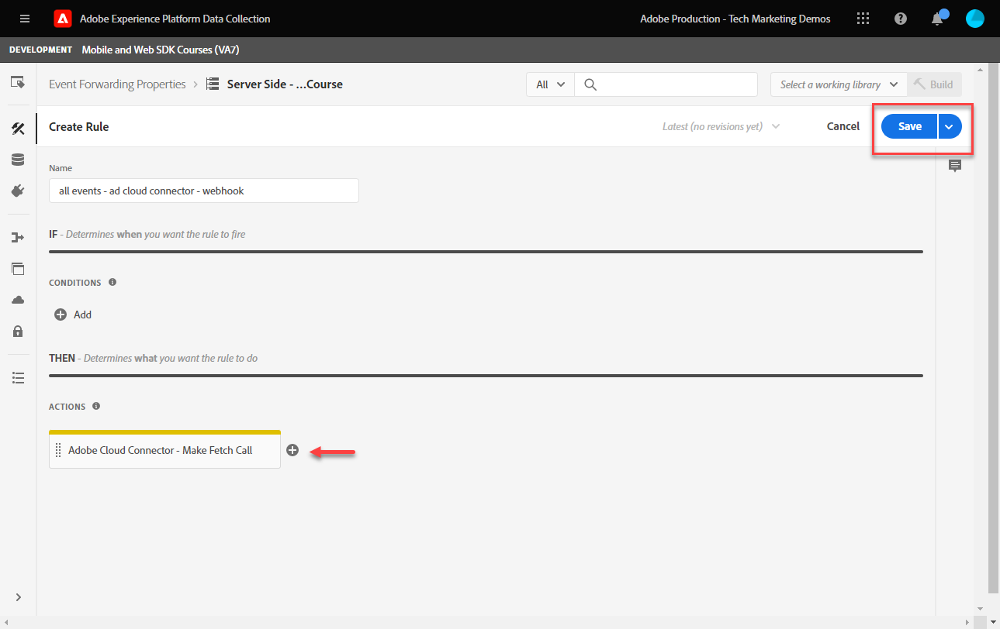

# Configurare l’inoltro degli eventi con i dati di Platform Web SDK

Scopri come utilizzare l’inoltro degli eventi con i dati di Adobe Experience Platform Web SDK.

L’inoltro degli eventi è un nuovo tipo di proprietà disponibile in Raccolta dati. L’inoltro degli eventi consente di inviare dati a fornitori di terze parti non Adobe direttamente dall’Edge Network di Adobe Experience Platform invece del browser tradizionale lato client. Ulteriori informazioni sui vantaggi dell&#39;inoltro degli eventi nella [Panoramica sull&#39;inoltro degli eventi](https://experienceleague.adobe.com/it/docs/experience-platform/tags/event-forwarding/overview).

Per utilizzare l’inoltro degli eventi in Adobe Experience Platform, i dati devono essere inviati prima a Adobe Experience Platform Edge Network utilizzando una o più delle tre opzioni seguenti:

* [Adobe Experience Platform Web SDK](overview.md)
* [Adobe Experience Platform Mobile SDK](https://developer.adobe.com/client-sdks/home/)
  <!--* [Server-to-Server API](https://experienceleague.adobe.com/it/docs/audience-manager/user-guide/api-and-sdk-code/dcs/dcs-apis/dcs-s2s)-->

>[!NOTE]
>Platform Web SDK e Platform Mobile SDK non richiedono la distribuzione tramite tag, tuttavia si consiglia di utilizzare i tag per distribuire questi SDK.

Dopo aver completato le lezioni precedenti in questa esercitazione, dovresti inviare dati a Platform Edge Network utilizzando il Web SDK. Una volta che i dati sono in Platform Edge Network, puoi abilitare l’inoltro degli eventi e utilizzare una proprietà di inoltro degli eventi per inviare dati a soluzioni non Adobe.

## Obiettivi di apprendimento

Alla fine di questa lezione, sarai in grado di:

* Creare una proprietà di inoltro degli eventi
* Collegare una proprietà di inoltro eventi a uno stream di dati di Platform Web SDK
* Comprendere le differenze tra elementi dati e regole della proprietà tag e elementi dati e regole della proprietà di inoltro eventi
* Creare un elemento dati per l’inoltro degli eventi
* Configurare una regola per l’inoltro degli eventi
* Convalidare una proprietà di inoltro eventi sta inviando correttamente i dati

## Prerequisiti

* Licenza software che include l&#39;inoltro di eventi. L’inoltro di eventi è una funzione a pagamento di Data Collection. Per ulteriori informazioni, contatta il team del tuo account di Adobe.
* L’inoltro degli eventi è abilitato nell’organizzazione Experience Cloud.
* Autorizzazione utente per l’inoltro di eventi. (In [Admin Console](https://adminconsole.adobe.com/), nel prodotto Adobe Experience Platform Launch, elementi di autorizzazione per [!UICONTROL Piattaforme] > [!UICONTROL Edge] e tutti [!UICONTROL Diritti proprietà]). Una volta concesso, dovresti visualizzare [!UICONTROL Inoltro eventi] nell&#39;area di navigazione a sinistra dell&#39;interfaccia di Data Collection:
  

* Adobe Experience Platform Web o Mobile SDK è configurato per inviare dati ad Edge Network. Devi aver completato le seguenti lezioni di questa esercitazione:

   * Configurazione iniziale

      * [Configurare uno schema XDM](configure-schemas.md)
      * [Configurare uno spazio dei nomi delle identità](configure-identities.md)
      * [Configurare uno stream di dati](configure-datastream.md)

   * Configurazione tag

      * [Installare l’estensione Web SDK](install-web-sdk.md)
      * [Creare elementi dati](create-data-elements.md)
      * [Creare identità](create-identities.md)
      * [Creare regole di tag](create-tag-rule.md)
      * [Convalida con Adobe Experience Platform Debugger](validate-with-debugger.md)

## Creare una proprietà di inoltro degli eventi

Per prima cosa, crea una proprietà di inoltro degli eventi:

1. Apri l&#39;interfaccia di [Data Collection](https://experience.adobe.com/#/data-collection)
1. Seleziona **[!UICONTROL Inoltro eventi]** dal menu di navigazione a sinistra
1. Seleziona **[!UICONTROL Nuova proprietà]**.
   

1. Denomina la proprietà. In questo caso, `Server-Side - Web SDK Course`

1. Seleziona **[!UICONTROL Salva]**.
   

## Configurare lo stream di dati

Affinché l’inoltro degli eventi possa utilizzare i dati inviati a Platform Edge Network, è necessario collegare la proprietà di inoltro degli eventi appena creata allo stesso flusso di dati utilizzato per inviare i dati alle soluzioni Adobe.

Per configurare Target nello stream di dati:

1. Vai all&#39;interfaccia [Raccolta dati](https://experience.adobe.com/#/data-collection){target="blank"}
1. Nel menu di navigazione a sinistra, seleziona **[!UICONTROL Flussi di dati]**
1. Seleziona lo stream di dati `Luma Web SDK: Development Environment` creato in precedenza

   

1. Seleziona **[!UICONTROL Aggiungi servizio]**
   
1. Seleziona **[!UICONTROL Inoltro eventi]** come **[!UICONTROL Servizio]**

1. Nel menu a discesa **[!UICONTROL ID proprietà]**, seleziona il nome assegnato alla proprietà di inoltro degli eventi, in questo caso `Server-Side - Web SDK Course`

1. Nel menu a discesa **[!UICONTROL ID ambiente]**, seleziona l&#39;ambiente di tag a cui stai collegando l&#39;ambiente di inoltro degli eventi, in questo caso `Development`

   >[!TIP]
   >
   >    Per inviare i dati a un ambiente di inoltro degli eventi che si trova all&#39;esterno dell&#39;organizzazione Adobe, selezionare **[!UICONTROL Immetti manualmente gli ID]** e incollali in un ID. L’ID viene fornito quando crei una proprietà di inoltro degli eventi.

1. Seleziona **[!UICONTROL Salva]**.

   

Ripeti questi passaggi per gli stream di dati di staging e produzione quando sei pronto per promuovere le modifiche tramite il flusso di pubblicazione.

## Inoltrare dati da Platform Edge Network a una soluzione non Adobe

In questo esercizio imparerai a impostare un elemento dati per l&#39;inoltro degli eventi, configurare una regola per l&#39;inoltro degli eventi e convalidare utilizzando uno strumento di terze parti denominato [Webhook.site](https://webhook.site/).

>[!NOTE]
>
>Un webhook è un modo per integrare diversi sistemi in tempo semi-reale. [Webhook.site](https://webhook.site/) è uno strumento di terze parti che consente di verificare, testare e automatizzare facilmente (con il generatore di azioni personalizzate visive o WebhookScript) eventuali richieste HTTP o messaggi di posta elettronica in arrivo.

>[!IMPORTANT]
>
>Per procedere ulteriormente, devi aver già creato e mappato elementi dati su un oggetto XDM, nonché configurato regole di tag e creato tali modifiche all’interno di una libreria in un ambiente di tag. In caso contrario, consulta i passaggi **Configurazione tag** nella sezione [prerequisiti](setup-event-forwarding.md#prerequisites). Questi passaggi assicurano che i dati vengano inviati a Platform Edge Network e da lì puoi configurare una proprietà di inoltro degli eventi per inoltrare i dati a una soluzione non Adobe.

### Creare un elemento dati per l’inoltro degli eventi

L’oggetto XDM configurato in precedenza utilizzando l’estensione tag Platform Web SDK diventa l’origine dati per gli elementi dati in una proprietà di inoltro degli eventi. Come origine dati per l’inoltro degli eventi puoi utilizzare gli stessi dati già configurati nella proprietà tag.

>[!IMPORTANT]
>
>Esiste una differenza di sintassi chiave quando si fa riferimento a campi XDM nell’inoltro degli eventi rispetto ad altri contesti. Per fare riferimento ai dati in una proprietà di inoltro degli eventi, il percorso dell&#39;elemento dati deve includere il prefisso `arc.event`:
>
> * `arc` sta per Adobe Response Context (Contesto di risposta Adobe).
> * Ad esempio: `arc.event.xdm.web.webPageDetails.URL`
>
>Se il percorso specificato non è corretto, i dati non vengono raccolti.

In questo esercizio, inoltrerai l’altezza del riquadro di visualizzazione del browser e l’Experience Cloud ID dall’oggetto XDM a un webhook. Il percorso del campo XDM è determinato dallo schema XDM creato durante la lezione [Configurare uno schema XDM](configure-schemas.md).

>[!TIP]
>
>Puoi anche trovare il percorso dell&#39;oggetto XDM utilizzando gli strumenti di rete del browser Web, filtrando per `/ee` richieste, aprendo il beacon [!UICONTROL **Payload**] ed eseguendo il drilling verso il basso alla variabile cercata. Quindi fare clic con il pulsante destro del mouse e selezionare &quot;Copia percorso proprietà&quot;. Di seguito è riportato un esempio per l’altezza del riquadro di visualizzazione del browser:
>&#x200B;> 

1. Vai alla proprietà **[!UICONTROL Inoltro eventi]** creata di recente

1. Nel menu di navigazione a sinistra, seleziona **[!UICONTROL Elementi dati]**

1. Seleziona per **[!UICONTROL creare un nuovo elemento dati]**

   

1. **[!UICONTROL Denomina]** l&#39;elemento dati `environment.browserDetails.viewportHeight`

1. In **[!UICONTROL Estensione]**, lascia `CORE`

1. In **[!UICONTROL Tipo elemento dati]**, selezionare `Path`

1. Digitare il percorso dell&#39;oggetto XDM che contiene l&#39;altezza del riquadro di visualizzazione del browser `arc.event.xdm.environment.browserDetails.viewportHeight`

1. Seleziona **[!UICONTROL Salva]**

   

1. Creare un altro elemento dati

1. **[!UICONTROL Nome]** `ecid`

1. In **[!UICONTROL Estensione]**, lascia `CORE`

1. In **[!UICONTROL Tipo elemento dati]**, selezionare `Path`

1. Digitare il percorso dell&#39;oggetto XDM che contiene l&#39;ID Experience Cloud `arc.event.xdm.identityMap.ECID.0.id`

1. Seleziona **[!UICONTROL Salva]**

   

   >[!CAUTION]
   >
   > Assicurarsi di includere il prefisso `arc.event.` nel percorso. Inoltre, accertati di seguire la stessa maiuscola del nome del campo Oggetto XDM: lo spazio dei nomi ECID deve essere in maiuscolo.

   >[!TIP]
   >
   >Quando lavori con il tuo sito web, puoi trovare il percorso dell&#39;oggetto XDM con gli strumenti di rete del browser web, filtrare `/ee` richieste, aprire il beacon [!UICONTROL **Payload**] ed espandere la variabile che stai cercando. Quindi fare clic con il pulsante destro del mouse e selezionare &quot;Copia percorso proprietà&quot;. Di seguito è riportato un esempio per l’altezza del riquadro di visualizzazione del browser:
   > 

### Installare l’estensione Adobe Cloud Connector

Per inviare dati a percorsi di terze parti, installi prima l&#39;estensione [!UICONTROL Adobe Cloud Connector].

1. Seleziona **[!UICONTROL Estensioni]** nel menu di navigazione a sinistra

1. Seleziona la scheda **[!UICONTROL Catalogo]**

1. Cerca il **[!UICONTROL connettore Adobe Cloud]**, seleziona **[!UICONTROL Installa]**

   

Non è necessaria alcuna configurazione di estensione. Con questa estensione, ora puoi inoltrare i dati a una soluzione non Adobe.

### Creare una regola per l’inoltro degli eventi

Esistono alcune differenze principali tra la configurazione delle regole in una proprietà tag e una regola in una proprietà di inoltro eventi:

* **[!UICONTROL Eventi] e [!UICONTROL Condizioni]**:

   * **Tag**: tutte le regole vengono attivate da un evento che deve essere specificato nella regola, ad esempio `Library Loaded - Page Top`. Le condizioni sono facoltative.
   * **Inoltro eventi**: si presume che ogni evento inviato a Platform Edge Network sia un trigger per l&#39;inoltro di dati. Non ci sono quindi [!UICONTROL Eventi] da selezionare nelle regole di inoltro degli eventi. Per gestire gli eventi che attivano una regola di inoltro degli eventi, è necessario configurare le condizioni.

* **Tokenizzazione elemento dati**:

   * **Tag**: i nomi degli elementi dati sono tokenizzati con un simbolo `%` all&#39;inizio e alla fine del nome quando vengono utilizzati in una regola. Ad esempio, `%viewportHeight%`.

   * **Inoltro eventi**: i nomi degli elementi dati sono tokenizzati con `{{` all&#39;inizio e `}}` alla fine del nome quando vengono utilizzati in una regola. Ad esempio, `{{viewportHeight}}`.

* **Sequenza di azioni della regola**:

   * La sezione Azioni di una regola di inoltro degli eventi viene sempre eseguita in sequenza. Quando salvi una regola, assicurati che l’ordine delle azioni sia corretto. Questa sequenza di esecuzione non può essere eseguita in modo asincrono come con i tag.

<!--
  * **Tags**: Rule actions can easily be reordered using drag-and-drop functionality.
  * **Event forwarding**: Rule actions are always executed sequentially. Make sure the order of actions is correct when you save a rule.
-->

Per configurare una regola per l’inoltro di dati al webhook, devi prima ottenere il webhook personale:

1. Vai a [Webhook.site](https://webhook.site)

1. Trova **l&#39;URL univoco**, utilizzalo come richiesta URL nella regola di inoltro degli eventi

1. Seleziona **[!UICONTROL Copia negli Appunti]**

1. Lascia aperta questa finestra perché potrai convalidare i dati di inoltro degli eventi in tempo reale acquisiti da Webhook

   

1. Torna indietro **[!UICONTROL Raccolta dati]** > **[!UICONTROL Inoltro eventi]** > **[!UICONTROL Regole]** dalla navigazione a sinistra

1. Seleziona **[!UICONTROL Crea nuova regola]**

   

1. Denomina `all events - ad cloud connector - webhook`

1. Aggiungi un&#39;azione

1. In **[!UICONTROL Estensione]**, seleziona **[!UICONTROL Connettore cloud Adobe]**

1. In **[!UICONTROL Tipo azione]**, seleziona **[!UICONTROL Esegui chiamata di recupero]**

1. Incolla l&#39;URL del webhook nel campo **[!UICONTROL URL]**

   

1. In **[Parametri query]** verranno aggiunti entrambi gli elementi dati creati in precedenza.

1. Nella **[!UICONTROL Chiave]** tipo di colonna in `viewPortHeight`. Nella colonna **[!UICONTROL Valore]** immettere l&#39;elemento dati `{{environment.browserDetails.viewportHeight}}` digitandolo o selezionandolo dall&#39;icona del selettore dell&#39;elemento dati

1. Seleziona [!UICONTROL **+ Aggiungi altro**] per aggiungere un altro parametro di query

1. Nella **[!UICONTROL Chiave]** tipo di colonna in `ecid`. Nella colonna Valore immettere l&#39;elemento dati `{{ecid}}`

1. Seleziona **[!UICONTROL Mantieni modifiche]**

   

1. La regola dovrebbe essere simile a quella riportata di seguito

1. Seleziona **[!UICONTROL Salva]**

   

### Creare e generare la libreria

Crea una libreria e crea tutte le modifiche nell’ambiente di sviluppo per l’inoltro degli eventi come si farebbe normalmente in una proprietà tag.

>[!NOTE]
>
>Se non hai collegato le proprietà di inoltro degli eventi di staging e produzione allo stream di dati, vedrai l’ambiente di sviluppo come unica opzione per generare una libreria in.

## Convalida regola di inoltro eventi

Ora puoi convalidare la proprietà di inoltro degli eventi utilizzando Platform Debugger e Webhook.site:

1. Segui i passaggi per [cambiare la libreria di tag](validate-with-debugger.md#use-the-experience-platform-debugger-to-map-to-your-tag-property) sul [sito dimostrativo Luma](https://luma.enablementadobe.com/content/luma/us/en/men.html) nella proprietà tag di Web SDK a cui hai mappato la proprietà di inoltro degli eventi nello stream di dati.

1. Prima di ricaricare la pagina, nel debugger di Experience Platform apri **[!UICONTROL Registri]** dal menu di navigazione a sinistra

1. Seleziona la scheda **[!UICONTROL Edge]**, quindi seleziona **[!UICONTROL Connetti]** per visualizzare le richieste di Platform Edge Network

   

1. Ricarica la pagina

1. Vedrai ulteriori richieste che ti danno visibilità sulle richieste lato server inviate da Platform Edge Network a WebHook

1. La richiesta su cui concentrarsi sulla convalida è quella che mostra l’URL completamente costruito inviato dalla rete Edge

   

1. Osserva i parametri viewPortHeight e della stringa di query ecid

   

1. Corrispondono ai dati visualizzati nell’oggetto XDM

   

1. Infine, convalida le corrispondenze dei dati in [Webhook.site](https://webhook.site) visualizzando la finestra del webhook aperta

   

Congratulazioni! Hai configurato l’inoltro degli eventi.

>[!NOTE]
>
>Grazie per aver dedicato tempo all&#39;apprendimento di Adobe Experience Platform Web SDK. Se hai domande, vuoi condividere commenti generali o suggerimenti su contenuti futuri, condividili in questo [post di discussione della community Experience League](https://experienceleaguecommunities.adobe.com/t5/adobe-experience-platform-data/tutorial-discussion-implement-adobe-experience-cloud-with-web/td-p/444996)
