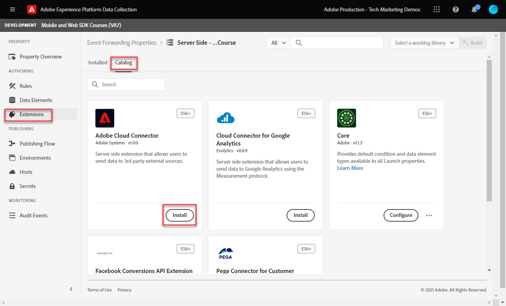

# Impostare una proprietà di inoltro eventi

Scopri come utilizzare la proprietà di inoltro eventi utilizzando i dati Experience Platform Web SDK.

L&#39;inoltro eventi è un nuovo tipo di proprietà disponibile nella raccolta dati. L’inoltro di eventi consente di inviare dati a fornitori di terze parti non appartenenti ad Adobi direttamente da Adobe Experience Platform Edge Network anziché dal browser lato client tradizionale. Scopri di più sui vantaggi dell&#39;inoltro degli eventi nel [Panoramica sull’inoltro eventi](https://experienceleague.adobe.com/docs/experience-platform/tags/event-forwarding/overview.html?lang=en).

Per utilizzare l’inoltro eventi in Adobe Experience Platform, i dati devono essere inviati a Adobe Experience Platform Edge Network prima utilizzando una o più delle tre opzioni seguenti:

* [Adobe Experience Platform Web SDK](overview.md)
* [Adobe Experience Platform Mobile SDK](https://aep-sdks.gitbook.io/docs/)
<!--* [Server-to-Server API](https://experienceleague.adobe.com/docs/audience-manager/user-guide/api-and-sdk-code/dcs/dcs-apis/dcs-s2s.html?lang=en)-->

>[!NOTE]
>L’SDK per web di Platform e l’SDK per dispositivi mobili di Platform non richiedono la distribuzione tramite tag, tuttavia si consiglia di utilizzare i tag per distribuire questi SDK.

Dopo aver completato le lezioni precedenti in questa esercitazione, devi inviare dati a Platform Edge Network utilizzando l’SDK per web. Una volta che i dati si trovano in Platform Edge Network, puoi abilitare l’inoltro eventi e utilizzare una proprietà di inoltro eventi per inviare dati a soluzioni non Adobe.

## Finalità di apprendimento

A questa fine della lezione, potrai:

* Creare una proprietà di inoltro eventi
* Collegamento di una proprietà di inoltro eventi a un datastream SDK per web Platform
* Comprendere le differenze tra gli elementi dati e le regole della proprietà tag e gli elementi dati e le regole della proprietà di inoltro eventi
* Creare un elemento dati di inoltro eventi
* Configurare una regola di inoltro eventi
* Convalida dell&#39;invio corretto di una proprietà di inoltro eventi

## Prerequisiti

* Una licenza software che include l&#39;inoltro degli eventi. L’inoltro di eventi è una funzione a pagamento della raccolta dati. Per ulteriori informazioni, contatta il team dell’account Adobe.
* Inoltro eventi abilitato nell’organizzazione Experience Cloud.
* Autorizzazione utente per l&#39;inoltro degli eventi. In [Admin Console](https://adminconsole.adobe.com/), sotto il prodotto Adobe Experience Platform Launch, le voci di autorizzazione per[!UICONTROL Piattaforme] > [!UICONTROL Bordo] e tutti [!UICONTROL Diritti di proprietà]). Una volta concesso, dovresti vedere [!UICONTROL Inoltro eventi] nella navigazione a sinistra dell’interfaccia Raccolta dati:
   

* Adobe Experience Platform Web o Mobile SDK configurato per l’invio di dati a Edge Network. Devi aver completato le seguenti lezioni di questa esercitazione:

   * Configurazione iniziale

      * [Configurare le autorizzazioni](configure-permissions.md)
      * [Configurare uno schema XDM](configure-schemas.md)
      * [Configurare uno spazio dei nomi di identità](configure-identities.md)
      * [Configurare un datastream](configure-datastream.md)
   * Configurazione dei tag

      * [Installare l’estensione SDK per web](install-web-sdk.md)
      * [Creare elementi dati](create-data-elements.md)
      * [Creare una regola di tag](create-tag-rule.md)
      * [Convalida con debugger Adobe Experience Platform](validate-with-debugger.md)

## Creare una proprietà di inoltro eventi

Per iniziare, crea una proprietà di inoltro eventi:

1. Apri [Interfaccia di raccolta dati](https://experience.adobe.com/#/data-collection)
1. Seleziona **[!UICONTROL Inoltro eventi]** dalla navigazione a sinistra
1. Seleziona **[!UICONTROL Nuova proprietà]**.
   

1. Assegna un nome alla proprietà. In questo caso `Server-Side - Web SDK Course`

1. Seleziona **[!UICONTROL Salva]**.
   

## Configurare il datastream

Affinché l&#39;inoltro eventi utilizzi i dati inviati alla rete Edge, è necessario collegare la proprietà di inoltro eventi appena creata allo stesso datastream utilizzato per inviare dati alle soluzioni Adobe.

Per configurare Target nel datastream:

1. Vai a [Raccolta dati](https://experience.adobe.com/#/data-collection)Interfaccia {target=&quot;blank&quot;}
1. Nella navigazione a sinistra, seleziona **[!UICONTROL Datastreams]**
1. Seleziona il creato in precedenza `Luma Web SDK` datastream

   

1. Seleziona **[!UICONTROL Aggiungi servizio]**

   
1. Seleziona **[!UICONTROL Inoltro eventi]** come **[!UICONTROL Servizio]**

1. Sotto la **[!UICONTROL ID proprietà]** a discesa, seleziona il nome assegnato alla proprietà di inoltro eventi, in questo caso `Server-Side - Web SDK Course`

1. Sotto la **[!UICONTROL ID ambiente]** a discesa , seleziona l’ambiente tag a cui stai collegando l’ambiente di inoltro eventi, in questo caso `Development`

   >[!TIP]
   >
   >    Per inviare dati a un ambiente di inoltro eventi al di fuori dell’organizzazione Adobe, seleziona **[!UICONTROL Immetti manualmente gli ID]** e incolla un ID. L&#39;ID viene fornito quando si crea una proprietà di inoltro eventi.

1. Seleziona **[!UICONTROL Salva]**.

   

Ripeti questi passaggi per i datastreams di staging e produzione quando sei pronto per promuovere le modifiche attraverso il flusso di pubblicazione.

## Inoltrare dati da Platform Edge Network a una soluzione non Adobe

In questo esercizio imparerai a configurare un elemento dati per l’inoltro di eventi, configurare una regola per l’inoltro di eventi e convalidare utilizzando uno strumento di terze parti denominato [Webhook.site](https://webhook.site/).

>[!NOTE]
>
>Un webhook è un modo per integrare diversi sistemi in tempo semi-reale. [Webhook.site](https://webhook.site/) è uno strumento di terze parti che consente di controllare, testare e automatizzare facilmente (con il generatore di azioni personalizzate visive o WebhookScript) qualsiasi richiesta o e-mail HTTP in arrivo.

>[!IMPORTANT]
>
>Per continuare, devi aver già creato e mappato elementi dati a un oggetto XDM, nonché configurato regole tag e aver generato tali modifiche all&#39;interno di una libreria in un ambiente tag. In caso contrario, fai riferimento alla **Configurazione dei tag** i passi [prerequisiti](setup-event-forwarding.md#prerequisites) sezione . Questi passaggi garantiscono l’invio dei dati a Platform Edge Network e da lì è possibile configurare una proprietà di inoltro eventi per l’inoltro dei dati a una soluzione non Adobe.

### Creare un elemento dati di inoltro eventi

L’oggetto XDM configurato in precedenza tramite l’estensione tag Platform Web SDK diventa l’origine dati per gli elementi dati in una proprietà di inoltro eventi. Utilizza gli stessi dati già configurati nella proprietà tag come origine dati per l&#39;inoltro degli eventi.

>[!IMPORTANT]
>
>C&#39;è una differenza di sintassi chiave quando si fa riferimento a campi XDM nell&#39;inoltro di eventi rispetto ad altri contesti. Per fare riferimento ai dati in una proprietà di inoltro eventi, il percorso dell&#39;elemento dati deve includere `arc.event` prefisso:
>
> * `arc` sta per Adobe Response Context (Contesto di risposta Adobe).
> * Ad esempio: `arc.event.xdm.web.webPageDetails.URL`
>
>Se il percorso specificato non è corretto, i dati non vengono raccolti.

In questo esercizio, inoltrerai l’altezza del riquadro di visualizzazione del browser e l’ID Experience Cloud dall’oggetto XDM a un webhook. Il percorso del campo XDM è determinato dallo schema XDM creato durante il [Configurare uno schema XDM](configure-schemas.md) lezione.

>[!TIP]
>
>È inoltre possibile trovare il percorso dell&#39;oggetto XDM utilizzando gli strumenti di rete del browser Web, filtrando `/ee` richieste, apertura del beacon [!UICONTROL **Payload**] ed esegui il drill-down alla variabile che stai cercando. Quindi fare clic con il pulsante destro del mouse e selezionare &quot;Copia percorso proprietà&quot;. Ecco un esempio per l&#39;altezza della finestra di visualizzazione del browser:
> 

1. Vai a **[!UICONTROL Inoltro eventi]** proprietà creata di recente

1. Nella navigazione a sinistra, seleziona **[!UICONTROL Elementi dati]**

1. Seleziona per **[!UICONTROL Crea nuovo elemento dati]**

   

1. **** Denomina l’elemento dati `environment.browserDetails.viewportHeight`

1. Sotto **[!UICONTROL Estensione]**, congedo `CORE`

1. Sotto **[!UICONTROL Tipo di elemento dati]**, seleziona `Path`

1. Digitare il percorso dell&#39;oggetto XDM contenente l&#39;altezza della finestra di visualizzazione del browser `arc.event.xdm.environment.browserDetails.viewportHeight`

1. Seleziona **[!UICONTROL Salva]**

   

1. Creare un altro elemento dati

1. **[!UICONTROL Nome]** it `ecid`

1. Sotto **[!UICONTROL Estensione]**, congedo `CORE`

1. Sotto **[!UICONTROL Tipo di elemento dati]**, seleziona `Path`

1. Digitare il percorso dell&#39;oggetto XDM contenente l&#39;ID Experience Cloud `arc.event.xdm.identityMap.ECID.0.id`

1. Seleziona **[!UICONTROL Salva]**

   

   >[!CAUTION]
   >
   > Assicurati di includere il `arc.event.` Prefisso nel percorso. Inoltre, accertati di seguire l’esatta combinazione di maiuscole e minuscole come nome del campo Oggetto XDM, ovvero lo spazio dei nomi ECID deve trovarsi in tutte le maiuscole.

   >[!TIP]
   Quando lavori con il tuo sito web, puoi trovare il percorso dell&#39;oggetto XDM con gli strumenti di rete del browser Web, filtrando `/ee` richieste, apertura del beacon [!UICONTROL **Payload**] ed esegui il drill-down alla variabile che stai cercando. Quindi fare clic con il pulsante destro del mouse e selezionare &quot;Copia percorso proprietà&quot;. Ecco un esempio per l&#39;altezza della finestra di visualizzazione del browser:
   

### Installa l&#39;estensione Adobe Cloud Connector

Per inviare dati a posizioni di terze parti, installerai prima il [!UICONTROL Connettore cloud di Adobe] estensione.

1. Seleziona **[!UICONTROL Estensioni]** nella navigazione a sinistra

1. Seleziona la **[!UICONTROL Catalogo]** scheda

1. Cerca il **[!UICONTROL Connettore cloud di Adobe]**, seleziona **[!UICONTROL Installa]**

   

Non è necessaria alcuna configurazione di estensione. Con questa estensione, ora puoi inoltrare i dati a una soluzione non Adobe.

### Creare una regola di inoltro eventi

Esistono alcune differenze principali tra la configurazione delle regole in una proprietà tag e una regola in una proprietà di inoltro eventi:

* **[!UICONTROL Eventi] &amp; [!UICONTROL Condizioni]**:

   * **Tag**: Tutte le regole vengono attivate da un evento che deve essere specificato nella regola, ad esempio: `Library Loaded - Page Top`. Le condizioni sono facoltative.
   * **Inoltro eventi**: Si presume che ogni evento inviato a Platform Edge Network sia un trigger per l’inoltro dei dati. Pertanto, non [!UICONTROL Eventi] deve essere selezionato nelle regole di inoltro eventi. Per gestire gli eventi che attivano una regola di inoltro eventi, devi configurare le condizioni.

* **Tokenizzazione dell&#39;elemento dati**:

   * **Tag**: I nomi degli elementi dati vengono token con un `%` all&#39;inizio e alla fine del nome dell&#39;elemento dati quando viene utilizzato in una regola. Ad esempio, `%viewportHeight%`.

   * **Inoltro eventi**: I nomi degli elementi dati sono collegati tramite token `{{` all&#39;inizio e `}}` alla fine del nome dell&#39;elemento dati quando viene utilizzato in una regola. Ad esempio, `{{viewportHeight}}`.

* **Sequenza di azioni della regola**:

   * La sezione Azioni di una regola di inoltro eventi viene sempre eseguita in sequenza. Quando si salva una regola, occorre assicurarsi che l&#39;ordine delle azioni sia corretto. Questa sequenza di esecuzione non può essere eseguita in modo asincrono come può con i tag .

<!--
  * **Tags**: Rule actions can easily be reordered using drag-and-drop functionality.
  * **Event forwarding**: Rule actions are always executed sequentially. Make sure the order of actions is correct when you save a rule.
-->

Per configurare una regola per inoltrare i dati al tuo webhook, devi prima ottenere il tuo webhook personale:

1. Vai a [Webhook.site](https://webhook.site)

1. Trova **URL univoco**, lo utilizzerai come richiesta URL nella regola di inoltro eventi

1. Seleziona **[!UICONTROL Copia negli Appunti]**

1. Lascia aperta questa finestra perché sarai in grado di convalidare i dati di inoltro dell&#39;evento in tempo reale catturati da Webhook

   

1. Torna indietro **[!UICONTROL Raccolta dati]** > **[!UICONTROL Inoltro eventi]** > **[!UICONTROL Regole]** dalla navigazione a sinistra

1. Seleziona **[!UICONTROL Crea nuova regola]**

   

1. Denomina `all events - ad cloud connector - webhook`

1. Aggiungi un’azione

1. Sotto **[!UICONTROL Estensione]**, seleziona **[!UICONTROL Connettore cloud di Adobe]**

1. Sotto **[!UICONTROL Tipo di azione]**, seleziona **[!UICONTROL Fai una chiamata di recupero]**

1. Incolla l’URL del Webhook nel **[!UICONTROL URL]** field

   

1. Sotto **[Parametri query]**, verranno aggiunti entrambi gli elementi dati creati in precedenza.

1. Sulla **[!UICONTROL Chiave]** tipo di colonna in `viewPortHeight`. Sulla **[!UICONTROL Valore]** , immetti `{{environment.browserDetails.viewportHeight}}` elemento dati digitandolo o selezionandolo dall’icona del selettore degli elementi dati

1. Seleziona [!UICONTROL **+ Aggiungi un altro**] per aggiungere un altro parametro di query

1. Sulla **[!UICONTROL Chiave]** tipo di colonna in `ecid`. Nella colonna Valore , immetti il `{{ecid}}` elemento dati

1. Seleziona **[!UICONTROL Mantieni modifiche]**

   

1. La regola dovrebbe essere simile a quella riportata di seguito

1. Seleziona **[!UICONTROL Salva]**

   

### Creare e creare la libreria

Crea una libreria e genera tutte le modifiche all&#39;ambiente di sviluppo per l&#39;inoltro degli eventi, come faresti normalmente in una proprietà tag.

>[!NOTE]
Se non hai collegato le proprietà di inoltro eventi di staging e produzione al tuo datastream, vedrai l&#39;ambiente di sviluppo come unica opzione per creare una libreria.

## Convalida regola di inoltro eventi

Ora puoi convalidare la proprietà di inoltro eventi utilizzando Platform Debugger e Webhook.site:

1. Segui i passaggi per [cambiare la libreria tag](validate-with-debugger.md#use-the-experience-platform-debugger-to-map-to-your-tag-property) sulla [Sito Demo Luma](https://luma.enablementadobe.com/content/luma/us/en/men.html) alla proprietà tag SDK Web a cui è stata mappata la proprietà di inoltro eventi nel datastream.

1. Prima di ricaricare la pagina, nel debugger di Experience Platform apri **[!UICONTROL Registri]** dalla navigazione a sinistra

1. Seleziona la **[!UICONTROL Bordo]** , quindi seleziona **[!UICONTROL Connetti]** per visualizzare le richieste di Platform Edge Network

   

1. Ricarica la pagina

1. Verranno visualizzate richieste aggiuntive che consentono di visualizzare le richieste lato server inviate da Platform Edge Network a WebHook

1. La richiesta di attivazione della convalida è quella che mostra l’URL completamente costruito inviato dalla rete Edge

   

1. Nota i parametri della stringa di query viewPortHeight e ecid

   

1. Corrispondono ai dati visualizzati nell&#39;oggetto XDM

   

1. Infine, convalida i dati corrispondenti in [Webhook.site](https://webhook.site) e visualizzando la finestra aperta Webhook

   

Congratulazioni! Hai configurato l&#39;inoltro eventi.

[Avanti: ](conclusion.md)

>[!NOTE]
Grazie per aver investito il tuo tempo nel conoscere Adobe Experience Platform Web SDK. In caso di domande, se desideri condividere feedback generali o se hai suggerimenti su contenuti futuri, condividi questi su questo [Experience League Articolo di discussione della Comunità](https://experienceleaguecommunities.adobe.com/t5/adobe-experience-platform-launch/tutorial-discussion-implement-adobe-experience-cloud-with-web/td-p/444996)