# Trasmettere dati ad Experience Platform con Web SDK

Scopri come trasferire i dati web in streaming a Adobe Experience Platform con Platform Web SDK.

Experience Platform è la spina dorsale di tutte le nuove applicazioni Experience Cloud, come Adobe Real-Time Customer Data Platform, Adobe Customer Journey Analytics e Adobe Journey Optimizer. Queste applicazioni sono progettate per utilizzare Platform Web SDK come metodo ottimale di raccolta dei dati web.

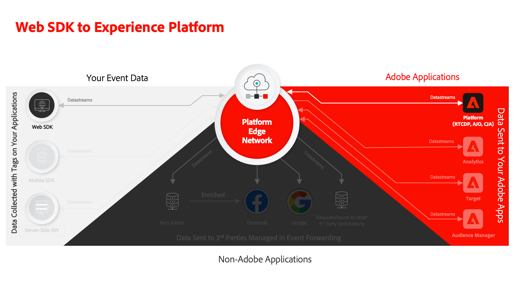

Experience Platform utilizza lo stesso schema XDM creato in precedenza per acquisire i dati dell’evento dal sito web Luma. Quando tali dati vengono inviati a Platform Edge Network, la configurazione dello stream di dati può inoltrarli ad Experience Platform.

## Obiettivi di apprendimento

Alla fine di questa lezione, potrai:

* Creare un set di dati in Adobe Experience Platform
* Configurare lo stream di dati per inviare dati Web SDK a Adobe Experience Platform
* Abilitare lo streaming dei dati web per Real-Time Customer Profile
* Convalidare i dati sono stati inseriti sia nel set di dati di Platform che nel profilo cliente in tempo reale
* Acquisire i dati del programma fedeltà di esempio in Platform
* Creare un pubblico di Platform semplice

## Prerequisiti

Per completare questa lezione, devi prima:

* Accedere a un’applicazione Adobe Experience Platform come Real-Time Customer Data Platform, Journey Optimizer o Customer Journey Analytics
* Completa le lezioni precedenti nelle sezioni Configurazione iniziale e Configurazione tag di questa esercitazione.

>[!NOTE]
>
>Se non disponi di applicazioni Platform, puoi saltare questa lezione o continuare a leggerla.

## Creare un set di dati

Tutti i dati acquisiti correttamente in Adobe Experience Platform vengono memorizzati nel data lake come set di dati. Un [set di dati](https://experienceleague.adobe.com/en/docs/experience-platform/catalog/datasets/overview) è un costrutto di archiviazione e gestione per una raccolta di dati, in genere una tabella che contiene uno schema (colonne) e campi (righe). I set di dati contengono anche metadati che descrivono vari aspetti dei dati memorizzati.

Configuriamo un set di dati per i dati dell’evento web Luma:

1. Vai all&#39;interfaccia [Experience Platform](https://experience.adobe.com/platform/) o [Journey Optimizer](https://experience.adobe.com/journey-optimizer/)
1. Conferma di trovarti nella sandbox di sviluppo che stai utilizzando per questa esercitazione
1. Apri **[!UICONTROL Gestione dati > Set di dati]** dal menu di navigazione a sinistra
1. Seleziona **[!UICONTROL Crea set di dati]**

   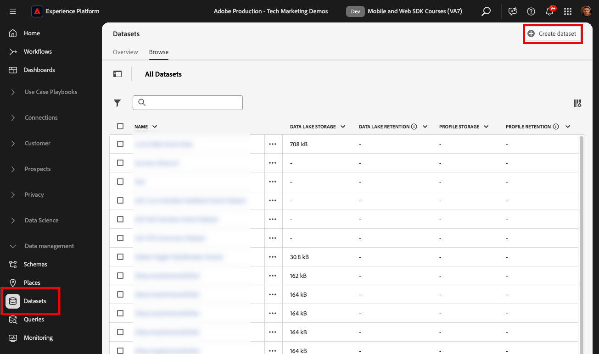

1. Seleziona l&#39;opzione **[!UICONTROL Crea set di dati dallo schema]**

   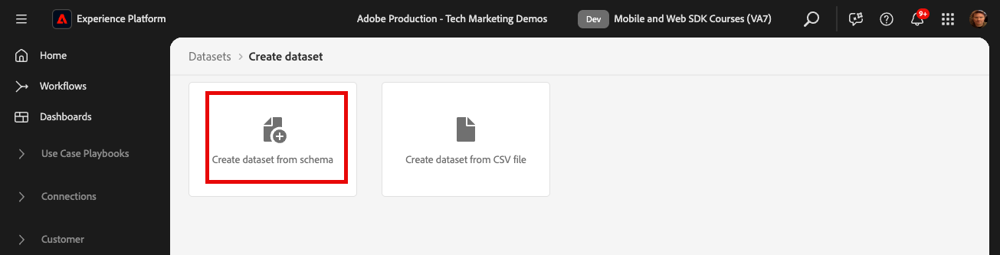

1. Seleziona lo schema `Luma Web Event Data` creato nella [lezione precedente](configure-schemas.md), quindi seleziona **[!UICONTROL Successivo]**

   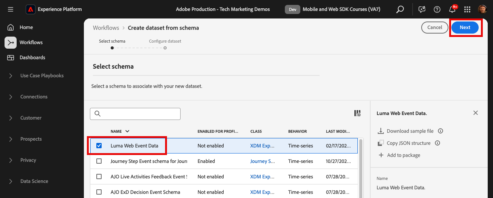

1. Fornisci un **[!UICONTROL Nome]** e una **[!UICONTROL Descrizione]** facoltativi per il set di dati. Per questo esercizio, utilizza `Luma Web Event Data`, quindi seleziona **[!UICONTROL Fine]**

   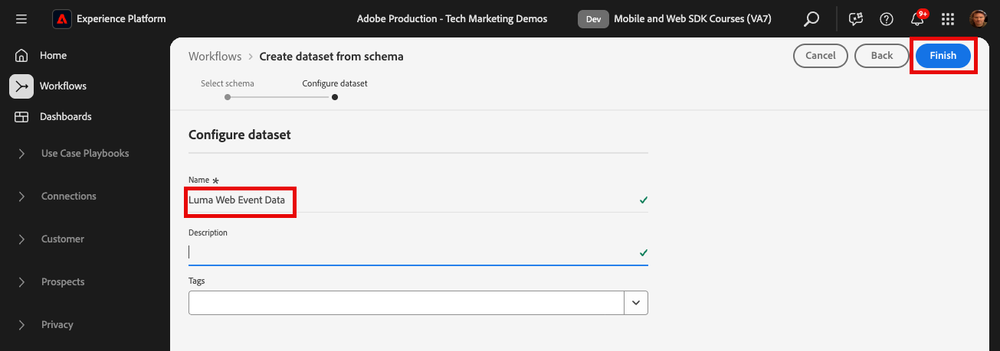

Ora è configurato un set di dati per iniziare a raccogliere dati dall’implementazione di Platform Web SDK.

## Configurare lo stream di dati

Ora puoi configurare il [!UICONTROL flusso di dati] per inviare dati a [!UICONTROL Adobe Experience Platform]. Lo stream di dati è il collegamento tra la proprietà tag, Platform Edge Network e il set di dati Experience Platform.

1. Apri l&#39;interfaccia di [Data Collection](https://experience.adobe.com/#/data-collection){target="blank"}
1. Seleziona **[!UICONTROL Datastreams]** dal menu di navigazione a sinistra
1. Apri lo stream di dati creato nella lezione [Configurare uno stream di dati](configure-datastream.md), `Luma Web SDK: Development Environment`

   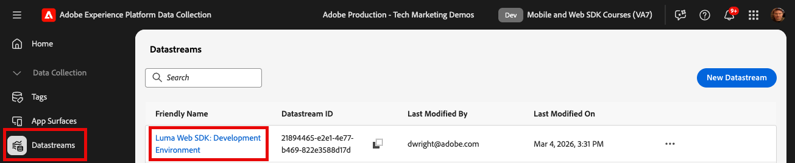

1. Seleziona **[!UICONTROL Aggiungi servizio]**
   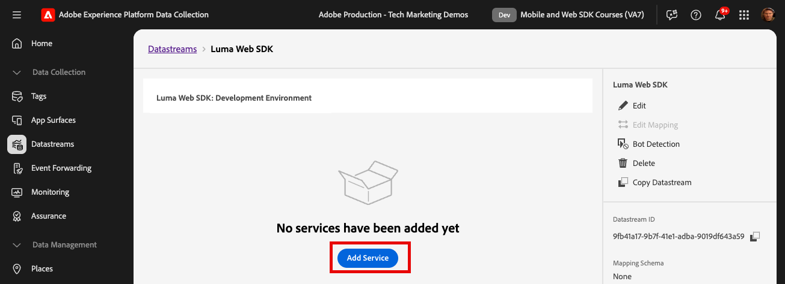
1. Seleziona **[!UICONTROL Adobe Experience Platform]** come **[!UICONTROL Servizio]**
1. Seleziona **[!UICONTROL Abilitato]**
1. Seleziona `Luma Web Event Data` come **[!UICONTROL Set di dati evento]**

1. Seleziona **[!UICONTROL Salva]**

   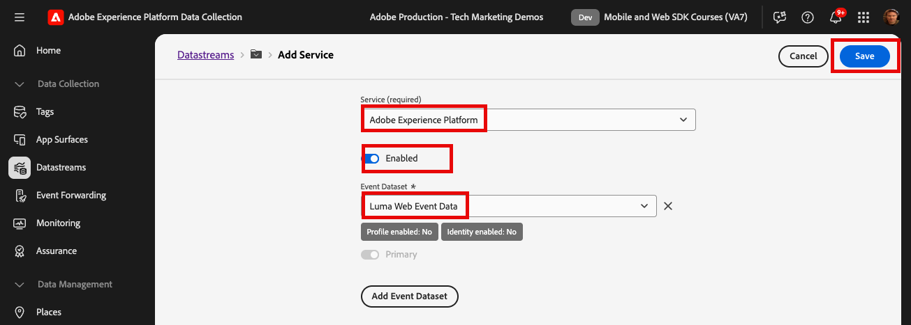

Quando generi traffico sul [sito Web di dimostrazione Luma](https://luma.enablementadobe.com) mappato alla proprietà tag, i dati popolano il set di dati in Experience Platform.

## Convalidare il set di dati

Questo passaggio è fondamentale per assicurarsi che i dati siano arrivati nel set di dati. Esistono diversi modi per convalidare il percorso dei dati inviati al set di dati.

* Convalida tramite [!UICONTROL Experience Platform Debugger]
* Convalida tramite [!UICONTROL Experience Platform Assurance]
* Convalida tramite [!UICONTROL Anteprima set di dati]
* Convalida tramite [!UICONTROL Query Service]

### Debugger

Questi passaggi sono più o meno gli stessi della lezione di [Debugger](validate-with-debugger.md). Tuttavia, poiché i dati verranno inviati a Platform solo dopo averli abilitati nello stream di dati, devi generare altri dati di esempio:

1. Apri il [sito Web di dimostrazione Luma](https://luma.enablementadobe.com) e seleziona l&#39;icona dell&#39;estensione [!UICONTROL Experience Platform Debugger]

1. Configura il debugger per mappare la proprietà tag nell&#39;ambiente di sviluppo *your*, come descritto nella lezione [Convalida con debugger](validate-with-debugger.md)

   

1. Sfoglia il sito web. Visualizza alcuni prodotti e aggiungi alcuni al carrello

1. Nel debugger, apri la riga &quot;events&quot; per cercare alcune variabili XDM

Hai verificato che i dati abbiano lasciato il browser e siano stati inviati allo stream di dati.

### Assurance

Poiché ora abbiamo abilitato un servizio nel flusso di dati, in Assurance è possibile vedere altro:

1. Apri la sessione Assurance o avviane una nuova
1. Apri evento **[!UICONTROL datastream]**
1. Qui puoi visualizzare la configurazione del servizio Platform, incluso l’ID dello stream di dati creato in precedenza in questa lezione.

   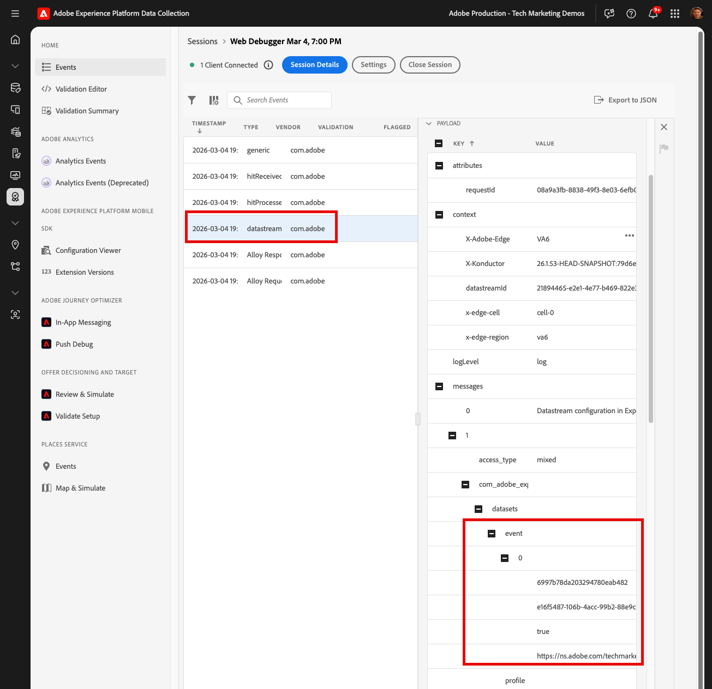

1. Apri l&#39;evento **[!UICONTROL generic]** appartenente al fornitore **[!UICONTROL com.adobe.streaming.validation]**. Questo mostra che la richiesta è stata inviata al set di dati con i dati XDM allegati

   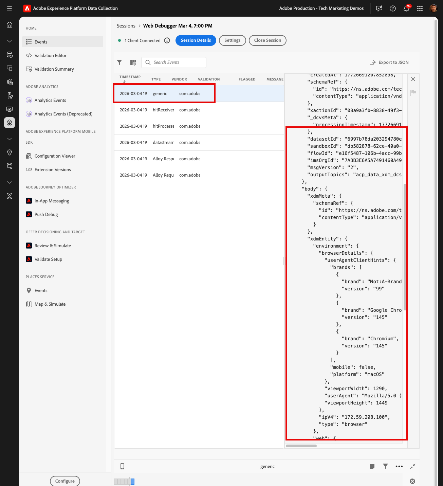

Hai verificato che la richiesta sia stata ricevuta da Platform Edge Network e inoltrata al set di dati di Platform.

### Visualizzare l’anteprima del set di dati

Ora, diamo un’occhiata al set di dati! Un&#39;opzione rapida consiste nell&#39;utilizzare la funzionalità **[!UICONTROL Anteprima set di dati]**. I dati del Web SDK vengono salvati in micro-batch nel data lake e aggiornati periodicamente nell’interfaccia di Platform. Potrebbero essere necessari 10-15 minuti per visualizzare i dati generati.

1. Nell&#39;interfaccia [Experience Platform](https://experience.adobe.com/platform/), seleziona **[!UICONTROL Gestione dati > Set di dati]** nel menu di navigazione a sinistra per aprire il dashboard **[!UICONTROL Set di dati]**.

   Il dashboard elenca tutti i set di dati disponibili per l’organizzazione. Vengono visualizzati i dettagli di ciascun set di dati elencato, compresi il nome, lo schema a cui il set di dati aderisce e lo stato dell’ultima esecuzione di acquisizione.

1. Seleziona il set di dati `Luma Web Event Data` per aprirne la schermata **[!UICONTROL Attività set di dati]**.

   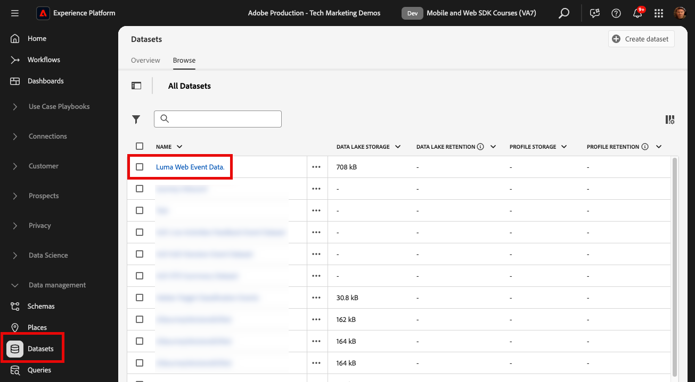

   La schermata dell’attività include un grafico che visualizza la frequenza dei messaggi utilizzati e un elenco dei batch riusciti e non riusciti.
1. Poiché si tratta di un nuovo set di dati, se vedi anche un batch con record acquisiti, è un segno positivo:

1. Dalla schermata **[!UICONTROL Attività set di dati]**, seleziona **[!UICONTROL Anteprima set di dati]** nell&#39;angolo superiore destro dello schermo per visualizzare in anteprima fino a 100 righe di dati. Se il set di dati è vuoto, il collegamento di anteprima viene disattivato.

   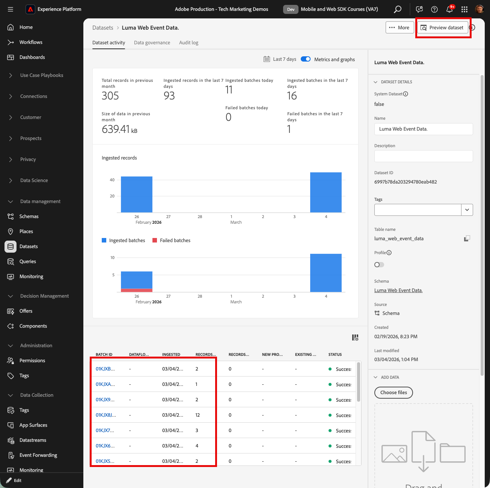

1. Verrà eseguita una query per richiamare 100 righe di dati recenti dal set di dati. Puoi espandere i singoli campi XDM, ad esempio web.webPageDetails.name:

   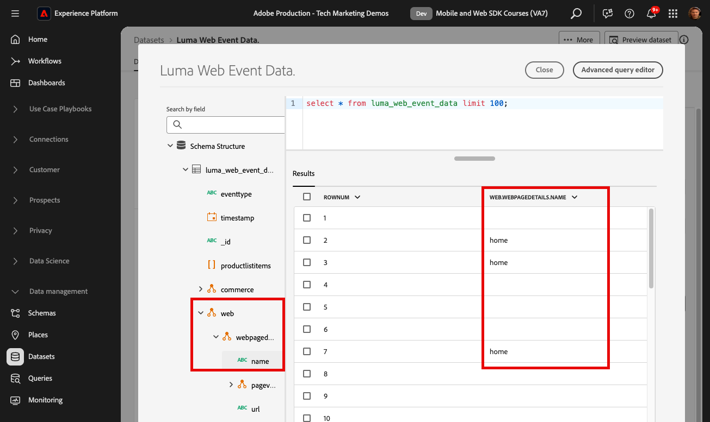

### Eseguire una query sui dati

Puoi eseguire query personalizzate sui dati e convalidare l’acquisizione dei dati:

1. Nell&#39;interfaccia [Experience Platform](https://experience.adobe.com/platform/), seleziona **[!UICONTROL Gestione dati > Query]** nel menu di navigazione a sinistra per aprire la schermata **[!UICONTROL Query]**.
1. Seleziona **[!UICONTROL Crea query]**
1. Eseguire innanzitutto una query per visualizzare tutti i nomi delle tabelle nel data lake. Immettere `SHOW TABLES` nell&#39;editor delle query e fare clic sull&#39;icona di riproduzione per eseguire la query.
1. Nei risultati, notare come il nome della tabella sia `luma_web_event_data`
1. Eseguire una query sulla tabella con una semplice query che fa riferimento alla tabella (per impostazione predefinita la query è limitata a 100 risultati): `SELECT * FROM "luma_web_event_data"`
1. Dopo alcuni istanti dovresti vedere dei record di esempio dei tuoi dati web.

   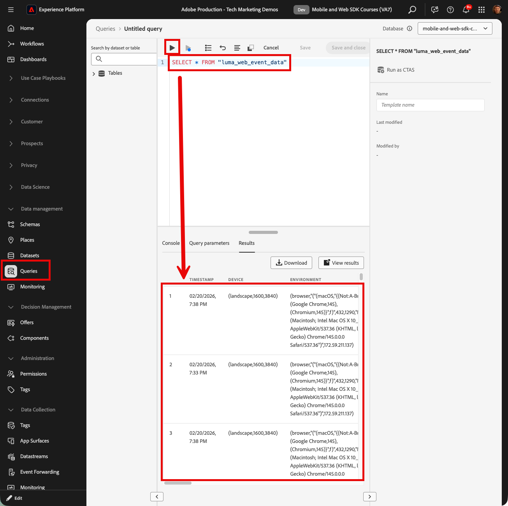

>[!ERROR]
>
>Se ricevi un errore di tipo &quot;Tabella non predisposta&quot;, controlla nuovamente il nome della tabella. Potrebbe anche darsi che il microbatch di dati non sia ancora approdato nel data lake. Riprova tra 10-15 minuti.

>[!INFO]
>
>  Query Service è uno strumento molto potente per data engineer e analisti. Per ulteriori dettagli sul servizio query di Adobe Experience Platform, vedi [Esplora i dati](https://experienceleague.adobe.com/en/docs/platform-learn/tutorials/queries/explore-data) nella sezione Esercitazioni di Platform.

>[!NOTE]
>
>Grazie per aver dedicato tempo all&#39;apprendimento di Adobe Experience Platform Web SDK. Se hai domande, vuoi condividere commenti generali o suggerimenti su contenuti futuri, condividili in questo [post di discussione della community Experience League](https://experienceleaguecommunities.adobe.com/adobe-experience-platform-18/tutorial-discussion-implement-adobe-experience-cloud-with-web-sdk-tutorial-248848)
