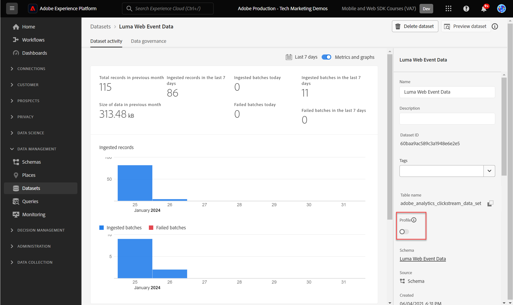

# Trasmettere i dati per dare Experience Platform con Web SDK

Scopri come inviare dati web a Adobe Experience Platform con Platform Web SDK.

Experienci Platform è la spina dorsale di tutte le nuove applicazioni Experience Cloud, come Adobe Real-time Customer Data Platform, Adobe Customer Journey Analytics e Adobe Journey Optimizer. Queste applicazioni sono progettate per utilizzare Platform Web SDK come metodo ottimale per la raccolta di dati web.

Experienci Platform utilizza lo stesso schema XDM creato in precedenza per acquisire i dati dell’evento dal sito web Luma. Quando tali dati vengono inviati a Platform Edge Network, la configurazione dello stream di dati può inoltrarli a Experienci Platform.

## Finalità di apprendimento

Alla fine di questa lezione, potrai:

* Creare un set di dati in Adobe Experience Platform
* Configurare lo stream di dati per inviare dati Web SDK a Adobe Experience Platform
* Abilitare lo streaming dei dati web per Real-Time Customer Profile
* Convalidare i dati sono stati inseriti sia nel set di dati di Platform che nel profilo cliente in tempo reale

## Prerequisiti

Dovresti aver già completato le seguenti lezioni:

* Il **Configurazione iniziale** lezioni:
   * [Configurare le autorizzazioni](configure-permissions.md)
   * [Configurare uno schema XDM](configure-schemas.md)
   * [Configurare uno stream di dati](configure-datastream.md)
   * [Configurare uno spazio dei nomi delle identità](configure-identities.md)

* Il **Configurazione tag** lezioni:
   * [Installare l’estensione Web SDK](install-web-sdk.md)
   * [Creare elementi dati](create-data-elements.md)
   * [Creare regole di tag](create-tag-rule.md)

## Creare un set di dati

Tutti i dati acquisiti correttamente in Adobe Experience Platform vengono memorizzati nel data lake come set di dati. A [set di dati](https://experienceleague.adobe.com/docs/experience-platform/catalog/datasets/overview.html?lang=en) è un costrutto di archiviazione e gestione per una raccolta di dati, in genere una tabella, che contiene uno schema (colonne) e dei campi (righe). I set di dati contengono anche metadati che descrivono vari aspetti dei dati memorizzati.

In questo esercizio creerai un set di dati per tenere traccia del contenuto e dei dettagli di e-commerce per [Sito di dimostrazione Luma](https://luma.enablementadobe.com/content/luma/us/en.html).

>[!WARNING]
>
>Devi avere già creato il `Luma Web Event Data` come descritto nella lezione precedente, [Configurare uno schema XDM](configure-schemas.md).

1. Vai a [Interfaccia Experienci Platform](https://experience.adobe.com/platform/)
1. Conferma di trovarti nella sandbox di sviluppo che stai utilizzando per questa esercitazione
1. Apri **[!UICONTROL Set di dati]** dal menu di navigazione a sinistra
1. Seleziona **[!UICONTROL Crea set di dati]**

   

1. Seleziona la **[!UICONTROL Crea set di dati dallo schema]** opzione

   

1. Seleziona la `Luma Web Event Data` schema creato in [lezione precedente](configure-schemas.md) e quindi seleziona **[!UICONTROL Successivo]**

   

1. Fornisci un **[!UICONTROL Nome]** e opzionale **[!UICONTROL Descrizione]** per il set di dati. Per questo esercizio, utilizza `Luma Web Event Data`, quindi seleziona **[!UICONTROL Fine]**

   

Ora è configurato un set di dati per iniziare a raccogliere dati dall’implementazione di Platform Web SDK.

## Configurare lo stream di dati

Ora puoi configurare il [!UICONTROL flusso di dati] per inviare dati a [!UICONTROL Adobe Experience Platform]. Lo stream di dati è il collegamento tra la proprietà tag, la rete Edge di Platform e il set di dati di Experience Platform.

1. Apri [Raccolta dati](https://experience.adobe.com/it#/data-collection){target="blank"} Interfaccia
1. Seleziona **[!UICONTROL Flussi di dati]** dal menu di navigazione a sinistra
1. Apri lo stream di dati creato in [Configurare uno stream di dati](configure-datastream.md) lezione, `Luma Web SDK`

   

1. Seleziona **[!UICONTROL Aggiungi servizio]**
   
1. Seleziona **[!UICONTROL Adobe Experience Platform]** come **[!UICONTROL Servizio]**
1. Seleziona `Luma Web Event Data` come **[!UICONTROL Set di dati evento]**

1. Seleziona **[!UICONTROL Salva]**.

   

Quando generi traffico in sul [Sito dimostrativo Luma](https://luma.enablementadobe.com/content/luma/us/en.html) mappati alla proprietà tag, i dati popoleranno il set di dati in Experienci Platform.

## Convalidare il set di dati

Questo passaggio è fondamentale per assicurarsi che i dati siano arrivati nel set di dati. Esistono due aspetti della convalida dei dati inviati al set di dati.

* Convalida tramite [!UICONTROL Debugger Experienci Platform]
* Convalida tramite [!UICONTROL Anteprima set di dati]
* Convalida tramite [!UICONTROL Servizio query]

### Experience Platform Debugger

Questi passaggi sono più o meno gli stessi di quelli eseguiti nel [Lezione su Debugger](validate-with-debugger.md). Tuttavia, poiché i dati verranno inviati a Platform solo dopo averli abilitati nello stream di dati, devi generare altri dati di esempio:

1. Apri [Sito di dimostrazione Luma](https://luma.enablementadobe.com/content/luma/us/en.html) e seleziona la [!UICONTROL Debugger Experienci Platform] icona dell’estensione

1. Configura Debugger per mappare la proprietà tag su *tuo* Ambiente di sviluppo, come descritto nella sezione [Convalida con Debugger](validate-with-debugger.md) lezione

   

1. Accedi al sito Luma utilizzando le credenziali `test@adobe.com`/`test`

1. Torna alla [home page di Luma](https://luma.enablementadobe.com/content/luma/us/en.html)

1. All’interno dei beacon di rete di Platform Web SDK mostrati dal debugger, seleziona la riga &quot;events&quot; (eventi) per espandere i dettagli in un pop-up

   

1. Cerca &quot;identityMap&quot; all’interno del pop-up. Qui dovresti trovare lumaCrmId con tre chiavi di authenticatedState, id e primary
   

Ora i dati devono essere compilati in `Luma Web Event Data` e pronto per la convalida &quot;Anteprima set di dati&quot;.

### Visualizzare l’anteprima del set di dati

Per confermare che i dati sono arrivati nel data lake di Platform, un’opzione rapida consiste nell’utilizzare **[!UICONTROL Anteprima set di dati]** funzionalità. I dati dell’SDK per web vengono inviati in micro-batch al data lake e aggiornati periodicamente nell’interfaccia di Platform. Potrebbero essere necessari 10-15 minuti per visualizzare i dati generati.

1. In [Experience Platform](https://experience.adobe.com/platform/) interfaccia, seleziona **[!UICONTROL Set di dati]** nel menu di navigazione a sinistra per aprire **[!UICONTROL Set di dati]** dashboard.

   Il dashboard elenca tutti i set di dati disponibili per l’organizzazione. Vengono visualizzati i dettagli di ciascun set di dati elencato, compreso il nome, lo schema a cui il set di dati aderisce e lo stato dell’esecuzione di acquisizione più recente.

1. Seleziona il `Luma Web Event Data` set di dati per aprirne i **[!UICONTROL Attività set di dati]** schermo.

   

   La schermata dell’attività include un grafico che visualizza la frequenza dei messaggi utilizzati e un elenco dei batch riusciti e non riusciti.

1. Dalla sezione **[!UICONTROL Attività set di dati]** schermata, seleziona **[!UICONTROL Anteprima set di dati]** nell’angolo in alto a destra dello schermo per visualizzare in anteprima fino a 100 righe di dati. Se il set di dati è vuoto, il collegamento di anteprima viene disattivato.

   

   Nella finestra di anteprima, a destra viene visualizzata la vista gerarchica dello schema per il set di dati.

   

>[!INFO]
>
>Il servizio query di Adobe Experience Platform è un metodo più affidabile per convalidare i dati nel data lake, ma va oltre l’ambito di questa esercitazione. Per ulteriori dettagli, consulta [Esplora i dati](https://experienceleague.adobe.com/docs/platform-learn/tutorials/queries/explore-data.html?lang=it) nella sezione Esercitazioni di Platform.

## Abilitare il set di dati e lo schema per Real-Time Customer Profile

Il passaggio successivo consiste nell’abilitare il set di dati e lo schema per Real-Time Customer Profile. Lo streaming di dati da Web SDK sarà una delle molte origini dati che fluiranno in Platform e desideri unire i tuoi dati web con altre origini dati per creare profili cliente a 360 gradi. Per ulteriori informazioni su Real-Time Customer Profile, guarda questo breve video:

>[!VIDEO](https://video.tv.adobe.com/v/27251?learn=on&captions=eng)

>[!CAUTION]
>
>Quando lavori con il tuo sito web e i tuoi dati, ti consigliamo di convalidarli in modo più affidabile prima di abilitarli per Real-Time Customer Profile.

**Per abilitare il set di dati:**

1. Apri il set di dati creato, `Luma Web Event Data`

1. Seleziona la **[!UICONTROL Attiva/disattiva profilo]** per accenderlo

   

1. Conferma che desideri **[!UICONTROL Abilita]** il set di dati

   

**Per abilitare lo schema:**

1. Apri lo schema creato, `Luma Web Event Data`

1. Seleziona la **[!UICONTROL Attiva/disattiva profilo]** per accenderlo

   

1. Seleziona **[!UICONTROL I dati per questo schema conterranno un’identità primaria nel campo identityMap.]**

   >[!IMPORTANT]
   >
   >    Le identità primarie sono necessarie in ogni record inviato a Real-Time Customer Profile. In genere, i campi di identità sono etichettati all’interno dello schema. Quando si utilizzano le mappe di identità, tuttavia, i campi di identità non sono visibili all’interno dello schema. Questa finestra di dialogo conferma che hai in mente un’identità primaria e che la specificherai in una mappa di identità al momento dell’invio dei dati. Come sai, Web SDK utilizza una mappa di identità e l’ID Experience Cloud (ECID) è l’identità primaria predefinita.

1. Seleziona **[!UICONTROL Abilita]**

   

1. Seleziona **[!UICONTROL Salva]** per salvare lo schema aggiornato

Ora lo schema è abilitato anche per il profilo.

>[!IMPORTANT]
>
>    Una volta che uno schema è abilitato per il profilo, non può essere disabilitato o eliminato. Inoltre, i campi non possono essere rimossi dallo schema dopo questo punto. Queste implicazioni sono importanti da tenere presenti in un secondo momento quando si lavora con i propri dati nell’ambiente di produzione. In questa esercitazione dovresti utilizzare una sandbox di sviluppo, che può essere eliminata in qualsiasi momento.
>
>   
> Quando lavori con i tuoi dati, ti consigliamo di eseguire le operazioni nel seguente ordine:
> 
> * Innanzitutto, acquisisci alcuni dati nei set di dati.
> * Risolvi eventuali problemi che sorgono durante il processo di acquisizione dei dati (ad esempio, problemi di convalida o mappatura dei dati).
> * Abilitare i set di dati e gli schemi per il profilo
> * Riacquisire i dati

### Convalidare un profilo

Puoi cercare un profilo cliente nell’interfaccia di Platform (o nell’interfaccia di Journey Optimizer) per verificare che i dati siano stati inseriti nel profilo cliente in tempo reale. Come suggerisce il nome, i profili si popolano in tempo reale, quindi non si verifica alcun ritardo come con la convalida dei dati nel set di dati.

Innanzitutto devi generare più dati campione. Ripeti i passaggi precedenti di questa lezione per accedere al sito web Luma quando è mappato alla proprietà tag. Inspect richiede l’SDK web per Platform per assicurarsi che invii dati con `lumaCRMId`.

1. In [Experience Platform](https://experience.adobe.com/platform/) interfaccia, seleziona **[!UICONTROL Profili]** nel menu di navigazione a sinistra

1. Come **[!UICONTROL Spazio dei nomi dell’identità]** utilizzare `lumaCRMId`
1. Copia e incolla il valore del `lumaCRMId` ha passato la chiamata esaminata nel debugger di Experienci Platform (probabilmente `112ca06ed53d3db37e4cea49cc45b71e`).

   

1. Se nel profilo è presente un valore valido per `lumaCRMId`, nella console viene popolato un ID profilo:

   

1. Fai clic su nella [!UICONTROL ID profilo] e un [!UICONTROL Profilo cliente] viene compilata la console. Qui puoi vedere tutte le identità collegate al `lumaCRMId`, ad esempio `ECID`:

   

Ora hai abilitato Platform Web SDK, ad Experience Platform (e Real-Time CDP! E Customer Journey Analytics! E Journey Optimizer!).

[Successivo: ](setup-analytics.md)

>[!NOTE]
>
>Grazie per aver dedicato il tuo tempo all’apprendimento di Adobe Experience Platform Web SDK. Se hai domande, vuoi condividere commenti generali o suggerimenti su contenuti futuri, condividili su questo [Experience League post di discussione community](https://experienceleaguecommunities.adobe.com/t5/adobe-experience-platform-launch/tutorial-discussion-implement-adobe-experience-cloud-with-web/td-p/444996)