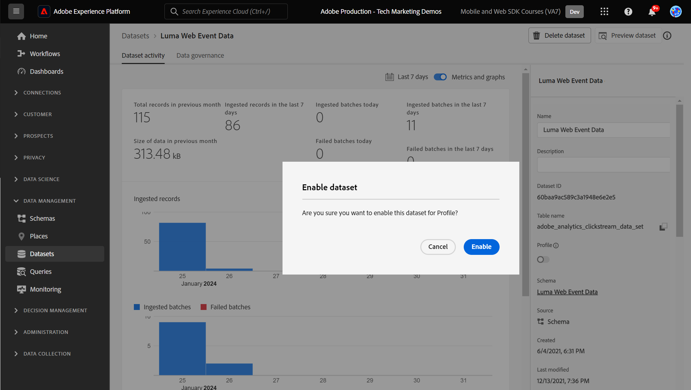
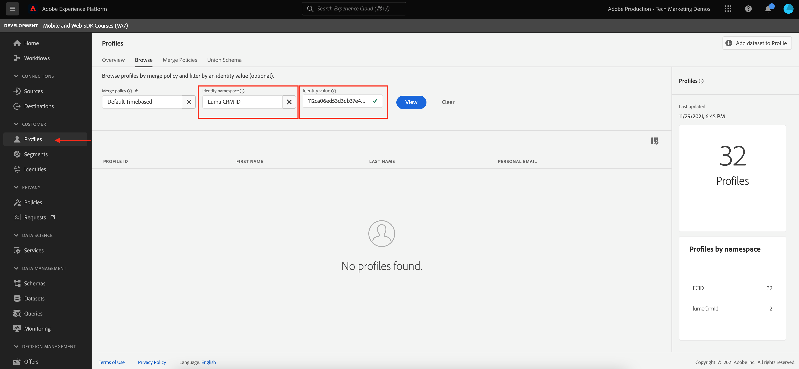

# Trasmetti dati ad Experience Platform con SDK per web

Scopri come inviare dati web in streaming a Adobe Experience Platform con Platform Web SDK.

Experience Platform è la spina dorsale di tutte le nuove applicazioni Experience Cloud, come Adobe Real-time Customer Data Platform, Adobe Customer Journey Analytics e Adobe Journey Optimizer. Queste applicazioni sono progettate per utilizzare Platform Web SDK come metodo ottimale per la raccolta di dati web.

Experience Platform utilizza lo stesso schema XDM creato in precedenza per acquisire i dati dell’evento dal sito web Luma. Quando tali dati vengono inviati a Platform Edge Network, la configurazione del datastream può inoltrarli ad Experience Platform.

## Finalità di apprendimento

Alla fine di questa lezione, potrai:

* Creare un set di dati in Adobe Experience Platform
* Configurare il datastream per l’invio di dati SDK per web a Adobe Experience Platform
* Abilitare i dati web in streaming per il profilo cliente in tempo reale
* Convalida che i dati siano atterrati sia nel set di dati di Platform che nel profilo cliente in tempo reale

## Prerequisiti

Dovresti aver già completato le seguenti lezioni:

* La **Configurazione iniziale** lezioni:
   * [Configurare le autorizzazioni](configure-permissions.md)
   * [Configurare uno schema XDM](configure-schemas.md)
   * [Configurare un datastream](configure-datastream.md)
   * [Configurare uno spazio dei nomi di identità](configure-identities.md)

* La **Configurazione dei tag** lezioni:
   * [Installare l’estensione SDK per web](install-web-sdk.md)
   * [Creare elementi dati](create-data-elements.md)
   * [Creare regole di tag](create-tag-rule.md)

## Creare un set di dati

Tutti i dati correttamente acquisiti in Adobe Experience Platform vengono memorizzati all’interno del data lake come set di dati. A [set di dati](https://experienceleague.adobe.com/docs/experience-platform/catalog/datasets/overview.html?lang=en) è un costrutto di archiviazione e gestione per una raccolta di dati, in genere una tabella, che contiene uno schema (colonne) e campi (righe). I set di dati contengono anche metadati che descrivono vari aspetti dei dati memorizzati.

In questo esercizio, crei un set di dati per tenere traccia del contenuto e dei dettagli dell’e-commerce per [Sito dimostrativo Luma](https://luma.enablementadobe.com/content/luma/us/en.html).

>[!WARNING]
>
>Devi aver già creato il `Luma Web Event Data` schema, come indicato nella lezione precedente, [Configurare uno schema XDM](configure-schemas.md).

1. Vai a [Interfaccia di Experience Platform](https://experience.adobe.com/platform/)
1. Conferma di essere nella sandbox di sviluppo utilizzata per questa esercitazione
1. Apri **[!UICONTROL Set di dati]** dalla navigazione a sinistra
1. Seleziona **[!UICONTROL Creare un set di dati]**

   

1. Seleziona la **[!UICONTROL Creare un set di dati dallo schema]** opzione

   

1. Seleziona la `Luma Web Event Data` schema creato in [lezione precedente](configure-schemas.md) quindi seleziona **[!UICONTROL Successivo]**

   

1. Fornisci un **[!UICONTROL Nome]** e opzionale **[!UICONTROL Descrizione]** per il set di dati. Per questo esercizio, utilizza `Luma Web Event Data`, quindi seleziona **[!UICONTROL Fine]**

   

È ora configurato un set di dati per iniziare a raccogliere dati dall’implementazione dell’SDK per web di Platform.

## Configurare il datastream

Ora è possibile configurare le [!UICONTROL datastream] per inviare dati a [!UICONTROL Adobe Experience Platform]. Il datastream è il collegamento tra la proprietà tag , la rete Platform Edge e il set di dati di Experience Platform.

1. Apri [Raccolta dati](https://experience.adobe.com/#/data-collection)Interfaccia {target=&quot;blank&quot;}
1. Seleziona **[!UICONTROL Datastreams]** dalla navigazione a sinistra
1. Apri il datastream creato in [Configurare un datastream](configure-datastream.md) lezione, `Luma Web SDK`

   

1. Seleziona **[!UICONTROL Aggiungi servizio]**

   
1. Seleziona **[!UICONTROL Adobe Experience Platform]** come **[!UICONTROL Servizio]**
1. Seleziona `Luma Web Event Data` come **[!UICONTROL Set di dati evento]**

1. Seleziona **[!UICONTROL Salva]**.

   

Quando generi traffico in [Sito Demo Luma](https://luma.enablementadobe.com/content/luma/us/en.html) mappati alla proprietà tag , i dati compileranno il set di dati in Experience Platform.

## Convalidare il set di dati

Questo passaggio è fondamentale per assicurarsi che i dati siano stati trasferiti nel set di dati. Esistono due aspetti della convalida dei dati inviati al set di dati.

* Convalida tramite [!UICONTROL Debugger Experience Platform]
* Convalida tramite [!UICONTROL Anteprima set di dati]
* Convalida tramite [!UICONTROL Servizio query]

### Experience Platform Debugger

Questi passaggi sono più o meno uguali a quelli eseguiti nel [lezione Debugger](validate-with-debugger.md). Tuttavia, poiché i dati verranno inviati a Platform solo dopo l’abilitazione nel datastream, è necessario generare altri dati di esempio:

1. Apri [Sito dimostrativo Luma](https://luma.enablementadobe.com/content/luma/us/en.html) e seleziona la [!UICONTROL Debugger Experience Platform] icona dell&#39;estensione

1. Configura il debugger per mappare la proprietà tag in *le* Ambiente di sviluppo, come descritto in [Convalida con Debugger](validate-with-debugger.md) lezione

   

1. Accedi al sito Luma utilizzando le credenziali `test@adobe.com`/`test`

1. Torna alla [home page di Luma](https://luma.enablementadobe.com/content/luma/us/en.html)

1. Nei beacon di rete Platform Web SDK visualizzati dal debugger, seleziona la riga &quot;events&quot; per espandere i dettagli in un pop-up

   

1. Cerca la &quot;identityMap&quot; nella finestra a comparsa. Qui dovresti vedere lumaCrmId con tre chiavi di authenticatedState, id e primary
   

Ora i dati devono essere compilati nel `Luma Web Event Data` set di dati e pronto per la convalida &#39;Preview Dataset&#39;.

### Anteprima del set di dati

Per confermare che i dati sono atterrati nel data lake di Platform, un’opzione rapida consiste nell’utilizzare il **[!UICONTROL Anteprima set di dati]** funzionalità. I dati dell’SDK per web vengono sottoposti a micro-batch nel data lake e aggiornati periodicamente nell’interfaccia di Platform. Potrebbero essere necessari 10-15 minuti per visualizzare i dati generati.

1. In [Experience Platform](https://experience.adobe.com/platform/) interfaccia, seleziona **[!UICONTROL Set di dati]** nella navigazione a sinistra per aprire il **[!UICONTROL Set di dati]** dashboard.

   Il dashboard elenca tutti i set di dati disponibili per l’organizzazione. Vengono visualizzati i dettagli di ciascun set di dati elencato, compreso il nome, lo schema a cui il set di dati aderisce e lo stato dell’esecuzione di acquisizione più recente.

1. Seleziona la tua `Luma Web Event Data` set di dati per aprire il relativo **[!UICONTROL Attività set di dati]** schermo.

   

   La schermata dell’attività include un grafico che visualizza il tasso di utilizzo dei messaggi e un elenco di batch con esito positivo o negativo.

1. Da **[!UICONTROL Attività set di dati]** schermata, seleziona **[!UICONTROL Anteprima set di dati]** nell’angolo in alto a destra dello schermo per visualizzare in anteprima fino a 100 righe di dati. Se il set di dati è vuoto, il collegamento di anteprima viene disattivato.

   

   Nella finestra di anteprima, la visualizzazione gerarchica dello schema per il set di dati viene visualizzata a destra.

   

>[!INFO]
>
>Il servizio di query Adobe Experience Platform è un metodo più affidabile per convalidare i dati nel lago, ma va oltre l’ambito di questa esercitazione. Per ulteriori dettagli, consulta [Esplorare i dati](https://experienceleague.adobe.com/docs/platform-learn/tutorials/queries/explore-data.html?lang=it) nella sezione Esercitazioni di Platform .

## Abilita il set di dati e lo schema per il profilo cliente in tempo reale

Il passaggio successivo consiste nell’abilitare il set di dati e lo schema per il profilo cliente in tempo reale. Lo streaming dei dati dall’SDK web sarà una delle molte origini dati che fluiscono in Platform e desideri unire i tuoi dati web ad altre sorgenti dati per creare profili cliente a 360 gradi. Per ulteriori informazioni sul Profilo del cliente in tempo reale, guarda questo breve video:

>[!VIDEO](https://video.tv.adobe.com/v/27251?quality=12&learn=on&captions=eng)

>[!CAUTION]
>
>Quando lavori con il tuo sito web e i tuoi dati, ti consigliamo una convalida più affidabile dei dati prima di abilitarli per il profilo cliente in tempo reale.

**Per abilitare il set di dati:**

1. Apri il set di dati creato, `Luma Web Event Data`

1. Seleziona la **[!UICONTROL Attiva/disattiva profilo]** per accenderlo

   

1. Conferma l&#39;operazione **[!UICONTROL Abilita]** il set di dati

   

**Per abilitare lo schema:**

1. Apri lo schema creato, `Luma Web Event Data`

1. Seleziona la **[!UICONTROL Attiva/disattiva profilo]** per accenderlo

   

1. Seleziona **[!UICONTROL I dati per questo schema conterranno un&#39;identità primaria nel campo identityMap .]**

   >[!IMPORTANT]
   >
   >    Le identità principali sono necessarie in ogni record inviato a Profilo cliente in tempo reale. In genere, i campi di identità sono etichettati all&#39;interno dello schema. Tuttavia, quando si utilizzano mappe di identità, i campi di identità non sono visibili all’interno dello schema. Questa finestra di dialogo consente di verificare di avere in mente un&#39;identità principale e di specificarla in una mappa di identità al momento dell&#39;invio dei dati. Come sai, l’SDK per web utilizza una mappa di identità e l’ID Experience Cloud (ECID) è l’identità principale predefinita.

1. Seleziona **[!UICONTROL Abilita]**

   

1. Seleziona **[!UICONTROL Salva]** per salvare lo schema aggiornato

Ora lo schema è abilitato anche per il profilo.

>[!IMPORTANT]
>
>    Una volta abilitato lo schema per il profilo, non può essere disabilitato o eliminato. Inoltre, i campi non possono essere rimossi dallo schema dopo questo punto. Queste implicazioni sono importanti da tenere a mente in un secondo momento quando lavori con i tuoi dati nel tuo ambiente di produzione. In questa esercitazione dovresti utilizzare una sandbox di sviluppo che può essere eliminata in qualsiasi momento.
>
>   
> Quando lavori con i tuoi dati, ti consigliamo di eseguire le operazioni nel seguente ordine:
> 
> * Innanzitutto, acquisisci alcuni dati nei set di dati.
> * Risolvere eventuali problemi che si verificano durante il processo di acquisizione dei dati (ad esempio, problemi di convalida o mappatura dei dati).
> * Abilita i set di dati e gli schemi per il profilo
> * Riacquisizione dei dati

### Convalidare un profilo

Puoi cercare un profilo cliente nell’interfaccia Platform (o nell’interfaccia Journey Optimizer) per confermare che i dati sono atterrati nel Profilo cliente in tempo reale. Come suggerisce il nome, i profili si popolano in tempo reale, quindi non si verificano ritardi come nella convalida dei dati nel set di dati.

Innanzitutto devi generare altri dati di esempio. Ripeti i passaggi precedenti di questa lezione per accedere al sito web Luma quando è mappato alla proprietà tag. Inspect è la richiesta SDK per web di Platform per assicurarsi che invii dati con `lumaCRMId`.

1. In [Experience Platform](https://experience.adobe.com/platform/) interfaccia, seleziona **[!UICONTROL Profili]** nella navigazione a sinistra

1. Come **[!UICONTROL Spazio dei nomi identità]** use `lumaCRMId`
1. Copia e incolla il valore del `lumaCRMId` passato la chiamata che hai esaminato nel debugger di Experience Platform (probabilmente `112ca06ed53d3db37e4cea49cc45b71e`).

   

1. Se nel profilo è presente un valore valido per `lumaCRMId`, un ID profilo si popola nella console:

   

1. Fai clic su [!UICONTROL ID profilo] e [!UICONTROL Profilo del cliente] la console si popola. Qui puoi vedere tutte le identità collegate al `lumaCRMId`, ad esempio `ECID`:

   

È ora abilitato Platform Web SDK per Experience Platform (e Real-Time CDP! E Customer Journey Analytics! E Journey Optimizer!)!

[Avanti: ](setup-analytics.md)

>[!NOTE]
>
>Grazie per aver investito il tuo tempo nel conoscere Adobe Experience Platform Web SDK. In caso di domande, se desideri condividere feedback generali o se hai suggerimenti su contenuti futuri, condividi questi su questo [Experience League Articolo di discussione della Comunità](https://experienceleaguecommunities.adobe.com/t5/adobe-experience-platform-launch/tutorial-discussion-implement-adobe-experience-cloud-with-web/td-p/444996)