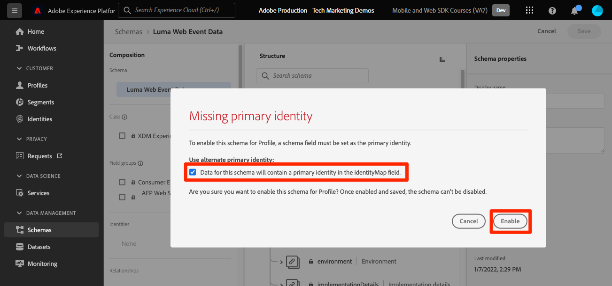

# Trasmettere dati ad Experience Platform con Web SDK

Scopri come trasferire i dati web in streaming a Adobe Experience Platform con Platform Web SDK.

Experience Platform è la spina dorsale di tutte le nuove applicazioni Experience Cloud, come Adobe Real-Time Customer Data Platform, Adobe Customer Journey Analytics e Adobe Journey Optimizer. Queste applicazioni sono progettate per utilizzare Platform Web SDK come metodo ottimale di raccolta dei dati web.

Experience Platform utilizza lo stesso schema XDM creato in precedenza per acquisire i dati dell’evento dal sito web Luma. Quando tali dati vengono inviati a Platform Edge Network, la configurazione dello stream di dati può inoltrarli ad Experience Platform.

## Obiettivi di apprendimento

Alla fine di questa lezione, potrai:

* Creare un set di dati in Adobe Experience Platform
* Configurare lo stream di dati per inviare dati Web SDK a Adobe Experience Platform
* Abilitare lo streaming dei dati web per Real-Time Customer Profile
* Convalidare i dati sono stati inseriti sia nel set di dati di Platform che nel profilo cliente in tempo reale
* Acquisire i dati del programma fedeltà di esempio in Platform
* Creare un pubblico di Platform semplice

## Prerequisiti

Per completare questa lezione, devi prima:

* Accedere a un’applicazione Adobe Experience Platform come Real-Time Customer Data Platform, Journey Optimizer o Customer Journey Analytics
* Completa le lezioni precedenti nelle sezioni Configurazione iniziale e Configurazione tag di questa esercitazione.

>[!NOTE]
>
>Se non disponi di applicazioni Platform, puoi saltare questa lezione o continuare a leggerla.

## Creare un set di dati

Tutti i dati acquisiti correttamente in Adobe Experience Platform vengono memorizzati nel data lake come set di dati. Un [set di dati](https://experienceleague.adobe.com/it/docs/experience-platform/catalog/datasets/overview) è un costrutto di archiviazione e gestione per una raccolta di dati, in genere una tabella che contiene uno schema (colonne) e campi (righe). I set di dati contengono anche metadati che descrivono vari aspetti dei dati memorizzati.

Configuriamo un set di dati per i dati dell’evento web Luma:

1. Vai all&#39;interfaccia [Experience Platform](https://experience.adobe.com/platform/) o [Journey Optimizer](https://experience.adobe.com/journey-optimizer/)
1. Conferma di trovarti nella sandbox di sviluppo che stai utilizzando per questa esercitazione
1. Apri **[!UICONTROL Gestione dati > Set di dati]** dal menu di navigazione a sinistra
1. Seleziona **[!UICONTROL Crea set di dati]**

   

1. Seleziona l&#39;opzione **[!UICONTROL Crea set di dati dallo schema]**

   

1. Seleziona lo schema `Luma Web Event Data` creato nella [lezione precedente](configure-schemas.md), quindi seleziona **[!UICONTROL Successivo]**

   

1. Fornisci un **[!UICONTROL Nome]** e una **[!UICONTROL Descrizione]** facoltativi per il set di dati. Per questo esercizio, utilizza `Luma Web Event Data`, quindi seleziona **[!UICONTROL Fine]**

   

Ora è configurato un set di dati per iniziare a raccogliere dati dall’implementazione di Platform Web SDK.

## Configurare lo stream di dati

Ora puoi configurare il [!UICONTROL flusso di dati] per inviare dati a [!UICONTROL Adobe Experience Platform]. Lo stream di dati è il collegamento tra la proprietà tag, Platform Edge Network e il set di dati Experience Platform.

1. Apri l&#39;interfaccia di [Data Collection](https://experience.adobe.com/#/data-collection){target="blank"}
1. Seleziona **[!UICONTROL Datastreams]** dal menu di navigazione a sinistra
1. Apri lo stream di dati creato nella lezione [Configurare uno stream di dati](configure-datastream.md), `Luma Web SDK`

   

1. Seleziona **[!UICONTROL Aggiungi servizio]**
   
1. Seleziona **[!UICONTROL Adobe Experience Platform]** come **[!UICONTROL Servizio]**
1. Seleziona `Luma Web Event Data` come **[!UICONTROL Set di dati evento]**

1. Seleziona **[!UICONTROL Salva]**.

   

Quando generi traffico sul [sito demo Luma](https://luma.enablementadobe.com/content/luma/us/en.html) mappato alla proprietà tag, i dati popolano il set di dati in Experience Platform.

## Convalidare il set di dati

Questo passaggio è fondamentale per assicurarsi che i dati siano arrivati nel set di dati. Esistono due aspetti della convalida dei dati inviati al set di dati.

* Convalida tramite [!UICONTROL Experience Platform Debugger]
* Convalida tramite [!UICONTROL Anteprima set di dati]
* Convalida tramite [!UICONTROL Query Service]

### Experience Platform Debugger

Questi passaggi sono più o meno gli stessi della lezione di [Debugger](validate-with-debugger.md). Tuttavia, poiché i dati verranno inviati a Platform solo dopo averli abilitati nello stream di dati, devi generare altri dati di esempio:

1. Apri il [sito di dimostrazione Luma](https://luma.enablementadobe.com/content/luma/us/en.html) e seleziona l&#39;icona dell&#39;estensione [!UICONTROL Experience Platform Debugger]

1. Configura il debugger per mappare la proprietà tag nell&#39;ambiente di sviluppo *your*, come descritto nella lezione [Convalida con debugger](validate-with-debugger.md)

   

1. Accedi al sito Luma utilizzando le credenziali `test@test.com`/`test`

1. Torna alla [home page di Luma](https://luma.enablementadobe.com/content/luma/us/en.html)

1. All’interno dei beacon di rete di Platform Web SDK mostrati dal debugger, seleziona la riga &quot;events&quot; (eventi) per espandere i dettagli in un pop-up

   

1. Cerca &quot;identityMap&quot; all’interno del pop-up. Qui dovresti trovare lumaCrmId con tre chiavi di authenticatedState, id e primary
   

Ora i dati devono essere inseriti nel set di dati `Luma Web Event Data` e pronti per la convalida &quot;Anteprima set di dati&quot;.

### Visualizzare l’anteprima del set di dati

Per verificare che i dati siano stati inseriti nel data lake di Platform, un&#39;opzione rapida consiste nell&#39;utilizzare la funzione **[!UICONTROL Anteprima set di dati]**. I dati del Web SDK vengono salvati in micro-batch nel data lake e aggiornati periodicamente nell’interfaccia di Platform. Potrebbero essere necessari 10-15 minuti per visualizzare i dati generati.

1. Nell&#39;interfaccia [Experience Platform](https://experience.adobe.com/platform/), seleziona **[!UICONTROL Gestione dati > Set di dati]** nel menu di navigazione a sinistra per aprire il dashboard **[!UICONTROL Set di dati]**.

   Il dashboard elenca tutti i set di dati disponibili per l’organizzazione. Vengono visualizzati i dettagli di ciascun set di dati elencato, compreso il nome, lo schema a cui il set di dati aderisce e lo stato dell’esecuzione di acquisizione più recente.

1. Seleziona il set di dati `Luma Web Event Data` per aprirne la schermata **[!UICONTROL Attività set di dati]**.

   

   La schermata dell’attività include un grafico che visualizza la frequenza dei messaggi utilizzati e un elenco dei batch riusciti e non riusciti.

1. Dalla schermata **[!UICONTROL Attività set di dati]**, seleziona **[!UICONTROL Anteprima set di dati]** nell&#39;angolo superiore destro dello schermo per visualizzare in anteprima fino a 100 righe di dati. Se il set di dati è vuoto, il collegamento di anteprima viene disattivato.

   

   Nella finestra di anteprima, a destra viene visualizzata la vista gerarchica dello schema per il set di dati.

   

### Eseguire una query sui dati

1. Nell&#39;interfaccia [Experience Platform](https://experience.adobe.com/platform/), seleziona **[!UICONTROL Gestione dati > Query]** nel menu di navigazione a sinistra per aprire la schermata **[!UICONTROL Query]**.
1. Seleziona **[!UICONTROL Crea query]**
1. Eseguire innanzitutto una query per visualizzare tutti i nomi delle tabelle nel data lake. Immettere `SHOW TABLES` nell&#39;editor delle query e fare clic sull&#39;icona di riproduzione per eseguire la query.
1. Nei risultati, il nome della tabella sarà simile a `luma_web_event_data`
1. Eseguire una query sulla tabella con una semplice query che fa riferimento alla tabella (per impostazione predefinita la query è limitata a 100 risultati): `SELECT * FROM "luma_web_event_data"`
1. Dopo alcuni istanti dovresti vedere dei record di esempio dei tuoi dati web.

>[!ERROR]
>
>Se ricevi un errore di tipo &quot;Tabella non predisposta&quot;, controlla nuovamente il nome della tabella. Potrebbe anche darsi che il microbatch di dati non sia ancora approdato nel data lake. Riprova tra 10-15 minuti.

>[!INFO]
>
>  Per ulteriori dettagli sul servizio query di Adobe Experience Platform, vedi [Esplora i dati](https://experienceleague.adobe.com/it/docs/platform-learn/tutorials/queries/explore-data) nella sezione Esercitazioni di Platform.

## Abilitare il set di dati e lo schema per Real-Time Customer Profile

Per i clienti di Real-Time Customer Data Platform e Journey Optimizer, il passaggio successivo consiste nell’abilitare il set di dati e lo schema per Real-Time Customer Profile. Lo streaming di dati da Web SDK sarà una delle molte origini dati che fluiranno in Platform e desideri unire i tuoi dati web con altre origini dati per creare profili cliente a 360 gradi. Per ulteriori informazioni su Real-Time Customer Profile, guarda questo breve video:

>[!VIDEO](https://video.tv.adobe.com/v/36266?learn=on&captions=ita)

>[!CAUTION]
>
>Quando lavori con il tuo sito web e i tuoi dati, ti consigliamo di convalidarli in modo più affidabile prima di abilitarli per Real-Time Customer Profile.

**Per abilitare il set di dati:**

1. Apri il set di dati creato, `Luma Web Event Data`

1. Seleziona **[!UICONTROL Attiva/Disattiva profilo]** per attivarlo

   

1. Conferma di voler **[!UICONTROL abilitare]** il set di dati

   

**Per abilitare lo schema:**

1. Apri lo schema creato, `Luma Web Event Data`

1. Seleziona **[!UICONTROL Attiva/Disattiva profilo]** per attivarlo

   

1. Selezionare **[!UICONTROL I dati per questo schema conterranno un&#39;identità primaria nel campo identityMap.]**

   >[!IMPORTANT]
   >
   >    Le identità primarie sono necessarie in ogni record inviato a Real-Time Customer Profile. In genere, i campi di identità sono etichettati all’interno dello schema. Quando si utilizzano le mappe di identità, tuttavia, i campi di identità non sono visibili all’interno dello schema. Questa finestra di dialogo conferma che hai in mente un’identità primaria e che la specificherai in una mappa di identità al momento dell’invio dei dati. Come sai, Web SDK utilizza una mappa di identità con Experience Cloud Id (ECID) come identità primaria predefinita e un ID autenticato come identità primaria, se disponibile.

1. Seleziona **[!UICONTROL Abilita]**

   

1. Seleziona **[!UICONTROL Salva]** per salvare lo schema aggiornato

Ora lo schema è abilitato anche per il profilo.

>[!IMPORTANT]
>
>    Una volta abilitato lo schema per il profilo, non è possibile disattivarlo o eliminarlo senza reimpostare o eliminare l’intera sandbox. Inoltre, i campi non possono essere rimossi dallo schema dopo questo punto.
>
>   
> Quando lavori con i tuoi dati, ti consigliamo di eseguire le operazioni nel seguente ordine:
> 
> * Innanzitutto, acquisisci alcuni dati nei set di dati.
> * Risolvi eventuali problemi che sorgono durante il processo di acquisizione dei dati (ad esempio, problemi di convalida o mappatura dei dati).
> * Abilitare i set di dati e gli schemi per il profilo
> * Riacquisire i dati, se necessario

### Convalidare un profilo

Puoi cercare un profilo cliente nell’interfaccia di Platform (o nell’interfaccia di Journey Optimizer) per verificare che i dati siano stati inseriti nel profilo cliente in tempo reale. Come suggerisce il nome, i profili si popolano in tempo reale, quindi non si verifica alcun ritardo come con la convalida dei dati nel set di dati.

Innanzitutto devi generare più dati campione. Ripeti i passaggi precedenti di questa lezione per accedere al sito web Luma quando è mappato alla proprietà tag. Esaminare la richiesta Platform Web SDK per assicurarsi che invii dati con `lumaCRMId`.

1. Nell&#39;interfaccia [Experience Platform](https://experience.adobe.com/platform/), seleziona **[!UICONTROL Cliente]** > **[!UICONTROL Profili]** nell&#39;area di navigazione a sinistra

1. Poiché lo spazio dei nomi **[!UICONTROL Identity]** utilizza `lumaCRMId`
1. Copia e incolla il valore di `lumaCRMId` passato nella chiamata esaminata in Experience Platform Debugger, in questo caso `b642b4217b34b1e8d3bd915fc65c4452`.

   

1. Se nel profilo di `lumaCRMId` è presente un valore valido, nella console viene popolato un ID profilo:

   

1. Per visualizzare il **[!UICONTROL Profilo cliente]** completo per ogni ID, seleziona il **[!UICONTROL ID profilo]** nella finestra principale.

   >[!NOTE]
   >
   >Nota: è possibile selezionare il collegamento ipertestuale dell’ID profilo oppure, se si seleziona la riga, viene visualizzato un menu a destra in cui è possibile selezionare il collegamento ipertestuale ID profilo
   > 

   Qui puoi visualizzare tutte le identità collegate a `lumaCRMId`, ad esempio `ECID`.

   

Ora hai abilitato Platform Web SDK per Experience Platform (e Real-Time CDP! E Journey Optimizer! E Customer Journey Analytics!).

## Creare un pubblico valutato da Edge

Si consiglia di completare questo esercizio per i clienti di Real-Time Customer Data Platform e Journey Optimizer.

Quando i dati di Web SDK vengono acquisiti in Adobe Experience Platform, possono essere arricchiti da altre origini dati acquisite in Platform. Ad esempio, quando un utente accede al sito Luma, in Experience Platform viene creato un grafico delle identità e tutti gli altri set di dati abilitati per il profilo possono potenzialmente essere uniti per creare profili cliente in tempo reale. Per vedere questo in azione, creerai rapidamente un altro set di dati in Adobe Experience Platform con alcuni dati di fedeltà di esempio, in modo da poter utilizzare i profili cliente in tempo reale con Real-Time Customer Data Platform e Journey Optimizer. In seguito, potrai creare un pubblico in base a questi dati.

### Creare uno schema Fedeltà e acquisire dati di esempio

Poiché hai già fatto esercizi simili, le istruzioni saranno brevi.

Creare lo schema fedeltà:

1. Crea un nuovo schema
1. Scegli **[!UICONTROL Profilo individuale]** come [!UICONTROL classe base]
1. Denomina lo schema `Luma Loyalty Schema`
1. Aggiungi il gruppo di campi [!UICONTROL Dettagli fedeltà]
1. Aggiungi il gruppo di campi [!UICONTROL Dettagli demografici]
1. Selezionare il campo `Person ID` e contrassegnarlo come [!UICONTROL Identità] e [!UICONTROL Identità primaria] utilizzando lo spazio dei nomi `Luma CRM Id` [!UICONTROL Identità].
1. Abilita lo schema per [!UICONTROL Profilo]. Se non riesci a trovare l’interruttore Profilo, prova a fare clic sul nome dello schema in alto a sinistra.
1. Salvare lo schema

   

Per creare il set di dati e acquisire i dati di esempio:

1. Crea un nuovo set di dati da `Luma Loyalty Schema`
1. Denomina il set di dati `Luma Loyalty Dataset`
1. Abilita il set di dati per [!UICONTROL Profilo]
1. Scarica il file di esempio [luma-loyalty-forWeb.json](assets/luma-loyalty-forWeb.json)
1. Trascinare il file nel set di dati
1. Conferma che i dati siano stati acquisiti correttamente

   

### Impostare un criterio di unione Attivo su Edge

Tutti i tipi di pubblico vengono creati con un criterio di unione. I criteri di unione creano diverse &quot;viste&quot; di un profilo, possono contenere un sottoinsieme di set di dati e prescrivere un ordine di priorità quando set di dati diversi contribuiscono agli stessi attributi di profilo. Per essere valutato al limite, un pubblico deve utilizzare un criterio di unione con l&#39;impostazione **[!UICONTROL Criterio di unione attivo su Edge]**.

>[!IMPORTANT]
>
>Solo un criterio di unione per sandbox può avere l&#39;impostazione **[!UICONTROL Criterio di unione attivo su Edge]**

1. Apri l’interfaccia di Experience Platform o Journey Optimizer e accertati di trovarti nell’ambiente di sviluppo utilizzato per l’esercitazione.
1. Passa a **[!UICONTROL Cliente]** > **[!UICONTROL Profili]** > **[!UICONTROL Pagina Criteri di unione]**
1. Apri il **[!UICONTROL criterio di unione predefinito]** (probabilmente denominato `Default Timebased`)
   
1. Abilita l&#39;impostazione **[!UICONTROL Criterio di unione attivo su Edge]**
1. Seleziona **[!UICONTROL Avanti]**

   
1. Continua a selezionare **[!UICONTROL Avanti]** per continuare con gli altri passaggi del flusso di lavoro e seleziona **[!UICONTROL Fine]** per salvare le impostazioni
   

Ora puoi creare tipi di pubblico da valutare su Edge.

### Creazione di un pubblico

I tipi di pubblico raggruppano i profili in base alle caratteristiche comuni. Crea un pubblico semplice da utilizzare in Real-Time CDP o Journey Optimizer:

1. Nell&#39;interfaccia di Experience Platform o Journey Optimizer, vai a **[!UICONTROL Cliente]** > **[!UICONTROL Tipi di pubblico]** nel menu di navigazione a sinistra
1. Seleziona **[!UICONTROL Crea pubblico]**
1. Seleziona **[!UICONTROL Genera regola]**
1. Seleziona **[!UICONTROL Crea]**

   

1. Seleziona **[!UICONTROL Attributi]**
1. Trova il campo **[!UICONTROL Fedeltà]** > **[!UICONTROL Livello]** e trascinalo nella sezione **[!UICONTROL Attributi]**
1. Definisci il pubblico come utenti il cui `tier` è `gold`
1. Denomina il pubblico `Luma Loyalty Rewards – Gold Status`
1. Seleziona **[!UICONTROL Edge]** come **[!UICONTROL metodo di valutazione]**
1. Seleziona **[!UICONTROL Salva]**

   

>[!NOTE]
>
> Poiché il criterio di unione predefinito è stato impostato come **[!UICONTROL Criterio di unione attivo su Edge]**, il pubblico creato viene automaticamente associato a questo criterio di unione.

Poiché si tratta di un pubblico molto semplice, possiamo utilizzare il metodo di valutazione Edge. I tipi di pubblico di Edge valutano al limite, quindi, nella stessa richiesta effettuata dal Web SDK a Platform Edge Network, possiamo valutare la definizione del pubblico e confermare immediatamente se l’utente è idoneo.

>[!NOTE]
>
>Grazie per aver dedicato tempo all&#39;apprendimento di Adobe Experience Platform Web SDK. Se hai domande, vuoi condividere commenti generali o suggerimenti su contenuti futuri, condividili in questo [post di discussione della community Experience League](https://experienceleaguecommunities.adobe.com/t5/adobe-experience-platform-data/tutorial-discussion-implement-adobe-experience-cloud-with-web/td-p/444996)
