# Profili cliente in tempo reale e segmentazione di Edge

## Abilitare il set di dati e lo schema per Real-time Customer Profile

Per i clienti di Real-Time Customer Data Platform e Journey Optimizer, il passaggio successivo consiste nell’abilitare il set di dati e lo schema per Real-Time Customer Profile. Lo streaming di dati da Web SDK sarà una delle molte origini dati che fluiranno in Platform e desideri unire i tuoi dati web con altre origini dati per creare profili cliente a 360 gradi. Per ulteriori informazioni su Real-Time Customer Profile, guarda questo breve video:

>[!VIDEO](https://video.tv.adobe.com/v/27251?learn=on&captions=eng)

>[!CAUTION]
>
>Quando lavori con il tuo sito web e i tuoi dati, ti consigliamo di convalidarli in modo più affidabile prima di abilitarli per Real-Time Customer Profile.

### Abilita lo schema

Per abilitare lo schema per il profilo:

1. Apri lo schema creato, `Luma Web Event Data`

1. Seleziona **[!UICONTROL Attiva/Disattiva profilo]** per attivarlo

   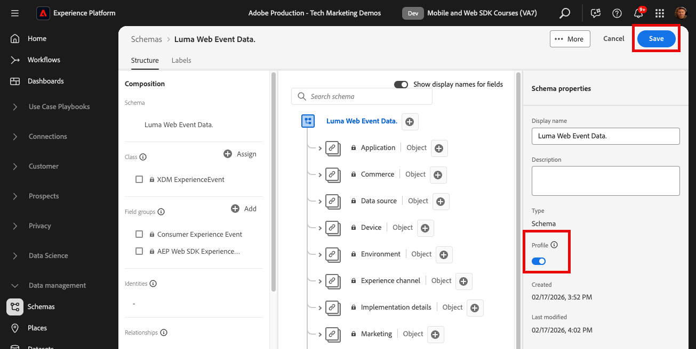

1. Selezionare **[!UICONTROL I dati per questo schema conterranno un&#39;identità primaria nel campo identityMap.]**

1. Seleziona **[!UICONTROL Abilita]**

   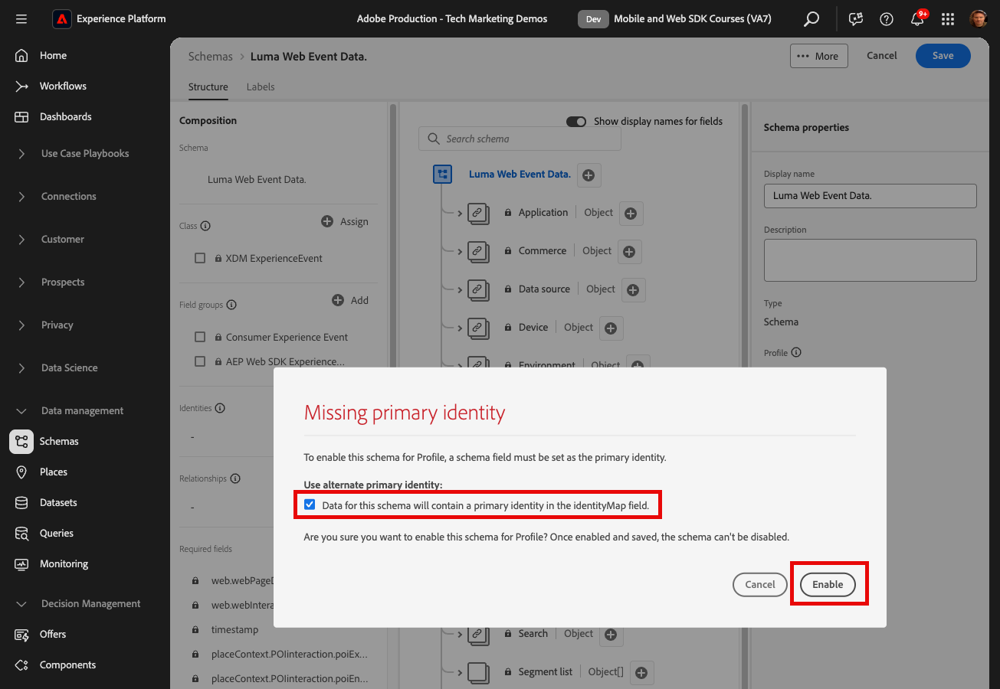

   >[!IMPORTANT]
   >
   >    Le identità primarie sono necessarie in ogni record inviato a Real-Time Customer Profile. Ogni record diventa un &quot;frammento di profilo&quot; e le identità primarie sono le chiavi per cercare tali frammenti.
   > 
   > Con alcuni tipi di dati, i campi di identità sono etichettati nello schema. Tuttavia, con i dati evento acquisiti dagli SDK di Experience Platform, le mappe di identità sono tipiche e i campi di identità non sono visibili nello schema.
   >
   > Questa finestra di dialogo conferma che hai in mente un’identità primaria e che la specificherai in una mappa di identità al momento dell’invio dei dati, configurala con le regole di collegamento del grafico di identità o entrambe. Ti consigliamo di fare entrambe le cose.
   >
   > Come sai, la nostra implementazione Luma utilizza una mappa di identità con lumaCrmId autenticato come identità principale quando disponibile, altrimenti per impostazione predefinita verrà utilizzato l’Experience Cloud Id (ECID).

1. Seleziona **[!UICONTROL Salva]** per salvare lo schema aggiornato

Ora lo schema è abilitato per il profilo.

### Abilitare il set di dati

Per abilitare il set di dati:

1. Apri il set di dati creato, `Luma Web Event Data`

1. Seleziona **[!UICONTROL Attiva/Disattiva profilo]** per attivarlo

   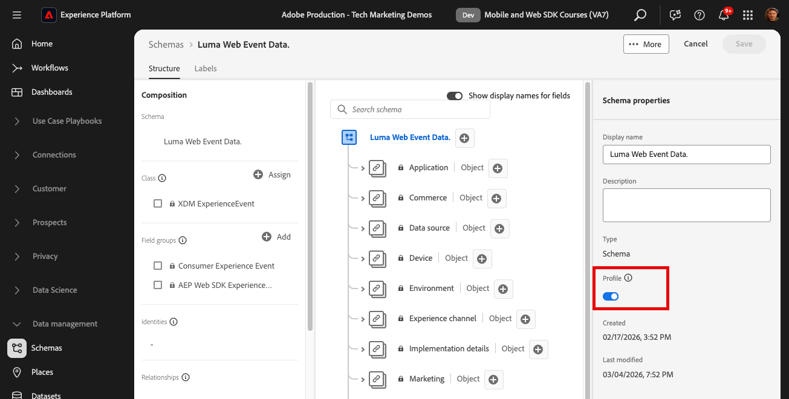

1. Conferma di voler **[!UICONTROL abilitare]** il set di dati

>[!IMPORTANT]
>
>  Una volta abilitato uno schema per il profilo e che i dati vengono acquisiti nel set di dati, non può essere disabilitato o eliminato senza reimpostare o eliminare l’intera sandbox. Inoltre, i campi che hanno ricevuto i dati non possono essere rimossi dallo schema dopo questo punto.
>
>   
> Quando lavori con i tuoi dati, ti consigliamo di eseguire le operazioni nel seguente ordine:
> 
> * Innanzitutto, acquisisci alcuni dati nei set di dati.
> * Risolvi eventuali problemi che sorgono durante il processo di acquisizione dei dati (ad esempio, problemi di convalida o mappatura dei dati).
> * Abilitare i set di dati e gli schemi per il profilo
> * Riacquisire i dati, se necessario

### Convalidare un profilo

Puoi cercare un profilo cliente nell’interfaccia di Platform (o nell’interfaccia di Journey Optimizer) per verificare che i dati siano stati inseriti nel profilo cliente in tempo reale. Come suggerisce il nome, i profili si popolano in tempo reale, quindi non si verifica alcun ritardo come con la convalida dei dati nel set di dati.

Innanzitutto devi generare più dati di esempio nel set di dati abilitato per il profilo:

1. Apri il [sito Web di dimostrazione Luma](https://luma.enablementadobe.com) e seleziona l&#39;icona dell&#39;estensione [!UICONTROL Experience Platform Debugger]

1. Configura il debugger per mappare la proprietà tag nell&#39;ambiente di sviluppo *your*, come descritto nella lezione [Convalida con debugger](validate-with-debugger.md)

   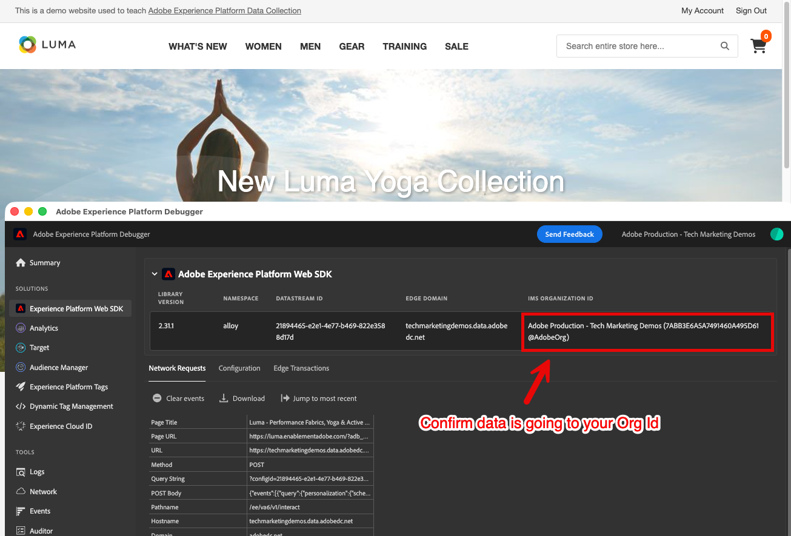

1. Sfoglia il sito web. Visualizza alcuni prodotti e aggiungi alcuni al carrello.

1. Accedi al sito Luma utilizzando le credenziali `test@test.com`/`test` (se ricevi un messaggio di posta elettronica o password non valida, crea un account con tali credenziali)

1. Apri la riga &quot;events&quot; (eventi) per cercare alcune variabili XDM
1. Cerca &quot;identityMap&quot; all’interno del pop-up. Qui dovresti trovare lumaCrmId con tre chiavi di authenticatedState, id e primary. Il valore lumaCrmId per questo accesso è `f660ab912ec121d1b1e928a0bb4bc61b`.

   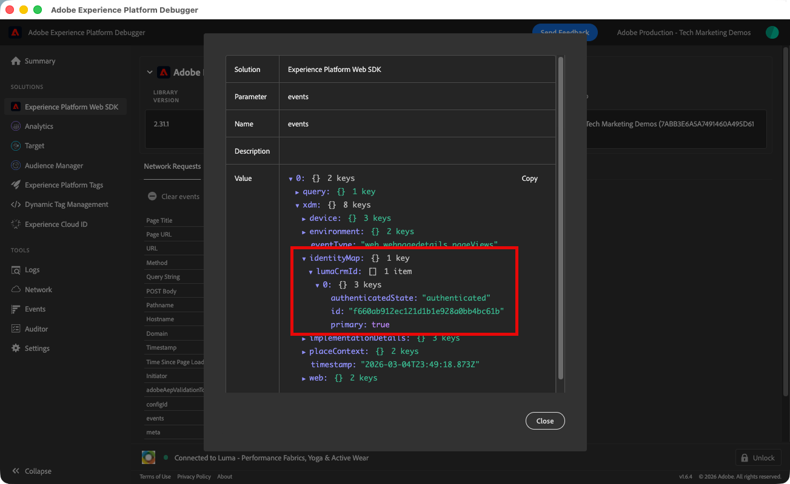

Ora cerchiamo il nostro profilo in Experience Platform:

1. Nell&#39;interfaccia [Experience Platform](https://experience.adobe.com/platform/), seleziona **[!UICONTROL Cliente]** > **[!UICONTROL Profili]** nell&#39;area di navigazione a sinistra

1. Poiché lo spazio dei nomi **[!UICONTROL Identity]** utilizza `Luma CRM ID`
1. Copia e incolla il valore di `lumaCrmId` passato nella chiamata esaminata in Experience Platform Debugger, in questo caso `f660ab912ec121d1b1e928a0bb4bc61b`

1. Se nel profilo di `lumaCRMId` è presente un valore valido, nella console viene popolato un ID profilo

1. Per visualizzare il **[!UICONTROL profilo cliente]** completo, seleziona **[!UICONTROL Visualizza]**:

   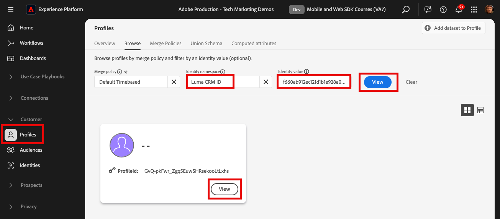

1. Viene innanzitutto visualizzato un riepilogo del profilo. Non ci sono ancora molti elementi in questo profilo, ma qui le identità collegate nel profilo, `lumaCRMId` e `ECID`:

   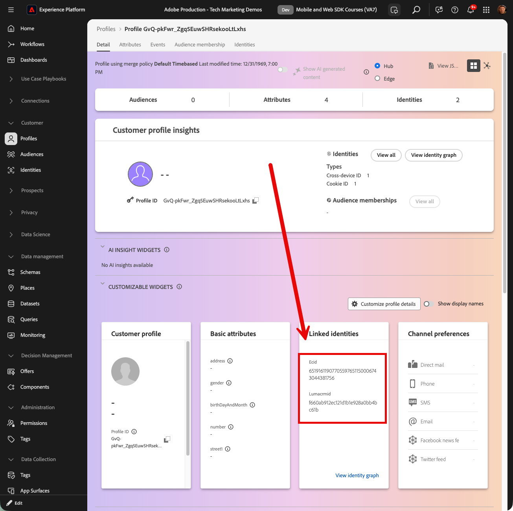

1. A questo punto, la maggior parte dei dati del profilo disponibili sono dati dell’evento provenienti dall’attività web. Seleziona **[!UICONTROL Eventi]** per visualizzare i dati di click-stream:

   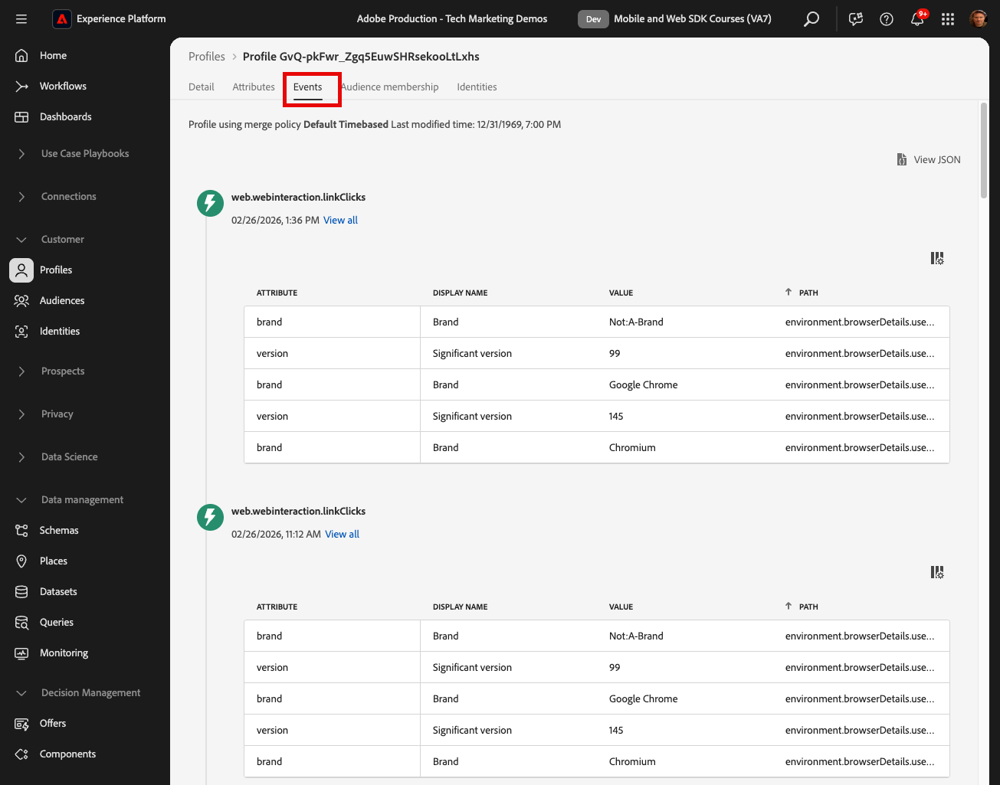

## Evitare la compressione del profilo

Ora vediamo qualcosa che non vorrai vedere accadere nella tua implementazione: i grafici si interrompono.

### Comprendere il problema

Innanzitutto, genereremo alcuni dati di esempio in modo da poter vedere il problema:

1. Senza eliminare cookie o oggetti localStorage, apri il [sito Web di dimostrazione Luma](https://luma.enablementadobe.com) e seleziona l&#39;icona dell&#39;estensione [!UICONTROL Experience Platform Debugger]

1. Configura il debugger per mappare la proprietà tag nell&#39;ambiente di sviluppo *your*, come descritto nella lezione [Convalida con debugger](validate-with-debugger.md)

   

1. Si spera di essere ancora connessi al sito Luma utilizzando le credenziali `test@test.com`/`test`. In caso contrario, accedi di nuovo.

1. Sfoglia il sito web. Visualizza alcuni prodotti e aggiungi alcuni al carrello.

1. Ora, esci.

1. Effettuare di nuovo l&#39;accesso, creando un account come utente diverso (`spouse@test.com/test`). Stiamo tentando di replicare uno scenario di &quot;dispositivo condiviso&quot;, in cui due utenti condividono lo stesso browser web, si autenticano nello stesso sito web e condividono lo stesso valore `ECID`.
1. Conferma nel debugger di avere un LumaCrmId diverso, `98d73957f59c67617611d56ba7e8dbaa` per `spouse@test.com/test`.

   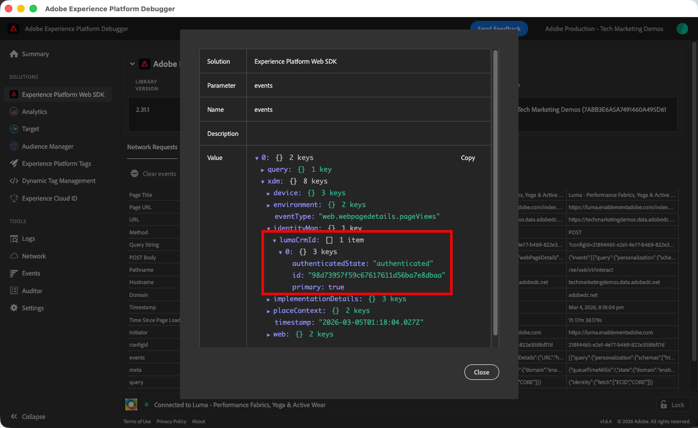

1. Visualizza alcuni prodotti aggiuntivi

Ora cerca di nuovo il profilo:

1. Cerca di nuovo `Luma CRM ID` è uguale a `f660ab912ec121d1b1e928a0bb4bc61b`
1. Il profilo ora è collegato a due diversi ID CRM Luma

1. Seleziona **[!UICONTROL Visualizza grafico identità]**

   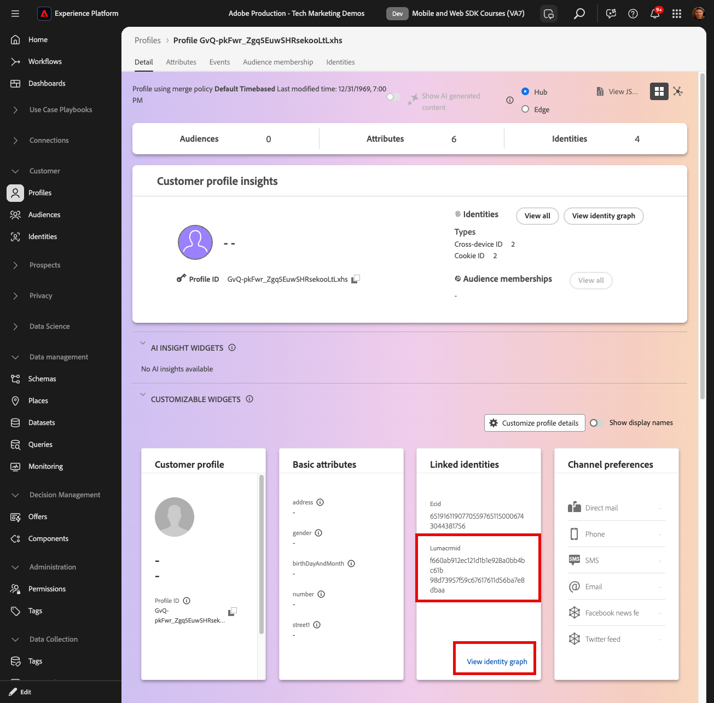

1. Il grafo delle identità consente di visualizzare questo profilo in cui, a causa della condivisione del dispositivo, due valori `lumaCrmId` sono collegati da un valore `ECID` comune.

   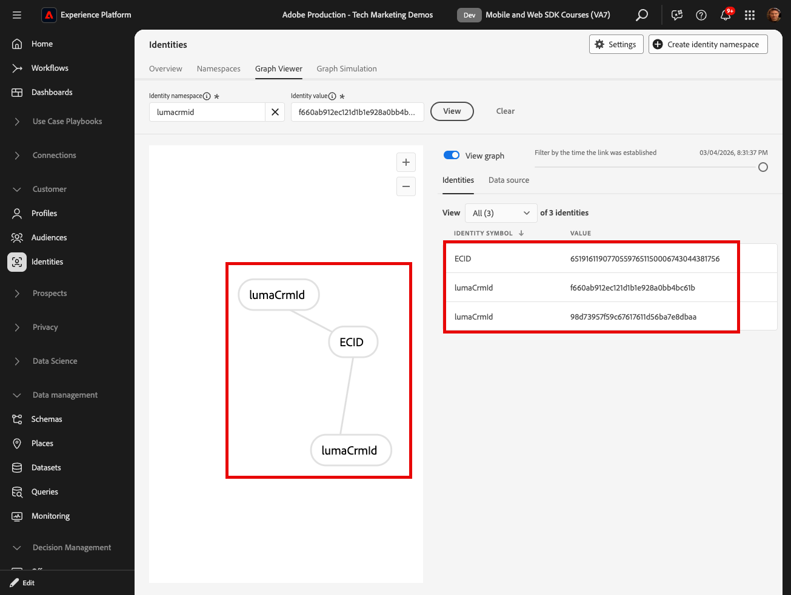

Questo può essere un grosso problema per un’implementazione Experience Platform. Non solo i dati evento di entrambi gli utenti vengono uniti in un singolo profilo, ma verranno uniti anche altri tipi di dati acquisiti in Platform utilizzando questi valori `lumaCrmId`.

### Correggilo con le regole di collegamento del grafico delle identità

Per risolvere in modo preventivo il problema di compressione del grafico, utilizza la funzione delle regole di collegamento del grafico delle identità in Adobe Experience Platform prima di abilitare l’implementazione di Web SDK.

>[!WARNING]
>
> Questi passaggi sono in genere configurati da un architetto di dati che gestisce l’intera implementazione di Platform. La funzione offre molto di più di quanto mostrato qui e molti scenari complessi che dovrebbero essere accuratamente simulati per primi.
>
> Completa questi passaggi solo se completi questa esercitazione in una sandbox di sviluppo dedicata che può essere eliminata dopo aver completato questa esercitazione. Queste modifiche alla sandbox non possono essere annullate. Per ulteriori informazioni, consulta le [esercitazioni sulle regole di collegamento del grafico delle identità](https://experienceleague.adobe.com/it/docs/platform-learn/tutorials/identities/graph-linking-rules/overview).

Per abilitare le regole di collegamento del grafico delle identità:

1. Da qualsiasi schermata Identites, apri **[!UICONTROL Impostazioni]**:

   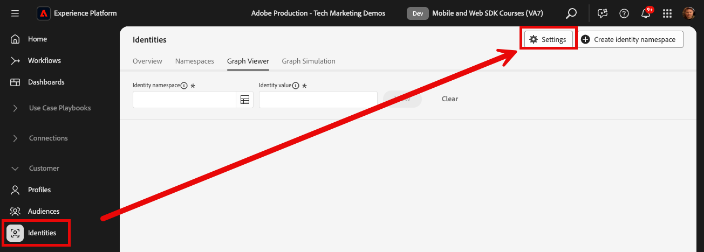

1. Rivedi gli avvisi nel modale e seleziona **[!UICONTROL Procedi]**
1. Trascina `Luma CRM ID` in modo che rappresenti lo spazio dei nomi con priorità più alta nell&#39;elenco
1. Controlla l&#39;impostazione **[!UICONTROL Univoco per grafico]** per `Luma CRM ID`
1. Seleziona **[!UICONTROL Avanti]**
   
1. Rivedi il modale e **[!UICONTROL Conferma]**
1. Seleziona **[!UICONTROL Avanti]** per saltare il passaggio di simulazione

   >[!WARNING]
   >
   > Anche in questo caso, non completare il flusso di lavoro per abilitare queste impostazioni di identità se non utilizzi una sandbox di sviluppo dedicata.

1. Inserisci il nome della sandbox e seleziona **[!UICONTROL Conferma]**

   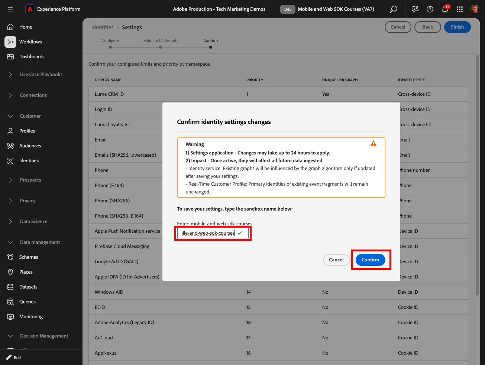

Torna al sito tra 24 ore, accedi di nuovo come `test@test.com` o `spouse@test.com` e verifica se i profili sono stati separati.

## Creare un pubblico valutato da Edge

Si consiglia di completare questo esercizio per i clienti di Real-Time Customer Data Platform e Journey Optimizer.

Quando i dati di Web SDK vengono acquisiti in Adobe Experience Platform, possono essere arricchiti da altre origini dati acquisite in Platform. Ad esempio, quando un utente accede al sito Luma, in Experience Platform viene creato un grafico delle identità e tutti gli altri set di dati abilitati per il profilo possono potenzialmente essere uniti per creare profili cliente in tempo reale. Per vedere questo in azione, creerai rapidamente un altro set di dati in Adobe Experience Platform con alcuni dati di fedeltà di esempio, in modo da poter utilizzare i profili cliente in tempo reale con Real-Time Customer Data Platform e Journey Optimizer. In seguito, potrai creare un pubblico in base a questi dati.

### Creare uno schema Fedeltà e acquisire dati di esempio

Poiché hai già fatto esercizi simili, le istruzioni saranno brevi.

Creare lo schema fedeltà:

1. Crea un nuovo schema
1. Scegli **[!UICONTROL Profilo individuale]** come [!UICONTROL classe base]
1. Denomina lo schema `Luma Loyalty Schema`
1. Aggiungi il gruppo di campi [!UICONTROL Dettagli fedeltà]
1. Aggiungi il gruppo di campi [!UICONTROL Dettagli demografici]
1. Selezionare il campo `Person ID` e contrassegnarlo come [!UICONTROL Identità] e [!UICONTROL Identità primaria] utilizzando lo spazio dei nomi `Luma CRM Id` [!UICONTROL Identità].
1. Abilita lo schema per [!UICONTROL Profilo]. Se non riesci a trovare l’interruttore Profilo, prova a fare clic sul nome dello schema in alto a sinistra.
1. Salvare lo schema

   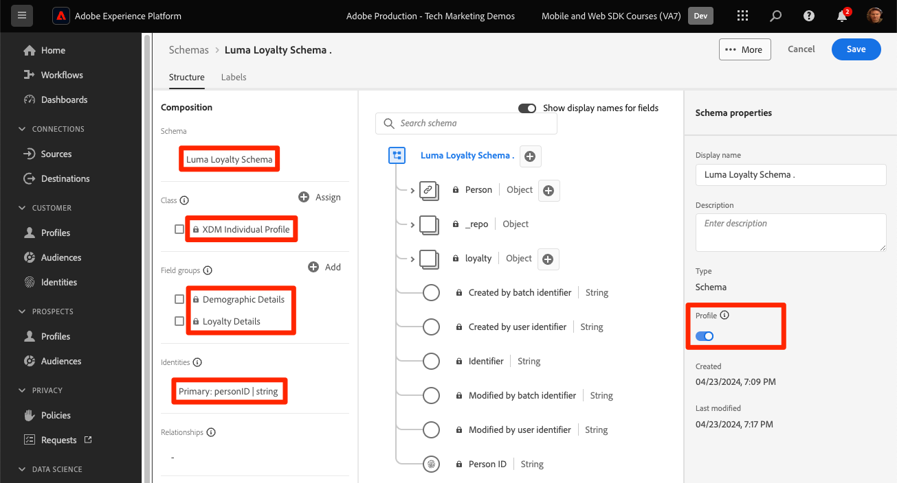

Per creare il set di dati e acquisire i dati di esempio:

1. Crea un nuovo set di dati da `Luma Loyalty Schema`
1. Denomina il set di dati `Luma Loyalty Dataset`
1. Abilita il set di dati per [!UICONTROL Profilo]
1. Scarica il file di esempio [luma-loyalty-forWeb.json](assets/luma-loyalty-forWeb.json)
1. Trascinare il file nel set di dati
1. Conferma che i dati siano stati acquisiti correttamente

   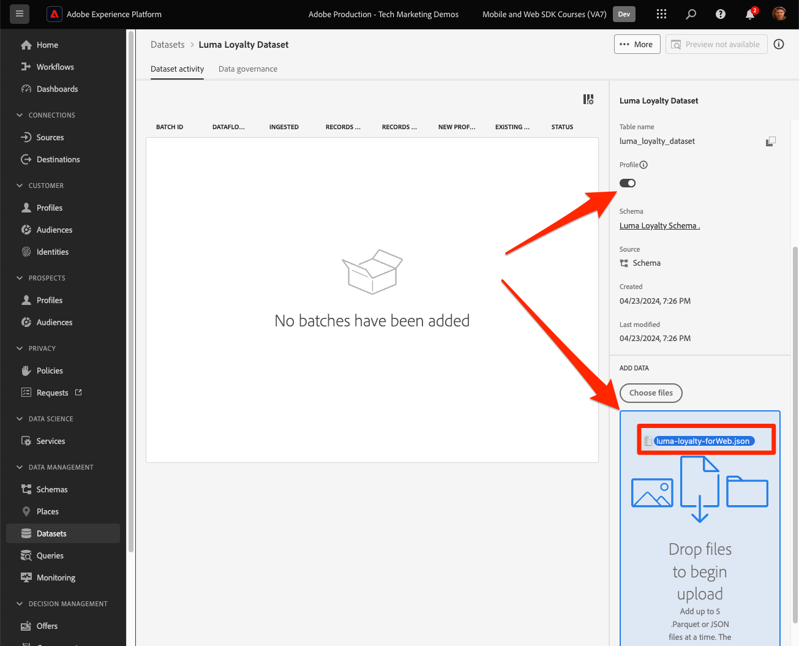

### Impostare un criterio di unione Attivo su Edge

Tutti i tipi di pubblico vengono creati con un criterio di unione. I criteri di unione creano diverse &quot;viste&quot; di un profilo, possono contenere un sottoinsieme di set di dati e prescrivere un ordine di priorità quando set di dati diversi contribuiscono agli stessi attributi di profilo. Per essere valutato al limite, un pubblico deve utilizzare un criterio di unione con l&#39;impostazione **[!UICONTROL Criterio di unione attivo su Edge]**.

>[!IMPORTANT]
>
>Solo un criterio di unione per sandbox può avere l&#39;impostazione **[!UICONTROL Criterio di unione attivo su Edge]**

1. Apri l’interfaccia di Experience Platform o Journey Optimizer e accertati di trovarti nell’ambiente di sviluppo utilizzato per l’esercitazione.
1. Passa a **[!UICONTROL Cliente]** > **[!UICONTROL Profili]** > **[!UICONTROL Pagina Criteri di unione]**
1. Apri il **[!UICONTROL criterio di unione predefinito]** (probabilmente denominato `Default Timebased`)
   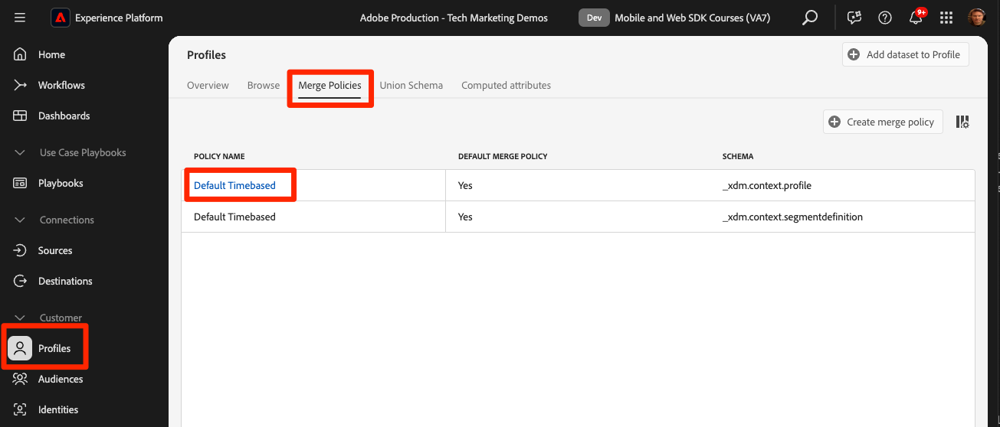
1. Abilita l&#39;impostazione **[!UICONTROL Criterio di unione attivo su Edge]**
1. Seleziona **[!UICONTROL Avanti]**

   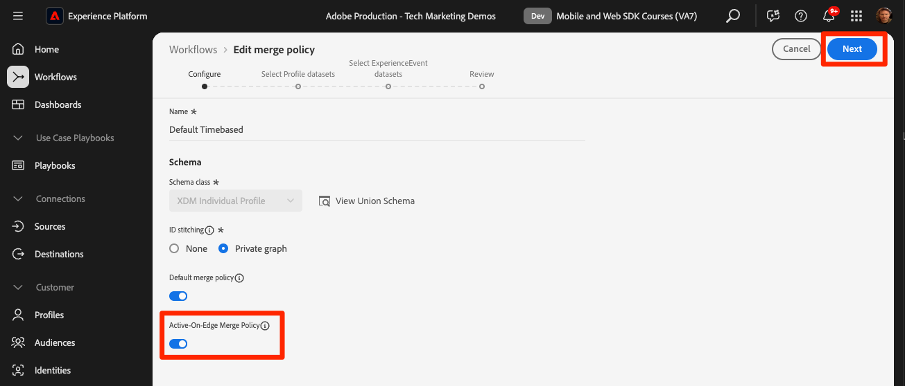
1. Continua a selezionare **[!UICONTROL Avanti]** per continuare con gli altri passaggi del flusso di lavoro e seleziona **[!UICONTROL Fine]** per salvare le impostazioni
   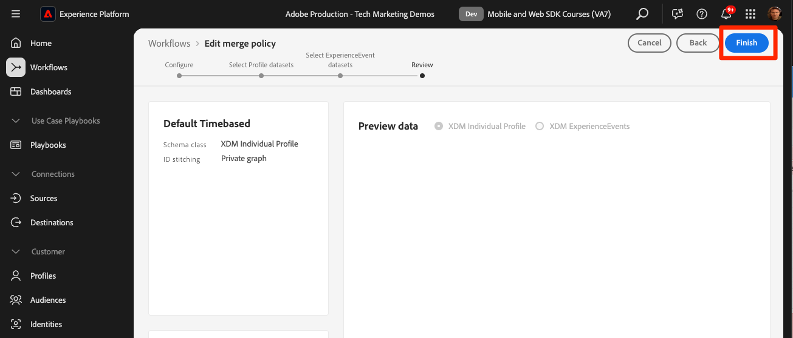

Ora puoi creare tipi di pubblico da valutare su Edge.

### Creazione di un pubblico

I tipi di pubblico raggruppano i profili in base alle caratteristiche comuni. Crea un pubblico semplice da utilizzare in Real-Time CDP o Journey Optimizer:

1. Nell&#39;interfaccia di Experience Platform o Journey Optimizer, vai a **[!UICONTROL Cliente]** > **[!UICONTROL Tipi di pubblico]** nel menu di navigazione a sinistra
1. Seleziona **[!UICONTROL Crea pubblico]**
1. Seleziona **[!UICONTROL Genera regola]**
1. Seleziona **[!UICONTROL Crea]**

   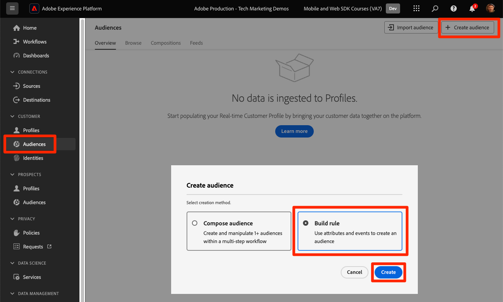

1. Seleziona **[!UICONTROL Attributi]**
1. Trova il campo **[!UICONTROL Fedeltà]** > **[!UICONTROL Livello]** e trascinalo nella sezione **[!UICONTROL Attributi]**
1. Definisci il pubblico come utenti il cui `tier` è `gold`
1. Denomina il pubblico `Luma Loyalty Rewards – Gold Status`
1. Seleziona **[!UICONTROL Edge]** come **[!UICONTROL metodo di valutazione]**
1. Seleziona **[!UICONTROL Salva]**

   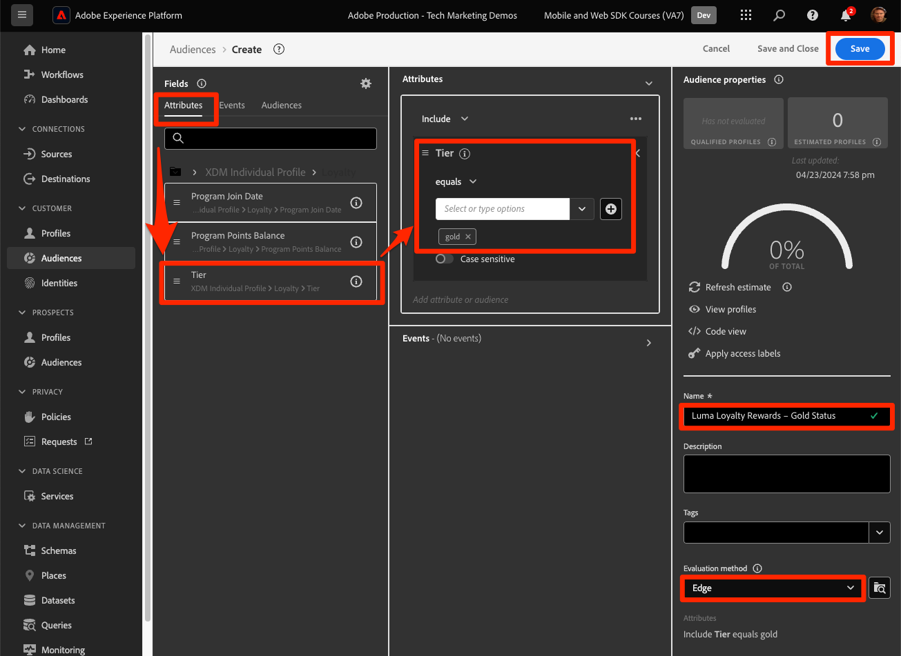

>[!NOTE]
>
> Poiché il criterio di unione predefinito è stato impostato come **[!UICONTROL Criterio di unione attivo su Edge]**, il pubblico creato viene automaticamente associato a questo criterio di unione.

Poiché si tratta di un pubblico molto semplice, possiamo utilizzare il metodo di valutazione Edge. I tipi di pubblico di Edge valutano al limite, quindi, nella stessa richiesta effettuata dal Web SDK a Platform Edge Network, possiamo valutare la definizione del pubblico e confermare immediatamente se l’utente è idoneo.

>[!NOTE]
>
>Grazie per aver dedicato tempo all&#39;apprendimento di Adobe Experience Platform Web SDK. Se hai domande, vuoi condividere commenti generali o suggerimenti su contenuti futuri, condividili in questo [post di discussione della community Experience League](https://experienceleaguecommunities.adobe.com/adobe-experience-platform-18/tutorial-discussion-implement-adobe-experience-cloud-with-web-sdk-tutorial-248848?profile.language=it)
