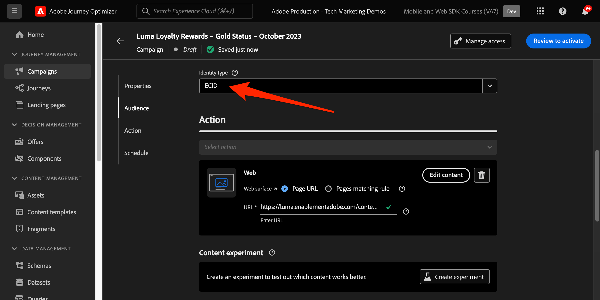

# Configurare il canale web Journey Optimizer con Web SDK

Scopri come implementare il [canale web](https://experienceleague.adobe.com/en/docs/journey-optimizer/using/web/get-started-web) di Adobe Journey Optimizer utilizzando Adobe Experience Platform Web SDK. Questa lezione descrive i prerequisiti fondamentali per il canale web, i passaggi dettagliati per la configurazione e un approfondimento su un caso d’uso incentrato sullo stato di fedeltà.

Seguendo questa lezione, gli utenti di Journey Optimizer possono utilizzare il canale web per la personalizzazione online avanzata utilizzando il web designer di Journey Optimizer.

## Finalità di apprendimento

Alla fine di questa lezione, sarai in grado di:

* Comprendi la funzione e il significato di Web SDK nella distribuzione dell’esperienza del canale web.
* Comprendi il processo di creazione di una campagna per canale web dall’inizio alla fine utilizzando il caso d’uso dei premi fedeltà Luma di esempio.
* Configura le proprietà, le azioni e le pianificazioni della campagna all’interno dell’interfaccia.
* Scopri le funzionalità e i vantaggi dell’estensione Adobe Experience Cloud Visual Editing Helper.
* Scopri come modificare il contenuto delle pagine web, incluse immagini, intestazioni e altri elementi, utilizzando la finestra di progettazione web.
* Scopri come inserire le offerte in una pagina web utilizzando il componente Decisione offerta.
* Acquisisci familiarità con le best practice per garantire la qualità e il successo di una campagna canale web.

## Prerequisiti

Per completare le lezioni in questa sezione, devi prima:

* Completa tutte le lezioni per la configurazione iniziale di Platform Web SDK, inclusa la configurazione di elementi dati e regole.
* Assicurati che la versione dell’estensione tag Adobe Experience Platform Web SDK sia 2.16 o successiva.
* Se utilizzi il web designer Journey Optimizer per creare l’esperienza del canale web, accertati di utilizzare i browser Google Chrome o Microsoft® Edge.
* Verifica inoltre di aver scaricato e abilitato l&#39;estensione del browser [Adobe Experience Cloud Visual Editing Helper](https://chromewebstore.google.com/detail/adobe-experience-cloud-vi/kgmjjkfjacffaebgpkpcllakjifppnca).
* Assicurati che i cookie di terze parti siano consentiti nel browser. Potrebbe essere necessario disattivare anche i blocchi degli annunci nel browser.

  >[!CAUTION]
  >
  > In Journey Optimizer Web Designer, alcuni siti Web potrebbero non essere aperti in modo affidabile per uno dei motivi seguenti:
  > 
  > 1. Il sito web dispone di criteri di sicurezza rigorosi.
  > 1. Il sito web è incorporato in un iframe.
  > 1. Il sito per il controllo qualità o il sito di staging del cliente non è accessibile esternamente (è un sito interno).

* Durante la creazione di esperienze Web e l&#39;inclusione di contenuto dalla libreria Adobe Experience Manager Assets Essentials, è necessario [configurare il sottodominio per la pubblicazione di questo contenuto](https://experienceleague.adobe.com/en/docs/journey-optimizer/using/web/configure-web-channel/web-delegated-subdomains).
* Se utilizzi la funzione di sperimentazione dei contenuti, assicurati che il set di dati web sia incluso anche nella configurazione di reporting.
* Attualmente, sono supportati due tipi di implementazioni per abilitare l’authoring e la distribuzione di campagne canale web sulle proprietà web:
   * Solo lato client: per modificare il sito web, è necessario implementare Adobe Experience Platform Web SDK.
   * Modalità ibrida: puoi utilizzare l’API del server Edge Network di Platform per richiedere la personalizzazione lato server. La risposta dell’API viene quindi fornita a Adobe Experience Platform Web SDK per il rendering delle modifiche sul lato client. Per ulteriori informazioni, consulta la documentazione sulle API di Adobe Experience Platform Edge Network Server. Ulteriori dettagli ed esempi di implementazione per la modalità ibrida sono disponibili in questo post di blog.

  >[!NOTE]
  >
  >L’implementazione solo lato server non è attualmente supportata.

## Terminologia

Innanzitutto, devi comprendere la terminologia utilizzata nelle campagne del canale web.

* **Canale Web**: mezzo di comunicazione o per la distribuzione di contenuti tramite il Web. Nel contesto di questa guida, si riferisce al meccanismo attraverso il quale i contenuti personalizzati vengono consegnati ai visitatori del sito web utilizzando Platform Web SDK, all’interno di Adobe Journey Optimizer.
* **Superficie Web**: fa riferimento a una proprietà Web identificata da un URL in cui viene distribuito il contenuto. Può includere una o più pagine web.
* **Web Designer di Journey Optimizer**: strumento o interfaccia specifica all&#39;interno di Journey Optimizer in cui gli utenti possono progettare le esperienze del canale Web.
* **Helper per editing video Adobe Experience Cloud**: estensione del browser per la modifica e la progettazione visiva delle esperienze dei canali Web.
* **Datastream**: una configurazione all&#39;interno del servizio Adobe Experience Platform che garantisce la consegna delle esperienze del canale web.
* **Criterio di unione**: configurazione che garantisce l&#39;attivazione e la pubblicazione accurate delle campagne in entrata.
* **Pubblico**: un segmento specifico di utenti o visitatori del sito che soddisfano determinati criteri.
* **Web designer**: interfaccia o strumento che consente di modificare e progettare le esperienze Web in modo visivo senza immergersi nel codice.
* **Editor espressioni**: strumento all&#39;interno della finestra di progettazione Web che consente agli utenti di aggiungere personalizzazioni al contenuto Web, potenzialmente basate su attributi di dati o altri criteri.
* **Componente decisione offerta**: componente nella finestra di progettazione Web che consente di decidere quale offerta è più adatta per essere visualizzata a un visitatore specifico in base alla gestione delle decisioni.
* **Esperimento sui contenuti**: un metodo per testare diverse varianti di contenuto per individuare quella che offre le migliori prestazioni in termini di metrica desiderata, ad esempio i clic in entrata.
* **Trattamento**: nel contesto di esperimenti di contenuto, un trattamento si riferisce a una specifica variante di contenuto in fase di test rispetto a un altro.
* **Simulazione**: meccanismo di anteprima per visualizzare l&#39;esperienza del canale web prima di attivarla per i tipi di pubblico live.

## Configurare lo stream di dati

Il servizio Adobe Experience Platform è già stato aggiunto allo stream di dati. Ora devi abilitare l’opzione Adobe Journey Optimizer per poter fornire esperienze di canale web.

Per configurare Adobe Journey Optimizer nello stream di dati:

1. Passare all&#39;interfaccia [Raccolta dati](https://experience.adobe.com/#/data-collection){target="blank"}.
1. Nel menu di navigazione a sinistra, seleziona **[!UICONTROL Flussi di dati]**.
1. Seleziona lo stream di dati Luma Web SDK creato in precedenza.

   

1. Seleziona **[!UICONTROL Modifica]** nel servizio Adobe Experience Platform.

   

1. Selezionare la casella **[!UICONTROL Adobe Journey Optimizer]**.

   

1. Seleziona **[!UICONTROL Salva]**.

In questo modo gli eventi in entrata per Journey Optimizer vengono gestiti correttamente dall’Edge Network di Adobe Experience Platform.

## Configurare il criterio di unione

Verificare che sia definito un criterio di unione con l&#39;opzione **[!UICONTROL Criterio di unione attivo su Edge]** abilitata. Questa opzione dei criteri di unione viene utilizzata dai canali in entrata di Journey Optimizer per garantire l’attivazione e la pubblicazione accurate delle campagne in entrata sul server Edge di.

Per configurare l’opzione nel criterio di unione:

1. Vai alla pagina **[!UICONTROL Cliente]** > **[!UICONTROL Profili]** nell&#39;interfaccia Experience Platform o Journey Optimizer.
1. Seleziona la scheda **[!UICONTROL Criteri di unione]**.
1. Seleziona il criterio (in genere è meglio utilizzare il criterio [!UICONTROL Basato su tempo predefinito]) e attiva/disattiva l&#39;opzione **[!UICONTROL Criterio di unione attivo su Edge]** nel passaggio **[!UICONTROL Configura]**.

   

## Configurare il set di dati web per la sperimentazione dei contenuti

Per utilizzare esperimenti sui contenuti nelle campagne per canali web, devi assicurarti che il set di dati web utilizzato sia incluso anche nella configurazione di reporting. Il sistema di reporting di Journey Optimizer utilizza il set di dati in modalità di sola lettura per popolare i rapporti di sperimentazione dei contenuti preconfigurati.

[L&#39;aggiunta di set di dati per il reporting dell&#39;esperimento sui contenuti è descritta in questa sezione](https://experienceleague.adobe.com/en/docs/journey-optimizer/using/content-management/content-experiment/reporting-configuration#add-datasets).

## Panoramica del caso d’uso: premi fedeltà

In questa lezione, un esempio di caso di utilizzo dei premi fedeltà viene utilizzato per descrivere nel dettaglio l’implementazione di un’esperienza di canale web utilizzando l’SDK per web.

Questo caso d’uso consente di comprendere meglio in che modo Journey Optimizer può contribuire a fornire ai clienti le migliori esperienze in entrata, utilizzando le campagne Journey Optimizer e il web designer.

Poiché questo tutorial è destinato agli implementatori, vale la pena notare che questa lezione richiede un notevole lavoro sull’interfaccia in Journey Optimizer. Anche se tali attività di interfaccia vengono in genere gestite dagli esperti di marketing, può essere utile che i responsabili dell’implementazione possano acquisire informazioni approfondite sul processo, anche se non sono in genere responsabili della creazione delle campagne per i canali web.

### Crea campagna di premi fedeltà

Dopo aver acquisito i dati di esempio sulla fedeltà e creato il segmento, crea la campagna per il canale web Loyalty Rewards in Adobe Journey Optimizer.

Per creare la campagna di esempio:

1. Apri l&#39;interfaccia [Journey Optimizer](https://experience.adobe.com/journey-optimizer/home){target="_blank"}

   >[!NOTE]
   >
   > Schema, set di dati e tipi di pubblico possono essere generati anche nell’interfaccia di Journey Optimizer in quanto sono tutti costrutti di Experience Platform comuni.

1. Passa a **[!UICONTROL Gestione Percorsi]** > **[!UICONTROL Campagne]** nel menu di navigazione a sinistra
1. Fai clic su **[!UICONTROL Crea campagna]** in alto a destra.
1. Nella sezione **[!UICONTROL Proprietà]**, specifica come desideri eseguire la campagna. Per il caso d&#39;uso Premi fedeltà, scegli **Pianificato**.

   

1. Nella sezione **[!UICONTROL Azioni]** scegliere il **[!UICONTROL canale Web]**. Come **[!UICONTROL superficie Web]**, selezionare **[!UICONTROL URL pagina]**.

   >[!NOTE]
   >
   >Una superficie web si riferisce a una proprietà web identificata da un URL in cui viene distribuito il contenuto. Può corrispondere a un URL di pagina singola o comprendere più pagine, consentendo di applicare modifiche su una o più pagine web.

1. Scegli l&#39;opzione della superficie Web **[!UICONTROL URL pagina]** per distribuire l&#39;esperienza su una pagina per questa campagna. Immettere l&#39;URL per la pagina Luma, `https://luma.enablementadobe.com/content/luma/us/en.html`

1. Una volta definita la superficie Web, selezionare **[!UICONTROL Crea]**.

   

1. Ora aggiungi alcuni dettagli aggiuntivi alla nuova campagna per canali web. Innanzitutto, assegna un nome alla campagna. Chiamalo `Luma Loyalty Rewards – Gold Status`. Facoltativamente, puoi aggiungere una descrizione alla campagna. Aggiungi anche **[!UICONTROL Tag]** per migliorare la tassonomia complessiva della campagna.

   

1. Per impostazione predefinita, la campagna è attiva per tutti i visitatori del sito. Ai fini di questo caso d’uso, solo i membri che ricevono un premio in oro devono visualizzare l’esperienza. Per abilitare questa impostazione, fare clic su **[!UICONTROL Seleziona pubblico]** e scegliere il pubblico `Luma Loyalty Rewards – Gold Status`.

1. Nel campo **[!UICONTROL Spazio dei nomi identità]**, seleziona lo spazio dei nomi per identificare i singoli utenti all&#39;interno del segmento scelto. Poiché stai distribuendo la campagna sul sito Luma, puoi scegliere lo spazio dei nomi ECID. I profili all&#39;interno del pubblico `Luma Loyalty Rewards – Gold Status` privi dello spazio dei nomi ECID tra le loro varie identità non sono presi in considerazione dalla campagna del canale web.

   

1. Pianifica la campagna affinché inizi nella data odierna utilizzando l&#39;opzione **[!UICONTROL Inizio campagna]** e termini tra una settimana utilizzando l&#39;opzione **[!UICONTROL Fine campagna]**.

   

>[!NOTE]
>
>Tieni presente che, per le campagne per canali web, l’esperienza web viene visualizzata quando il visitatore apre la pagina. Pertanto, a differenza di altri tipi di campagne in Adobe Journey Optimizer, la sezione **[!UICONTROL Action triggers]** non è configurabile.

### Sperimentazione con contenuti di premi fedeltà

Se scorri verso l&#39;alto, nella sezione **[!UICONTROL Azione]** puoi facoltativamente creare un esperimento per verificare quale contenuto funziona meglio per il pubblico `Luma Loyalty Rewards – Gold Status`. Creiamo e testiamo due trattamenti come componente della configurazione della campagna.

Per creare l’esperimento sui contenuti:

1. Fai clic su **[!UICONTROL Crea esperimento]**.

   

1. Scegli una **[!UICONTROL metrica di successo]**. Questa è la metrica per determinare l’efficacia dei contenuti. Scegli **[!UICONTROL Clic in entrata univoci]** per vedere quale trattamento del contenuto genera più clic sul CTA dell&#39;esperienza web.

   

1. Quando si configura un esperimento utilizzando il canale Web e si scelgono le metriche **[!UICONTROL Clic in entrata]**, **[!UICONTROL Clic in entrata univoci]**, **[!UICONTROL Visualizzazioni pagina]** o **[!UICONTROL Visualizzazioni pagina univoche]**, il menu a discesa **[!UICONTROL Azione clic]** consente di monitorare e tenere traccia con precisione di clic e visualizzazioni su pagine specifiche.

1. Facoltativamente, puoi designare un **[!UICONTROL Holdout]** che non riceve nessuno dei due trattamenti. Lascia questa opzione deselezionata per il momento.

1. Se necessario, scegliere anche di **[!UICONTROL distribuire uniformemente]**. Selezionare questa opzione per assicurarsi che le divisioni del trattamento siano sempre divise in modo uniforme.

[Ulteriori informazioni sugli esperimenti di contenuto nel canale web Adobe Journey Optimizer](https://experienceleague.adobe.com/en/docs/journey-optimizer/using/content-management/content-experiment/get-started-experiment).

### Modificare il contenuto con Visual Helper

Ora creiamo l’esperienza del canale web. A tale scopo, utilizzare Adobe Experience Cloud **[!UICONTROL Helper visivo]**. Questo strumento è un’estensione del browser compatibile con Google Chrome e Microsoft® Edge. Assicurati di aver scaricato l’estensione prima di tentare di generare le esperienze. Assicurati inoltre che la pagina web includa l’SDK per web.

1. Nella scheda **[!UICONTROL Azione]** della campagna, fai clic su **[!UICONTROL Modifica contenuto]**. Poiché hai inserito come superficie un URL a pagina singola, dovresti essere pronto per iniziare a lavorare nel compositore.

   

1. Fare clic su **[!UICONTROL Modifica pagina Web]** per iniziare la creazione.

   

1. Inizia modificando alcuni elementi utilizzando il compositore web. Utilizza il menu contestuale per modificare l’intestazione dell’immagine protagonista Luma. Regola lo stile del riquadro contestuale a destra.

   

1. Aggiungi anche la personalizzazione al contenitore utilizzando **[!UICONTROL Editor espressioni]**.

   

1. Assicurati che l’esperienza sia correttamente tracciata per i clic. Scegliere **[!UICONTROL Selezionare l&#39;elemento di traccia]** dal menu contestuale.

   

1. Utilizza il **[!UICONTROL componente Decisione offerta]** per inserire le offerte nella pagina Web. Questo componente utilizza **[!UICONTROL Gestione decisioni]** per scegliere l&#39;offerta migliore da consegnare ai visitatori Luma.

### Modifiche alla progettazione di HTML

Sono disponibili alcuni metodi per apportare modifiche più avanzate o personalizzate al sito come componente della campagna Premi fedeltà.

Utilizza il riquadro **[!UICONTROL Componenti]** per aggiungere HTML o altri contenuti direttamente al sito Luma.

Aggiungi un nuovo componente HTML nella parte superiore della pagina. Modifica il HTML all&#39;interno del componente dall&#39;interfaccia di progettazione o dal riquadro **[!UICONTROL Contestuale]**.

In alternativa, aggiungi modifiche HTML dal riquadro **[!UICONTROL Modifiche]**. Questo riquadro consente di selezionare un componente nella pagina e modificarlo dall’interfaccia di progettazione.

Nell&#39;editor, aggiungi il HTML per il pubblico `Luma Loyalty Rewards – Gold Status`. Seleziona **[!UICONTROL Convalida]**.

Ora controlla il nuovo componente HTML personalizzato per adattarlo alle tue esigenze.

Modifica un componente specifico utilizzando la modifica **[!UICONTROL Tipo selettore CSS]**.

Aggiungere codice personalizzato utilizzando la modifica **Page `<head>` type**.

Le possibilità sono infinite utilizzando **[!UICONTROL Helper visivo]**.

### Simula contenuto premi fedeltà

Osserva un’anteprima della pagina web modificata prima di attivare la campagna. Tieni presente che devi avere profili di test configurati per simulare esperienze di canali web.

Per simulare l&#39;esperienza:

1. Seleziona **[!UICONTROL Simula contenuto]** all&#39;interno della campagna.

   

1. Scegli un profilo di test per ricevere la simulazione. Tenere presente che il profilo di test deve trovarsi nel pubblico `Luma Loyalty Rewards – Gold Status` per ricevere il trattamento corretto.

1. Viene visualizzata l’anteprima per il profilo di test.

### Attivazione della campagna Premi fedeltà

Infine, attiva la campagna del canale web.

1. Seleziona **Rivedi per attivare**.

1. Ti viene chiesto di confermare un’ultima volta i dettagli della campagna. Seleziona **[!UICONTROL Attiva]**. Potrebbero essere necessari fino a 15 minuti perché la campagna diventi live sul sito.

### Premi fedeltà QA

Sono disponibili alcuni accessi che puoi utilizzare per simulare gli utenti con stato Gold e che sono idonei per la tua campagna:

1. `cleavlandeuler@emailsim.io`/`test`
1. `leftybeagen@emailsim.io`/`test`
1. `jenimartinho@emailsim.io`/`test`

Come best practice, monitora la scheda **[!UICONTROL Web]** dei rapporti live e globali della campagna per i KPI specifici della campagna. Per questa campagna, monitora le impression dell’esperienza e la percentuale di clic.

### Convalida del canale web con Adobe Experience Platform Debugger

L’estensione di Adobe Experience Platform Debugger, disponibile sia per Chrome che per Firefox, analizza le pagine web per identificare i problemi nell’implementazione delle soluzioni Adobe Experience Cloud.

Puoi utilizzare il debugger sul sito Luma per convalidare l’esperienza del canale web in produzione. Si tratta di una best practice una volta che il caso di utilizzo Fedeltà e premi è attivo e in esecuzione, per garantire che tutto sia configurato correttamente.

[Scopri come configurare il debugger nel browser utilizzando la guida qui](https://experienceleague.adobe.com/en/docs/platform-learn/data-collection/debugger/overview).

Per iniziare la convalida tramite il debugger:

1. Passa alla pagina web Luma con l’esperienza del canale web.
   <!--
    
    -->
1. Nella pagina Web, apri **[!UICONTROL Adobe Experience Platform Debugger]**.
   <!--
    
    -->
1. Passa a **Riepilogo**. Verificare che l&#39;**[!UICONTROL ID Datastream]** corrisponda allo **[!UICONTROL stream di dati]** in **[!UICONTROL Raccolta dati di Adobe]** per cui è stato abilitato Adobe Journey Optimizer.
   <!--
    
    -->
1. Puoi quindi accedere al sito con vari account fedeltà Luma e utilizzare il debugger per convalidare le richieste inviate all’Edge Network Adobe Experience Platform.
   <!--
    
    -->
1. In **[!UICONTROL Soluzioni]** passa a **[!UICONTROL Experience Platform Web SDK]**.
   <!--
    
    -->
1. Nella scheda **Configurazione**, attiva **[!UICONTROL Abilita debug]**. In questo modo viene abilitata la registrazione per la sessione in una sessione di **[!UICONTROL Adobe Experience Platform Assurance]**.
   <!--
    
    -->
1. Accedi al sito con vari account fedeltà Luma e utilizza il debugger per convalidare le richieste inviate alla **[!UICONTROL rete Adobe Experience Platform Edge]**. Tutte queste richieste devono essere acquisite in **[!UICONTROL Assurance]** per il tracciamento del registro.
<!--
   
-->

[Successivo: ](setup-decision-management.md)

>[!NOTE]
>
>Grazie per aver dedicato il tuo tempo all’apprendimento di Adobe Experience Platform Web SDK. Se hai domande, vuoi condividere commenti generali o suggerimenti su contenuti futuri, condividili in questo [Experience League post di discussione della community](https://experienceleaguecommunities.adobe.com/t5/adobe-experience-platform-data/tutorial-discussion-implement-adobe-experience-cloud-with-web/td-p/444996)
