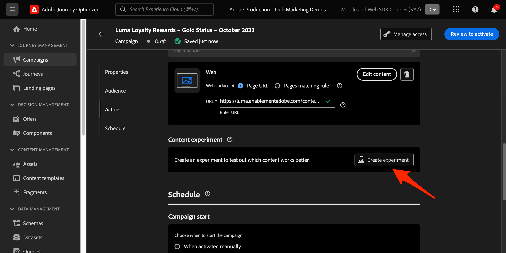

# Configurare il canale web Journey Optimizer

Scopri come implementare Journey Optimizer [canale web](https://experienceleague.adobe.com/en/docs/journey-optimizer/using/web/get-started-web) tramite Platform Web SDK. Questa lezione descrive i prerequisiti fondamentali per il canale web, i passaggi dettagliati per la configurazione e un approfondimento su un caso d’uso incentrato sullo stato di fedeltà.

Seguendo questa lezione, gli utenti di Journey Optimizer sono in grado di applicare in modo efficace il canale web per la personalizzazione online avanzata utilizzando il web designer di Journey Optimizer.

## Finalità di apprendimento

Alla fine di questa lezione, sarai in grado di:

* Comprendi la funzione e il significato di Web SDK nella distribuzione dell’esperienza del canale web.
* Comprendi il processo di creazione di una campagna per canale web dall’inizio alla fine utilizzando il caso d’uso dei premi fedeltà Luma di esempio.
* Configura le proprietà, le azioni e le pianificazioni della campagna all’interno dell’interfaccia.
* Scopri le funzionalità e i vantaggi dell’estensione Adobe Experience Cloud Visual Editing Helper.
* Scopri come modificare il contenuto delle pagine web, incluse immagini, intestazioni e altri elementi, utilizzando la finestra di progettazione web.
* Scopri come inserire le offerte in una pagina web utilizzando il componente Decisione offerta.
* Acquisisci familiarità con le best practice per garantire la qualità e il successo di una campagna canale web.

## Prerequisiti

Per completare le lezioni in questa sezione, devi prima:

* Completa tutte le lezioni per la configurazione iniziale di Platform Web SDK, inclusa la configurazione di elementi dati e regole.
* Assicurati che la versione dell’estensione tag Adobe Experience Platform Web SDK sia 2.16 o successiva.
* Se utilizzi Journey Optimizer Web Designer per creare la tua esperienza di canale web, assicurati di utilizzare i browser Google Chrome o Microsoft® Edge.
* Inoltre, assicurati di aver scaricato e abilitato [Estensione del browser Helper per editing video Adobe Experience Cloud](https://chromewebstore.google.com/detail/adobe-experience-cloud-vi/kgmjjkfjacffaebgpkpcllakjifppnca).
* Assicurati che i cookie di terze parti siano consentiti nel browser. Potrebbe essere necessario disattivare anche i blocchi degli annunci nel browser.

  >[!CAUTION]
  >
  > In Journey Optimizer Web Designer, alcuni siti Web potrebbero non essere aperti in modo affidabile per uno dei motivi seguenti:
  > 
  > 1. Il sito web dispone di criteri di sicurezza rigorosi.
  > 1. Il sito web è incorporato in un iframe.
  > 1. Il sito per il controllo qualità o il sito di staging del cliente non è accessibile esternamente (è un sito interno).

* Durante la creazione di esperienze web e l’inclusione di contenuti dalla libreria Adobe Experience Manager Assets Essentials, è necessario: [configura il sottodominio per la pubblicazione di questo contenuto](https://experienceleague.adobe.com/en/docs/journey-optimizer/using/web/web-delegated-subdomains).
* Se utilizzi la funzione di sperimentazione dei contenuti, assicurati che il set di dati web sia incluso anche nella configurazione di reporting.
* Attualmente, sono supportati due tipi di implementazioni per abilitare l’authoring e la distribuzione di campagne canale web sulle proprietà web:
   * Solo lato client: per modificare il sito web, è necessario implementare Adobe Experience Platform Web SDK.
   * Modalità ibrida: puoi utilizzare l’API del server Edge Network di Platform per richiedere la personalizzazione lato server. La risposta dell’API viene quindi fornita a Adobe Experience Platform Web SDK per il rendering delle modifiche sul lato client. Per ulteriori informazioni, consulta la documentazione sulle API di Adobe Experience Platform Edge Network Server. Ulteriori dettagli ed esempi di implementazione per la modalità ibrida sono disponibili in questo post di blog.

  >[!NOTE]
  >
  >L’implementazione solo lato server non è attualmente supportata.

## Terminologia

Innanzitutto, devi comprendere la terminologia utilizzata nelle campagne del canale web.

* **Canale web**: mezzo di comunicazione o per la distribuzione di contenuti tramite web. Nel contesto di questa guida, si riferisce al meccanismo attraverso il quale i contenuti personalizzati vengono consegnati ai visitatori del sito web utilizzando Platform Web SDK, all’interno di Adobe Journey Optimizer.
* **Superficie web**: si riferisce a una proprietà web identificata da un URL in cui viene distribuito il contenuto. Può includere una o più pagine web.
* **web designer Journey Optimizer**: strumento o interfaccia specifica all’interno di Journey Optimizer che consente agli utenti di progettare le esperienze dei canali web.
* **Helper per editing video Adobe Experience Cloud**: estensione del browser per la modifica visiva e la progettazione delle esperienze del canale web.
* **Datastream**: configurazione all’interno del servizio Adobe Experience Platform che consente di fornire esperienze del canale web.
* **Criterio di unione**: configurazione che assicura l’attivazione e la pubblicazione accurate delle campagne in entrata.
* **Pubblico**: segmento specifico di utenti o visitatori del sito che soddisfano determinati criteri.
* **Designer web**: interfaccia o strumento per la modifica visiva e la progettazione di esperienze web senza immergersi nel codice.
* **Editor espressioni**: strumento all’interno della finestra di progettazione web che consente agli utenti di aggiungere personalizzazioni al contenuto web, potenzialmente in base ad attributi di dati o altri criteri.
* **Componente decisione offerta**: componente della finestra di progettazione web che consente di decidere quale offerta è più adatta per essere visualizzata a un visitatore specifico in base alla gestione delle decisioni.
* **Esperimento sui contenuti**: metodo per testare diverse varianti di contenuto e individuare quella che offre le migliori prestazioni in termini di metrica desiderata, ad esempio i clic in entrata.
* **Trattamento**: nel contesto degli esperimenti sui contenuti, un trattamento si riferisce a una specifica variante di contenuto in fase di test rispetto a un’altra.
* **Simulazione**: meccanismo di anteprima per visualizzare l’esperienza del canale web prima di attivarla per i tipi di pubblico live.

## Configurare lo stream di dati

Il servizio Adobe Experience Platform è già stato aggiunto allo stream di dati. Ora devi abilitare l’opzione Adobe Journey Optimizer per poter fornire esperienze di canale web.

Per configurare Adobe Journey Optimizer nello stream di dati:

1. Vai a [Raccolta dati](https://experience.adobe.com/#/data-collection){target="blank"} di rete.
1. Nel menu di navigazione a sinistra, seleziona **[!UICONTROL Flussi di dati]**.
1. Seleziona lo stream di dati Luma Web SDK creato in precedenza.

   

1. Seleziona **[!UICONTROL Modifica]** all&#39;interno del servizio Adobe Experience Platform.

   

1. Controlla la **[!UICONTROL Adobe Journey Optimizer]** casella.

   

1. Seleziona **[!UICONTROL Salva]**.

In questo modo gli eventi in entrata per Journey Optimizer vengono gestiti correttamente dall’Edge Network di Adobe Experience Platform.

## Configurare il criterio di unione

Assicurati che un criterio di unione sia definito con **[!UICONTROL Criterio di unione Attivo su Edge]** opzione abilitata. Questa opzione dei criteri di unione viene utilizzata dai canali in entrata di Journey Optimizer per garantire l’attivazione e la pubblicazione accurate delle campagne in entrata sul server Edge di.

Per configurare l’opzione nel criterio di unione:

1. Vai a **[!UICONTROL Cliente]** > **[!UICONTROL Profili]** nell’interfaccia Experienci Platform o Journey Optimizer.
1. Seleziona la **[!UICONTROL Criteri di unione]** scheda.
1. Seleziona la policy (in genere è meglio utilizzare la [!UICONTROL Basato su tempo predefinito] ) e attiva/disattiva la **[!UICONTROL Criterio di unione Attivo su Edge]** all&#39;interno del **[!UICONTROL Configura]** passaggio.

   

## Configurare il set di dati web per la sperimentazione dei contenuti

Per utilizzare esperimenti sui contenuti nelle campagne per canali web, devi assicurarti che il set di dati web utilizzato sia incluso anche nella configurazione di reporting. Il sistema di reporting di Journey Optimizer utilizza il set di dati in modalità di sola lettura per popolare i rapporti di sperimentazione dei contenuti preconfigurati.

[L’aggiunta di set di dati per il reporting degli esperimenti sui contenuti è descritta in questa sezione](https://experienceleague.adobe.com/en/docs/journey-optimizer/using/campaigns/content-experiment/reporting-configuration#add-datasets).

## Panoramica del caso d’uso: premi fedeltà

In questa lezione, un esempio di caso di utilizzo dei premi fedeltà viene utilizzato per descrivere nel dettaglio l’implementazione di un’esperienza di canale web utilizzando l’SDK per web.

Questo caso d’uso consente di comprendere meglio in che modo Journey Optimizer può contribuire a fornire ai clienti le migliori esperienze in entrata, utilizzando le campagne Journey Optimizer e il web designer.

Poiché questo tutorial è destinato agli implementatori, vale la pena notare che questa lezione richiede un notevole lavoro sull’interfaccia in Journey Optimizer. Anche se tali attività di interfaccia vengono in genere gestite dagli esperti di marketing, può essere utile che i responsabili dell’implementazione possano acquisire informazioni approfondite sul processo, anche se non sono in genere responsabili della creazione delle campagne per i canali web.

### Creare uno schema Fedeltà e acquisire dati di esempio

Quando i dati dell’SDK web vengono acquisiti in Adobe Experience Platform, possono essere arricchiti da altre origini dati acquisite in Platform. Ad esempio, quando un utente accede al sito Luma, in Experienci Platform viene creato un grafico delle identità e tutti gli altri set di dati abilitati per il profilo possono essere potenzialmente uniti per creare profili cliente in tempo reale. Per vedere questo in azione, crea rapidamente un altro set di dati in Adobe Experience Platform con alcuni dati di fedeltà di esempio, in modo da poter utilizzare i profili cliente in tempo reale nelle campagne web Journey Optimizer. Poiché hai già fatto esercizi simili, le istruzioni saranno brevi.

Creare lo schema fedeltà:

1. Crea un nuovo schema
1. Scegli **[!UICONTROL Profilo individuale]** come [!UICONTROL classe base]
1. Denomina lo schema `Luma Loyalty Schema`
1. Aggiungi il [!UICONTROL Dettagli fedeltà] gruppo di campi
1. Aggiungi il [!UICONTROL Dettagli demografici] gruppo di campi
1. Seleziona la `Person ID` e contrassegnarlo come [!UICONTROL Identità] e [!UICONTROL Identità primaria] utilizzando `Luma CRM Id` [!UICONTROL Spazio dei nomi dell’identità].
1. Abilita lo schema per [!UICONTROL Profilo]

   

Per creare il set di dati e acquisire i dati di esempio:

1. Creare un nuovo set di dati da `Luma Loyalty Schema`
1. Denomina il set di dati `Luma Loyalty Dataset`
1. Abilita il set di dati per [!UICONTROL Profilo]
1. Scarica il file di esempio [luma-loyalty-forWeb.json](assets/luma-loyalty-forWeb.json)
1. Trascinare il file nel set di dati
1. Conferma che i dati siano stati acquisiti correttamente

   

### Creazione di un pubblico

I tipi di pubblico raggruppano i profili in base alle caratteristiche comuni. Crea un pubblico rapido da utilizzare nella campagna web:

1. Nell’interfaccia di Experience Platform, vai a **[!UICONTROL Tipi di pubblico]** nel menu di navigazione a sinistra
1. Seleziona **[!UICONTROL Creare un pubblico]**
1. Seleziona **[!UICONTROL Genera regola]**
1. Seleziona **[!UICONTROL Crea]**

   

1. Seleziona **[!UICONTROL Attributi]**
1. Trova il **[!UICONTROL Fedeltà]** > **[!UICONTROL Livello]** e trascinarlo sulla **[!UICONTROL Attributi]** sezione
1. Definisci il pubblico come utenti il cui `tier` è `gold`
1. Assegna un nome al pubblico `Luma Loyalty Rewards – Gold Status`
1. Seleziona **[!UICONTROL Bordo]** come **[!UICONTROL Metodo di valutazione]**
1. Seleziona **[!UICONTROL Salva]**

   

Poiché si tratta di un pubblico molto semplice, possiamo utilizzare il metodo di valutazione Edge. I tipi di pubblico Edge valutano il Edge di, quindi, nella stessa richiesta effettuata dall’SDK web all’Edge Network di Platform, possiamo valutare la definizione del pubblico e confermare immediatamente se l’utente sarà idoneo.

### Crea campagna di premi fedeltà

Dopo aver acquisito i dati di esempio sulla fedeltà e creato il segmento, crea la campagna per il canale web Loyalty Rewards in Adobe Journey Optimizer.

Per creare la campagna di esempio:

1. Apri [Journey Optimizer](https://experience.adobe.com/journey-optimizer/home){target="_blank"} Interfaccia

   >[!NOTE]
   >
   > Schema, set di dati e tipi di pubblico possono essere generati anche nell’interfaccia di Journey Optimizer in quanto sono tutti costrutti di Experience Platform comuni.

1. Accedi a **[!UICONTROL Gestione percorso]** > **[!UICONTROL Campagne]** nel menu di navigazione a sinistra
1. Clic **[!UICONTROL Crea campagna]** in alto a destra.
1. In **[!UICONTROL Proprietà]** , specifica come eseguire la campagna. Per il caso d’uso Premi fedeltà, scegli **Pianificato**.

   

1. In **[!UICONTROL Azioni]** , scegli il **[!UICONTROL Canale web]**. Come  **[!UICONTROL Superficie web]**, seleziona **[!UICONTROL URL della pagina]**.

   >[!NOTE]
   >
   >Una superficie web si riferisce a una proprietà web identificata da un URL in cui viene distribuito il contenuto. Può corrispondere a un URL di pagina singola o comprendere più pagine, consentendo di applicare modifiche su una o più pagine web.

1. Scegli la **[!UICONTROL URL della pagina]** opzione superficie web per distribuire l’esperienza su una pagina per questa campagna. Immetti l’URL per la pagina Luma. `https://luma.enablementadobe.com/content/luma/us/en.html`

1. Una volta definita la superficie web, seleziona **[!UICONTROL Crea]**.

   

1. Ora aggiungi alcuni dettagli aggiuntivi alla nuova campagna per canali web. Innanzitutto, assegna un nome alla campagna. Chiamalo `Luma Loyalty Rewards – Gold Status`. Facoltativamente, puoi aggiungere una descrizione alla campagna. Aggiungi anche **[!UICONTROL Tag]** migliorare la tassonomia complessiva della campagna.

   

1. Per impostazione predefinita, la campagna è attiva per tutti i visitatori del sito. Ai fini di questo caso d’uso, solo i membri che ricevono un premio in oro devono visualizzare l’esperienza. Per abilitare questa funzione, fai clic su **[!UICONTROL Seleziona pubblico]** e scegli la `Luma Loyalty Rewards – Gold Status` pubblico.

1. In **[!UICONTROL Spazio dei nomi dell’identità]** , seleziona lo spazio dei nomi per identificare i singoli utenti all’interno del segmento scelto. Poiché stai distribuendo la campagna sul sito Luma, puoi scegliere lo spazio dei nomi ECID. Profili all’interno di `Luma Loyalty Rewards – Gold Status` i tipi di pubblico privi dello spazio dei nomi ECID tra le loro varie identità non sono presi di mira dalla campagna del canale web.

   

1. Pianifica la campagna affinché inizi nella data odierna utilizzando **[!UICONTROL Inizio campagna]** e termina in una settimana utilizzando **[!UICONTROL Fine campagna]** opzione.

   

>[!NOTE]
>
>Tieni presente che, per le campagne per canali web, l’esperienza web viene visualizzata quando il visitatore apre la pagina. Pertanto, a differenza di altri tipi di campagne in Adobe Journey Optimizer, il **[!UICONTROL Trigger azione]** non è configurabile.

### Sperimentazione con contenuti di premi fedeltà

Se scorri verso l’alto, nella **[!UICONTROL Azione]** è possibile creare un esperimento per verificare quale contenuto funziona meglio per la sezione `Luma Loyalty Rewards – Gold Status` pubblico. Creiamo e testiamo due trattamenti come componente della configurazione della campagna.

Per creare l’esperimento sui contenuti:

1. Clic **[!UICONTROL Crea esperimento]**.

   

1. Scegli un **[!UICONTROL Metrica di successo]**. Questa è la metrica per determinare l’efficacia dei contenuti. Scegli **[!UICONTROL Clic univoci in entrata]**, per vedere quale trattamento dei contenuti genera più clic sul CTA dell’esperienza web.

   

1. Quando si imposta un esperimento utilizzando il canale web e si sceglie **[!UICONTROL Clic in entrata]**, **[!UICONTROL Clic univoci in entrata]**, **[!UICONTROL Visualizzazioni pagina]**, o **[!UICONTROL Visualizzazioni pagina univoche]** metriche, le **[!UICONTROL Azione clic]** a discesa consente di monitorare e tenere traccia con precisione dei clic e delle visualizzazioni su pagine specifiche.

1. Facoltativamente, puoi designare un **[!UICONTROL Blocco]** che non riceve nessuno dei due trattamenti. Lascia questa opzione deselezionata per il momento.

1. Inoltre, se lo desideri, scegli di **[!UICONTROL Distribuisci uniformemente]**. Selezionare questa opzione per assicurarsi che le divisioni del trattamento siano sempre divise in modo uniforme.

[Ulteriori informazioni sugli esperimenti di contenuto nel canale web Adobe Journey Optimizer](https://experienceleague.adobe.com/docs/journey-optimizer/using/campaigns/content-experiment/get-started-experiment.html?lang=en).

### Modificare il contenuto con Visual Helper

Ora creiamo l’esperienza del canale web. A tale scopo, utilizza Adobe Experience Cloud **[!UICONTROL Helper visivo]**. Questo strumento è un’estensione del browser compatibile con Google Chrome e Microsoft® Edge. Assicurati di aver scaricato l’estensione prima di tentare di generare le esperienze. Assicurati inoltre che la pagina web includa l’SDK per web.

1. All&#39;interno del **[!UICONTROL Azione]** scheda della campagna, fai clic su **[!UICONTROL Modifica contenuto]**. Poiché hai inserito come superficie un URL a pagina singola, dovresti essere pronto per iniziare a lavorare nel compositore.

   

1. Ora fai clic su **[!UICONTROL Modifica pagina web]** per iniziare l’authoring.

   

1. Inizia modificando alcuni elementi utilizzando il compositore web. Utilizza il menu contestuale per modificare l’intestazione dell’immagine protagonista Luma. Regola lo stile del riquadro contestuale a destra.

   

1. Aggiungi anche la personalizzazione al contenitore utilizzando **[!UICONTROL Editor espressioni]**.

   

1. Assicurati che l’esperienza sia correttamente tracciata per i clic. Scegli **[!UICONTROL Fai clic sull’elemento di tracciamento]** dal menu contestuale.

   

1. Utilizza il **[!UICONTROL Componente decisione offerta]** per inserire offerte nella pagina web. Questo componente utilizza **[!UICONTROL Gestione delle decisioni]** per scegliere l’offerta migliore da consegnare ai visitatori Luma.

### Modifiche alla progettazione di HTML

Sono disponibili alcuni metodi per apportare modifiche più avanzate o personalizzate al sito come componente della campagna Premi fedeltà.

Utilizza il **[!UICONTROL Componenti]** per aggiungere HTML o altri contenuti direttamente al sito Luma.

Aggiungi un nuovo componente HTML nella parte superiore della pagina. Modifica il HTML all’interno del componente dall’interfaccia di progettazione oppure **[!UICONTROL Contestuale]** riquadro.

In alternativa, aggiungi modifiche HTML da **[!UICONTROL Modifiche]** riquadro. Questo riquadro consente di selezionare un componente nella pagina e modificarlo dall’interfaccia di progettazione.

Nell’editor, aggiungi il HTML per `Luma Loyalty Rewards – Gold Status` pubblico. Seleziona **[!UICONTROL Convalida]**.

Ora controlla il nuovo componente HTML personalizzato per adattarlo alle esigenze.

Modificare un componente specifico utilizzando **[!UICONTROL Tipo di selettore CSS]** modifica.

Aggiungere codice personalizzato utilizzando **Pagina `<head>` tipo** modifica.

Le possibilità di utilizzo della **[!UICONTROL Helper visivo]**.

### Simula contenuto premi fedeltà

Osserva un’anteprima della pagina web modificata prima di attivare la campagna. Tieni presente che devi avere profili di test configurati per simulare esperienze di canali web.

Per simulare l&#39;esperienza:

1. Seleziona **[!UICONTROL Simula contenuto]** all’interno della campagna.

   

1. Scegli un profilo di test per ricevere la simulazione. Tieni presente che il profilo di test deve essere nel `Luma Loyalty Rewards – Gold Status` per ricevere il trattamento appropriato.

1. Viene visualizzata l’anteprima per il profilo di test.

### Attivazione della campagna Premi fedeltà

Infine, attiva la campagna del canale web.

1. Seleziona **Controlla per attivare**.

1. Ti viene chiesto di confermare un’ultima volta i dettagli della campagna. Seleziona **[!UICONTROL Attiva]**. Potrebbero essere necessari fino a 15 minuti perché la campagna diventi live sul sito.

### Premi fedeltà QA

Sono disponibili alcuni accessi che puoi utilizzare per simulare gli utenti con stato Gold e che sono idonei per la tua campagna:

1. `cleavlandeuler@emailsim.io`/`test`
1. `leftybeagen@emailsim.io`/`test`
1. `jenimartinho@emailsim.io`/`test`

Come best practice, monitora **[!UICONTROL Web]** scheda dei rapporti live e globali della campagna per i KPI specifici della campagna. Per questa campagna, monitora le impression dell’esperienza e la percentuale di clic.

### Convalida del canale web con Adobe Experience Platform Debugger

L’estensione Adobi Experience Platform Debugger, disponibile sia per Chrome che per Firefox, analizza le pagine web per identificare i problemi nell’implementazione delle soluzioni Adobe Experience Cloud.

Puoi utilizzare il debugger sul sito Luma per convalidare l’esperienza del canale web in produzione. Questa è una best practice una volta che il caso di utilizzo dei premi fedeltà è attivo e in esecuzione, per garantire che tutto sia configurato correttamente.

[Scopri come configurare il debugger nel browser utilizzando la guida qui](https://experienceleague.adobe.com/docs/platform-learn/data-collection/debugger/overview.html?lang=en).

Per iniziare la convalida tramite il debugger:

1. Passa alla pagina web Luma con l’esperienza del canale web.
   <!--
    
    -->
1. Nella pagina web, apri **[!UICONTROL Adobe Experience Platform Debugger]**.
   <!--
    
    -->
1. Accedi a **Riepilogo**. Verificare che **[!UICONTROL ID flusso di dati]** corrisponde al **[!UICONTROL flusso di dati]** in **[!UICONTROL Raccolta dati di Adobe]** per cui hai abilitato Adobe Journey Optimizer.
   <!--
    
    -->
1. Puoi quindi accedere al sito con vari account fedeltà Luma e utilizzare il debugger per convalidare le richieste inviate all’Edge Network Adobe Experience Platform.
   <!--
    
    -->
1. Sotto **[!UICONTROL Soluzioni]** passa a **[!UICONTROL Experienci Platform Web SDK]**.
   <!--
    
    -->
1. All&#39;interno del **Configurazione** , Attiva **[!UICONTROL Abilita debug]**. Questo abilita la registrazione per la sessione all’interno di un **[!UICONTROL Adobe Experience Platform Assurance]** sessione.
   <!--
    
    -->
1. Accedi al sito con vari account fedeltà Luma e utilizza il debugger per convalidare le richieste inviate al **[!UICONTROL Adobe Experience Platform Edge Network]**. Tutte queste richieste devono essere acquisite in **[!UICONTROL Assurance]** per il tracciamento dei registri.
<!--
   
-->

[Successivo: ](setup-decision-management.md)

>[!NOTE]
>
>Grazie per aver dedicato il tuo tempo all’apprendimento di Adobe Experience Platform Web SDK. Se hai domande, vuoi condividere commenti generali o suggerimenti su contenuti futuri, condividili su questo [Experience League post di discussione community](https://experienceleaguecommunities.adobe.com/t5/adobe-experience-platform-launch/tutorial-discussion-implement-adobe-experience-cloud-with-web/td-p/444996)
