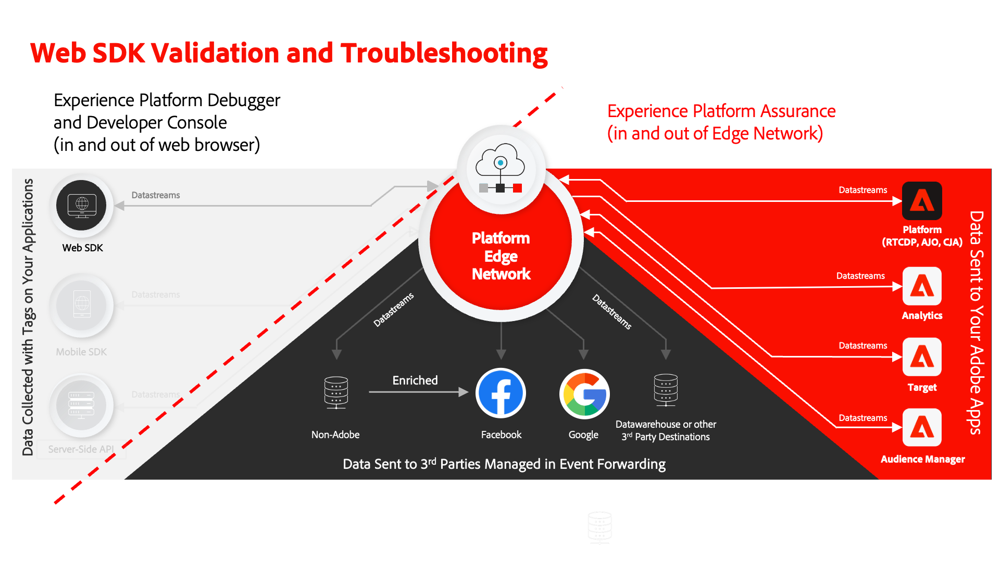
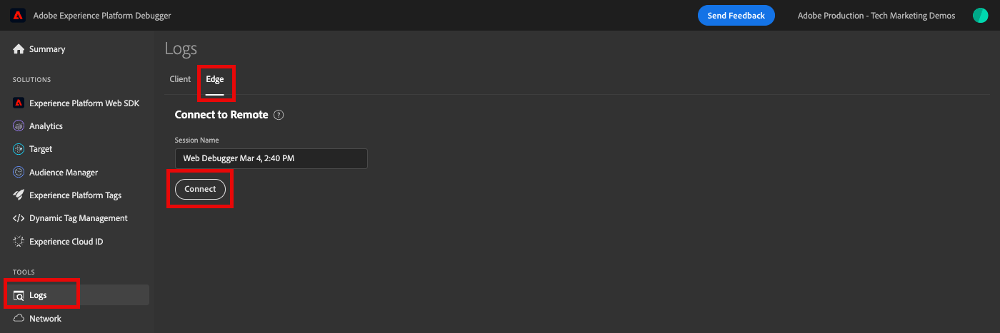
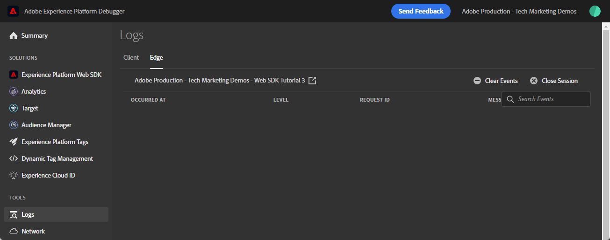
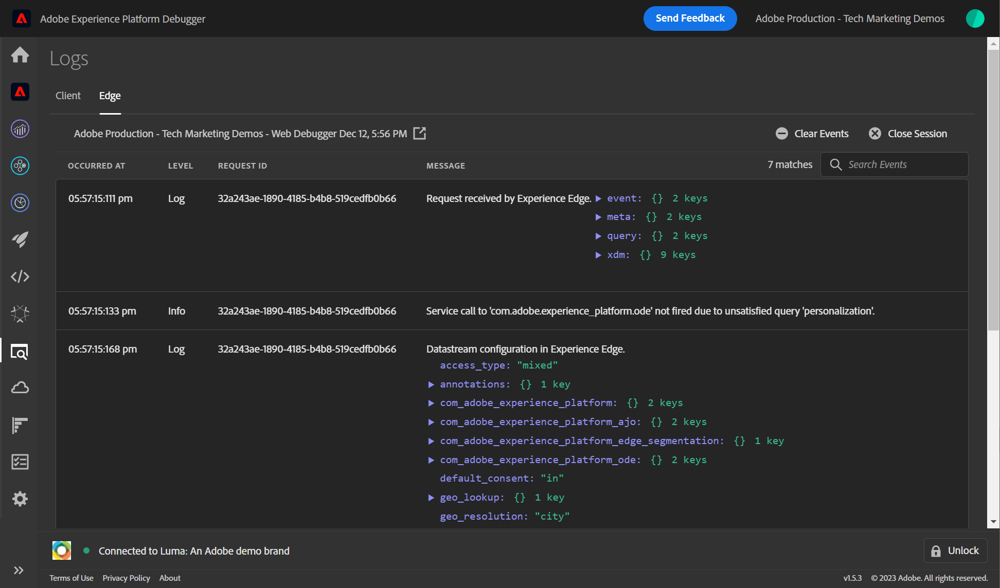
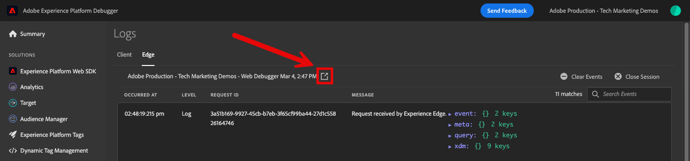
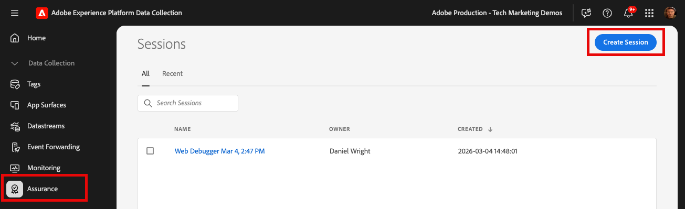
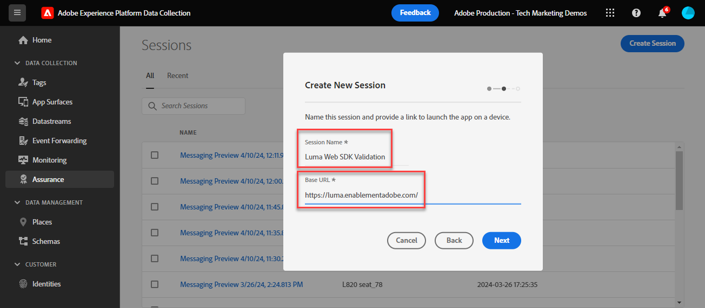
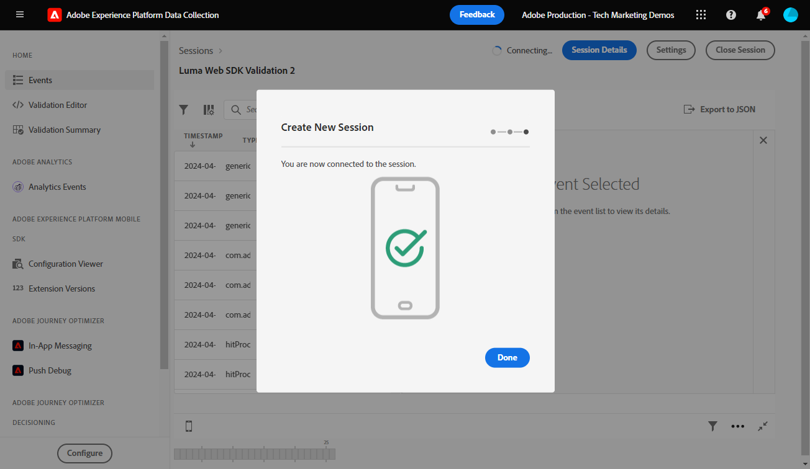
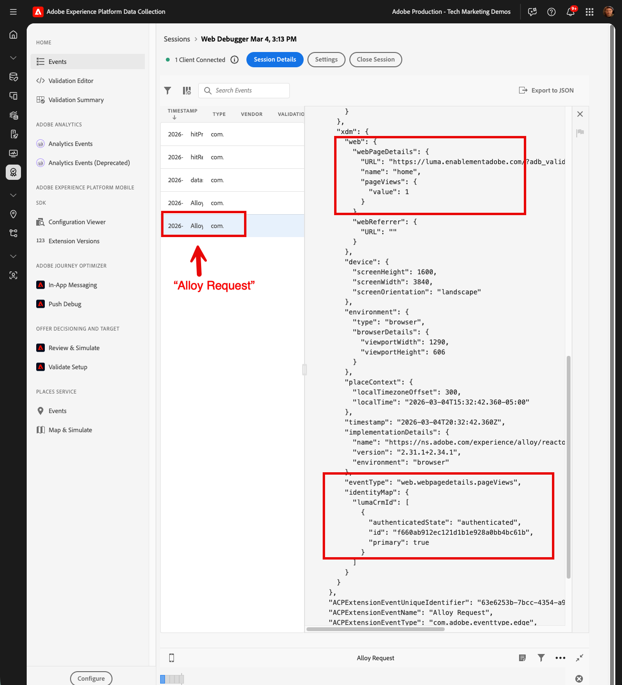
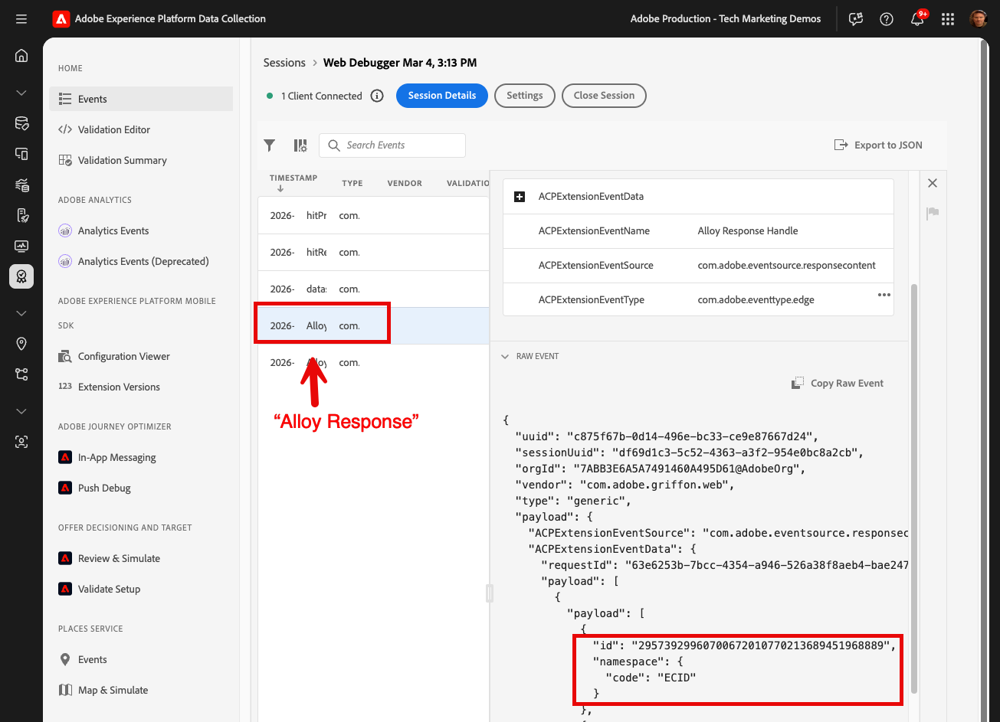

# Convalidare le implementazioni di Web SDK con Experience Platform Assurance

[Adobe Experience Platform Assurance](https://experienceleague.adobe.com/it/docs/experience-platform/assurance/home) è una funzionalità che consente di verificare, verificare, simulare e convalidare le modalità di raccolta dei dati o di gestione delle esperienze.

Come hai appreso nella lezione [Configurare uno stream di dati](configure-datastream.md), Platform Web SDK invia prima i dati dalla proprietà digitale a Platform Edge Network. Quindi, Platform Edge Network inoltra i dati ai servizi abilitati nello stream di dati. Puoi convalidare le richieste in entrata e in uscita da Platform Edge Network utilizzando Assurance.

## Obiettivi di apprendimento

Alla fine di questa lezione, potrai:

* Avviare una sessione di Assurance
* Visualizzare le richieste inviate a e da Platform Edge Network

## Prerequisiti

Hai familiarità con i tag di raccolta dati e con il [sito Web di dimostrazione Luma](https://luma.enablementadobe.com){target="_blank"} e hai completato le lezioni precedenti nell&#39;esercitazione:

* [Configurare uno schema XDM](configure-schemas.md)
* [Configurare uno spazio dei nomi delle identità](configure-identities.md)
* [Configurare uno stream di dati](configure-datastream.md)
* [Estensione Web SDK installata nella proprietà tag](install-web-sdk.md)
* [Creare elementi dati](create-data-elements.md)
* [Acquisire le identità](create-identities.md)
* [Creare una regola di tag](create-tag-rule.md)
* [Convalida con Debugger](validate-with-debugger.md)

## Avviare e visualizzare una sessione di Assurance

Esistono diversi modi per avviare una sessione Assurance.

### Abilitare Edge Trace nel debugger

Per abilitare Edge Trace:

1. Vai al [sito Web di dimostrazione Luma](https://luma.enablementadobe.com) e utilizza il debugger per [passare la proprietà tag sul sito alla tua proprietà di sviluppo](validate-with-debugger.md#use-the-experience-platform-debugger-to-map-to-your-tags-property)
1. Assicurati di aver effettuato l’accesso al Debugger con il nome dell’organizzazione visualizzato. Se invece viene visualizzato il nome utente, disconnettiti e prova a riaccedere.
1. Nel menu di navigazione a sinistra di **[!UICONTROL Experience Platform Debugger]** seleziona **[!UICONTROL Registri]**
1. Seleziona la scheda **[!UICONTROL Edge]** e seleziona **[!UICONTROL Connetti]**

   

1. Per il momento è vuoto

   

1. Aggiorna la [home page Luma](https://luma.enablementadobe.com/) e controlla di nuovo **[!UICONTROL Experience Platform Debugger]** per visualizzare i dati in Platform Edge Network. Nelle lezioni future, potrai visualizzare le richieste in uscita man mano che abiliti i servizi nello stream di dati.

   

   Ogni volta che abiliti Edge Trace in Adobe Experience Platform Debugger, viene avviata in background una sessione di Assurance. Anche se puoi esaminare le informazioni qui, probabilmente troverai l’interfaccia di Assurance molto più utile.

1. Con Edge Trace abilitato, puoi visualizzare un’icona di collegamento in uscita in alto. Seleziona l’icona per aprire Assurance.

   

1. Viene visualizzata una nuova scheda del browser con l’interfaccia Assurance.

### Avviare una sessione di Assurance dall’interfaccia di Assurance

1. Apri l&#39;interfaccia di [Data Collection](https://experience.adobe.com/#/data-collection/home){target="_blank"}
1. Seleziona Assurance nel menu di navigazione a sinistra
1. Seleziona Crea sessione
   
1. Utilizza l&#39;opzione **[!UICONTROL Connessione collegamento profondo]**
1. Seleziona **[!UICONTROL Inizio]**
1. Assegna un nome alla sessione, ad esempio `Luma Web SDK validation`
1. Come **[!UICONTROL URL di base]** immettere `https://luma.enablementadobe.com/`
   
1. Nella schermata successiva, seleziona **[!UICONTROL Copia collegamento]**
1. Seleziona l’icona per copiare il collegamento negli Appunti
1. Incolla l’URL nel browser, che aprirà il sito web Luma con uno speciale parametro URL `adb_validation_sessionid` e avvierà la sessione
1. Nell’interfaccia di Assurance, dovrebbe essere visualizzato un messaggio per indicare che la connessione alla sessione è avvenuta correttamente e dovrebbero essere visualizzati gli eventi acquisiti nell’interfaccia di Assurance.
   

## Convalidare lo stato corrente dell’implementazione di Web SDK

Le informazioni da visualizzare in questa fase dell’implementazione sono limitate, in quanto non sono ancora stati abilitati servizi nel flusso di dati.

### Visualizza richieste in arrivo da Web SDK con `Alloy Request`

Possiamo visualizzare l’hit in arrivo da Web SDK così come viene ricevuto dal server Edge di:

1. Seleziona la riga `Alloy Request`
1. Cerca in Evento non elaborato (o espandi i nodi nel [!UICONTROL Payload] > `ACPExtensionEventData`) finché non trovi il tuo oggetto XDM con variabili familiari:

   

### Visualizza la risposta in `Alloy Response Handle`

Come sai, l’Experience Cloud Id (ECID) è visibile nella risposta di Web SDK dopo che è stato generato su Platform Edge Network. Proviamo a cercarla nella risposta così come viene visualizzata in Assurance:

1. Filtrare e selezionare la riga con l&#39;evento denominato `Alloy Response Handle`.
1. A destra viene visualizzato un menu. Seleziona il segno `+` accanto a `[!UICONTROL ACPExtensionEventData]`
1. Espandere selezionando `[!UICONTROL payload > 0 > payload > 0 > namespace]`. L&#39;ID visualizzato sotto l&#39;ultimo `0` corrisponde a `ECID`. Si sa che dal valore visualizzato in `namespace` corrisponde a `ECID`

   

   >[!CAUTION]
   >
   >Il valore ECID potrebbe essere troncato a causa della larghezza della finestra. Seleziona la barra della maniglia nell’interfaccia e trascina a sinistra per visualizzare l’intero ECID.

Nelle lezioni future, utilizzerai Assurance per convalidare i payload completamente elaborati che raggiungono un’applicazione Adobe abilitata nello stream di dati.

Ora che un oggetto XDM viene attivato su una pagina e sai come convalidare la raccolta dati, puoi configurare Experience Platform e le singole applicazioni Adobe utilizzando Platform Web SDK.

>[!NOTE]
>
>Grazie per aver dedicato tempo all&#39;apprendimento di Adobe Experience Platform Web SDK. Se hai domande, vuoi condividere commenti generali o suggerimenti su contenuti futuri, condividili in questo [post di discussione della community Experience League](https://experienceleaguecommunities.adobe.com/adobe-experience-platform-18/tutorial-discussion-implement-adobe-experience-cloud-with-web-sdk-tutorial-248848?profile.language=it)
