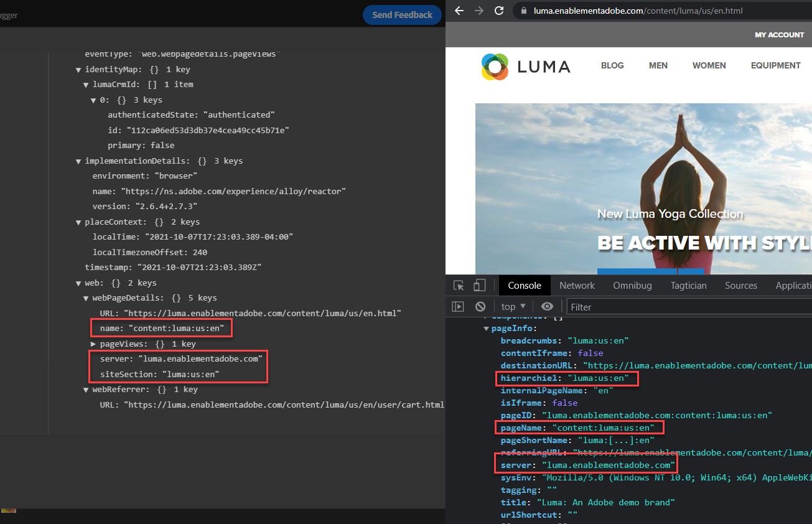

# Convalidare le implementazioni Web SDK con Experienci Platform Debugger

>[!CAUTION]
>
>Prevediamo di pubblicare modifiche principali a questo tutorial martedì 23 aprile 2024. Dopo questo punto molti esercizi cambieranno e potrebbe essere necessario riavviare l&#39;esercitazione dall&#39;inizio per completare tutte le lezioni.

Scopri come convalidare l’implementazione di Platform Web SDK con l’Adobe Experience Platform Debugger.

Experienci Platform Debugger è un’estensione disponibile per i browser Chrome e Firefox che consente di visualizzare la tecnologia Adobe implementata nelle pagine web. Scarica la versione per il browser preferito:

* [Estensione Firefox](https://addons.mozilla.org/it/firefox/addon/adobe-experience-platform-dbg/)
* [Estensione Chrome](https://chrome.google.com/webstore/detail/adobe-experience-platform/bfnnokhpnncpkdmbokanobigaccjkpob)

Se non hai mai utilizzato il debugger prima, e questo è diverso dal precedente Adobe Experience Cloud Debugger, guarda questo video introduttivo di cinque minuti:

>[!VIDEO](https://video.tv.adobe.com/v/32156?learn=on)

In questa lezione, utilizzerai [Estensione Adobe Experience Platform Debugger](https://chromewebstore.google.com/detail/adobe-experience-platform/bfnnokhpnncpkdmbokanobigaccjkpob) per sostituire la proprietà di tag in codifica fissa [Sito di dimostrazione Luma](https://luma.enablementadobe.com/content/luma/us/en.html) con la tua proprietà.

Questa tecnica è denominata cambio di ambiente e sarà utile in un secondo momento, quando lavorerai con i tag sul tuo sito web. Puoi caricare il tuo sito web di produzione nel browser, ma con *sviluppo* nell’ambiente dei tag. Questa funzionalità ti consente di creare e convalidare le modifiche ai tag in modo indipendente dalle regolari versioni del codice. Dopo tutto, questa separazione tra versioni di tag di marketing e versioni di codice è uno dei motivi principali per cui i clienti utilizzano i tag.

## Obiettivi di apprendimento

Alla fine di questa lezione, potrai utilizzare il debugger per:

* Caricare una libreria di tag alternativa
* Convalida che l’oggetto XDM acquisisce e invia i dati come previsto Edge Network

## Prerequisiti

Conosci i tag di raccolta dati e la [Sito di dimostrazione Luma](https://luma.enablementadobe.com/content/luma/us/en.html){target="_blank"} e hanno completato le seguenti lezioni precedenti nell’esercitazione:

* [Configurare le autorizzazioni](configure-permissions.md)
* [Configurare uno schema XDM](configure-schemas.md)
* [Configurare uno spazio dei nomi delle identità](configure-identities.md)
* [Configurare uno stream di dati](configure-datastream.md)
* [Estensione Web SDK installata nella proprietà tag](install-web-sdk.md)
* [Creare elementi dati](create-data-elements.md)
* [Creare una regola di tag](create-tag-rule.md)

## Caricare librerie di tag alternative con Debugger

Questa esercitazione utilizza una versione in hosting pubblico del [Sito web di dimostrazione Luma](https://luma.enablementadobe.com/content/luma/us/en.html). Apri la home page e aggiungi un segnalibro.

Experienci Platform Debugger dispone di una funzione interessante che consente di sostituire una libreria di tag esistente con una diversa. Questa tecnica è utile per la convalida e ci consente di saltare molti passaggi di implementazione in questa esercitazione.

1. Assicurati di avere aperto il sito Luma e seleziona l’icona dell’estensione Experienci Platform Debugger
1. Debugger si aprirà e mostrerà alcuni dettagli dell’implementazione hardcoded, che non è correlata a questa esercitazione (potrebbe essere necessario ricaricare il sito Luma dopo aver aperto Debugger)
1. Conferma che il debugger è &quot;**[!UICONTROL Connesso a Luma]**&quot; come illustrato di seguito, quindi selezionare la&quot;**[!UICONTROL blocca]**&quot; per bloccare Debugger sul sito Luma.
1. Seleziona la **[!UICONTROL Accedi]** e accedi a Adobe Experience Cloud utilizzando il tuo ID Adobe.
1. Ora vai a **[!UICONTROL Tag Experience Platform]** nel menu di navigazione a sinistra

   

1. Seleziona la **[!UICONTROL Configurazione]** scheda
1. A destra della posizione in cui è visualizzato **[!UICONTROL Codici di incorporamento pagina]**, apri **[!UICONTROL Azioni]** e seleziona **[!UICONTROL Sostituisci]**

   

1. Poiché sei autenticato, il Debugger estrae le proprietà e gli ambienti dei tag disponibili. Seleziona il `Web SDK Course` proprietà
1. Seleziona il `Development` ambiente
1. Seleziona la **[!UICONTROL Applica]** pulsante

   

1. Il sito web Luma verrà ricaricato _con la proprietà tag_.

   

Continuando l’esercitazione, utilizzerai questa tecnica per mappare il sito Luma sulla tua proprietà tag per convalidare l’implementazione dell’SDK web per Platform. Quando inizi a utilizzare i tag sul sito web di produzione, puoi usare questa stessa tecnica per convalidare le modifiche.

## Convalidare l’implementazione in Experienci Platform Debugger

Puoi utilizzare il debugger per convalidare l’implementazione dell’SDK web per Platform e visualizzare i dati inviati a Platform, ad Edge Network:

1. Vai a **[!UICONTROL Riepilogo]** nel menu di navigazione a sinistra, per visualizzare i dettagli della proprietà tag

   

1. Ora vai a **[!UICONTROL Experienci Platform Web SDK]** nel menu di navigazione a sinistra per visualizzare **[!UICONTROL Richieste di rete]**
1. Apri **[!UICONTROL Eventi]** row (non preoccuparti se questa schermata mostra più richieste della tua, include richieste da lezioni future e per ora puoi ignorarle)

   

1. Nota come è possibile visualizzare `web.webpagedetails.pageView` tipo di evento specificato nel [!UICONTROL Invia evento] e altre variabili pronte all’uso conformi alla `AEP Web SDK ExperienceEvent Mixin` formato

   

1. Scorri verso il basso fino a `web` dell&#39;oggetto, selezionare per aprirlo ed esaminare `webPageDetails.name`, `webPageDetails.server`, e `webPageDetails.siteSection`. Devono corrispondere alle corrispondenti variabili del livello dati digitalData sulla home page

   

Puoi anche convalidare i dettagli di Identity Map:

1. Accedi al sito Luma utilizzando le credenziali `test@adobe.com`/`test`

1. Torna alla [home page di Luma](https://luma.enablementadobe.com/content/luma/us/en.html)

1. Apri **[!UICONTROL Experienci Platform Web SDK]** sezione nel menu di navigazione a sinistra

   

1. Seleziona la **[!UICONTROL Eventi]** riga per aprire i dettagli in un pop-up

   

1. Cerca **identityMap** all&#39;interno del pop-up. Qui dovresti vedere `lumaCrmId` con tre chiavi di authenticatedState, id e primary:
   

## Convalida con gli strumenti di sviluppo del browser

Questi tipi di dettagli della richiesta sono visibili anche negli strumenti di sviluppo web del browser **Rete** (supponendo che il sito web stia caricando la libreria di tag).

1. Apri gli strumenti di sviluppo web del browser **Rete** e ricarica la pagina. Filtra per chiamate con `/ee` per individuare la chiamata, selezionarla e quindi cercare nella **Intestazioni** e **Payload** scheda

   

1. Vai a **Risposta** e osserva come il valore ECID viene incluso nella risposta. Copia questo valore così come lo utilizzerai per convalidare le informazioni sul profilo nel prossimo esercizio

   

   >[!NOTE]
   >
   >    Potresti non visualizzare la stessa quantità di richieste di payload presente nella schermata precedente. Questa disparità è dovuta al fatto che le lezioni future [configurazione di Target](setup-target.md) sono state completate al momento dell’acquisizione della schermata. Per il momento puoi ignorare questa differenza.

Ora che un oggetto XDM viene attivato su una pagina e sai come convalidare la raccolta dati, puoi configurare le singole applicazioni Adobe utilizzando Platform Web SDK.

[Successivo: ](setup-experience-platform.md)

>[!NOTE]
>
>Grazie per aver dedicato il tuo tempo all’apprendimento di Adobe Experience Platform Web SDK. Se hai domande, vuoi condividere feedback generali o suggerimenti su contenuti futuri, condividili su questo [Experience League post di discussione community](https://experienceleaguecommunities.adobe.com/t5/adobe-experience-platform-launch/tutorial-discussion-implement-adobe-experience-cloud-with-web/td-p/444996)
