# Convalidare le implementazioni di Web SDK con Experience Platform Debugger

Scopri come convalidare l’implementazione di Adobe Experience Platform Web SDK con Adobe Experience Platform Debugger.

Experience Platform Debugger è un&#39;estensione di [Chrome](https://chromewebstore.google.com/detail/adobe-experience-platform/bfnnokhpnncpkdmbokanobigaccjkpob) che consente di visualizzare la tecnologia Adobe implementata nelle pagine Web. Experience Platform Debugger e la Developer Console del browser sono i modi migliori per convalidare ed eseguire il debug degli aspetti lato browser dell’implementazione di Web SDK. Adobe Experience Platform Assurance, descritto nella lezione successiva, fornisce la migliore visualizzazione dei dati durante l’entrata e l’uscita da Platform Edge Network.

Se non hai mai utilizzato il debugger in precedenza, guarda questo video introduttivo di cinque minuti:

>[!VIDEO](https://video.tv.adobe.com/v/32156?learn=on&enablevpops)

In questa lezione, utilizzi l&#39;estensione [Adobe Experience Platform Debugger](https://chromewebstore.google.com/detail/adobe-experience-platform/bfnnokhpnncpkdmbokanobigaccjkpob) per sostituire la proprietà di tag di codifica fissa nel [sito di dimostrazione Luma](https://luma.enablementadobe.com) con la tua proprietà.

Questa tecnica è denominata cambio di ambiente e sarà utile in un secondo momento, quando lavorerai con i tag sul tuo sito web. Ti consente di caricare il tuo sito Web di produzione nel browser, ma con la libreria di tag *sviluppo*. Questa funzionalità ti consente di creare e convalidare le modifiche ai tag in modo indipendente dalle regolari versioni del codice. Dopo tutto, questa separazione tra versioni di tag di marketing e versioni di codice è uno dei motivi principali per cui i clienti utilizzano i tag.

## Obiettivi di apprendimento

Alla fine di questa lezione, potrai utilizzare il debugger per:

* Caricare una libreria di tag alternativa
* Verificare che l’evento XDM lato client acquisisca e invii i dati come previsto a Platform Edge Network
* Abilita Edge Trace per visualizzare le richieste lato server inviate da Platform Edge Network

## Prerequisiti

Conosci i tag di raccolta dati e il [sito di dimostrazione Luma](https://luma.enablementadobe.com/){target="_blank"} e hai completato le lezioni precedenti nell’esercitazione:

* [Configurare uno schema XDM](configure-schemas.md)
* [Configurare uno spazio dei nomi delle identità](configure-identities.md)
* [Configurare uno stream di dati](configure-datastream.md)
* [Estensione Web SDK installata nella proprietà tag](install-web-sdk.md)
* [Creare elementi dati](create-data-elements.md)
* [Acquisire le identità](create-identities.md)
* [Creare regole di tag](create-tag-rule.md)

## Caricare librerie di tag alternative con Debugger

Experience Platform Debugger dispone di una funzione interessante che consente di sostituire una libreria di tag esistente con una diversa. Questa tecnica è utile per la convalida e ci consente di saltare molti passaggi di implementazione in questa esercitazione.

1. Assicurati che il [sito Web di dimostrazione Luma](https://luma.enablementadobe.com){target="_blank"} sia aperto e seleziona l&#39;icona dell&#39;estensione Experience Platform Debugger
1. Verrà aperto Debugger e verranno visualizzati alcuni dettagli dell’implementazione hardcoded (potrebbe essere necessario ricaricare il sito Luma dopo aver aperto Debugger)
1. Verifica che il debugger sia &quot;**[!UICONTROL connesso a Luma]**&quot; come illustrato di seguito, quindi seleziona l&#39;icona &quot;**[!UICONTROL blocca]**&quot; per bloccare il debugger sul sito Luma.
1. Seleziona il pulsante **[!UICONTROL Accedi]**, accedi a Adobe Experience Cloud con il tuo Adobe Id e seleziona la tua organizzazione.

   >[!TIP]
   >
   > Se dopo l’accesso il debugger visualizza il tuo nome utente invece del nome dell’organizzazione, esci e riprova.

   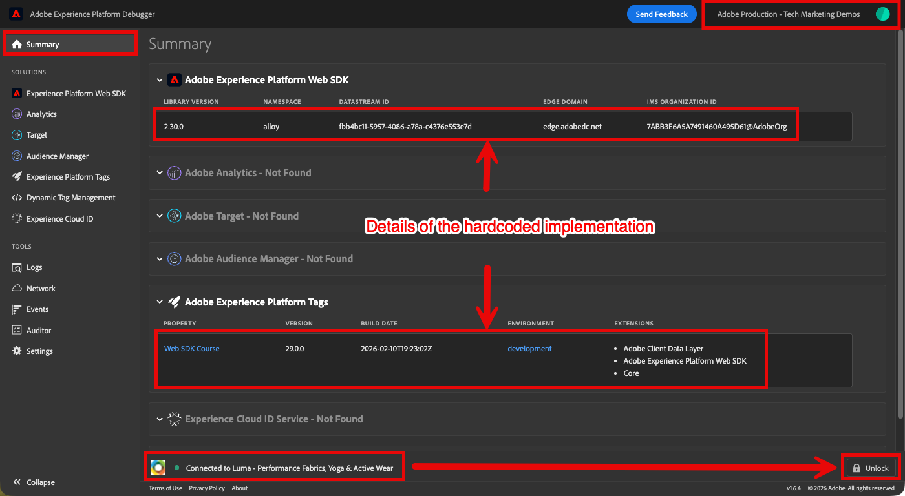

1. Vai a **[!UICONTROL Tag Experience Platform]** nella barra di navigazione a sinistra
1. Seleziona la scheda **[!UICONTROL Configurazione]**
1. A destra della visualizzazione dei **[!UICONTROL Codici di incorporamento pagina]**, apri il menu a discesa **[!UICONTROL Azioni]** e seleziona **[!UICONTROL Sostituisci]**

   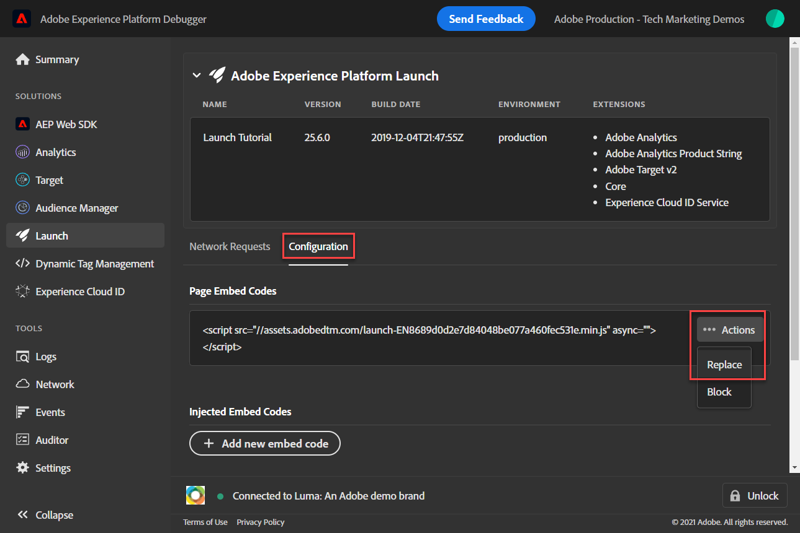

1. Poiché sei autenticato, il Debugger estrae le proprietà e gli ambienti dei tag disponibili. Seleziona la proprietà
1. Seleziona l&#39;ambiente `Development`
   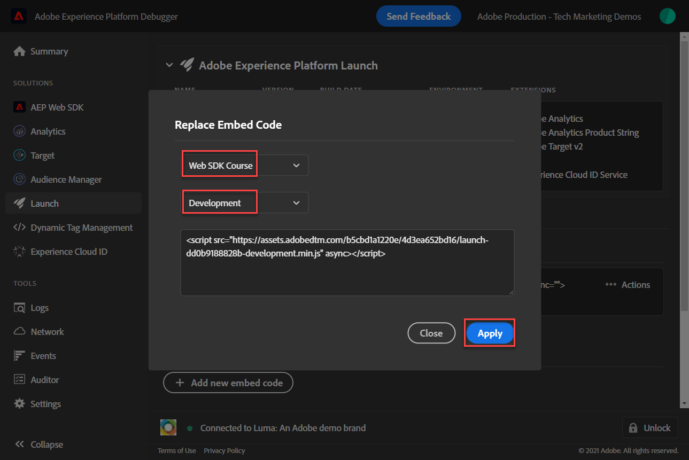

   >[!TIP]
   >
   > Se non riesci a selezionare la proprietà e l&#39;ambiente utilizzando i menu a discesa, passa a [!UICONTROL Tag] > [!UICONTROL Ambienti] > [!UICONTROL Sviluppo] > [!UICONTROL Installa] e seleziona l&#39;icona per copiare il codice da incorporare e incollarlo nel debugger:
   > 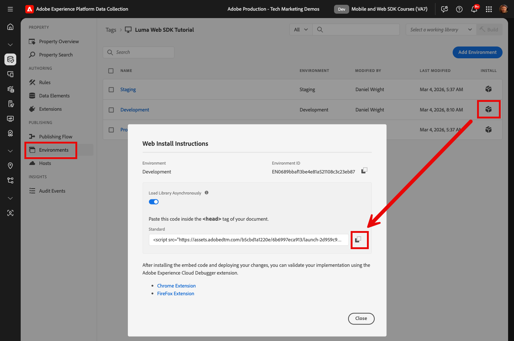

1. Seleziona il pulsante **[!UICONTROL Applica]**

1. Il sito Web Luma ricaricherà _con la tua proprietà tag_.

   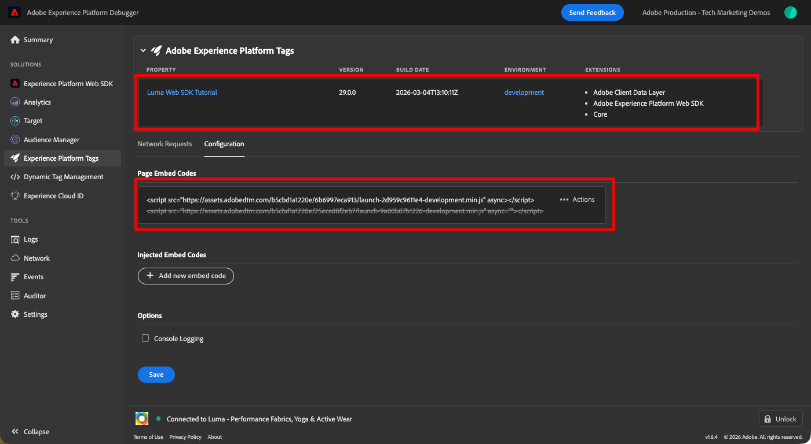

Continuando l’esercitazione, utilizzi questa tecnica per mappare il sito Luma sulla tua proprietà tag per convalidare l’implementazione di Platform Web SDK. Quando utilizzi i tag sul tuo sito web, puoi usare questa stessa tecnica per convalidare le librerie di tag di sviluppo sul sito web di produzione.

## Convalida con Debugger

### Convalidare richieste di rete e XDM

Puoi utilizzare il debugger per convalidare i beacon lato client attivati dall’implementazione di Platform Web SDK per visualizzare i dati inviati a Platform Edge Network:

1. Vai a **[!UICONTROL Riepilogo]** nel menu di navigazione a sinistra per visualizzare i dettagli della proprietà tag

   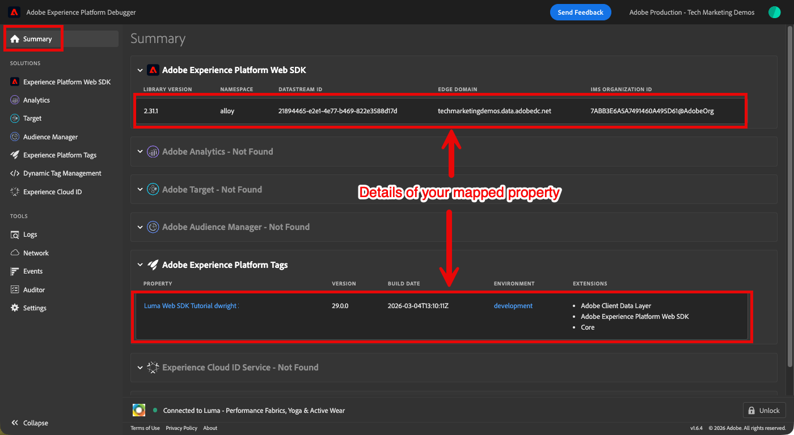

1. Vai a **[!UICONTROL Experience Platform Web SDK]** nella barra di navigazione a sinistra per visualizzare le **[!UICONTROL richieste di rete]**
1. Apri la riga **[!UICONTROL events]**

   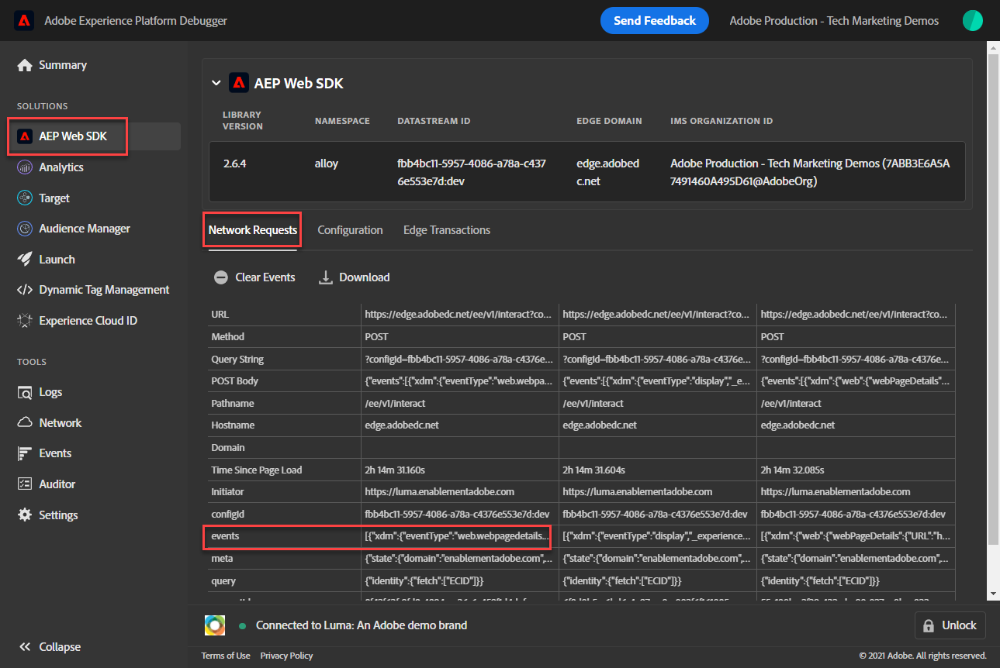

1. Nota come visualizzare il tipo di evento `web.webPageDetails.pageView` specificato nell&#39;azione [!UICONTROL Aggiorna variabile] e altre variabili predefinite che aderiscono al gruppo di campi `AEP Web SDK ExperienceEvent`

   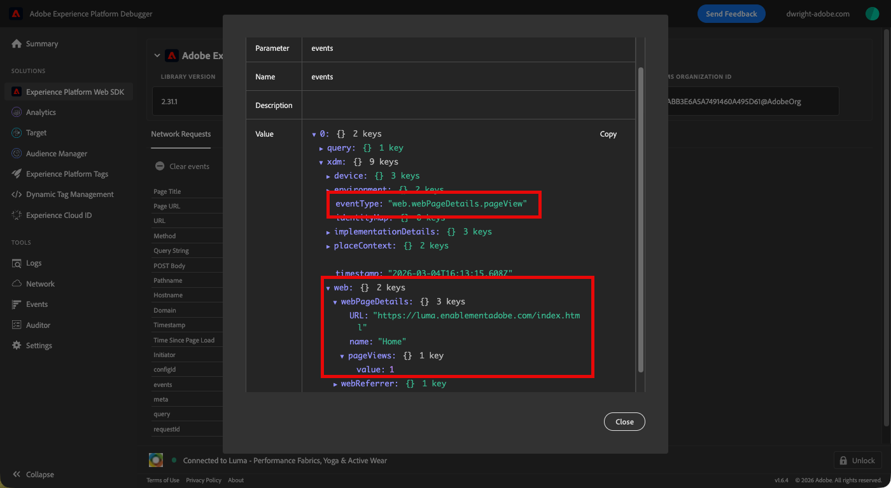

1. Scorrere verso il basso fino all&#39;oggetto `web`, selezionare per aprirlo ed esaminare `webPageDetails.name`. Devono corrispondere alle corrispondenti variabili del livello dati `adobeDataLayer` nella home page

>[!TIP]
>
> Per visualizzare e confrontare il livello dati `adobeDataLayer` nella home page:
>
> 1. Nella home page di Luma, apri gli strumenti di sviluppo del browser. Nel caso di Chrome, selezionare il pulsante `F12` sulla tastiera
> 1. Seleziona la scheda **[!UICONTROL Console]**
> 1. Immetti `adobeDataLayer` e seleziona `Enter` sulla tastiera per visualizzare i valori del livello dati

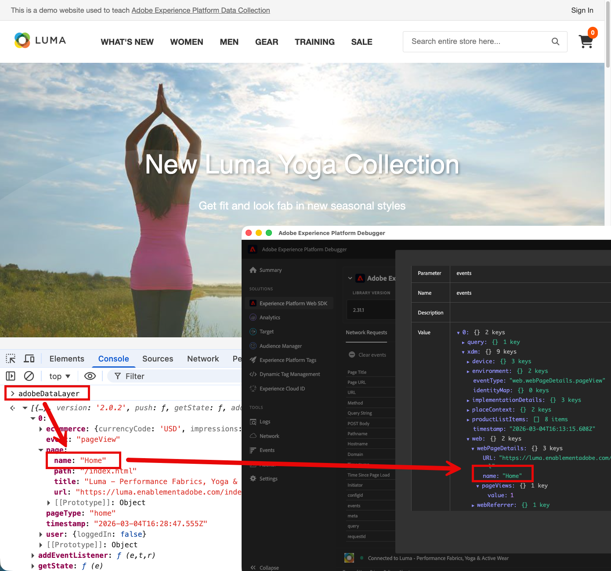

Convalida gli eventi e le variabili impostati nelle pagine del prodotto, nella pagina del carrello e nella pagina di conferma dell’ordine.

### Convalida Identity Map

Puoi anche convalidare i dettagli di Identity Map:

1. Seleziona **[!DNL Sign In]** nel [sito Web Luma](https://luma.enablementadobe.com/){target=_blank}. Seleziona **[!DNL Create Account]** e crea un account utilizzando le credenziali `test@test.com`/`test`

1. Utilizza il collegamento **[!UICONTROL Passa all&#39;ultimo]** nel debugger per passare rapidamente all&#39;evento Web SDK più recente (è l&#39;ultima colonna). Seleziona la riga **[!UICONTROL events]** per aprire il modale dei dettagli.

1. Cerca **identityMap** nel modale. Qui dovresti vedere `lumaCrmId` con tre chiavi di authenticatedState, id e designazione primaria:
   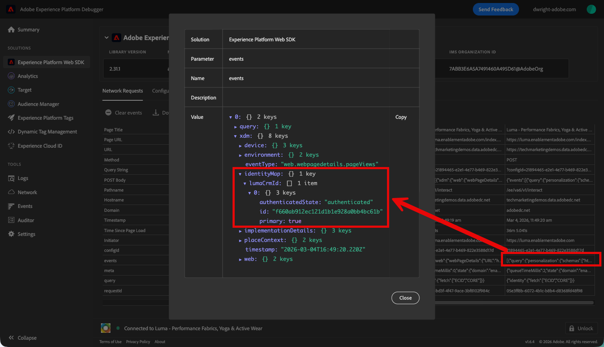

## Convalida con gli strumenti di sviluppo del browser

Molti sviluppatori web potrebbero preferire la visualizzazione dell’implementazione negli strumenti di sviluppo dei loro browser. Questo è particolarmente importante, in quanto non tutti i browser supportano l’estensione Debugger. Inoltre, a causa del framework flessibile, è possibile controllare ulteriori dettagli di implementazione, come cookie e dettagli di risposta.

### Convalidare richieste di rete

I dettagli della richiesta di Web SDK sono visibili anche nella scheda **Network** degli strumenti per sviluppatori Web del browser (supponendo che il sito Web stia caricando la libreria di tag).

1. Apri la scheda **Network** degli strumenti per sviluppatori Web del browser e ricarica la pagina. Filtra le chiamate con `/ee` per individuare la chiamata, selezionala e cerca nelle schede **Intestazioni** e **Payload**

   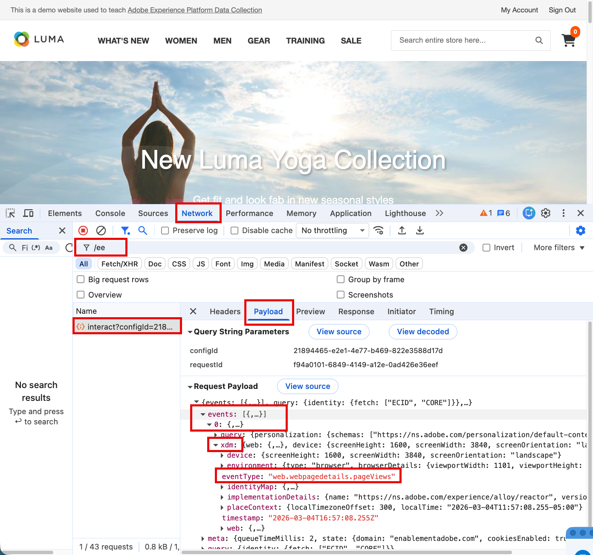

1. Vai alla scheda **Anteprima** e osserva come il valore ECID è incluso nella risposta di rete.

   

   >[!NOTE]
   >
   > Il valore ECID è visibile nella risposta di rete. Non è incluso nella porzione `identityMap` della richiesta di rete, né è memorizzato in questo formato in un cookie.

### Guida di Web SDK

Nell’ambito degli strumenti per sviluppatori, vediamo alcuni cookie impostati da Web SDK nel browser. Apri Applicazione > Cookie > https://luma.enablementadobe.com

Dovresti visualizzare diversi cookie impostati da Web SDK:

* kndctr_[IMS_ORGID]_AdobeOrg_identity: memorizza i dati relativi all&#39;ECID
* kndctr_[IMS_ORGID]_AdobeOrg_cluster: in questo modo viene memorizzato il percorso del centro dati utilizzato in modo che le chiamate di rete successive vengano instradate agli stessi server Edge
* AMCV_[IMS_ORGID]%40AdobeOrg: questo è il cookie AMCV legacy utilizzato dalle librerie Experience Cloud di SDK pre-Web ed è impostato perché abbiamo lasciato l&#39;impostazione predefinita **[!UICONTROL Migra ECID a VisitorAPI all&#39;impostazione Web SDK]** selezionata nell&#39;estensione dei tag Adobe Experience Platform Web SDK. Questa impostazione è importante se è stata abilitata durante la migrazione delle pagine da librerie precedenti a Web SDK, ma può essere disabilitata dopo che tutte le pagine sono state migrate per un certo periodo di tempo.

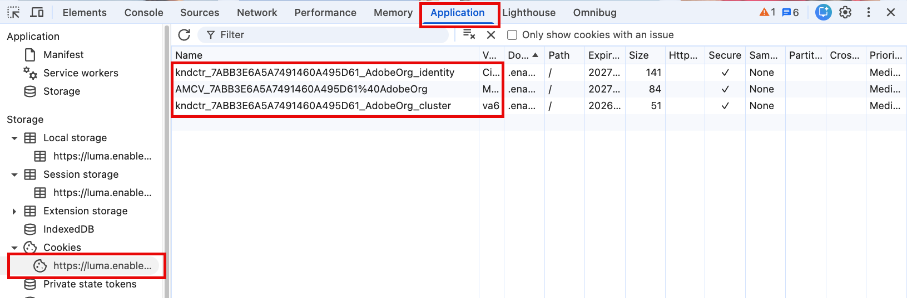

Se si cancellano questi cookie e si ricarica la pagina, è possibile che vengano impostati altri cookie di terze parti nel dominio `.demdex.net`. Queste impostazioni sono state impostate perché è stata lasciata l&#39;impostazione predefinita **[!UICONTROL Usa cookie di terze parti]**: **[!UICONTROL Abilitato]** nell&#39;estensione dei tag di Adobe Experience Platform Web SDK. Se il browser in uso non consente l’utilizzo di cookie di terze parti, questi verranno rimossi al momento del ricaricamento della pagina.

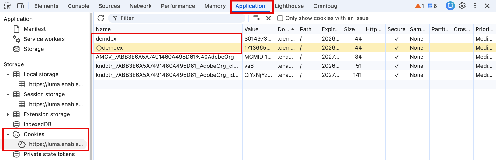

### Archiviazione locale Luma

Il sito web di dimostrazione Luma utilizza tecnologie rigorosamente lato client come HTML, CSS e JavaScript. Non esistono meccanismi di archiviazione back-end, ad eccezione dell’implementazione Experience Cloud utilizzata dallo stato predefinito del sito web. Informazioni come i dettagli del nome utente vengono memorizzate localmente nel browser utilizzando localStorage. Pertanto, se elimini queste informazioni o utilizzi una finestra di incognito, potresti dover ricreare un account utente di test creato in precedenza.

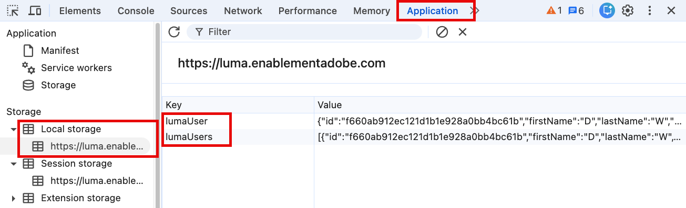

Quindi, scopri come convalidare queste richieste di rete quando vengono ricevute e trasmesse da Platform Edge Network tramite Adobe Experience Platform Assurance.

>[!NOTE]
>
>Grazie per aver dedicato tempo all&#39;apprendimento di Adobe Experience Platform Web SDK. Se hai domande, vuoi condividere commenti generali o suggerimenti su contenuti futuri, condividili in questo [post di discussione della community Experience League](https://experienceleaguecommunities.adobe.com/adobe-experience-platform-18/tutorial-discussion-implement-adobe-experience-cloud-with-web-sdk-tutorial-248848)
