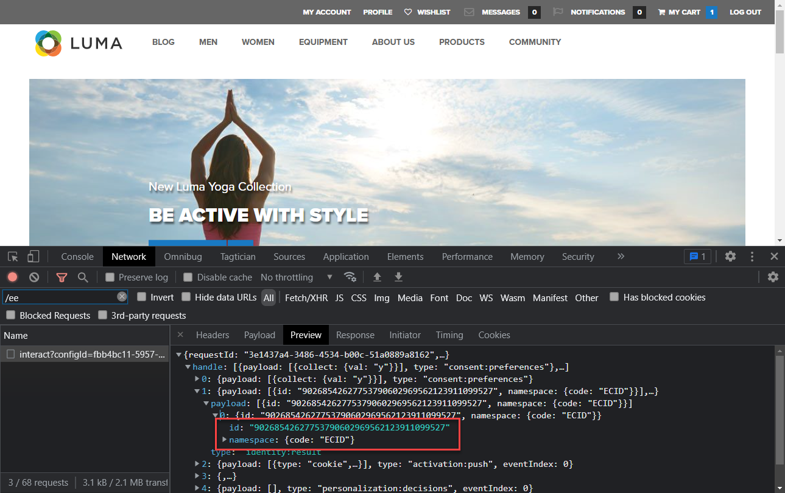
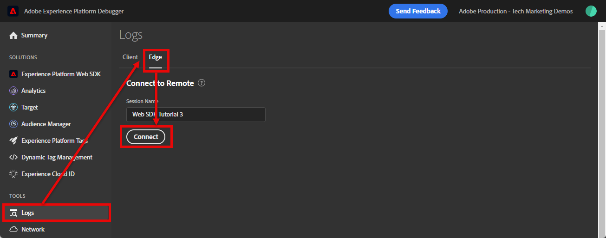

# Convalidare le implementazioni di Web SDK con Experience Platform Debugger

Scopri come convalidare l’implementazione di Adobe Experience Platform Web SDK con Adobe Experience Platform Debugger.

Experience Platform Debugger è un’estensione disponibile per i browser Chrome e Firefox, che consente di visualizzare la tecnologia Adobe implementata nelle pagine web. Scarica la versione per il browser preferito:

* [Estensione Firefox](https://addons.mozilla.org/it/firefox/addon/adobe-experience-platform-dbg/)
* [Estensione Chrome](https://chromewebstore.google.com/detail/adobe-experience-platform/bfnnokhpnncpkdmbokanobigaccjkpob)

Se non hai mai utilizzato il debugger in precedenza, guarda questo video introduttivo di cinque minuti:

>[!VIDEO](https://video.tv.adobe.com/v/36164?learn=on&enablevpops&captions=ita)

In questa lezione, utilizzi l&#39;estensione [Adobe Experience Platform Debugger](https://chromewebstore.google.com/detail/adobe-experience-platform/bfnnokhpnncpkdmbokanobigaccjkpob) per sostituire la proprietà di tag di codifica fissa nel [sito di dimostrazione Luma](https://luma.enablementadobe.com/content/luma/us/en.html) con la tua proprietà.

Questa tecnica è denominata cambio di ambiente e sarà utile in un secondo momento, quando lavorerai con i tag sul tuo sito web. Ti consente di caricare il tuo sito Web di produzione nel browser, ma con la libreria di tag *sviluppo*. Questa funzionalità ti consente di creare e convalidare le modifiche ai tag in modo indipendente dalle regolari versioni del codice. Dopo tutto, questa separazione tra versioni di tag di marketing e versioni di codice è uno dei motivi principali per cui i clienti utilizzano i tag.

## Obiettivi di apprendimento

Alla fine di questa lezione, potrai utilizzare il debugger per:

* Caricare una libreria di tag alternativa
* Verificare che l’evento XDM lato client acquisisca e invii i dati come previsto a Platform Edge Network
* Abilita Edge Trace per visualizzare le richieste lato server inviate da Platform Edge Network

## Prerequisiti

Hai familiarità con i tag di raccolta dati e con il [sito demo Luma](https://luma.enablementadobe.com/content/luma/us/en.html){target="_blank"} e hai completato le lezioni precedenti nell’esercitazione:

* [Configurare uno schema XDM](configure-schemas.md)
* [Configurare uno spazio dei nomi delle identità](configure-identities.md)
* [Configurare uno stream di dati](configure-datastream.md)
* [Estensione Web SDK installata nella proprietà tag](install-web-sdk.md)
* [Creare elementi dati](create-data-elements.md)
* [Creare identità](create-identities.md)
* [Creare regole di tag](create-tag-rule.md)

## Caricare librerie di tag alternative con Debugger

Experience Platform Debugger dispone di una funzione interessante che consente di sostituire una libreria di tag esistente con una diversa. Questa tecnica è utile per la convalida e ci consente di saltare molti passaggi di implementazione in questa esercitazione.

1. Assicurati che il [sito Web di dimostrazione Luma](https://luma.enablementadobe.com/content/luma/us/en.html){target="_blank"} sia aperto e seleziona l&#39;icona dell&#39;estensione Experience Platform Debugger
1. Verrà aperto Debugger e verranno visualizzati alcuni dettagli dell’implementazione hardcoded (potrebbe essere necessario ricaricare il sito Luma dopo aver aperto Debugger)
1. Verifica che il debugger sia &quot;**[!UICONTROL connesso a Luma]**&quot; come illustrato di seguito, quindi seleziona l&#39;icona &quot;**[!UICONTROL blocca]**&quot; per bloccare il debugger sul sito Luma.
1. Seleziona il pulsante **[!UICONTROL Accedi]** e accedi a Adobe Experience Cloud con il tuo Adobe ID.
1. Vai a **[!UICONTROL Tag Experience Platform]** nella barra di navigazione a sinistra

   

1. Seleziona la scheda **[!UICONTROL Configurazione]**
1. A destra della visualizzazione dei **[!UICONTROL Codici di incorporamento pagina]**, apri il menu a discesa **[!UICONTROL Azioni]** e seleziona **[!UICONTROL Sostituisci]**

   

1. Poiché sei autenticato, il Debugger estrae le proprietà e gli ambienti dei tag disponibili. Seleziona la proprietà
1. Seleziona l&#39;ambiente `Development`
1. Seleziona il pulsante **[!UICONTROL Applica]**

   

1. Il sito Web Luma ricaricherà _con la tua proprietà tag_.

   

Continuando l’esercitazione, utilizzi questa tecnica per mappare il sito Luma sulla tua proprietà tag per convalidare l’implementazione di Platform Web SDK. Quando utilizzi i tag sul tuo sito web, puoi usare questa stessa tecnica per convalidare le librerie di tag di sviluppo sul sito web di produzione.

## Convalidare richieste di rete lato client con Experience Platform Debugger

Puoi utilizzare il debugger per convalidare i beacon lato client attivati dall’implementazione di Platform Web SDK per visualizzare i dati inviati a Platform Edge Network:

1. Vai a **[!UICONTROL Riepilogo]** nel menu di navigazione a sinistra per visualizzare i dettagli della proprietà tag

   

1. Vai a **[!UICONTROL Experience Platform Web SDK]** nella barra di navigazione a sinistra per visualizzare le **[!UICONTROL richieste di rete]**
1. Apri la riga **[!UICONTROL events]**

   

1. Nota come visualizzare il tipo di evento `web.webpagedetails.pageView` specificato nell&#39;azione [!UICONTROL Aggiorna variabile] e altre variabili predefinite che aderiscono al gruppo di campi `AEP Web SDK ExperienceEvent`

   

1. Scorrere verso il basso fino all&#39;oggetto `web`, selezionare per aprirlo e controllare `webPageDetails.name`, `webPageDetails.server` e `webPageDetails.siteSection`. Devono corrispondere alle corrispondenti variabili del livello dati `digitalData` nella home page

>[!TIP]
>
> Per visualizzare e confrontare il livello dati `digitalData` nella home page:
>
> 1. Nella home page di Luma, apri gli strumenti di sviluppo del browser. Nel caso di Chrome, selezionare il pulsante `F12` sulla tastiera
> 1. Seleziona la scheda **[!UICONTROL Console]**
> 1. Immetti `digitalData` e seleziona `Enter` sulla tastiera per visualizzare i valori del livello dati

Puoi anche convalidare i dettagli di Identity Map:

1. Accedi al sito Luma utilizzando le credenziali `test@adobe.com`/`test`

1. Torna alla [home page di Luma](https://luma.enablementadobe.com/content/luma/us/en.html)

1. Apri la sezione **[!UICONTROL Experience Platform Web SDK]** nel menu di navigazione a sinistra

   

1. Seleziona la riga **[!UICONTROL events]** per aprire i dettagli in un popup

   

1. Cerca **identityMap** all&#39;interno del pop-up. Qui dovresti vedere `lumaCrmId` con tre chiavi di authenticatedState, id e primary:
   

### Convalidare le richieste lato client con gli strumenti di sviluppo del browser

Questi tipi di dettagli della richiesta sono visibili anche nella scheda Strumenti per sviluppatori Web **Rete** del browser (supponendo che il sito Web stia caricando la libreria di tag).

1. Apri la scheda **Network** degli strumenti per sviluppatori Web del browser e ricarica la pagina. Filtra le chiamate con `/ee` per individuare la chiamata, selezionala e cerca nelle schede **Intestazioni** e **Payload**

   

1. Vai alla scheda **Risposta** e osserva come il valore ECID è incluso nella risposta.

   

   >[!NOTE]
   >
   > Il valore ECID è visibile nella risposta di rete. Non è incluso nella porzione `identityMap` della richiesta di rete, né è memorizzato in questo formato in un cookie.

## Convalidare le richieste di rete lato server con Experience Platform Debugger

Come hai appreso nella lezione [Configurare uno stream di dati](configure-datastream.md), Platform Web SDK invia prima i dati dalla proprietà digitale a Platform Edge Network. Quindi, Platform Edge Network effettua richieste aggiuntive lato server ai servizi corrispondenti abilitati nello stream di dati. Puoi convalidare le richieste lato server effettuate da Platform Edge Network utilizzando Edge Trace nel debugger.

<!--Furthermore, you can also validate the fully processed payload after it reaches an Adobe application by using [Adobe Experience Platform Assurance](https://experienceleague.adobe.com/it/docs/experience-platform/assurance/home). -->

### Abilita traccia di Edge

Per abilitare Edge Trace:

1. Nel menu di navigazione a sinistra di **[!UICONTROL Experience Platform Debugger]** seleziona **[!UICONTROL Registri]**
1. Seleziona la scheda **[!UICONTROL Edge]** e seleziona **[!UICONTROL Connetti]**

   

1. Per il momento è vuoto

   

1. Aggiorna la [home page Luma](https://luma.enablementadobe.com/) e controlla di nuovo **[!UICONTROL Experience Platform Debugger]** per visualizzare i dati.

   

A questo punto, non è possibile visualizzare le richieste di Platform Edge Network indirizzate alle applicazioni Adobe, perché non ne hai abilitato alcuna nello stream di dati. Nelle lezioni future, utilizzi Edge Trace per visualizzare le richieste lato server in uscita alle applicazioni Adobe e l’inoltro di eventi. Ma prima, scopri un altro strumento per convalidare le richieste lato server effettuate da Platform Edge Network: Adobe Experience Platform Assurance.

[Successivo: ](validate-with-assurance.md)

>[!NOTE]
>
>Grazie per aver dedicato tempo all&#39;apprendimento di Adobe Experience Platform Web SDK. Se hai domande, vuoi condividere commenti generali o suggerimenti su contenuti futuri, condividili in questo [post di discussione della community Experience League](https://experienceleaguecommunities.adobe.com/t5/adobe-experience-platform-data/tutorial-discussion-implement-adobe-experience-cloud-with-web/td-p/444996)
