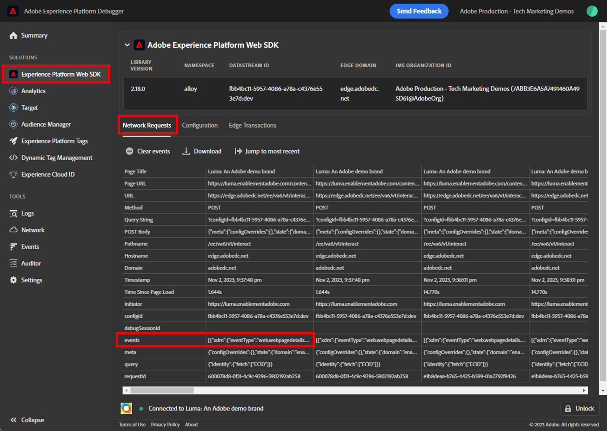

# Convalidare le implementazioni dell’SDK web con Experience Platform Debugger

Scopri come convalidare l’implementazione dell’SDK per web Platform con Adobe Experience Platform Debugger.

Experience Platform Debugger è un’estensione disponibile per i browser Chrome e Firefox che consente di visualizzare la tecnologia Adobe implementata nelle pagine web. Scarica la versione per il browser preferito:

* [Estensione Firefox](https://addons.mozilla.org/it/firefox/addon/adobe-experience-platform-dbg/)
* [Estensione Chrome](https://chrome.google.com/webstore/detail/adobe-experience-platform/bfnnokhpnncpkdmbokanobigaccjkpob)

Se non hai mai utilizzato prima il debugger e questo è diverso dal precedente debugger Adobe Experience Cloud, potresti voler guardare questo video di panoramica di cinque minuti:

>[!VIDEO](https://video.tv.adobe.com/v/32156?quality=12&learn=on)

In questa lezione verrà utilizzato il [Estensione Adobe Experience Cloud Debugger](https://chrome.google.com/webstore/detail/adobe-experience-cloud-de/ocdmogmohccmeicdhlhhgepeaijenapj) per sostituire la proprietà tag hardcoded nel [Sito dimostrativo Luma](https://luma.enablementadobe.com/content/luma/us/en.html) con la tua proprietà.

Questa tecnica si chiama cambio di ambiente e sarà utile in un secondo momento, quando lavori con i tag sul tuo sito web. Puoi caricare il tuo sito web di produzione nel browser, ma con *sviluppo* ambiente tag. Questa funzionalità ti consente di creare e convalidare le modifiche ai tag in modo indipendente dalle regolari versioni del codice. Dopo tutto, questa separazione delle versioni dei tag di marketing dalle versioni regolari del codice è uno dei motivi principali per cui i clienti usano i tag in primo luogo!

## Finalità di apprendimento

Al termine di questa lezione, puoi utilizzare il debugger per:

* Caricare una libreria di tag alternativa
* Convalida l&#39;oggetto XDM che acquisisce e invia dati come previsto da Edge Network

## Prerequisiti

Hai familiarità con i tag di raccolta dati e con [Sito dimostrativo Luma](https://luma.enablementadobe.com/content/luma/us/en.html){target=&quot;_blank&quot;} e hanno completato le seguenti lezioni precedenti nell&#39;esercitazione:

* [Configurare le autorizzazioni](configure-permissions.md)
* [Configurare uno schema XDM](configure-schemas.md)
* [Configurare uno spazio dei nomi di identità](configure-identities.md)
* [Configurare un datastream](configure-datastream.md)
* [Estensione SDK per web installata nella proprietà tag](install-web-sdk.md)
* [Creare elementi dati](create-data-elements.md)
* [Creare una regola di tag](create-tag-rule.md)

## Caricare librerie di tag alternative con Debugger

Questa esercitazione utilizza una versione ospitata pubblicamente [Sito web dimostrativo Luma](https://luma.enablementadobe.com/content/luma/us/en.html). Apri la homepage e segnalala.

Experience Platform Debugger dispone di una funzione fantastica che consente di sostituire una libreria di tag esistente con una diversa. Questa tecnica è utile per la convalida e ci consente di saltare molti passaggi di implementazione in questa esercitazione.

1. Assicurati di aver aperto il sito Luma e seleziona l’icona dell’estensione Experience Platform Debugger .
1. Il debugger verrà aperto e mostrerà alcuni dettagli dell’implementazione hardcoded, che non sono correlati a questa esercitazione (potrebbe essere necessario ricaricare il sito Luma dopo l’apertura del debugger)
1. Conferma che il debugger sia &quot;**[!UICONTROL Connesso a Luma]**&quot; come illustrato di seguito e quindi selezionare &quot;**[!UICONTROL bloccare]**&quot; per bloccare il debugger sul sito Luma.
1. Seleziona la **[!UICONTROL Accesso]** e accedi a Adobe Experience Cloud utilizzando il tuo ID Adobe.
1. Ora vai a **[!UICONTROL Experience Platform di tag]** nella navigazione a sinistra

   

1. Seleziona la **[!UICONTROL Configurazione]** scheda
1. A destra di dove ti mostra la **[!UICONTROL Codici di incorporamento della pagina]**, apri **[!UICONTROL Azioni]** a discesa e seleziona **[!UICONTROL Sostituisci]**

   

1. Poiché sei autenticato, Debugger eseguirà il pull-in delle proprietà e degli ambienti di tag disponibili. Seleziona la tua `Web SDK Course` property
1. Seleziona la tua `Development` ambiente
1. Seleziona la **[!UICONTROL Applica]** pulsante

   

1. Il sito web Luma verrà ora ricaricato _con la proprietà tag_.

   

Continuando l’esercitazione, utilizzerai questa tecnica per mappare il sito Luma sulla tua proprietà tag per convalidare l’implementazione dell’SDK per web di Platform. Quando inizi a utilizzare i tag sul sito web di produzione, puoi usare la stessa tecnica per convalidare le modifiche.

## Convalidare l’implementazione in Experience Platform Debugger

Puoi utilizzare Debugger per convalidare l’implementazione dell’SDK per web di Platform e visualizzare i dati inviati a Platform Edge Network:

1. Vai a **[!UICONTROL Riepilogo]** nel menu di navigazione a sinistra, per visualizzare i dettagli della proprietà tag

   

1. Ora vai a **[!UICONTROL Experience Platform Web SDK]** nella navigazione a sinistra per visualizzare il **[!UICONTROL Richieste di rete]**
1. Apri **[!UICONTROL events]** row (non preoccuparti se questa schermata mostra più richieste della tua, include richieste provenienti da lezioni future e puoi ignorarle per il momento)

   

1. Si noti come è possibile visualizzare `web.webpagedetails.pageView` tipo di evento specificato nella [!UICONTROL Invia evento] e altre variabili pronte all’uso che aderiscono al `AEP Web SDK ExperienceEvent Mixin` format

   

1. Scorri verso il basso fino a `web` , selezionare per aprirlo ed esaminare `webPageDetails.name`, `webPageDetails.server`e `webPageDetails.siteSection`. Devono corrispondere alle corrispondenti variabili del livello di dati digitaliData nella home page

   

Puoi anche convalidare i dettagli della mappa identità:

1. Accedi al sito Luma utilizzando le credenziali `test@adobe.com`/`test`

1. Torna alla [home page di Luma](https://luma.enablementadobe.com/content/luma/us/en.html)

1. Apri **[!UICONTROL Experience Platform Web SDK]** nella navigazione a sinistra

   

1. Seleziona la **[!UICONTROL events]** riga per aprire i dettagli in un pop-up

   

1. Cerca il **identityMap** nella finestra a comparsa. Qui dovrebbe vedere `lumaCrmId` con tre chiavi authenticatedState, id e primary:
   

## Convalida con gli strumenti di sviluppo del browser

Questi tipi di dettagli di richiesta sono visibili anche negli strumenti per sviluppatori web del browser **Rete** (supponendo che il sito web stia caricando la libreria di tag).

1. Apri gli strumenti per sviluppatori web del browser **Rete** e ricarica la pagina. Filtrare le chiamate con `/ee` per individuare la chiamata , selezionala e quindi cerca nella **Intestazioni** e **Payload** scheda

   

1. Vai a **Risposta** e osserva come il valore ECID è incluso nella risposta. Copia questo valore così come lo utilizzerai per convalidare le informazioni di profilo nell’esercizio successivo

   

   >[!NOTE]
   >
   >    Potresti non visualizzare la stessa quantità di richieste di payload come nella schermata precedente. Questa disparità è dovuta alle lezioni future per [configurazione di Target](setup-target.md) sono stati completati al momento dello screenshot in corso. Per ora puoi ignorare questa differenza.

Ora che un oggetto XDM viene attivato su una pagina e sapendo come convalidare la raccolta dati, puoi configurare le singole applicazioni Adobe utilizzando Platform Web SDK.

[Avanti: ](setup-experience-platform.md)

>[!NOTE]
>
>Grazie per aver investito il tuo tempo nel conoscere Adobe Experience Platform Web SDK. In caso di domande, se desideri condividere feedback generali o se hai suggerimenti su contenuti futuri, condividi questi su questo [Experience League Articolo di discussione della Comunità](https://experienceleaguecommunities.adobe.com/t5/adobe-experience-platform-launch/tutorial-discussion-implement-adobe-experience-cloud-with-web/td-p/444996)
