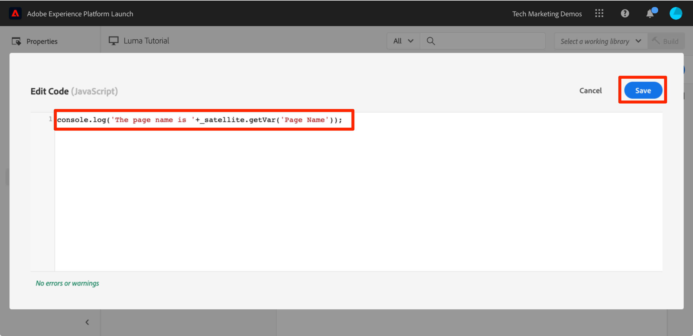

# Aggiungere un elemento dati, una regola e una libreria

In questa lezione, creerai i tuoi primi elemento dati, regola e libreria.

Gli elementi e le regole di dati sono gli elementi costitutivi di base dei tag. Gli elementi dati memorizzano gli attributi che desideri inviare alle tue soluzioni di marketing e pubblicitarie, mentre le richieste a tali soluzioni vengono inviate dalle Regole in giuste condizioni. Le librerie sono file JavaScript caricati nella pagina per eseguire tutto il lavoro. In questa lezione, utilizzerai tutti e tre per fare in modo che la nostra pagina di esempio esegua un’operazione.


>[!WARNING]
>
> Il sito web Luma utilizzato in questa esercitazione dovrebbe essere sostituito durante la settimana del 16 febbraio 2026. Il lavoro svolto come parte di questo tutorial potrebbe non essere applicabile al nuovo sito web.

>[!NOTE]
>
>Adobe Experience Platform Launch viene integrato in Adobe Experience Platform come suite di tecnologie per la raccolta dati. Nell’interfaccia sono state introdotte diverse modifiche terminologiche di cui tenere conto quando si utilizza questo contenuto:
>
> * Platform Launch (lato client) è ora **[[!DNL tags]](https://experienceleague.adobe.com/docs/experience-platform/tags/home.html?lang=it)**
> * Platform Launch Server Side è ora **[[!DNL event forwarding]](https://experienceleague.adobe.com/docs/experience-platform/tags/event-forwarding/overview.html)**
> * Le configurazioni di Edge sono ora **[[!DNL datastreams]](https://experienceleague.adobe.com/docs/experience-platform/edge/fundamentals/datastreams.html?lang=it)**

## Finalità di apprendimento

Alla fine di questa lezione, potrai:

* Creare un elemento dati
* Creare una regola
* Creare una libreria
* Aggiungere modifiche a una libreria
* Convalidare il caricamento della libreria nel browser Web
* Utilizzare la funzione “Working Library” per lavorare in modo più efficiente

## Creare elementi dati per Nome pagina

Gli elementi dati sono versioni di tag di un livello dati. Essi possono memorizzare i valori del tuo oggetto livello dati, dei cookie, degli oggetti di memorizzazione locali, dei parametri delle stringhe query, degli elementi pagina, dei metatag, ecc. In questo esercizio, creerai un elemento dati per Nome pagina, che utilizzerai successivamente nelle implementazioni di Target e Analytics.

**Per creare un elemento dati**

1. Nel menu di navigazione a sinistra, fai clic su **[!UICONTROL Elementi dati]**

1. Poiché in questa proprietà non hai ancora creato elementi dati, viene visualizzato un breve video con informazioni aggiuntive su questo argomento. Se lo desideri, guarda questo video.

1. Fai clic sul pulsante **[!UICONTROL Crea nuovo elemento dati]**:

   

1. Denomina l’elemento dati, ad es. `Page Name`

1. Utilizza il tipo di elemento dati [!UICONTROL Variabile JavaScript] per puntare a un valore nel livello dati della pagina di esempio: `digitalData.page.pageInfo.pageName`

1. Seleziona le caselle per **[!UICONTROL Forza valori minuscoli]** e **[!UICONTROL Pulisci testo]** per standardizzare il caso e rimuovere spazi estranei

1. Lascia **[!UICONTROL None]** come impostazione **[!UICONTROL Storage Duration]** poiché questo valore è in genere diverso in ogni pagina

1. Fai clic sul pulsante **[!UICONTROL Salva]** per salvare l&#39;elemento dati

   .

>[!NOTE]
>
>Le funzionalità degli elementi dati _possono essere estese con le estensioni_. Ad esempio, l’estensione ContextHub consente di aggiungere elementi dati utilizzando le funzioni dell’estensione.

## Creare una regola

Successivamente, utilizzerai questo elemento dati in una regola semplice. Le regole sono una delle funzioni più potenti nei tag e consentono di specificare cosa deve accadere quando il visitatore interagisce con il sito web. Quando i criteri descritti nelle regole vengono soddisfatti, la regola attiva l’azione specificata.

Genererai una regola che restituisce il valore dell’elemento Nome pagina alla console del browser.

**Per creare una regola**

1. Nel menu di navigazione a sinistra, fai clic su **[!UICONTROL Regole]**

1. Poiché non hai ancora creato regole in questa proprietà, viene visualizzato un breve video con ulteriori informazioni sull’argomento. Se lo desideri, guarda questo video.

1. Fai clic sul pulsante **[!UICONTROL Crea nuova regola]**:

   

1. Denomina la regola `All Pages - Library Loaded`. Questa convenzione per i nomi indica dove e quando verrà attivata la regola, facilitando l’identificazione e il riutilizzo con la maturazione della proprietà tag.

1. In Eventi, fare clic su **[!UICONTROL Aggiungi]**. L’evento indica ai tag quando la regola dovrebbe attivarsi e può essere molte cose, inclusi il caricamento di una pagina, un clic, un evento JavaScript personalizzato, ecc.

   

   1. In Tipo evento, seleziona **[!UICONTROL Libreria caricata (Pagina in alto)]**. Tieni presente che quando selezioni Tipo evento, i tag precompilano un nome per l’evento utilizzando la selezione. Inoltre, l’ordine predefinito per l’evento è 50. L’ordinamento è una funzione potente nei tag che offre un controllo preciso sulla sequenza di azioni quando più regole vengono attivate dallo stesso evento. Questa funzione verrà utilizzata più avanti nell’esercitazione.

   1. Fai clic sul pulsante **[!UICONTROL Mantieni modifiche]**

   

1. Poiché questa regola deve essere attivata su tutte le pagine, lascia vuoto **[!UICONTROL Condizioni]**. Se apri la modale Condizioni, vedrai che le condizioni possono aggiungere restrizioni ed esclusioni in base a un’ampia gamma di opzioni, inclusi URL, valori degli elementi dati, intervalli di date e molto altro.

1. In Azioni, fai clic su **[!UICONTROL Aggiungi]**

1. Seleziona **[!UICONTROL Tipo azione > Codice personalizzato]**, che a questo punto è l&#39;unica opzione. Più avanti nell’esercitazione, quando si aggiungono estensioni saranno disponibili più opzioni.

1. Seleziona **[!UICONTROL &lt;/> Apri editor]** per aprire l&#39;editor di codice

   

1. Aggiungi quanto segue all’editor di codice. Questo codice invia il valore dell’elemento dati Nome pagina alla console del browser, in modo da permetterti di confermare il funzionamento:

   ```javascript
   console.log('The page name is '+_satellite.getVar('Page Name'));
   ```

1. Salva l’editor di codice.

   

1. Nella schermata di configurazione dell&#39;azione fai clic su **[!UICONTROL Mantieni modifiche]**

1. Fai clic su **[!UICONTROL Salva]** per salvare la regola

Nella pagina Regole dovresti visualizzare la nuova regola:


## Salvare le modifiche in una libreria

Dopo aver configurato una raccolta di estensioni, elementi dati e regole nell’interfaccia di Data Collection, devi creare un pacchetto di tali funzionalità e logica in un set di codice JavaScript da distribuire sul sito web, in modo che i tag di marketing vengano attivati quando i visitatori arrivano sul sito. Una libreria è il set di codice JavaScript che esegue questa operazione.

In una lezione precedente, hai implementato il codice da incorporare dell’ambiente di sviluppo nella pagina di esempio. Quando si caricava la pagina di esempio, veniva restituito un errore 404 per l’URL del codice di incorporamento, poiché una libreria di tag non era stata ancora generata e assegnata all’ambiente. Ora, inserirai il nuovo elemento dati e la regola in una libreria in modo che la pagina di esempio possa fare qualcosa.

**Aggiungere e creare una libreria**

1. Nel menu di navigazione a sinistra, fai clic su **[!UICONTROL Flusso di pubblicazione]**

1. Fai clic su **[!UICONTROL Aggiungi nuova libreria]**

   

1. Denomina la libreria, ad esempio `Initial Setup`

1. Seleziona **[!UICONTROL Ambiente > Sviluppo]**

1. Fai clic su **[!UICONTROL Aggiungi tutte le risorse modificate]**

   

1. Dopo aver fatto clic su **[!UICONTROL Aggiungi tutte le risorse modificate]**, i tag riepilogano le modifiche appena apportate.

1. Fai clic su **[!UICONTROL Salva e genera per sviluppo]**

   

Dopo alcuni istanti, il punto dello stato diventa verde per indicare che la libreria è stata creata correttamente.


## Convalidare il lavoro

Ora verifica che la regola funzioni come previsto.

Ricarica la pagina di esempio. Se osservi la scheda Strumenti per sviluppatori > Rete, ora dovresti vedere una risposta di 200 per la tua libreria di tag!


Se osservi Strumenti per sviluppatori > Console, è necessario visualizzare il testo &quot;Il nome della pagina è home&quot;


Congratulazioni, hai creato il tuo primo elemento dati e la prima regola e generato la tua prima libreria di tag.

## Usare la funzione Working Library

Quando effettui molte modifiche nei tag, è scomodo aprire la scheda Pubblicazione, aggiungere modifiche e generare la libreria ogni volta che desideri visualizzare il risultato.  Ora che hai creato la libreria “Initial Setup”, puoi utilizzare la funzione Working Library per salvare rapidamente le modifiche e ricrearle in un singolo passaggio.

Effettua una piccola modifica alla regola “All Pages - Library Loaded”. Nel menu di navigazione a sinistra, fai clic su **[!UICONTROL Regole]**, quindi fai clic sulla regola `All Pages - Library Loaded` per aprirla.


Nella pagina `Edit Rule`, fai clic sul menu a discesa ***[!UICONTROL Working Library]*** e seleziona la tua libreria `Initial Setup`.


Dopo aver selezionato la libreria, il pulsante **[!UICONTROL Salva]** è ora **[!UICONTROL Salva nella libreria]**. Quando effettui una modifica nei tag, puoi utilizzare questa opzione per aggiungere automaticamente la modifica direttamente nella libreria di lavoro e/o ricrearla.

Esegui il test. Apri l’azione Codice personalizzato e aggiungi un due punti dopo il testo &quot;Il nome della pagina è&quot;, in modo che l’intero blocco di codice reciti:

```javascript
console.log('The page name is: '+_satellite.getVar('Page Name'));
```

Salva il codice, mantieni le modifiche nell&#39;azione, quindi fai clic sul pulsante **[!UICONTROL Salva nella libreria e genera]**.


Attendi che il punto verde venga nuovamente visualizzato accanto al menu a discesa [!UICONTROL Working Library]. A questo punto, ricarica la pagina di esempio e dovresti visualizzare le modifiche riportate nel messaggio della console (per visualizzare la modifica alla pagina potrebbe essere necessario cancellare la cache del browser e ricaricare):


Si tratta di un metodo di lavoro molto più veloce: userai questo approccio per il resto dell’esercitazione.

[Avanti &quot;Cambiare ambienti con Experience Cloud Debugger&quot; >](switch-environments.md)
