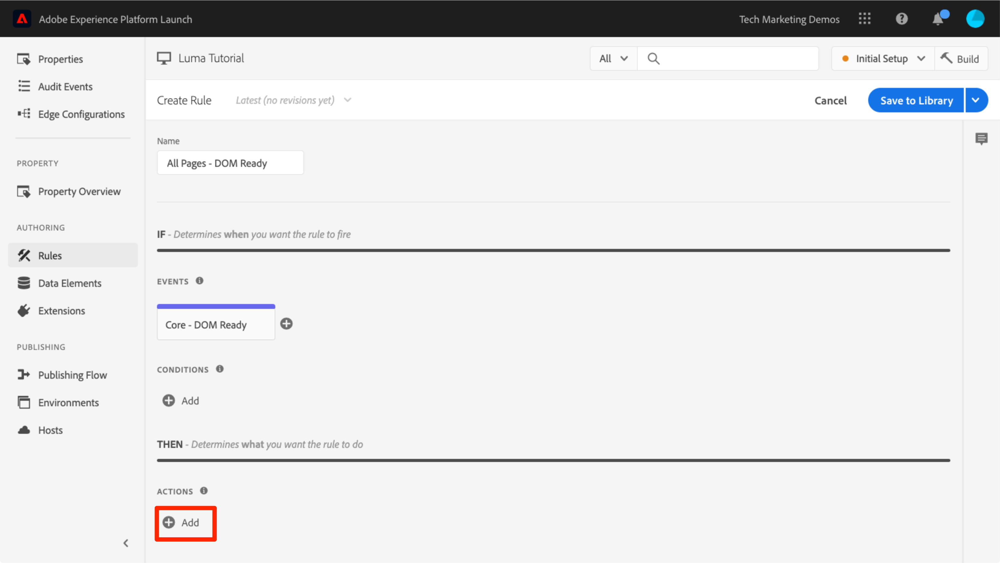
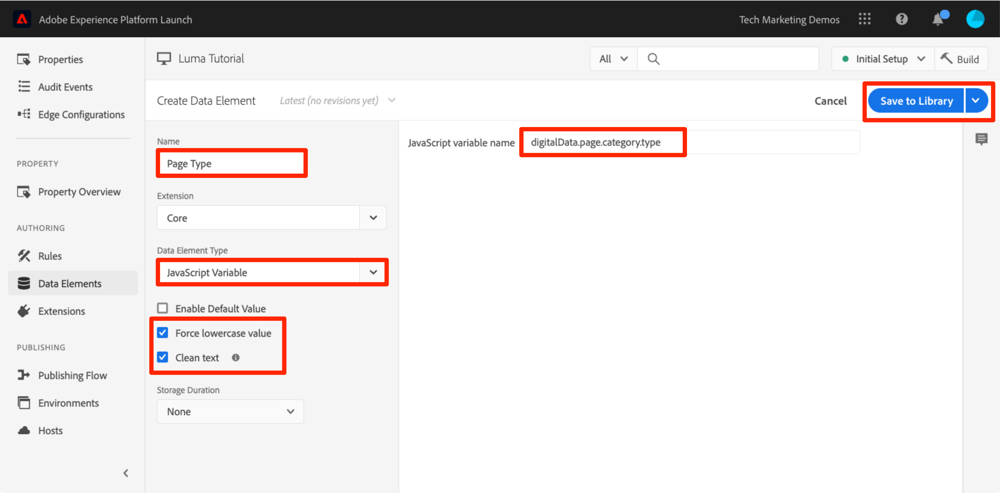
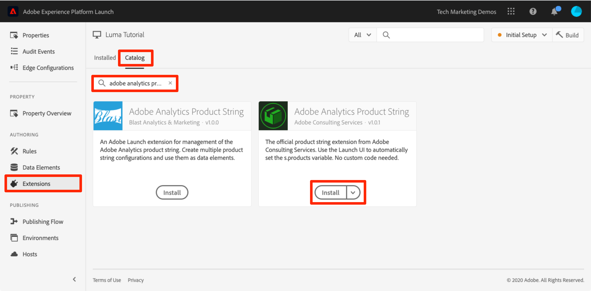
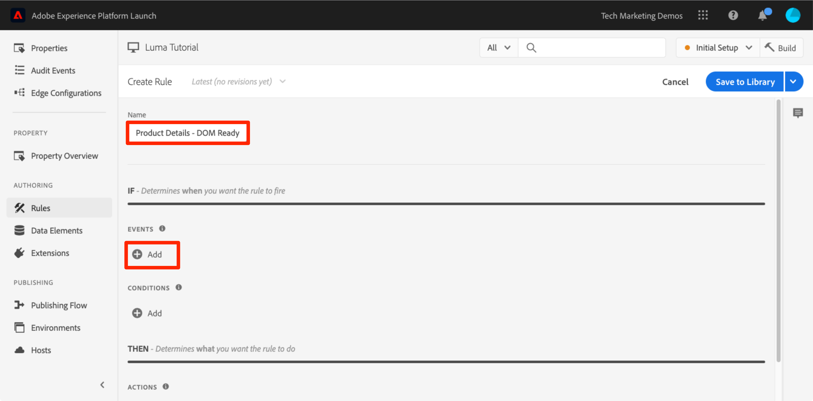
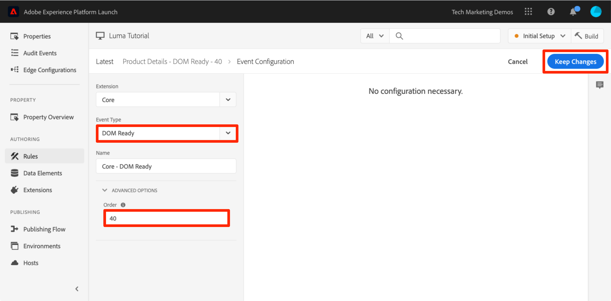
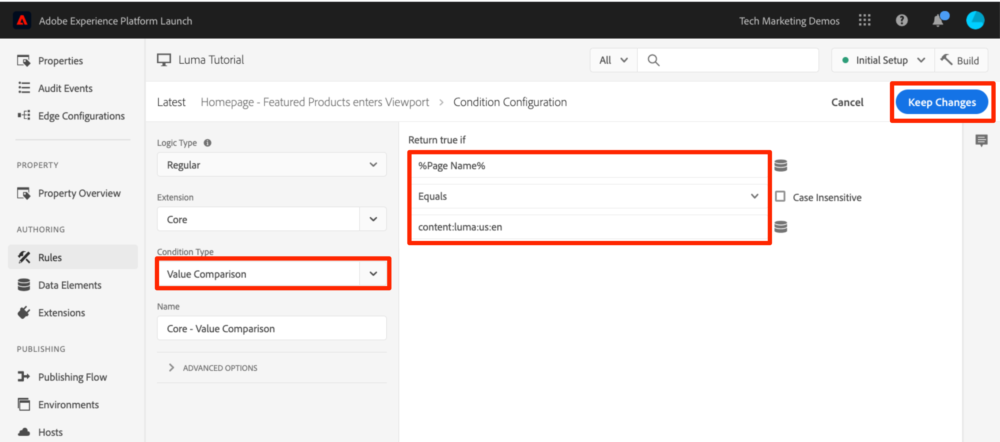

# Aggiungere Adobe Analytics

In questa lezione, implementerai [l’estensione Adobe Analytics](https://experienceleague.adobe.com/docs/experience-platform/tags/extensions/adobe/analytics/overview.html) e creerai regole per inviare dati ad Adobe Analytics.


>[!WARNING]
>
> Il sito web Luma utilizzato in questa esercitazione dovrebbe essere sostituito durante la settimana del 16 febbraio 2026. Il lavoro svolto come parte di questo tutorial potrebbe non essere applicabile al nuovo sito web.

[Adobe Analytics](https://experienceleague.adobe.com/docs/analytics.html?lang=it) è una soluzione leader di settore che ti consente di comprendere i tuoi clienti come persone e gestire la tua attività grazie alle informazioni sul cliente.

>[!NOTE]
>
>Adobe Experience Platform Launch viene integrato in Adobe Experience Platform come suite di tecnologie per la raccolta dati. Nell’interfaccia sono state introdotte diverse modifiche terminologiche di cui tenere conto quando si utilizza questo contenuto:
>
> * Platform Launch (lato client) è ora **[[!DNL tags]](https://experienceleague.adobe.com/docs/experience-platform/tags/home.html?lang=it)**
> * Platform Launch Server Side è ora **[[!DNL event forwarding]](https://experienceleague.adobe.com/docs/experience-platform/tags/event-forwarding/overview.html)**
> * Le configurazioni di Edge sono ora **[[!DNL datastreams]](https://experienceleague.adobe.com/docs/experience-platform/edge/fundamentals/datastreams.html?lang=it)**

## Finalità di apprendimento

Alla fine di questa lezione, potrai:

1. Aggiungere l’estensione Adobe Analytics
1. Imposta le variabili globali tramite l&#39;estensione
1. Aggiungi il beacon di visualizzazione pagina
1. Aggiungi variabili aggiuntive tramite le regole
1. Aggiungi il tracciamento dei clic e altri beacon basati su eventi
1. Aggiungere i plug-in di Analytics

Puoi implementare molti elementi per Analytics nei tag. Questa lezione non è esaustiva, ma fornisce una panoramica delle tecniche principali necessarie da implementare nel tuo sito.

## Prerequisiti

Devi avere già completato le lezioni in [Configura tag](create-a-property.md) e [Aggiungi il servizio Identity](id-service.md).

Inoltre, devi disporre di almeno un ID suite per report e del tracking server. Se non hai una suite per report test/dev che puoi usare per questa esercitazione, creane una. Se non sai come farlo, consulta [la documentazione](https://experienceleague.adobe.com/en/docs/analytics/admin/admin-tools/manage-report-suites/c-new-report-suite/t-create-a-report-suite). Puoi recuperare il tracking server dalla tua implementazione corrente dall’Adobe Consultant o dal rappresentante dell’Assistenza clienti.

## Aggiungi l’estensione Analytics

L’estensione di Analytics consiste in due parti principali:

1. La configurazione dell&#39;estensione, che gestisce le impostazioni della libreria principale AppMeasurement.js e può impostare variabili globali
1. Azioni di regola per eseguire le operazioni seguenti:
   1. Imposta variabili
   1. Cancella variabili
   1. Inviare il beacon di Analytics

**Aggiungere l’estensione Analytics**

1. Vai a **[!UICONTROL Estensioni > Catalogo]**
1. Individua l’estensione Adobe Analytics
1. Fai clic su **[!UICONTROL Installa]**

   

1. In [!UICONTROL Gestione libreria > Suite per report], immetti gli ID suite per report che desideri utilizzare con ogni ambiente di tag. Se gli utenti hanno accesso ad Adobe Analytics, tieni presente che quando inizi a digitare nella casella verrà visualizzato un elenco precompilato di tutte le suite di rapporti. (È possibile utilizzare una suite per report per tutti gli ambienti in questa esercitazione, ma in uno scenario reale dovresti utilizzare suite per report separate, come illustrato nell’immagine seguente).

   

   >[!TIP]
   >
   >È consigliabile utilizzare l&#39;opzione [!UICONTROL Gestisci la libreria per me] come impostazione [!UICONTROL Gestione libreria], in quanto consente di mantenere la libreria `AppMeasurement.js` aggiornata in modo molto più semplice.

1. In [!UICONTROL Generale > Server di monitoraggio], immettere il server di monitoraggio, ad esempio `tmd.sc.omtrdc.net`. Immetti Server di tracciamento SSL se il sito supporta `https://`.

   

1. Nella sezione [!UICONTROL Variabili globali], in [!UICONTROL Impostazioni aggiuntive], imposta la variabile [!UICONTROL Nome pagina] utilizzando l&#39;elemento dati `Page Name`. Fai clic sull’icona  per aprire il modale e scegli l’`Page Name`elemento dati della pagina).

1. Fai clic su **[!UICONTROL Salva nella libreria]**

   

>[!NOTE]
>
>Le variabili globali possono essere impostate nella configurazione dell’estensione o nelle azioni di regola. Tieni presente che quando imposti variabili nella configurazione dell&#39;estensione, il livello dati deve essere definito *prima* dei codici di incorporamento dei tag.

## Invia il beacon Vista pagina

Ora creerai una regola per attivare il beacon di Analytics, che invierà la variabile [!UICONTROL Page Name] impostata nella configurazione dell’estensione.

Hai già creato una regola &quot;All Pages - Library Loaded&quot; in [Aggiungi un elemento dati, una regola e una libreria](add-data-elements-rules.md) lezione di questa esercitazione, che viene attivata su ogni pagina al caricamento della libreria di tag. *è possibile* utilizzare questa regola anche per Analytics, tuttavia questa configurazione richiede che tutti gli attributi del livello dati utilizzati nel beacon di Analytics siano definiti prima dei codici di incorporamento dei tag. Per consentire una maggiore flessibilità con la raccolta dati, crea una nuova regola “all pages” attivata sul DOM Ready per attivare il beacon Analytics.

**Inviare il beacon Vista pagina**

1. Vai alla sezione **[!UICONTROL Regole]** nel menu di navigazione a sinistra, quindi fai clic su **[!UICONTROL Aggiungi regola]**

   

1. Denomina la regola `All Pages - DOM Ready`
1. Fai clic su **[!UICONTROL Eventi > Aggiungi]** per aprire la schermata `Event Configuration`

   

1. Seleziona **[!UICONTROL Tipo evento > DOM Ready]** (tieni presente che l&#39;ordine della regola è &quot;50&quot;)
1. Fai clic su **[!UICONTROL Mantieni modifiche]**
   

1. In Azioni, fai clic su  per aggiungere una nuova azione.

   

1. Seleziona **[!UICONTROL Estensione > Adobe Analytics]**

1. Seleziona **[!UICONTROL Tipo azione > Invia beacon]**

1. Lascia Tracking impostato su `s.t()`. Tieni presente che se desideri effettuare una chiamata `s.tl()` in una regola di evento clic, puoi farlo utilizzando anche l’azione Invia beacon.

1. Fai clic sul pulsante **[!UICONTROL Mantieni modifiche]**

   

1. Fai clic su **[!UICONTROL Salva nella libreria e genera]**

   

### Convalidare il beacon Vista pagina

Dopo aver creato una regola per inviare un beacon Analytics, dovresti essere in grado di visualizzare la richiesta in Experience Cloud Debugger.

1. Apri il [sito Luma](https://luma.enablementadobe.com/content/luma/us/en.html) nel browser Chrome.
1. Fai clic sull&#39;icona Debugger  per aprire **[!UICONTROL Adobe Experience Cloud Debugger]**
1. Accertati che Debugger mappi la proprietà tag nell&#39;ambiente di sviluppo *your*, come descritto nella [lezione precedente](switch-environments.md)

   

1. Fai clic per aprire la scheda Analytics.
1. Espandi il nome della suite per report per mostrare tutte le richieste ad essa effettuate.
1. Conferma l’avvio della richiesta con la variabile e il valore Nome pagina.

   

>[!NOTE]
>
>Se Nome pagina non viene visualizzato, torna indietro nei passaggi della pagina per assicurarti di non aver tralasciato nulla.

## Aggiungi variabili con regole

Una volta configurata l’estensione Analytics, hai popolato la variabile `pageName` nella configurazione dell’estensione. Si tratta di una posizione ideale per compilare altre variabili globali, come eVar e proprietà, a condizione che il valore sia disponibile sulla pagina prima del caricamento del codice di incorporamento del tag.

Una posizione più flessibile per impostare le variabili, così come gli eventi, si trova nelle regole, utilizzando l’azione`Set Variables`. Le regole consentono di impostare variabili di Analytics ed eventi differenti in condizioni diverse. Ad esempio, puoi impostare `prodView` solo sulle pagine di dettaglio del prodotto e l’evento `purchase` solo nelle pagine di conferma degli ordini. In questa sezione ti viene illustrato come impostare le variabili utilizzando le regole.

### Caso d&#39;uso

Product Detail Pages (PDP) sono punti importanti per la raccolta di dati sui siti di vendita al dettaglio. In genere, si desidera che Analytics registri la visualizzazione di un prodotto e il prodotto visualizzato. Questo è utile per capire i prodotti più popolari tra i clienti. Su un sito multimediale, le pagine di articolo o video potrebbero utilizzare tecniche di tracciamento simili a quelle che utilizzerai in questa sezione. Quando carichi una pagina di dettagli del prodotto, potrebbe essere utile inserire tale valore in un “Page Type” `eVar` e impostare alcuni eventi e l’ID prodotto. Questo consente di visualizzare quanto segue nell’analisi:

1. Quante volte vengono caricate le pagine dei dettagli del prodotto
1. Quali prodotti specifici vengono visualizzati e quante volte
1. Come incidono gli altri fattori (campagne, ricerca, ecc.) sul numero di persone PDP che caricano

### Crea elemento dati per tipo di pagina

Innanzitutto devi identificare quali sono le pagine dei dettagli prodotto. Puoi farlo con un elemento dati.

**Creare l’elemento dati per Page Type**

1. Fai clic su **[!UICONTROL Elementi dati]** nel menu di navigazione a sinistra
1. Fai clic su **[!UICONTROL Aggiungi elemento dati]**

   

1. Denomina l’elemento dati `Page Type`
1. Seleziona **[!UICONTROL Tipo elemento dati > Variabile JavaScript]**
1. Utilizza `digitalData.page.category.type` come **[!UICONTROL nome variabile JavaScript]**
1. Controlla le opzioni **[!UICONTROL Pulisci testo]** e **[!UICONTROL Forza lettere minuscole]**
1. Fai clic su **[!UICONTROL Salva nella libreria]**

   

### Creare un elemento dati per ID prodotto

Quindi, raccogli l’ID prodotto della pagina dettagli prodotto corrente con un elemento dati.

**Creare l’elemento dati per l’ID prodotto**

1. Fai clic su **[!UICONTROL Elementi dati]** nel menu di navigazione a sinistra
1. Fai clic su **[!UICONTROL Aggiungi elemento dati]**

   

1. Denomina l’elemento dati `Product Id`
1. Seleziona **[!UICONTROL Tipo elemento dati > Variabile JavaScript]**
1. Utilizza `digitalData.product.0.productInfo.sku` come **[!UICONTROL nome variabile JavaScript]**
1. Controlla le opzioni **[!UICONTROL Pulisci testo]** e **[!UICONTROL Forza lettere minuscole]**
1. Fai clic su **[!UICONTROL Salva nella libreria]**

   

### Aggiungi l’estensione Adobe Analytics Product String

Se conosci le implementazioni di Adobe Analytics, probabilmente hai già familiarità con le [variabili dei prodotti](https://experienceleague.adobe.com/docs/analytics/implementation/vars/page-vars/products.html?lang=it). La variabile dei prodotti ha una sintassi specifica e viene utilizzata modi leggermente diversi a seconda del contesto. Per semplificare la popolazione della variabile dei prodotti nei tag, sono state create tre estensioni aggiuntive nel marketplace dell’estensione tag. In questa sezione viene aggiunta un’estensione creata da Adobe Consulting per l’utilizzo nella pagina Product Detail.

**Aggiungere l’`Adobe Analytics Product String`estensione**

1. Vai alla pagina [!UICONTROL Estensioni > Catalogo].
1. Trova l&#39;estensione `Adobe Analytics Product String` dai servizi Adobe Consulting e fai clic su **[!UICONTROL Installa]**
   
1. Leggi le istruzioni.
1. Fai clic su **[!UICONTROL Salva nella libreria]**

   

### Crea la regola per le pagine dettagli prodotto

Adesso, utilizza i nuovi elementi di dati e l’estensione per generare la regola per la pagina Product Detail. Per questa funzionalità, creerai un’altra regola di caricamento della pagina, attivata da DOM Ready. Tuttavia, utilizzerai una condizione per attivare solo le pagine di dettaglio del prodotto e l’impostazione dell’ordine in modo che venga attivato _prima_ della regola che invia il beacon.

**Creare la regola della pagina Dettagli prodotto**

1. Vai alla sezione **[!UICONTROL Regole]** nel menu di navigazione a sinistra, quindi fai clic su **[!UICONTROL Aggiungi regola]**

   

1. Denomina la regola `Product Details - DOM Ready - 40`
1. Fai clic su **[!UICONTROL Eventi > Aggiungi]** per aprire la schermata `Event Configuration`

   

1. Seleziona **[!UICONTROL Tipo evento > DOM Ready]**
1. Imposta **[!UICONTROL Ordine]** su 40, in modo che la regola venga eseguita *prima* della regola contenente l&#39;azione Analytics > Invia beacon
1. Fai clic su **[!UICONTROL Mantieni modifiche]**
   

1. In **[!UICONTROL Condizioni]**, fai clic su  per aprire la schermata `Condition Configuration`
   

   1. Seleziona **[!UICONTROL Tipo condizione > Confronto valori]**
   1. Utilizza il selettore degli elementi dati, scegli `Page Type` nel primo campo.
   1. Seleziona **[!UICONTROL Contiene]** dal menu a discesa operatore di confronto
   1. Nel tipo di campo successivo, digita `product-page` (questa è la parte univoca del valore di Page Type estratto dal livello dati su PDP).
   1. Fai clic su **[!UICONTROL Mantieni modifiche]**

      

1. In Azioni, fai clic su  per aggiungere una nuova azione.

   

1. Seleziona **[!UICONTROL Estensione > Adobe Analytics Product String]**
1. Seleziona **[!UICONTROL Tipo azione > Imposta s.products]**

1. Nella sezione **[!UICONTROL Analytics E-commerce Event]**, seleziona **[!UICONTROL prodView]**

1. Nella sezione **[!UICONTROL Variabili del livello dati per i dati del prodotto]**, utilizza il selettore Elemento dati per scegliere l&#39;elemento dati `Product Id`

1. Fai clic su **[!UICONTROL Mantieni modifiche]**

   


1. In Azioni, fai clic su  per aggiungere una nuova azione.

   

1. Seleziona **[!UICONTROL Estensione > Adobe Analytics]**
1. Seleziona **[!UICONTROL Tipo azione > Imposta variabili]**
1. Seleziona **[!UICONTROL eVar1 > Imposta come]** e immetti `product detail page`
1. Imposta **[!UICONTROL event1]**, lasciando vuoti i valori facoltativi
1. In Eventi, fai clic sul pulsante **[!UICONTROL Aggiungi un altro]**
1. Imposta l&#39;evento **[!UICONTROL prodView]**, lasciando vuoti i valori facoltativi
1. Fai clic su **[!UICONTROL Mantieni modifiche]**

   

1. Fai clic su **[!UICONTROL Salva nella libreria e genera]**

   

### Convalida i dati della pagina di dettagli prodotto

È stata appena creata una regola che imposta le variabili prima dell’invio del beacon. Ora dovresti essere in grado di vedere i nuovi dati che escono nell’hit in Experience Cloud Debugger.

**Convalidare i dati della pagina di dettagli prodotto**

1. Apri il [sito Luma](https://luma.enablementadobe.com/content/luma/us/en.html) nel browser Chrome.
1. Vai a qualsiasi pagina dei dettagli del prodotto.
1. Fai clic sull&#39;icona Debugger  per aprire **[!UICONTROL Adobe Experience Cloud Debugger]**
1. Fai clic sulla scheda Analytics.
1. Espandi la suite per report.
1. Nota le variabili Product Detail attualmente presenti nel debugger, in particolare che `eVar1` è stato impostato su “product detail page”, che la variabile `Events` è stata impostata su “event1” e “prodView” e che la variabile prodotti è impostata con l’ID prodotto del prodotto che stai visualizzando e che il nome pagina è ancora impostato dall’estensione di Analytics.

   

## Invia un beacon Track Link

Quando viene caricata una pagina, in genere viene attivato un beacon di caricamento della pagina dalla funzione `s.t()`. Questo incrementa automaticamente una metrica `page view` per la pagina indicata nella variabile `pageName`.

Tuttavia, a volte è meglio non incrementare le visualizzazioni di pagina sul sito, perché l’azione che avviene è più piccola, o forse solo diversa, rispetto alla visualizzazione di una pagina. In questo caso, utilizza la funzione `s.tl()`, comunemente definita richiesta di collegamento di tracciamento. Anche se è definita richiesta di collegamento di tracciamento, non deve essere attivata su un clic di collegamento. Può essere attivato da *qualsiasi* degli eventi disponibili nel generatore di regole di tag, incluso JavaScript personalizzato.

In questa esercitazione, verrà attivata una chiamata `s.tl()` utilizzando uno degli eventi JavaScript più interessanti, un evento `Enters Viewport`.

### Caso d’utilizzo

Per questo caso d&#39;uso, vuoi sapere se le persone stanno scorrendo sulla nostra home page Luma, fino ad arrivare alla sezione *Prodotti in primo piano* della nostra pagina. Nella nostra azienda c’è qualche disaccordo interno sulla possibilità che le persone vedano o meno quella sezione, per cui vuoi usare Analytics per scoprire la verità.

### Creare la regola nei tag

1. Vai alla sezione **[!UICONTROL Regole]** nel menu di navigazione a sinistra, quindi fai clic su **[!UICONTROL Aggiungi regola]**
   
1. Denomina la regola `Homepage - Featured Products enters Viewport`
1. Fai clic su **[!UICONTROL Eventi > Aggiungi]** per aprire la schermata `Event Configuration`

   

1. Selezionare **[!UICONTROL Tipo evento > Enters Viewport]**. Viene visualizzato un campo in cui è necessario inserire il selettore CSS che identificherà l’elemento nella pagina che dovrebbe attivare la regola, quando si entra nella visualizzazione nel browser.
1. Torna alla home page di Luma e scorri verso il basso fino alla sezione Prodotti in primo piano.
1. Fare clic con il pulsante destro del mouse sullo spazio tra il titolo &quot;PRODOTTI IN PRIMO PIANO&quot; e gli elementi di questa sezione e selezionare `Inspect` dal menu di scelta rapida. Questo ti porterà vicino a ciò che desideri.
1. Proprio lì intorno, possibilmente sotto la sezione selezionata, devi trovare un div con `class="we-productgrid aem-GridColumn aem-GridColumn--default--12"`. Individua questo elemento.
1. Fai clic con il pulsante destro del mouse su questo elemento e seleziona **[!UICONTROL Copia > Copia selettore]**

   

1. Torna ai tag e incolla questo valore dagli Appunti nel campo con etichetta `Elements matching the CSS selector`.
   1. Per inciso, spetta a te decidere come identificare i selettori CSS. Questo metodo è un po’ fragile, in quanto alcune modifiche sulla pagina potrebbero interrompere il selettore. Tienilo presente quando utilizzi qualsiasi selettore CSS nei tag.
1. Fai clic su **[!UICONTROL Mantieni modifiche]**
   

1. In Condizioni, fai clic su  per aggiungere una nuova condizione.
1. Seleziona **[!UICONTROL Tipo condizione > Confronto valori]**
1. Utilizza il selettore degli elementi dati, scegli `Page Name` nel primo campo.
1. Seleziona **[!UICONTROL Uguale a]** dal menu a discesa dell&#39;operatore di confronto
1. Nel campo successivo, digita `content:luma:us:en` (si tratta del nome della pagina principale che è stato estratto dal livello dati, vogliamo che questa regola venga eseguita solo sulla pagina iniziale).
1. Fai clic su **[!UICONTROL Mantieni modifiche]**

   

1. In Azioni, fai clic su  per aggiungere una nuova azione.
1. Seleziona **[!UICONTROL Estensione > Adobe Analytics]**
1. Seleziona **[!UICONTROL Tipo azione > Imposta variabili]**
1. Imposta `eVar3` su `Home Page - Featured Products`.
1. Imposta `prop3` su `Home Page - Featured Products`.
1. Imposta la variabile `Events` su `event3`.
1. Fai clic su **[!UICONTROL Mantieni modifiche]**

   

1. In Azioni, fai clic su  per aggiungere una nuova azione.

1. Seleziona **[!UICONTROL Estensione > Adobe Analytics]**
1. Seleziona **[!UICONTROL Tipo azione > Invia beacon]**
1. Scegli l&#39;opzione di tracciamento **[!UICONTROL `s.tl()`]**
1. Nel campo **[!UICONTROL Nome collegamento]** immettere `Scrolled down to Featured Products`. Questo valore verrà inserito nel report Collegamenti personalizzati in Analytics.
1. Fai clic su **[!UICONTROL Mantieni modifiche]**

   

1. Fai clic su **[!UICONTROL Salva nella libreria e genera]**

   

### Convalidare il beacon Track Link

Ora è necessario assicurarsi che questo hit venga inserito quando si scorre verso il basso fino alla sezione Prodotti in primo piano della home page del nostro sito. Quando carichi la pagina iniziale, la richiesta non dovrebbe essere effettuata, ma dopo lo scorrimento verso il basso e la visualizzazione della sezione, l’hit dovrebbe venire attivato con i nuovi valori specificati.

1. Apri il [sito Luma](https://luma.enablementadobe.com/content/luma/us/en.html) nel browser Chrome e accertati di essere nella parte superiore della pagina iniziale.
1. Fai clic sull&#39;**[!UICONTROL icona del debugger]**  per aprire [!UICONTROL Adobe Experience Cloud Debugger]
1. Fai clic sulla scheda Analytics.
1. Espandi l’hit della suite per report.
1. Osservate l’hit della visualizzazione pagina normale per la pagina iniziale con il nome della pagina, ecc. (ma niente in eVar3 o prop3).

   

1. Lasciando aperto Debugger, scorri verso il basso sul sito fino a visualizzare la sezione Prodotti in primo piano
1. Visualizza di nuovo il Debugger, ora dovrebbe essere presente un altro hit Analytics. Questo hit deve avere i parametri associati all’hit s.tl() configurato, ovvero:
   1. `LinkType = "link_o"` (questo significa che l’hit è un hit di collegamento personalizzato, non un hit di visualizzazione della pagina).
   1. `LinkName = "Scrolled down to Featured Products"`
   1. `prop3 = "Home Page - Featured Products"`
   1. `eVar3 = "Home Page - Featured Products"`
   1. `Events = "event3"`

      

## Aggiungere un plug-in

Un plug-in è un pezzo di codice JavaScript che puoi aggiungere alla tua implementazione per eseguire una funzione non integrata nel prodotto. I plug-in possono essere creati da voi, da altri clienti o partner Adobe oppure da Adobe Consulting.

Per implementare i plug-in, ci sono tre passaggi:

1. Includi la funzione doPlugins, in cui verrà fatto riferimento al plug-in.
1. Aggiungi il codice della funzione principale per il plug-in.
1. Includi il codice che chiama la funzione e imposta le variabili, ecc.

### Rendi l’oggetto Analytics accessibile globalmente.

Se desideri aggiungere la funzione doPlugins (sotto) e utilizzare i plug-in, devi spuntare una casella per rendere l’oggetto Analytics disponibile a livello globale nell’implementazione di Analytics.

1. Vai a **[!UICONTROL Estensioni > Installate]**

1. Nell&#39;estensione Adobe Analytics, fai clic su **[!UICONTROL Configura]**

   

1. In **[!UICONTROL Gestione libreria]**, selezionare la casella con etichetta `Make tracker globally accessible`. Come è possibile vedere nel fumetto di aiuto, questo determina una delimitazione del tracker a livello globale in window.s, importante quando si fa riferimento a esso nel JavaScript del cliente.
   

### Includere la funzione doPlugins

Per aggiungere dei plug-in, devi aggiungere una funzione chiamata doPlugins. Questa funzione non viene aggiunta per impostazione predefinita, ma una volta aggiunta, viene gestita dalla libreria AppMeasurement e viene chiamata per ultima quando un hit viene inviato in Adobe Analytics. Pertanto, puoi utilizzare questa funzione per eseguire un codice JavaScript per impostare variabili più facilmente in questo modo.

1. Mentre ti trovi ancora nell’estensione Analytics, scorri verso il basso ed espandi la sezione con titolo `Configure Tracker Using Custom Code.`
1. Fai clic su **[!UICONTROL Apri editor]**
1. Incolla il seguente codice nell’editor di codice:

   ```javascript
   /* Plugin Config */
   s.usePlugins=true
   s.doPlugins=function(s) {
   /* Add calls to plugins here */
   }
   ```

1. Tieni aperta questa finestra per il passaggio successivo

### Aggiungi codice di funzione per il plug-in

Con questo codice chiamerai due plug-in, ma uno di questi è incorporato nella libreria AppMeasurement, quindi per quello non è necessario aggiungere la funzione da chiamare. Tuttavia, per il secondo, è necessario aggiungere anche il codice della funzione. Questa funzione viene chiamata getValOnce().

### Plug-in getValOnce()

Lo scopo di questo plug-in consiste nell’evitare che i valori vengano duplicati erroneamente nel codice quando un visitatore aggiorna una pagina o utilizza il pulsante Indietro del browser per tornare a una pagina in cui è stato impostato un valore. In questa lezione, lo utilizzerai per evitare che l’evento `clickthrough` venga duplicato.

Il codice di questo plug-in è disponibile nella [documentazione Analytics](https://experienceleague.adobe.com/docs/analytics/implementation/vars/plugins/getvalonce.html), ma è incluso qui per semplificare la funzione di copia/incolla.

1. Copia il seguente codice.

   ```javascript
   /* Adobe Consulting Plugin: getValOnce v2.01 */
   s.getValOnce=function(vtc,cn,et,ep){if(vtc&&(cn=cn||"s_gvo",et=et||0,ep="m"===ep?6E4:864E5,vtc!==this.c_r(cn))){var e=new Date;e.setTime(e.getTime()+et*ep);this.c_w(cn,vtc,0===et?0:e);return vtc}return""};
   ```

1. Incollalo nella finestra del codice nell’estensione Analytics (se non l’hai ancora aperta, riaprila come nel passaggio precedente), **posizionandolo completamente sotto** la funzione doPlugins (non all’interno).

   

Ora puoi chiamare questo plug-in da doPlugins.

### Chiamata dei plug-in da doPlugins

Ora che il codice è presente e puoi farci riferimento, puoi effettuare le chiamate ai plug-in all’interno della funzione doPlugins.

Innanzitutto, chiamerai un plug-in che è stato incorporato nella libreria AppMeasurement e quindi noto come “utility”. È noto come `s.Util.getQueryParam` poiché fa parte dell’oggetto s, è un’utility incorporata e acquisirà i valori (basati su un parametro) della stringa query nell’URL.

1. Copia il seguente codice:

   ```javascript
   s.campaign = s.Util.getQueryParam("cid");
   ```

1. Incollalo nella funzione doPlugins. Cercherà un parametro chiamato `cid` nell’URL della pagina corrente, inserendolo nella variabile s.campaign.
1. Ora chiama la funzione getValOnce copiando il seguente codice e incollandolo appena sotto la chiamata a getQueryParam:

   ```javascript
   s.campaign=s.getValOnce(s.campaign,'s_cmp',30);
   ```

   Questo codice assicurerà che lo stesso valore non venga inviato più di una volta alla riga per 30 giorni (consulta la documentazione per i modi in cui personalizzare il codice in base alle tue esigenze).

   

1. Salva la finestra del codice.
1. Fai clic su **[!UICONTROL Salva nella libreria e genera]**

   

### Convalidare i plug-in

Ora puoi verificare che i plug-in funzionino.

**Convalida dei plug-in**

1. Apri il [sito Luma](https://luma.enablementadobe.com/content/luma/us/en.html) nel browser Chrome.
1. Fai clic sull&#39;icona Debugger  per aprire **[!UICONTROL Adobe Experience Cloud Debugger]**
1. Fai clic sulla scheda Analytics.
1. Espandi la suite per report.
1. Nota che la hit Analytics non ha una variabile Campaign.
1. Lasciando aperto Debugger, torna al sito Luma e aggiungi `?cid=1234` all’URL, quindi premi Invio per aggiornare la pagina con quella stringa di query inclusa.

   

1. Controlla Debugger e conferma che ci sia una seconda richiesta Analytics con una variabile Campaign impostata su `1234`.

   

1. Torna indietro e aggiorna nuovamente la pagina Luma, con la stringa di query ancora nell’URL.
1. Controlla l’hit successivo nel Debugger e che la variabile Campaign **non** sia presente, perché il plug-in getValOnce si è accertato che non venga duplicata e che sembri che un’altra persona sia arrivata dal codice di tracciamento della campagna.

   

1. BONUS: puoi eseguire il test di nuovo modificando il valore del parametro `cid` nella stringa query. La variabile Campaign dovrebbe essere disponibile solo se è la **prima** volta che esegui la pagina con il valore. Se non visualizzi il valore Campaign nel debugger, modifica semplicemente il valore di `cid` nella stringa query dell’URL e premi Invio per visualizzarlo nuovamente nel debugger.

   >[!NOTE]
   >
   >Esistono in realtà alcuni modi diversi per recuperare un parametro dalla stringa query dell’URL, incluso nella configurazione dell’estensione di Analytics. Tuttavia, queste altre opzioni non plug-in non forniscono la possibilità di interrompere inutili duplicazioni, come fatto qui per il plug-in getValOnce. Questo è il metodo preferito dell’autore, ma è necessario determinare quale metodo funziona meglio per te e le tue esigenze.

Ottimo lavoro. Hai completato la lezione di Analytics. Naturalmente, ci sono molte altre cose che puoi fare per migliorare la nostra implementazione di Analytics, ma spero che questo ti abbia dato alcune delle competenze di base per soddisfare le tue altre esigenze.

[Avanti &quot;Aggiungere Adobe Audience Manager&quot; >](audience-manager.md)
