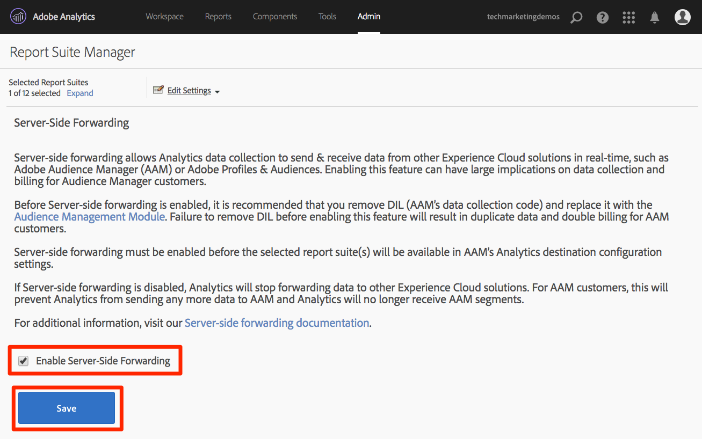

# Aggiungere Adobe Audience Manager

Questa lezione illustra i passaggi necessari per abilitare Adobe Audience Manager tramite Server-Side Forwarding.

[Adobe Audience Manager](https://docs.adobe.com/content/help/it-IT/experience-cloud/user-guides/home.translate.html) (AAM) offre servizi leader di settore per la gestione online dei dati di audience, fornendo agli inserzionisti digitali e agli editori gli strumenti necessari per controllare e sfruttare le risorse dati per favorire il successo delle vendite.

>[!NOTE]
>
>Adobe Experience Platform Launch viene integrato in Adobe Experience Platform come suite di tecnologie per la raccolta dati. Nell’interfaccia sono state introdotte diverse modifiche terminologiche di cui tenere conto durante l’utilizzo di questo contenuto:
>
> * Il platform launch (lato client) è ora **[[!DNL tags]](https://experienceleague.adobe.com/docs/experience-platform/tags/home.html?lang=it)**
> * Lato server di platform launch è ora **[[!DNL event forwarding]](https://experienceleague.adobe.com/docs/experience-platform/tags/event-forwarding/overview.html)**
> * Le configurazioni Edge sono ora **[[!DNL datastreams]](https://experienceleague.adobe.com/docs/experience-platform/edge/fundamentals/datastreams.html?lang=it)**

## Finalità di apprendimento

Alla fine di questa lezione, potrai:

1. Descrivere i due modi principali per implementare Audience Manager in un sito web.
1. Aggiungere Audience Manager tramite Server-Side Forwarding del beacon Analytics.
1. Convalidare l’implementazione di Audience Manager.

## Prerequisiti 

Per completare questa lezione, è necessario:

1. Per aver completato le lezioni in [Configurare i tag](create-a-property.md), [Aggiungi Adobe Analytics](analytics.md)e [Aggiungere il servizio Identity](id-service.md).

1. Aver effettuato l’accesso come admin ad Adobe Analytics, così da poter abilitare Server-Side Forwarding per la suite per report che stai utilizzando per questa esercitazione. In alternativa, puoi chiedere a un amministratore esistente nella tua compagnia di farlo, seguendo le istruzioni di seguito.

1. L’“Audience Manager Subdomain” (noto anche come “Partner Name” “Partner ID” o “Partner Subdomain”). Se hai già implementato Audience Manager sul tuo sito web, il modo più semplice per ottenere questo risultato è passare al sito web effettivo e aprire Debugger. Il sottodominio è disponibile nella scheda Riepilogo, nella sezione Audience Manager:

   

Se Audience Manager non è già stato implementato, segui queste istruzioni per [ottenere il tuo sottodominio di Audience Manager](https://experienceleague.adobe.com/docs/audience-manager-learn/tutorials/web-implementation/how-to-identify-your-partner-id-or-subdomain.html).

## Opzioni di implementazione

Sono disponibili due modi per implementare Audience Manager in un sito web:

* **Server-Side Forwarding (SSF)** - per i clienti con Adobe Analytics, è il metodo più semplice e consigliato per l’implementazione. Adobe Analytics inoltra i dati a AAM sul backend di Adobe, consentendo una richiesta in meno sulla pagina. Ciò consente anche di abilitare le funzionalità di integrazione chiave e di conformarle alle best practice per l’implementazione e la distribuzione del codice di Audience Manager.

* **Client-Side DIL** - questo approccio è pensato per i clienti che non hanno Adobe Analytics. DIL Code (Data Integration Library Code, codice di configurazione JavaScript AAM) invia dati direttamente dalla pagina web ad Audience Manager.

Poiché hai già implementato Adobe Analytics in questa esercitazione, adesso distribuirai Audience Manager utilizzando il Server-Side Forwarding. Per una descrizione completa e un elenco dei requisiti per il Server-Side Forwarding, controlla la [documentazione](https://experienceleague.adobe.com/docs/analytics/admin/admin-tools/server-side-forwarding/ssf.html?lang=it) in modo da conoscere il funzionamento, il contenuto richiesto e la procedura di convalida.

## Abilitare Server-Side Forwarding

Esistono due passaggi principali per eseguire un’implementazione dell’SSF:

1. Attivare uno “switch” nell’Admin Console di Analytics per inoltrare i dati da Analytics ad Audience Manager *per suite per report*.
1. Posizionare il codice, che viene eseguito tramite tag. Affinché questo funzioni correttamente, è necessario che sia installata l’estensione del servizio Adobe Experience Platform Identity e l’estensione Analytics (in realtà *non* sarà necessaria l’estensione AAM, come illustrato di seguito).

### Abilitare Server-Side Forwarding in Analytics Admin Console

Per iniziare a inoltrare i dati da Adobe Analytics ad Adobe Audience Manager è necessaria una configurazione nell’Admin Console di Adobe Analytics. Effettua prima questo passaggio poiché potrebbero essere necessarie fino a quattro ore per iniziare a inoltrare i dati.

#### Abilitare SSF nell’Admin Console di Analytics

1. Accedi ad Analytics tramite l’interfaccia utente di Experience Cloud. Se non disponi dell’accesso come admin ad Analytics, dovrai rivolgerti al tuo amministratore Experience Cloud o Analytics affinché ti assegni l’accesso o completi questi passaggi al tuo posto.

   

1. Nella navigazione in alto di Analytics, scegli **[!UICONTROL Amministratore > Suite per report]** e, dall’elenco, seleziona (o effettua una selezione multipla) le suite per report da inoltrare ad Audience Manager.

   

1. Dalla schermata Suite per report e con le suite per report selezionate, scegli **[!UICONTROL Modifica impostazioni > Generale > Server-Side Forwarding]**.

   

   >[!WARNING]
   >
   >Come indicato sopra, per visualizzare questa voce di menu dovrai disporre delle facoltà di amministratore.

1. Una volta visualizzata la pagina Server-Side Forwarding, leggere le informazioni e selezionare la casella **[!UICONTROL Abilita Server-Side Forwarding]** per le suite per report.

1. Fai clic su **[!UICONTROL Salva]**

   

>[!NOTE]
>
>Poiché SSF deve essere abilitato tramite suite per report, non dimenticare di ripetere questo passaggio per le suite per report reali quando distribuisci SSF nella suite per report del sito effettivo.
>
>Inoltre, se l’opzione SSF è disattivata, per abilitare l’opzione dovrai mappare le suite per report alla tua organizzazione Experience Cloud. Questo è spiegato [nella documentazione](https://experienceleague.adobe.com/docs/analytics/admin/data-governance/gdpr-view-settings.html?lang=it).

Una volta completato questo passaggio e se hai abilitato il servizio Adobe Experience Platform Identity, i dati saranno inoltrati da Analytics ad AAM. Tuttavia, per completare il processo in modo che la risposta torni correttamente da AAM alla pagina (e ad Analytics tramite la funzione di Audience Analytics), devi completare quanto segue anche nei tag . Non preoccuparti, è una procedura incredibilmente facile.

### Abilitare Server-Side Forwarding nei tag

Questo è il secondo dei due passaggi per abilitare SSF. Hai già attivato l’opzione nell’Admin Console di Analytics e ora devi solo aggiungere il codice , che tipo di tag puoi utilizzare se selezioni semplicemente la casella di controllo a destra.

>[!NOTE]
>
>Per implementare l’inoltro lato server dei dati di Analytics in AAM, in realtà modificheremo/configureremo l’estensione Analytics nei tag, **not** l&#39;estensione AAM. L’estensione AAM è utilizzata esclusivamente per le implementazioni DIL lato client, per coloro che non dispongono di Adobe Analytics. Pertanto, i passaggi seguenti sono corretti quando ti inviano nell’estensione Analytics per effettuare questa configurazione.

#### Per abilitare SSF nei tag

1. Vai a **[!UICONTROL Estensioni > Installate]** e fai clic per configurare l’estensione Analytics.

   

1. Espandi la sezione `Adobe Audience Manager`.

1. Seleziona la casella per **[!UICONTROL condividere automaticamente i dati di Analytics con Audience Manager]**. Questo aggiungerà il “modulo” di Audience Manager (codice) all’implementazione `AppMeasurement.js` di Analytics.

1. Aggiungi “Audience Manager Subdomain” (noto anche come “Partner Name” “Partner ID” o “Partner Subdomain”). Segui queste istruzioni per [ottenere il tuo sottodominio Audience Manager](https://experienceleague.adobe.com/docs/audience-manager-learn/tutorials/web-implementation/how-to-identify-your-partner-id-or-subdomain.html).

1. Fai clic su **[!UICONTROL Salva nella libreria e genera]**

   

Il codice di Server-Side Forwarding adesso è implementato.

### Convalida Server-Side Forwarding

Il modo principale per verificare che Server-Side Forwarding sia in esecuzione, consiste nell’esaminare la risposta a qualsiasi hit di Adobe Analytics. Ce ne occuperemo tra un minuto. Nel frattempo, esaminiamo alcuni altri elementi che possono rassicurarci che tutto funzioni correttamente.

#### Verificare che il codice sia caricato correttamente

Il codice installato dai tag per gestire l&#39;inoltro, e in particolare la risposta da AAM alla pagina, è denominato Audience Manager &quot;Modulo&quot;. Possiamo utilizzare Experience Cloud Debugger per assicurarci che sia stato caricato.

1. Apri il sito Luma.
1. Fai clic sull’icona del debugger nel browser per aprire Experience Cloud Debugger.
1. Nella scheda Riepilogo, scorri verso il basso fino alla sezione Analytics.
1. Verifica che **Gestione dell&#39;audience** sia elencato nella sezione Moduli.

   

#### Verificare l’ID Partner nel debugger

Quindi, possiamo anche verificare che il debugger stia rilevando l’ID partner corretto (sottodominio partner, ecc.) dal codice.

1. Sempre nel debugger e sempre nella scheda Riepilogo, scorri verso il basso fino alla sezione Audience Manager.
1. Verifica il tuo Partner ID/Subdomain in “Partner”.

   

>[!WARNING]
>
>Potresti notare che la sezione Audience Manager del debugger fa riferimento a “DIL”, che è la “Data Integration Library”, e in genere si riferisce a un’implementazione lato client, invece dell’approccio lato server che abbiamo implementato qui. La verità è che il “modulo” AAM (utilizzato in questo approccio SSF) utilizza in larga misura il medesimo codice della libreria DIL lato client, quindi il debugger sta attualmente segnalando tale codice. Se hai seguito i passaggi descritti in questa esercitazione e gli altri elementi di questa sezione di convalida sono corretti, assicurati che il server-side forwarding funzioni.

#### Verificare la richiesta e la risposta di Analytics

Questo è il punto importante. Se non esegui il server-side forwarding dei dati da Analytics ad Audience Manager, allora non esiste alcuna risposta al beacon di Analytics (oltre a un pixel 2x2). Tuttavia, se esegui SSF, vi sono elementi che puoi verificare nella richiesta e nella risposta di Analytics che ti informeranno del corretto funzionamento.
Purtroppo, al momento, Experience Cloud Debugger non supporta la visualizzazione della risposta ai beacon. Pertanto, devi utilizzare un altro debugger/packet sniffer, come Charles Proxy o i Developer Tools del browser.

1. Apri i Developer Tools nel browser e vai alla scheda Network (Rete).
1. Nel campo del filtro, digita `b/ss` che limiterà il contenuto visualizzato alle richieste di Adobe Analytics
1. Aggiorna la pagina per visualizzare la richiesta di Analytics

   

1. Nel beacon di Analytics (richiesta), cerca un parametro “callback”. Sarà impostato su qualcosa di simile a questo: `s_c_il[1].doPostbacks`

   

1. Riceverai una risposta al beacon Analytics. Conterrà riferimenti a doPostback, come da richiesta, e soprattutto, dovrebbe contenere un oggetto “stuff”. In questo caso gli ID del segmento AAM vengono rimandati al browser. Se disponi dell’oggetto “stuff”, SSF funziona.

   

>[!WARNING]
>
> Attenzione alle false operazioni riuscite - Se ricevi una risposta e tutto sembra funzionare, assicurati **di disporre** dell’oggetto “stuff”. In caso contrario, potresti visualizzare un messaggio nella risposta che indica come “status”:“SUCCESS”. Per quanto sembri folle, questa è la prova che **NON** funziona correttamente. Questo significa che hai completato questo secondo passaggio (il codice nei tag), ma che l’inoltro nell’Admin Console di Analytics (primo passaggio di questa sezione) non è ancora stato completato. In questo caso devi verificare di aver attivato SSF nell’Admin Console di Analytics. Se lo hai abilitato da non più di 4 ore, attendi.

[Avanti “Integrazioni di Experience Cloud” >](integrations.md)
